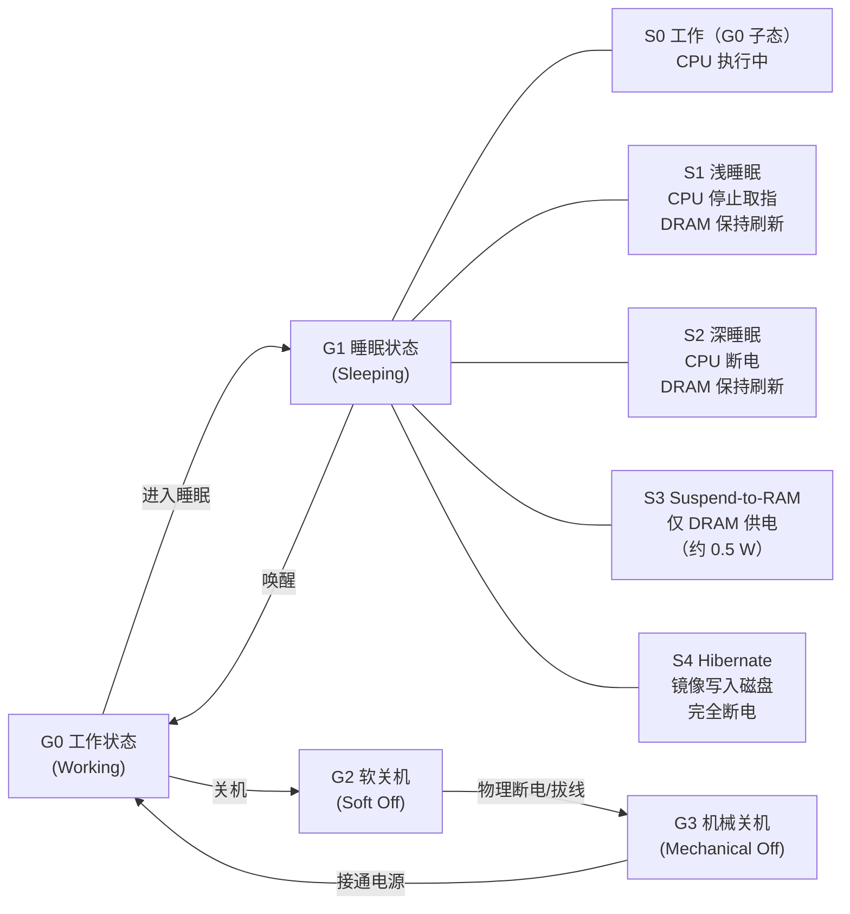
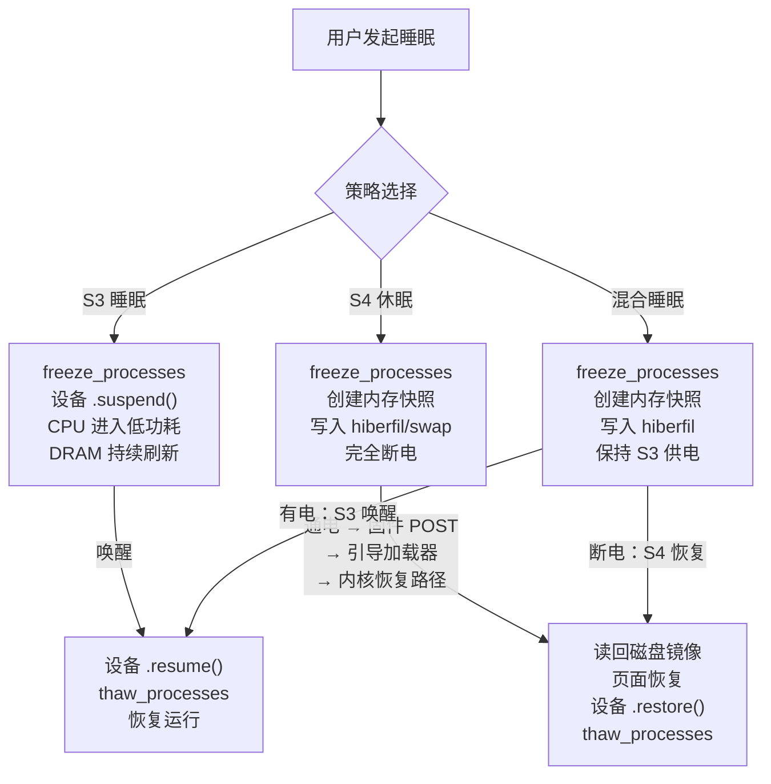

# 休眠与恢复：S4 与 hiberfil

> [!abstract] TL;DR
> ACPI S4（Hibernate）将整个内存镜像压缩后写入磁盘（Windows 为 `hiberfil.sys`，Linux 为 swap 分区/文件），然后完全断电。恢复时固件把控制权交还给内核，内核从磁盘读回镜像、解压、恢复进程与设备状态，从而在无电力消耗的前提下实现"恢复到断电前状态"。与 S3（Suspend-to-RAM）的关键区别：S4 断电彻底但恢复慢（需磁盘 I/O），S3 保电快但耗待机电量。Windows Fast Startup（混合关机）是 S4 的变体，仅休眠内核会话而非完整用户会话。休眠镜像含明文内存页，需配合 BitLocker/dm-crypt 才能防止离线取证。

---

## 概述与定位

在《操作系统加载与启动》系列的前 16 篇中，我们完整走过了从加电、固件、引导扇区、引导加载器、CPU 模式切换、内核解压、内存管理，到 Android/iOS 启动链的完整路径。**第 17 篇专注于一条"特殊的重启捷径"**——休眠（Hibernate）。

休眠不是普通的关机，也不是传统的睡眠：它是一种把内存内容完整"快照"到非易失性存储介质、然后彻底断电、再在下次开机时"回放"该快照的机制。其核心价值在于：

- **零待机功耗**：与 S3（DRAM 持续刷新耗电）不同，S4 阶段 DRAM 可以完全断电，整机与真正关机一样省电。
- **恢复速度显著快于冷启动**：跳过了内核初始化、设备枚举、文件系统挂载、用户空间启动等阶段，直接从镜像恢复到工作状态。对于 RAM 16 GB、镜像压缩比约 2:1 的系统，恢复通常在 10~30 秒内完成（NVMe SSD），而冷启动到登录桌面往往需要 30~60 秒。
- **状态完整性**：所有打开的文档、网络连接状态（重连后可恢复的部分）、正在运行的程序都能回到休眠前的状态。

### ACPI 全局电源状态体系

理解休眠必须先理解 ACPI（Advanced Configuration and Power Interface）定义的电源状态模型。



| 状态 | 名称 | 内存供电 | CPU | 恢复时间 | 典型功耗 |
|---|---|---|---|---|---|
| S0 | Working | 是 | 运行 | — | 满载至空闲（5~80 W） |
| S1 | Power on Suspend | 是 | 停止取指 | ~1 s | ~2 W |
| S2 | CPU Off | 是（CPU 断电） | 断电 | ~2 s | ~1 W |
| S3 | Suspend-to-RAM | 是（仅 DRAM） | 断电 | 2~5 s | 0.3~1 W |
| S4 | Hibernate | 否（镜像在磁盘） | 断电 | 10~60 s | ~0 W（真正关机） |
| S5 | Soft Off | 否 | 断电 | 需冷启动 | <0.5 W（待机电源） |

> [!note] S1/S2 的现实处境
> 现代硬件（尤其 Intel 2015 年后的平台）已大幅淘汰 S1/S2，实践中主要区分 S0ix（Connected Standby/Modern Standby，Intel 引入的 S0 低功耗子态）、S3 和 S4。Windows 平台从 Windows 8 起引入 Modern Standby（S0ix），部分 OEM 已不暴露 S3 选项。

---

## 原理与机制

### S3 vs S4 vs 混合睡眠的本质差异

**S3（Suspend-to-RAM）**：内核调用 `freeze_processes()` 冻结用户空间进程，通过设备 PM 回调（`->suspend()`）暂停设备，最终把 CPU 置于低功耗状态，但 DRAM 持续刷新保存数据。恢复时 DRAM 内容完整，几乎是"原地复活"。

**S4（Hibernate）**：在 S3 的冻结基础上，额外执行一次"内存快照"步骤——把需要保存的内存页序列化写入磁盘，然后调用固件接口切换到 S4/G2 状态，切断 DRAM 供电。下次通电时固件完成 POST、引导加载器把控制权交还给内核（或直接跳转到休眠恢复路径），内核读回磁盘镜像、解压、将页面恢复到原始物理地址，再逐步解冻设备和进程。

**混合睡眠（Hybrid Sleep）**：Windows 中的折衷方案——执行 S4 的镜像保存步骤（写入 `hiberfil.sys`），但不切断 DRAM 供电，而是进入 S3 状态。如果电力充足，恢复从 S3 路径完成（快，约 3~5 秒）；如果电池耗尽导致 DRAM 断电，则退化为 S4 恢复路径（慢，但不丢失状态）。这是笔记本电脑的理想策略：快速唤醒的同时有断电保险。



### 休眠镜像中保存什么

休眠并非把全部物理内存都写入磁盘——那会使镜像等于 RAM 大小，写入时间过长。内核有明确的策略：

**必须保存（不可重建的数据）**：
- 所有进程的用户空间内存页（代码段虽然可以重新从文件映射，但恢复速度考虑通常也包含）
- 内核数据结构（进程描述符、VMA 树、文件表、套接字缓冲区等）
- 设备驱动私有状态（已通过 `->freeze()` 保存在内核堆中的硬件寄存器快照）
- 内核堆、内核栈

**不需要保存（可以重建）**：
- 磁盘缓冲区（Page Cache 中干净的页，重建时可从磁盘重新读取）
- 匿名页中未被使用的零页
- 设备硬件本身的寄存器（在恢复时通过 `->restore()` 重新初始化）

Linux swsusp 的保存策略：仅保存 `saveable` 页面（标记了 `__GFP_SAVEABLE` 或在进程/内核数据区的页），跳过 page cache 中的干净页（`PageDirty` 未设置且有磁盘后备），以此大幅减小镜像。实践中，32 GB RAM 的系统休眠镜像通常在 8~16 GB 范围内（含压缩）。

### 镜像压缩

无论 Windows 还是 Linux，休眠镜像都会在写入前压缩：

- **Windows**：使用基于 LZ77 的 Xpress 压缩（Windows 8 引入，替代早期无压缩方案）。`hiberfil.sys` 文件头包含压缩类型标志，恢复时内核直接解压读取。压缩比通常 2:1~4:1（取决于内存内容，代码段和结构化数据压缩率高，加密或随机数据接近 1:1）。
- **Linux**：`swsusp` 支持 LZO、LZ4（默认）、zstd 等算法，通过 `COMPRESSION_ALGO` 内核配置选项或 `uswsusp` 的 `s2disk` 工具配置，LZ4 在速度与压缩比之间取得较好平衡。

---

## 结构/算法/伪代码详解

### Windows hiberfil.sys 文件格式

`hiberfil.sys` 是一个特殊的系统文件，位于 Windows 系统盘根目录，属性为隐藏+系统+不可压缩（防止 NTFS 压缩干扰休眠恢复时的随机读）。其大小在系统初始化时预分配（`HKLM\SYSTEM\CurrentControlSet\Control\Session Manager\Memory Management\HiberFileSizePercent` 控制百分比，默认 75% 的物理内存，Windows 10+ 可能使用 40%～100%）。

**hiberfil.sys 逻辑结构（简化）**：

```
hiberfil.sys 磁盘布局：
┌─────────────────────────────────┐
│  PO_MEMORY_IMAGE Header          │  ← 标志、版本、魔数 "HIBR"/"RSTR"
│  · Signature: "HIBR"（休眠中）  │
│  ·          : "RSTR"（恢复后）  │
│  · SystemTime (休眠时间戳)      │
│  · ResumeContext                │  ← 恢复入口物理地址
│  · NumPagesForLoader            │
│  · FirstTablePage（页表首页）   │
├─────────────────────────────────┤
│  Page Table Pages                │  ← 每页包含 "PageRun" 描述符数组
│  （每个描述符描述一段连续压缩数据）│  
│  · PageRun.CompressedSize       │
│  · PageRun.RealPage（目标物理页帧）│
├─────────────────────────────────┤
│  Compressed Data Blocks          │  ← Xpress/LZ77 压缩块
│  Block 0: CompressedData[0..n]  │
│  Block 1: CompressedData[...]   │
│  ...                            │
├─────────────────────────────────┤
│  Kernel Processor Context        │  ← CPU 寄存器快照（CR3、RSP、RIP 等）
│  （每个逻辑处理器一份）          │
└─────────────────────────────────┘
```

关键字段：

| 字段 | 含义 |
|---|---|
| `Signature` | `HIBR` 表示休眠正常写入完成（恢复时检查），恢复完成后改为 `RSTR` 防止再次恢复 |
| `ResumeContext` | 恢复内核的物理入口地址（`HiberPtPhysicalAddress`） |
| `FirstTablePage` | 指向第一张"页运行表"的物理页帧号 |
| `NumPagesForLoader` | 引导程序阶段需要分配的物理页数量 |

**恢复时引导加载器（Boot Manager）的角色**：Windows Boot Manager（`bootmgr` 或 `bootmgfw.efi`）在 POST 后检测到 `hiberfil.sys` 的 `Signature == HIBR`，即切换到休眠恢复路径，调用 Winload.exe 或 Winresume.exe，后者负责：
1. 建立临时身份映射页表；
2. 从 `hiberfil.sys` 读取压缩块；
3. 解压并将页面写回原始物理地址；
4. 加载处理器上下文；
5. 跳转到内核的 `PoSystemHiberReturnToSleep()` 继续执行（不走正常 `ntoskrnl.exe` 的 `KiSystemStartup` 路径）。

### Windows Fast Startup（混合关机）

Fast Startup（快速启动）不是 S4 的完整版本，而是一种"混合关机"：用户注销（用户会话终止，用户 hive 从注册表卸载），但内核会话（驱动、内核数据结构）被保存到 `hiberfil.sys`，然后机器完全断电。下次开机：固件 POST → 引导加载器发现 `hiberfil.sys` 中有内核会话快照 → 恢复内核 → 加载用户登录界面（无需重新初始化所有驱动和服务）。

Fast Startup 的**关键区别**：
- 不保存用户会话（所有用户进程已正常终止），因此开机后是全新用户登录，而非恢复之前的工作状态；
- 恢复速度介于 S4 完整休眠恢复和冷启动之间；
- 可能导致双启动环境下 Linux 看到的 NTFS 分区处于"脏"状态（因 Windows 的文件系统未完全卸载），Linux 挂载时需加 `-o remove_hiberfile` 或等待 Windows 完整关机。

```
完整 S4 休眠：
  [内核会话 + 用户会话] → hiberfil.sys → 完全断电
  恢复：hiberfil.sys → 内核 + 用户进程回到休眠前状态

Fast Startup（混合关机）：
  用户注销 → [仅内核会话] → hiberfil.sys → 完全断电
  开机：hiberfil.sys → 内核恢复 → 新用户登录（非恢复）
```

### Linux 休眠路径（swsusp/uswsusp）

Linux 的休眠基础设施主要由 `kernel/power/` 目录实现，核心流程如下：

**休眠写入流程（伪代码）**：

```c
// 用户写入 /sys/power/state = "disk"（或 "freeze"/"mem"）
// 内核 hibernate() 函数（kernel/power/hibernate.c）

int hibernate(void) {
    // 1. 同步文件系统，刷脏页
    ksys_sync_helper();

    // 2. 冻结用户进程（freeze_processes）
    //    → 给所有进程发 TIF_FREEZE 标志
    //    → 进程在下次调度点进入 __refrigerator() 休眠
    //    → 等待所有进程进入冻结状态
    freeze_processes();

    // 3. suspend_console()：停止控制台输出（防止并发写驱动）
    suspend_console();

    // 4. 调用设备 PM 回调：prepare → freeze
    //    → 每个设备驱动的 dev->driver->pm->freeze(dev) 被调用
    //    → 驱动将硬件寄存器状态保存到驱动私有结构
    dpm_freeze();

    // 5. 创建内存快照（swsusp_save）
    //    → 分配 safe pages 用于存储 PA→数据映射
    //    → 标记所有 saveable 页面
    //    → 建立 page_copy 链表：(源物理地址, 数据指针)
    swsusp_save();

    // 6. 解冻设备（临时，以便使用磁盘 I/O）
    dpm_thaw();
    resume_console();
    thaw_kernel_threads();  // 内核线程解冻，用于磁盘写入

    // 7. 将镜像写入 swap 分区/文件（swsusp_write）
    //    → 压缩（LZ4/LZO/zstd）
    //    → 写入 swap 设备头部特殊标记（SWAPMAGIC）
    //    → 写入 page_copy 链表描述的页面数据
    swsusp_write(flags);

    // 8. 再次冻结设备，准备断电
    suspend_console();
    dpm_freeze();

    // 9. 调用固件/ACPI 接口进入 S4 状态
    //    → ACPI: acpi_sleep_state_supported(ACPI_STATE_S4)
    //    → 写 PM1_CNT 寄存器触发 S4 转换
    //    → 平台断电（若有 hibernate-on-disk，也可 CPU 重置）
    hibernation_platform_enter();  // ← 不再返回

    // 若 hibernate_enter 失败，回到此处
    dpm_restore();
    thaw_processes();
    return error;
}
```

**恢复读取流程（伪代码）**：

```c
// 内核启动早期，检测 resume= 命令行参数
// 在 start_kernel() → rest_init() → kernel_init() 路径中：

void __init load_default_modules(void) {
    // 检查 /sys/power/resume 配置的 swap 设备
    // 调用 swsusp_check() 验证 swap 头部魔数
    if (swsusp_check() == 0) {
        // 找到有效镜像，进入恢复路径
        hibernate_resume();
    }
}

int hibernate_resume(void) {
    // 1. 冻结进程（此时用户空间尚未完全启动，但内核线程需冻结）
    freeze_processes();
    suspend_console();

    // 2. 调用设备驱动 .freeze_noirq()（最深层冻结，关中断）
    dpm_freeze_noirq();

    // 3. 读取镜像（swsusp_read）
    //    → 从 swap 设备读压缩块
    //    → 解压到 page_copy 中间缓冲区
    swsusp_read(&flags);

    // 4. 恢复内存页（swsusp_restore）
    //    → 把 page_copy 中的数据写回原始物理地址
    //    → 此步需要临时恒等映射（identity mapping）
    //       防止写入自身页表时破坏当前执行上下文
    swsusp_restore();  // ← 执行后内存已恢复到休眠时状态

    // 5. 调用设备驱动 .restore_noirq() → .restore()
    //    → 驱动从私有结构恢复硬件寄存器
    //    → 设备重新进入工作状态
    dpm_restore_noirq();
    dpm_restore();

    // 6. resume_console()，恢复控制台
    resume_console();

    // 7. 解冻进程（thaw_processes）
    //    → 进程退出 __refrigerator()，恢复调度
    thaw_processes();

    return 0;  // 恢复完成，系统继续运行
}
```

### 关键的身份映射（Identity Mapping）技巧

`swsusp_restore()` 在将页面写回物理地址时面临一个经典的"自我修改"问题：如果恢复代码本身运行在某个物理地址 X，而镜像中恰好有数据需要写入地址 X，直接写入会破坏正在执行的代码。

解决方案：

1. **safe pages**：在快照阶段，将恢复代码和它将用到的所有数据结构放置在"安全物理页"——这些页在镜像中不存在需要被覆盖的对应条目（因为原始镜像中这些地址存的是中间缓冲区，而非进程数据）；
2. **两阶段写回**：先将镜像数据解压到中间缓冲区，再从中间缓冲区逐页写回目标物理地址，最后跳转到恢复蹦床（trampoline），蹦床再修复最后几页。

Linux 的实现在 `arch/x86/power/hibernate_64.c` 中，核心是 `restore_image()` 函数，它在 `swsusp_page_table` 建立的临时页表下运行，用汇编逐页拷贝，最后 `jmp` 回到内核的恢复入口。

### /sys/power/ 接口详解

Linux 通过 sysfs 暴露电源管理接口：

```bash
# 查看支持的休眠后端
cat /sys/power/disk
# 输出示例：[platform] shutdown reboot suspend test_resume

# 查看支持的睡眠状态
cat /sys/power/state
# 输出示例：freeze mem disk

# 配置恢复设备（swap 分区或文件）
# resume= 内核参数（grub 配置）：
# GRUB_CMDLINE_LINUX="resume=/dev/sda2"
# 或对 swap 文件：
# GRUB_CMDLINE_LINUX="resume=/dev/sda1 resume_offset=12345"
cat /sys/power/resume         # 显示当前配置的恢复设备
echo "8:2" > /sys/power/resume  # 动态设置（主:次设备号）

# 触发休眠
echo disk > /sys/power/state

# 查看压缩算法
cat /sys/power/image_size     # 目标镜像大小上限（字节，0=无上限）
cat /sys/power/snapshot_type  # 快照类型（platform/shutdown 等）
```

**swap 文件的 `resume_offset` 计算**：

swap 文件不从文件系统偏移 0 开始（受文件碎片影响），内核需要 swap 文件中第一个 swap 页相对于所在块设备的块号：

```bash
# 计算 swap 文件的 resume_offset（filesys 块大小对齐）
filefrag -v /swapfile | awk 'NR==4 {print $4}' | sed 's/\.\.//'
# 或使用 swap-offset 工具：
swap-offset /swapfile
```

---

## 工具视角与实战

### Windows 端：powercfg 与 hiberfil.sys 管理

```cmd
:: 查看当前休眠状态
powercfg /availablesleepstates

:: 启用/禁用休眠（会创建/删除 hiberfil.sys）
powercfg /hibernate on
powercfg /hibernate off

:: 查看 hiberfil.sys 大小比例（默认 75%）
powercfg /setacvalueindex SCHEME_CURRENT SUB_SLEEP HIBERNATEIDLE 0

:: 设置 hiberfil.sys 占物理 RAM 的比例（例如 50%）
powercfg /h /size 50

:: 强制立即休眠
shutdown /h

:: 查看睡眠诊断
powercfg /sleepstudy
powercfg /energy
```

**Fast Startup 管理**：

```
控制面板 → 电源选项 → 选择电源按钮的功能 → 关机设置
→ "启用快速启动（推荐）" 复选框
```

或注册表：`HKLM\SYSTEM\CurrentControlSet\Control\Session Manager\Power\HiberbootEnabled`（1=启用，0=禁用）

**双启动用户注意**：若需在 Linux 下挂载 Windows NTFS 分区且 Windows 启用了 Fast Startup，必须先在 Windows 完全关机（禁用 Fast Startup 或以 `shutdown /s /f /t 0` 强制完整关机），否则 Linux 的 `ntfs-3g` 会拒绝读写挂载（或挂载后数据不一致）：

```bash
# Linux 下检查 Windows 分区是否处于 hibernation 状态
dmesg | grep -i ntfs
# 若看到 "Windows is hibernated, refused to mount" → 需先完整关机 Windows
mount -o remove_hiberfile /dev/nvme0n1p3 /mnt/windows  # 强制清除（会丢失 Windows 快速恢复状态）
```

### Linux 端：pm-utils / systemd 休眠

```bash
# systemd 方式（现代推荐）
systemctl hibernate          # S4 完整休眠
systemctl suspend            # S3 睡眠
systemctl hybrid-sleep       # 混合睡眠（S3+S4 写入）
systemctl suspend-then-hibernate  # 先 S3，超时后转 S4

# 配置 suspend-then-hibernate 的超时时间
# /etc/systemd/sleep.conf
[Sleep]
HibernateDelaySec=60min   # S3 进入 60 分钟后若仍未唤醒则转 S4

# 验证镜像是否存在（swap）
swapon --show
free -h  # 确认 swap 大小 >= 需要保存的内存

# 查看内核是否支持休眠
cat /sys/power/state  # 必须包含 "disk"

# 调试：检查内核休眠日志
dmesg | grep -i hibernat
journalctl -b -1 | grep -i hibernat  # 上次启动日志
```

**设置 swap 文件用于休眠（Ubuntu/Fedora 示例）**：

```bash
# 创建 swap 文件（需与 RAM 相当大小）
fallocate -l 16G /swapfile
chmod 600 /swapfile
mkswap /swapfile
swapon /swapfile

# 写入 /etc/fstab 永久生效
echo '/swapfile none swap sw 0 0' >> /etc/fstab

# 获取 swap 文件的块设备和偏移
ROOT_DEV=$(findmnt -no UUID -T /swapfile)
RESUME_OFFSET=$(filefrag -v /swapfile | awk '/0:/ {print $4}' | head -1 | tr -d '.')

# 在 /etc/default/grub 中添加内核参数
# GRUB_CMDLINE_LINUX="resume=UUID=${ROOT_DEV} resume_offset=${RESUME_OFFSET}"
update-grub  # 更新 grub 配置
```

### 分析 hiberfil.sys：hibernation 取证工具

```bash
# volatility3 分析 Windows 休眠镜像
# （先将 hiberfil.sys 从 Windows 系统盘复制出来）
python3 vol.py -f hiberfil.sys windows.info
python3 vol.py -f hiberfil.sys windows.pslist
python3 vol.py -f hiberfil.sys windows.cmdline
python3 vol.py -f hiberfil.sys windows.malfind  # 检测恶意代码注入

# 或使用 Sandman 专用 hiberfil 工具
# sandman-decompress hiberfil.sys output.raw
# 再用标准内存取证工具分析 output.raw
```

### 监控休眠耗时

```bash
# Linux：使用 systemd-analyze
systemd-analyze  # 查看本次启动时间（若从 hibernate 恢复，会显示 resume 时间）

# 精确测量休眠写入速度
echo 1 > /proc/sys/kernel/printk  # 打开内核消息
echo disk > /sys/power/state
# 恢复后查看 dmesg 中的休眠统计
dmesg | grep "PM: hibernation"
# 示例（非真实输出）：
# PM: hibernation: Creating image of 4915200 pages (total 8912896 pages)
# PM: hibernation: Image saving progress: 95%
# PM: hibernation: Wrote 19661 MB of image data in 8.7 seconds (2260 MB/s)
```

---

## 安全性与正确使用

### 休眠镜像的取证攻击面

休眠镜像（`hiberfil.sys` 或 Linux swap 设备）是内存的完整"时间切片"，其安全含义非常重要：

**包含在镜像中的敏感数据**（若未加密）：

- 浏览器内存中的密码、Cookie、会话令牌
- 私钥（若在休眠前未从内存中清除）
- 数据库连接字符串、API 密钥
- 内存中处于解密状态的加密卷密钥（BitLocker Volume Master Key 在启用休眠且未正确配置时可能暴露）
- 正在运行的进程的完整堆内存（包括即时通讯消息、电子邮件内容等）

**取证场景**：攻击者或取证人员获取存储设备后，直接解析未加密的 `hiberfil.sys` 即可获得上述内容，无需系统运行。这等同于完整内存取证，且镜像静态存储在磁盘上，比冷启动攻击（Cold Boot Attack，从 DRAM 提取，需要快速物理操作）更容易实施。

**冷启动攻击（Cold Boot Attack）与 S3**：S3 睡眠期间 DRAM 持续通电，若攻击者能在唤醒前物理取走 DRAM（如向内存条喷冷却剂减缓数据衰减），可用专用读写设备提取 DRAM 中的加密密钥。S4 休眠后 DRAM 断电，数据残留时间极短（毫秒级），冷启动攻击窗口极小，但休眠镜像在磁盘上持续存在，反而是新的攻击面。

### 加密休眠：BitLocker 与 dm-crypt

**Windows BitLocker + S4**：

BitLocker 全盘加密时，卷加密密钥（FVEK）由 VMK（Volume Master Key）保护，VMK 可由以下任一方式解封：

- TPM（自动，绑定 PCR[0,2,4,7,11]）
- TPM + PIN
- 恢复密钥

当 BitLocker 启用且 TPM 正确配置时，`hiberfil.sys` 本身就位于加密卷上，休眠镜像与磁盘一起加密。恢复时，Winresume.exe 在解密 `hiberfil.sys` 之前首先需要从 TPM 解封 VMK（PCR 必须匹配），若启动路径被篡改（PCR 变化），TPM 拒绝解封，系统要求手动输入恢复密钥——从而阻止了针对休眠镜像的离线攻击。

但需注意以下风险场景：
- **仅 BitLocker To Go**（非系统卷加密）：系统卷 `hiberfil.sys` 可能未加密；
- **BitLocker 无 TPM（仅密码）**：内存中的密码在休眠期间存于镜像，理论上可提取；
- **VMK 缓存**：某些配置下 VMK 的中间形式可能在特定休眠状态中处于可提取状态（取决于 Windows 版本和配置）。

**Linux dm-crypt（LUKS）+ S4**：

正确配置下，Linux swap 分区/文件应位于加密卷上：

```
磁盘（物理）
└── LUKS 加密容器（/dev/sda2）
    └── dm-crypt 解密层（/dev/mapper/cryptroot）
        ├── 根文件系统（ext4/btrfs）
        └── swap 分区（/dev/mapper/cryptswap）← 休眠镜像写入此处
```

配置 LUKS 加密 swap 并支持休眠：

```bash
# /etc/crypttab 中声明加密 swap
cryptswap /dev/sda3 /dev/urandom swap,cipher=aes-xts-plain64,size=256

# 注意：随机密钥的加密 swap 每次重启密钥不同
# 若需休眠，必须使用固定密钥（与根分区同一 LUKS 容器，或单独 LUKS keyfile）
# 推荐：将 swap 放在根 LUKS 容器内的逻辑卷（LVM on LUKS）

# LVM on LUKS 方案：
# LUKS 容器 → 解密为 /dev/mapper/luks → pvcreate → LVM VG → LV root + LV swap
```

**systemd 的 TPM2 绑定（类似 BitLocker 效果）**：

```bash
# 将 LUKS 密钥绑定到 TPM2，绑定 PCR[0,2,4,7]（固件+引导路径）
systemd-cryptenroll --tpm2-device=auto \
    --tpm2-pcrs=0+2+4+7 \
    /dev/sda2

# 配置 /etc/crypttab 使用 TPM2 自动解锁
cryptroot /dev/sda2 - tpm2-device=auto,tpm2-pcrs=0+2+4+7
```

这样，休眠镜像（位于加密 swap 内）受 LUKS 加密保护，而 LUKS 密钥由 TPM 封存并绑定到启动链 PCR——若磁盘被盗，攻击者无法解密休眠镜像；若启动路径被篡改（PCR 变化），TPM 拒绝解封，同样无法自动解密。

### Secure Boot 与 S4 Resume

Secure Boot 对 S4 恢复路径同样生效：恢复内核（Winresume.exe / Linux 内核的恢复路径）必须是已签名的二进制，否则 UEFI 拒绝执行。这防止了以下攻击：

攻击者修改磁盘上的恢复加载程序，使其在恢复内存镜像时额外提取或修改内存内容。若 Secure Boot 未启用，此类攻击可绕过磁盘加密（因为恢复路径代码在加密解锁之前执行）。

**lockdown 与 hibernate 的交互**：

Linux 内核在 `lockdown = confidentiality` 模式下**禁止 hibernate**（因为休眠镜像可以离线分析内核内存，违反 confidentiality 目标）。`lockdown = integrity` 模式下默认也禁止休眠（可通过内核编译选项调整）。这意味着在 Secure Boot 启用且内核 lockdown 自动激活的系统上，需要显式允许休眠（修改 lockdown 策略或使用 TPM 封存的镜像加密）。

```bash
# 查看 lockdown 是否阻止 hibernate
cat /sys/kernel/security/lockdown
# integrity 或 confidentiality 时，/sys/power/state 中可能不显示 "disk"

# 临时解除（调试用，不建议生产）
echo none > /sys/kernel/security/lockdown  # 需内核支持且有 root 权限
```

### 镜像完整性：防止篡改休眠镜像

若攻击者能在休眠期间修改磁盘上的镜像（写入虚假内存页），恢复后内核会在篡改过的内存中运行——这是一种隐蔽的代码注入攻击。防御方案：

- **加密 + 完整性验证（AEAD）**：使用 dm-integrity 或 LUKS2 的完整性模式（`--integrity hmac-sha256`）为加密卷附加 HMAC，篡改任何页面都会导致 HMAC 验证失败，内核在解密时即发现并拒绝；
- **TrustZone/TEE 保护**：部分移动平台在安全世界中持有镜像加密密钥，普通世界（Normal World）无法直接接触。

---

## 小结

本篇完整覆盖了 ACPI 电源状态体系、S3/S4/混合睡眠的本质差异与适用场景、Windows `hiberfil.sys` 的文件格式与恢复机制、Linux swsusp/uswsusp 的内核实现路径（freeze → snapshot → write → 断电 → 固件POST → resume → thaw），以及 Fast Startup（混合关机）的工作原理。

在安全维度，休眠镜像是一个容易被忽视的攻击面：它把整个内存时间切片持久化到磁盘，若无加密保护则等同于完整内存取证。BitLocker + TPM PCR 绑定和 Linux LUKS2 + systemd-cryptenroll 是两套对应的纵深防御方案，Secure Boot 则确保恢复路径代码不被篡改，Linux lockdown 模式在更严格的场景下甚至直接禁止 hibernate 以消除攻击面。

**核心要点速查**：

| 主题 | 要点 |
|---|---|
| ACPI 状态 | S0 运行 / S3 内存保电 / S4 磁盘镜像 / S5 软关机；S4 完全断电 |
| S3 vs S4 | S3 快（2~5 s）耗待机电量；S4 慢（10~60 s）零待机功耗 |
| 混合睡眠 | 写 hiberfil + 保持 S3 供电；电池耗尽退化到 S4 恢复 |
| hiberfil.sys | 魔数 HIBR/RSTR；Xpress 压缩；ResumeContext 指向恢复入口 |
| Fast Startup | 仅保存内核会话（非用户会话）；双启动需注意 NTFS 脏状态 |
| Linux 休眠 | `/sys/power/state = disk`；swap 分区/文件；`resume=` 内核参数 |
| 恢复路径 | 身份映射 + safe pages 解决恢复代码自我覆盖问题 |
| 压缩 | Windows: Xpress/LZ77；Linux: LZ4/LZO/zstd（可配） |
| 取证风险 | 未加密镜像 = 完整内存取证；密钥/会话令牌全暴露 |
| 防御方案 | BitLocker/LUKS2 + TPM PCR 绑定 + Secure Boot + dm-integrity |
| Secure Boot & S4 | 恢复加载器必须已签名；lockdown = integrity 时默认禁止 hibernate |

---

## 相关阅读

- [[00.操作系统加载与启动总览]]（系列全景，休眠处于启动路径的"旁路分支"）
- [[02.BIOS与UEFI固件]]（固件 POST 与 S4 恢复握手的基础）
- [[06.内核解压与早期初始化]]（正常冷启动与 S4 恢复路径的分叉点）
- [[13.可信启动与启动安全]]（Secure Boot / TPM PCR 绑定与休眠安全的关联）
- [[16.Android启动链AVB与vbmeta]]（移动平台的 dm-verity 与休眠保护策略）
- [[18.kexec与kdump崩溃转储]]（另一种"不走正常启动路径"的内核跳转机制）

---

[[00.操作系统加载与启动总览|⬆ 系列总览]] | [[16.Android启动链AVB与vbmeta|← 上一章]] | [[18.kexec与kdump崩溃转储|→ 下一章]]
