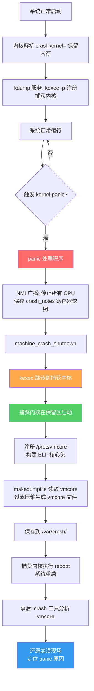

---
tags:
  - 操作系统
  - 启动
  - tier3
  - kexec
  - kdump
---
# kexec 与 kdump 崩溃转储

> [!abstract] TL;DR
> kexec 是一种绕过固件/BIOS 直接在内核态加载并跳转到新内核的机制，使系统重启无需经历 POST 阶段，显著加快重启速度。kdump 则在 kexec 基础上构建：在系统崩溃（kernel panic）时，由预先注册的 kexec 目标——一个独立的"捕获内核"——接管执行，将崩溃内核的完整内存映像以 ELF core 格式通过 `/proc/vmcore` 导出，再用 `makedumpfile` 压缩过滤后保存为 vmcore 文件，最后用 `crash` 工具离线分析。两者共同构成 Linux 生产环境中内核热重启与崩溃诊断的核心基础设施。

## 概述与定位

### 为什么需要 kexec

传统计算机重启流程需要经历完整的 POST（Power-On Self-Test）、固件初始化、内存检测、设备枚举等阶段，这些步骤在现代服务器上往往耗时数分钟甚至更长。对于需要频繁更新内核的开发环境、要求快速恢复的生产服务器，以及云原生场景下大量虚拟机的协调重启，这种开销不可接受。

kexec（kernel execute）的核心思想是：既然当前内核已经完成了所有硬件初始化和内存探测，何不直接让它充当下一个内核的"引导加载器"？kexec 将新内核镜像加载到内存的安全区域，设置好必要的寄存器状态，然后直接跳转过去，完全绕过固件层。这样从执行 `reboot` 到新内核开始运行，整个过程可以缩短到几秒之内。

### kdump 的定位

kdump 是 kexec 最重要的应用场景之一，专门用于内核崩溃调试。其工作原理是：

1. 系统正常运行时，预先为"捕获内核"（capture kernel）保留一块物理内存区域（通过 `crashkernel=` 内核参数指定）
2. 同时向当前内核注册 kexec 目标，指向这个捕获内核
3. 当内核发生 panic 时，panic 处理程序触发 kexec 跳转到捕获内核
4. 捕获内核启动后，崩溃内核的内存仍然完好地保存在保留区之外的物理地址上
5. 通过 `/proc/vmcore` 接口，可以像读取普通 ELF core 文件一样访问整个崩溃内核的内存
6. `makedumpfile` 将其压缩过滤保存为 vmcore 文件
7. 事后用 `crash` 工具分析 vmcore，还原崩溃现场

这套机制的关键优势在于：捕获内核运行在干净的环境中，不受崩溃事件的影响，因此能可靠地保存内存转储而不会二次崩溃。

### 历史沿革

kexec 最初由 Eric Biederman 在 2002 年实现，2004 年合并进 Linux 2.6.13 主线。kdump 由 Vivek Goyal 等人在 2005 年前后开发，最终在 2.6.20（2007 年）成为主线功能。如今 kdump 已是 RHEL、SLES、Ubuntu LTS 等主流发行版的标准配置，几乎所有企业 Linux 系统在出厂时都会默认启用。

---

## 原理与机制

### kexec 的内核实现路径

kexec 在内核侧由 `kernel/kexec.c`（以及各架构的 `arch/x86/kernel/machine_kexec.c` 等）实现，向用户态暴露两个系统调用：

#### `kexec_load`（传统接口，syscall 246/268）

```c
long kexec_load(unsigned long entry,
                unsigned long nr_segments,
                struct kexec_segment __user *segments,
                unsigned long flags);
```

参数含义：
- `entry`：新内核入口点的物理地址（在段加载完成后，purgatory 或新内核直接在此地址执行）
- `nr_segments`：段描述符数量
- `segments`：`struct kexec_segment` 数组，每个元素描述一块从用户空间 buf 加载到目标物理地址的内存段
- `flags`：`KEXEC_ON_CRASH`（用于 kdump）、`KEXEC_ARCH_*`（目标架构）等

该接口由用户态工具（`kexec-tools`）负责解析 ELF 内核镜像、分配段、设置入口地址，内核仅做搬运和注册，不验证镜像合法性。这是其在 Secure Boot 场景下的安全隐患所在。

#### `kexec_file_load`（安全接口，syscall 320）

```c
long kexec_file_load(int kernel_fd,
                     int initrd_fd,
                     unsigned long cmdline_len,
                     const char __user *cmdline,
                     unsigned long flags);
```

与 `kexec_load` 的关键差异：

1. 镜像以文件描述符形式传入，由**内核**负责解析
2. 内核在加载前调用架构相关的 `arch_kexec_kernel_verify_sig()` 验证内核镜像的数字签名
3. 配合 `CONFIG_KEXEC_VERIFY_SIG`，在启用了 Secure Boot 的系统上，只有经过平台签名的内核才能通过 `kexec_file_load` 加载
4. IMA（Integrity Measurement Architecture）子系统可以进一步对镜像做哈希测量和策略检查
5. 内核自行处理 ELF 解析，不依赖用户态完成段分割，攻击面更小

### 内存段布局与段冲突解决

kexec 加载新内核时面临的核心挑战是**内存段的物理地址冲突**：新内核需要放置在目标物理地址，但这些地址可能正被当前内核使用。内核的 `kexec_add_segment()` / `kexec_alloc_init()` 机制负责处理这一问题：

1. 遍历系统内存映射（`e820` 或 `EFI memmap`），找到可用的物理内存区域
2. 为每个目标段（内核镜像、initrd、命令行、purgatory 等）分配不冲突的物理页
3. 将用户空间数据复制到这些物理页中，并建立页表映射以便后续访问

当段之间存在潜在重叠时，内核会记录"目标地址"和"暂存地址"两套位置，并在最终的 purgatory 代码中处理搬运。

### purgatory：内核切换的中转代码

purgatory（炼狱，借用自天主教神学，意指过渡状态）是 kexec 机制中最精妙的组件之一。它是一段运行在新旧内核之间真空状态中的汇编/C 混合代码，负责完成以下工作：

1. **关闭中断**：`cli` 关闭 CPU 中断，防止任何外部事件干扰切换过程
2. **关闭内存映射**：切换回物理地址模式（或设置简单的恒等映射），此后所有内存访问均为物理地址
3. **最终内存段搬运**：将暂存在安全位置的内核段搬到目标物理地址，处理可能的重叠（使用类似 memmove 的算法）
4. **SHA-256 校验（可选）**：验证搬运后的内核段完整性
5. **跳转到新内核入口**：在 x86_64 上，新内核期望在 64 位长模式下从 `startup_64` 开始执行，purgatory 需要确保处理器处于正确状态

purgatory 本身被编译为与位置无关的独立代码段，链接进内核构建系统（`kernel/purgatory.c`，`arch/x86/purgatory/`），在 `make` 时以特殊方式嵌入内核镜像，供 `kexec_file_load` 使用；`kexec-tools` 用户态工具也携带了自己的 purgatory 实现供 `kexec_load` 路径使用。

### 正常 kexec 重启流程（与传统重启对比）

传统重启路径：
```
用户态 reboot → SysRq → kernel_restart() → machine_restart()
  → ACPI S5 电源关闭 → 固件 POST → 内存检测 → 设备枚举
  → 引导加载器 → 内核解压 → 硬件初始化 → 系统启动
```

kexec 快速重启路径：
```
用户态 kexec -e → kernel_kexec() → migrate_to_reboot_cpu()
  → machine_kexec() → purgatory 执行 → 新内核 startup_64
  → （跳过 POST 和固件） → 内核解压 → 硬件初始化 → 系统启动
```

省略了 POST、固件、引导加载器三个阶段，对于拥有大量内存和众多 PCIe 设备的服务器，节省时间可达数分钟。

---

## 结构/算法/伪代码详解

### `crashkernel=` 内存保留机制

系统启动时，通过内核命令行参数告知内核为 kdump 保留一块内存：

```
crashkernel=256M           # 固定保留 256M，起始地址由内核自动选择
crashkernel=512M@0x10000000  # 在物理地址 0x10000000 处保留 512M
crashkernel=auto           # 根据系统内存大小自动计算（部分发行版支持）
crashkernel=256M,high      # 在 4G 以上保留（用于某些 IOMMU 场景）
```

内核在 `reserve_crashkernel()` 中处理该参数：

```c
// 简化逻辑
static void __init reserve_crashkernel(void)
{
    unsigned long long crash_size, crash_base;
    
    // 解析 crashkernel= 参数
    parse_crashkernel(boot_command_line, memblock_phys_mem_size(),
                      &crash_size, &crash_base);
    
    // 在 memblock 中标记保留区，防止被正常内存分配使用
    memblock_reserve(crash_base, crash_size);
    
    // 记录保留区信息，供 /proc/iomem 和 kdump 使用
    crashk_res.start = crash_base;
    crashk_res.end   = crash_base + crash_size - 1;
    insert_resource(&iomem_resource, &crashk_res);
}
```

保留区在 `/proc/iomem` 中显示为 `Crash kernel` 类型的区域，在 `/sys/kernel/kexec_crash_size` 和 `/sys/kernel/kexec_crash_loaded` 中可查询状态。

### kdump 的注册与 panic 触发路径

用户态 `kdump` 服务在系统启动时执行 `kexec -p` 向内核注册捕获内核：

```bash
kexec -p /boot/vmlinuz-capture \
      --initrd=/boot/initramfs-capture.img \
      --command-line="console=ttyS0 irqpoll nr_cpus=1 reset_devices \
                      maxcpus=1 udev.children-max=2 \
                      root=/dev/sda1 rd.lvm=0"
```

`-p` 标志对应 `KEXEC_ON_CRASH` 标志，使内核将此镜像注册到 `kexec_crash_image` 而非 `kexec_image`（普通 kexec 用 `kexec_image`）。

当内核 panic 时，调用链如下：

```
panic()
  → atomic_notifier_call_chain(&panic_notifier_list, ...)  // 通知链
  → crash_kexec()
    → __crash_kexec(NULL)
      → machine_crash_shutdown()  // 关闭 SMP，保存寄存器状态
      → machine_kexec(kexec_crash_image)  // 跳转到捕获内核
```

`machine_crash_shutdown()` 负责：
- 在所有 CPU 上发送 NMI，使它们停止执行并保存寄存器快照到 per-CPU 的 `crash_notes` 区域
- 关闭中断控制器（APIC/IOAPIC）
- 禁用 NMI watchdog

这些保存的寄存器信息后续会被包含在 vmcore 的 ELF notes 段中，是分析每个 CPU 崩溃时状态的关键。

### ELF core 格式与 `/proc/vmcore`

捕获内核启动后，注册 `/proc/vmcore` 虚拟文件，其内容是一个符合 ELF core dump 规范的完整内存镜像：

```
ELF 头 (Ehdr)
  e_type = ET_CORE
  e_machine = EM_X86_64

程序头表 (Phdr 数组)
  [0] PT_NOTE    → ELF notes 段（各 CPU 寄存器快照、系统信息）
  [1] PT_LOAD    → 物理内存 0x0 ~ crash_base（崩溃内核的低端内存）
  [2] PT_LOAD    → 物理内存 crash_end ~ total_mem（崩溃内核的高端内存）
  ... （根据实际内存布局可能有多个 PT_LOAD 段）

ELF notes 段内容（NT_PRSTATUS 格式）：
  QEMU CPU note   → CPU 0 寄存器状态（rax, rbx, ..., rip, rflags, cr3...）
  QEMU CPU note   → CPU 1 寄存器状态
  ...
  vmcoreinfo note → 内核版本、符号偏移、关键数据结构布局等元信息
```

`vmcoreinfo` 是理解 vmcore 的关键辅助段，由 `kernel/crash_core.c` 的 `vmcoreinfo_append_str()` 在内核初始化时构建，包含：

```
OSRELEASE=5.15.0-generic
BUILD-ID=abc123...
PAGESIZE=4096
SYMBOL(init_uts_ns)=ffffffff82345678
SYMBOL(node_online_map)=ffffffff82456789
OFFSET(task_struct.pid)=1104
OFFSET(task_struct.comm)=1760
LENGTH(task_struct.comm)=16
...（数百条符号偏移信息）
```

`crash` 工具正是通过解析 vmcoreinfo 来理解不同内核版本的数据结构布局，从而实现跨版本分析。

### `makedumpfile` 压缩与过滤算法

原始 vmcore 与系统物理内存等大（例如 128GB 内存产生 128GB vmcore），必须经过 `makedumpfile` 处理：

```
makedumpfile -l -d 31 /proc/vmcore /var/crash/vmcore
```

参数说明：
- `-l`：使用 LZO 压缩（`-z` 为 ZLIB，`--snappy` 为 Snappy）
- `-d 31`：dump 级别，是一个位掩码：
  - bit 0（1）：过滤零页（全零内存页，占比通常 20-30%）
  - bit 1（2）：过滤缓存页（page cache，IO 缓存，不含私有映射）
  - bit 2（4）：过滤带私有标志的缓存页
  - bit 3（8）：过滤用户空间进程数据（通常无需分析用户态内存）
  - bit 4（16）：过滤释放内存（free list 上的页面）
  - `31 = 0x1F`：过滤所有上述类型，只保留内核使用的内存

过滤的核心是遍历内核的 `mem_map`（或 sparse memory 下的 `vmemmap`），检查每个 `struct page` 的标志位，判断该页是否属于需要过滤的类别。这要求 `makedumpfile` 解析 vmcoreinfo 中导出的符号信息来定位 `mem_map` 和理解 `page flags` 的位定义。

输出格式为 KDUMP 格式（`.dump`），包含压缩页的索引表和压缩数据块，大幅减小文件体积，通常可从原始大小压缩到 5-20%。

### 捕获内核的配置特殊性

捕获内核使用的命令行参数与普通内核有重大差异：

```
console=ttyS0,115200
nr_cpus=1          # 只使用单 CPU，减少初始化复杂度
maxcpus=1
irqpoll           # 轮询中断而非注册中断处理器（防止设备状态异常）
reset_devices     # 通知驱动重置设备到干净状态
1                 # 单用户模式，不启动完整用户态服务
udev.children-max=2  # 限制 udev 并发，避免设备枚举冲突
mem=1G            # 限制可见内存为保留区大小，防止访问崩溃内核内存
```

其中 `mem=1G` 参数确保捕获内核只"看到"保留区内的物理内存，避免与崩溃内核的内存产生干扰。崩溃内核的内存通过特殊路径（`/dev/oldmem` 或 `/proc/vmcore` 的内核实现）访问，而非通过常规内存映射。

### 完整 kexec/kdump 数据流图



---

## 工具视角与实战

### kexec-tools 使用详解

`kexec-tools` 包提供 `kexec` 命令，是用户态与内核 kexec 机制交互的主要工具。

#### 普通快速重启

```bash
# 第一步：加载新内核（-l = load，不立即重启）
kexec -l /boot/vmlinuz-5.15.0 \
      --initrd=/boot/initrd.img-5.15.0 \
      --command-line="$(cat /proc/cmdline)"

# 验证是否加载成功
cat /sys/kernel/kexec_loaded   # 输出 1 表示已加载

# 第二步：执行重启（-e = execute，立即跳转）
kexec -e
# 或者通过 systemd 控制（推荐，正确关闭服务）
systemctl kexec
```

`systemctl kexec` 与 `kexec -e` 的区别：前者触发 systemd 的正常关机流程（卸载文件系统、停止服务），只在最后一步用 kexec 而非真实重启；后者直接跳转，不做任何清理。生产环境应使用 `systemctl kexec`。

#### kdump 手动测试

```bash
# 手动触发 panic 测试 kdump（仅用于测试！）
echo c > /proc/sysrq-trigger

# 或通过 sysrq 键组合（需先启用）
echo 1 > /proc/sys/kernel/sysrq
# 然后按 Alt+SysRq+c
```

#### 验证 kdump 配置

```bash
# 检查保留内存
cat /proc/iomem | grep -i crash
#   1f0000000-20fffffff : Crash kernel

# 检查捕获内核是否已加载
cat /sys/kernel/kexec_crash_loaded   # 1 = 已加载
cat /sys/kernel/kexec_crash_size     # 保留区大小（字节）

# RHEL/CentOS
kdumpctl status
kdumpctl estimate    # 估计所需 crashkernel 大小

# Ubuntu/Debian
kdump-config status
```

### makedumpfile 实战

```bash
# 基本用法：读取 /proc/vmcore，过滤压缩，保存
makedumpfile -l --message-level 31 -d 31 \
    /proc/vmcore /var/crash/$(date +%Y%m%d-%H%M%S)/vmcore

# 指定 vmlinux（带调试符号的内核，用于更精确的过滤）
makedumpfile -l -d 31 \
    -x /usr/lib/debug/lib/modules/$(uname -r)/vmlinux \
    /proc/vmcore /var/crash/vmcore

# 查看 vmcore 信息（不提取，只打印元信息）
makedumpfile -i /proc/vmcore

# 验证已有 vmcore 文件的完整性
makedumpfile --check-dumpfile /var/crash/vmcore
```

`makedumpfile` 的输出格式可通过 `-f` 参数选择：
- `--dump-dmesg`：仅提取 dmesg 内核日志缓冲区，快速获取 panic 信息
- `-F`：输出原始 ELF 格式（不压缩，用于 `gdb` 分析）
- 默认：KDUMP 格式（makdumpfile 专有压缩格式，只有 `crash` 能读）

### crash 工具分析 vmcore

`crash` 是分析 vmcore 的专用工具，由 Dave Anderson 开发，类似 `gdb` 但专为内核崩溃分析设计。

```bash
# 启动 crash 分析
crash /usr/lib/debug/vmlinux-5.15.0-generic \
      /var/crash/vmcore

# crash 交互式会话常用命令：

crash> bt          # 当前（崩溃）CPU 的调用栈 (backtrace)
crash> bt -a       # 所有 CPU 的调用栈
crash> bt -t       # 当前任务的时间线
crash> ps          # 进程列表（类似 ps aux）
crash> ps -m       # 带内存信息的进程列表

crash> log         # 内核 dmesg 缓冲区（最后的日志，含 panic 信息）
crash> log -m      # 带时间戳的 dmesg

crash> dis panic_show_mem   # 反汇编函数
crash> sym ffffffff81234567  # 查找地址对应的符号

crash> vm          # 当前进程虚拟内存信息
crash> kmem -i     # 内存使用统计
crash> kmem -s     # slab 分配器统计

crash> struct task_struct ff1234567890  # 读取指定地址的结构体
crash> p jiffies   # 打印内核变量值
crash> rd -a 0xffff888012345678  # 读取内存地址内容

crash> foreach bt  # 所有进程的 backtrace（耗时但信息全面）
crash> foreach UN bt  # 仅不可中断睡眠状态进程的 backtrace
```

#### 典型崩溃分析流程

1. 首先查看 `log` 确认 panic 信息和最后的内核日志
2. 用 `bt` 查看 panic 时的调用栈，确定 panic 发生在哪个函数
3. 用 `bt -a` 查看其他 CPU，判断是否有 CPU 处于相关代码路径
4. 用 `ps` 和 `foreach bt` 寻找可能导致问题的进程
5. 根据 panic 信息定位具体的内核数据结构（`struct`、`p` 命令）
6. 用 `dis` 反汇编确认具体的出错指令

### 发行版集成配置

不同发行版对 kdump 的配置方式有差异：

**RHEL 9 / CentOS Stream 9**：

```bash
# /etc/kdump.conf 关键配置
path /var/crash          # vmcore 保存路径
core_collector makedumpfile -l --message-level 1 -d 31
# 或保存到远程 NFS
nfs my-nas.example.com:/export/kdump
```

**Ubuntu 22.04**：

```bash
# /etc/default/kdump-tools
USE_KDUMP=1
KDUMP_COREDIR=/var/crash
MAKEDUMP_ARGS="-c -d 31"  # -c 使用 zlib 压缩
```

**内核命令行（GRUB）配置**：

```
# /etc/default/grub
GRUB_CMDLINE_LINUX="crashkernel=512M"
# 内存 ≥ 64GB 的服务器建议：
GRUB_CMDLINE_LINUX="crashkernel=1G,high crashkernel=256M,low"
```

`high`/`low` 分割的含义：某些内核内存（DMA 等）必须位于 4GB 以下的低端内存，而大块捕获内存可以放在 4GB 以上以避免与低端内存区域竞争。

---

## 安全性与正确使用

### vmcore 中的敏感数据

vmcore 文件包含崩溃时系统内存的完整快照，其中可能含有：

- 内核内存中的加密密钥、TLS 会话密钥
- 数据库连接池中的明文密码
- SSH 私钥（若在内存中未加密存储）
- 用户会话数据和认证令牌
- 内核地址布局（破解 KASLR 的利器）

因此，`/var/crash/` 目录的权限必须严格控制（通常为 `root:root 700`），vmcore 文件不应通过未加密通道传输，也不应上传到外部日志系统或公开的 Bug 跟踪工具。在处理 vmcore 时应使用临时隔离环境，分析完毕后及时删除。

`makedumpfile -d 31` 的过滤级别会移除用户态内存（`-d 8` 位），能大幅减少敏感用户数据的暴露，但内核内存（含密钥材料）仍然保留。在高安全要求环境中，应考虑使用 `makedumpfile --dump-dmesg` 仅提取日志而不保留完整内存，或在内存加密（AMD SME/SEV）场景下评估 vmcore 的可用性。

### kexec 与 Secure Boot 的 lockdown 机制

Secure Boot 的核心目标是建立从固件到内核的完整信任链。传统的 `kexec_load`（`KEXEC_ON_CRASH` 之外的普通重启路径）允许用户态向内核注入任意代码（新内核），这显然打破了 Secure Boot 的信任模型，因为攻击者可以通过 kexec 加载未签名的恶意内核。

Linux 内核的 **lockdown** 模式（`CONFIG_SECURITY_LOCKDOWN_LSM`）正是为此设计的。当系统检测到 Secure Boot 启用时，lockdown 模式自动激活（或可通过 `lockdown=integrity` 命令行强制开启），此时：

- `kexec_load` 系统调用被**完全拒绝**（返回 `EPERM`）
- `kexec_file_load` 仍然允许，但强制要求内核镜像必须通过 `CONFIG_KEXEC_VERIFY_SIG` 的签名验证
- `/dev/mem`、`/dev/kmem`、`debugfs` 等可能绕过信任链的接口也被限制

签名验证路径（`kexec_file_load` + `CONFIG_KEXEC_VERIFY_SIG`）：

```
kexec_file_load(kernel_fd, ...)
  → arch_kexec_kernel_verify_sig(kimage, kernel_buf, kernel_len)
    → verify_pefile_signature(kernel_buf, ...)  # x86: PE 格式签名
      → 检查签名是否来自 .builtin_trusted_keys 或
        platform keyring（UEFI db）
        → 通过: 继续加载
        → 失败: 返回 EKEYREJECTED
```

对于 kdump，`kexec -p` 在启用 lockdown 的系统上只能使用 `kexec_file_load` 路径，且捕获内核镜像必须持有发行版的 PE 签名（与主内核签名方式相同）。这意味着在 Secure Boot 系统上，自编译的未签名内核无法作为捕获内核使用，必须使用发行版官方内核包。

### IMA（Integrity Measurement Architecture）与 kexec

IMA 是 Linux 内核的完整性子系统，可与 kexec 深度集成：

```
# IMA 策略示例：要求 kexec 加载的内核通过哈希验证
measure func=KEXEC_KERNEL_CHECK
appraise func=KEXEC_KERNEL_CHECK appraise_type=imasig
```

在配置了 IMA appraisal 的系统上，即使是 `kexec_file_load` 路径，内核镜像也必须具有有效的 IMA 签名（扩展属性 `security.ima`），否则加载被拒绝。IMA 将测量值记录到 TPM PCR，可用于远程证明（remote attestation），证明崩溃后重启的系统加载了与崩溃前相同版本的内核。

### kdump 的可靠性注意事项

kdump 在内核极度不稳定的状态下运行，存在若干可靠性风险：

1. **内存损坏**：如果 panic 本身是由内存损坏（坏内存、内存位翻转）引起的，捕获内核读取的内存数据可能已经不可靠，vmcore 分析需要谨慎
2. **NMI 无法到达所有 CPU**：在 CPU hang 场景下，某些 CPU 可能无法响应 NMI，导致 `crash_notes` 不完整，部分 CPU 的寄存器状态缺失
3. **设备驱动不可重入**：捕获内核启动时，某些设备（尤其是网络设备）可能处于异常状态，`reset_devices` 参数尽力重置但不保证成功，这是 kdump 网络存储有时失败的原因
4. **保留区大小不足**：`crashkernel=` 设置过小会导致捕获内核 OOM 或启动失败。`kdumpctl estimate` 工具可以根据当前系统状态给出建议值
5. **双重故障**：极端情况下捕获内核本身也可能崩溃（"double fault in kdump"），此时内存转储完全丢失。对此没有完美解决方案，只能尽量精简捕获内核的配置

---

## 小结

kexec 和 kdump 构成了 Linux 内核热重启与崩溃诊断的核心基础设施，两者在原理上高度统一：都依赖内核的 `kexec_load`/`kexec_file_load` 系统调用将目标内核加载到内存，通过 purgatory 完成内存重整和控制权转移。差异在于时机和目的：普通 kexec 在系统健康时由用户主动触发，用于快速重启；kdump 在内核崩溃时被动触发，目的是保存现场以供事后分析。

关键要点梳理：

- **两个系统调用**：`kexec_load`（用户态解析，无签名验证）与 `kexec_file_load`（内核解析，支持签名验证），在 Secure Boot/lockdown 场景下只有后者被允许
- **purgatory** 是两套内核之间的中立地带，负责最终内存搬运和 CPU 状态切换，其正确性直接决定 kexec 能否成功
- **`crashkernel=`** 预留的内存区是 kdump 的物质基础，捕获内核在此区域内运行，对其外的内存只读访问
- **`/proc/vmcore`** 以标准 ELF core 格式呈现崩溃内核内存，`makedumpfile` 过滤压缩，`crash` 工具分析
- **安全上下文**：vmcore 含敏感内存需严格保护；`kexec_file_load` + 签名验证是 Secure Boot 系统上唯一合规的 kexec 路径

在实际的内核开发和运维工作中，kdump 往往是定位那些难以复现的内核崩溃问题的唯一手段。一套正确配置的 kdump 系统是企业 Linux 生产环境不可或缺的"黑匣子"。

---

## 相关阅读

- `Documentation/admin-guide/kdump/kdump.rst`（内核源码树 kdump 官方文档）
- `Documentation/admin-guide/kdump/vmcoreinfo.rst`（vmcoreinfo 字段说明）
- `arch/x86/kernel/machine_kexec_64.c`、`kernel/kexec_core.c`（核心实现）
- `arch/x86/purgatory/purgatory.c`（purgatory 汇编/C 代码）
- crash 工具主页：https://crash-utility.github.io/
- makedumpfile 文档：`man makedumpfile`
- Red Hat KCS《How to configure kdump》（RHEL 8/9）
- Linux kernel lockdown whitepaper（Matthew Garrett，2019）
- LWN.net《kexec: a new approach to Linux rebooting》（2004）
- IBM DeveloperWorks《Anatomy of a kernel crash》

---

[[00.操作系统加载与启动总览|⬆ 系列总览]] | [[17.休眠与恢复S4与hiberfil|← 上一章]] | [[19.initramfs与early_userspace|→ 下一章]]
