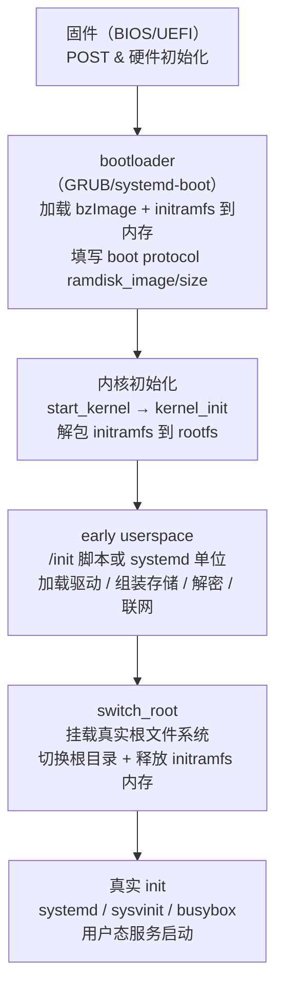
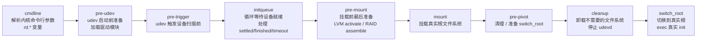
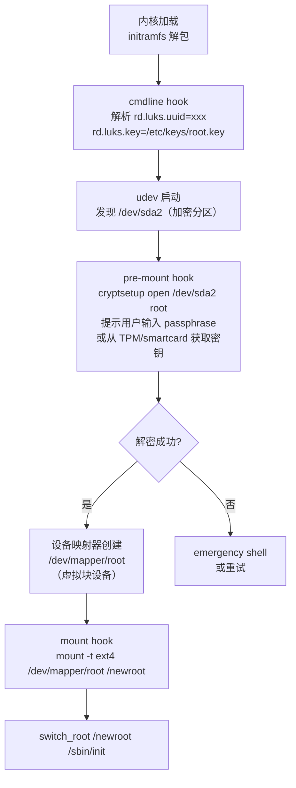

# initramfs 与 early userspace

> [!abstract] TL;DR
> - **initramfs**（initial RAM filesystem）是一个打包为 cpio 归档、可选 gzip/zstd 压缩的微型根文件系统，由 bootloader 传给内核，内核在启动极早期将其解包到 tmpfs rootfs，然后执行 `/init` 脚本——这就是 **early userspace**。
> - 它存在的根本原因是：内核在挂载真正的根文件系统之前，可能需要加载块设备驱动、组装 LVM/RAID、解密 LUKS 磁盘、或通过网络发现 iSCSI/NFS 根——这些工作需要用户态工具，但用户态工具又依赖根文件系统，构成"先有鸡还是先有蛋"的矛盾，initramfs 用一个临时根文件系统打破死结。
> - 老式 **initrd**（initial ramdisk）用块设备模拟（loop device），已基本淘汰；initramfs 直接挂载为 tmpfs，免去了块设备层的额外开销。
> - 主流构建工具：**dracut**（模块化、hooks 驱动，Fedora/RHEL/openSUSE 系）、**mkinitcpio**（Arch Linux）、**initramfs-tools**（Debian/Ubuntu）；systemd 也可内嵌进 initramfs 取代传统 shell `/init`。
> - early userspace 结束标志是 **`switch_root`**（或 `pivot_root`）——把真实根文件系统挂到 `/`，释放 initramfs 占用的内存，把 PID 1 的根目录切换过去，完成交接。

---

## 概述与定位

Linux 内核启动流程在 `start_kernel()` 完成各子系统初始化后，由 `kernel_init`（PID 1）负责挂载根文件系统并 `execve` 到用户态 `/sbin/init`。然而，挂载根文件系统本身并不总是简单的事情：

1. **驱动不在内核里**：为保持内核精简，很多块设备驱动（SATA/NVMe/SCSI 控制器）、文件系统驱动（btrfs、ext4）以内核模块（`.ko`）形式存放，而模块本身存放在 `/lib/modules/$(uname -r)/` 下——即根文件系统内。内核无法在挂载根文件系统之前加载这些模块；模块又在根文件系统里。死锁。
2. **存储拓扑复杂**：根文件系统可能位于 LVM 逻辑卷、软件 RAID（md）、或 dm-crypt 加密设备上。组装/解密这些层次需要用户态工具（`lvm`、`mdadm`、`cryptsetup`）。
3. **网络根**：diskless 工作站或 PXE 引导的服务器，根文件系统通过 NFS 或 iSCSI 挂载，需先配置网络接口，获取 IP 地址，建立 TCP 连接。
4. **自定义引导逻辑**：企业系统可能需要在进入真正 init 之前做合规检查、解封 TPM 密钥、动态生成主机名。

initramfs 提供了一个"过渡性"根文件系统：它足够小，可以直接嵌入内存；它足够完整，包含了完成上述准备工作所需的全部工具；它足够短暂，完成使命后立即被丢弃。

### initramfs 在启动链中的位置



---

## 原理与机制

### 1. initramfs vs 老式 initrd：本质区别

**老式 initrd**（Linux 2.4 及更早）：

- 是一个 **压缩的块设备镜像**（通常是 ext2 文件系统），内核把它挂载为一个 loop 设备，再 mount 这个 loop 设备到 `/`。
- 需要固定大小预分配，使用完毕后内核需要 `umount` 并释放。
- 内核内存中保留了一个块设备层的副本，效率低。
- 过渡方式：执行 `/linuxrc`，完成后用 `pivot_root` 切换到真实根，再 umount 并 losetup -d 释放。

**initramfs**（Linux 2.6.13 起成为标准）：

- 是一个 **cpio（Copy-In/Copy-Out）格式的归档文件**，可选地用 gzip、bzip2、lzma、lz4、zstd 压缩。
- 内核在极早期（`start_kernel` 之前的 `unpack_to_rootfs`，实际在 `populate_rootfs` 中）将其解包到 **内核内置的 tmpfs rootfs**。
- 不需要块设备层，直接操作内存中的虚拟文件系统。
- 挂载到内存，释放只需释放 tmpfs 页面，无 loop 设备的复杂生命周期。
- 过渡方式：执行 `/init`（可以是 shell 脚本或 systemd），完成后用 **`switch_root`** 完成切换。

```
老式 initrd 生命周期：
  内核 → loop 设备 → mount ext2 → /linuxrc → pivot_root → umount + losetup -d

initramfs 生命周期：
  内核 → tmpfs rootfs → cpio 解包 → /init → switch_root → tmpfs 页回收
```

### 2. cpio 归档格式详解

cpio 是 Unix 传统的归档工具，格式比 tar 更简单，内核支持"newc"（new ASCII portable）格式，无需外部库即可解包。

**newc 格式（SVR4 portable ASCII）每个文件头结构：**

```
魔数（6字节）: "070701"（newc）或 "070702"（带CRC校验）
ino        （8字节 hex）  : inode 号
mode       （8字节 hex）  : 文件类型与权限
uid/gid    （8字节 hex × 2）: 所有者
nlink      （8字节 hex）  : 硬链接数
mtime      （8字节 hex）  : 修改时间
filesize   （8字节 hex）  : 文件内容字节数
dev_major/minor（各8字节 hex）: 设备号
rdev_major/minor（各8字节 hex）: 设备文件的设备号
namesize   （8字节 hex）  : 文件名长度（含终止 '\0'）
check      （8字节 hex）  : 校验和（newc 为 0）
文件名（namesize 字节，4字节对齐填充）
文件内容（filesize 字节，4字节对齐填充）
```

归档以名为 `TRAILER!!!` 的特殊条目结束。

**打包 initramfs 的典型命令流：**

```bash
# 方式一：从目录树打包（gzip 压缩）
find /tmp/initramfs_root -print0 \
  | cpio --null -ov --format=newc \
  | gzip -9 > /boot/initramfs.img

# 方式二：从目录树打包（zstd 压缩，更快更小）
find /tmp/initramfs_root -print0 \
  | cpio --null -ov --format=newc \
  | zstd -19 -T0 > /boot/initramfs.img.zst

# 方式三：dracut 输出（内部流程相同，但经过模块化处理）
dracut --force /boot/initramfs-$(uname -r).img $(uname -r)
```

内核支持**多段 initramfs**：多个 cpio 归档可直接首尾拼接，内核按顺序解包，后者覆盖前者。这使得微代码更新（Intel/AMD microcode）可以作为独立的第一段 cpio 前置。

```bash
# 查看 initramfs 是否包含微代码前缀（以 Intel 为例）
lsinitrd /boot/initramfs-6.8.0-39-generic.img 2>/dev/null | head -20
# 或手动检查前几字节
od -A x -t x1z /boot/initramfs-6.8.0-39-generic.img | head -5
# 若前4字节为 1f 8b 08 00 则为 gzip
# 若看到 28 b5 2f fd 则为 zstd
# 若看到 070701 则为裸 cpio
```

### 3. 内核解包 initramfs 的时机与代码路径

内核在 `init/initramfs.c` 中实现了 initramfs 解包逻辑。关键函数调用链：

```
start_kernel()
  └── arch_call_rest_init()
        └── rest_init()
              └── kernel_init() [PID 1]
                    └── kernel_init_freeable()
                          └── do_basic_setup()
                                └── populate_rootfs()   ← 解包 initramfs
                                      ├── unpack_to_rootfs()  ← 实际 cpio 解析
                                      └── free_initrd_mem()   ← 解包完释放原始数据页
```

更准确地说，`do_populate_rootfs()` 在内核初始化序列中被注册为 `rootfs_initcall`，它在设备初始化（`do_initcalls`）阶段执行，早于任何块设备驱动。

`unpack_to_rootfs()` 是一个状态机驱动的 cpio 解析器，在内核空间直接运行，不依赖任何外部库：

```c
// init/initramfs.c（简化伪代码）
static void __init do_populate_rootfs(void) {
    // 1. 解包内核内置的 initramfs（CONFIG_INITRAMFS_SOURCE 编译进来的）
    unpack_to_rootfs(__initramfs_start,
                     __initramfs_end - __initramfs_start);

    // 2. 解包 bootloader 传入的 external initramfs（来自 boot protocol）
    if (initrd_start) {
        // 检测是否为 cpio 格式
        if (is_gzip_or_cpio(initrd_start)) {
            unpack_to_rootfs(initrd_start, initrd_end - initrd_start);
            free_initrd();  // 释放原始 initramfs 数据占用的内存
        } else {
            // 老式 initrd（块设备镜像），移动到 /initrd.image
            handle_legacy_initrd();
        }
    }
}
```

解包完成后，内核的 tmpfs rootfs 中就拥有了一个完整的文件系统树，最关键的文件是 **`/init`**（必须存在且可执行）。

### 4. 内核执行 /init：early userspace 的起点

解包完成后，`kernel_init` 调用：

```c
// init/main.c
if (ramdisk_execute_command) {
    // 通常为 "init=/init"（内核默认）或 cmdline 指定的路径
    ret = run_init_process(ramdisk_execute_command);
}
// 若上述失败，尝试后备路径
run_init_process("/sbin/init");
run_init_process("/etc/init");
run_init_process("/bin/init");
run_init_process("/bin/sh");
```

`/init` 通过 `execve` 执行，PID 1 的代码被替换为 initramfs 中的 `/init`。此后控制权完全移交给 early userspace。

### 5. switch_root 与 pivot_root：切换到真实根

early userspace 完成全部准备工作（驱动加载、设备挂载、解密等）后，需要将真实根文件系统切换为进程树的根，同时丢弃 initramfs。

**`switch_root` 的语义（busybox/util-linux 实现）：**

```bash
# switch_root newroot init [args...]
# 等价于以下操作序列：
# 1. 把 newroot 中的所有挂载点迁移到当前根
# 2. cd 进入 newroot
# 3. 把 newroot 挂载为新的根（mount --move / newroot 或 mount --bind）
# 4. chroot 到 newroot
# 5. 删除旧 rootfs 中所有文件（释放 tmpfs 内存）
# 6. exec 新的 init
```

**内核系统调用层面：**`switch_root` 使用 `pivot_root(".", ".")` 技巧（或直接 `mount --move`）：

```c
// util-linux switch_root 核心逻辑（简化）
int switch_root(const char *newroot, const char *init) {
    // 1. 递归删除 tmpfs rootfs 上的所有文件（释放内存）
    recursively_delete_tmpfs_contents("/");
    
    // 2. 将 newroot 下的文件系统移动成为新根
    if (mount(newroot, "/", NULL, MS_MOVE, NULL) < 0)
        die("mount --move failed");
    
    // 3. chroot 到新根
    if (chroot(".") < 0)
        die("chroot failed");
    
    // 4. 进入新根的 /
    chdir("/");
    
    // 5. execv 新的 init（继承 PID 1 身份）
    execv(init, argv);
}
```

**`pivot_root` 与 `switch_root` 的区别：**

| 特性 | `pivot_root` | `switch_root` |
|------|-------------|---------------|
| 内核 syscall / 用户态程序 | 内核 syscall（`sys_pivot_root`） | 用户态程序（调 syscall 组合） |
| 旧根去向 | 挂到指定目录（可 umount 或保留） | 直接清空并回收（tmpfs 内存释放） |
| 适用场景 | 容器运行时（保留旧根可 chroot 回去） | initramfs 到真实根的一次性切换 |
| initramfs 内存 | 不自动释放 | 主动删除旧 rootfs 文件后 tmpfs 自动回收 |

dracut/systemd-initrd 使用 `switch_root`；容器运行时（如 runc）使用 `pivot_root`。

---

## 结构/算法/伪代码详解

### 1. initramfs 内部结构（典型 dracut 生成）

```
/
├── init                  ← shell 脚本（传统）或指向 /usr/lib/systemd/systemd（systemd-initrd）
├── bin/                  ← busybox 或独立二进制（sh, mount, switch_root 等）
├── sbin/
├── lib/
│   ├── modules/
│   │   └── $(uname -r)/  ← 内核模块（仅必要的：nvme、dm_crypt、ext4 等）
│   │       ├── kernel/
│   │       └── modules.dep
│   └── dracut/
│       └── hooks/        ← dracut 各阶段 hook 脚本
├── lib64/ → lib
├── usr/
│   ├── bin/
│   ├── lib/
│   │   ├── udev/         ← udev 规则与辅助程序
│   │   └── systemd/      ← systemd 单位（若使用 systemd-initrd）
│   └── sbin/
│       ├── dracut-lib.sh
│       └── ...
├── etc/
│   ├── udev/rules.d/     ← 设备发现规则
│   ├── modprobe.d/
│   ├── ld.so.conf
│   └── hostname
├── dev/
│   ├── console
│   ├── null
│   └── tty
├── proc/
├── sys/
├── run/
├── tmp/
├── newroot/              ← 真实根文件系统的挂载点（switch_root 后消失）
└── kernel/               ← 内核参数（由内核写入，dracut 读取）
```

### 2. dracut 的模块化架构与 hooks

**dracut** 是 Fedora/RHEL/openSUSE 等发行版的标准 initramfs 构建工具，设计为高度模块化：每个功能（加密、LVM、网络等）对应一个**模块目录**（`/usr/lib/dracut/modules.d/`），包含 `module-setup.sh`（声明依赖、向 initramfs 安装文件）和运行时脚本（hook 脚本）。

**dracut hooks 执行顺序（/init 内部）：**



**典型 dracut /init 伪代码（Shell 脚本骨架）：**

```bash
#!/bin/sh
# /init in initramfs (dracut style)

# 1. 挂载内核虚拟文件系统
mount -t proc proc /proc
mount -t sysfs sysfs /sys
mount -t devtmpfs devtmpfs /dev
mount -t tmpfs tmpfs /run

# 2. 从内核命令行读取参数（rd.debug、root=、rd.luks.uuid= 等）
source /dracut-lib.sh
parse_cmdline

# 3. 执行 cmdline hook：各模块注册的命令行参数处理器
for hook in /lib/dracut/hooks/cmdline/*.sh; do
    source "$hook"
done

# 4. 启动 udev daemon（设备发现）
/usr/lib/systemd/systemd-udevd --daemon

# 5. 触发冷插拔（向内核请求为已存在设备重放 uevent）
udevadm trigger --type=subsystems --action=add
udevadm trigger --type=devices   --action=add

# 6. 执行 pre-udev hooks（驱动加载）
run_hooks /lib/dracut/hooks/pre-udev/

# 7. 进入 initqueue 循环（等待 root 设备出现）
while true; do
    run_hooks /lib/dracut/hooks/initqueue/
    
    # 检查 root 设备是否就绪
    if [ -b "$root_device" ] || check_finished; then
        break
    fi
    
    # 超时处理
    if timeout_exceeded; then
        emergency_shell "Timed out waiting for device $root"
    fi
    
    udevadm settle --timeout=1
done

# 8. pre-mount hooks（LVM、RAID、LUKS 解密）
run_hooks /lib/dracut/hooks/pre-mount/

# 9. mount hooks（挂载根文件系统）
run_hooks /lib/dracut/hooks/mount/
# 默认行为：mount -t ext4 /dev/sda1 /newroot

# 10. pre-pivot hooks
run_hooks /lib/dracut/hooks/pre-pivot/

# 11. cleanup（停止 udev、卸载 /sys /proc 等）
run_hooks /lib/dracut/hooks/cleanup/
udevadm control --exit

# 12. switch_root
exec switch_root /newroot /sbin/init "$@"
```

### 3. mkinitcpio（Arch Linux）vs initramfs-tools（Debian）vs dracut 对比

| 维度 | dracut | mkinitcpio | initramfs-tools |
|------|--------|------------|-----------------|
| 发行版 | Fedora/RHEL/openSUSE/Alma | Arch Linux | Debian/Ubuntu |
| 架构风格 | 模块化（modules.d/），hooks 脚本 | 钩子（/etc/mkinitcpio.conf 的 HOOKS 数组） | 脚本/钩子（scripts/ + hooks/ 目录） |
| 配置文件 | /etc/dracut.conf + /etc/dracut.conf.d/ | /etc/mkinitcpio.conf | /etc/initramfs-tools/initramfs.conf |
| 自定义内核模块 | DRACUT_INCLUDE+=、`add_drivers+=" nvme "` | MODULES=(nvme) | /etc/initramfs-tools/modules |
| 运行时工具 | busybox 或 systemd | busybox | busybox |
| 核心 /init | shell 脚本（dracut 生成） | shell 脚本（mkinitcpio 生成） | shell 脚本（initramfs-tools 生成） |
| systemd 支持 | 一流支持（dracut-systemd 模块） | 通过 systemd HOOK | 有限支持 |
| 重新构建命令 | `dracut -f` | `mkinitcpio -P` | `update-initramfs -u` |
| 调试参数 | `rd.debug rd.break=...` | `break=...` | `break=...` |

**mkinitcpio 配置示例（/etc/mkinitcpio.conf）：**

```bash
# MODULES：强制编译进 initramfs 的内核模块
MODULES=(nvme ext4 dm_crypt)

# BINARIES：包含的二进制文件
BINARIES=()

# FILES：额外文件
FILES=()

# HOOKS：按顺序执行的初始化钩子
# base：基础文件系统结构
# udev：启动 udev
# autodetect：只包含检测到的硬件模块（大幅减小体积）
# modconf：读取 /etc/modprobe.d/
# block：块设备驱动
# encrypt：LUKS 解密
# lvm2：LVM 卷组激活
# filesystems：文件系统驱动
# keyboard：键盘支持（用于输入 LUKS 密码）
# fsck：文件系统检查
HOOKS=(base udev autodetect modconf block encrypt lvm2 filesystems keyboard fsck)
```

**initramfs-tools（Debian）脚本目录结构：**

```
/usr/share/initramfs-tools/
├── hooks/          ← 构建时钩子（复制文件进 initramfs）
│   ├── fsck
│   ├── lvm2
│   └── cryptroot
├── scripts/
│   ├── init-top/   ← 运行时：挂载 proc/sys/dev 之后立即执行
│   ├── init-premount/  ← 运行时：mount 根文件系统之前
│   ├── local       ← 本地磁盘根文件系统挂载逻辑
│   ├── nfs         ← NFS 根文件系统挂载逻辑
│   ├── local-top/  ← 激活加密/LVM 后，mount 之前
│   ├── local-premount/
│   ├── local-bottom/   ← mount 之后的收尾
│   └── init-bottom/    ← switch_root 之前的最终清理
└── init            ← initramfs 的 /init 入口脚本
```

### 4. udev 冷插拔（cold plugging）机制

内核启动时，设备驱动注册并发现硬件，但由于 udev 守护进程（运行在用户态）尚未启动，这些 uevent 没有被处理（没有创建 /dev 节点，没有执行规则）。这就是"冷插拔"问题。

**解决方案：**

```bash
# 1. 启动 udevd（或 systemd-udevd）
/usr/lib/systemd/systemd-udevd --daemon

# 2. 触发冷插拔：通知内核重新发送所有设备的 uevent
udevadm trigger --type=subsystems --action=add   # 先处理总线/类
udevadm trigger --type=devices   --action=add   # 再处理设备

# 3. 等待 udev 处理完所有待处理事件
udevadm settle   # 阻塞直到事件队列清空
```

`udevadm trigger` 通过向 `/sys/...../uevent` 写入 `add`，让内核重放每个设备的 uevent，udevd 接收并执行匹配的 udev 规则（创建 /dev 节点、设置权限、执行 RUN 命令等）。

### 5. LUKS 全盘加密场景的 early userspace 流程

LUKS（Linux Unified Key Setup）全盘加密是 initramfs 最重要的用例之一，因为加密的根分区在解密前是不可访问的：



dracut 的 `crypt` 模块处理此场景，通过 `rd.luks.uuid`（内核参数）识别加密分区，调用 `cryptsetup luksOpen` 解密，创建 `/dev/mapper/cryptroot`，后续步骤挂载该设备。

若同时有 LVM-on-LUKS（先解密，再激活 LVM），顺序为：

```
LUKS open → dm-crypt 设备 → lvm vgchange -ay → lv 设备可见 → mount
```

### 6. LVM 与软件 RAID 激活

```bash
# LVM 激活（dracut lvm 模块 / Arch encrypt+lvm2 钩子）
vgchange --sysinit -ay   # 激活所有卷组，--sysinit 避免 udev 循环

# 软件 RAID 组装（dracut mdraid 模块）
mdadm --assemble --scan   # 扫描并组装所有可发现的阵列
# 或针对特定阵列
mdadm --assemble /dev/md0 /dev/sda1 /dev/sdb1
```

### 7. 网络根文件系统（NFS / iSCSI root）

diskless 服务器或精简客户端场景，根文件系统通过网络提供：

**NFS root 流程：**

```
PXE 引导 → DHCP 获取 IP + next-server(TFTP) →
  TFTP 下载 bzImage + initramfs.img →
  内核参数：root=nfs:192.168.1.100:/export/rootfs
  initramfs: 配置 eth0 (dhcp/static) → 
  mount -t nfs 192.168.1.100:/export/rootfs /newroot →
  switch_root
```

dracut 的 `network` 模块（底层使用 `ip` 工具或 NetworkManager）处理网络配置：

```bash
# 内核参数示例（NFS root）
ip=dhcp root=nfs:192.168.1.100:/export/rootfs,v3,tcp
# 或静态 IP
ip=192.168.1.200::192.168.1.1:255.255.255.0:hostname:eth0:none
root=nfs:192.168.1.100:/export/rootfs
```

**iSCSI root：**

```bash
# 内核参数（iSCSI）
rd.iscsi.initiator=iqn.2023-01.com.example:client
rd.iscsi.target.name=iqn.2023-01.com.example:storage
rd.iscsi.target.ip=192.168.1.50
rd.iscsi.target.port=3260
root=/dev/disk/by-path/ip-192.168.1.50:3260-iscsi-...
```

dracut 的 `iscsi` 模块启动 `iscsid` 守护进程，发起 iSCSI 登录，等待块设备出现，再挂载。

### 8. systemd-in-initramfs

现代发行版（Fedora、openSUSE、Arch 带 systemd HOOK）可以在 initramfs 中运行 **systemd** 作为 PID 1（而非 shell 脚本 `/init`），这称为 **systemd-initrd**。

```
/init → 符号链接到 /usr/lib/systemd/systemd
systemd 读取 /usr/lib/systemd/system/initrd.target（而非 default.target）
单位文件：
  initrd-parse-etc.service     ← 解析 /etc/fstab 的根条目
  cryptsetup-pre.target
  cryptsetup.target            ← 触发 systemd-cryptsetup@.service
  initrd-root-device.target    ← 根设备就绪
  sysroot.mount                ← 挂载真实根到 /sysroot
  initrd-root-fs.target
  initrd.target                ← 所有准备工作完成
  initrd-cleanup.service       ← 停止 udev、清理
  initrd-switch-root.service   ← 执行 systemctl switch-root /sysroot
```

优势：与真实系统 init 使用同一套工具链，并行处理（systemd 天生并行），更好的日志（systemd-journald 早期日志），条件与依赖更精确。

**busybox 的角色：**在非 systemd-initrd 场景，initramfs 中的绝大部分用户态工具（`sh`、`mount`、`switch_root`、`grep`、`find`、`modprobe` 等）由 **busybox** 提供——这是一个多功能的"瑞士军刀"可执行文件，各工具通过硬链接或符号链接指向同一个 busybox 二进制，大幅减小 initramfs 体积。

---

## 工具视角与实战

### 1. 查看与解包现有 initramfs

**lsinitrd（dracut 提供，Fedora/RHEL）：**

```bash
# 列出 initramfs 内容（不解包）
lsinitrd /boot/initramfs-6.8.0-39-generic.img

# 查看特定文件内容
lsinitrd /boot/initramfs-6.8.0-39-generic.img -f /init

# 查看包含的内核模块
lsinitrd /boot/initramfs-6.8.0-39-generic.img | grep '\.ko'

# 显示 dracut 模块信息
lsinitrd --verbose /boot/initramfs-$(uname -r).img
```

**unmkinitramfs（Debian/Ubuntu initramfs-tools 提供）：**

```bash
# 解包到目录（自动处理微代码前缀段）
unmkinitramfs /boot/initrd.img-6.8.0-39-generic /tmp/initramfs_extracted

# 查看解包结果
ls -la /tmp/initramfs_extracted/
cat /tmp/initramfs_extracted/init
```

**手动解包（通用方式，无需专用工具）：**

```bash
# 判断压缩格式
file /boot/initramfs-$(uname -r).img

# 若为 gzip（最常见）：
mkdir /tmp/initramfs && cd /tmp/initramfs
gunzip -c /boot/initramfs-$(uname -r).img | cpio -idmv

# 若为 zstd：
mkdir /tmp/initramfs && cd /tmp/initramfs
zstd -dc /boot/initramfs-$(uname -r).img | cpio -idmv

# 若 initramfs 有微代码前缀（第一段为裸 cpio，第二段为压缩 cpio）：
# 使用 unmkinitramfs 或手动找到压缩段偏移
skip_bytes=$(cpio --list < /boot/initramfs-$(uname -r).img 2>/dev/null \
             | tail -1 | awk '{print $NF}')  # 不准确示意，实际用 unmkinitramfs
dd if=/boot/initramfs-$(uname -r).img bs=512 skip=$skip_count | zstd -dc | cpio -idmv
```

**查看 initramfs 中的内核模块：**

```bash
# 解包后
find /tmp/initramfs -name '*.ko*' | sort

# 检查关键模块是否存在
find /tmp/initramfs -name 'nvme*.ko*'
find /tmp/initramfs -name 'dm_crypt.ko*'
find /tmp/initramfs -name 'ext4.ko*'
```

### 2. 自定义 dracut initramfs

```bash
# 强制重新生成当前内核的 initramfs
dracut --force

# 为指定内核版本生成
dracut --force /boot/initramfs-6.8.0.img 6.8.0

# 加入额外模块（仅本次）
dracut --force --add-drivers "nvme_tcp" /boot/initramfs-custom.img

# 加入额外文件
dracut --force --install "/usr/bin/strace" /boot/initramfs-debug.img

# 生成"完整"（fat）initramfs——不做自动检测，包含所有已知驱动
# 适用于通用/救援镜像
dracut --force --no-hostonly /boot/initramfs-generic.img

# 查看 dracut 将包含哪些模块（dry-run）
dracut --list-modules

# 加入 dracut 模块（如 crypt、lvm）
dracut --force --add "crypt lvm"
```

**dracut.conf.d 永久配置示例（/etc/dracut.conf.d/custom.conf）：**

```bash
# 额外包含的驱动
add_drivers+=" nvme_tcp rdma "

# 额外包含的 dracut 模块
add_dracutmodules+=" crypt lvm mdraid "

# 排除不需要的模块（减小体积）
omit_dracutmodules+=" network nfs iscsi "

# 包含额外文件（路径对应 initramfs 内路径相同）
install_items+=" /etc/crypttab /etc/lvm/lvm.conf "

# 主机专用模式（默认）：只包含当前主机需要的驱动
hostonly=yes

# 压缩算法
compress=zstd
```

### 3. rd.break 与 rd.debug 调试

**`rd.break`：在 initramfs 某个阶段暂停，进入 emergency shell：**

```bash
# 在内核 cmdline 加入（临时修改 GRUB 菜单，按 e 编辑）：

# 在 /init 执行最开始暂停（加载完 dracut-lib.sh 之后）
rd.break

# 在特定 hook 阶段暂停
rd.break=cmdline     # 执行 cmdline hooks 之前
rd.break=pre-udev    # pre-udev hooks 之前
rd.break=pre-trigger # udev trigger 之前
rd.break=initqueue   # 进入 initqueue 之前
rd.break=pre-mount   # pre-mount hooks 之前
rd.break=mount       # mount hooks 之前
rd.break=pre-pivot   # pre-pivot hooks 之前
rd.break=cleanup     # cleanup hooks 之前
rd.break=switch_root # switch_root 之前（最后机会检查 /newroot）
```

进入 emergency shell 后可以：

```bash
# 手动加载模块
modprobe nvme

# 检查设备
ls /dev/
lsblk

# 手动激活 LVM
vgchange -ay

# 手动解密 LUKS
cryptsetup luksOpen /dev/sda2 cryptroot

# 手动挂载
mount -t ext4 /dev/mapper/cryptroot /sysroot  # systemd-initrd
# 或
mount -t ext4 /dev/sda1 /newroot              # 传统 dracut

# 手动继续
exit  # 退出 shell 后 initramfs 继续执行
```

**`rd.debug`：开启详细调试日志：**

```bash
# 在 cmdline 加入：
rd.debug

# 同时把输出写到 kmsg（可通过 dmesg 看）
rd.debug rd.log=kmsg

# 查看 initramfs 日志
journalctl -b | grep "dracut"   # 若使用 systemd-initrd
dmesg | grep -i "dracut\|initramfs"
```

### 4. 大小分析与优化

```bash
# 查看 initramfs 大小
ls -lh /boot/initramfs-$(uname -r).img

# 比较 hostonly vs generic
dracut --no-hostonly /tmp/initramfs-generic.img $(uname -r)
dracut --hostonly    /tmp/initramfs-hostonly.img $(uname -r)
ls -lh /tmp/initramfs-*.img

# 查看解包后各类文件占用
lsinitrd -v /boot/initramfs-$(uname -r).img 2>/dev/null \
  | awk '{print $5, $NF}' | sort -rn | head -30

# 检查哪些内核模块最大
find /tmp/initramfs -name '*.ko*' -exec ls -la {} \; \
  | sort -k5 -rn | head -20
```

### 5. 手动制作最小 initramfs（教学示例）

```bash
# 创建目录结构
mkdir -p /tmp/myinit/{bin,dev,proc,sys,newroot}

# 复制 busybox（静态编译版）
cp /usr/bin/busybox.static /tmp/myinit/bin/busybox

# 安装 busybox 工具
for tool in sh mount switch_root mdev modprobe; do
    ln -s busybox /tmp/myinit/bin/$tool
done

# 创建 /init 脚本
cat > /tmp/myinit/init << 'EOF'
#!/bin/sh
mount -t proc proc /proc
mount -t sysfs sysfs /sys
mount -t devtmpfs devtmpfs /dev

# 加载根分区驱动
modprobe ext4
modprobe nvme

# 等待设备就绪
mdev -s   # busybox mdev：简化版 udev

# 挂载根文件系统
mount -t ext4 /dev/nvme0n1p2 /newroot

# 切换根并启动真实 init
exec switch_root /newroot /sbin/init
EOF
chmod +x /tmp/myinit/init

# 创建必要的设备节点
mknod /tmp/myinit/dev/console c 5 1
mknod /tmp/myinit/dev/null    c 1 3

# 打包为 initramfs
cd /tmp/myinit
find . -print0 | cpio --null -ov --format=newc | gzip -9 > /tmp/myinit.img

# 测试（QEMU）
qemu-system-x86_64 \
    -kernel /boot/vmlinuz-$(uname -r) \
    -initrd /tmp/myinit.img \
    -append "console=ttyS0 root=/dev/nvme0n1p2" \
    -nographic
```

---

## 安全性与正确使用

### 1. initramfs 中的密钥与解密逻辑

initramfs 承担了全盘加密解密的职责，这意味着它本身的安全性至关重要。

**密钥存储位置与风险：**

- **内嵌密钥文件**（通过 `dracut --install "/etc/keys/root.key"`）：密钥直接存在于 initramfs cpio 中。任何能读取 `/boot/initramfs*.img` 的人都能提取密钥，进而绕过 LUKS 加密。**这种方式仅在加密的 `/boot` 分区或安全启动全链路保护下才是安全的。**
- **TPM 封存密钥**：使用 `systemd-cryptenroll` 或 `clevis` 将 LUKS 密钥封存到 TPM2 的特定 PCR（Platform Configuration Register）值中。只有在固件、bootloader、内核、initramfs 均未被篡改（PCR 值符合预期）时，TPM 才解封密钥。initramfs 中的 `clevis` 或 `systemd-cryptsetup` 在运行时向 TPM 请求解封，无需用户输入密码。**这是目前最推荐的无人值守全盘加密方案。**
- **用户交互输入密码**：initramfs 通过 `/dev/console` 提示用户输入 passphrase，传给 `cryptsetup luksOpen`。安全性取决于 passphrase 强度，但无需担心密钥泄露。

**initramfs 自身的完整性保护：**

initramfs 通常存放在 `/boot` 分区（可能是独立的、未加密的分区），这意味着攻击者若能物理访问，可以替换 initramfs，植入恶意代码（如后门、密钥记录器），在下次启动时捕获 LUKS 密码。

**防御措施：**

1. **Secure Boot（UEFI 验签）**：通过 shim → GRUB → 内核 + initramfs 的完整签名链，确保只有经过授权的 initramfs 才能被加载。GRUB 可配置对 initramfs 文件进行哈希验证（grub.cfg 中 `set check_signatures=enforce`）。

2. **Unified Kernel Image（UKI）**：将内核 + cmdline + initramfs 打包成单一 EFI 可执行文件，整体用私钥签名，UEFI Secure Boot 验签整体。`systemd-ukify` 或 `dracut --uefi` 可生成 UKI。UKI 内的 initramfs 无法单独被替换而不破坏签名。

3. **TPM PCR 绑定**：将 LUKS 密钥绑定到 PCR4（bootloader 哈希）、PCR8（内核 cmdline）、PCR9（initramfs 哈希）。若 initramfs 被替换，PCR9 值改变，TPM 拒绝解封密钥，攻击者无法解密根分区（即使替换了 initramfs）。

```bash
# 使用 systemd-cryptenroll 将 LUKS 密钥绑定到 TPM2 PCR（9+11+12）
systemd-cryptenroll /dev/sda2 \
    --tpm2-device=auto \
    --tpm2-pcrs=9+11+12   # PCR9: initrd, PCR11: secure boot state, PCR12: kernel cmdline
```

### 2. 供应链信任问题

initramfs 由发行版的 `dracut`/`mkinitcpio`/`initramfs-tools` 构建，其内容来源于系统已安装的软件包（内核模块来自 `linux-modules` 包、工具来自 `util-linux`/`cryptsetup`/`lvm2` 等）。

**攻击面：**

- 若系统上安装了恶意软件包（供应链攻击），`dracut -f` 重新生成 initramfs 时会将恶意代码打包进去，在下次启动的 early userspace 阶段执行——此时系统大部分防护尚未加载。
- 构建工具本身（如 `dracut` 脚本）若被篡改，可在生成时植入后门。

**缓解：**

- 使用包管理器的签名验证确保已安装软件包的完整性。
- 在生成 initramfs 后立即签名（UKI 流程中自动完成）。
- 对 `/boot` 分区实施访问控制，限制能触发 `dracut -f` 的权限。
- 配合 IMA（Integrity Measurement Architecture）对 initramfs 内的文件进行哈希记录与验证。

### 3. rd.break 与调试模式的安全风险

`rd.break` 提供了在 initramfs 阶段的无密码 root shell。若 GRUB 菜单未设密码保护，任何能物理访问机器（或能修改 VM 配置）的人都可通过 `rd.break` 获得 root 访问。

**生产环境建议：**

- 设置 GRUB 密码（`grub-mkpasswd-pbkdf2` 生成密码哈希，写入 `/etc/grub.d/40_custom`）。
- 启用 Secure Boot，使其验证 GRUB 配置文件，防止攻击者编辑 cmdline 加入 `rd.break`。
- 若需要调试：在专用的维护窗口中临时修改，完成后恢复。

### 4. initramfs 体积与 /boot 分区空间管理

```bash
# 查看 /boot 使用情况
df -h /boot

# 列出旧内核的 initramfs（通常在系统更新后留存）
ls -lh /boot/initramfs-*.img

# 清理旧内核（Fedora/RHEL：dnf 管理）
dnf remove --oldinstallonly

# Arch：清理 pacman 缓存中的旧内核
pacman -Sc

# Debian/Ubuntu：自动删除旧内核
apt autoremove

# 若 /boot 空间不足导致 initramfs 生成失败，可能是最危险的场景之一
# （系统能启动，但更新内核后无法生成 initramfs，下次重启可能失败）
# 预防：/boot 分区至少留 500MB（若使用独立 /boot 分区）
```

---

## 小结

initramfs 与 early userspace 解决了一个根本性的引导悖论：根文件系统的依赖必须在根文件系统可用之前解决。整个机制的核心链路如下：

| 阶段 | 组件 | 作用 |
|------|------|------|
| 构建期 | dracut / mkinitcpio / initramfs-tools | 将内核模块、用户态工具、配置脚本打包为 cpio 归档 |
| 传递期 | bootloader（GRUB/systemd-boot） | 将 initramfs 二进制装载到内存，通过 boot protocol 告知内核地址 |
| 内核解包期 | `populate_rootfs` / `unpack_to_rootfs` | 将 cpio 归档解包到 tmpfs rootfs，无块设备层 |
| early userspace | `/init`（shell 或 systemd） | 按 hooks 顺序：解析参数 → udev 冷插拔 → 组装存储 → 解密 → 挂载根 |
| 交接期 | `switch_root` | 将真实根切换为进程树根，释放 tmpfs 内存，exec 真实 init |

**设计精华：**

- **tmpfs rootfs 而非块设备**：initramfs 直接存活在内核的 tmpfs 中，无需块设备层，解包由内核在 C 空间完成，不依赖任何外部工具。
- **`switch_root` 的彻底性**：不仅切换根目录，还主动删除 tmpfs 中的所有文件，将内存归还系统——对嵌入式系统尤为关键。
- **cpio 的简洁性**：相比 ext2 块设备镜像，cpio 的解析器只需数百行内核代码，易于审计，且支持多段拼接（微代码前缀）。
- **模块化构建工具**：dracut 的 hook 架构使得每个功能（加密、RAID、网络）以独立模块存在，互不耦合，发行版可按需组合。
- **安全与便利的平衡**：TPM 封存 + PCR 绑定 + UKI 签名的组合，实现了无人值守解密（便利）与防篡改保护（安全）的统一。

---

## 相关阅读

- **本系列上下文**：[[06.内核解压与早期初始化]] | [[11.init与systemd启动]] | [[13.可信启动与启动安全]]
- **设备管理**：udev 规则与 `/sys` 内核接口详见 [[11.init与systemd启动]] 中的 udev 章节
- **全盘加密原理**：dm-crypt / LUKS 内部机制详见 [[37.密码学]] 系列
- **LVM 与块设备层**：[[24.内存管理与堆分配器]] 系列涵盖存储抽象层
- **容器 pivot_root**：与 initramfs switch_root 对比，详见容器运行时相关章节
- **dracut 官方文档**：`man dracut`、`man dracut.conf`、`man dracut.cmdline`
- **内核源码**：`init/initramfs.c`（解包逻辑）、`init/main.c`（kernel_init）

---

[[00.操作系统加载与启动总览|⬆ 系列总览]] | [[18.kexec与kdump崩溃转储|← 上一章]] | [[20.多重引导与虚拟化引导|→ 下一章]]
