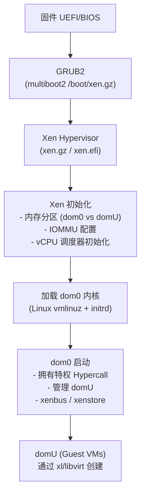
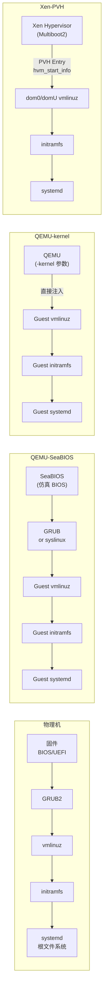
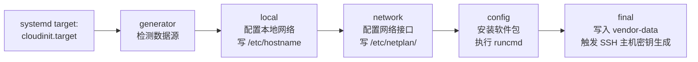
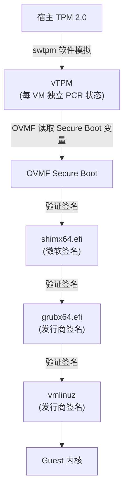

# 多重引导与虚拟化引导

> [!abstract] TL;DR
> 多重引导是同一台物理机上让多个操作系统共存并按需选择启动的技术体系，核心手段是 GRUB 的链式加载（chainloading）与 UEFI 的 BootOrder 变量管理。虚拟化引导则把"机器启动"的语义搬进软件层：Type-1 Hypervisor（Xen）将 dom0 作为特权虚拟机直接由 Multiboot 引导；KVM/QEMU 为 Guest 提供仿真固件（SeaBIOS/OVMF）或通过 `-kernel` 旁路固件直接注入内核；PVH 协议进一步跳过固件仿真，让 Guest 内核直接接收 Xen/KVM 传递的引导信息。云环境中，cloud-init 在 Guest 第一次启动时完成个性化配置；Secure Boot 通过 vTPM 和 OVMF 的 Secure Boot 支持延伸至虚拟机内部。理解这些层次，是排查多系统引导冲突、调试虚拟机启动失败、设计私有云镜像构建流水线的基础。

---

## 概述与定位

### 多重引导的本质

多重引导（Multi-boot，也称双系统/多系统）解决的问题是：一块物理磁盘上同时安装 Windows 和 Linux，或者多个 Linux 发行版，它们都需要被引导加载，但同一时刻只能运行一个。这个需求催生了一整套机制：

1. **分区共存**：通过 MBR/GPT 将磁盘划分为独立的分区，每个操作系统占据自己的分区，互不干扰文件系统。
2. **引导菜单**：在启动时弹出菜单让用户选择，或按超时自动进入默认项。
3. **引导项管理**：在 UEFI 时代，`EFI System Partition`（ESP）上存放各系统的 `.efi` 加载器，固件变量 `BootOrder` 决定优先级。
4. **链式引导**：GRUB 发现某个分区的引导记录或另一个 `.efi` 文件时，把控制权完整地转交给它——即 chainloading。

### 虚拟化引导的本质

虚拟化引导将"启动一台机器"的抽象从物理硬件解耦，改由 Hypervisor（虚拟化监控程序）来呈现一个虚拟的硬件环境，再在其上运行 Guest 操作系统的完整启动链。这衍生出若干优化路径：

- **完全仿真固件**：QEMU 使用 SeaBIOS（传统 BIOS 仿真）或 OVMF（UEFI 仿真），Guest 内核看到的是一台普通 PC，启动链完整保留。
- **半虚拟化引导（PV boot）**：Xen 的 PV（Paravirtualized）模式下，Guest 内核直接由 Hypervisor 加载，无需固件和 Bootloader 介入。
- **PVH 协议**：Xen/KVM 的混合模式，保留 x86 硬件虚拟化（VT-x/AMD-V）但跳过固件仿真，内核通过 Multiboot2/PVH Entry Point 接收启动参数。
- **直接内核引导（`-kernel`）**：QEMU 的工程捷径，Hypervisor 本身将内核注入 Guest 内存并设置寄存器，完全绕过 Guest 内的 Bootloader。

本篇承接 [[04.引导加载器GRUB与U-Boot]]（GRUB 基本原理）、[[02.BIOS与UEFI固件]]（UEFI 结构），聚焦于多系统引导与虚拟化引导的交汇点。

---

## 原理与机制

### GRUB Chainloading 链式加载

GRUB（GNU GRand Unified Bootloader）的 `chainloader` 命令实现了控制权向另一个引导加载器的委托。其工作原理如下：

**BIOS Legacy 模式下的 chainloading**

在 BIOS 模式下，每个分区的前 446 字节（MBR）或分区第一个扇区（Volume Boot Record，VBR）可以包含一个迷你引导程序。GRUB 的 `chainloader` 命令将目标扇区读入内存 `0x7C00`，然后跳转过去：

```grub
menuentry "Windows 10" {
    insmod part_gpt
    insmod ntfs
    set root=(hd0,gpt2)
    chainloader +1          # 读取该分区的第一个扇区（VBR）
}
```

`+1` 表示偏移量为 1 扇区（相对于分区起始），即 VBR。GRUB 在跳转前会设置好 `DL` 寄存器（BIOS 磁盘号）和分区引导标志，以满足被链加载的引导程序的期望。

**UEFI 模式下的 chainloading**

在 UEFI 系统上，每个引导项对应一个 `.efi` 可执行文件（PE32+ 格式）。GRUB 的 `chainloader` 命令改为加载并执行另一个 `.efi` 文件：

```grub
menuentry "Windows Boot Manager" {
    insmod part_gpt
    insmod fat
    set root=(hd0,gpt1)    # ESP 分区
    chainloader /EFI/Microsoft/Boot/bootmgfw.efi
}
```

GRUB 利用 UEFI `LoadImage()` + `StartImage()` Boot Services 接口将目标 `.efi` 装载为一个新的 UEFI 应用程序，再把控制权交给它。这与 UEFI 固件本身加载 GRUB 的方式完全对称。

**secure boot 下的 chainloading**

若 Secure Boot 开启，`.efi` 文件必须通过有效的证书链验证。GRUB 本身需要由微软/发行商签名的 shim 中间层加载（见[[13.可信启动与启动安全]]），被 chainload 的 Windows Boot Manager 本身携带微软签名，故可直接通过。

### os-prober 与自动发现多系统

`os-prober` 是一个 Shell 脚本集合，`update-grub`（Debian/Ubuntu）或 `grub-mkconfig`（通用）在生成 `grub.cfg` 时会调用它，自动检测磁盘上的其他操作系统并添加菜单项。

其检测逻辑为：

1. 遍历 `/proc/partitions` 中的所有分区。
2. 临时挂载各分区，检测以下特征：
   - 是否存在 `\Windows\System32\winload.exe` 或 `\bootmgr`（Windows）。
   - 是否存在 `/boot/grub/grub.cfg` 或 `/etc/os-release`（Linux）。
   - 是否存在 macOS 的 `\System\Library\CoreServices\boot.efi`。
   - 分区 VBR 魔数（FreeBSD 等 BSD 系统）。
3. 将识别结果写入临时文件，`grub-mkconfig` 据此生成对应的 `menuentry` 块。

`os-prober` 在某些发行版中默认被禁用（Fedora 38+ 以安全为由默认关闭），可在 `/etc/default/grub` 中设置 `GRUB_DISABLE_OS_PROBER=false` 重新启用。

### UEFI 启动项：efibootmgr 与 EFI 变量

UEFI 固件将启动配置存储于 NVRAM（非易失性 RAM）中，以 UEFI 变量形式暴露（通过 `EFI_RUNTIME_SERVICES.GetVariable/SetVariable`）。在 Linux 下通过 `efibootmgr` 工具读写这些变量：

```
Boot0000* Windows Boot Manager
Boot0001* ubuntu
Boot0002* Fedora
BootOrder: 0001,0000,0002
```

- **`BootXXXX`** 变量（如 `Boot0001`）：描述一个启动项，包含人类可读的描述字符串和 `EFI_DEVICE_PATH_PROTOCOL`（从哪个设备/文件加载 `.efi`）。
- **`BootOrder`** 变量：一个 `uint16_t` 数组，按优先级从高到低列出启动项编号。固件按此顺序尝试，第一个能成功加载的项目被执行。
- **`BootCurrent`**：本次启动实际使用的项目编号（只读）。
- **`BootNext`**：下次启动优先使用的项目，使用一次后自动清除（单次覆盖）。

```bash
# 查看当前所有启动项
efibootmgr -v

# 创建新启动项：从 /dev/sda 的第 1 分区加载 /EFI/myos/bootx64.efi
efibootmgr --create \
    --disk /dev/sda \
    --part 1 \
    --label "MyOS" \
    --loader '\EFI\myos\bootx64.efi'

# 调整启动顺序（0002 优先）
efibootmgr --bootorder 0002,0001,0000

# 删除启动项
efibootmgr --bootnum 0003 --delete-bootnum

# 设置下次启动使用 Boot0002（单次）
efibootmgr --bootnext 0002
```

**ESP 目录结构**

ESP 是一个 FAT32 分区（GUID = `C12A7328-F81F-11D2-BA4B-00A0C93EC93B`），UEFI 固件可读取它。典型目录布局：

```
/EFI/
├── Boot/
│   └── bootx64.efi          # 回退启动器（Fallback bootloader）
├── Microsoft/
│   └── Boot/
│       ├── bootmgfw.efi     # Windows Boot Manager
│       └── BCD              # Windows 启动配置数据
├── ubuntu/
│   ├── grubx64.efi          # GRUB EFI 主体
│   ├── shimx64.efi          # Shim（Secure Boot 签名中间层）
│   └── grub.cfg
└── fedora/
    ├── shim.efi
    └── grubx64.efi
```

`/EFI/Boot/bootx64.efi` 是 UEFI 规范定义的"最后回退"入口——当 `BootOrder` 中所有项目都失败，固件会尝试它。安装操作系统通常既在此放置副本，也创建专属的 `BootXXXX` 条目。

### Multiboot / Multiboot2 规范

Multiboot 规范（现为 Multiboot2，见 GNU 官方文档）定义了引导加载器与内核之间的接口，使任何遵循该规范的引导加载器都能加载任何遵循该规范的内核，而不依赖特定的 OS/加载器组合。

**Multiboot2 Header（嵌入内核 ELF 的 `.multiboot` 段）：**

```c
/* Multiboot2 Header Magic: 0xE85250D6 */
struct multiboot2_header {
    uint32_t magic;          // 0xE85250D6
    uint32_t architecture;   // 0 = i386 Protected Mode
    uint32_t header_length;
    uint32_t checksum;       // -(magic + arch + length)
    // 后跟若干 tag（地址信息、入口地址、内存要求等）
};
```

引导加载器（如 GRUB2 的 `multiboot` / `multiboot2` 命令）识别此 magic：

1. 将内核 ELF 加载到内存（依据 ELF `LOAD` 段或 Multiboot 地址 tag 指定的物理地址）。
2. 构建 **Multiboot2 Information Structure（MBI）**，填入内存映射、命令行、模块列表、framebuffer 信息等。
3. 将 `EAX` 设为 `0x36D76289`（Multiboot2 magic），`EBX` 设为 MBI 的物理地址，跳转内核入口。

```grub
# GRUB 加载符合 Multiboot2 规范的内核
menuentry "MyKernel (Multiboot2)" {
    multiboot2 /boot/mykernel.elf root=/dev/sda2
    module2    /boot/initrd.img   --type=initrd
    boot
}
```

Multiboot2 是 Xen Hypervisor 加载 dom0 内核的基础，也被许多教学内核、研究型 OS（如 Fuchsia 早期版本）采用。

---

## 结构/算法/伪代码详解

### Type-1 Hypervisor 引导：Xen 与 dom0

Xen 是典型的 Type-1 Hypervisor：它直接跑在硬件上，而非寄宿于宿主 OS。其启动链如下：



**GRUB 如何加载 Xen：**

```grub
menuentry "Xen 4.17 + Linux dom0" {
    insmod xzio
    insmod gzio
    insmod part_gpt
    insmod ext2
    set root=(hd0,gpt2)

    # 先加载 Xen Hypervisor（Multiboot2 格式）
    multiboot2 /boot/xen-4.17.gz \
        dom0_mem=2048M,max:2048M \
        dom0_max_vcpus=2 \
        iommu=on

    # 再加载 dom0 内核作为 Module
    module2 /boot/vmlinuz-6.1.0-xen \
        root=/dev/sda3 ro console=hvc0

    # 加载 dom0 的 initrd 作为第二个 Module
    module2 /boot/initrd.img-6.1.0-xen
    boot
}
```

GRUB 的 `multiboot2` 命令加载 `xen.gz`，Xen 成为 "内核"，`module2` 加载的 Linux 内核和 initrd 在 Xen 眼中是 Multiboot modules，Xen 在自身初始化完毕后从这些 modules 中解析出 dom0 内核。

**dom0 的特权地位**

dom0（Domain 0）是 Xen 创建的第一个、也是最特权的虚拟机：

- **直接访问硬件**：通过 IOMMU pass-through，dom0 可以直接控制网卡、存储控制器，运行原生驱动。
- **Hypercall 权限**：dom0 可以调用 `HYPERVISOR_domctl()` 等特权 Hypercall 创建/销毁/暂停/迁移 domU。
- **xenstore**：轻量级 key-value 数据库，运行于 dom0，所有 domU 通过 `xenbus` 协议与其通信，协商虚拟设备参数（前端/后端 split driver 模型）。

### KVM/QEMU Guest 引导：完整固件路径

KVM（Kernel-based Virtual Machine）是 Linux 内核模块，提供 CPU 虚拟化基础设施（Intel VT-x/AMD-V）；QEMU 是用户态的机器仿真器，利用 KVM 加速。Guest 启动有多条路径：

**路径 A：仿真 BIOS（SeaBIOS）**

```bash
qemu-system-x86_64 \
    -enable-kvm \
    -m 2048 \
    -drive file=ubuntu.qcow2,format=qcow2 \
    -bios /usr/share/seabios/bios.bin
```

SeaBIOS 是开源的 BIOS 固件实现，在 QEMU 内运行，仿真标准 PC BIOS 接口（INT 13h 磁盘服务等），Guest 系统执行完整的传统 BIOS 引导链（MBR → VBR → GRUB legacy/stage2 → 内核）。

**路径 B：仿真 UEFI（OVMF）**

OVMF（Open Virtual Machine Firmware）是基于 EDK II 的 UEFI 固件实现，专门为虚拟机设计：

```bash
# 首先复制 OVMF 变量存储（每个 VM 独立）
cp /usr/share/OVMF/OVMF_VARS.fd /var/lib/qemu/vm1-OVMF_VARS.fd

qemu-system-x86_64 \
    -enable-kvm \
    -m 2048 \
    -drive if=pflash,format=raw,readonly=on,\
file=/usr/share/OVMF/OVMF_CODE.fd \
    -drive if=pflash,format=raw,\
file=/var/lib/qemu/vm1-OVMF_VARS.fd \
    -drive file=ubuntu.qcow2,format=qcow2,if=virtio \
    -net nic,model=virtio \
    -net user
```

- `OVMF_CODE.fd`：UEFI 固件代码（只读，所有 VM 共享同一份）。
- `OVMF_VARS.fd`：UEFI 变量存储（每个 VM 独立副本，存储 `BootOrder`、密钥等）。
- `if=pflash`：模拟 `pflash`（平行 Flash）总线，UEFI 标准方式挂载固件映像。

Guest 内部的引导链：`OVMF → GRUB（EFI）→ vmlinuz → initrd → systemd`，与裸机 UEFI 启动完全一致。

**路径 C：`-kernel` 直接引导**

```bash
qemu-system-x86_64 \
    -enable-kvm \
    -m 2048 \
    -kernel /boot/vmlinuz-6.8.0 \
    -initrd /boot/initrd.img-6.8.0 \
    -append "root=/dev/vda1 ro console=ttyS0 quiet" \
    -drive file=ubuntu.qcow2,format=qcow2,if=virtio
```

QEMU 在此模式下扮演了引导加载器的角色：

1. 将内核文件读入 Guest 物理内存的适当地址（遵循 Linux x86 Boot Protocol：`0x100000` 以上）。
2. 将 initrd 读入内存，记录其地址和大小写入内核 `boot_params`（`initrd_addr`/`initrd_size`）。
3. 构造 `boot_params`（即 `zeropage`，内含 `setup_header`），填入命令行、内存映射等。
4. 将 `RSI` 设为 `boot_params` 地址，跳转到内核的 `startup_64` 入口（64-bit EFI 手off 协议或 `0x1000000` 处）。

这条路径完全绕过 SeaBIOS 和 OVMF，常用于内核开发、快速迭代调试、CI/CD 环境。

### PVH 直接启动协议

PVH（Para-Virtualized HVM）是 Xen 项目定义的启动协议，后来 KVM 也采用了类似机制（通过 `linux/pvh.h` 中的 `hvm_start_info` 结构）：

**目标**：让 Guest 内核以原生 64-bit 保护模式直接启动，不经过固件仿真（BIOS/UEFI）也不经过 Bootloader，但保留硬件虚拟化（VT-x 而非 Xen PV 模式的 Hypercall ABI）。

**内核端 PVH 入口**（`arch/x86/platform/pvh/head.S`）：

```asm
; PVH 入口点地址通过 ELF Note 描述（XEN_ELFNOTE_PHYS32_ENTRY）
; 进入时：
;   - EBX = hvm_start_info 结构的物理地址
;   - 已处于 32-bit 保护模式（cs.base=0, limit=4G）
;   - A20 已开启，CR0.PE=1，CR0.PG=0（分页尚未开启）

SYM_CODE_START(pvh_start_xen)
    mov   %ebx, %edi           ; 保存 hvm_start_info 指针
    mov   $__PAGE_OFFSET, %eax ; 内核虚拟基址
    ; ... 设置早期页表，切换到 64-bit 长模式 ...
    call  xen_prepare_pvh
    jmp   startup_64
SYM_CODE_END(pvh_start_xen)
```

**`hvm_start_info` 结构**（Hypervisor 填写，内核读取）：

```c
struct hvm_start_info {
    uint32_t magic;          // 0x336ec578 ("xEn3" 的变体)
    uint32_t version;        // 版本号，当前为 1
    uint32_t flags;
    uint32_t nr_modules;     // 附加模块数量（如 initrd）
    uint64_t modlist_paddr;  // 模块列表物理地址
    uint64_t cmdline_paddr;  // 命令行字符串物理地址
    uint64_t rsdp_paddr;     // ACPI RSDP 物理地址（从 Xen 获取）
    uint64_t memmap_paddr;   // E820 内存映射物理地址
    uint32_t memmap_entries;
};
```

PVH 的优势：
- **零固件开销**：不需要仿真 BIOS 中断、ACPI 解析、UEFI 协议栈的初始化开销。
- **启动更快**：虚拟机冷启动时间比 SeaBIOS/OVMF 路径缩短 30%~50%（取决于固件初始化复杂度）。
- **安全边界清晰**：不需要仿真复杂的 BIOS/UEFI 代码，减少攻击面。

### virtio 设备与引导

virtio 是一套半虚拟化设备标准（OASIS virtio 规范），定义了 Guest 与 Hypervisor 之间高效通信的接口，用于块设备（`virtio-blk`）、网络（`virtio-net`）、控制台（`virtio-console`）、随机数（`virtio-rng`）等。

从引导视角看 virtio 的关键作用：

**virtio-blk（块设备）**：Guest 的根文件系统通常挂载在 `virtio-blk` 虚拟磁盘上（`/dev/vda`）。内核在初始化 virtio-blk 驱动之前无法访问该盘，因此 initramfs 必须包含 `virtio_blk.ko`（或静态编译进内核）。

```bash
# 确保 initramfs 包含 virtio 模块（Debian/Ubuntu）
echo "virtio_blk" >> /etc/initramfs-tools/modules
update-initramfs -u
```

**virtio-net（网络）**：PXE 网络引导时，若使用 virtio-net，需要 QEMU 的 `virtio-net` 设备带上 ROM（通常是 `ipxe.rom`）。`edk2-ovmf` 包中的 iPXE ROM 支持从 virtio-net 做 PXE 引导。

**引导设备顺序**：OVMF 的 UEFI 固件会枚举 QEMU 提供的 virtio 设备，通过其 PCI 能力结构发现 virtio-net/blk，在 UEFI 的 `ConIn`/`ConOut`/`ConnectController` 流程中逐一连接驱动，最终建立 Boot 设备路径——这与裸机 UEFI 发现 SATA/NVMe 的逻辑完全相同，只是驱动实现换成了 virtio 驱动。

### 完整引导流程对比



---

## 工具视角与实战

### 管理 GRUB 多系统菜单

**手动添加菜单项**

`/etc/grub.d/40_custom` 是放置自定义菜单条目的标准位置，`update-grub` 会包含它：

```bash
# /etc/grub.d/40_custom
#!/bin/sh
exec tail -n +3 $0

menuentry "Fedora 40 (on /dev/sdb2)" {
    insmod gzio
    insmod part_gpt
    insmod ext2
    search --no-floppy --fs-uuid --set=root 3f8a2c1d-4e7b-4c9a-8b3e-1f2a3b4c5d6e
    linux   /boot/vmlinuz-6.8.0-300.fc40.x86_64 root=UUID=3f8a2c1d-4e7b-4c9a-8b3e-1f2a3b4c5d6e ro quiet
    initrd  /boot/initramfs-6.8.0-300.fc40.x86_64.img
}
```

**超时和默认项**（`/etc/default/grub`）：

```bash
GRUB_TIMEOUT=10           # 显示菜单 10 秒
GRUB_DEFAULT=saved        # 记住上次选择
GRUB_SAVEDEFAULT=true     # 自动保存默认项
GRUB_TIMEOUT_STYLE=menu   # 始终显示菜单（而非 hidden）
```

**让 os-prober 正常工作**

```bash
# 安装 os-prober
apt install os-prober  # Debian/Ubuntu

# 挂载其他系统的 ESP（如果在独立磁盘）
mount /dev/sdb1 /mnt

# 启用 os-prober 并重新生成 grub.cfg
echo 'GRUB_DISABLE_OS_PROBER=false' >> /etc/default/grub
update-grub
```

### efibootmgr 实战操作

```bash
# 查看详细信息（含设备路径）
efibootmgr -v

# 典型输出示例：
# BootCurrent: 0001
# Timeout: 1 seconds
# BootOrder: 0001,0000,0002
# Boot0000* Windows Boot Manager HD(1,GPT,...)/File(\EFI\Microsoft\Boot\bootmgfw.efi)
# Boot0001* ubuntu  HD(1,GPT,...)/File(\EFI\ubuntu\shimx64.efi)
# Boot0002  Fedora  HD(1,GPT,...)/File(\EFI\fedora\shim.efi)

# 禁用某个启动项（不删除，只清 Active 标志）
efibootmgr --bootnum 0002 --inactive

# 重新激活
efibootmgr --bootnum 0002 --active

# 修改启动项描述（需删除重建）
efibootmgr --bootnum 0002 --delete-bootnum
efibootmgr --create --disk /dev/sda --part 1 \
    --label "Fedora 40" --loader '\EFI\fedora\shim.efi'
```

**恢复被覆盖的 Linux EFI 引导项**（Windows 安装后常见）：

```bash
# 从 Live CD 环境
mount /dev/sda1 /mnt/boot/efi   # 挂载 ESP
grub-install --target=x86_64-efi \
    --efi-directory=/mnt/boot/efi \
    --bootloader-id=ubuntu \
    --recheck
# 重新生成 grub.cfg
mount /dev/sda2 /mnt
mount --bind /dev /mnt/dev
mount --bind /proc /mnt/proc
chroot /mnt update-grub
```

### QEMU/KVM 虚拟机引导调试

**查看 SeaBIOS 输出**

```bash
qemu-system-x86_64 \
    -enable-kvm \
    -m 2048 \
    -serial stdio \           # SeaBIOS 输出重定向到 stdout
    -drive file=disk.qcow2 \
    -boot menu=on,splash-time=5000
```

**OVMF 调试串口输出**

```bash
# 使用调试版 OVMF（含 DEBUG 日志）
qemu-system-x86_64 \
    -enable-kvm \
    -drive if=pflash,format=raw,readonly=on,\
file=/usr/share/OVMF/OVMF_CODE.debug.fd \
    -drive if=pflash,format=raw,file=OVMF_VARS.fd \
    -serial file:/tmp/ovmf.log \
    -drive file=disk.qcow2,if=virtio
```

**`-kernel` 调试内核崩溃**

```bash
qemu-system-x86_64 \
    -enable-kvm \
    -m 2048 \
    -kernel ./arch/x86/boot/bzImage \
    -append "root=/dev/vda1 ro console=ttyS0,115200 nokaslr" \
    -drive file=rootfs.qcow2,if=virtio \
    -serial stdio \          # 内核 printk 输出到 stdout
    -s -S                    # 开启 gdb stub，在 0x1000000 处等待
# 另一终端：
# gdb vmlinux
# (gdb) target remote :1234
# (gdb) hbreak start_kernel
# (gdb) c
```

### 云镜像与 cloud-init 启动

云提供商（AWS、GCP、Azure、OpenStack）分发的云镜像通过 `cloud-init` 在第一次引导时完成个性化配置，替代手动安装。

**cloud-init 数据源（DataSource）**

cloud-init 启动时需要从某个"数据源"获取配置。数据源的获取方式：

| 数据源 | 机制 |
| --- | --- |
| EC2 | HTTP GET `http://169.254.169.254/latest/meta-data/` |
| OpenStack | HTTP GET `http://169.254.169.254/openstack/` 或 config-drive（ISO 磁盘） |
| NoCloud | 本地文件 `/var/lib/cloud/seed/nocloud/` 或 `cidata` 标签 ISO |
| GCE | HTTP GET `http://metadata.google.internal/computeMetadata/v1/` |

**NoCloud 本地测试**（适合 QEMU 环境）：

```bash
# 创建 user-data 和 meta-data
mkdir -p /tmp/cidata
cat > /tmp/cidata/user-data << 'EOF'
#cloud-config
hostname: myvm
users:
  - name: ubuntu
    sudo: ALL=(ALL) NOPASSWD:ALL
    ssh_authorized_keys:
      - ssh-rsa AAAA...你的公钥...
packages:
  - nginx
runcmd:
  - systemctl enable nginx
  - systemctl start nginx
EOF
cat > /tmp/cidata/meta-data << 'EOF'
instance-id: vm-001
local-hostname: myvm
EOF

# 打包为 ISO（cloud-init 识别为 NoCloud 数据源）
genisoimage -output cidata.iso -volid cidata \
    -joliet -rock /tmp/cidata/user-data /tmp/cidata/meta-data

# 挂载给 VM
qemu-system-x86_64 \
    -enable-kvm \
    -m 2048 \
    -drive file=ubuntu-22.04-server-cloudimg-amd64.img,if=virtio \
    -drive file=cidata.iso,if=virtio,media=cdrom \
    -serial stdio
```

**cloud-init 五阶段启动**



cloud-init 与引导的耦合点：`/etc/fstab` 和磁盘分区可以由 cloud-init 的 `growpart`/`resize2fs` 模块动态扩展（云磁盘通常比实际镜像大），这在 `local` 阶段完成，在内核挂载根文件系统之后、其他服务启动之前执行。

---

## 安全性与正确使用

### 引导项篡改与防护

**UEFI 变量写保护**

`BootOrder` 和 `BootXXXX` 变量的属性（`EFI_VARIABLE_ATTRIBUTES`）通常包含 `NV | BS | RT`（非易失、Boot Services 可访问、Runtime Services 可访问）。在 Secure Boot 关闭时，任何具有 `CAP_SYS_ADMIN` 权限的 Linux 进程（通过 `/sys/firmware/efi/efivars/` 或 `efivarfs`）均可修改这些变量。

攻击场景：恶意软件以 root 身份运行，将 `BootOrder` 修改为指向其控制的 `.efi` 文件，在下次重启时劫持引导链。

防护手段：
- **Secure Boot**：`.efi` 文件必须通过 db（Authorized Signatures Database）中的密钥验证，未签名或签名无效的 `.efi` 无法执行。恶意替换的 `.efi` 若无有效签名则被拒绝。
- **UEFI 变量写保护（Secure Boot 开启时）**：部分固件在 Secure Boot 模式下对特定变量施加额外写保护，需 Physical Presence（需用户在固件 UI 中确认）。
- **只读 efivars 挂载**：容器/沙箱环境中以只读方式挂载 `efivarfs`。

**GRUB 密码保护**

```bash
# 在 GRUB shell 中生成密码 hash
grub-mkpasswd-pbkdf2
# 输入密码后得到类似：
# grub.pbkdf2.sha512.10000.AABBCC...

# /etc/grub.d/00_header 或 40_custom 中配置
set superusers="admin"
password_pbkdf2 admin grub.pbkdf2.sha512.10000.AABBCC...

# 菜单项添加 --unrestricted 允许不输密码引导（只锁编辑/命令行）
menuentry "Ubuntu" --unrestricted {
    ...
}
```

### 虚拟化逃逸边界

虚拟化引导的安全边界是 Hypervisor，Guest 的引导链安全依赖于 Hypervisor 的隔离保证：

**VM 引导与宿主安全**

- **Guest 不能读写 Host 文件系统**：除非通过明确共享（`virtiofs`、9p）。QEMU 的 `-kernel` 模式从 Host 文件系统读取内核，宿主内核文件的完整性是 Guest 安全启动的前提。
- **固件仿真代码的攻击面**：SeaBIOS/OVMF 运行在 QEMU 进程内（用户态），若 Guest 能触发 QEMU 的固件仿真 bug（如 OVMF 的 USB 设备枚举、ACPI 表解析），可能导致 QEMU 进程崩溃（DoS）或代码执行（VM 逃逸）。业界通过 `seccomp`、`SELinux/AppArmor` 限制 QEMU 进程系统调用来缓解。
- **virtio-blk/net 驱动与宿主共享**：virtio 协议通过共享内存（virtqueue）通信，理论上 Guest 可以构造非法 virtqueue entry 触发 Hypervisor 越界访问。已知的 `VENOM`（CVE-2015-3456）漏洞即通过 QEMU 的虚拟软盘控制器实现宿主逃逸。

**Secure Boot 延伸至虚拟机：vTPM 与 OVMF**



`swtpm`（Software TPM）为每个虚拟机提供独立的软件 TPM 2.0 实例，OVMF 在启动时与 `swtpm` 通信，执行 PCR 扩展（与裸机 TPM 的 Measured Boot 逻辑相同）。Guest 内部的 Secure Boot 策略由其 `OVMF_VARS.fd` 中存储的 PK/KEK/db 决定——与宿主 Secure Boot 状态独立。

```bash
# 为 VM 创建 swtpm 实例
mkdir -p /var/lib/swtpm/vm1
swtpm_setup --tpmstate /var/lib/swtpm/vm1 \
    --tpm2 --create-ek-cert --create-platform-cert --lock-nvram

# 启动时关联 swtpm
swtpm socket --tpmstate dir=/var/lib/swtpm/vm1 \
    --ctrl type=unixio,path=/tmp/swtpm-vm1.sock \
    --tpm2 --daemon

qemu-system-x86_64 \
    -enable-kvm \
    -drive if=pflash,format=raw,readonly=on,file=OVMF_CODE.secboot.fd \
    -drive if=pflash,format=raw,file=OVMF_VARS.secboot.fd \
    -chardev socket,id=chrtpm,path=/tmp/swtpm-vm1.sock \
    -tpmdev emulator,id=tpm0,chardev=chrtpm \
    -device tpm-tis,tpmdev=tpm0 \
    -drive file=ubuntu.qcow2,if=virtio
```

**PVH 的安全特性**

PVH 跳过固件仿真的副作用之一是减小了攻击面：无 SeaBIOS/OVMF ACPI/USB 枚举代码，Guest 与 Hypervisor 之间的接口仅为 `hvm_start_info` 结构和 Hypercall ABI，接口远比完整固件仿真简洁。但引入的风险是：`hvm_start_info` 的内存地址由 Hypervisor 传递，若 Guest 内核对该结构验证不严（如不检查 magic、越界访问），可能被恶意 Hypervisor 利用——不过在 Hypervisor 可信的前提下（Type-1 本身即信任根），这不构成实际威胁。

### 多重引导的分区安全

- **分区隔离**：不同操作系统位于不同分区，但 Linux 以 root 运行时可挂载任意分区，对其他系统的文件系统没有技术隔离。多系统环境下需注意不要在 Linux 中挂载并意外修改 Windows NTFS 分区（尤其是快速启动导致 Windows 分区处于 dirty 状态时，强制挂载会导致数据损坏）。
- **共享 ESP 的风险**：所有操作系统共享同一个 ESP（或至少共享 `/EFI/Boot/bootx64.efi` 这一回退项），一个系统的安装程序覆盖另一系统的 `.efi` 文件是常见问题，恶意软件也可借此植入后门引导器。

---

## 小结

多重引导与虚拟化引导是"操作系统如何被加载"这一问题在两个不同维度上的扩展：

1. **GRUB chainloading** 通过"委托"而非"理解"来支持多系统：GRUB 不需要知道 Windows 或 FreeBSD 的引导协议，只需把正确的扇区或 `.efi` 文件交给它们自己的引导加载器执行。`os-prober` 将这一过程自动化。

2. **UEFI BootOrder/BootXXXX 变量体系** 是固件层面的多引导管理器，`efibootmgr` 是其 Linux 控制接口。ESP 的目录结构（`/EFI/OS名/`）让多系统在同一分区上共存而互不覆盖。

3. **Multiboot/Multiboot2 规范** 定义了引导加载器与内核的标准接口，是 Xen 加载 dom0 的基础，也令不同操作系统项目可以共用引导加载器。

4. **Xen dom0 引导** 体现了 Type-1 Hypervisor 的本质：Hypervisor 先于所有 OS 运行，dom0 是特权 Guest 而非宿主 OS。

5. **KVM/QEMU 的三条启动路径**——SeaBIOS（完整 BIOS 仿真）、OVMF（完整 UEFI 仿真）、`-kernel`（直接注入）——适用场景各异：生产部署用 OVMF，内核开发迭代用 `-kernel`，遗留系统兼容用 SeaBIOS。

6. **PVH 协议** 代表虚拟化引导的极简方向：保留硬件虚拟化特性、去掉固件仿真层，降低开销和攻击面。

7. **cloud-init** 在云环境中承担了以往安装程序/kickstart 的职责，通过引导时数据源注入个性化配置，是云镜像与 VM 引导的重要粘合剂。

8. **安全链的延伸**：Secure Boot + vTPM + OVMF 将可信启动的保障延伸到虚拟机内部，Guest 的引导链可以像裸机一样被度量和验证。

---

## 相关阅读

- [[04.引导加载器GRUB与U-Boot]] — GRUB 多阶段加载、`boot.img`/`core.img`/`grub.cfg`、U-Boot 嵌入式引导
- [[02.BIOS与UEFI固件]] — UEFI Boot Services/Runtime Services、ESP、PE32+ 格式
- [[03.MBR与GPT与引导扇区]] — MBR 结构、GPT 分区表、分区 UUID
- [[13.可信启动与启动安全]] — Secure Boot、TPM PCR、shim、LUKS 全盘加密
- [[06.内核解压与早期初始化]] — `startup_64`、`start_kernel`、`boot_params` 结构
- [GNU GRUB 手册 — Chainloading](https://www.gnu.org/software/grub/manual/grub/grub.html#Chain_002dloading)
- [Xen PVH Boot Protocol — xen/include/public/arch-x86/hvm/start_info.h](https://xenbits.xen.org/gitweb/?p=xen.git;a=blob;f=xen/include/public/arch-x86/hvm/start_info.h)
- [OVMF 项目 — edk2 tianocore](https://github.com/tianocore/edk2/tree/master/OvmfPkg)
- [cloud-init 文档](https://cloudinit.readthedocs.io/)
- [Multiboot2 规范](https://www.gnu.org/software/grub/manual/multiboot2/multiboot.html)
- [UEFI Specification 2.10](https://uefi.org/specifications)

---

[[00.操作系统加载与启动总览|⬆ 系列总览]] | [[19.initramfs与early_userspace|← 上一章]] | [[21.coreboot与LinuxBoot开源固件|→ 下一章]]
