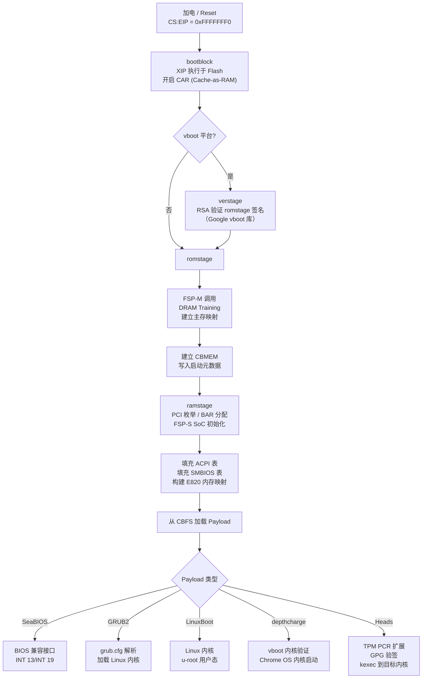
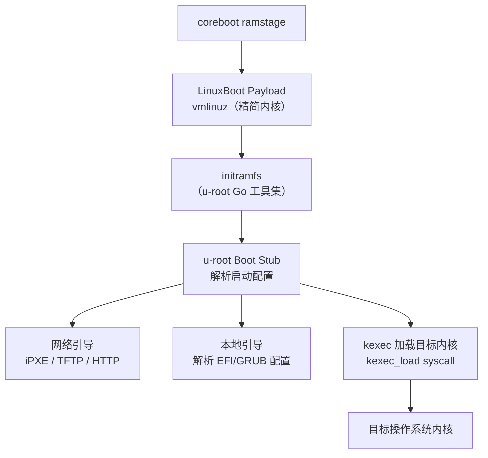

# coreboot 与 LinuxBoot 开源固件

> [!abstract] TL;DR
> coreboot 是一个开源固件框架，彻底取代传统 BIOS/UEFI，将硬件初始化压缩到最小必要集合，再把控制权交给可替换的 payload（SeaBIOS、GRUB2、LinuxBoot、EDK2 等）。LinuxBoot 进一步将 Linux 内核本身作为固件 payload，以 u-root 提供 Go 实现的用户态工具，主打数据中心场景下的可审计性与启动速度。两者的终极命题是：**固件是可信计算链的第一环，而这一环长期以来是一个不可审计的黑盒**——coreboot/LinuxBoot 的出现，让固件重新变得可读、可改、可验证。

---

## 概述与定位

### 为什么需要开源固件

一台 x86 机器从加电到内核接管控制，中间有一个几乎完全不透明的阶段：**固件**。传统 BIOS 诞生于 1975 年，随后被 UEFI 规范于 2005 年前后取代。UEFI 虽然在接口层面更现代，但其商业实现（AMI APTIO、Phoenix SecureCore、Insyde H2O）均为闭源二进制，代码量动辄数百万行，运行在 Ring 0 与 SMM（System Management Mode）之中，**无法审计、无法重现构建**。

这带来三类严重问题：

1. **供应链安全**：固件镜像由 OEM 和 ODM 生产，每经过一道手，注入持久化恶意代码的机会就增加一次。Hacking Team 泄露的 UEFI rootkit（VectorEDK）、NSA 的 DEITYBOUNCE（专门针对 Dell PowerEdge 服务器的固件植入）证明此类威胁完全现实。
2. **功能缺陷**：专有固件 bug 只能等待厂商推送更新，厂商往往不愿为老旧硬件发布补丁，导致安全漏洞长期悬而未决。
3. **移植与定制成本**：云服务商和 HPC 运营商有强烈的自定义需求（精简启动路径、统一管理、自动化部署），专有固件几乎不可能满足。

coreboot 项目（前身 LinuxBIOS，由 Ron Minnich 于 1999 年在洛斯阿拉莫斯国家实验室启动）正是在这一背景下诞生的。它的哲学非常激进：**固件只应做硬件必须由固件完成的事，其余一律交给软件**。

### coreboot 的生态定位

coreboot 不是一个"另一个 UEFI"，而是一套**最小化硬件初始化框架 + 可插拔 payload 机制**的组合。它支持的 payload 覆盖范围极广：

| Payload | 用途 |
|---|---|
| SeaBIOS | 提供传统 BIOS 接口，兼容 Windows/Linux 的传统引导路径 |
| GRUB 2 | 直接由固件层加载 GRUB，无需中间跳板 |
| LinuxBoot | Linux 内核 + u-root，用于服务器/数据中心 |
| EDK2 / TianoCore | 提供完整 UEFI 运行环境，兼容 Secure Boot |
| depthcharge | Chrome OS 专用 payload，实现 vboot 验证启动 |
| Heads | 注重安全的 payload，集成 TPM measured boot + GPG 签名验证 |

LinuxBoot 是 coreboot 的一个特殊方向，最初由 Ron Minnich（他也是 coreboot 创始人）与 Google 工程师在 2017 年前后推动，目标是将 Linux 内核与 u-root 打包成一个完整 payload，取代 UEFI DXE 阶段的庞大初始化逻辑。

---

## 原理与机制

### coreboot 启动的四个阶段

coreboot 的执行流被严格划分为四个阶段，每个阶段拥有不同的运行环境与职责：

```
加电 → bootblock → verstage → romstage → ramstage → payload
```

**阶段一：bootblock（纯 ROM 执行）**

CPU 复位后，CS:EIP 指向 0xFFFFFFF0（Reset Vector），从 SPI Flash 的顶部 16 字节开始执行。此时处于实模式，没有 RAM（DRAM 尚未初始化），CPU 的 Cache-as-RAM（CAR）功能尚未开启。

bootblock 的职责极简：
- 配置最基础的 CPU 寄存器（禁用某些加速功能，使内存映射稳定）
- 在 x86 上开启 Cache-as-RAM（CAR），让 L2/L3 缓存充当临时 RAM
- 加载并跳转到 verstage 或 romstage

bootblock 代码极短，通常只有数 KB，且必须完全从 Flash 原地执行（XIP，Execute-In-Place）。

**阶段二：verstage（可选，验证阶段）**

verstage 是 Google 为 ChromeOS vboot 流程引入的阶段，专门在 romstage 之前完成固件验证。若平台不需要 vboot，此阶段可跳过。

在 verstage 中，vboot 库从 Flash 读取 GBB（Google Binary Block）中的公钥，对 romstage/ramstage 的镜像进行 RSA 签名验证，若验证失败则拒绝继续启动。

**阶段三：romstage（内存初始化的核心）**

romstage 是 coreboot 中最复杂、平台差异最大的阶段，核心任务是 **DRAM 初始化**。

初始化 DRAM 需要：
1. 配置内存控制器（IMC，Intel Memory Controller Hub 或 SoC 内集成的控制器）
2. 执行内存训练（Training）：读取 SPD（Serial Presence Detect），确定时序参数（CL/RCD/RP/RAS、频率），校正 DQ/DQS 信号的延迟
3. 建立 DRAM 基本映射，使 CPU 能够访问主存

在 Intel 平台上，这部分逻辑极其复杂，Intel 将其封装为 **FSP（Firmware Support Package）**——一个二进制 blob，以 TempRamInit / MemoryInit / SiliconInit / NotifyPhase 四个 API 函数的形式对 coreboot 暴露接口。coreboot 在 romstage 调用 `FSP-M`（Memory Init）完成 DRAM 初始化，这是 Intel 平台上 coreboot 不可回避的 blob 依赖。

romstage 完成后，将关键配置（CBMEM，coreboot Memory Table）写入 DRAM，然后跳转到 ramstage。

**阶段四：ramstage（全功能初始化）**

ramstage 是在 DRAM 中运行的完整 C/C++ 环境，已具备完整的内存寻址能力。其职责：

- 枚举并初始化所有 PCI 设备（分配 BAR 空间）
- 初始化 SoC 的其余子系统（PCH、GFX、USB、SATA 控制器等），Intel 平台此处调用 `FSP-S`（Silicon Init）
- 填充 ACPI 表（RSDP/RSDT/XSDT/DSDT/SSDT/MADT/MCFG 等）
- 填充 SMBIOS 表（系统信息、内存条信息等）
- 建立 E820 内存映射（通过 coreboot 的 lib/cbmem.c 机制）
- 加载并跳转到 payload

### Intel FSP：开源与闭源的边界

FSP（Firmware Support Package）是 Intel 提出的一种妥协方案：将最敏感的硅片初始化代码以预编译二进制的形式发布，允许 coreboot 等开源固件通过标准 API 调用，无需掌握完整的硅片手册（部分内容 Intel 从不公开）。

FSP 分为三个模块：

| 模块 | 调用时机 | 功能 |
|---|---|---|
| FSP-T（TempRamInit） | bootblock 早期 | 配置 CAR |
| FSP-M（MemoryInit） | romstage | DRAM 训练与初始化 |
| FSP-S（SiliconInit） | ramstage | PCH/SoC 外设初始化 |

FSP 的存在是 coreboot"开源固件"声称的最大争议点：FSP blob 是闭源的，运行在 Ring 0，无法审计其行为。对 Intel 平台的 coreboot 移植，仍然有一层不可见的信任需要授予 Intel。

AMD 平台的情况略好：AMD 发布了 AGESA（AMD Generic Encapsulated Software Architecture）的完整源代码，coreboot 对 AMD 平台的移植在理论上是完全开源的。

RISC-V 平台则是目前最理想的状态：HiFive Unmatched 等开发板的 coreboot 移植不依赖任何二进制 blob。

### CBFS：coreboot 文件系统

CBFS（coreboot File System）是存储在 SPI Flash 中的一种极简文件系统，用于组织 coreboot 各阶段的代码、数据与 payload。

Flash 芯片（通常 4MB～32MB）被划分为多个区域：

```
+---------------------------+
| FMAP（Flash Map）         |  <- 描述各区域布局
+---------------------------+
| BOOTBLOCK                 |  <- 最先执行
+---------------------------+
| CBFS 主分区               |
|   romstage                |
|   ramstage                |
|   payload（e.g. SeaBIOS） |
|   ACPI 表源               |
|   FSP blob                |
|   logo.bmp（可选）        |
+---------------------------+
| ME Region（Intel ME）     |  <- Intel Management Engine，闭源
+---------------------------+
| GBB（ChromeOS 设备）      |
+---------------------------+
```

`cbfstool` 是操作 CBFS 的命令行工具，提供 add/extract/print/remove 等操作：

```bash
# 列出 CBFS 中的所有文件
cbfstool coreboot.rom print

# 提取 payload
cbfstool coreboot.rom extract -f payload.elf -n payload

# 添加一个文件到 CBFS
cbfstool coreboot.rom add -f logo.bmp -n logo.bmp -t raw
```

---

## 结构/算法/伪代码详解

### coreboot 启动流程的详细时序



### LinuxBoot 的详细架构

LinuxBoot 将 Linux 内核作为 coreboot payload，其设计哲学是：**用一个经过几十年验证的操作系统内核替换 UEFI DXE 的数百万行专有代码**。



**u-root** 是 LinuxBoot 的用户态组件，用 Go 语言实现了一套精简的 Unix 工具（ls、cat、ip、wget、curl 等），以及专属的启动工具（`boot`、`fbnetboot`、`systemboot`），编译后静态链接进 initramfs。Go 的静态编译特性使 u-root 不依赖任何动态库，非常适合固件级别的环境。

LinuxBoot 内核 是一个高度精简的 Linux 内核（去掉了绝大多数驱动和子系统，仅保留最小必要集合），通过 `CONFIG_INITRAMFS_SOURCE` 将 u-root initramfs 内嵌到内核镜像中，形成单一可部署的 ELF 文件。

最终，u-root 的 boot stub 通过 `kexec` 系统调用将真正的操作系统内核加载到内存并跳转执行，对目标内核而言，它看到的硬件状态与正常启动一致（ACPI 表已由 coreboot 填充）。

### vboot 验证启动流程

vboot（Verified Boot）是 Google 为 ChromeOS 设计的固件可信链方案，深度集成在 coreboot 中。

```
Flash 布局（ChromeOS 设备）
┌─────────────────┐
│  GBB            │  Google Binary Block：包含 root key（RSA-8192 公钥）
│  FMAP           │
├─────────────────┤
│  RO Region      │  只读（物理写保护）
│  ├─ bootblock   │
│  ├─ verstage    │
│  └─ depthcharge │  <- RO payload
├─────────────────┤
│  RW_A Region    │  可读写，含签名的 ramstage
│  RW_B Region    │  备用，A 损坏时 fallback
└─────────────────┘
```

验证过程：
1. bootblock（物理只读）从 GBB 读取 root public key
2. 用 root key 验证 firmware key（存储在 vblock 中）的签名
3. 用 firmware key 验证 RW 区域的 ramstage 签名
4. ramstage 中的 depthcharge 验证内核签名（kernel key）
5. 每一级验证通过后，才执行下一级代码

vboot 还引入了 A/B 槽回滚防护：若当前 A 槽启动失败（超过重试次数），自动切换到 B 槽，保证设备不会因固件更新失败而变砖。

### Heads：可信固件 + TPM Measured Boot

Heads 是一个以安全为核心的 coreboot payload，面向注重隐私的用户（ThinkPad、System76 等设备），主要特性：

**TPM Measured Boot**：在每个阶段执行前，将代码/配置的 SHA-256 哈希扩展到 TPM PCR（Platform Configuration Register）中：

```
PCR[0] ← SHA256(CRTM，即 coreboot bootblock + romstage)
PCR[2] ← SHA256(CBFS 内容)
PCR[4] ← SHA256(MBR / GRUB 配置)
PCR[7] ← SHA256(Secure Boot 策略)
```

PCR 值一旦扩展就无法重置（只能在 TPM 重置后清零），因此可以事后证明启动时的代码完整性。TPM Attestation 可将这些 PCR 值报告给远程验证服务器。

**GPG 内核签名验证**：Heads 在 kexec 之前，要求用户的 GPG 主密钥（通常存储在 YubiKey 或 Nitrokey）对内核镜像和 initramfs 进行签名，验证通过才执行 kexec。即便 DRAM 或磁盘内容被篡改，攻击者也无法在没有 GPG 私钥的情况下绕过验证。

**TOTP/HOTP 防物理攻击**：用户可在启动时验证一个时间/次数相关的一次性密码，确认固件没有被篡改（通过与 YubiKey 上的 HMAC-SHA1 比对）。

### flashrom：SPI Flash 的读写工具

`flashrom` 是 coreboot 项目孵化的 Flash 芯片读写工具，支持数百种 SPI Flash 芯片，可通过多种接口访问：

```bash
# 通过内部接口（直接访问主板 SPI Flash，需 root）
sudo flashrom -p internal -r backup.rom

# 通过 CH341A 编程器读取
sudo flashrom -p ch341a_spi -r backup.rom

# 写入新固件（--noverify-all 跳过校验，生产时不推荐）
sudo flashrom -p internal -w coreboot.rom

# 仅写入 CBFS 分区（局部写入，速度更快）
sudo flashrom -p internal -w coreboot.rom -l layout.txt -i COREBOOT
```

flashrom 在刷写之前会读取原始内容与新内容逐扇区比较，仅写入有差异的扇区，减少 Flash 写入次数（延长 Flash 寿命）和刷写时间。

**芯片识别机制**：flashrom 通过向 Flash 芯片发送 JEDEC ID 命令（0x9F）读取制造商 ID + 设备 ID，再查询内置的芯片数据库确定擦除/写入算法：

```
flashrom 内部流程：
  send(0x9F)  →  读取 3 字节 JEDEC ID（厂商 + 型号）
  查询 flashchips.c 数据库
  确定页大小（通常 256B）、扇区大小（通常 4KB 或 64KB）
  确定擦除命令（Sector Erase 0x20 / Block Erase 0xD8 / Chip Erase 0xC7）
  执行读/擦/写序列
```

---

## 工具视角与实战

### 构建 coreboot

coreboot 的构建系统基于 Kconfig（与 Linux 内核同款），工作流如下：

```bash
# 1. 获取源码
git clone https://review.coreboot.org/coreboot.git
cd coreboot
git submodule update --init --checkout

# 2. 选择主板（例如 ThinkPad X230）
make menuconfig
#  → Mainboard → Mainboard vendor: Lenovo
#  → Mainboard model: ThinkPad X230
#  → Payload: SeaBIOS / GRUB2 / LinuxBoot

# 3. 构建交叉编译工具链（首次构建需要，约30分钟）
make crossgcc-i386 CPUS=$(nproc)

# 4. 构建固件镜像
make -j$(nproc)
# 产物：build/coreboot.rom（通常 4MB 或 8MB）

# 5. 检查 CBFS 内容
cbfstool build/coreboot.rom print
```

### 支持的硬件与生态

**Chromebook（最广泛的 coreboot 部署）**

Google 要求所有 Chromebook 使用 coreboot 作为固件，这使 coreboot 成为迄今为止部署量最大的开源固件项目（累计超过 2 亿台设备）。每款 Chromebook 的 coreboot 主板支持代码托管在官方仓库，可公开查看。

**OCP（Open Compute Project）服务器**

Facebook（Meta）、Microsoft 等 OCP 成员在其自定义服务器设计中广泛使用 coreboot + LinuxBoot，原因：
- 启动速度：LinuxBoot 将服务器从加电到 OS 就绪的时间从 5 分钟（传统 UEFI）压缩到 20 秒左右
- 可审计性：供应链安全团队可以完整审计固件代码
- 统一管理：BMC（Baseboard Management Controller）与 LinuxBoot 共享工具链

**System76 与 Purism**

System76（Pop!_OS 背后的公司）旗下的 Thelio 台式机和 Lemur Pro 笔记本使用 coreboot + EDK2（提供 UEFI 兼容层）。Purism 的 Librem 系列笔记本使用 coreboot + Heads，面向隐私和安全用户。

**QEMU/KVM 虚拟机**

coreboot 官方支持 QEMU 目标，可在虚拟机中开发和测试固件，无需真实硬件：

```bash
make menuconfig  # 选 Emulation → QEMU x86 i440fx/piix4
make -j$(nproc)
qemu-system-x86_64 -bios build/coreboot.rom -m 512M
```

### 调试技术

**串口调试输出**：coreboot 从 bootblock 起即可输出串口日志，在 Kconfig 中启用 `CONSOLE_SERIAL`，通过 USB 串口适配器捕获：

```
minicom -D /dev/ttyUSB0 -b 115200

[bootblock] coreboot-4.22 starting...
[romstage] DRAM init starting...
[FSP-M] MemoryInit entry
[FSP-M] DRAM training complete: 16384 MB
[ramstage] PCI: 00:00.0 Host bridge: Intel HD Graphics
...
[payload] Jumping to payload
```

**CBMEM 调试工具**：coreboot 在 ramstage 构建 CBMEM 结构，包含时间戳、日志等元数据。在 Linux 运行后可通过 `cbmem` 工具读取：

```bash
# 查看 coreboot 各阶段时间戳（微秒精度）
sudo cbmem -t

# 查看 coreboot 启动日志（包括 romstage 的 DRAM 训练日志）
sudo cbmem -c
```

---

## 安全性与正确使用

### 开源固件的可审计性优势

传统 UEFI 固件的不透明性在安全领域长期被诟病。coreboot 的开源特性带来以下安全优势：

**代码可审计**：coreboot 的 C 代码完整公开于 review.coreboot.org，任何人可以审查每一行初始化逻辑。2023 年 Binarly 的研究发现了多个专有 UEFI 实现中的漏洞（LogoFAIL 系列），而这类问题在 coreboot 中由于代码开放，更容易被社区发现和修复。

**构建可重现**：coreboot 项目支持 Reproducible Build，即相同的源码和配置，在不同机器上产出字节级别相同的固件镜像。这使得独立验证成为可能：用户可以自行编译并与发布的镜像比对，确认没有后门。

**SMM 面积最小化**：coreboot 的设计原则是将 SMM（System Management Mode，对操作系统不可见的特权执行环境）的代码量压到最低。相比之下，AMI APTIO 的 SMM 代码量达数十万行，且完全不可审计。SMM 历来是高危攻击面（SMM rootkit 可对操作系统完全透明）。

### 刷写风险与操作规范

刷写 SPI Flash 是一项需要谨慎对待的操作，主要风险是**变砖**（Brick）：若写入了损坏或不兼容的固件，机器将无法启动，且无法通过操作系统手段恢复。

**操作前必须备份原始固件**：

```bash
# 读两次并比较，确认读取一致
sudo flashrom -p internal -r backup1.rom
sudo flashrom -p internal -r backup2.rom
md5sum backup1.rom backup2.rom
# 两个 MD5 必须一致
```

**Intel ME 区域处理**：x86 主板的 Flash 中通常包含 Intel ME（Management Engine）区域，操作系统没有权限读写此区域。`me_cleaner` 工具可以（有限地）清理 ME 固件，减少其攻击面，但 Intel 不支持此操作，可能导致某些功能失效。

**外部编程器作为救砖手段**：保留一个 CH341A 或 Raspberry Pi 等外部 SPI 编程器，在最坏情况下可以绕过主板直接焊接（或夹持）Flash 芯片进行恢复，是进行主板固件实验的基本安全保障。

**仅对已有 coreboot 移植的硬件操作**：盲目在不支持的硬件上刷入 coreboot 几乎必然导致永久变砖。在 coreboot 官方支持列表（coreboot.org/downloads）中确认主板支持后，再参考该主板对应的文档进行操作。

### 供应链信任的重新建构

开源固件对供应链安全的意义超出技术范畴。当固件代码可以被任意方审查时，OEM 向固件中注入间谍功能的风险被极大降低——这对政府机构、金融机构等高安全需求场景尤为重要。

Trusted Firmware-A（TF-A）与 coreboot 在 ARM 平台上的配合，以及 RISC-V 平台完全无 blob 的 coreboot 移植，正在构建一条从 CPU 复位向量到用户态应用的完整可审计代码链。这一目标虽然在 x86 平台上因 Intel ME/AMD PSP 的存在而仍不完整，但方向是清晰的。

### 与专有 UEFI 的对比

| 维度 | 专有 UEFI（AMI/Phoenix/Insyde） | coreboot | LinuxBoot |
|---|---|---|---|
| 代码可审计 | 否（闭源二进制） | 是（C 代码开源） | 是（Linux + Go） |
| 构建可重现 | 否 | 是（部分，需 blob 对齐） | 是 |
| SMM 代码量 | 数十万行（不可见） | 最小化（可见） | 最小化（可见） |
| 启动速度 | 3～8 秒（桌面）5～10 分钟（服务器） | 0.5～2 秒（桌面） | 10～20 秒（服务器，含 OS） |
| DRAM 初始化 | UEFI MRC / FSP（闭源） | FSP（Intel）/ AGESA（AMD，开源） | 依赖 coreboot 完成 |
| 固件更新机制 | UEFI Capsule Update（标准） | flashrom / 厂商工具 | flashrom |
| Secure Boot | 原生支持（PK/KEK/db） | 需 EDK2 payload | 通过 vboot/Heads 替代 |
| 主流 OS 兼容 | 极佳 | 通过 payload 兼容 | 通过 kexec 兼容 |
| 供应链透明度 | 低 | 中（FSP/ME blob 仍存在） | 中（同上） |
| 部署规模 | 数十亿台 | 约 2 亿台（主要 Chromebook） | 数百万台（OCP 服务器） |

### 固件逆向中的价值

coreboot 的源码和文档对固件逆向工程有重要的参考价值。分析闭源 UEFI 固件时，coreboot 的主板支持代码（`src/mainboard/`）提供了同款硬件的完整寄存器初始化序列，可以作为注解参考，极大加速逆向进程。

例如，分析某 ThinkPad 的 AMI UEFI 固件时，对照 coreboot 的 `src/mainboard/lenovo/x230/` 目录，可以快速识别 PCH GPIO 配置、LPC 总线映射等关键初始化步骤，而无需从零解读数千个寄存器写操作。

---

## 小结

coreboot 和 LinuxBoot 代表了一种根本性的固件设计哲学转变：

1. **最小化原则**：固件只做硬件强制要求做的事（DRAM 初始化、基本总线配置），其余交给软件生态。
2. **可审计性优先**：代码开源、构建可重现、行为可预测，是抵御供应链攻击的根本手段。
3. **可组合的信任链**：通过 vboot（硬件强制只读分区 + 密码学验证）、TPM Measured Boot（PCR 扩展 + Attestation）、GPG 内核签名（Heads），可以构建从 Flash 到用户态应用的完整可验证信任链。
4. **与 UEFI 的互补而非对立**：通过 EDK2 payload，coreboot 可以提供标准 UEFI 接口，主流操作系统无需任何修改即可在 coreboot 上运行。

技术轨迹清晰：Chromebook 的 2 亿+ 部署量证明了 coreboot 的工程成熟度；OCP 服务器上 LinuxBoot 将启动时间压缩 90% 以上证明了其性能优势；Purism/System76 上 Heads 的部署证明了其安全特性的可实用化。随着 RISC-V 平台的发展和 AMD AGESA 开源的完成，"从复位向量到用户态的完全开源可审计路径"这一目标正在从理想走向现实。

---

## 相关阅读

- [[02.BIOS与UEFI固件|02 · BIOS 与 UEFI 固件]] — coreboot 所要替代的传统固件体系
- [[13.可信启动与启动安全|13 · 可信启动与启动安全]] — Secure Boot、TPM Measured Boot 的通用原理，与 vboot/Heads 互补
- [[01.加电到用户态的启动全景|01 · 加电到用户态的启动全景]] — 启动全链路总览
- [[04.引导加载器GRUB与U-Boot|04 · 引导加载器 GRUB 与 U-Boot]] — coreboot payload 之一 GRUB2 的详细原理
- [[00.操作系统加载与启动总览|系列总览]] — 系列导航

---

[[00.操作系统加载与启动总览|⬆ 系列总览]] | [[20.多重引导与虚拟化引导|← 上一章]]
