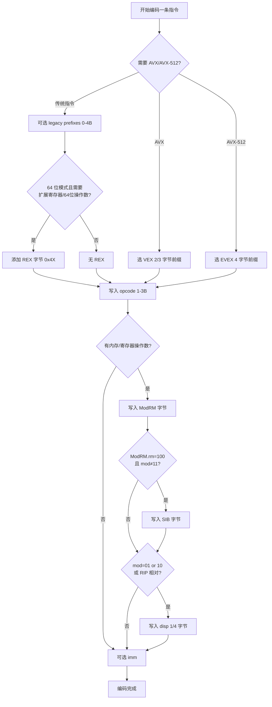

# x86 机器码编码详解（REX / ModRM / SIB / VEX / EVEX）

> [!abstract] TL;DR
> - x86 采用**变长编码**，一条指令最短 1 字节、最长 15 字节，由 `[legacy prefixes][REX][opcode][ModRM][SIB][disp][imm]` 七个字段顺序拼接。
> - **legacy prefixes** 最多 4 个字节，控制段覆盖、操作数宽度（`0x66`）、地址大小（`0x67`）、`LOCK`、`REP/REPNE`。
> - **REX 前缀**（`0100 WRXB`）是 64 位模式引入的单字节扩展，W/R/X/B 四位分别扩展操作数宽度与寄存器编号。
> - **ModRM** 字节编码操作数寻址模式，`mod=11` 寄存器直接，`mod≠11` 内存寻址；`rm=100` 触发 SIB，`rm=101 & mod=00` 触发 RIP 相对寻址。
> - **VEX**（2/3 字节）取代 REX + escape + `66/F2/F3`，引入 AVX 128/256 位向量；**EVEX**（4 字节）进一步支持 AVX-512 掩码、广播、嵌入式舍入。
> - 手工逐字节解码是逆向分析、JIT 编译和二进制安全的基础技能。

## 概述与定位

x86 指令集自 1978 年 8086 诞生以来持续堆叠扩展，形成了 CISC 体系中最复杂的变长编码格式之一。理解机器码编码规则，对以下场景至关重要：

- **逆向工程与漏洞研究**：手工 patch 二进制、绕过控制流完整性（CFI）。
- **JIT 编译器与动态二进制翻译**：运行时生成原生代码（如 V8、LLVM MC）。
- **调试器与反汇编器实现**：正确解析变长指令流，处理前缀组合。
- **硬件安全研究**：微架构侧信道（Spectre/Meltdown）中的指令解码特性。

一条 x86/x86-64 指令的整体字节布局如下（括号内为字节数上限）：

```
┌──────────────────────────────────────────────────────────────────┐
│ [legacy prefixes 0-4B] [REX 0-1B] [opcode 1-3B]                 │
│ [ModRM 0-1B] [SIB 0-1B] [disp 0/1/2/4B] [imm 0/1/2/4/8B]       │
│                                          ← 合计最长 15 字节 →     │
└──────────────────────────────────────────────────────────────────┘
```

处理器解码时按**从低地址到高地址**逐字节解析，每个字段是否存在由前面字段的内容决定：ModRM 的 mod/rm 位决定是否有 SIB，SIB 与 mod 组合决定是否有 disp，opcode 决定是否有 imm 及其宽度。

## 原理与机制

### Legacy Prefixes（传统前缀）

legacy prefixes 历史上分为四组，每组最多一个字节，顺序任意（通常约定先段覆盖后操作数大小）：

```
组1（锁与重复）: LOCK=0xF0  REPNE/REPNZ=0xF2  REP/REPZ=0xF3
组2（段覆盖）:   CS=0x2E  SS=0x36  DS=0x3E  ES=0x26  FS=0x64  GS=0x65
                （64 位模式下 CS/SS/DS/ES 段覆盖无效，只 FS/GS 有意义）
组3（操作数大小覆盖）: 0x66  — 切换默认操作数宽度（16↔32 位）
组4（地址大小覆盖）:   0x67  — 切换默认地址宽度（32↔64 位）
```

在 64 位模式下，`0x66` 是"操作数大小前缀"：在默认 32 位操作数宽度的上下文中，加 `0x66` 变 16 位；但 `0x66` 同时也是 SSE/AVX 指令的强制前缀（mandatory prefix），其含义取决于 opcode。`REPNE（0xF2）`/`REP（0xF3）` 也被复用为强制前缀，这是 x86 历史兼容设计中最易混淆之处。

### REX 前缀（64 位模式专属）

REX 前缀字节的固定模式为 `0100 WRXB`，即高四位固定为 `0100`（0x4?），低四位各有含义：

```
位 7 6 5 4 | 3 | 2 | 1 | 0
      0 1 0 0   W   R   X   B
           ↑   ↑   ↑   ↑   ↑
      固定模式  W   R   X   B
```

各位语义：

| 位  | 名称 | 作用                                                               |
| --- | ---- | ------------------------------------------------------------------ |
| W   | 宽度 | `1`=64 位操作数（REX.W=1，如 `MOV RAX`）；`0`=默认（32 位）        |
| R   | 寄存器扩展 | ModRM.reg 字段的第 4 位，将 `r8–r15` 编入 reg 域              |
| X   | 索引扩展 | SIB.index 字段的第 4 位，将 `r8–r15` 编入 index 域            |
| B   | 基址扩展 | ModRM.rm / SIB.base / opcode 中内嵌寄存器编号的第 4 位         |

REX 前缀本身也有"空 REX"（`REX=0x40`，WRXB 均为 0）的用法：它不扩展任何内容，但其存在将 `AH/BH/CH/DH`（高字节寄存器，编号 4–7）重新解释为 `SPL/BPL/SIL/DIL`（低字节形式），从而访问 64 位寄存器的低 8 位。

### Opcode（操作码）

opcode 字段可以是 1、2 或 3 字节，扩展方式用 **escape 前缀**：

```
1 字节 opcode:  直接编码，如 0x89=MOV r/m←reg, 0x8B=MOV reg←r/m
2 字节 opcode:  0x0F 逃逸 + 第二字节，如 0F 1F=多字节 NOP, 0F AF=IMUL
3 字节 opcode:  0x0F 0x38 + 第三字节，如 0F 38 F0=MOVBE
               0x0F 0x3A + 第三字节，如 0F 3A 0B=ROUNDSD
```

opcode 的低 2–3 位通常编码方向（d 位：reg→rm 或 rm→reg）、操作数大小（w 位：8 位或默认宽度）等标志。Intel 手册中以 `/r`（ModRM 的 reg 含寄存器号）、`/0–/7`（reg 含操作码扩展）标注 ModRM 角色。

### ModRM 字节

ModRM 字节是 x86 寻址模式的核心，结构如下：

```
位: 7  6 | 5  4  3 | 2  1  0
    mod   |   reg   |   rm
   [7:6]  |  [5:3]  | [2:0]
```

**mod 字段**（2 位）决定寻址方式：

| mod | 含义                                   |
| --- | -------------------------------------- |
| 11  | 寄存器直接（rm 是寄存器编号）           |
| 00  | 内存，无 disp（特殊：rm=101 → RIP+disp32） |
| 01  | 内存 + disp8（8 位符号扩展位移）        |
| 10  | 内存 + disp32（32 位位移）              |

**reg 字段**（3 位）：通常是第二个操作数的寄存器编号（配合 REX.R 扩展到 4 位），或操作码扩展（opcode extension，此时手册标记 `/0`–`/7`）。

**rm 字段**（3 位）：第一个操作数（配合 REX.B 扩展）。两个特殊情况：
- `rm=100`（即 `ESP/RSP` 编号）：**触发 SIB 字节**，即当 rm=100 且 mod≠11 时，后续必有 SIB。
- `rm=101 & mod=00`：**触发 RIP 相对寻址**（64 位模式），操作数地址 = RIP（下条指令地址） + disp32。

### SIB 字节（Scale-Index-Base）

SIB 字节只在 `ModRM.rm=100 & mod≠11` 时出现，结构：

```
位: 7  6 | 5  4  3 | 2  1  0
   scale  |  index  |  base
  [7:6]   |  [5:3]  | [2:0]
```

有效地址 = `base + index × (1 << scale) + disp`。

特殊编码：
- `index=100`（`ESP/RSP` 编号）：**无 index 寄存器**（即纯 base + disp）。
- `base=101 & mod=00`：**无 base 寄存器**，仅 `index × scale + disp32`（或纯 disp32 若 index 也为 4）。

REX.X 扩展 index 到 4 位，REX.B 扩展 base 到 4 位，使 SIB 能引用 r8–r15。

### Displacement 与 Immediate

- **disp**：0、1、2 或 4 字节（32 位模式）；64 位模式最大 disp32（符号扩展到 64 位）。
- **imm**：0、1、2、4 或 8 字节。`MOV reg, imm64`（opcode `B8+r` 配合 REX.W）是唯一能编码 64 位立即数的指令形式；大多数指令的立即数最多 32 位符号扩展。

## 结构/算法/伪代码详解

### VEX 前缀（AVX 时代，2/3 字节）

VEX 前缀将 `REX + 0x0F/0x0F38/0x0F3A escape + 66/F2/F3 强制前缀` 压缩到 2 或 3 字节，同时引入了第三操作数寄存器 `vvvv`：

**2 字节 VEX（0xC5）**：

```
字节 0: 0xC5
字节 1: R̄  vvvv  L  pp
        7   6:3   2  1:0
```

**3 字节 VEX（0xC4）**：

```
字节 0: 0xC4
字节 1: R̄  X̄  B̄  m-mmmm       ← m-mmmm: 01=0F, 10=0F38, 11=0F3A
        7   6   5   4:0
字节 2: W   vvvv  L  pp
        7   6:3   2  1:0
```

各字段含义（R̄/X̄/B̄ 为取反，对应 REX.R/X/B）：

| 字段 | 宽度 | 含义 |
| ---- | ---- | ---- |
| R̄    | 1   | ModRM.reg 扩展（REX.R 取反）                        |
| X̄    | 1   | SIB.index 扩展（REX.X 取反，仅 3 字节 VEX）         |
| B̄    | 1   | ModRM.rm/SIB.base 扩展（REX.B 取反，仅 3 字节 VEX） |
| W    | 1   | 操作数大小（类 REX.W，仅 3 字节 VEX，部分指令用）    |
| vvvv | 4   | 源/目标寄存器（取反），`1111`=无附加操作数            |
| L    | 1   | 向量长度：`0`=128 位（XMM），`1`=256 位（YMM）        |
| pp   | 2   | 强制前缀：`00`=无, `01`=0x66, `10`=0xF3, `11`=0xF2  |
| m-mmmm | 5 | escape map：01=`0F`, 10=`0F 38`, 11=`0F 3A`       |

VEX 编码的指令不能与 REX/legacy escape 前缀混用；VEX 前缀本身已隐含所有必要扩展。

### EVEX 前缀（AVX-512，4 字节）

EVEX 前缀固定为 4 字节，以 `0x62` 开头（原 BOUND 指令在 64 位模式下无效）：

```
字节 0: 0x62
字节 1: R̄  X̄  B̄  R̄'  0  0  mm
        7   6   5   4    3  2  1:0
字节 2: W   vvvv  1  pp
        7   6:3   2  1:0
字节 3: z   L'L  b   V'  aaa
        7   6:5  4   3   2:0
```

EVEX 新增字段：

| 字段 | 含义 |
| ---- | ---- |
| R̄'   | ModRM.reg 扩展的第 5 位（共 5 位寄存器编号）                    |
| mm   | escape map（同 VEX m-mmmm 低 2 位）                              |
| z    | 归零掩码（zeroing masking）：`0`=合并，`1`=归零                   |
| L'L  | 向量长度：`00`=128 位, `01`=256 位, `10`=512 位；或嵌入式舍入控制 |
| b    | 广播/嵌入式舍入/suppress-all-exceptions（SAE）                    |
| V'   | vvvv 的第 5 位（共 5 位，用于 VSIB 索引或源寄存器扩展）           |
| aaa  | 操作掩码寄存器编号（k0–k7；k0=无掩码）                            |

EVEX 支持的关键 AVX-512 特性：
1. **操作掩码**：用 `k1`–`k7` 掩码控制按元素操作（`VMOVDQU8 zmm0{k1}{z}, [rsi]`）。
2. **内存广播**：`b=1` 时将内存中一个元素广播填充向量（`{1to8}`、`{1to16}`）。
3. **嵌入式舍入控制**：寄存器操作时用 L'L + b 位编码舍入模式（RN/RD/RU/RZ）。

### 指令编码流程图



## 工具视角与实战

### 手工解码示例：`48 89 5C 24 08`

这是 64 位模式下一条典型的 prologue 存储指令，逐字节分析：

```
字节流: 48  89  5C  24  08

字节0: 0x48 = REX 前缀
       0100 1000
            ^^^^ → W=1, R=0, X=0, B=0
       含义: REX.W=1 → 64 位操作数宽度

字节1: 0x89 = opcode
       MOV r/m64, r64  (方向位 d=0 → reg→rm)
       需要 ModRM: 是

字节2: 0x5C = ModRM
       0101 1100
       ^^  ^^^  ^^^
       mod=01, reg=011, rm=100
       mod=01  → 内存 + disp8
       reg=011 → RBX（REX.R=0，所以寄存器号=3=RBX）
       rm=100  → 触发 SIB 字节！

字节3: 0x24 = SIB
       0010 0100
       ^^  ^^^  ^^^
       scale=00(×1), index=100(无索引), base=100(RSP)
       含义: 有效地址 = RSP × 1（无 index）= RSP

字节4: 0x08 = disp8
       符号扩展为 +8

完整解码:
  MOV [RSP + 8], RBX
  将 RBX 的 64 位值存入 RSP+8 处内存
  （典型函数 prologue：保存被调用者保存寄存器）
```

### 工具辅助

| 工具 | 用途 |
| ---- | ---- |
| `objdump -d -M intel` | 反汇编显示字节与助记符 |
| `ndisasm -b64` | 原始字节流反汇编（NASM 自带） |
| `xed -64 -d <hex>` | Intel XED 解码器，显示完整字段 |
| GDB `x/bx` + `disas` | 运行时查看机器码 |
| Capstone / LLVM MC | 嵌入程序的解码库 |
| `nasm -f bin` | 快速验证手工编写的机器码 |

实战技巧：
- 遇到 `0x66 0x0F` 开头，通常是 SSE 双精度指令。
- 遇到 `0xF2 0x0F` 或 `0xF3 0x0F`，是 SSE 标量浮点或字符串重复。
- `0x40`–`0x4F` 在 64 位模式下全是 REX 前缀（原 INC/DEC reg16 编码被替换）。
- VEX 指令（`0xC4/0xC5`）与 EVEX 指令（`0x62`）在 32 位模式下有不同解释，解码器须先判断模式。

### 实战：编码 `VMOVAPS ymm1, ymm2`（VEX 编码）

```
指令: VMOVAPS ymm1, ymm2
VEX 版 MOVAPS: opcode = 0F 28, pp=00(无强制前缀), L=1(256位), vvvv=1111(无附加src)
ymm1 → ModRM.reg=001(r1), ymm2 → ModRM.rm=010(r2), mod=11

2字节 VEX: R̄=1(REX.R=0), vvvv=1111, L=1, pp=00
  0xC5 = 11000101
  第二字节: 1_1111_1_00 = 0xFC

ModRM: mod=11, reg=001, rm=010 → 11_001_010 = 0xCA
opcode: 0x28

完整字节: C5 FC 28 CA
```

## 安全性与正确使用

### 编码陷阱与易错点

**1. 15 字节上限**
处理器在解码超过 15 字节未找到有效 opcode 时触发 `#UD`（无效操作码异常）。生成机器码时若前缀堆叠（如多个 NOP padding 前缀）超限，将导致运行时崩溃。

**2. legacy prefix 与 VEX/EVEX 不可混用**
VEX/EVEX 编码的指令前面不能有 REX 前缀或 legacy escape（`0x0F`）；若出现，处理器行为未定义或解码为不同指令。常见错误：JIT 代码生成器在 VEX 指令前意外加了 REX 字节。

**3. 32 位模式下 VEX/EVEX 解码歧义**
`0xC4`/`0xC5`/`0x62` 在 32 位模式下对应 `LES`/`LDS`/`BOUND` 指令；处理器通过 ModRM.mod 字段（`≠11` 时解为传统指令，`=11` 时解为 VEX/EVEX）区分——手工解码器必须考虑该歧义。

**4. REX.W 与操作数大小前缀 `0x66` 同时出现**
`REX.W` 优先级高于 `0x66`：`REX.W=1` 时操作数宽度为 64 位，`0x66` 仅在 `REX.W=0` 时生效。

**5. RIP 相对寻址中的 disp 计算**
RIP 指向**下一条指令**的起始地址，而非当前指令。在 PIC（位置无关代码）中常见错误：计算 `disp32 = target - current_PC`，应为 `target - (current_PC + instruction_length)`。

**6. `AH/BH/CH/DH` 与 REX 互斥**
一旦出现任何 REX 字节（包括空 REX `0x40`），`AH/BH/CH/DH` 寄存器不可访问；编码器遇到 `MOV AH, [mem64]` 这类组合应报错，而非静默生成错误编码。

**7. SIB 中 `index=RSP` 含义**
SIB 的 `index=100` 不是 RSP，而是"**无 index 寄存器**"；真正以 RSP 为 index 需通过 REX.X=1 + index=100（变成 r12）完成，但 r12 同样是 `base=101` 时特殊案例。这是 AMD64 手册最难理解的角落之一。

## 小结

x86 机器码编码是 CISC 历史积累的直接体现：

- **变长七字段结构**（0–4B legacy prefixes → REX → 1–3B opcode → ModRM → SIB → disp → imm）决定了解码的复杂性。
- **REX 前缀**用 4 位（WRXB）将寄存器空间从 8 个扩展到 16 个，同时控制 64 位操作数宽度。
- **ModRM + SIB** 两字节组合覆盖了几乎所有内存寻址模式，包括 RIP 相对寻址（PIC 基础）。
- **VEX**（2/3 字节）和 **EVEX**（4 字节）通过替换多个历史前缀，干净地引入了 AVX/AVX-512 三/四操作数向量指令，同时保留与传统指令的模式兼容性。
- 掌握手工解码能力是逆向、JIT 实现和底层安全分析的基础，也是理解现代 CPU 微架构解码前端设计的前提。

## 相关阅读

- [[21.Asm/15 x86(64).md|x86 汇编指令详解（32/64 位）]]
- [[21.Asm/45 x86保护模式与段机制.md|x86 保护模式与段机制（实模式/保护模式/长模式）]]
- [[21.Asm/01 汇编指令集对比.md|五架构指令集横向对比]]
- [[21.Asm/21 寻址模式专题.md|寻址模式专题]]
- [[21.Asm/26 向量扩展对比.md|向量扩展对比（SSE/AVX/SVE/RVV）]]
- [[21.Asm/27 SIMD实战示例.md|SIMD 实战示例]]
- [[21.Asm/33 逆向反汇编速查.md|逆向反汇编速查]]
- [[21.Asm/31 编译器视角-C到汇编.md|编译器视角：C 到汇编]]

> 🏠 [[21.Asm/00 总览|汇编指令集知识库 · 总览]] ｜ [[21.Asm/01 汇编指令集对比|五架构对比]]
