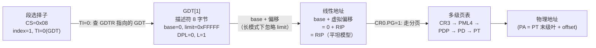

# x86 保护模式与段机制（实模式 / 保护模式 / 长模式）

> [!abstract] TL;DR
> - x86 处理器有三种主要执行模式：**实模式**（8086 兼容，16 位，无保护）、**保护模式**（32 位，IA-32，分段+分页保护）、**长模式**（64 位，IA-32e，段机制退化为平坦模型）。
> - 进入保护模式须设 `CR0.PE=1`；进入长模式须额外设 `CR4.PAE=1`、`EFER.LME=1`、再设 `CR0.PG=1` 开分页。
> - **段描述符**是 8 字节结构，编码段基址、段限、类型、特权级（DPL）等，存放于 GDT 或 LDT。
> - **特权级 ring 0–3**（CPL/DPL/RPL 三元检查）是 x86 内存与 I/O 保护的核心机制；CPL 是当前特权级，由 CS.RPL 体现。
> - 长模式下段基址和限（CS/DS/ES/SS）被硬件忽略（平坦化），但 **FS/GS base** 仍可通过 MSR（`IA32_FS_BASE`）或 `WRFSBASE`/`WRGSBASE` 指令独立设置，是线程局部存储（TLS）的硬件支撑。
> - `syscall`/`sysret` 是 64 位模式特权切换的快速路径，比 `int 0x80` 节省 TSS 切换开销。

## 概述与定位

x86 的模式体系是 40 余年向后兼容的产物。每次扩展（8086→80286→80386→Pentium Pro→AMD64）都在硬件层叠加新能力而保留旧模式，使 x86 CPU 成为能同时理解 1978 年代码和 2024 年代码的"时间胶囊"。

理解三种模式与段机制，是以下工作的必备背景：

- **操作系统内核开发**：Bootloader 从实模式切换到保护模式/长模式是 `start_kernel` 之前不可绕过的流程。
- **虚拟机监控器（VMM/Hypervisor）**：VMX/SVM 等虚拟化扩展在客户模式与宿主模式之间保存/恢复完整段状态。
- **安全漏洞分析**：段权限绕过、特权逃逸（ring 0 提权）是内核漏洞的核心攻击面。
- **调试器与模拟器**：正确模拟段寄存器加载、特权检查，是仿真 x86 的最大难点。

## 原理与机制

### 三种模式对比

| 模式 | 触发条件 | 地址宽度 | 操作数宽度 | 段机制 | 分页 | 特权保护 |
| ---- | -------- | -------- | ---------- | ------ | ---- | -------- |
| 实模式（Real Mode） | 上电复位默认 | 20 位 | 16 位 | 段×16+偏移 | 无 | 无 |
| 保护模式（Protected Mode） | `CR0.PE=1` | 32 位 | 32 位（可切换） | 描述符表（GDT/LDT） | 可选 | ring 0–3 |
| 长模式（Long Mode / IA-32e） | `EFER.LME=1`+分页 | 64 位 | 32 位默认（REX.W→64 位） | 平坦（段退化） | 必须 | ring 0–3 |

**兼容模式（Compatibility Mode）** 是长模式下的子模式：在 64 位 OS 中运行 32 位程序时，CS 加载的段描述符的 L=0，CPU 退回保护模式行为，但分页仍使用 64 位页表。

### 三种模式切换流程


切换关键步骤说明：

**实模式 → 保护模式**：
1. 关中断（`CLI`）。
2. 加载 GDT（`LGDT [gdt_ptr]`），设置最小 GDT（至少 null 描述符 + 代码描述符 + 数据描述符）。
3. `MOV CR0, EAX`（OR `CR0` 的 bit 0）置 `PE=1`。
4. **立刻** `JMP far 0x08:pm_entry`，刷新 CS 指令流水线（必须，否则解码器仍以实模式工作）。

**保护模式 → 长模式**：
1. 设置 `CR4.PAE=1`（启用物理地址扩展，4 级页表必须）。
2. 将 PML4 物理地址写入 `CR3`。
3. `WRMSR IA32_EFER (0xC0000080)` 置 `LME=1`（Long Mode Enable）。
4. `MOV CR0` 置 `PG=1`（开分页，同时 `LME→LMA` 变为 active）。
5. `JMP far 0x18:lm_entry`，将 CS 切换到 `L=1` 的 64 位代码段描述符。

### 段描述符结构

GDT/LDT 中的每个条目为 8 字节（64 位），字段分散编码（历史兼容原因，80286 只有 6 字节，80386 扩展时拆分存放）：

```
字节 7         字节 6         字节 5         字节 4–2         字节 1–0
┌─────────────┬─────────────┬─────────────┬────────────────┬─────────────┐
│  base[31:24]│G D-B L AVL  │ P DPL S type│  base[23:0]    │  limit[15:0]│
│  (8位)      │ limit[19:16]│  (8位)      │  (24位)        │  (16位)     │
└─────────────┴─────────────┴─────────────┴────────────────┴─────────────┘
```

各字段详解：

| 字段 | 位宽 | 含义 |
| ---- | ---- | ---- |
| base  | 32 位（跨字节3 块） | 段基址（线性地址） |
| limit | 20 位（跨 2 块）    | 段大小-1；G=1 时单位为 4KB 页（段最大 4GB） |
| G     | 1   | Granularity：`0`=字节粒度，`1`=4KB 粒度 |
| D-B   | 1   | Default Operation Size：代码段 `1`=32 位默认操作数；栈段 `1`=ESP |
| L     | 1   | Long-mode code：`1`=64 位代码段（长模式，此时 D-B 必须为 0） |
| AVL   | 1   | Available to software（OS 可自由使用） |
| P     | 1   | Present：`0`=段不在内存中，访问触发 #NP |
| DPL   | 2   | Descriptor Privilege Level（0=最高权限，3=用户态） |
| S     | 1   | `0`=系统描述符（TSS/门），`1`=代码/数据段描述符 |
| type  | 4   | 段类型（代码段：executable/conforming/readable；数据段：expand-down/writable/accessed） |

**系统描述符（S=0）** 的 type 字段编码 TSS、LDT、各类门（call gate/interrupt gate/trap gate 等），在保护模式下占 8 字节，在长模式下扩展为 **16 字节**（高 8 字节存 base 的高 32 位，兼容 64 位地址）。

### GDT / LDT / IDT 与加载指令

| 表 | 描述 | 加载指令 | 寄存器 |
| -- | ---- | -------- | ------ |
| GDT（全局描述符表） | 全系统共用描述符 | `LGDT m48`（6 字节伪描述符：limit16 + base32/64） | GDTR |
| LDT（局部描述符表） | 每进程私有描述符（现代 OS 几乎不用） | `LLDT r/m16`（加载 LDT 的段选择子） | LDTR |
| IDT（中断描述符表） | 中断/异常向量 | `LIDT m48` | IDTR |
| TSS（任务状态段） | 特权级切换时保存 ESP0/RSP0（内核栈指针） | `LTR r/m16` | TR |

**GDTR/IDTR** 存储 48 位伪描述符（16 位 limit + 32/64 位 base），`LGDT`/`LIDT` 直接从内存加载。`SGDT`/`SIDT` 可读取当前值（ring 3 也可读，这是历史安全缺陷，现代 OS/VMM 需注意）。

### 段选择子

段选择子（Segment Selector）是加载到段寄存器（CS/DS/ES/SS/FS/GS）的 16 位值：

```
位 15–3      位 2    位 1–0
┌──────────┬──────┬──────┐
│  index   │  TI  │  RPL │
│ (13位)   │      │      │
└──────────┴──────┴──────┘
  描述符编号   0=GDT   请求特权级
              1=LDT   0–3
```

- **index**：GDT/LDT 中的描述符下标（从 0 开始；0 号 = null 描述符，禁止用于普通段访问）。
- **TI**（Table Indicator）：`0`=GDT，`1`=LDT。
- **RPL**（Requested Privilege Level）：请求者声明的特权级，与 CPL/DPL 共同参与访问控制。

## 结构/算法/伪代码详解

### 特权级 Ring 0–3 与 CPL/DPL/RPL 检查

x86 定义了四个特权级（ring）：

```
ring 0（内核态） ← 最高权限，可执行特权指令（LGDT/LIDT/IN/OUT/HLT 等）
ring 1, ring 2   ← 中间层（现代通用 OS 基本不使用）
ring 3（用户态） ← 最低权限
```

三个特权相关字段：
- **CPL（Current Privilege Level）**：当前运行代码的特权级，始终等于 `CS.RPL`（CS 选择子的低 2 位）。
- **DPL（Descriptor Privilege Level）**：段描述符中规定的该段所需特权级。
- **RPL（Requested Privilege Level）**：段选择子中的低 2 位，允许调用方显式降低权限（用于防止段混淆攻击）。

**数据段访问规则**（加载到 DS/ES/FS/GS/SS）：

```
允许访问条件: max(CPL, RPL) <= DPL
即: 数值上 max(CPL, RPL) 不大于 DPL（特权级数值小=特权高）
```

**代码段访问规则**（non-conforming，普通代码段）：

```
允许访问条件: CPL == DPL  且  RPL <= DPL
（conforming 段允许 CPL >= DPL，即低权限代码跳入高权限段，但 CPL 不提升）
```

### 门描述符与特权切换

从 ring 3 切换到 ring 0 不能直接 JMP 到内核代码段（DPL=0）——必须通过**门描述符**：

| 门类型 | 触发方式 | CPL 变化 | 用途 |
| ------ | -------- | -------- | ---- |
| Call Gate     | `CALL far selector` | CPL 可从 ring 3 升至 ring 0 | 老式系统调用（现已废弃） |
| Interrupt Gate | `INT n` / 硬件中断 | CPL → gate.DPL，再→ IDT 目标 DPL | 中断处理（IF=0，禁止其他中断） |
| Trap Gate      | `INT n`（软件） | 同 interrupt gate | 异常处理（IF 不变） |
| Task Gate      | `INT n` / TSS selector | 完整任务切换 | 几乎不用（开销极大） |

**`INT n` + `IRET` 路径**（传统 ring 3 → ring 0）：
1. 处理器检查 IDT[n].DPL ≥ CPL（用户态可触发该中断向量）。
2. 若 CPL > 目标代码段 DPL，发生特权切换：从 TSS 读取 `SS0:ESP0`（`SS0:RSP0`），切换到内核栈。
3. 硬件自动将 `SS:ESP`（用户栈）、`EFLAGS`、`CS:EIP` 压入内核栈。
4. `IRET` 恢复全部，回到 ring 3。

**`SYSENTER`/`SYSEXIT`**（32 位快速系统调用，Intel P6+）：
- `IA32_SYSENTER_CS`、`IA32_SYSENTER_ESP`、`IA32_SYSENTER_EIP` 三个 MSR 预设内核入口。
- `SYSENTER`：CPL 设 0，直接跳到 MSR 指定 EIP，不保存任何状态（靠软件约定保存）。
- `SYSEXIT`：从 EDX:ECX 恢复 EIP:ESP，CPL 设 3（只能在 ring 0 执行）。

**`SYSCALL`/`SYSRET`**（64 位快速系统调用，AMD64 标准）：

```
SYSCALL 执行:
  RCX  ← RIP（保存返回地址）
  R11  ← RFLAGS（保存标志）
  RIP  ← IA32_LSTAR（内核系统调用入口 MSR）
  CS   ← IA32_STAR[47:32]（内核代码段选择子，从 MSR 固定加载）
  SS   ← CS + 8（约定）
  CPL  ← 0
  RFLAGS &= ~IA32_FMASK（清除内核不希望保留的标志，如 IF）

SYSRET 执行:
  RIP  ← RCX（恢复用户 RIP）
  RFLAGS ← R11（恢复用户 RFLAGS）
  CS   ← IA32_STAR[63:48]（用户代码段选择子 + 16）
  CPL  ← 3
```

`SYSCALL`/`SYSRET` 不切换栈（靠 `SWAPGS` + MSR 中保存的用户栈指针完成），也不保存 RSP，是 Linux/Windows 64 位系统调用的标准实现。

### 段选择子 → 线性地址 → 物理地址



在 64 位长模式中，CS/DS/ES/SS 的 base 和 limit 被**硬件忽略**（视为 base=0, limit=全量），线性地址 = 虚拟偏移本身。但 **FS/GS base** 例外：

| 设置方式 | 适用场景 |
| -------- | -------- |
| `WRMSR IA32_FS_BASE (0xC0000100)` | 内核设置用户态 TLS（`arch_prctl(ARCH_SET_FS)`） |
| `WRMSR IA32_GS_BASE (0xC0000101)` | 内核 per-CPU 数据（GS base 指向 `per_cpu` 区域） |
| `SWAPGS` 指令 | 在 `SYSCALL` 入口交换 GS base 与 `IA32_KERNEL_GS_BASE` |
| `WRFSBASE`/`WRGSBASE`（CR4.FSGSBASE=1） | 用户态直接写 FS/GS base（无 `SYSCALL` 开销，用于用户态线程库） |

## 工具视角与实战

### 查看段寄存器状态

**GDB（调试内核/qemu）**：

```bash
# 查看段寄存器
info registers cs ds es fs gs ss

# 查看 GDT
maintenance info sections
# 或在 QEMU monitor 中：
info registers     # 显示完整段寄存器含隐藏描述符缓存
```

**QEMU monitor**（调试 Bootloader 最常用）：

```
(qemu) info registers
# 输出 CS=0010 00000000 ffffffff 00af9b00 表示:
# 选择子=0010, base=0, limit=ffffffff, type/P/DPL/G 等
# 字段解释见 Intel SDM Vol.3 第3章
```

**Linux 内核中读取 GDT**：

```c
// arch/x86/include/asm/desc.h
struct desc_struct {
    u16 limit0;
    u16 base0;
    u16 base1: 8, type: 4, s: 1, dpl: 2, p: 1;
    u16 limit1: 4, avl: 1, l: 1, d: 1, g: 1, base2: 8;
} __attribute__((packed));

// 读取当前 GDT
struct desc_ptr gdt_ptr;
sgdt(&gdt_ptr);   // inline asm: SGDT [gdt_ptr]
```

### 最小 32 位 GDT 布局

Bootloader 进入保护模式所需的最小 GDT（3 个描述符）：

```asm
gdt_start:
    ; 描述符 0: null（必须为全零）
    dq 0x0000000000000000

    ; 描述符 1: 代码段 (index=1, 选择子 0x08)
    ; base=0, limit=0xFFFFF, G=1(4KB粒度), D-B=1(32位), P=1, DPL=0, type=1010(exec/read)
    dw 0xFFFF       ; limit[15:0]
    dw 0x0000       ; base[15:0]
    db 0x00         ; base[23:16]
    db 0x9A         ; P=1, DPL=00, S=1, type=1010
    db 0xCF         ; G=1, D=1, L=0, AVL=0, limit[19:16]=1111
    db 0x00         ; base[31:24]

    ; 描述符 2: 数据段 (index=2, 选择子 0x10)
    ; base=0, limit=0xFFFFF, G=1, D-B=1, P=1, DPL=0, type=0010(read/write)
    dw 0xFFFF
    dw 0x0000
    db 0x00
    db 0x92         ; P=1, DPL=00, S=1, type=0010
    db 0xCF
    db 0x00

gdt_end:
gdt_ptr:
    dw gdt_end - gdt_start - 1   ; limit
    dd gdt_start                  ; base（32位）
```

### 从保护模式切换代码片段

```asm
; 关中断、加载 GDT
cli
lgdt [gdt_ptr]

; 置 CR0.PE
mov eax, cr0
or  eax, 1
mov cr0, eax

; 立刻 far jump 刷新 CS 流水线，进入 32 位保护模式
jmp 0x08:pm_entry

[BITS 32]
pm_entry:
    mov ax, 0x10    ; 数据段选择子
    mov ds, ax
    mov es, ax
    mov ss, ax
    mov esp, 0x90000
    ; 此后可运行 32 位保护模式代码
```

## 安全性与正确使用

### 陷阱与常见错误

**1. 切换到保护模式后未立刻 far jump**
`CR0.PE=1` 后，CS 仍缓存的是实模式的段描述符（隐藏寄存器）；下一条 `near jmp` 或顺序执行的代码仍按实模式解码。必须紧接 `JMP far` 来刷新 CS 描述符缓存。

**2. GDT 的第 0 描述符必须全零**
任何通过 null 选择子（0x00）访问内存的操作会触发 `#GP(0)`；OS 可借此捕获野指针访问（null pointer dereference）——这是 Linux 将虚拟地址 0 不映射的根本原因之一。

**3. 长模式下段 limit 检查被忽略，但 SS 依然检查**
在 64 位长模式中，CS/DS/ES/SS 的 limit 检查被硬件绕过（非致命，limit 视为无限大）。然而 SS 在某些情况下仍进行检查（特别是特权切换时 TSS 中的 SS0 描述符）；错误设置 SS 的 DPL 会导致 `SYSCALL`/`INT` 切换失败。

**4. `SWAPGS` 的滥用（Spectre-v1 变体）**
Linux 内核在进入 `SYSCALL`/中断处理时用 `SWAPGS` 切换 GS base，在退出时还原。若遗漏 `SWAPGS`（如某些快速路径错误分支），内核将以用户态 GS base 访问 per-CPU 数据，导致特权信息泄露或崩溃（CVE-2019-1125）。

**5. SYSRET 的 non-canonical RIP 检查**
`SYSRET` 不检查 RCX（恢复的 RIP）是否 canonical（高 16 位不全为 0 或 1）；若用户态通过 ptrace 等修改了 RCX 使其非 canonical，`SYSRET` 执行后 `#GP` 发生在 ring 0（因为此时 CS 已经切换回 ring 3 但 #GP 处理程序仍在 ring 0 栈上），可能导致内核崩溃或特权提升（CVE-2012-0217 等）。修复方式：内核在 `SYSRET` 前应用 `rcx &= 0x00007fffffffffff` 或换用 `IRET` 路径。

**6. IDT 中断门与陷阱门的区别**
- **中断门**（Interrupt Gate）：`IF=0`（进入处理器时自动关中断），适合硬件中断——防止重入。
- **陷阱门**（Trap Gate）：`IF` 不变，适合调试异常（`#DB`/`#BP`）和软件 `INT n`——允许嵌套中断。
  错误地将硬件 IRQ 配置为陷阱门可能导致中断处理函数被嵌套重入，破坏内核栈。

**7. LDTR 与 LDT 的现代废弃**
Linux/Windows 均不使用 LDT 进行内存保护（GDT 平坦模型已足够）。LDT 相关指令（`SLDT`/`LLDT`）可从 ring 0 读取，历史上曾被用于 hypervisor 检测和侧信道。Wine 等兼容层通过 `modify_ldt` 系统调用为 16 位 Windows 程序维护 LDT。

## 小结

x86 的三模式体系是 Intel 架构向后兼容策略的活化石：

- **实模式**是 8086 遗产，无保护，20 位地址，OS 仅用它作启动跳板。
- **保护模式**引入了分段保护（描述符表、特权级 ring 0–3）和可选分页，是 32 位 OS 的基础。
- **长模式**将段机制"退化"为平坦模型（base=0 limit 忽略），64 位地址空间完全交由分页管理；唯独 FS/GS base 保留独立设置能力，支撑 TLS 和 per-CPU 数据。
- 特权切换机制从 `INT+IRET`（保护模式时代）演进到 `SYSENTER/SYSEXIT`（32 位快速调用）再到 `SYSCALL/SYSRET`（64 位标准），性能与安全性逐步改善。
- 理解 CPL/DPL/RPL 三元检查和门描述符工作原理，是分析 ring 提权漏洞的基础。

## 相关阅读

- [[21.Asm/44 x86机器码编码.md|x86 机器码编码详解（REX/ModRM/SIB/VEX/EVEX）]]
- [[21.Asm/15 x86(64).md|x86 汇编指令详解（32/64 位）]]
- [[21.Asm/01 汇编指令集对比.md|五架构指令集横向对比]]
- [[21.Asm/29 异常中断处理对比.md|异常与中断处理对比（五架构）]]
- [[21.Asm/34 异常向量实战.md|异常向量实战（裸机中断处理）]]
- [[21.Asm/38 MMU与页表设置实战.md|MMU 与页表设置实战]]
- [[21.Asm/40 虚拟化扩展对比.md|虚拟化扩展对比（VMX/SVM）]]
- [[21.Asm/42 安全特性对比.md|安全特性对比]]
- [[21.Asm/43 启动流程与Bootloader.md|启动流程与 Bootloader]]

> 🏠 [[21.Asm/00 总览|汇编指令集知识库 · 总览]] ｜ [[21.Asm/01 汇编指令集对比|五架构对比]]
