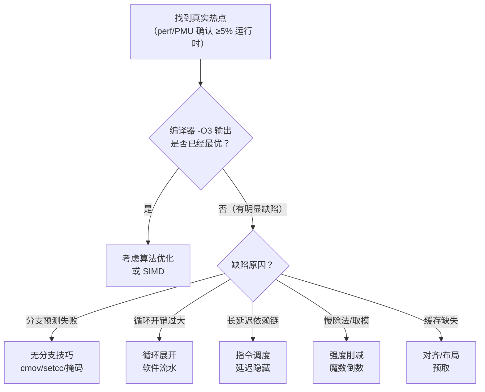
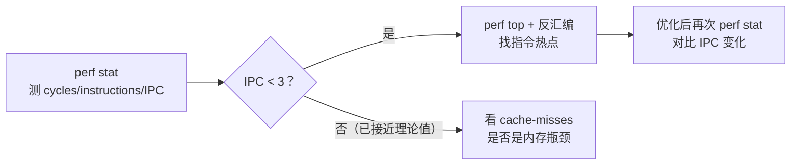

# 汇编优化技巧（手写更快的汇编）

> [!abstract] TL;DR
> 手写汇编优化的本质是弥补编译器在**局部最优**上的不足：无分支计算用 `cmov`/`setcc`/位掩码消灭分支预测惩罚；循环展开减少循环控制开销并暴露 ILP；指令调度通过填充长延迟指令的空档隐藏延迟；强度削减把除法变成乘"魔数倒数"、把取模变成位与；对齐和缓存行布局影响 L1 命中率。多数优化本质上是"让 CPU 的执行单元尽量不空转"——用好乱序执行（OoO）、流水线和分支预测器是底层思路。何时手写何时交给编译器同等重要：编译器能做到的优化不要手写，手写主要针对编译器无法证明安全、或需要特定指令集特性的场合。

## 概述与定位

汇编优化处于性能金字塔的最底层，高于它的是算法选择、数据结构设计、编译器优化选项（`-O2`/`-O3`/LTO/PGO）、以及 SIMD intrinsics。手写汇编优化只在以下情况才真正值得：



本页聚焦六类核心技巧，每类给出"慢版本 vs 快版本"对比。代码示例以 x86-64 为主，关键技巧也注明 ARM/RISC-V 的对应手段。

## 原理与机制

### 现代 CPU 的执行模型（优化前必须理解）

理解以下执行单元特性，是一切汇编优化的先验知识：

1. **超标量乱序执行（OoO）**：CPU 可以同时执行多条无数据依赖的指令（通常 3-6 条/周期）。优化的目标是增加**可同时派发的独立指令数**。

2. **分支预测器**：预测分支方向并投机执行，预测失败需要清空流水线（x86 Skylake 约 15–20 周期惩罚，ARM Cortex-A76 约 10–12 周期）。**消灭分支**比优化分支预测准确率更根本。

3. **指令延迟（Latency）与吞吐量（Throughput）**：延迟是指令产生结果所需周期数（如 x86 整数 div：20–40 周期；imul：3 周期）；吞吐量是每多少周期可以开始一条同类指令。延迟限制**依赖链**，吞吐量限制**并发度**。

4. **寄存器文件与重命名**：物理寄存器比架构寄存器多（x86 有 160+ 物理整数寄存器），乱序核通过重命名消除写后写（WAW）和先写后读（WAR）假依赖，但真依赖（RAW，写后读）无法消除。

5. **缓存层次**：L1 4 周期、L2 12 周期、L3 40–50 周期、DRAM 200+ 周期。优化内存访问模式（局部性）的收益往往远超指令优化。

## 结构/算法/伪代码详解

### 技巧一：无分支计算

#### 分支预测失败的代价

对随机输入，分支预测准确率约 50%，每次失败清空流水线消耗 ~15 周期。当**数据依赖的条件分支**（预测器难学习的分支）出现在热路径中时，消灭分支比优化分支预测更有效。

#### `cmov`：条件移动（x86）

```asm
; 慢：条件分支选最大值（随机数据时预测失败率 ~50%）
; int max(int a, int b)
slow_max:
    cmp  edi, esi
    jge  .take_a
    mov  eax, esi
    ret
.take_a:
    mov  eax, edi
    ret

; 快：cmov 无分支（延迟 1 周期，无流水线冲刷）
fast_max:
    mov  eax, edi      ; eax = a
    cmp  eax, esi      ; a vs b
    cmovl eax, esi     ; if a < b: eax = b（无跳转）
    ret
```

`cmovcc`（条件移动）在 Pentium Pro+ 上可用，AArch64 对应 `csel`/`csinc`/`csinv`，RISC-V 需要软件模拟（`slt` + `neg` + `and` 组合，或用 Zicond 扩展的 `czero.eqz`/`czero.nez`）。

#### `setcc`：条件设置字节

```asm
; 计算 x > 0 的布尔值，无分支
; 慢：jg 版本（随机数据易预测失败）
; 快：setg 版本
fast_positive:
    xor  eax, eax      ; eax = 0（同时清零高 32 位）
    test edi, edi      ; 设置标志位
    setg al            ; al = (edi > 0) ? 1 : 0
    ret
```

#### 位掩码选择

对 RISC 架构（没有 `cmov`），可以用算术移位生成全 0/全 1 的掩码：

```asm
; RISC-V：无分支选择 (cond ? a : b)
; 利用算术右移把符号位扩展到全字长
; t1 = (cond != 0) ? 0xFFFFFFFF : 0x00000000
snez   t0, a0          ; t0 = (a0 != 0) ? 1 : 0
neg    t0, t0          ; t0 = 0xFFFFFFFF（若 t0=1）或 0（若 t0=0）
and    t1, a1, t0      ; t1 = cond ? a : 0
not    t0, t0          ; 取反
and    t2, a2, t0      ; t2 = cond ? 0 : b
or     a0, t1, t2      ; a0 = cond ? a : b
ret
```

### 技巧二：循环展开与软件流水

#### 展开的目的

循环控制指令（计数器递减、比较、跳转）本身消耗执行资源。当循环体很短（2–3 条指令）时，循环开销占比可达 30–50%。展开 N 倍：

- 减少 N 倍循环控制指令。
- 每 N 个迭代的指令如果独立，可同时派发（提高 ILP）。
- 为软件流水/预取创造空间。

```asm
; 未展开的内积（每迭代 4 条指令：vmulss/vaddss/add/cmp）
loop_scalar:
    vmulss xmm2, [rsi + rax*4], xmm1   ; 乘
    vaddss xmm0, xmm0, xmm2            ; 加到累加器
    add    rax, 1
    cmp    rax, rdx
    jl     loop_scalar

; 展开 4 次（同时展开累加器，消除串行加法依赖链）
loop_unroll4:
    vmulss xmm2, [rsi + rax*4],      xmm1
    vmulss xmm3, [rsi + rax*4 + 4],  xmm1
    vmulss xmm4, [rsi + rax*4 + 8],  xmm1
    vmulss xmm5, [rsi + rax*4 + 12], xmm1
    vaddss xmm0, xmm0, xmm2   ; 4 个独立加法，可并发执行
    vaddss xmm6, xmm6, xmm3
    vaddss xmm7, xmm7, xmm4
    vaddss xmm8, xmm8, xmm5
    add    rax, 4
    cmp    rax, rdx
    jl     loop_unroll4
    vaddss xmm0, xmm0, xmm6   ; 归约
    vaddss xmm0, xmm0, xmm7
    vaddss xmm0, xmm0, xmm8
```

关键点：**使用多个累加器**（`xmm0`/`xmm6`/`xmm7`/`xmm8`）打破 `vaddss xmm0, xmm0, ...` 的串行依赖链（每条 vaddss 依赖前一条的结果，延迟约 4 周期）。单累加器即使展开也无法并发。

#### 软件流水（预取与计算重叠）

当内存延迟是瓶颈时，提前发出预取让数据在计算时已在 L1：

```asm
loop_prefetch:
    prefetcht0 [rsi + rax*4 + 256]    ; 提前预取 64 字节（~64 缓存行之后）
    vmovups   ymm1, [rsi + rax*4]
    ; ... 计算 ymm1 ...
    add       rax, 8
    cmp       rax, rdx
    jl        loop_prefetch
```

预取距离（lookahead）需要根据内存延迟（约 ~200 周期）和循环体每次迭代周期数估算：`lookahead ≈ 内存延迟周期 / 每迭代周期数 × 步长字节数`。

### 技巧三：指令调度与延迟隐藏

#### 数据依赖链

延迟受制于最长的**数据依赖链**（关键路径）。调度的核心是把不在同一依赖链上的指令插入长延迟指令之后，填充等待空档：

```asm
; 差：long-latency 指令直接接用它结果的指令
; imul 延迟 3 周期，下一条 add 必须等待
imul  rax, rbx, 17     ; 周期 0 开始，周期 3 结果可用
add   rcx, rax         ; 周期 3 才能开始（等了 3 周期空档）
xor   rdx, rdx         ; 周期 4

; 好：把无关指令插入空档
imul  rax, rbx, 17     ; 周期 0
xor   rdx, rdx         ; 周期 1（不依赖 rax，可立即执行）
mov   r8,  r9          ; 周期 2（同上）
add   rcx, rax         ; 周期 3（rax 刚好可用，0 等待）
```

在 div/sqrt/load 这类长延迟指令（20–40 周期）后插入不依赖其结果的指令，是手工调度收益最大的场合。

#### 减少依赖链长度

将串行依赖链改为并行树形结构（适合归约运算）：

```asm
; 串行求和：链长 = N，每步 1 周期延迟，总延迟 = N 周期
; a + b + c + d + e + f + g + h
add rax, rbx    ; step1
add rax, rcx    ; step2（依赖 step1）
add rax, rdx    ; step3（依赖 step2）
; ...

; 树形求和：链长 = log2(N)，并发 N/2 加法
add rax, rbx    ; r0 = a+b  ─┐
add rcx, rdx    ; r1 = c+d  ─┤─ 可并发执行
add r8,  r9     ; r2 = e+f  ─┤
add r10, r11    ; r3 = g+h  ─┘
add rax, rcx    ; r0 = (a+b)+(c+d)  ─┐ 可并发
add r8,  r10    ; r2 = (e+f)+(g+h)  ─┘
add rax, r8     ; 最终结果
```

### 技巧四：强度削减

#### 除以常数 → 乘"魔数倒数"加移位

整数除法（`div`/`idiv`）在 x86-64 延迟约 20–40 周期，而乘法（`imul`）延迟约 3 周期。编译器在除数为编译期常量时自动做此变换，但有时除数来自常量传播链，或需要手写时，理解原理很重要：

对无符号整数 `x / D`（D 为正常量），选取魔数 `M` 和移位量 `sh` 使得：

```
x / D ≈ (x * M) >> (32 + sh)   [32位]  或  (x * M) >> (64 + sh)   [64位]
```

其中 `M = ceil(2^(32+sh) / D)`（对应 32 位），需用 128 位中间结果。

x86-64 示例（除以 7，编译器生成的等效代码）：

```asm
; x / 7，x 在 edi（uint32）
; 魔数 M = 0x24924925，sh = 2（由编译器/工具计算）
; 慢：
div  esi       ; 约 20–40 周期

; 快（等价 x / 7）：
mov  eax, edi
mov  ecx, 0x24924925      ; 魔数
mul  ecx                  ; edx:eax = eax * ecx（64 位结果）
mov  eax, edx             ; 取高 32 位
sub  edi, eax             ; t = x - high
shr  edi, 1               ; t >>= 1
add  eax, edi             ; 加回
shr  eax, 2               ; 最终右移 sh=2
; eax = x / 7
```

编译器对有符号和无符号除法的魔数生成算法略有差异，有符号需要处理负数。工具 [libdivide](https://libdivide.com) 可自动计算任意除数的魔数。

**取模运算**：先除后乘再减（`a % d = a - (a/d)*d`）；若 D 是 2 的幂，`a & (D-1)` 直接取低位（仅对无符号或非负有符号数正确）：

```asm
; x % 8（无符号，8 是 2 的幂）
and  rax, 7     ; 1 周期，vs div 的 20-40 周期
```

#### 乘以常数 → 移位+加

```asm
; x * 9 = x * 8 + x = (x << 3) + x
lea  rax, [rdi + rdi*8]    ; x86 lea：rax = rdi + rdi*8，1周期
; 等价但更慢：
imul rax, rdi, 9           ; imul 3 周期，但也可（现代 CPU imul 也很快）
```

`lea` 在 x86 上可做 1 或 2 个加法（最多 3 个操作数）+ 一次移位（1/2/4/8），延迟 1 周期，是"免费乘法"的利器：

| 目标 | `lea` 实现 | 周期 |
|------|------------|------|
| `x * 3` | `lea rax, [rdi + rdi*2]` | 1 |
| `x * 5` | `lea rax, [rdi + rdi*4]` | 1 |
| `x * 9` | `lea rax, [rdi + rdi*8]` | 1 |
| `x * 10` | `lea rax, [rdi + rdi*4]; lea rax, [rax + rax]` | 2 |

### 技巧五：对齐与缓存行布局

#### 指令对齐

x86-64 的取指单元每周期最多取 **16 字节**（Skylake 前）或 **32 字节**（Zen 4），若热循环跨越取指边界，每次迭代需要两次取指（吞吐量减半）。将热循环对齐到 **16/32 字节边界**：

```asm
.align 32         ; GAS 语法（实际填充 nop）
hot_loop:
    ; 循环体确保在 32 字节内
    ...
    jl hot_loop
```

代码对齐的代价是增加 `.text` 段大小（填充 nop），在代码密度优先的嵌入式场景需权衡。

#### 数据对齐与 false sharing

- **SIMD 操作**：AVX 256 位 `vmovdqu` 对齐到 32 字节时比未对齐更快（虽然 Haswell 之后未对齐惩罚降低，但对齐仍优）。`vmovdqa`（aligned）与 `vmovdqu`（unaligned）区分。
- **缓存行大小**：x86/ARM/RISC-V 常见 **64 字节**。将同时访问的热数据放在同一缓存行，将并发写的独立数据放在**不同缓存行**（避免 false sharing）。
- **结构体填充**：频繁访问的字段放结构体头部，冷字段放尾部，避免读取热字段时把大量冷数据也载入 L1。

```c
// 差：同一缓存行，多线程写 counter[0] 和 counter[1] 互相 invalidate
struct { int counter[2]; } bad;

// 好：各占一行
struct { int counter; char pad[60]; } good[2];
// 或用 alignas(64)：
alignas(64) int counter[2];
```

#### 代码局部性与热/冷路径分离

把错误处理、慢路径（`unlikely` 分支）移出热循环附近，减少指令缓存压力。GCC/Clang 支持 `__builtin_expect`，也可用 `[[likely]]`/`[[unlikely]]`（C++20）：

```c
if (__builtin_expect(ptr == NULL, 0)) {
    // 冷路径：移出热函数或放到函数尾部
    handle_error();
    return;
}
// 热路径：紧跟在判断后，L1i 命中率高
use(ptr);
```

### 技巧六：寄存器压力与 spill

**寄存器 spill**（溢出）是编译器在寄存器不够时把变量存到栈上，再用时从栈读回。每次 spill 产生 store + load，L1 命中约 4–5 周期。

手写优化时：

- x86-64 有 16 个通用整数寄存器（`rax`–`r15`），AArch64 有 31 个（`x0`–`x30`，但 `x29` 是帧指针），RISC-V 有 31 个（`x1`–`x31`）。
- **caller-saved 先于 callee-saved 使用**：调用函数前 caller-saved 寄存器被清空，不需要保存/恢复；而 callee-saved 寄存器使用前需 push/pop，增加代码体积。热内层函数优先用 caller-saved。
- **减少调用**：内层循环中的函数调用会清空所有 caller-saved 寄存器，逼迫编译器把活跃变量 spill 到栈。手写时若能内联，即消除这一压力。

```asm
; AArch64 callee-saved 寄存器 x19–x28（使用前必须保存）
; 热内循环若能用 x0–x15（caller-saved），可省去 stp/ldp 开销
```

## 工具视角与实战

### 测量优化效果的流程



用 `perf stat -e cycles,instructions,cache-misses,branch-misses ./prog` 一次性获得 IPC、缓存缺失率、分支预测失败率。IPC（每周期指令数）是衡量指令级优化效果的直接指标；L1D 缺失率（`cache-misses / cache-references`）衡量内存访问质量。

### 慢 vs 快 对比汇总

```asm
; ========== 慢 vs 快：绝对值（x86-64）==========
; 慢：条件分支（数据相关，预测失败率高）
    test  rdi, rdi
    jns   .positive
    neg   rdi
.positive:
    mov   rax, rdi
    ret

; 快：sar + xor + sub（无分支 abs，3 条指令）
    mov   rax, rdi
    sar   rax, 63      ; rax = -1（若负）或 0（若非负），算术右移扩展符号位
    xor   rdi, rax     ; 若负，逐位取反（~x）
    sub   rdi, rax     ; 若负，再减 -1（即 +1），相当于 (-x)
    mov   rax, rdi
    ret

; ========== 慢 vs 快：取模 2^N ==========
; 慢：
    mov  ecx, 8
    xor  edx, edx
    div  ecx           ; ~25 周期
; 快（无符号或非负数）：
    and  eax, 7        ; 1 周期

; ========== 慢 vs 快：分支限幅 clamp(x, 0, 255) ==========
; 慢：两次条件跳转
    cmp  eax, 0
    jge  .gt0
    xor  eax, eax
    jmp  .done
.gt0:
    cmp  eax, 255
    jle  .done
    mov  eax, 255
.done:
    ret

; 快：两次 cmov（2 周期，无流水线冲刷）
    xor  ecx, ecx       ; 0
    mov  edx, 255
    test eax, eax
    cmovl eax, ecx      ; if eax < 0: eax = 0
    cmp  eax, 255
    cmovg eax, edx      ; if eax > 255: eax = 255
    ret
```

### 何时交给编译器

编译器（GCC -O2/O3）能可靠完成：

- **常量折叠**：编译期可求值的算术。
- **自动向量化**：简单的遍历、点积等（加 `-O3 -march=native`）。
- **强度削减**：常量除法/取模的魔数优化（只要除数是编译期常量）。
- **内联**：小函数的内联（`inline` 或 LTO 跨文件内联）。
- **CSE 和 LICM**：公共子表达式消除和循环无关代码外提。

**应手写的场合**：

- 编译器无法证明数组不存在别名（aliasing），导致不敢向量化（此时可用 `__restrict__`，或手写）。
- 需要特定指令集特性（如 x86 的 `pdep`/`pext` 位操作指令、ARM 的 `rev` 字节序反转）。
- 编译器生成了不必要的 spill（通过 `-S` 确认后手写以消除）。
- 需要精确控制指令顺序（如隐藏 load-use 延迟）。

## 安全性与正确使用

### 不要过早优化

手写汇编优化的最大风险是**可读性和可维护性损失**与**实际性能增益不成比例**。90% 的场景应先确认热点、先尝试算法优化和编译器选项（`-O3`、`-march=native`、PGO）。只有在这些手段穷尽、且 profiler 确认是汇编级瓶颈后，才应手写。

### 避免优化破坏正确性

- **无分支绝对值**（`sar`+`xor`+`sub`）对有符号最小值（`INT64_MIN`）有溢出：`-INT64_MIN == INT64_MIN`（二补数），此时结果错误。使用前检查边界。
- **魔数除法**仅对非负被除数或特定范围有效，有符号除法的魔数与无符号不同，不可混用。
- **循环展开**需要正确处理非 N 整除的尾部（epilog）。
- **prefetch** 提前量过大会占用内存带宽，过小无效，需要基于实测而非猜测。

### 架构差异的可移植性

x86 的 `cmov` 等无分支指令在 ARM 上有 `csel`，RISC-V 可能需要多条指令模拟（或用 Zicond 扩展）。在多架构项目中，用宏或内联函数封装，`#ifdef` 选择实现，而不是把汇编暴露在业务逻辑中。

## 小结

- **无分支技巧**用 `cmov`/`setcc`/位掩码消灭数据相关的条件跳转，避免分支预测失败的 15–20 周期惩罚。
- **循环展开**配合多累加器打破串行依赖链，每展开 N 倍可将 ILP 提升到 N 倍（理论上限受执行单元数约束）。
- **指令调度**把长延迟指令（div/load/sqrt）后的无关指令提前插入，让等待时间被有用工作填充。
- **强度削减**用乘魔数倒数+移位替代整数除法（节省 ~17–37 周期），2 的幂取模退化为单条位与（节省最多）。
- **对齐与缓存行**：热循环对齐 32 字节边界，并发写的数据隔离到不同缓存行（避免 false sharing），结构体热字段前置。
- **寄存器压力**：优先用 caller-saved 寄存器，减少调用次数，消除不必要的 spill。
- **先量化再优化**：perf stat 的 IPC 和 branch-miss 率是判断优化方向的客观依据，不要凭感觉猜热点。

## 相关阅读

- [[21.Asm/30 各架构性能特性对比|30 各架构性能特性对比]] — 各架构指令延迟/吞吐量对比，是手写优化的量化依据
- [[21.Asm/26 向量扩展对比|26 向量扩展对比]] — SIMD 是比标量汇编优化收益更大的方向
- [[21.Asm/27 SIMD实战示例|27 SIMD 实战示例]] — 向量化实战，与本页强度削减互补
- [[21.Asm/39 缓存与缓存一致性|39 缓存与缓存一致性]] — 缓存行布局优化的原理基础
- [[21.Asm/28 原子操作与内存模型|28 原子操作与内存模型]] — 内存屏障的正确使用
- [[21.Asm/46 内联汇编|46 内联汇编]] — 将本页的优化技巧嵌入 C/C++ 代码的机制
- [[21.Asm/41 调试与性能剖析|41 调试与性能剖析]] — PMU 性能计数器，测量优化效果的工具

> 🏠 [[21.Asm/00 总览|汇编指令集知识库 · 总览]] ｜ [[21.Asm/01 汇编指令集对比|五架构对比]]
