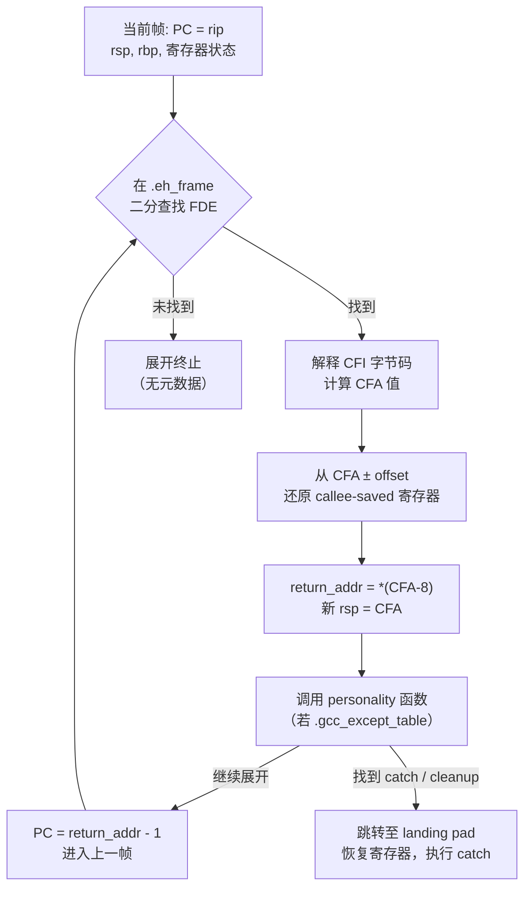

# 栈帧布局与 DWARF 展开

> [!abstract] TL;DR
> 每次函数调用都在栈上留下一块"栈帧"，记录返回地址、被调用者保存寄存器、局部变量等；调试器、异常处理器、性能剖析工具需要"展开"这些帧才能还原调用链。展开有两条路：一是沿 frame pointer（rbp/fp）链逐帧跳跃，二是读 ELF 段 `.eh_frame` 中的 DWARF CFI（Call Frame Information）表。现代编译器默认开启 `-fomit-frame-pointer`，让 rbp 变成通用寄存器以提升性能，代价是只能靠 DWARF 展开；异常处理还额外依赖 `.gcc_except_table`（LSDA）和 `__gxx_personality_v0`。理解这两条路的原理、代价与工具支持，是做性能剖析、C++ 异常调试和运行时崩溃分析的必备基础。

---

## 概述与定位

在 x86-64 系统 V ABI 体系下，函数调用是"调用者把参数备好，`call` 指令把返回地址压栈，被调用者建立自己的帧"这三步的组合。帧（frame）是栈上属于一次函数调用的连续区域，它承载：

- **返回地址**：`call` 指令隐式压入，`ret` 弹出跳回。
- **保存的帧指针**：若保留 frame pointer，被调用者在入口 `push rbp; mov rbp, rsp` 形成双向链。
- **被调用者保存（callee-saved）寄存器**：System V 约定 `rbx, rbp, r12-r15` 须由被调用者保存。
- **局部变量与临时变量区**：编译器按类型对齐分配。
- **参数传递区（Home Area / Shadow Space）**：Windows x64 规定调用者为前四个寄存器参数预留 32 字节影子区；Linux System V 无此要求。
- **红区（Red Zone）**：System V ABI 规定 `rsp` 以下 128 字节是"安全区"——内核/信号处理器保证不破坏，叶函数（不再调用其他函数）可直接使用而无需 `sub rsp, N`。

"展开"（unwinding）是指在运行时沿调用链逆向移动，逐帧恢复寄存器状态并定位每帧的返回地址。展开的需求来自三处：

1. **调试器**（gdb/lldb）打印 `backtrace`。
2. **C++ 异常**：`throw` 触发后，运行时需要从抛出点向外展开，依次调用析构函数（清理）直到找到匹配的 `catch`。
3. **性能剖析**（perf/eBPF/async-profiler）：采样时需要重建调用栈以归因 CPU 时间。

这三种场景对展开的要求略有差异，但底层机制高度共享，均由 `.eh_frame` 段、libunwind 库和 `_Unwind_*` 系列接口承载。

---

## 原理与机制

### x86-64 栈的增长方向与调用序列

x86-64 栈向低地址增长。一次完整的调用序列如下：

```text
调用者（caller）视角：
  1. 按约定把参数放入 rdi, rsi, rdx, rcx, r8, r9（前6个整型），其余压栈。
  2. call target   ; 等价于：push rip_next; jmp target

被调用者（callee）入口（若保留 frame pointer）：
  push rbp         ; 把调用者的 rbp 保存到栈
  mov  rbp, rsp    ; rbp 指向当前帧基址
  sub  rsp, N      ; 分配局部变量

被调用者出口：
  mov  rsp, rbp    ; 撤销局部变量
  pop  rbp         ; 恢复调用者 rbp
  ret              ; pop rip 并跳转
```

若省略 frame pointer（`-fomit-frame-pointer`），入口省去 `push rbp; mov rbp, rsp`，rbp 用作通用寄存器，展开只能靠 DWARF。

### frame pointer 链与栈回溯

当 frame pointer 保留时，rbp 寄存器始终指向当前帧的"帧基"，而该位置保存的内容正好是调用者的 rbp。这形成一条单链表：

```
低地址
┌──────────────────┐  <─ rsp（栈顶）
│  局部变量 / spill │
│  ...             │
├──────────────────┤  <─ rbp（当前帧基）
│  saved rbp       │  ──────────────────> 上一帧的 rbp
├──────────────────┤  rbp+8
│  返回地址        │  ──────────────────> 调用者的下一条指令
├──────────────────┤
│  调用者的帧...   │
高地址
```

回溯算法极简：

```python
# 伪代码
frame = current_rbp
while frame != 0:
    return_addr = *(frame + 8)
    yield return_addr
    frame = *frame  # 跳到上一帧的 rbp
```

优点：O(1) per frame，无需任何外部元数据。缺点：占用一个通用寄存器，每帧多一条 `push`/`pop`，对寄存器压力大的代码有约 1-3% 的性能影响。

### -fomit-frame-pointer 的代价

GCC/Clang 在 `-O1` 及以上默认开启此优化。rbp 释放后可充当通用寄存器，减少寄存器溢出（spill）到内存的次数。但失去 frame pointer 后：

- **调试器**无法用帧链回溯，只能靠 DWARF。
- **perf** 等采样型剖析器若未启用 DWARF 展开（`--call-graph dwarf`），则只能看到单层栈帧，调用归因失效。
- **崩溃分析**中，若 `.eh_frame` 段被 strip（`strip --strip-debug`），则在没有调试符号的生产二进制中几乎无法回溯。

Linux 内核传统上保留 frame pointer（`CONFIG_FRAME_POINTER`），perf 内核端的展开由此受益；Go 1.12+ 也恢复了 frame pointer 以支持 perf 剖析。

---

## 结构与算法详解

### x86-64 栈帧的完整布局


**局部变量的排布规律：**

- 编译器按**自然对齐**放置：`int`（4B）置于 4B 对齐地址，`double`（8B）置于 8B 对齐，`__int128` 置于 16B 对齐。
- 结构体按其最大字段对齐，末尾补 padding 至对齐倍数。
- 在 `-O0` 时，变量按声明顺序大致倒序（从 rbp 向低地址）分配。在 `-O1+` 时，编译器可能**重排**：将生命期重叠少、频繁访问的变量紧凑排列，甚至**合并**同类型短生命期变量共享同一槽位。
- x86-64 System V ABI 要求在 `call` 指令发出前 `rsp` 须 16B 对齐（实际上在 `call` 执行后 rsp 因压入 8B 返回地址而暂时 16B+8 对齐，callee 若有 `push rbp` 则 rsp 再减 8，恰好 16B 对齐），故编译器会在局部变量区末尾插入 0-15 字节对齐 padding。

**寄存器 spill 槽：**

当局部变量过多或有地址取用（`&x`）时，寄存器分配器（register allocator）将部分"溢出"变量写到栈上的 spill 槽。spill 槽本质上与普通局部变量共享同一区域，只是生命期由编译器管理，调试信息（DWARF `.debug_info`）会记录其偏移量。

### DWARF CFI 机制

DWARF（Debugging With Attributed Record Formats）第三版起引入 **Call Frame Information（CFI）**，用于在无 frame pointer 时展开栈帧。CFI 的核心思想是：在每个指令地址处，记录"如何从当前 rsp/rbp 还原出上一帧的 CFA（Canonical Frame Address）和所有被保存寄存器"。

**CFA（Canonical Frame Address）** 是 DWARF 定义的虚拟帧基准：通常等于"进入函数时的 rsp 值"，即在 `call` 压入返回地址之后、被调用者尚未执行任何 push 之前的 rsp。约定：返回地址 = `*(CFA - 8)`，上一帧的 rsp = CFA。

#### `.eh_frame` 与 `.debug_frame`

| 特性 | `.eh_frame` | `.debug_frame` |
|---|---|---|
| 用途 | 运行时展开（异常、libunwind） | 调试器（可strip） |
| 存在条件 | 默认链接，strip -g 不删除 | 仅 `-g` 时产生，strip 可删 |
| 节格式 | ELF section，运行时可 mmap | DWARF sections |
| 指针编码 | PC-relative（紧凑） | 绝对 |

两者共享相同的 CFI 记录格式：**CIE（Common Information Entry）** + **FDE（Frame Description Entry）**。

#### CIE 结构

CIE 是被多个 FDE 共享的公共头：

```
CIE {
  length          // 记录总长度
  CIE_id          // .eh_frame 中为 0；.debug_frame 为 0xFFFFFFFF
  version         // 1 或 3
  augmentation    // 字符串，如 "zR"、"zPLR"
  code_align      // 指令地址增量因子
  data_align      // 寄存器偏移因子（负值 = 向低地址）
  return_addr_reg // 哪个"寄存器"代表返回地址（x86-64: 16）
  initial_instructions // CFI 字节码
}
```

#### FDE 结构

FDE 描述一个连续代码范围的展开规则：

```
FDE {
  length
  CIE_pointer     // 指向对应 CIE 的相对偏移
  pc_begin        // 所覆盖代码起始地址
  pc_range        // 覆盖长度
  call_frame_instructions // CFI 字节码（增量式）
}
```

#### CFI 指令（字节码）

CFI 指令是一套极简的状态机操作，编译器在汇编文件里用伪指令发射：

| 汇编伪指令 | 语义 |
|---|---|
| `.cfi_startproc` | 开始一个 FDE；初始化 CFI 状态机 |
| `.cfi_endproc` | 结束 FDE |
| `.cfi_def_cfa reg, offset` | CFA = reg + offset（最常见：`rsp + 8` 表示函数入口后） |
| `.cfi_def_cfa_offset offset` | 只更新 CFA 的 offset 部分 |
| `.cfi_def_cfa_register reg` | 只更新 CFA 的寄存器部分（如 push rbp 后改为 `rbp + 16`） |
| `.cfi_offset reg, offset` | 寄存器 reg 已被保存在 `CFA + offset` 处 |
| `.cfi_restore reg` | 寄存器 reg 恢复为进入函数时的值 |
| `.cfi_remember_state` | 保存当前 CFI 状态（用于 if/else 分支汇合） |
| `.cfi_restore_state` | 恢复之前保存的状态 |

典型函数入口的 CFI 注释序列（保留 frame pointer）：

```asm
foo:
    .cfi_startproc
    ; 此刻 CFA = rsp + 8（call 已压入 8B 返回地址）
    push   rbp
    .cfi_def_cfa_offset 16     ; rsp 减 8，CFA 仍为 rsp+16
    .cfi_offset rbp, -16       ; saved rbp 在 CFA-16
    mov    rbp, rsp
    .cfi_def_cfa_register rbp  ; CFA 改为 rbp+16（rsp 后续可自由移动）
    sub    rsp, 32
    ; ... 函数体 ...
    mov    rsp, rbp
    pop    rbp
    .cfi_def_cfa rsp, 8
    ret
    .cfi_endproc
```

省略 frame pointer 时，每条 `push`/`pop`/`sub rsp`/`add rsp` 都需要对应 `.cfi_def_cfa_offset` 更新，以保证在任意 PC 值处展开器都能计算出正确的 CFA。

### DWARF 展开算法

展开器（libunwind 或 glibc 内置的 `_Unwind_*`）的核心循环：

```
当前帧 PC = 当前 rip
loop:
    1. 在 .eh_frame 中二分查找覆盖 PC 的 FDE
    2. 从 CIE + FDE 的 initial_instructions + call_frame_instructions
       按 PC 偏移解释 CFI 字节码，得到该 PC 处的：
         CFA_value（以寄存器值+偏移计算）
         各 callee-saved 寄存器的保存位置
    3. 从内存还原 callee-saved 寄存器
    4. return_addr = *(CFA_value - 8)
    5. 上一帧的 rsp = CFA_value
    6. PC = return_addr（减 1 取 call 指令本身，避免越界）
    7. 若 PC == 0 或 FDE 查找失败则停止
```



---

## 工具视角与实战

### 查看 .eh_frame 内容

```bash
# 用 readelf 解码 CFI 记录
readelf --debug-dump=frames a.out

# 用 objdump 查看原始 .eh_frame 十六进制
objdump -s -j .eh_frame a.out

# 用 llvm-dwarfdump（更易读）
llvm-dwarfdump --eh-frame a.out
```

典型输出片段：

```
00000014 0000001c 00000018 FDE cie=00000000 pc=0000000000001149..0000000000001165
  DW_CFA_advance_loc: 1 to 000000000000114a
  DW_CFA_def_cfa_offset: 16
  DW_CFA_offset: r6 (rbp) at cfa-16
  DW_CFA_advance_loc: 3 to 000000000000114d
  DW_CFA_def_cfa_register: r6 (rbp)
  DW_CFA_nop
```

### backtrace() 与调试器

glibc 的 `backtrace()` 函数在有 frame pointer 时走帧链，在没有时也可通过 `libunwind` 走 DWARF。gdb 的 `bt` 命令默认尝试 DWARF 展开；若 `.eh_frame` 被 strip 但 `.debug_frame` 存在则回退到后者；全无则报 `Cannot access memory at address 0x...`。

性能剖析工具的推荐做法：

```bash
# perf：用 DWARF 展开（需要有 .eh_frame；内存开销较高）
perf record --call-graph dwarf ./program

# perf：用 frame pointer 展开（需二进制和内核均保留 fp）
perf record --call-graph fp ./program

# 编译时保留 frame pointer 以支持 fp 模式
gcc -O2 -fno-omit-frame-pointer -o prog prog.c
```

async-profiler（JVM 生态）在 native 栈展开时也依赖 `.eh_frame`，若 JNI 代码 strip 了调试信息会导致 native 帧显示为 `[unknown]`。

### 异常处理表：.gcc_except_table 与 LSDA

C++ 异常处理需要额外的元数据来描述每个代码范围内的清理动作（析构函数）和 `catch` 处理器的位置。这由 **LSDA（Language-Specific Data Area）** 承担，存储在 `.gcc_except_table` 段。

**`__gxx_personality_v0`** 是 GCC/libstdc++ 的"个性函数"（personality function），在 DWARF 展开过程中被回调两次：

1. **第一阶段（搜索阶段）**：展开器遍历所有帧，对每帧调用 personality，询问"此帧能处理这个异常吗？"personality 查询 LSDA 中该帧的 landing pad 和类型过滤器，返回 `_URC_HANDLER_FOUND` 或 `_URC_CONTINUE_UNWIND`。
2. **第二阶段（清理阶段）**：找到处理帧后，展开器重新从抛出点遍历，对每帧调用 personality 执行清理（调析构、跳 landing pad）。

LSDA 的布局（GCC `.gcc_except_table`）：

```
LSDA {
  lpstart_encoding      // landing pad 基址编码
  lpstart               // landing pad 基址（通常为 FDE pc_begin）
  ttype_encoding        // 类型表编码
  ttype_base            // 类型表基址（catch 的 typeinfo 指针）
  call_site_table {     // 调用点表
    cs_start, cs_len,   // 覆盖代码范围（相对于 lpstart）
    cs_lp,              // landing pad 偏移（0 = 无）
    cs_action           // 动作表索引（0 = cleanup only）
  }
  action_table {        // 动作链
    ar_filter,          // 类型过滤（正数 = catch 索引，0 = cleanup，负数 = exception spec）
    ar_next             // 下一个动作（链式）
  }
  type_table[]          // typeinfo 指针数组（反向索引）
}
```

### 实战：用 GDB 观察 DWARF 展开

```bash
# 禁用 frame pointer，观察 DWARF 展开
gcc -O2 -fomit-frame-pointer -g -o test test.c
gdb test
(gdb) break main
(gdb) run
(gdb) info frame     # 显示当前帧的 CFA、返回地址
(gdb) bt             # 完整回溯（依赖 .debug_frame 或 .eh_frame）

# 对比：保留 fp 时 'info frame' 会显示 "saved rbp" 链
gcc -O2 -fno-omit-frame-pointer -g -o test test.c
```

---

## 安全性与正确使用

### 正确使用准则

**1. 生产二进制请保留 `.eh_frame`**

`strip -g`（`--strip-debug`）只删除 `.debug_*` 和 `.debug_frame`，不删除 `.eh_frame`——因为 `.eh_frame` 是 C++ 异常处理运行时必需的。但若使用 `strip --strip-unneeded` 或 `-S` 也会删除 `.eh_frame`，导致 C++ 析构函数不被调用（silent exception 路径错误）和 backtrace 失效，务必区分。

**2. 混用 frame pointer 与 DWARF 时的陷阱**

在同一进程中，若部分共享库保留 frame pointer、部分省略，`perf --call-graph fp` 会在省略 fp 的库边界处截断，产生虚假的"截断调用链"。建议生产环境统一用 `--call-graph dwarf` 或统一加 `-fno-omit-frame-pointer`。

**3. 红区与信号处理**

x86-64 System V ABI 规定红区（rsp 以下 128 字节）对内核中断和信号处理透明——**内核在进入信号处理器前会将 rsp 对齐并绕过红区**。但如果用户态直接在红区写数据，然后调用任何可能触发信号的操作（如 `kill(getpid(), SIGALRM)`），信号处理器会安全地绕开；若是嵌入式/裸金属环境自定义中断向量则无此保证，须手动 `sub rsp, 128` 规避。

**4. alloca 与可变长度数组（VLA）**

`alloca()` / C99 VLA 在栈上动态分配，编译器无法静态知道帧大小，因此 CFI 中 `.cfi_def_cfa_offset` 的值依赖运行时 rsp，DWARF 展开器须使用 `DW_CFA_def_cfa_expression`（基于 DWARF 表达式求值 CFA），比固定偏移复杂且性能稍低。应尽量避免在热路径使用 VLA。

**5. 栈缓冲区溢出与栈金丝雀**

编译器插入栈金丝雀（`-fstack-protector-strong`）的位置通常在返回地址之前、局部变量区之后：

```
[ 局部变量 ] [ canary ] [ saved rbp ] [ 返回地址 ]
```

溢出若覆盖 canary 值，函数返回前检测到后调用 `__stack_chk_fail`。这一布局有意将数组/缓冲区放在 canary 低地址侧，使线性溢出先碰到 canary 再触及返回地址。但若溢出量跨过 canary 直接覆写返回地址（如格式化字符串漏洞任意写），canary 无效。

**6. 展开中的并发安全**

libunwind 在访问 `.eh_frame` 时持有全局锁（或 TLS 缓存）；在高频异常路径（如每秒数千次 `throw/catch`）下性能瓶颈显著。可用 `-fno-exceptions` 排除 C++ 异常并改用错误码，或用 SjLj（setjmp/longjmp）异常模型替代 DWARF 展开（代价是代码尺寸增大）。

---

## 小结

- **栈帧**是函数调用的"内存名片"，从高地址到低地址依次存放参数溢出区、返回地址、saved rbp（可选）、callee-saved 寄存器、局部变量及 spill 槽；x86-64 在 `rsp` 以下保留 128 字节红区供叶函数使用。
- **局部变量布局**遵循自然对齐原则，优化级别越高重排与合并越激进，调试符号（DWARF `.debug_info`）记录每个变量的偏移以供调试器还原。
- **frame pointer 链**是最简单的展开手段，O(1)/帧、无需元数据，但占用一个寄存器；`-fomit-frame-pointer`（`-O1+` 默认）换来更多通用寄存器，代价是失去帧链。
- **DWARF CFI**（`.eh_frame`/`.debug_frame` 中的 CIE+FDE）用字节码状态机在任意 PC 处描述 CFA 和 callee-saved 寄存器的位置，使展开器无需 frame pointer 即可正确回溯；汇编伪指令 `.cfi_startproc`/`.cfi_def_cfa`/`.cfi_offset`/`.cfi_endproc` 是其产生接口。
- **C++ 异常展开**在 DWARF 展开之上叠加了 `.gcc_except_table`（LSDA）和 `__gxx_personality_v0`，通过两阶段搜索+清理完成析构与 `catch` 匹配。
- **工具链衔接**：`readelf --debug-dump=frames`/`llvm-dwarfdump --eh-frame` 可直接检查 CFI 记录；`perf --call-graph dwarf|fp` 选择展开策略；gdb `info frame`/`bt` 利用上述元数据呈现调用链。

---

## 相关阅读

- [[21.Asm/00 总览|汇编指令集知识库 · 总览]]
- [[21.Asm/01 汇编指令集对比|五架构调用约定对比]]
- [[21.Asm/23 调用约定对比|调用约定详解：参数传递与返回值]]
- [[21.Asm/15 x86(64)|x86-64 指令集详解]]
- [[21.Asm/31 编译器视角-C到汇编|编译器视角：C 到汇编]]
- [[21.Asm/42 安全特性对比|安全特性：栈保护与控制流完整性]]
- [[43.链接器详解|链接器详解：ELF 段合并与符号解析]]
- [[44.调试器原理与实战|调试器原理：断点、单步与符号解析]]
- [[11.ELF文件详解|ELF 文件结构：.eh_frame 与 PT_GNU_EH_FRAME]]

---

> 🏠 [[21.Asm/00 总览|汇编指令集知识库 · 总览]] ｜ [[21.Asm/01 汇编指令集对比|五架构对比]]
