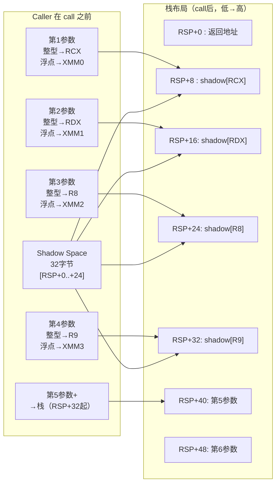

# Windows x64 调用规约（Microsoft x64 ABI）

> [!abstract] TL;DR
> - 前 4 个参数按位置依次使用 `RCX/RDX/R8/R9`（整型）或 `XMM0-XMM3`（浮点），第 N 个参数用第 N 号寄存器，不论前面是哪种类型。
> - Caller 必须在调用前于 RSP 之上预留 **32 字节 shadow space**，即使 4 个参数全走寄存器也不例外。
> - Caller 清栈（`ret` 无操作数），栈保持 **16 字节对齐**（在 `call` 执行前）。
> - 返回值：整型/指针 → `RAX`；浮点/向量 → `XMM0`。
> - 异常展开使用 **`.pdata`/`.xdata` 表驱动**机制，彻底取代 x86 的运行时 SEH 链。
> - 与 x86 stdcall 相比，参数顺序相同（从左往右映射到寄存器/栈），但寄存器传参、shadow space、展开机制三者均为新增。

---

## 概述与定位

Windows x64 调用规约（又称 **Microsoft x64 ABI**）于 Windows XP x64 和 Visual Studio 2005 随 AMD64 平台一同引入，是整个 Win64 用户态/内核态统一遵循的**单一规约**。与 x86 时代并存的 cdecl/stdcall/fastcall 不同，Win64 只有这一套：编译器关键字 `__cdecl`/`__stdcall`/`__fastcall` 在 64 位模式下被忽略，均退化为此规约。

此规约的设计目标：

1. **减少内存带宽**：前 4 个参数走寄存器，小函数调用几乎零内存往返。
2. **统一 ABI**：消除 DLL 边界的规约不匹配，所有模块（MSVC/Clang-cl/rustc/go 等）共用同一套规则。
3. **可靠的异常展开**：通过静态表（`.pdata`/`.xdata`）描述所有非叶函数的展开信息，取代脆弱的运行时 SEH 链。

---

## 原理与机制

### 整型参数寄存器

| 参数位置 | 整型/指针寄存器 | 浮点/向量寄存器 |
|----------|----------------|----------------|
| 第 1 个  | `RCX`          | `XMM0`         |
| 第 2 个  | `RDX`          | `XMM1`         |
| 第 3 个  | `R8`           | `XMM2`         |
| 第 4 个  | `R9`           | `XMM3`         |
| 第 5 个+ | 栈（RSP 之上，低地址在前）|  同左 |

**关键规则**：第 N 个参数固定用第 N 号寄存器，不管前面几个参数是什么类型。例如：

```c
void f(int a, double b, int c, double d);
// a → RCX，b → XMM1，c → R8，d → XMM3
// 注意：不存在"整型填满再分浮点"，位置即编号。
```

对于浮点参数，其对应的整型寄存器（`RCX/RDX/R8/R9`）处于**未定义**状态（callee 不依赖）；对于整型参数，其对应的 `XMM` 寄存器同样未定义。

### 寄存器的 Caller-saved vs Callee-saved

| 类别 | 寄存器 |
|------|--------|
| **易失（caller-saved）** | `RAX RCX RDX R8 R9 R10 R11 XMM0-XMM5` |
| **持久（callee-saved）** | `RBX RBP RDI RSI R12 R13 R14 R15 XMM6-XMM15` |

> `RDI`/`RSI` 在 x86 fastcall 中属易失，但 Win64 规定它们为持久寄存器，callee 必须保存/恢复。

### Shadow Space（Home Space）

Caller 在 `call` 指令**之前**将 RSP 下移至少 32 字节，供 callee 将前 4 个寄存器参数"回写"到对应槽位：

```
调用栈布局（call 执行后）
 高地址
 ┌──────────────────────┐
 │  第 6 个参数（+40）  │
 │  第 5 个参数（+32）  │
 │  shadow[R9]  （+24） │
 │  shadow[R8]  （+16） │
 │  shadow[RDX] （ +8） │
 │  shadow[RCX] （ +0） │← RSP（进入 callee 后）
 │  返回地址            │← RSP + 8（caller 原 RSP-8）
 └──────────────────────┘
 低地址
```

Shadow space **由 caller 预留，归 callee 所有**：callee 可以不用它，也可以把寄存器参数溢出到此处（调试器利用这一点重建参数值）。即使函数没有参数，caller 也必须预留这 32 字节。

### 栈对齐

在 `call` 指令执行前，`RSP` 必须是 **16 字节对齐**。`call` 压返回地址（8 字节）后，进入 callee 时 RSP ≡ 8 (mod 16)。若 callee 需要保存 callee-saved 寄存器或分配局部变量，通常在 prologue 中先 `push rbp`（+8 → RSP 再次 16 对齐），再 `sub rsp, N`（N 为 16 的倍数）。

### 返回值

| 类型 | 返回位置 |
|------|---------|
| 整型、指针（≤64 位） | `RAX` |
| 浮点、`__m128`/`__m256` | `XMM0`（低 64 位） |
| 128 位整型 | `RAX:RDX`（低:高） |
| 大结构体（>8 字节） | Caller 分配空间，地址作第 1 参数（隐藏指针）传入，函数通过 `RAX` 返回同一地址 |

---

## 结构/算法/伪代码详解

### 参数分配流程

```
输入：参数列表 [P1, P2, P3, ..., Pn]
输出：每个参数的位置（寄存器或栈槽）

reg_int  = [RCX, RDX, R8, R9]
reg_fp   = [XMM0, XMM1, XMM2, XMM3]
stack_offset = 32  // shadow space 已预留，第 5 个起从此偏移

for i, P in enumerate(params):
    if i < 4:
        if P 是浮点/向量:
            assign P → reg_fp[i]
        else:
            assign P → reg_int[i]
    else:
        align stack_offset to sizeof(P) 或 8（取大）
        assign P → [RSP + stack_offset]
        stack_offset += 8  // 每个栈槽按 8 字节粒度
```

### Prologue / Epilogue 模式

非叶函数（Unwind 函数）的典型 prologue：

```asm
; 非叶函数 prologue（MASM 风格）
push    rbp                ; callee-saved，保存帧指针
mov     rbp, rsp           ; 建立帧指针（可选，但利于调试）
push    rsi                ; callee-saved
push    rdi                ; callee-saved
sub     rsp, 0x60          ; 局部变量空间 + 对齐（16 的倍数）
; 此时 RSP 对齐到 16 字节（push 偶数次 + sub 偶数值）
```

Epilogue 必须**精确**镜像 prologue（对应 `.xdata` 中的 unwind codes），否则展开失败：

```asm
add     rsp, 0x60
pop     rdi
pop     rsi
pop     rbp
ret                        ; Win64：ret 无操作数，caller 清栈
```

---

## 工具视角与实战

### 反汇编示例

以下 C 函数：

```c
long long add5(long long a, long long b, long long c,
               long long d, long long e) {
    return a + b + c + d + e;
}
```

MSVC /O2 编译，调用方生成：

```asm
; 调用前布局栈
sub     rsp, 40            ; shadow(32) + 第5参数槽(8) = 40，保持 16 字节对齐
mov     [rsp+32], r9       ; 第 5 个参数 e → 栈（偏移 32 = shadow 末尾）
; 注：实际 e 是第 5 个参数，从 [RSP+32] 起；影子区 [RSP+0..+24]
; 但此处简化：MSVC 把第5参数放在 shadow 正好结束后
mov     r9,  4             ; d → R9（第4个）
mov     r8,  3             ; c → R8（第3个）
mov     rdx, 2             ; b → RDX（第2个）
mov     rcx, 1             ; a → RCX（第1个）
call    add5
add     rsp, 40            ; caller 清栈（含 shadow）
```

被调用方（callee）：

```asm
add5:
    ; 无需 prologue（叶函数优化）
    mov  rax, rcx          ; a
    add  rax, rdx          ; + b
    add  rax, r8           ; + c
    add  rax, r9           ; + d
    add  rax, [rsp+8]      ; + e（返回地址在 [RSP+0]，e 在 [RSP+8]）
    ret                    ; 返回值 RAX
```

> 注意：在 callee 内，`RSP` 未变动（叶函数优化），`[RSP+0]` 是返回地址，`[RSP+8]` 是第 5 个参数（e）。Shadow space 在 `[RSP+8..+40]` — 即 caller 分配的那 32 字节加上 e 的槽位。

### 识别 Shadow Space 的调试技巧

在 WinDbg/x64dbg 中：

- 进入 callee 后，若看到 `mov [rsp+8], rcx` 等连续写影子区的操作，说明这是一个调试构建（MSVC `/Zi` 会在 prologue 中将寄存器参数溢出到影子区）。
- Release 构建下影子区通常被 callee 忽略，但 caller 仍必须预留。
- 逐帧展开时，调试器靠 `.pdata`/`.xdata` 而非帧链（`RBP` 链），因此即使 `-fomit-frame-pointer` 也能正确展开。

### 可变参数（varargs）

```c
void log_msg(const char *fmt, ...);
```

对于 varargs 函数，调用规约作一项**额外要求**：若某个参数是浮点型，必须**同时**复制到对应整型寄存器（`RCX/RDX/R8/R9`）。例如：

```asm
; log_msg("%f %f", 1.0, 2.0)
movsd   xmm1, [one_0]     ; 1.0 → XMM1（正常路径）
movq    rdx, xmm1          ; 同时 → RDX（varargs 额外要求）
movsd   xmm2, [two_0]
movq    r8,   xmm2         ; 同时 → R8
lea     rcx, [fmt_str]     ; "%f %f" → RCX
sub     rsp, 32
call    log_msg
add     rsp, 32
```

原因：varargs 被调用方通过 `va_arg` 从寄存器/栈读参数时，无法区分整型与浮点——它只按位置读，整型寄存器槽必须有值。

---

## 安全性与正确使用

### 常见陷阱

**1. 忘记 shadow space**
手写 asm 调用 C 函数时漏掉 `sub rsp, 32`，callee prologue 中的 `mov [rsp+8], rcx` 等溢出操作会覆盖 caller 的栈数据，造成静默破坏，极难调试。

**2. 误以为浮点参数"占用"整型寄存器**
第 2 个参数是 `double`，第 3 个参数是 `int`：`double` → `XMM1`，`int` → `R8`（不是 `RDX`）。很多从 cdecl 迁移的代码误把第 3 个整型参数放入 `RDX`，导致错位。

**3. 栈对齐破坏**
在 asm 中手动 push 奇数个 64 位寄存器后忘记补对齐，导致 SSE 指令（`movaps` 等）对齐异常（`#GP`）。

**4. `RDI/RSI` 未保存**
来自 System V/Linux 背景的程序员习惯认为 `RDI/RSI` 是易失寄存器，在 Win64 中它们是 callee-saved，跨调用不保存会破坏调用方的局部变量。

### 逆向识别要点

| 特征 | 说明 |
|------|------|
| `sub rsp, 0x28` 或 `0x38`（32 的倍数 + 8） | 典型 shadow space 分配（32 字节对齐补 padding） |
| `mov [rsp+8], rcx` 等在 prologue 开头 | Debug 构建将寄存器参数写入影子区 |
| `ret`（无操作数） | caller 清栈，callee 不负责 |
| callee 对 `RBX/RBP/RDI/RSI/R12-R15` 做 push/pop | 这些是 callee-saved，出现即说明函数使用了它们 |
| `.pdata` 节 + `RUNTIME_FUNCTION` 记录 | 每个非叶函数有对应记录，`dumpbin /pdata` 可查 |

### 与 x86 stdcall 的对比

| 维度 | x86 `__stdcall` | Windows x64 |
|------|----------------|-------------|
| 参数传递 | 全部压栈，从右往左 | 前 4 个走寄存器，其余压栈 |
| Shadow space | 无 | 32 字节（caller 预留） |
| 清栈方 | **Callee**（`ret N`） | **Caller**（`ret` 无操作数） |
| 返回值 | `EAX`（32 位） | `RAX`（64 位） |
| 浮点返回 | `ST(0)` | `XMM0` |
| 名称修饰 | `_func@N` | 无修饰（或仅 `_` 前缀，取决于链接） |
| 异常展开 | 运行时 SEH 链（`FS:[0]`） | 表驱动（`.pdata`/`.xdata`） |
| 可变参数 | 支持（caller 清栈） | 支持（浮点需同时写整型寄存器） |

---

## Mermaid：参数分配示意



---

## 小结

Windows x64 规约以"前 4 参数走寄存器 + 32 字节 shadow space + caller 清栈"为核心，同时通过 `.pdata`/`.xdata` 表驱动展开彻底替代 x86 运行时 SEH 链。其设计兼顾了高频调用性能、调试可达性与异常安全性，是现代 Win64 生态的基石。逆向时，识别 `sub rsp, 0x28` 模式、shadow space 溢出写、callee-saved push/pop 序列是快速定位函数边界与参数的关键手段。

---

## 相关阅读

- [[22.调用规约/00.总览|调用规约总览]]
- [[22.调用规约/02.stdcall.md|__stdcall 详解（对照：callee 清栈）]]
- [[22.调用规约/03.fastcall.md|__fastcall 详解（x86 寄存器传参前驱）]]
- [[22.调用规约/06.SystemV_AMD64调用规约.md|System V AMD64 调用规约（Linux/macOS x64）]]
- [[23.C_C++运行时与ABI/15.Windows_x64_SEH与Unwind_ABI|Windows x64 SEH 与 Unwind ABI（.pdata/.xdata 内部结构）]]

> 🏠 [[22.调用规约/00.总览|调用规约总览]]
