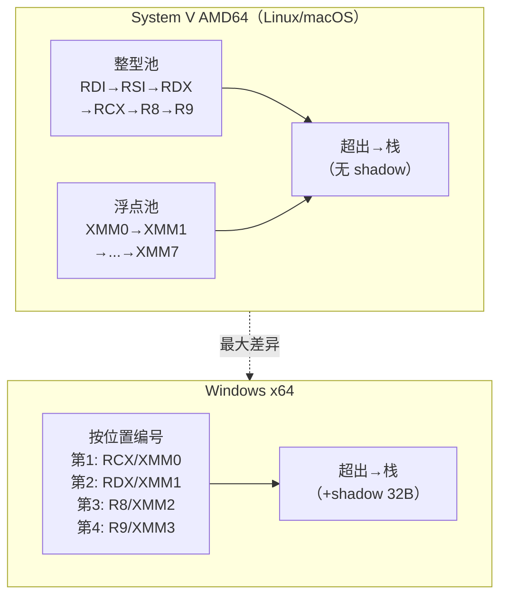

# System V AMD64 调用规约（Linux / macOS x64）

> [!abstract] TL;DR
> - 前 6 个整型/指针参数依次走 `RDI/RSI/RDX/RCX/R8/R9`；前 8 个浮点/向量参数走 `XMM0-XMM7`；超出部分压栈。
> - **128 字节 red zone**：叶函数可直接使用 `[RSP-128..RSP-1]`，无需调整 `RSP`，节省 prologue/epilogue 开销。
> - **无 shadow space**：与 Windows x64 最显著的区别之一，callee 不为 caller 预留回写槽。
> - 结构体参数按 8 字节 eightbyte 分类（INTEGER/SSE/MEMORY），决定走寄存器还是内存。
> - Varargs 函数：`AL` 寄存器在调用前存放实际使用的向量寄存器数目（上限 8）。
> - 与 Windows x64 相比：6 vs 4 整型参数寄存器、red zone vs shadow space、参数寄存器顺序完全不同。

---

## 概述与定位

**System V AMD64 ABI**（以下简称 SysV x64）由 AMD64 ABI 文档（目前由 hjl-tools 维护）定义，是 Linux、macOS、FreeBSD、Solaris 等所有主流 POSIX 平台在 x86-64 上遵循的**事实标准**。GCC、Clang（Apple clang）、icc/icx 等均默认遵循此规约。

相比 Windows x64，SysV x64 设计上更"激进"：
- 整型参数寄存器扩展到 6 个（`RDI/RSI/RDX/RCX/R8/R9`），覆盖大多数 C 函数的参数量。
- 浮点寄存器扩展到 8 个（`XMM0-XMM7`），向量计算函数受益尤大。
- Red zone 机制彻底省去叶函数的栈调整开销。
- 无 shadow space，栈布局更紧凑。

---

## 原理与机制

### 整型参数寄存器

| 参数位置 | 整型/指针寄存器 |
|----------|----------------|
| 第 1 个  | `RDI`          |
| 第 2 个  | `RSI`          |
| 第 3 个  | `RDX`          |
| 第 4 个  | `RCX`          |
| 第 5 个  | `R8`           |
| 第 6 个  | `R9`           |
| 第 7 个+ | 栈（从右往左压，低地址先入） |

### 浮点/向量参数寄存器

前 8 个浮点（`float`/`double`）或 SSE 向量（`__m128`）参数依次使用 `XMM0`–`XMM7`。与整型寄存器独立计数——整型和浮点各自"消耗"自己的寄存器池：

```c
void f(int a, double b, int c, double d, double e);
// a → RDI，b → XMM0，c → RSI，d → XMM1，e → XMM2
// 整型池: RDI(用1)，RSI(用1)  浮点池: XMM0(用1)，XMM1(用1)，XMM2(用1)
```

> 这与 Windows x64 **按位置**的"第 N 参数 → 第 N 号寄存器"截然不同。SysV 是两套独立池，整型和浮点分别计数。

### Callee-saved 寄存器

| 类别 | 寄存器 |
|------|--------|
| **易失（caller-saved）** | `RAX RCX RDX RSI RDI R8-R11 XMM0-XMM15`（含 `RSI`/`RDI`） |
| **持久（callee-saved）** | `RBX RBP R12 R13 R14 R15` |

> 注意：`RDI`/`RSI` 在 SysV 中是**易失寄存器**（caller-saved），与 Win64 相反（Win64 中是 callee-saved）。这是两套 ABI 互操作时最常见的破坏点。

### Red Zone

```
高地址
┌──────────────────────┐
│   ...调用方栈帧...   │
├──────────────────────┤ ← 调用方 RSP（call 前）
│   返回地址           │
├──────────────────────┤ ← RSP（进入 callee 后）
│                      │
│   128 字节 red zone  │← 叶函数可直接读写，无需 sub rsp
│  [RSP-128 .. RSP-1]  │
└──────────────────────┘
低地址
```

Red zone 由 ABI 保证：**信号处理器和异步中断不会破坏 `[RSP-128..RSP-1]`**（内核在切换上下文时保护这段区域）。因此叶函数可以：

```asm
leaf_func:
    ; 无 prologue，直接用 red zone 存临时变量
    mov  [rsp-8],  rdi     ; 保存参数 a
    mov  [rsp-16], rsi     ; 保存参数 b
    ; ... 计算 ...
    ret                    ; 无需 epilogue
```

Red zone 的限制：
- 仅适用于**叶函数**（不包含 `call` 指令的函数）。一旦 callee 调用其他函数，`call` 会把返回地址压到 `RSP-8`，覆盖 red zone 的最低位。
- **内核代码不享有 red zone**（需 `-mno-red-zone` 编译内核）。

### 返回值

| 类型 | 返回位置 |
|------|---------|
| 整型、指针（≤64 位） | `RAX` |
| 128 位整型 | `RDX:RAX`（高:低） |
| 浮点（`float`/`double`） | `XMM0` |
| 两个浮点（`complex double` 等） | `XMM0:XMM1` |
| 大结构体 | Caller 分配，隐藏指针作第 1 参数（`RDI`）传入，`RAX` 返回该指针 |

---

## 结构/算法/伪代码详解

### 参数分类算法（Classification）

ABI 定义了一套分类算法，决定结构体/联合体参数走寄存器还是内存：

```
分类规则（简化版）：
1. 参数按 8 字节 eightbyte 切分（不足补齐）。
2. 对每个 eightbyte 分配类别：
   - 含指针/整型字段 → INTEGER
   - 含 float/double/SSE 字段 → SSE
   - 含 x87 long double → X87（强制内存）
   - eightbyte ≥ 2 个且整体 > 16 字节 → MEMORY（走栈）
3. 若任一 eightbyte 为 MEMORY → 整个参数走内存（传引用/拷贝到栈）。
4. INTEGER 类 eightbyte 按顺序消耗整型寄存器池；SSE 类消耗 XMM 池。
5. 若整型/浮点寄存器不足 → 整个参数改走内存（不允许"部分寄存器"）。
```

实例：

```c
struct Small { int x; float y; };    // 8 字节：x→INTEGER, y→SSE → 分 2 类
// 若整型池有空（RDI）且 SSE 池有空（XMM0）：x→RDI低32位, y→XMM0低32位
// 实际上同一 eightbyte 若混合 → 取更高优先级（INTEGER > SSE）
// 所以整个 struct Small 的 8 字节 → INTEGER → 一个整型寄存器传递

struct Big { long a, b, c; };         // 24 字节，3 个 eightbyte > 2 → MEMORY
```

> 精确规则详见 SysV ABI 文档 §3.2.3。本节重点理解"超过 2 个 eightbyte 即走内存"与"寄存器不够则整体走内存"两条核心约束。

### 伪代码：参数分配

```
整型池 = [RDI, RSI, RDX, RCX, R8, R9]
浮点池 = [XMM0, XMM1, XMM2, XMM3, XMM4, XMM5, XMM6, XMM7]
栈偏移 = 0

for P in params:
    cls = classify(P)         // INTEGER / SSE / MEMORY
    if cls == INTEGER and 整型池非空:
        assign P → 整型池.pop_front()
    elif cls == SSE and 浮点池非空:
        assign P → 浮点池.pop_front()
    else:  // MEMORY 或池耗尽
        align 栈偏移 to max(8, alignof(P))
        assign P → [RSP + 栈偏移]
        栈偏移 += roundup(sizeof(P), 8)
```

### Varargs 与 AL 寄存器

调用 varargs 函数（如 `printf`）时，caller 需在 `AL` 中存放**实际使用了多少个 `XMM` 寄存器**传参（0-8）：

```asm
; printf("x=%f y=%f\n", 1.0, 2.0)
lea     rdi, [fmt]           ; 格式串
movsd   xmm0, [one_0]        ; 第1个浮点参数
movsd   xmm1, [two_0]        ; 第2个浮点参数
mov     al, 2                ; 使用了 XMM0、XMM1 共 2 个向量寄存器
call    printf
```

Callee（`printf`）靠 `AL` 的值决定要从 `XMM0-XMM7` 中保存多少个寄存器到 `va_list` 内部的 `reg_save_area`，避免无谓的全量保存。若 `AL` 偏大（比如填 8 而实际只用 2），只会浪费一点时间；若偏小，实际传入的浮点参数可能被 callee 读错（通常设为 0 是安全的保守做法，但性能次优）。

---

## 工具视角与实战

### 汇编示例：6 个整型参数 + 1 个溢出到栈

```c
long sum7(long a, long b, long c, long d,
          long e, long f, long g) {
    return a + b + c + d + e + f + g;
}
```

调用方生成（GCC/Clang，-O2）：

```asm
; 第 7 个参数 g 溢出到栈
push    7                    ; g → [RSP+0]（push 后 RSP-8）
; 注：push 后 RSP 已调整，call 之前 RSP 需 16 字节对齐
; 若调用前 RSP 已对齐，push 一次后 RSP+8 不对齐，需额外 sub rsp,8 或 push 偶数次
mov     r9,  6               ; f
mov     r8,  5               ; e
mov     rcx, 4               ; d
mov     rdx, 3               ; c
mov     rsi, 2               ; b
mov     rdi, 1               ; a
call    sum7
add     rsp, 8               ; caller 清栈（弹 g）
```

被调用方（叶函数，利用 red zone）：

```asm
sum7:
    lea     rax, [rdi + rsi]    ; a+b
    add     rax, rdx            ; +c
    add     rax, rcx            ; +d
    add     rax, r8             ; +e
    add     rax, r9             ; +f
    add     rax, [rsp+8]        ; +g（返回地址在 [RSP+0]，g 在 [RSP+8]）
    ret
```

### 识别 SysV 与 Win64 的逆向技巧

```
SysV 特征：
  - call 前把第 1 参数装入 RDI（不是 RCX）
  - 无 sub rsp, 0x20/0x28 之类的固定 shadow space
  - 函数内可见 [RSP - N]（负偏移）访问临时变量 → red zone
  - callee-saved：RBX/RBP/R12-R15（无 RDI/RSI）

Win64 特征：
  - call 前把第 1 参数装入 RCX
  - 进入 callee 后常见 mov [rsp+8], rcx（shadow 回写，Debug 构建）
  - 函数内只见 [RSP + 正偏移] 访问局部变量
  - callee-saved：RBX/RBP/RDI/RSI/R12-R15（含 RDI/RSI）
```

### macOS 特殊注意

macOS 的 ABI 基于 SysV x64 但有若干差异：
- `dyld` 要求 `RSP` 在进入 `_start` 时对齐到 16 字节（与 Linux 相同）。
- Objective-C 的 `objc_msgSend` 使用 SysV 规约（`RDI=self, RSI=selector`）。
- Apple Silicon（ARM64）使用完全不同的 AArch64 规约（不在本页范围）。

---

## 安全性与正确使用

### 常见陷阱

**1. 跨平台 asm 混用参数寄存器**
从 Windows 代码移植时，保留 `rcx` 作第 1 参数，而 Linux 期待 `rdi` → 第 1 个参数丢失，第 2 个参数（应为 `rsi`）变成"第 1 个"，造成位移型错误，通常在 `NULL` 解引用处崩溃。

**2. 在非叶函数中依赖 red zone**
叶函数升级为非叶函数（添加 `call`）后，若未将 `sub rsp, N` 加入 prologue，已存在红区的临时变量在 `call` 压返回地址时被覆盖。编译器自动处理，手写 asm 时需特别小心。

**3. 结构体分类错误**
手写绑定层（FFI/JIT）时，误将 16 字节以下结构体一律按 MEMORY 传递，实际 ABI 要求部分走寄存器 → 被调用的 C 函数从寄存器读参数而绑定层写的是栈，参数全错。

**4. RDI/RSI 在 Win64 下被破坏**
在混合 ABI 的代码（Wine、Cygwin、跨平台运行时）中，Win64 callee 不保存 `RDI/RSI`（易失），但 SysV 调用方期待 callee 保护它们（callee-saved）→ 跨 ABI 调用必须显式在桥接层保存/恢复。

### 内核与信号处理器的特殊规则

- Linux 系统调用使用**不同**的寄存器序列：`RDI RSI RDX R10 R8 R9`（注意第 4 个是 `R10` 而非 `RCX`，因为 `syscall` 指令会破坏 `RCX`）；返回值在 `RAX`，错误时 `RAX` 为 `-errno`。
- 信号处理器以 SysV 规约调用，但内核已在进入前把用户态寄存器保存到 `ucontext`，所以 red zone 内容对信号处理器不可见（已被内核保护）。
- 在内核/固件中，red zone 通常用 `-mno-red-zone` 禁用，因为异步 NMI/中断可能破坏它。

---

## Win64 vs SysV AMD64 最大差异对比表

| 维度 | System V AMD64 | Windows x64 |
|------|---------------|-------------|
| 整型参数寄存器数 | **6**（RDI RSI RDX RCX R8 R9） | **4**（RCX RDX R8 R9） |
| 浮点参数寄存器数 | **8**（XMM0-XMM7） | **4**（XMM0-XMM3） |
| 参数寄存器编号方式 | 整型和浮点**独立计数** | 按**位置**统一编号（第N参数用第N号） |
| Shadow space | **无** | **32 字节**（caller 预留） |
| Red zone | **有**（128 字节，RSP 下方） | **无** |
| 清栈方 | Caller | Caller |
| 系统调用第 4 个参数 | `R10`（避免 syscall 破坏 RCX） | 不适用（ntdll/int 2e） |
| Callee-saved | RBX RBP **R12-R15**（无 RDI/RSI） | RBX RBP **RDI RSI** R12-R15 |
| 浮点 callee-saved | 无（XMM 全易失） | XMM6-XMM15 |
| 异常展开 | DWARF CFI（`.eh_frame`） | 表驱动（`.pdata`/`.xdata`） |
| Varargs 辅助 | `AL` = 使用的 XMM 寄存器数 | 浮点参数同时复制到整型寄存器 |
| 第 1 参数 | `RDI` | `RCX` |

---

## Mermaid：SysV vs Win64 参数寄存器分配对比



---

## 小结

System V AMD64 规约以 6 个整型 + 8 个浮点参数寄存器覆盖绝大多数函数调用，配合 128 字节 red zone 让叶函数接近零开销。其核心与 Windows x64 的分歧在于：寄存器数量、独立计数 vs 按位置编号、red zone vs shadow space、以及 `RDI/RSI` 的保存义务归属。逆向分析时，第一个参数落在 `RDI`（SysV）还是 `RCX`（Win64）是最快的识别指标；`[RSP-N]` 负偏移访问是 SysV red zone 的特有标志。混合 ABI 桥接（如 Wine、跨平台 JIT）必须在边界处显式对齐这两套规约的差异。

---

## 相关阅读

- [[22.调用规约/00.总览|调用规约总览]]
- [[22.调用规约/05.Windows_x64调用规约.md|Windows x64 调用规约（Microsoft x64 ABI）]]
- [[22.调用规约/03.fastcall.md|__fastcall 详解（x86 寄存器传参前驱）]]
- [[23.C_C++运行时与ABI/15.Windows_x64_SEH与Unwind_ABI|Windows x64 SEH 与 Unwind ABI（.pdata/.xdata 内部结构）]]

> 🏠 [[22.调用规约/00.总览|调用规约总览]]
