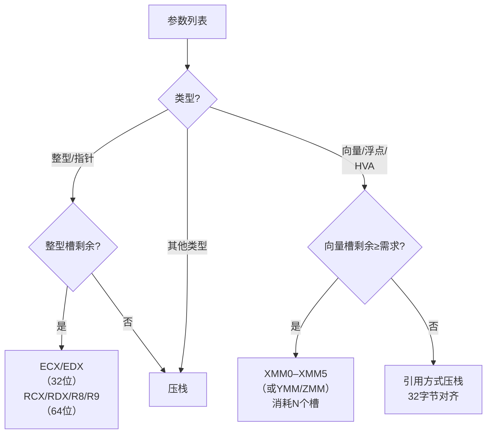

# `__vectorcall` 详解（向量参数调用规约）

> [!abstract] TL;DR
> `__vectorcall` 是 Microsoft Visual Studio 2013 引入的调用规约，32 位与 64 位均有效。整型/指针参数与 `__fastcall`（32 位）或 MS x64（64 位）保持一致，而向量/浮点参数最多用 `XMM0–XMM5`（或 `YMM`/`ZMM`）直接传递，彻底避免向量数据在栈上的冗余拷贝。支持 HVA（同类向量聚合体）整体走向量寄存器，名称修饰后缀为 `@@N`，是现代 SIMD 密集型代码（图形、多媒体、机器学习、AVX-512）的首选规约。

---

## 概述与定位

在 x86/x64 架构上，SSE/AVX 系列指令的吞吐量潜力往往被「寄存器 ↔ 内存」之间的数据搬运消耗殆尽。传统的 `__fastcall` 只为整型提供两个寄存器传参通道，`float`/`double` 及 128 位以上的 SIMD 向量类型一律走栈；MS x64 规约同样如此——前四个参数中的浮点/向量走 `XMM0–XMM3`，但一旦参数槽被整型占用，对应的 `XMM` 槽就废弃不用，利用率极低。

`__vectorcall`（`/arch:AVX`、`/arch:AVX2`、`/arch:AVX512` 下均合法）将向量寄存器与整型寄存器的分配路径**彻底解耦**：整型继续走通用寄存器，向量另开一条独立通道最多占用 `XMM0–XMM5`（6 个槽），两条通道各自计数、互不干扰。这意味着一个接受 6 个 `__m256` 参数与 4 个 `int` 参数的函数，可以同时让所有向量都留在 `YMM` 寄存器里传入。

`__vectorcall` 在以下场景有直接收益：

- **图形/游戏引擎**：矩阵、四元数、颜色向量频繁传递。
- **多媒体处理**：音频 DSP、视频滤镜、图像卷积。
- **机器学习推理**：量化/浮点激活函数热路径。
- **数值计算库**：AVX2/AVX-512 向量化内积、FFT 蝴蝶运算。

历史上，`__fastcall` 是 32 位下性能导向的寄存器规约；`__vectorcall` 可视为其 SIMD 时代的继承者，在 32 位与 64 位均能生效（MS x64 是平台默认、没有 `__vectorcall` 时自动降级的对比基准）。

---

## 原理与机制

### 整型/指针参数分配

| 位宽 | 寄存器槽（从左往右顺序占用） |
|------|--------------------------------|
| **32 位（x86）** | `ECX`（第 1 个）、`EDX`（第 2 个），其余压栈 |
| **64 位（x64）** | `RCX`、`RDX`、`R8`、`R9`（前四个），其余压栈（32 字节影子空间依然保留） |

这部分规则与 `__fastcall`（32 位）和 MS x64 ABI（64 位）**完全相同**，保证整型路径的向后兼容性。

### 向量/浮点参数分配

向量槽独立计数，顺序占用 `XMM0`–`XMM5`（共 6 个）。AVX 下自动提升为 `YMM0`–`YMM5`（256 位）；AVX-512 下提升为 `ZMM0`–`ZMM5`（512 位）。

可以放入向量寄存器的类型：

- `float`、`double`（单/双精度）
- `__m128`、`__m128i`、`__m128d`（SSE 128 位）
- `__m256`、`__m256i`、`__m256d`（AVX 256 位，需 `/arch:AVX`）
- `__m512`、`__m512i`、`__m512d`（AVX-512 512 位，需 `/arch:AVX512`）
- 满足 HVA 条件的聚合体（见下节）

超出 6 个槽的向量参数仍走栈（以引用方式传递，32 字节对齐）。

### HVA 与 HFA

**HVA（Homogeneous Vector Aggregate，同类向量聚合体）**：结构体或联合体中所有非静态成员均为**相同向量类型**（例如全是 `__m128` 或全是 `float`），且成员数量不超过 4，则整个聚合体可作为一个整体走向量寄存器通道。

```c
// 典型 HVA：4 个 float 成员，全是 float——满足 HFA
struct Vec4 { float x, y, z, w; };

// 典型 HVA：2 个 __m128 成员，全是 __m128
struct Ray { __m128 origin; __m128 dir; };
```

HVA 传参规则：若剩余向量槽数量 ≥ HVA 成员数，则按成员顺序逐个占用相应数量的 `XMM` 寄存器槽，整体消耗 N 个槽；否则整个 HVA 溢出到栈上。

**HFA（Homogeneous Floating-Point Aggregate）** 是 HVA 的浮点子集：成员全为 `float` 或全为 `double`（对应 ARM ABI 的 HFA，在 x64 vectorcall 中同样适用此归类逻辑）。

### 返回值

| 返回类型 | 返回路径 |
|----------|---------|
| 整型/指针（≤64 位） | `EAX`（32 位）/ `RAX`（64 位） |
| `float`/`double` | `XMM0`（低 32/64 位有效） |
| `__m128`/`__m256`/`__m512` | `XMM0`/`YMM0`/`ZMM0` |
| HVA（≤4 个向量成员） | 从 `XMM0` 起依次返回，等同入参逻辑 |
| 大结构体（不符合 HVA） | 调用方分配隐藏缓冲区，指针经 `RAX` 返回 |

### 名称修饰（Name Mangling）

MSVC C 链接下，`__vectorcall` 函数名使用 `@@N` **后缀**（双 `@`）：

```
__vectorcall int foo(int a, __m128 v) → foo@@12
```

其中 `N` 为**所有参数**（含寄存器传递部分）的总字节数之和，规则与 `__fastcall` 的 `@func@N` 相似，但用双 `@@` 区分。C++ 修饰名则在标准 MSVC C++ mangling 基础上嵌入 vectorcall 标记。

### 栈帧与 callee-saved 寄存器

- **32 位**：callee 清栈，`ret N`（N 仅含压栈部分字节数，向量槽无栈字节）。
- **64 位**：同 MS x64 callee 清栈语义；32 字节影子空间照旧保留；`XMM6–XMM15` 为 callee-saved（需保存/恢复）；`XMM0–XMM5` 为 caller-saved（可被被调用者随意覆写）。

---

## 结构/算法/伪代码详解

### vectorcall 参数分配流程

```
for 参数列表中的每个参数 p（从左往右）:
    if p 是整型/指针:
        if 整型槽未耗尽（x86 前 2 个 / x64 前 4 个）:
            分配到下一个整型寄存器
        else:
            压入栈（从右往左顺序）
    elif p 是向量/浮点类型 或 满足 HVA 条件:
        需要槽数 = 1（标量）或 HVA 成员数（聚合）
        if 向量槽剩余 ≥ 需要槽数:
            分配到 XMM[next_vec] 起的连续槽
            next_vec += 需要槽数
        else:
            以引用方式压栈（32 字节对齐）
    else:
        压栈（其他不可向量化类型）
```

### 寄存器分配示意（Mermaid）



### 示例 1：32 位 vectorcall，混合整型与 `__m128`

```c
// C 声明
float __vectorcall dot4(int scale, __m128 a, __m128 b);
// scale=2, a={1,2,3,4}, b={5,6,7,8}
```

调用方（x86）：

```asm
; scale → ECX（整型槽 #1）
mov  ecx, 2

; a → XMM0（向量槽 #1，128 位）
movaps xmm0, [a_addr]

; b → XMM1（向量槽 #2，128 位）
movaps xmm1, [b_addr]

call dot4@@20      ; N = 4(int) + 16(__m128) + 16(__m128) = 36? 实际按ABI对齐后
                   ; ★ 后缀数字按编译器实际计算，此处为示意
```

被调用方（callee）：

```asm
dot4@@20:
    ; scale 在 ECX，a 在 XMM0，b 在 XMM1
    dpps  xmm0, xmm1, 0xF1   ; 四分量点积 → XMM0[31:0]
    cvtsi2ss xmm1, ecx        ; scale → XMM1
    mulss xmm0, xmm1          ; 乘以 scale
    ret  0                    ; 无栈参数，ret 0
    ; 返回值在 XMM0（低 32 位 float）
```

### 示例 2：64 位 vectorcall，整型 + `__m256`（AVX）

```c
// AVX 下 __m256 走 YMM
void __vectorcall transform(__m256 mat_row, int idx, __m256 vec);
```

寄存器分配（64 位）：

```
mat_row → YMM0（向量槽 #1）
idx     → RCX （整型槽 #1，因 mat_row 已占向量通道，不影响整型计数）
vec     → YMM1（向量槽 #2）
```

这里清晰地体现了**两条通道独立计数**的核心优势：`idx` 是第二个出现的参数，但它走整型通道，`RCX` 不被前面的 `YMM0` 占用。

### 示例 3：HVA 传递

```c
struct ColorRGBA { float r, g, b, a; };  // HFA：4个float，≤4成员
void __vectorcall blend(ColorRGBA src, ColorRGBA dst, float alpha);
```

分配：

```
src.r → XMM0（槽 #1）
src.g → XMM1（槽 #2）
src.b → XMM2（槽 #3）
src.a → XMM3（槽 #4）   // HVA 整体消耗 4 个槽

dst.r → XMM4（槽 #5）
dst.g → XMM5（槽 #6，最后一个）
dst.b、dst.a → 溢出，引用方式压栈  // 槽已耗尽，不足4个
alpha → 压栈（向量槽已满）
```

> 注意：HVA 要么**整体进入向量寄存器**（槽数足够），要么**整体溢出**——不会被拆分。

---

## 工具视角与实战

### 编译器开关

```bash
# MSVC — 对单个函数：直接用 __vectorcall 关键字
# 全局启用（影响所有函数默认规约，较少使用）：
cl /Gv source.cpp

# 启用 AVX2 以使用 YMM
cl /arch:AVX2 /Gv source.cpp

# 启用 AVX-512
cl /arch:AVX512 /Gv source.cpp
```

GCC/Clang 目前**不支持** `__vectorcall`（Linux ABI 通过 System V AMD64 ABI 传向量，参数走 `XMM0–XMM7`，效果类似但规则不同）。

### 用 dumpbin / x64dbg 识别 vectorcall

1. **名称修饰**：符号表中带 `@@N` 双 at 后缀即为 `__vectorcall`（C 链接）。
2. **参数模式**：`call` 之前同时出现 `movaps`/`vmovaps`/`vmovdqu` 向 `XMM`/`YMM` 装数据 **和** `mov rcx/rdx/r8/r9` 装整型参数。
3. **返回值**：浮点/向量结果在 `XMM0`（`YMM0`）中，而非 `RAX`。

### 与 intrinsics 配合

```c
#include <immintrin.h>

// 显式 __vectorcall，编译器保证 a、b 不额外溢出
__m256 __vectorcall avx2_fmadd(__m256 a, __m256 b, __m256 c) {
    return _mm256_fmadd_ps(a, b, c);  // FMA：a*b+c，全程 YMM 寄存器
}
```

若不加 `__vectorcall`，即使用了 intrinsics，编译器仍可能按 MS x64 规约把第 3/4 个向量参数溢出到栈上再加载。

### 与 DLL 边界

跨 DLL 导出接口时，`__vectorcall` 需要：
- 调用方和被调用方**都**以相同 `__vectorcall` 声明。
- 链接两侧的编译单元均启用相同的 AVX 代级（否则 YMM/ZMM 上界不一致）。
- 混合 C/C++ 边界时留意名称修饰差异，推荐加 `extern "C"`。

---

## 安全性与正确使用

### 正确使用要点

1. **类型精确匹配**：`float` 与 `double` 的向量槽规则相同，但不可混用（`float` → `XMM` 低 32 位；`double` → 低 64 位）；`__m128`/`__m256`/`__m512` 必须与编译时 `/arch` 级别对应，否则生成非法指令。

2. **HVA 成员上限**：成员数超过 4 的同类结构体不满足 HVA 条件，整体走栈（常见误用：5 个 `float` 成员的结构体认为能走 5 个 XMM 槽，实际全溢出）。

3. **影子空间依然存在**（64 位）：即使全部参数走寄存器，callee 进入后 `[rsp+8]`–`[rsp+32]` 的 32 字节影子空间依然由 caller 预留，callee 可合法写入用于调试/存储，不可省去。

4. **callee-saved `XMM6–XMM15`**（Windows x64）：vectorcall 被调用者若使用 `XMM6` 以上的寄存器，必须保存恢复；`XMM0–XMM5` 是 caller-saved，不需要保存。

### 常见陷阱

- **跨编译器 ABI 不兼容**：GCC/Clang 不识别 `__vectorcall`，混合编译项目中若一侧不支持，链接时即报符号找不到，不会静默地用错误规约调用。
- **可变参数不支持**：`__vectorcall` 不支持 `...` 可变参数函数，与 `__fastcall`/`__stdcall` 相同限制。
- **向量参数对齐**：传入 `__m256`/`__m512` 时，若数据未 32/64 字节对齐，`vmovaps` 会触发 GP 异常；栈上溢出的 HVA 参数由编译器保证 32 字节对齐，不需要手动处理。

### 逆向识别

```
特征一：符号名后缀 @@N（双@）
特征二：call 之前 movaps/vmovaps 系列指令装填 XMM/YMM，
        且同时有 mov rcx/rdx/r8/r9 装整型（两通道并行）
特征三：返回 float/向量时，后续代码读 XMM0 而非 EAX/RAX
特征四：callee 末尾 ret（无栈参数时）或 ret N（纯栈参数字节数）
```

与 `__fastcall` 的区别：fastcall 只有 `ECX/EDX` 装数据，无 XMM 操作；vectorcall 在整型通道之外**必然**出现 XMM 操作。

---

## 小结

`__vectorcall` 通过将向量/浮点参数通道与整型参数通道彻底解耦，最多允许 6 个向量（或 HVA）参数留在 `XMM0–XMM5`（AVX 下为 `YMM`、AVX-512 下为 `ZMM`）中传递，无需压栈搬运，显著降低 SIMD 密集函数的调用开销。32 位与 64 位均有效，名称修饰为 `@@N`。在现代 AVX2/AVX-512 代码库中，凡热路径函数接受向量参数，显式标注 `__vectorcall` 是低成本、高回报的性能手段。与 `__fastcall` 相比是超集关系，与 MS x64 相比则是在不破坏既有整型规则的前提下叠加了独立的向量通道。

---

## 相关阅读

- [[22.调用规约/00.总览|调用规约总览]]
- [[22.调用规约/03.fastcall.md|__fastcall 详解（前两个整型进 ECX/EDX）]]
- [[22.调用规约/05.x64-ms.md|MS x64 调用规约]]
- [[23.ABI/02.数据布局与对齐.md|ABI：数据布局与对齐（HVA/HFA 基础）]]

> 🏠 [[22.调用规约/00.总览|调用规约总览]]
