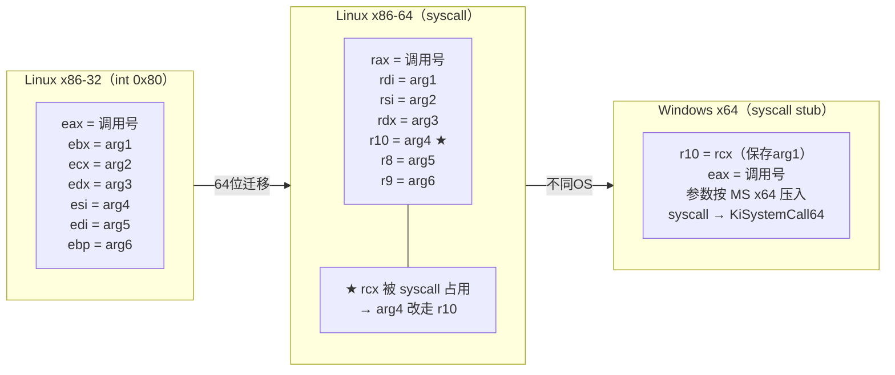

# 系统调用规约（syscall ABI）

> [!abstract] TL;DR
> 系统调用不走普通调用规约（用户态 ABI），而是专用的 **syscall ABI**：x86 32 位用 `int 0x80`（`eax`=调用号，参数依次 `ebx/ecx/edx/esi/edi/ebp`）或 `sysenter` 快速路径；x86-64 Linux 用 `syscall` 指令（`rax`=号，参数 `rdi/rsi/rdx/r10/r8/r9`——**`r10` 代替用户态 `rcx`**，因为 `syscall` 本身占用 `rcx`/`r11`）；Windows x64 经 ntdll syscall stub 封装，调用号随系统版本变化，旧路径为 `int 0x2e`。两大系统的 syscall ABI 彼此不兼容、与用户态 ABI 也不兼容，逆向时需明确区分三层边界。

---

## 概述与定位

### 三层调用栈边界

```
用户态应用
  │ 用户态调用规约（cdecl / MS x64 / System V AMD64 ABI …）
  ▼
C 标准库 / libc / ntdll
  │ syscall ABI（平台专用，CPU 指令层）
  ▼
内核（Ring 0）
```

**用户态调用规约**（如 `__cdecl`、`MS x64`、`System V AMD64 ABI`）仅约束用户空间进程内的函数调用，**不跨越 Ring 3 → Ring 0 的特权边界**。

**syscall ABI** 是 CPU 架构 + 操作系统内核共同规定的接口：用哪条指令陷入内核、哪个寄存器放系统调用号、哪几个寄存器依次放参数、返回值在哪里、哪些寄存器被内核污染——这些规则由 OS 内核（而非编译器）定义，是操作系统的稳定对外 ABI 的一部分。

两者的核心差异体现在：

| 维度 | 用户态调用规约 | syscall ABI |
|------|----------------|-------------|
| 触发方式 | `call` 指令 | `int 0x80`/`sysenter`/`syscall` 指令 |
| 调用号 | 不存在（直接是地址） | `eax`/`rax` 显式传调用号 |
| 参数寄存器 | 规约决定 | 内核 ABI 独立规定（与用户态不同） |
| 可变参数 | 支持 | 不支持（参数数量固定 ≤6） |
| 栈帧 | 标准 bp/sp 框架 | 内核有自己的内核栈，用户栈切换 |
| 实现者 | 编译器 | OS 内核 |

---

## 原理与机制

### x86 32 位：`int 0x80` 路径

Linux 32 位经典 syscall 接口：

| 寄存器 | 含义 |
|--------|------|
| `eax` | **系统调用号** |
| `ebx` | 第 1 个参数 |
| `ecx` | 第 2 个参数 |
| `edx` | 第 3 个参数 |
| `esi` | 第 4 个参数 |
| `edi` | 第 5 个参数 |
| `ebp` | 第 6 个参数 |
| `eax`（返回） | 返回值（负值表示 `-errno`） |

最多 **6 个参数**（`ebx`–`ebp`），超过 6 个参数的 syscall（极少见）通过将参数放入结构体、传递结构体指针来规避。

执行流程：

1. 填入 `eax`（调用号）及参数寄存器。
2. 执行 `int 0x80`，CPU 切换到 Ring 0，跳转到 IDT[0x80] 中注册的内核中断处理例程。
3. 内核查 `eax` 派发到对应系统调用实现。
4. 内核将返回值写入 `eax`，`iret` 回到用户态。

经典示例（32 位，`write(1, "hi\n", 3)`）：

```asm
mov eax, 4       ; sys_write = 4
mov ebx, 1       ; fd = stdout
mov ecx, msg     ; buf 指针
mov edx, 3       ; count
int 0x80
; 返回值在 eax（写入字节数，负值为错误码）
```

### x86 32 位：`sysenter` 快速路径

`int 0x80` 的软中断路径在奔腾 4 时代被测量为性能瓶颈。Intel 引入 `sysenter`/`sysexit` 指令对（AMD 对应 `syscall`/`sysret`，32 位下效果类似）：

- CPU 从 MSR（Model Specific Register）`SYSENTER_CS_MSR`、`SYSENTER_EIP_MSR`、`SYSENTER_ESP_MSR` 读取目标 CS/EIP/ESP，直接跳转到内核，无需 IDT 查表，比 `int 0x80` 快约 50%。
- Linux 2.6 引入 **VDSO（Virtual Dynamic Shared Object）**：内核将最优陷入路径的小段代码映射到每个进程的用户态地址空间；libc 通过 `__kernel_vsyscall` 调用，在运行时自动选择 `int 0x80` 或 `sysenter`，应用层无需感知。
- **参数传递规范与 `int 0x80` 相同**（`eax`=号，`ebx/ecx/edx/esi/edi/ebp`=参数），仅陷入机制不同。

### x86-64 Linux：`syscall` 指令

64 位 Linux 使用 `syscall`/`sysret` 指令对，这是现代 x64 的标准陷入路径：

| 寄存器 | 含义 |
|--------|------|
| `rax` | **系统调用号** |
| `rdi` | 第 1 个参数 |
| `rsi` | 第 2 个参数 |
| `rdx` | 第 3 个参数 |
| `r10` | 第 4 个参数 ⚠️ |
| `r8`  | 第 5 个参数 |
| `r9`  | 第 6 个参数 |
| `rax`（返回） | 返回值（负值 `-4095`–`-1` 为 `-errno`） |

**为何第 4 个参数是 `r10` 而不是 `rcx`？**

这是最重要的一个细节，也是与 System V AMD64 用户态 ABI（第 4 个参数走 `rcx`）唯一的寄存器差异：

`syscall` 指令执行时，CPU 硬件自动：
1. 将**用户态返回地址（`RIP`）写入 `RCX`**（供 `sysret` 返回时恢复）。
2. 将 **`RFLAGS` 写入 `R11`**（供 `sysret` 恢复标志寄存器）。

因此 `syscall` 执行之后，`rcx` 与 `r11` 已被 CPU 破坏，不再是系统调用前的值——它们的原始内容必须在陷入前就不再需要。这就是为什么 Linux 64 位 syscall ABI 将第 4 个参数从 `rcx`（用户态 ABI 的位置）**移位到 `r10`**。

```
用户态 System V ABI：rdi rsi rdx rcx r8 r9
Linux syscall ABI：   rdi rsi rdx r10 r8 r9  ← 仅第4个不同
                                   ^^^
                          syscall 占用了 rcx
```

经典示例（64 位，`write(1, "hi\n", 3)`）：

```asm
mov rax, 1        ; sys_write = 1（64位号与32位不同！）
mov rdi, 1        ; fd = stdout
lea rsi, [msg]    ; buf 指针
mov rdx, 3        ; count
syscall
; 返回值在 rax
; rcx 已被 CPU 覆写为返回地址（不可信）
; r11 已被 CPU 覆写为 rflags（不可信）
```

### Windows x64：syscall stub 与调用号

Windows 用户态程序不直接执行 `syscall` 指令——调用路径为：

```
Win32 API（kernel32.dll）
  → ntdll!NtXxx / ZwXxx（ntdll.dll）
    → syscall stub（ntdll 内汇编存根）
      → 内核 KiSystemCall64
```

ntdll 内每个系统调用函数（`NtWriteFile`、`NtReadFile` 等）的存根形如：

```asm
; ntdll!NtWriteFile 的 syscall stub（Win10 x64，调用号仅供示意）
mov r10, rcx      ; ★ 关键：将 rcx（第1个参数）保存到 r10
                  ;   因为 syscall 会破坏 rcx
mov eax, 8        ; 系统调用号（随 Windows 版本变化！）
syscall
ret
```

这里 `mov r10, rcx` 的原因与 Linux 一致：`syscall` 指令会覆写 `rcx`，故先把原始第 1 个参数备份到 `r10`，内核在 `KiSystemCall64` 处理例程中再从 `r10` 读回。

**Windows syscall 的关键特性：**

1. **调用号随 Windows 版本变化**：同一个函数（如 `NtWriteFile`）在不同版本 Windows（Win7/Win10/Win11）的调用号不同，甚至在 KB 补丁后可能变化。这是 Windows 明确不鼓励直接使用 `syscall` 的原因——公开 ABI 是 Win32 API，ntdll 是内核的稳定封装层。
2. **旧路径 `int 0x2e`**：Windows 2000/XP 时代使用 `int 0x2e` 触发系统调用（等效 Linux 的 `int 0x80`）。Vista 后默认切换到 `syscall`（64 位）/ `sysenter`（32 位），但某些调试场景下仍可见 `int 0x2e`。
3. **WoW64（32 位程序在 64 位 Windows 运行）**：WoW64 层在 32 位进程内拦截系统调用，翻译为 64 位 syscall ABI 后再陷入内核，路径更长。

### errno 与返回值编码

- **Linux 32/64 位**：`syscall` 返回值在 `eax`/`rax`；若为负数且在 `-4095`–`-1` 范围内，表示 `-errno`（如 `-2` 表示 `ENOENT`）；libc 封装层检查此范围，将负值取反后写入线程局部变量 `errno`，再对外返回 `-1`。
- **Windows**：ntdll 函数返回 `NTSTATUS`（32 位）；Win32 层再将 `NTSTATUS` 映射为 `BOOL`/`DWORD` 及 `GetLastError()` 可读的错误码。直接 syscall 时读取的是原始 `NTSTATUS`，无 `errno` 概念。

---

## 结构/算法/伪代码详解

### syscall 指令硬件行为（x64）

```
执行 syscall 时，CPU 硬件自动完成（AMD64/Intel EM64T）：

1. RCX  ← 用户态 RIP（返回地址）
2. R11  ← 用户态 RFLAGS
3. RIP  ← IA32_LSTAR MSR（内核 syscall 入口）
4. CPL  ← 0（Ring 0）
5. CS   ← IA32_STAR[47:32]（内核代码段选择子）
6. SS   ← IA32_STAR[47:32]+8（内核数据段）
7. RFLAGS &= ~(IA32_FMASK MSR)  // 清除指定标志（IF 等）
8. 不自动切换 RSP（内核入口代码自行切换到内核栈）
```

`sysret` 时逆向恢复 `RIP`←`RCX`，`RFLAGS`←`R11`，降权回 Ring 3。

### 各平台 syscall ABI 对比（Mermaid）



### 常见 Linux 系统调用号（x86-64）

| 调用号 | 名称 | 主要参数 |
|--------|------|----------|
| 0 | `read` | `fd`, `buf*`, `count` |
| 1 | `write` | `fd`, `buf*`, `count` |
| 2 | `open` | `path*`, `flags`, `mode` |
| 3 | `close` | `fd` |
| 9 | `mmap` | `addr`, `len`, `prot`, `flags`, `fd`, `off` |
| 11 | `munmap` | `addr`, `len` |
| 39 | `getpid` | —— |
| 59 | `execve` | `path*`, `argv**`, `envp**` |
| 60 | `exit` | `status` |
| 231 | `exit_group` | `status` |

> 32 位 Linux 调用号完全不同（如 `write` 是 4，`exit` 是 1），切勿混用。

---

## 工具视角与实战

### strace：最简单的 syscall 追踪

```bash
# 追踪进程所有系统调用
strace ./myprogram

# 只关注 write/read
strace -e trace=write,read ./myprogram

# 以十六进制显示参数
strace -x ./myprogram
```

`strace` 输出格式：`syscall_name(arg1, arg2, ...) = 返回值`，错误时追加 ` (errno 描述)`。

### 手写 x64 Linux syscall（无 libc 依赖）

```nasm
; nasm -f elf64 hello.asm && ld hello.o -o hello
section .data
    msg db "hello syscall", 10
    len equ $-msg

section .text
global _start

_start:
    mov rax, 1        ; sys_write
    mov rdi, 1        ; stdout
    lea rsi, [msg]
    mov rdx, len
    syscall           ; rcx/r11 将被破坏

    mov rax, 60       ; sys_exit
    xor rdi, rdi      ; status = 0
    syscall
```

### Windows syscall 号提取（逆向 ntdll）

```python
# 伪代码：扫描 ntdll 中的 syscall stub 模式
# 特征：mov r10, rcx / mov eax, N / syscall / ret
import pefile, struct

ntdll = pefile.PE("ntdll.dll")
for exp in ntdll.DIRECTORY_ENTRY_EXPORT.symbols:
    name = exp.name.decode() if exp.name else ""
    if name.startswith(("Nt", "Zw")):
        rva = exp.address
        data = ntdll.get_data(rva, 8)
        # 特征字节：4c 8b d1（mov r10, rcx）49 c7 c0 / b8（mov eax, N）
        if data[:3] == b'\x4c\x8b\xd1':
            syscall_no = struct.unpack_from('<I', data, 4)[0]
            print(f"{name}: {syscall_no:#x}")
```

### 在 x64dbg / IDA 中识别 syscall 位置

1. 在 ntdll 反汇编视图中，`NtXxx` 系列函数开头固定出现 `mov r10, rcx` + `mov eax, imm` + `syscall`。
2. 在用户态程序中若看到**直接 `syscall`**（不经 ntdll），高度怀疑为反调试/反钩子技术（Direct Syscall、Hell's Gate、SysWhispers 等），常见于 EDR 绕过恶意软件。
3. Linux 下：`strace -p <pid>` 可实时挂接，或在 GDB 中 `catch syscall write` 断在特定系统调用。

---

## 安全性与正确使用

### 正确使用要点

1. **不要在应用层硬编码调用号**（尤其 Windows）：调用号随 OS 版本变化，硬编码 `mov eax, 55h` 在不同 Windows 版本可能调用完全不同的函数，造成崩溃或安全漏洞。正确做法是经由 libc/Win32 API/ntdll 封装调用。

2. **`rcx`/`r11` 在 `syscall` 后不可信**（x64）：若在汇编包装函数中手写 `syscall`，需在之前将 `rcx` 中的参数值备份到其他寄存器（如 Windows 存根的 `mov r10, rcx`），`r11` 同理。

3. **内核栈与用户栈分离**：`syscall` 不自动切换 `rsp`，内核入口代码（Linux 的 `entry_SYSCALL_64`）在极早期从 `gs`/`swapgs` 机制切换到内核栈，陷入后用户态 `rsp` 值仍可在内核中访问（`pt_regs` 保存），但内核运行在独立栈上。

### 常见陷阱

- **32 位调用号 ≠ 64 位调用号**：在 64 位进程中执行 `int 0x80` 同样有效（Linux 保留了 ia32_syscall 路径），但 `eax` 里放的是**32 位调用号**（`write`=4），不是 64 位的（`write`=1）。混淆两套调用号是从 32 位移植代码时的高频错误。

- **`sysenter` 在 64 位模式下无效**：64 位操作模式下 `sysenter` 被 AMD 废弃，只有 Intel 部分实现保留，实际不应使用。64 位 Linux/Windows 均使用 `syscall`。

- **WoW64 的双层翻译**：32 位应用在 64 位 Windows 上调用 ntdll32，WoW64 层将其翻译为 64 位 ntdll syscall，再陷入内核。直接 syscall 绕过 WoW64 会导致进程崩溃（调用号映射错误、栈布局不符）。

### 逆向识别

```
识别 Linux x86-32 syscall：
  int 0x80 之前 eax 被赋一个小整数（<500）
  ebx/ecx/edx/esi/edi/ebp 依次为参数

识别 Linux x86-64 syscall：
  syscall 之前 rax 被赋一个小整数
  参数按 rdi/rsi/rdx/r10/r8/r9 顺序填入
  注意 r10 而非 rcx 作为第4个参数

识别 Windows x64 syscall stub：
  固定模式：mov r10, rcx / mov eax, imm32 / syscall / ret
  若 eax 值与已知 Windows 版本调用号表不符——怀疑 Direct Syscall

识别反调试 Direct Syscall（Windows 恶意软件）：
  syscall 指令出现在非 ntdll 模块地址范围内
  调用前手动设置 r10/eax，绕过 EDR 对 ntdll 的 hook
```

---

## 小结

系统调用规约是用户态与内核态之间独立的一层 ABI，与用户态调用规约并列但互不相同。x86 32 位以 `int 0x80`（`eax`=号、`ebx–ebp`=参数）为经典路径，`sysenter` 提供性能优化；x86-64 Linux 统一使用 `syscall` 指令，寄存器顺序与 System V AMD64 ABI 高度对齐，唯一例外是第 4 个参数从 `rcx` 移到 `r10`——原因是 `syscall` 硬件行为必须借用 `rcx` 保存返回地址、`r11` 保存 `RFLAGS`。Windows x64 通过 ntdll syscall stub 封装这一机制，`mov r10, rcx` 是其标志性指令模式，调用号随版本变化意味着不可硬编码。掌握 syscall ABI 是逆向分析反调试技术、系统级漏洞挖掘与 shellcode 编写的必要基础。

---

## 相关阅读

- [[22.调用规约/00.总览|调用规约总览]]
- [[22.调用规约/06.sysv-amd64.md|System V AMD64 ABI（Linux x64 用户态规约）]]
- [[22.调用规约/05.x64-ms.md|MS x64 调用规约]]
- [[23.ABI/01.调用约定概述.md|ABI：调用约定概述]]

> 🏠 [[22.调用规约/00.总览|调用规约总览]]
