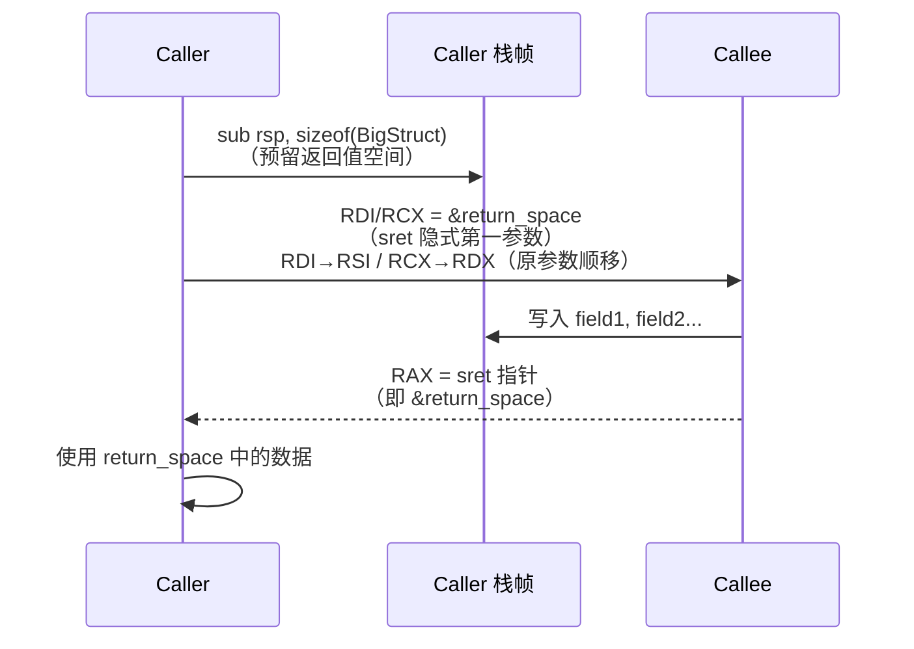

# 聚合体与返回值传递

> [!abstract] TL;DR
> 标量返回值走寄存器（整型 `RAX`，浮点 `XMM0`）；**大型聚合体返回走"隐式指针"（sret）**：caller 在栈/堆上预分配返回空间，将该空间地址作为**隐藏的第一个参数**传给 callee，callee 写入后将该地址回传 `RAX`。这正是 C++ 反编译时"多出来的第一个参数"的根源。小型结构体可被打包进寄存器对（`RAX:RDX` 或 `XMM0:XMM1`）直接返回。System V 与 Windows x64 在"何时走隐式指针"的分界规则上有显著差异。

---

## 概述与定位

函数返回值的传递规则是调用规约中最容易被忽视、却在逆向与 ABI 设计中最常制造困惑的部分。标量（整型、指针、浮点）的传递路径相对直接，但一旦涉及**结构体、联合体、类（统称"聚合体"）**，规则就变得复杂：

1. 小到可以塞进一两个通用/浮点寄存器的聚合体，ABI 允许直接按值返回。
2. 超过阈值（或含非平凡析构/拷贝构造的 C++ 类型）的聚合体，**ABI 强制改走"隐式指针"路径**：调用方预留空间、把地址悄悄插入参数列表第一位，被调用方把结果写进去。

理解这一机制，能解释以下现象：

- IDA / Ghidra 反编译某个"返回结构体"的函数时，其参数多出一个"不明来源的指针"——那就是 sret 隐指针。
- C++ 编译器在返回语句处生成 `memcpy` 或构造调用，而非简单的寄存器写入。
- 跨语言（C/C++/Rust）绑定时若对 ABI 做了错误假设，会在结构体返回处静默损坏数据。

本文与 [[22.调用规约/05.Windows_x64调用规约.md|Windows x64 调用规约]] 和 [[22.调用规约/06.SystemV_AMD64调用规约.md|System V AMD64 调用规约]] 形成互补：那两篇讲整体寄存器分配与栈帧，本文专门深挖**返回值分类**与**结构体入参**的细节，并交叉引用 ABI 文档层级的分类规则。

---

## 原理与机制

### 标量返回值

标量返回规则在两大 x64 ABI 下高度一致：

| 类型 | System V AMD64 | Windows x64 |
|------|---------------|-------------|
| 整型 / 指针（≤64 位） | `RAX` | `RAX` |
| 128 位整型 | `RAX`（低）+ `RDX`（高） | 不原生支持，改走内存 |
| 单精度浮点 `float` | `XMM0`（低 32 位） | `XMM0`（低 32 位） |
| 双精度浮点 `double` | `XMM0`（低 64 位） | `XMM0`（低 64 位） |
| `long double`（x87） | `ST(0)` | `ST(0)` |
| `__m128` / `__m256` | `XMM0` / `YMM0` | `XMM0`（≤16 字节视为标量） |

> `ST(0)`：x87 浮点栈顶寄存器。x64 代码中 `long double` 返回仍走 x87，这是历史遗留；现代编译器在 x64 下通常将 `long double` 映射到 64 位 `double`，仅 32 位代码中的 `float`/`double` 返回才常见 `ST(0)`。

### 大型聚合体：隐式指针（sret）

当聚合体超过 ABI 规定的"可按值寄存器返回"阈值，ABI 切换为**隐式返回指针（struct return pointer，简称 sret）**机制：

**完整流程**：

1. **Caller** 在自身栈帧（或堆，若对象生命期需要）上为返回值**预分配足够的对齐空间**。
2. Caller 将该空间的地址（"sret 指针"）**作为第一个参数**传给 callee：
   - System V：通过 `RDI`（把原 `RDI` 参数顺移至 `RSI`、`RDX`……）
   - Windows x64：通过 `RCX`（把原 `RCX` 参数顺移至 `RDX`、`R8`……）
3. **Callee** 将返回值写入该地址所指向的内存区域（可能是逐字段赋值，也可能是移动/拷贝构造）。
4. Callee 将 sret 指针本身写回 `RAX` 后返回（LLVM IR 层称此为"返回 sret 指针"）。
5. Caller 收到返回后，返回值已经在它预分配的空间里，无需额外拷贝。

> NRVO（Named Return Value Optimization）是编译器在此机制上的优化：当函数体内存在唯一的具名返回变量时，编译器**直接让该变量使用 sret 指针指向的空间**，消除最后一次拷贝。这不改变 ABI——sret 指针仍然传递——只是 callee 内部省去了"先构造本地变量再拷贝到 sret 地址"的步骤。

### Windows x64 的分类规则

Windows x64 ABI 的结构体返回规则相对简单：

- **大小 ≤ 8 字节 且 大小是 1、2、4、8 字节之一**（即对齐良好的"整型形状"）→ 按值返回，打包进 `RAX`（或低位字节）。
- **其他所有情况**（包括大小为 3、5、6、7 字节，以及所有 > 8 字节的结构体）→ **隐式指针路径**（走 `RCX`）。
- 浮点字段不影响整体分类：`struct { float x; }` 同样走 `RAX` 按值返回（整体 ≤ 8 字节）。

Windows x64 刻意回避了 System V 那套复杂的 eightbyte 分类，以"是否整型形状 + 是否 ≤ 8 字节"做二元判断，便于实现。

### System V AMD64 eightbyte 分类

System V 引入了更精细的**"eightbyte 分类"**（字面意思：把结构体按每 8 字节一块划分，分别给每块打分类标签）：

| 分类 | 含义 | 传递/返回寄存器 |
|------|------|----------------|
| `INTEGER` | 整型/指针/布尔等 | 通用寄存器（`RAX`、`RDX`） |
| `SSE` | 浮点/向量 | `XMM0`、`XMM1` |
| `SSEUP` | 向量的高 64 位扩展 | 与 SSE 块合并 |
| `X87` / `X87UP` | `long double` | `ST(0)` / `ST(1)` |
| `MEMORY` | 需要走内存 | → 隐式指针路径 |
| `NO_CLASS` | 填充字节 | 忽略 |

**返回值聚合体总分类规则**（简化）：

1. 将整个结构体拆成若干 eightbyte 块，逐块分类。
2. 若所有块均为 `INTEGER` / `SSE` / `SSEUP`，且**整体不超过 2 个 eightbyte（即 ≤ 16 字节）**，则按值走寄存器返回（`INTEGER` 块走 `RAX`/`RDX`，`SSE` 块走 `XMM0`/`XMM1`）。
3. 若任意一块被分类为 `MEMORY`，或整体超过 2 个 eightbyte，或包含未对齐字段，则**整个结构体走隐式指针**。

典型边界案例：

```c
struct S1 { int x; int y; };        // 8 字节, 两个 INTEGER → RAX（打包）
struct S2 { int x; int y; int z; }; // 12 字节（≤16），全 INTEGER → RAX（低8）+ RDX（高4）
struct S3 { double x; double y; };  // 16 字节，两个 SSE → XMM0 + XMM1
struct S4 { int a[5]; };            // 20 字节 > 16 → MEMORY → 隐式指针
struct S5 { float x; int y; };      // 8 字节：x=SSE, y=INTEGER，混合 → 按 ABI §3.2.3 合并规则，结果为 SSE（SSE 与 INTEGER 同 eightbyte 时优先 SSE）
```

### C++ 非平凡类型：强制内存返回

即使结构体体积足够小、理论上可走寄存器，若其类型是 C++ 非平凡（non-trivial）类型——即**拥有用户定义的拷贝构造函数、移动构造函数或析构函数**——两大 ABI 都强制将其划入内存返回路径：

- **System V**：§3.2.3 规定，若类型有非平凡拷贝构造函数或析构函数，整体分类强制为 `MEMORY`。
- **Windows x64**：同理，非平凡类型不得按值返回。

这直接影响 C++ 类：哪怕 `class MySmall { int x; ~MySmall(); };` 只有 4 字节，一旦析构函数是用户定义的（非平凡），它就走隐式指针路径，反编译时看起来"多一个参数"。

---

## 结构/算法/伪代码详解

### 隐式指针调用的完整伪代码

```c
// 源码层面（C-like 伪代码）
BigStruct get_big();

// ABI 转换后，实际等价于：
void get_big__sret(BigStruct* __result_ptr);
// 且 __result_ptr 由 caller 提供，作为第一个隐藏参数

// Caller 侧展开
BigStruct local_result;                  // 在 caller 栈上预留空间
get_big__sret(&local_result);            // 第一个实参 = sret 指针
// 返回后 local_result 已就绪，RAX = &local_result（通常不使用）
```

```c
// Callee 侧展开
void get_big__sret(BigStruct* __sret) {
    // 构造/填充到 __sret 指向的空间
    __sret->field1 = ...;
    __sret->field2 = ...;
    // 若启用 NRVO：命名返回变量直接就是 __sret 指向的对象
    // （无额外拷贝）
    return; // 隐式返回 __sret 本身（写入 RAX）
}
```

### 结构体入参

聚合体不仅出现在返回值中，**按值传入**同样存在分类逻辑：

- **System V**：与返回值分类完全对称——若结构体 ≤ 16 字节且各块不落入 `MEMORY`，则逐 eightbyte 分入整型/浮点参数寄存器；否则 caller 在栈上复制一份，把该副本地址传给 callee（callee 不拥有原始对象，所以 callee 可任意修改该副本而不影响 caller 原件）。
- **Windows x64**：仅 1/2/4/8 字节且整型形状的结构体可进寄存器；其余**永远传地址**（caller 仍复制，不过传的是副本的地址）。

```asm
; System V：传 struct { int x, y; } s = {1, 2}（8 字节，打包进 RDI）
mov rdi, [s]        ; 整个 8 字节加载进 RDI
call  func

; System V：传 struct { int a[5]; }（20 字节 → MEMORY，caller 复制后传地址）
lea  rdi, [rsp-24]  ; 在 caller 栈上准备副本
...                  ; 逐字段填充副本
call func            ; RDI = 副本地址
```

---

## 工具视角与实战

### 逆向识别隐式指针返回

```
观察：
  - 函数签名中 RCX (Win64) 或 RDI (SysV) 指向 caller 栈区
  - 函数体对该指针大量写入（memset/逐字段赋值）
  - 函数末尾 RAX 被赋值为该"第一个参数"（mov rax, rdi 或类似）
  - 调用点之前有明显的"腾出栈空间"操作，字节数匹配结构体大小
结论：这是 sret 隐式指针返回
```

IDA 提示：当 IDA 无法识别类型时，sret 参数往往被标注为 `void *a1` 或 `_QWORD *a1`，是重命名并设置结构体类型的好时机。

### 编译器差异

| 编译器 / 场景 | 行为 |
|---|---|
| GCC / Clang (SysV) | 严格遵循 eightbyte 分类；NRVO 对单一返回路径高度可靠 |
| MSVC (Win64) | 简单二元规则；非平凡类型 100% 走 sret |
| Clang (Win64) | 与 MSVC 兼容，ABI 一致 |
| Rust (SysV) | 使用 LLVM sret attribute，同 C++ 非平凡类型行为 |
| Swift | iOS/macOS 有额外扩展（Objective-C 兼容层），返回大对象走 Swift 自身 CC |

### 观察 NRVO 落地

```c
// 启用 NRVO 时，汇编中看不到"构造本地 + 拷贝到 sret"两段，只有一段直接写 sret 的逻辑
BigStruct make() {
    BigStruct s;      // → 若 NRVO 触发，s 与 sret 指针共享地址
    s.x = 1;          // → 直接写到 sret 地址
    return s;
}
```

编译时加 `-fno-elide-constructors` 可强制禁用 RVO/NRVO，验证有无拷贝开销。

---

## 安全性与正确使用

### 正确使用与陷阱

**陷阱 1：跨语言绑定时误判返回 ABI**

若用 C 的 `extern` 声明调用实际按 sret 返回的 C++ 函数，但 C 声明中错误地写成按值返回（如 `typedef struct S S; S get_s();`），而编译器认为该类型是平凡的（无析构/拷贝），就可能按值返回路径读取 `RAX`，而实际上 callee 已将结果写入某个 sret 指针——`RAX` 只是 sret 指针本身，读到的是地址而非数据，造成静默损坏。

**陷阱 2：手写汇编/内联 asm 忘记传 sret**

手写汇编调用 C++ 返回非平凡类型的函数，必须在第一个参数寄存器放置预分配空间的地址，否则 callee 会向未定义地址写入结果，触发访问违例或内存损坏。

**陷阱 3：Windows/Linux 混用 ABI**

在 Windows 下编译的 DLL 与 Linux 下编译的 .so 若被同一 Go/Rust FFI 调用，结构体返回规则的分界不同（Windows：≤8 字节整型形状；SysV：≤16 字节按 eightbyte 分类）。跨平台 FFI 库应统一走 sret 路径（即始终传指针），避免边界案例不一致。

**逆向识别总结**

- 看 `RAX` 被赋值为"第一个参数"的值 → sret
- 函数入口把 `RDI`/`RCX` 存入某个被频繁写入的地址 → 大概率是 sret 指针
- 调用点前有 `sub rsp, N`（N ≥ 结构体大小）后立即 `lea RDI/RCX, [rsp+M]` → caller 预分配 sret 空间

---

## 结构体返回机制 Mermaid 图



---

## 小结

- **标量返回**：整型走 `RAX`（128 位用 `RAX:RDX`），浮点走 `XMM0`，`long double` 走 `ST(0)`。
- **大型聚合体返回**：两大 ABI 均采用**隐式指针（sret）**——caller 预分配空间，其地址作为第一个隐藏参数传入，callee 写入后返回该地址于 `RAX`。这是反编译中"多出来的第一参数"的根源。
- **小型聚合体**：System V 按 eightbyte 分类（≤16 字节非 MEMORY 类块可走寄存器对）；Windows x64 更严格（仅 1/2/4/8 字节整型形状进 `RAX`）。
- **C++ 非平凡类型**强制走内存路径，与体积无关。
- **NRVO** 是编译器在 sret 机制上的优化，消除中间拷贝，但 ABI 接口不变。

---

## 相关阅读

- [[22.调用规约/00.总览|调用规约总览]]
- [[22.调用规约/05.Windows_x64调用规约.md|Windows x64 调用规约]]
- [[22.调用规约/06.SystemV_AMD64调用规约.md|System V AMD64 调用规约]]
- [[23.C_C++运行时与ABI/12.参数传递与调用规约细节|参数传递与调用规约细节（ABI 层）]]

> 🏠 [[22.调用规约/00.总览|调用规约总览]]
