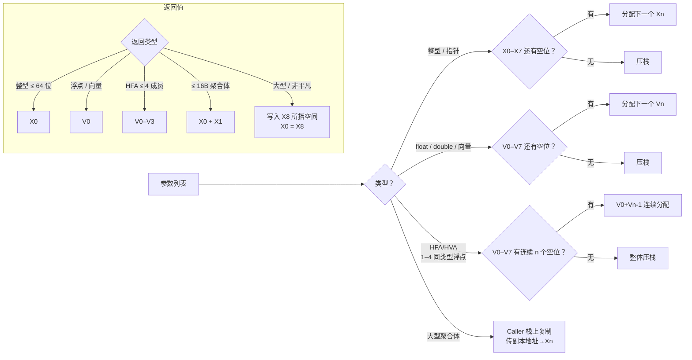

# AAPCS64 · ARM64 调用规约

> [!abstract] TL;DR
> AAPCS64 是 ARM64（AArch64）的官方过程调用标准。整型参数走 `X0–X7`，浮点/向量参数走 `V0–V7`，`X8` 专门用于传递间接返回值地址（sret）。`LR`（`X30`）保存返回地址，`SP` 须保持 16 字节对齐。HFA/HVA（同类型浮点/向量聚合体）可直接走向量寄存器。PAC/BTI 在返回地址与间接跳转上扩展了安全保护。理解 AAPCS64 是 iOS/Android ARM64 逆向的基础。

---

## 概述与定位

ARM64（AArch64）是当今移动端（iOS / Android）、服务器（AWS Graviton、Ampere）、桌面（Apple M 系列）的主流架构。与 x86-64 不同，ARM64 拥有更多通用寄存器（31 个 64 位通用寄存器）和独立的 32 个浮点/向量寄存器，因此其调用规约能把更多参数留在寄存器中，减少内存往返。

**AAPCS64**（Procedure Call Standard for the ARM 64-bit Architecture，IHI0055）是 ARM 官方制定的标准，被以下平台直接采用或作为基础：

- **Linux / Android AArch64**：直接遵循 AAPCS64。
- **iOS / macOS（Apple Silicon）**：Apple 在 AAPCS64 基础上加入了少量扩展（红区（Red Zone）保护、PAC 强制、BTI 分支目标标识）。
- **Windows on ARM64**：微软在 AAPCS64 基础上加入了 `x18` 用于平台保留（TEB 指针），以及 `__chkstk` 栈探针约定。

本文聚焦 **AAPCS64 核心规则**，不重复 System V x64 或 Windows x64 的详细内容（见对应页面），仅在对比处指出异同。

---

## 原理与机制

### 寄存器分类总览

```
通用寄存器（整型/指针，64 位 X / 32 位 W）
─────────────────────────────────────────────
X0–X7     参数寄存器（第 1–8 个整型/指针参数）；X0 同时用于整型返回值
X8        间接返回值地址（sret 指针，Indirect Result Location Register）
X9–X15    临时寄存器（caller-saved，可自由使用）
X16–X17   平台保留（IP0/IP1，动态链接 PLT stub / veneer 用）
X18       平台保留（Windows: TEB；其他平台禁止通用使用）
X19–X28   被保存寄存器（callee-saved，跨调用保留值）
X29       帧指针 FP（Frame Pointer，callee-saved）
X30       链接寄存器 LR（Link Register，保存返回地址，caller-saved 语义但由 BL 自动写入）
SP        栈指针（调用时须 16 字节对齐）
XZR/WZR   零寄存器（读恒 0，写丢弃）

浮点/向量寄存器（128 位 Q / 64 位 D / 32 位 S / 16 位 H / 8 位 B）
─────────────────────────────────────────────
V0–V7     参数寄存器（第 1–8 个浮点/向量参数）；V0 同时用于浮点/向量返回值
V8–V15    被保存寄存器（callee-saved）——但仅低 64 位（D8–D15）被 callee 保存，高 64 位视为临时
V16–V31   临时寄存器（caller-saved）
```

### 参数传递规则

AAPCS64 参数分配按从左到右顺序进行，每个参数独立分配：

1. **整型 / 指针参数（含结构体的 INTEGER 类 eightbyte）**：
   - 依次占用 `X0–X7` 中下一个可用寄存器。
   - X 寄存器用尽后，剩余整型参数从右往左压栈（"参数区域"，在帧底部）。

2. **浮点 / 向量参数（含 HFA/HVA，见后）**：
   - 依次占用 `V0–V7` 中下一个可用寄存器。
   - 浮点寄存器用尽后，剩余浮点参数也走栈。

3. **大型聚合体**（不符合 HFA/HVA 且超过 16 字节，或含不可直接分类字段）：
   - Caller 在栈上复制一份，并将该副本的地址作为整型参数传入（占用一个 X 寄存器）。

4. **可变参数（varargs）**：
   - 固定参数部分按正常规则分配。
   - 可变参数**全部走栈**，不使用寄存器（这与 System V x64 不同——SysV 允许可变参数进 `rax` 指示的浮点寄存器个数后再走栈）。
   - `va_start` / `va_arg` 通过栈指针偏移实现，实现更简单但略低效。

### 返回值规则

| 类型 | 寄存器 |
|------|--------|
| 整型 ≤ 64 位 | `X0` |
| 整型 128 位 | `X0`（低）+ `X1`（高） |
| 浮点 `float` | `S0`（`V0` 低 32 位） |
| 浮点 `double` | `D0`（`V0` 低 64 位） |
| `__fp16` / `_Float16` | `H0`（`V0` 低 16 位） |
| 向量（`float32x4_t` 等） | `Q0`（完整 128 位） |
| HFA（见后） | `V0`–`V3` |
| 聚合体 ≤ 16 字节（非 HFA，可按 eightbyte 分类） | `X0` + `X1` |
| 大型聚合体 / 非平凡 C++ 类型 | **隐式指针路径（走 `X8`）** |

**`X8` 的特殊地位**：AAPCS64 专门保留 `X8` 用于传递间接返回值地址（sret），而不是像 System V 那样把 sret 塞进第一个整型参数寄存器（`RDI`/`X0`）。这使得 sret 对普通参数寄存器完全透明——`X0–X7` 永远只传"真实参数"，逆向时若看到 `X8` 在函数入口被存储/使用，几乎可以断定这是结构体返回函数。

### 栈帧与对齐

- **调用时 SP 须 16 字节对齐**（AArch64 硬件强制，违反会触发对齐异常）。
- 帧布局（从下往上，SP = 栈增长方向）：
  1. 参数区域（多余参数，调用子函数时使用）
  2. 保存帧（`X29 = FP`、`X30 = LR` 存这里）
  3. 本地变量区域
  4. 临时溢出区域
- `X29`（FP）非强制保存，但调试器和 unwinder 依赖 FP 链追踪栈帧；iOS/Android 均保持开启。

---

## 结构/算法/伪代码详解

### HFA / HVA（同质浮点/向量聚合体）

**HFA（Homogeneous Floating-point Aggregate）**：

满足以下条件的结构体/联合体：
1. 所有非填充成员均为**相同的浮点类型**（`float`、`double`、`long double`、`__fp16`）。
2. 成员数量 **1 到 4 个**。

例：
```c
struct Vec3 { float x, y, z; };          // HFA：3× float → V0, V1, V2
struct Matrix2x2 { double a, b, c, d; }; // HFA：4× double → V0, V1, V2, V3
struct Bad { float x; double y; };       // 非 HFA（类型不同）
```

HFA 参数直接映射到 `V0–V7` 的连续若干寄存器，返回时同理走 `V0–V3`（最多 4 个成员）。

**HVA（Homogeneous Short-Vector Aggregate）**：同理但成员为 SIMD 向量类型（如 `float32x2_t`、`float32x4_t`）。

HFA/HVA 机制让向量数学库（矩阵、四元数、颜色结构体）在 ARM64 上几乎零开销传参——所有分量直接待在向量寄存器中，无需栈往返。

### 汇编示例：普通函数调用

```c
int add(int a, int b, int c, int d) { return a + b + c + d; }
int r = add(1, 2, 3, 4);
```

```asm
; Caller
mov  w0, #1        ; a → X0（低 32 位用 W0）
mov  w1, #2        ; b → X1
mov  w2, #3        ; c → X2
mov  w3, #4        ; d → X3
bl   add           ; BL：调用并将返回地址写入 X30（LR）
                   ; 返回值在 W0

; Callee
add:
    add  w0, w0, w1    ; a + b
    add  w0, w0, w2    ; + c
    add  w0, w0, w3    ; + d
    ret                 ; BR X30（跳回 LR）
```

### 汇编示例：大型结构体返回（X8 路径）

```c
typedef struct { long a, b, c; } BigS;  // 24 字节 > 16 → 隐式指针
BigS make_big(int x);
```

```asm
; Caller
sub  sp, sp, #32           ; 预留 BigS 空间（+ 对齐）
add  x8, sp, #0            ; X8 = sret 指针（指向预留空间）
mov  w0, #42               ; 参数 x → X0（X8 不占用参数位！）
bl   make_big
; 返回后 sp+0 即 BigS 内容，X0 = X8 的值

; Callee
make_big:
    str  x0, [x8, #0]      ; BigS.a = x（强转写入 sret 地址）
    mov  x1, #100
    str  x1, [x8, #8]      ; BigS.b = 100
    str  x1, [x8, #16]     ; BigS.c = 100
    mov  x0, x8            ; 返回 sret 指针（写 X0，部分 ABI 要求）
    ret
```

注意 `X8` 不与 `X0–X7` 竞争——即使函数有 8 个整型参数，sret 依然走 `X8`，参数寄存器不受影响。

### callee-saved 寄存器的 prologue / epilogue

```asm
; 典型函数入口（需要使用 X19 的情况）
my_func:
    stp  x29, x30, [sp, #-16]!    ; 保存 FP 和 LR，SP -= 16
    mov  x29, sp                   ; 建立帧指针链
    stp  x19, x20, [sp, #-16]!    ; 保存 callee-saved X19, X20

    ; 函数体 ...

    ldp  x19, x20, [sp], #16      ; 恢复 X19, X20
    ldp  x29, x30, [sp], #16      ; 恢复 FP, LR
    ret                             ; 跳回 LR
```

`STP`（Store Pair）/ `LDP`（Load Pair）是 ARM64 高效保存/恢复寄存器对的指令，比 x86 的 `PUSH`/`POP` 更灵活（可带预/后偏移）。

---

## 工具视角与实战

### 与 System V x64 的对比

| 特性 | System V AMD64 | AAPCS64 |
|------|---------------|---------|
| 整型参数寄存器 | 6 个（`RDI RSI RDX RCX R8 R9`） | 8 个（`X0–X7`） |
| 浮点参数寄存器 | 8 个（`XMM0–XMM7`） | 8 个（`V0–V7`） |
| sret 寄存器 | `RDI`（占用第一个参数位） | **`X8`（独立，不占参数位）** |
| 返回地址保存 | 栈（`CALL` 自动压） | `X30`（LR，寄存器） |
| 栈对齐要求 | 调用前 16 字节 | 调用时 16 字节（硬件强制） |
| varargs 可变参数 | 固定部分可走寄存器 | 可变部分强制走栈 |
| 帧指针 | 可选（`-fomit-frame-pointer`） | 可选，iOS 强制保留 |
| HFA/HVA 机制 | 无（向量按 eightbyte 分类） | 有（走专属向量寄存器） |
| callee-saved 整型 | `RBX RBP R12–R15`（6 个） | `X19–X28 X29`（11 个） |
| callee-saved 浮点 | 无（`XMM` 全 caller-saved） | `V8–V15` 低 64 位 |

### PAC / BTI 对返回地址和间接跳转的影响

**PAC（Pointer Authentication Code）** 和 **BTI（Branch Target Identification）** 是 ARMv8.3 / ARMv8.5 引入的硬件安全特性，直接改变调用规约中返回地址的处理方式：

**PAC（指针认证）**：
- 在保存 `LR` 之前，callee 执行 `PACIASP`（或 `PACIBSP`）：用 `SP` 与密钥对 `LR` 进行签名，将认证码嵌入 `LR` 高位。
- 返回前执行 `RETAA`（或 `RETAB`）：验证 `LR` 签名，若篡改则触发异常，阻止 ROP 链攻击。
- 反编译识别：函数 prologue 出现 `PACIASP` 而非裸 `STP x29, x30`，epilogue 出现 `RETAA` 而非 `RET`。

**BTI（分支目标标识）**：
- 间接跳转（`BR`、`BLR`）只能跳到以 `BTI` 指令开头的目标，否则触发异常。
- 函数入口若支持 BTI，首指令通常是 `BTI c`（callable）或 `BTI jc`（jumpable + callable）。
- 这限制了 ROP/JOP gadget 的可用集合，大幅提升利用难度。

iOS 从 A12（2018）起强制开启 PAC，Android 从 ARMv8.5 起逐步推广 BTI。详见 [[21.Asm/11 ARM.md|ARM 汇编基础]] 或 [[34.现代二进制防护机制/11.macOS与iOS防护|macOS 与 iOS 防护机制]]。

### iOS / Android 逆向中的 AAPCS64 基础应用

**定位函数参数**：
- `X0–X7`：前 8 个整型/指针参数；`X0` 对应第 1 个，以此类推。
- Objective-C 特殊规则：`X0 = self`（对象指针），`X1 = _cmd`（方法选择子 SEL），从 `X2` 起才是第一个"真实"参数。这与 `__thiscall` 的 `ECX = this` 类比，但借用了 AAPCS64 的前两个参数位。
- Swift 中：`self` 也通过 `X20`（context register）传递，是 Swift 对 AAPCS64 的扩展约定。

**识别 sret 函数**：
- 函数入口立即有 `STR x8, [sp, -N]` 或 `MOV x19, x8` → 保存 sret 指针留用。
- 函数出口 `MOV x0, x8` 或 `MOV x0, x19` → 返回 sret 指针给 caller。

**识别 HFA 函数**：
- 调用前向 `S0/D0, S1/D1, S2/D2...` 填充浮点值（非 `X0/X1/X2`）→ HFA 传参。

---

## 安全性与正确使用

### 正确使用与陷阱

**陷阱 1：X18 在 Windows ARM64 下被保留**

Apple / Linux 平台上 `X18` 是通用 callee-saved 寄存器，但 **Windows on ARM64** 把它保留给操作系统（指向 TEB，线程环境块）。跨平台代码若使用 `X18` 存临时值，在 Windows 上会造成系统状态损坏，产生难以调试的崩溃。

**陷阱 2：浮点寄存器 V8–V15 仅低 64 位被 callee-saved**

`D8–D15`（各寄存器的低 64 位）是 callee-saved，但同一寄存器的高 64 位（`Q8–Q15` 的高 128 位部分）**不保证保留**。若 callee 使用 SIMD 操作写满了 `Q8`，只需恢复 `D8`，高 64 位可丢弃——这意味着 caller 不能跨调用在 `Q8–Q15` 的高位存储值。

**陷阱 3：varargs 函数的寄存器 dump**

GCC/Clang 在 `va_start` 处会将所有 `X0–X7` 和 `V0–V7` 倾泻到栈上（"寄存器倾倒区"），以便 `va_arg` 通过统一内存接口遍历——即使调用者只传了 2 个可变参数，编译器也会在 callee 入口一口气保存 16 个寄存器，开销显著。这是 AAPCS64 比 System V 更简单但略有代价的地方。

**逆向识别总结**

- `BL`（Branch with Link）= `CALL`：返回地址存 `X30`。
- `RET` = `BR X30`：返回（不是 x86 的从栈弹返回地址）。
- `BLRAAZ`/`BLRAB`（带 PAC 验证的间接调用）和 `RETAA`（带验证的返回）→ 开启了 PAC 的 iOS 二进制。
- 函数入口 `PACIASP` + 出口 `AUTIASP` / `RETAA` → 标准 iOS PAC 保护模式。
- `X8` 在函数入口即被使用（存储或传递）→ 大概率是结构体/类返回函数（sret via X8）。

---

## AAPCS64 参数/返回寄存器分配 Mermaid



---

## 小结

- AAPCS64 为 ARM64 定义了标准调用规约：8 个整型参数寄存器（`X0–X7`）+ 8 个浮点/向量寄存器（`V0–V7`），比 x64 多 2 个整型参数位。
- `X8` 专用于 sret 隐式返回指针，不占用参数寄存器位，比 System V 的"sret 挤掉 RDI"更整洁。
- `X30`（LR）存返回地址（寄存器，不压栈），`SP` 调用时须 16 字节对齐（硬件强制）。
- HFA/HVA 机制让浮点聚合体（向量、矩阵、颜色）高效走寄存器，零拷贝传参。
- callee-saved 整型：`X19–X28`（`X29 = FP`）；浮点：`V8–V15` 的低 64 位。
- PAC/BTI 在 prologue/epilogue 和间接跳转处扩展了安全指令，是 iOS 二进制分析的必备知识。
- Objective-C 方法调用复用 `X0 = self`、`X1 = _cmd`，Swift 通过 `X20` 传 context，均是 AAPCS64 的扩展约定。

---

## 相关阅读

- [[22.调用规约/00.总览|调用规约总览]]
- [[22.调用规约/06.SystemV_AMD64调用规约.md|System V AMD64 调用规约（对比参照）]]
- [[22.调用规约/09.聚合体与返回值传递.md|聚合体与返回值传递（sret 机制详解）]]
- [[21.Asm/11 ARM.md|ARM 汇编基础]]
- [[34.现代二进制防护机制/11.macOS与iOS防护|macOS 与 iOS 防护机制（PAC/BTI）]]

> 🏠 [[22.调用规约/00.总览|调用规约总览]]
