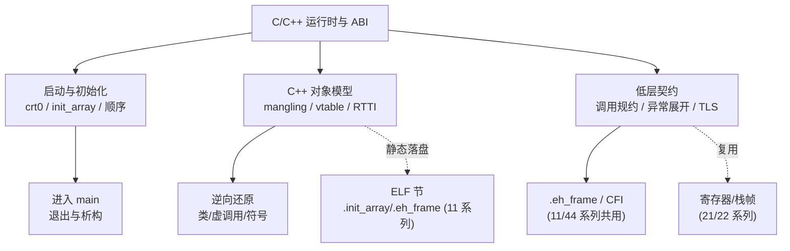

# C/C++运行时与ABI · 系列总览

> 作者原创系列，共 **22** 篇（15–22 为进阶 ABI 专题扩展）。系统拆解一段 C/C++ 程序"**从二进制装入到 `main` 再到退出**"全过程所依赖的 **运行时契约（ABI）**：从 **程序启动 `crt0` 链**、**`.init_array` 与静态初始化顺序**、**Itanium C++ ABI 与 name mangling**，到 **对象/虚表/多重虚继承内存布局**、**RTTI**、**异常处理与栈展开 ABI**、**`.eh_frame`/DWARF CFI**，再落到 **System V AMD64 调用规约细节**、**TLS 线程局部存储** 与 **C 运行时库启动全景实战**。基准平台 **Linux x86-64 + System V AMD64 + Itanium C++ ABI（GCC/Clang/glibc）**，涉及 Windows x64/MSVC 处显式对照。ABI 是编译器、链接器、加载器、调试器共同遵守的"看不见的合同"——本系列与 [[11.ELF文件详解/00.ELF文件详解总览|ELF 文件详解]]（尤其 `.init_array`/`.eh_frame`/`.gcc_except_table` 节）、[[14.动态链接与加载器详解/00.动态链接与加载器总览|动态链接与加载器]]、[[21.Asm/00 总览|汇编与架构]]、[[22.调用规约/00.总览|调用规约]]、[[33.二进制漏洞与利用基础/00.二进制漏洞与利用基础总览|二进制漏洞]]、[[44.调试器原理与实战/07.栈回溯unwind|栈回溯]] 深度互补。

## 一、启动与初始化

| # | 章节 | 说明 |
| --- | --- | --- |
| 01 | [[01.运行时与ABI概览]] | 什么是 ABI/运行时、psABI 与语言 ABI、为何逆向必须懂 ABI |
| 02 | [[02.程序启动与crt0]] | `_start`→`__libc_start_main`→`main`→`exit`、crt1/crti/crtn |
| 03 | [[03.静态初始化与init_array]] | `.init`/`.init_array`/`.ctors`、`constructor` 属性与优先级 |
| 04 | [[04.C++全局对象构造与析构顺序]] | static init order fiasco、`__cxa_atexit`、magic static 守卫 |

## 二、C++ 对象模型与 ABI

| # | 章节 | 说明 |
| --- | --- | --- |
| 05 | [[05.Itanium C++ ABI与name mangling]] | `_Z` 编码规则、替换、`c++filt`/`__cxa_demangle`、逆向还原符号 |
| 06 | [[06.对象内存布局与this指针]] | 成员排布/对齐/padding、`sizeof`/`alignof`、EBO、标准布局 |
| 07 | [[07.虚函数表vtable与虚调用]] | `vptr`、vtable 结构（offset-to-top/typeinfo/槽）、虚分派逆向 |
| 08 | [[08.多重继承与虚继承布局]] | 多 vptr、`this` 调整 thunk、VTT、construction vtable、vbase |
| 09 | [[09.RTTI与dynamic_cast]] | `type_info`、`__class_type_info` 家族、`__dynamic_cast`、`typeid` |

## 三、异常与栈展开

| # | 章节 | 说明 |
| --- | --- | --- |
| 10 | [[10.异常处理ABI与栈展开]] | 两阶段展开、`__cxa_throw`、personality、landing pad、LSDA |
| 11 | [[11.eh_frame与DWARF_CFI]] | CIE/FDE、CFA、寄存器规则、EH 与调试器共用的展开表 |

## 四、调用规约与线程存储

| # | 章节 | 说明 |
| --- | --- | --- |
| 12 | [[12.参数传递与调用规约细节]] | SysV AMD64 寄存器/聚合体分类/红区/varargs、Win64 对照 |
| 13 | [[13.TLS线程局部存储]] | 四种 TLS 模型、`.tdata`/`.tbss`、`__tls_get_addr`/DTV/TCB、FS base |

## 五、运行时库与实战

| # | 章节 | 说明 |
| --- | --- | --- |
| 14 | [[14.C运行时库与启动全景实战]] | glibc/musl/newlib、静态 vs 动态、`-nostartfiles`、trace 一次启动 |

## 六、进阶 ABI 专题（扩展）

| # | 章节 | 说明 |
| --- | --- | --- |
| 15 | [[15.Windows_x64_SEH与Unwind_ABI]] | `.pdata`/`.xdata`、UNWIND_INFO、两阶段分发、SEH vs C++ EH、与 DWARF CFI 对比 |
| 16 | [[16.C++协程ABI与协程帧布局]] | 协程帧布局、resume/destroy 指针、promise、状态机、HALO、Clang vs MSVC |
| 17 | [[17.Sanitizer运行时ABI]] | ASan shadow memory、redzone、interceptor、UBSan/TSan/MSan、逆向识别插桩 |
| 18 | [[18.std_function与类型擦除ABI]] | 类型擦除、SBO、invoker/manager、三家 STL 布局、逆向还原 callable |
| 19 | [[19.LTO与内联对ABI边界的影响]] | ThinLTO vs FullLTO、internalize、devirtualization、函数边界消除 |
| 20 | [[20.栈保护运行时Canary与CET与SafeStack]] | canary、CET shadow stack/IBT、SafeStack、ARM PAC、逆向识别 |
| 21 | [[21.C++20模块对ABI的影响]] | BMI/CMI、模块 mangling、ODR、三家格式、header unit |
| 22 | [[22.Rust与Swift与C++ABI互操作]] | Rust/Swift mangling、existential container、witness table、swiftcall、混合二进制逆向 |

## C/C++ 运行时与 ABI 的三大支柱

> 一句话：ABI 是编译器与运行时、链接器、加载器、调试器之间"**看不见的合同**"——它规定了程序怎么启动（`crt0`→`main`）、全局对象何时构造（`.init_array`）、C++ 名字怎么编码（mangling）、对象和虚表怎么排布、异常怎么展开（`.eh_frame`/LSDA）、参数怎么传（调用规约）、线程变量放哪（TLS）。读懂这套合同，你才能在反汇编里认出"这是个虚调用""这里在做 `this` 调整""这段是异常 landing pad"——逆向 C++ 的底气就来自这里。
