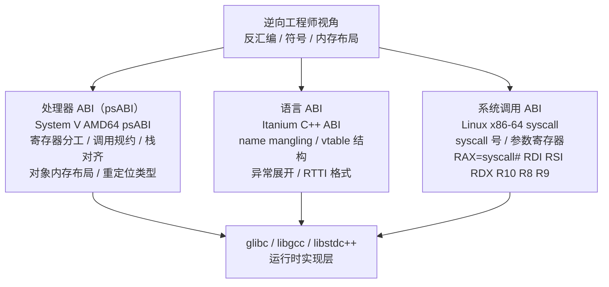
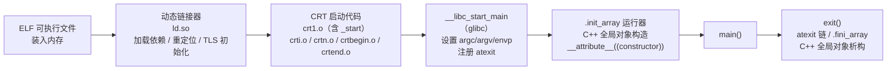

# 运行时与ABI（01）· 运行时与ABI概览

## 概述与定位

> [!abstract] TL;DR
> **ABI（Application Binary Interface）是编译器、链接器、加载器、操作系统之间"看不见的合同"**，规定了二进制层面的所有约定：寄存器用途、参数传递、对象内存布局、符号名编码规则、异常展开协议……**运行时（runtime）**是这份合同的执行者——从程序被加载那一刻起，运行时代码就在替你处理 `main` 之前（和之后）的一切。作为逆向工程师，不懂 ABI 就相当于没有图纸在看机器——你能看到指令，却看不懂它们在遵循什么契约。

ABI 与 API（Application Programming Interface）是两个层次的契约：

| 维度 | API（源码级契约） | ABI（二进制级契约） |
|---|---|---|
| 作用层 | 头文件、函数签名、语义 | 机器码、内存布局、寄存器约定 |
| 破坏代价 | 重新编译即可修复 | 无需重新编译就已损坏，旧的 `.so` 直接崩溃 |
| 检测时机 | 编译时（类型不匹配） | 运行时（崩溃、数据损坏、符号解析失败） |
| 典型示例 | `int foo(int a)` 改名为 `int bar(int a)` | `int foo(int a)` 改成 `int foo(int a, int b)`（调用者没重编） |

本章是系列的**地图**——先建立 ABI 三层模型与运行时概念，为后续 13 章的深度讲解打好框架。基准平台：**Linux x86-64 + System V AMD64 psABI + Itanium C++ ABI（GCC/Clang/glibc）**；涉及 Windows x64 / MSVC 差异处显式标出。

---

## 原理与机制

### ABI 三层模型

ABI 并不是单一规范，而是分层叠加的三套契约：



#### 第一层：处理器 ABI（psABI）

处理器 ABI 是最底层的约定，由操作系统与处理器厂商共同制定。Linux x86-64 遵循 **System V AMD64 psABI**，核心条款：

- **整数参数寄存器**：`RDI RSI RDX RCX R8 R9`（前六个整型/指针参数），多余参数压栈（右到左）
- **返回值**：整型/指针用 `RAX`（64位）/`RDX:RAX`（128位）；浮点用 `XMM0`/`XMM1`
- **callee-saved 寄存器**：`RBX RBP R12 R13 R14 R15`（被调函数必须保存/还原）
- **栈对齐**：调用 `call` 指令前 `RSP` 必须对齐到 **16 字节**（`call` 压返回地址后变 8 字节对齐，被调函数序言 `push rbp` 再对齐到 16）
- **红区（red zone）**：`RSP` 以下 **128 字节**供 leaf 函数临时使用，无需移动 `RSP`
- **varargs 约定**：`RAX`（即 `AL`）存放使用的向量寄存器个数，供 `va_start` 读取

**Windows x64 对照**：参数寄存器换成 `RCX RDX R8 R9`，有 **32 字节 shadow space**（调用者在栈上为被调函数预留），**无红区**，callee-saved 寄存器集合不同（包含 `XMM6–XMM15`）。详见 [[22.调用规约/00.总览.md]]。

#### 第二层：语言 ABI（Itanium C++ ABI）

C 语言 ABI 非常稳定——只要平台 psABI 不变，C 函数调用的二进制接口就不会变。但 C++ 带来了 psABI 无法覆盖的需求：

- **Name mangling**：`void ns::Cls::method(int)` 编译后变成符号 `_ZN2ns3Cls6methodEi`，让链接器区分重载函数
- **虚函数表（vtable）**：含虚函数的对象起始处放 `vptr`，指向类的 vtable；vtable 包含 `[offset-to-top][typeinfo*][vfunc0][vfunc1]…`
- **异常处理**：`throw`/`catch` 需要两阶段展开协议（Phase 1 搜索 + Phase 2 清理），由 `_Unwind_RaiseException` + personality function 实现
- **RTTI**：`std::type_info` 及其派生层次，供 `dynamic_cast`、`typeid` 使用
- **`this` 指针约定**：作为隐藏首参走 `RDI`

**Itanium C++ ABI** 是 GCC、Clang（Linux/macOS）的标准实现。**MSVC** 使用自己的 C++ ABI（vtable 布局、mangling、异常格式均不同），与 Itanium 不兼容。

#### 第三层：系统调用 ABI

系统调用有独立的寄存器约定，与函数调用规约不同：

```
Linux x86-64 syscall 约定：
  RAX = syscall 号
  RDI RSI RDX R10 R8 R9 = 参数（注意第 4 个是 R10 而非 RCX）
  返回值在 RAX（负值表示错误，-errno）
  RCX、R11 被 syscall 指令破坏（存 RIP 和 RFLAGS）
```

逆向时看到 `syscall` 指令前先查 `RAX` 的值，即可知道调用的是哪个内核函数。

---

### 什么是"运行时"

"运行时（runtime）"在 C/C++ 语境下指：**程序从被加载到进程空间、到 `main` 执行完毕退出的全过程中，语言/平台提供的基础设施代码**。它不是单一的 `.so`，而是多层组件：



各层职责：

| 层次 | 主要组件 | 职责 |
|---|---|---|
| CRT 启动代码 | `crt1.o`（`Scrt1.o`），`crti.o`，`crtn.o` | 提供 `_start` 入口，设置栈，调 `__libc_start_main` |
| glibc 运行时 | `libc.so.6`（`__libc_start_main`） | 初始化 C 运行时，运行 `.init_array`，调 `main`，处理退出 |
| GCC 运行时 | `libgcc_s.so.1`（`libgcc.a`） | 软件浮点、整型溢出、展开辅助（`_Unwind_*`）、`__divdi3` 等 |
| C++ 支持库 | `libsupc++.a` / `libstdc++.so.6` | mangling（`__cxa_demangle`）、异常（`__cxa_throw`/`__cxa_catch`）、RTTI、全局构造守卫（`__cxa_guard_*`）、`operator new/delete` |
| 语言标准库 | `libstdc++` / `libc++` | STL、iostream、`<algorithm>`…（ABI 敏感部分：`std::string`、`std::list` 布局） |

> [!note] CRT 链接顺序
> 静态链接时链接器按以下顺序合并启动代码：
> `crt1.o  crti.o  crtbegin.o  [用户目标文件]  crtend.o  crtn.o`
> `crti.o` 提供 `_init` 函数头（prolog），`crtn.o` 提供 `_init`/`_fini` 的尾（epilog）。

---

## 结构/分层详解

### ABI 稳定性与兼容

ABI 稳定性是二进制生态的基础。C ABI 极为稳定——Linux 上几十年前编译的 C 库通常今天仍可运行。但 C++ ABI 历史上经历过多次破坏性变更：

#### 典型案例：GCC `std::string` 的 COW→SSO 变迁

```
GCC < 5（_GLIBCXX_USE_CXX11_ABI=0）:
  std::string 内部结构（简化）:
    struct _Rep {
      size_t _M_length;
      size_t _M_capacity;
      int    _M_refcount;       // COW：引用计数
      char   _M_refdata[1];     // 实际字符
    };
    char* _M_p;                 // 指向 _Rep::_M_refdata

GCC >= 5（_GLIBCXX_USE_CXX11_ABI=1，默认）:
  std::string 内部结构（简化）:
    struct {
      char*  _M_p;              // 指向动态缓冲区，或 _M_local_buf
      size_t _M_string_length;
      union {
        char   _M_local_buf[16]; // SSO：小字符串直接存这里
        size_t _M_allocated_capacity;
      };
    };
```

两种 ABI 的 `std::string` 对象大小、布局、语义完全不同——混用必然崩溃。GCC 5 引入 `_GLIBCXX_USE_CXX11_ABI` 宏来区分，同一进程内不允许两种布局共存。

#### 符号版本（Symbol Versioning）

为了在同一 `libstdc++.so` 中同时提供新旧 ABI，glibc 使用**符号版本（symbol versioning）**：

```
# readelf -Ws /usr/lib/x86_64-linux-gnu/libstdc++.so.6 | grep "basic_string"（示意）
  ...  _ZNSt7__cxx1112basic_stringIcSt11char_traitsIcESaIcEEC1Ev@@GLIBCXX_3.4.21
  ...  _ZNSs4_Rep9_S_createEmmRKSaIcE@@GLIBCXX_3.4
```

> [!warning] 示例输出为示意
> 以上输出为代表性示例，地址与偏移为说明用途。

`@@GLIBCXX_3.4.21` 表示该符号绑定到版本 `GLIBCXX_3.4.21`，链接器在解析时会做版本匹配，确保二进制使用正确的符号版本。

#### ABI 兼容法则

| 操作 | C ABI 安全？ | C++ ABI 安全？ |
|---|---|---|
| 在类末尾添加非虚成员函数 | ✓ | ✓（不改布局） |
| 在类中插入新数据成员 | ✗（`sizeof` 变了） | ✗ |
| 在虚函数表中插入新虚函数（非末尾） | — | ✗（vptr 槽位移） |
| 在末尾追加虚函数 | — | ✓（旧代码不依赖新槽） |
| 改变函数参数类型（即使语义等价） | ✗（mangling 变了） | ✗ |
| 换编译器但保持同一 psABI | ✓ | 取决于是否都实现 Itanium ABI |

### 基准平台声明

本系列所有分析以下列平台为基准，其他平台对照时显式标出：

```
OS:       Linux（kernel ≥ 4.0）
架构:     x86-64（AMD64）
psABI:    System V AMD64 psABI（版本 1.0）
C++ ABI:  Itanium C++ ABI（GCC/Clang 共同实现）
libc:     glibc（≥ 2.17）
编译器:   GCC ≥ 10 / Clang ≥ 12
```

---

## 逆向视角

### 从反汇编中读出 ABI 痕迹

学会在汇编里认出 ABI 约定，是逆向 C/C++ 二进制最核心的技能。以下三个场景是最高频的 ABI 印记：

#### 场景一：识别 System V 函数调用

```nasm
; Intel 语法，x86-64
; 逆向场景：看到这段代码，能推断出调用参数
mov     rdi, rbx          ; 第 1 参数（对象指针，疑似 this）
mov     esi, 0x10         ; 第 2 参数（整型，值 16）
mov     rdx, [rsp+8]      ; 第 3 参数（从栈读的指针）
call    _ZN3Foo6insertEiPv ; 调用 Foo::insert(int, void*)
; 返回值在 RAX
```

看到 `RDI/RSI/RDX` 依次赋值后 `call`，立刻知道这是 **SysV 调用**，参数按寄存器顺序读出来。`_ZN3Foo6insertEiPv` 经 `c++filt` 还原：

```bash
$ c++filt _ZN3Foo6insertEiPv
Foo::insert(int, void*)
```

#### 场景二：识别虚函数调用（virtual dispatch）

```nasm
; Intel 语法，x86-64
mov     rax, [rdi]        ; rax = *this = vptr（vptr 在对象偏移 0）
call    qword ptr [rax+0x18] ; 调用 vtable 第 3 个虚函数（偏移 0x18 = 3×8）
```

看到 `mov rax, [rdi]` 后紧跟 `call [rax+N]`，**这是虚调用的指纹**：先读 `vptr`，再通过固定偏移跳到具体虚函数。`N/8` 即该虚函数在 vtable 中的槽号（从 0 开始，不含 `offset-to-top` 和 `typeinfo` 两个前缀槽）。

#### 场景三：识别 C++ mangled 符号

```bash
# nm 输出（示意）
$ nm -D libfoo.so | grep " T " | head -5
0000000000012340 T _ZN3Bar4initEv
0000000000012380 T _ZN3Bar6renderEff
00000000000123c0 T _ZNK3Bar8toStringEv   # K = const 成员函数
0000000000012400 T _ZN3Bar10setVisibleEb  # b = bool
0000000000012440 T _ZNSt6vectorI3BarSaIS0_EE9push_backERKS0_
```

> [!warning] 示例输出为示意

最后一行还原后是 `std::vector<Bar, std::allocator<Bar>>::push_back(Bar const&)`——只要认识 mangling 规则，即使没有调试符号也能还原类名和函数签名。详见第 05 章 [[05.Itanium C++ ABI与name mangling]]。

---

## 安全性与正确使用

### ABI 兼容陷阱与排错

#### 陷阱一：混用不同 ABI 版本的 C++ 库

**症状**：程序在链接或加载时正常，运行到某个 `std::string` 操作时崩溃，或 `dynamic_cast` 返回 `nullptr`（明明类型正确）。

**根因**：同一进程中部分翻译单元用 `_GLIBCXX_USE_CXX11_ABI=0` 编译，另一部分用 `=1` 编译，导致 `std::string`/`std::list` 等类型布局不一致。

**排查**：

```bash
# 检查目标文件的 ABI 版本宏
strings libfoo.so | grep -E 'cxx11|GLIBCXX'
nm libfoo.so | c++filt | grep 'basic_string'
# 新 ABI 下 std::string 符号含 "__cxx11"
# 旧 ABI 下含 "Ss"（std::basic_string<char>的替换缩写）
```

#### 陷阱二：换编译器版本导致类布局变化

C++ 标准允许编译器在同一 psABI 内自由调整类的内存布局（如 padding、bitfield 实现），只要遵守标准布局规则即可。切记：**即使 psABI 相同，C++ 类布局也可能因编译器版本不同而变化**。

**安全做法**：
- 跨模块边界使用 `extern "C"` 函数（不 mangle，无 C++ ABI 依赖）
- 或使用 COM/接口风格的纯虚基类（vtable 布局相对稳定）
- 或通过 `.proto`/`.json` 等序列化协议传递数据（彻底绕开二进制布局）

#### 陷阱三：`noexcept` 与栈展开不一致

若一个函数声明为 `noexcept` 但实际抛出异常，ABI 保证 `std::terminate()` 被调用——但**触发前可能已在不该运行清理代码的栈帧中运行了部分析构**，造成状态损坏。逆向时若看到某个函数既有 `noexcept` 标记又有异常相关的 `.eh_frame` 条目，往往是内联、优化或 ABI 不一致的信号。

#### 陷阱四：`-nostdlib` 裸机代码缺少 CRT 初始化

嵌入式/内核/固件代码常用 `-nostdlib`/`-nostartfiles`，此时：
- `argc`/`argv`/`environ` 未初始化（或由平台特定方式设置）
- `.init_array` 未被运行（C++ 全局构造**不会自动发生**）
- `atexit`/`__cxa_atexit` 未注册析构

逆向此类二进制时，要特别注意"看起来是全局对象但实际未被构造"的情况——不要按 hosted 程序的逻辑分析初始化顺序。

---

## 小结

本章建立了三个核心概念框架：

1. **ABI ≠ API**：API 是源码合同（编译时检查），ABI 是二进制合同（运行时破坏）。理解这一区别是读懂链接错误、运行时崩溃和 ABI 不兼容问题的前提。

2. **ABI 三层模型**：psABI（处理器/OS 层，规定寄存器和栈）、语言 ABI（C++ 层，规定 mangling/vtable/异常/RTTI）、系统调用 ABI（内核接口）。三层分工明确，逆向分析时按层定位。

3. **运行时是 ABI 的执行者**：`_start`→`__libc_start_main`→`.init_array`→`main`→`exit`→`.fini_array` 这条启动链，每一步都在履行 ABI 约定。后续各章将逐层深入。

> **给逆向工程师的一句话**：你看到的每一条 `call`、每一个 `[rdi]` 解引用、每一个 `_Z` 开头的符号，背后都有一条 ABI 条款在支撑——读懂条款，就读懂了二进制。

### 本系列地图


---

## 相关阅读

- [[11.ELF文件详解/00.ELF文件详解总览.md]] — ELF 文件结构全景，本系列运行时分析的底层载体
- [[11.ELF文件详解/43.init_array节.md]] — `.init_array` 节的字节布局与链接器视角
- [[11.ELF文件详解/41.init节.md]] — `.init` 节与 `_init` 函数
- [[11.ELF文件详解/46.eh_frame节.md]] — `.eh_frame` 节的 CIE/FDE 结构（本系列第 11 章的 ELF 互补）
- [[11.ELF文件详解/17.got节.md]] — GOT 机制，动态链接与 ABI 的交汇点
- [[21.Asm/00 总览.md]] — 汇编与架构基础，读懂 ABI 汇编示例的前提
- [[22.调用规约/00.总览.md]] — 调用规约系列，与本系列第 12 章深度互补
- [[14.动态链接与加载器详解/00.动态链接与加载器总览.md]] — 动态链接器视角，补充本系列加载/初始化阶段
- [[14.动态链接与加载器详解/12.TLS的实现.md]] — TLS 链接器/加载器实现（与本系列第 13 章形成链接器-ABI 双视角）
- [[44.调试器原理与实战/07.栈回溯unwind.md]] — 调试器如何利用 `.eh_frame` 做栈回溯

---

🏠 [[00.C_C++运行时与ABI总览]] ｜ 下一篇 [[02.程序启动与crt0]] ➡️
