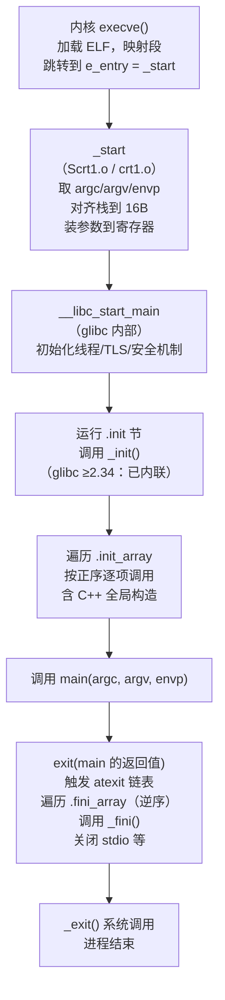

# 运行时与ABI（02）· 程序启动与crt0

## 概述与定位

> [!abstract] TL;DR
> 一个 ELF 可执行文件真正的入口不是 `main`，而是 `_start`。内核把控制权交给 `_start` 之后，运行时启动代码（CRT, C Runtime）负责搭建 `main` 所需的一切环境：解读栈上的 `argc/argv/envp`、对齐栈、初始化 C 库，调用 `__libc_start_main`，再依次运行 `.init`、`.init_array`、`main`，最后 `exit()` 触发 `.fini_array`/`.fini` 与 `atexit` 钩子。搞清这条链，逆向时就能把"看起来是乱码的启动函数"一眼还原回调用序列。

### 什么是 crt0？

"crt0"（C runtime zero）是 C 运行时启动文件的统称，由一组小目标文件（`crt1.o`/`Scrt1.o`、`crti.o`、`crtn.o`）与 GCC/Clang 自带的 `crtbegin.o`/`crtend.o` 组成。它们在最终链接时被链接器自动插入，提供从"内核交出控制权"到"进入 `main`"所需的全部胶水代码。

**为什么逆向必须懂这条链？**

- 调试器断在 `main` 之前时，看到的往往是 `_start` 或 `__libc_start_main` 的内部；不懂启动链就看不懂。
- Stripped binary 删除符号后，`_start` 的特征指令序列（`xor %ebp,%ebp`、连续的 `mov`/`lea` 装参数、尾部 `call __libc_start_main`）是识别入口的关键。
- 自定义入口（`-e`）、`-nostartfiles`、嵌入式 freestanding 程序会绕过部分甚至全部 crt，理解默认行为才能识别"什么被跳过了"。

与 ELF 节的关系：本篇讲**运行时如何使用** `.init`/`.init_array`/`.fini`/`.fini_array`；节的字节布局请看 [[11.ELF文件详解/41.init节.md]] 与 [[11.ELF文件详解/43.init_array节.md]]。

---

## 原理与机制

### 完整启动链（glibc 动态可执行）



> **glibc 版本差异**：glibc **< 2.34** 在 `Scrt1.o` 中包含 `__libc_csu_init` 和 `__libc_csu_fini` 两个中间函数，分别负责遍历 `.init_array` 和 `.fini_array`；glibc **≥ 2.34** 将这两个函数的逻辑**内联进 `__libc_start_main`** 自身，`__libc_csu_init`/`__libc_csu_fini` 不再作为独立符号存在。逆向旧版二进制时可能看到它们，新版则看不到。

### `__libc_start_main` 签名（glibc < 2.34 典型形式）

```c
/* 源码级伪代码，基于 glibc 源码结构还原，非可编译版本 */
int __libc_start_main(
    int  (*main)(int, char **, char **),  /* main 函数指针      */
    int    argc,                           /* 命令行参数个数     */
    char **argv,                           /* 参数向量           */
    void (*init)(int, char **, char **),  /* __libc_csu_init    */
    void (*fini)(void),                   /* __libc_csu_fini    */
    void (*rtld_fini)(void),              /* 动态链接器析构钩子 */
    void  *stack_end                       /* 栈顶（辅助向量后） */
);
```

glibc ≥ 2.34 后，`init`/`fini` 参数被移除（或忽略），`.init_array` 由 `__libc_start_main` 直接访问。

### 退出路径与 atexit

`exit()` 的完整退出序列：

1. 按 LIFO 顺序调用所有 `atexit()`/`on_exit()` 注册的函数。
2. 冲刷并关闭所有 stdio 流。
3. 按**逆序**遍历 `.fini_array`，调用每个析构函数指针。
4. 调用 `_fini()`（`.fini` 节，由 `crti.o`+`crtn.o` 封装）。
5. 调用 `_exit()` 系统调用，进程真正终止。

> C++ 全局对象的析构经 `__cxa_atexit(dtor, obj, &__dso_handle)` 注册，在第 1 步中与用户 `atexit` 混合按 LIFO 顺序触发。详见 [[23.C_C++运行时与ABI/04.C++全局对象构造与析构顺序]]。

---

## 结构/汇编详解

### 进程入口栈布局

内核在 `execve()` 完成后，把以下数据压到用户态初始栈（**从低到高地址**），`rsp` 指向栈顶（即 `argc` 所在位置）：

```
高地址
  ┌──────────────────────────────────────────┐
  │  字符串区（argv/envp 的实际内容）         │
  │  （变长，内核随机化放置）                 │
  ├──────────────────────────────────────────┤
  │  NULL（辅助向量结束标记）                 │  AT_NULL = 0
  ├──────────────────────────────────────────┤
  │  auxv[n-1].a_type / auxv[n-1].a_val      │  辅助向量（auxv）
  │  …                                       │
  │  auxv[0].a_type  / auxv[0].a_val         │
  ├──────────────────────────────────────────┤
  │  NULL（envp 结束标记）                    │
  ├──────────────────────────────────────────┤
  │  envp[m-1]（指向 "KEY=VALUE" 字符串）     │
  │  …                                       │
  │  envp[0]                                 │
  ├──────────────────────────────────────────┤
  │  NULL（argv 结束标记）                    │
  ├──────────────────────────────────────────┤
  │  argv[argc-1]（指向参数字符串）           │
  │  …                                       │
  │  argv[0]（程序路径）                      │
  ├──────────────────────────────────────────┤
  │  argc（4 或 8 字节，64 位下为 8 字节）   │  ← rsp（进程入口时）
  └──────────────────────────────────────────┘
低地址
```

| 偏移（相对 rsp） | 内容 | 类型 |
|---|---|---|
| `0` | `argc` | `long`（8 B） |
| `8` | `argv[0]` | `char *` |
| `8*(argc+1)` | `NULL`（argv 末） | — |
| `8*(argc+2)` | `envp[0]` | `char *` |
| `envp 末尾+8` | `NULL`（envp 末） | — |
| 再 +8 | `auxv[0].a_type` | `unsigned long` |

辅助向量（`AT_PHDR`/`AT_PHENT`/`AT_PHNUM`/`AT_BASE`/`AT_ENTRY`/`AT_RANDOM` 等）由内核填充，动态链接器 `ld.so` 和 `__libc_start_main` 都会读取它。

### `_start` 反汇编示意（x86-64，Intel 语法）

下面是一段典型的 `_start`，来自 PIE 可执行文件（`Scrt1.o`）：

```nasm
; ── Intel 语法，x86-64，示意地址 ──
0000000000001050 <_start>:
   1050:  xor    ebp, ebp            ; 清零 rbp：标记栈帧链表终止（最外层帧无调用者）
   1052:  mov    r9, rdx             ; r9 = rtld_fini（动态链接器传入的析构钩子）
   1055:  pop    rsi                 ; rsi = argc（从栈顶弹出）
   1056:  mov    rdx, rsp            ; rdx = argv（pop 后 rsp 指向 argv[0]）
   1059:  and    rsp, 0xfffffffffffffff0  ; 对齐栈到 16B（ABI 要求 call 前栈 16B 对齐）
   105d:  push   rax                 ; 占位，保持对齐（rax 此时为垃圾值，仅凑 16B）
   105e:  push   rsp                 ; stack_end 参数（第 7 个参数，走栈）；此时 rsp 为对齐后的当前值（传给 __libc_start_main 的 stack_end 是对齐后的当前 rsp，用于栈边界/线程栈定位，并非内核交付的原始栈顶）
   105f:  lea    r8, [rip + fini]    ; r8 = fini（__libc_csu_fini 或 0，≥2.34 后者）
   1066:  lea    rcx, [rip + init]   ; rcx = init（__libc_csu_init 或 0）
   106d:  lea    rdi, [rip + main]   ; rdi = main（第 1 个寄存器参数）
   1074:  call   __libc_start_main@plt
   1079:  hlt                        ; 不应到达此处；hlt 触发 #GP 保护
```

> [!warning] 示例输出为示意
> 以上地址为示意性占位（PIE 运行时会加 ASLR 偏移），指令顺序可能因 glibc 版本及编译器而略有不同。glibc ≥ 2.34 生成的 `Scrt1.o` 中 `init`/`fini` 传的是空指针或被内联，不再出现 `__libc_csu_init` 符号名。

逐行要点：

| 指令 | 语义 |
|---|---|
| `xor ebp, ebp` | 清零整个 `rbp`（写 32 位寄存器自动零扩展至 64 位），ABI 约定最外层帧 `rbp = 0`，调试器据此识别回溯终止 |
| `mov r9, rdx` | 内核通过 **RDX** 传入动态链接器析构钩子（`rtld_fini`）；`_start` 在使用 RDX 存放 `argv` 之前，先用 `mov r9, rdx` 把它保存到第 6 参数寄存器 **R9**（即 `__libc_start_main` 的 `rtld_fini` 参数位置） |
| `pop rsi` | `argc` 在栈顶，弹入 `rsi`；同时 `rsp += 8` 使 `rsp` 指向 `argv[0]` |
| `mov rdx, rsp` | 捕获 `argv` 指针（栈对齐之前！） |
| `and rsp, ~0xF` | 将 `rsp` 截断到 16 字节边界，满足 System V AMD64 ABI 要求（`call` 前 `rsp` ≡ 0 mod 16）|
| `push rax` / `push rsp` | 压两个 8B，使 `rsp` 再减 16B，同时把 `stack_end` 放到当前 `rsp`（第 7 个参数走栈传递） |
| `lea rdi/rcx/r8, [rip+…]` | RIP-relative 取 `main`/`init`/`fini` 地址；PIE 下必须用 RIP-relative |
| `call __libc_start_main@plt` | 跳入 glibc；若静态链接则直接 `call __libc_start_main`（无 `.plt` 间接层） |
| `hlt` | 保险指令；`__libc_start_main` 正常不返回，若真返回则此处触发保护异常 |

### crt 目标文件分工

| 文件 | 来源 | 提供内容 |
|---|---|---|
| `crt1.o` | glibc（非 PIE） | `_start` 入口；静态链接/非 PIE 用 |
| `Scrt1.o` | glibc（PIE） | `_start` 入口；PIE（`-fPIE -pie`）用；地址计算全用 RIP-relative |
| `crti.o` | glibc | `.init` 节**头**（`_init` 函数 prologue）、`.fini` 节**头**（`_fini` 函数 prologue） |
| `crtn.o` | glibc | `.init` 节**尾**（epilogue + `ret`）、`.fini` 节**尾** |
| `crtbegin.o` | GCC/Clang | 框住 `.init_array`/`.ctors` 节的开头；向 `.init_array` 注册 `__do_global_ctors_aux` |
| `crtend.o` | GCC/Clang | 框住 `.init_array`/`.ctors` 节的结尾；提供 `.init_array` 结束哨兵 |

**链接顺序**（链接器命令行从左到右）：

```
crt1.o  crti.o  crtbegin.o  [用户目标文件 & 库]  crtend.o  crtn.o
```

这条顺序不是随意的：

- `crti.o` 要在任何"塞进 `.init`/`.fini` 节"的代码之前，`crtn.o` 在最后提供 `ret`，合起来才能形成完整函数。
- `crtbegin.o` 要在用户目标文件前，`crtend.o` 在后，才能用哨兵变量划定 `.init_array` 范围。

`.init` 节的合并原理（`crti.o` + 用户插入 + `crtn.o`）：

```
[crti.o .init 头]  →  _init:  push  rbp; mov rbp,rsp
[可选的用户代码]   →          call  custom_init_fn      ; 各目标文件往 .init 里插的代码
[crtn.o .init 尾]  →          pop   rbp; ret            ; 形成完整 _init() 函数
```

> glibc ≥ 2.34：`_init()`/`_fini()` 仍然存在但几乎为空（仅 prologue + epilogue），`.init_array` 遍历已由 `__libc_start_main` 接管。

### 静态可执行 vs PIE 的差异对比

| 维度 | 动态 PIE（`-fPIE -pie`） | 静态（`-static`） |
|---|---|---|
| CRT 启动文件 | `Scrt1.o crti.o crtbegin.o … crtend.o crtn.o` | `crt1.o crti.o crtbegin.o … crtend.o crtn.o` |
| `_start` 中地址寻址 | RIP-relative（GOT/PLT 可用） | 直接绑定（链接时确定） |
| `__libc_start_main` | 动态链接到 `libc.so.6` | 静态内联进可执行文件 |
| 动态链接器 | `PT_INTERP` 指向 `ld.so`，加载前先跑 `ld.so` | 无 `PT_INTERP`，内核直接跳 `_start` |
| `rtld_fini` | 动态链接器传入析构钩子 | `rdx = 0`（无加载器） |

---

## 逆向视角 / 实战

### 用 `readelf` 定位 `e_entry`

```bash
readelf -h ./a.out | grep 'Entry point'
```

```
Entry point address:               0x1050
```

> [!warning] 示例输出为示意
> 动态 PIE 可执行文件的 `e_entry` 是相对于加载基址的虚拟地址（PIE 的加载基址由 ASLR 决定）。上面的 `0x1050` 是链接时偏移，运行时需加上 ASLR 偏移。

对于静态可执行文件，`e_entry` 是绝对虚拟地址（通常固定在 `0x401000` 附近）。

```bash
# 查看 _start 符号地址（非 stripped 时）
nm ./a.out | grep _start

# 查看是否有 PT_INTERP（判断动态 vs 静态）
readelf -l ./a.out | grep INTERP
```

### 用 GDB 从 `_start` 单步到 `main`

```bash
gdb ./a.out
(gdb) starti                       # 在第一条用户指令处停下（即 _start 入口）
(gdb) info registers rsp rbp rdi   # 查看栈指针与参数寄存器
(gdb) x/8gx $rsp                   # 看栈上 argc/argv 布局
(gdb) disas _start                 # 反汇编 _start
(gdb) break __libc_start_main      # 在 __libc_start_main 入口断
(gdb) continue
(gdb) break main                   # 再断在 main
(gdb) continue
```

> `starti` 比 `run` 更有用——它在内核把控制权交给 `_start` 的第一条指令后立即停下，让你观察原始栈布局（`argc`/`argv`/`envp`/`auxv` 全部完整）。

查看 `auxv`（辅助向量）：

```bash
(gdb) info auxv      # GDB 解析并格式化显示辅助向量
```

也可以在 `/proc/<pid>/auxv` 下查看：

```bash
cat /proc/self/auxv | xxd | head -40
```

### stripped 二进制中识别 `_start`

反汇编中没有符号时，看这几个特征：

1. **文件 `e_entry` 偏移对应的函数**：就是 `_start`。
2. `xor ebp, ebp`（几乎是 `_start` 的第一条指令）。
3. 连续的 `pop`/`mov`/`and`/`push`/`lea` 序列，最后 `call` 一个函数，紧跟 `hlt` 或 `ud2`。
4. 被 `call` 的那个函数就是 `__libc_start_main`（静态链接时直接是内联代码）。

---

## 安全性与正确使用

### 自定义入口点（`-e`）与 `-nostartfiles`

```bash
# 完全去掉 crt：自己提供 _start，但不链接任何 crt*.o
gcc -nostartfiles -o myprog myprog.c

# 去掉标准库与 crt，完全裸机风格
gcc -nostdlib -o myprog myprog.c

# 自定义入口名称（覆盖 _start）
gcc -nostartfiles -e my_entry -o myprog myprog.c
```

**裸机 `_start` 需要自己做的事：**

```c
/* 极简 freestanding _start（x86-64，示意，非可编译） */
__attribute__((naked)) void _start(void) {
    __asm__(
        "xor  %ebp, %ebp\n"       /* 清零帧指针 */
        "pop  %rdi\n"              /* rdi = argc */
        "mov  %rsp, %rsi\n"       /* rsi = argv */
        "and  $-16, %rsp\n"       /* 对齐 16B   */
        "call main\n"
        "mov  %eax, %edi\n"
        "mov  $60, %eax\n"        /* syscall: exit */
        "syscall\n"
    );
}
```

### 常见陷阱

| 陷阱 | 后果 | 解法 |
|---|---|---|
| `-nostartfiles` 后忘记栈对齐 | SSE/AVX 指令在未对齐栈上触发 `#GP`（`SIGSEGV`） | 自己的 `_start` 中必须 `and rsp, -16` |
| `-nostdlib` 但仍使用 `printf` | 链接时报"未定义引用" | 显式链接 `-lc`，或改用 `write` 系统调用 |
| 自定义 `_start` 调用 `main` 后直接 `ret` | 返回到乱码地址，程序 crash | 必须以 `exit()` 或 `syscall exit` 结束 |
| 静态链接时忘记 `crtbegin.o`/`crtend.o` | C++ 全局构造器不被调用（`.init_array` 遍历缺失） | 手动或通过 `gcc -static` 确保它们被链接 |
| 在 `__libc_csu_init` 之前访问全局 C++ 对象 | 使用未初始化对象（static init order fiasco 极端形式） | 改用 Meyers singleton；详见 [[23.C_C++运行时与ABI/04.C++全局对象构造与析构顺序]] |
| PIE 用 `crt1.o` 而非 `Scrt1.o` | `_start` 中用绝对地址寻址，PIE 加载时地址不对 | 确认工具链传递 `-fPIE -pie` 时选择正确的 crt 变体 |

### musl / newlib 的差异

- **musl**：`_start` 在 `arch/x86_64/crt_arch.h` 中用内联汇编实现，调用 `__libc_start_main`，但函数签名与 glibc 不同（只接受 `main`/`argc`/`argv`，没有 `init`/`fini` 参数）。
- **newlib**（嵌入式）：`_start` 极简，调用 `_mainCRTStartup` → `main`，没有 `.init_array` 遍历（除非 BSP 自己实现）；常需用户自行搭 `__libc_init_array`。
- **裸机/freestanding**：没有任何 crt，`_start` 完全由移植者实现；`.init_array` 遍历通常由 linker script + 手写循环完成。

---

## 小结

| 关键点 | 一句话 |
|---|---|
| `e_entry` = `_start` | 内核把控制权交给 ELF 头的 `e_entry`，不是 `main` |
| 栈布局 | `argc` 在栈顶，其后依次 `argv[]`、`envp[]`、`auxv[]` |
| `_start` 的三件事 | 清零 `rbp`、取 `argc`/`argv`、对齐栈后调 `__libc_start_main` |
| `__libc_start_main` | 跑 `.init`+`.init_array` → `main` → `exit` → `.fini_array`+`.fini` |
| crt 文件分工 | `crt1/Scrt1`（入口）、`crti/crtn`（`.init`/`.fini` 头尾）、`crtbegin/crtend`（`.init_array` 边界） |
| glibc ≥ 2.34 | `__libc_csu_init`/`__libc_csu_fini` 内联消失，不再是独立符号 |
| 自定义入口 | `-nostartfiles`/`-e` 可绕过 crt，但栈对齐、退出路径等要自己保证 |

---

## 相关阅读

- [[11.ELF文件详解/41.init节.md]] — `.init` 节的字节布局与链接器合并原理
- [[11.ELF文件详解/42.fini节.md]] — `.fini` 节与 `crti/crtn` 封装
- [[11.ELF文件详解/43.init_array节.md]] — `.init_array` 节结构与遍历顺序
- [[11.ELF文件详解/44.fini_array节.md]] — `.fini_array` 节与逆序析构
- [[14.动态链接与加载器详解/02.程序加载全景.md]] — 内核到 `ld.so` 的加载全程
- [[14.动态链接与加载器详解/16.实战观察加载全过程.md]] — strace/GDB 实操观察
- [[14.动态链接与加载器详解/11.初始化与析构顺序.md]] — 多 DSO 初始化顺序
- [[23.C_C++运行时与ABI/03.静态初始化与init_array]] — `.init_array` 与 `constructor` 属性深入
- [[23.C_C++运行时与ABI/04.C++全局对象构造与析构顺序]] — `__cxa_atexit`、magic static
- [[21.Asm/15 x86(64).md]] — x86-64 寄存器与指令参考
- [[22.调用规约/00.总览.md]] — System V AMD64 调用规约完整细节

---

⬅️ 上一篇 [[01.运行时与ABI概览]] ｜ 🏠 [[00.C_C++运行时与ABI总览]] ｜ 下一篇 [[03.静态初始化与init_array]] ➡️
