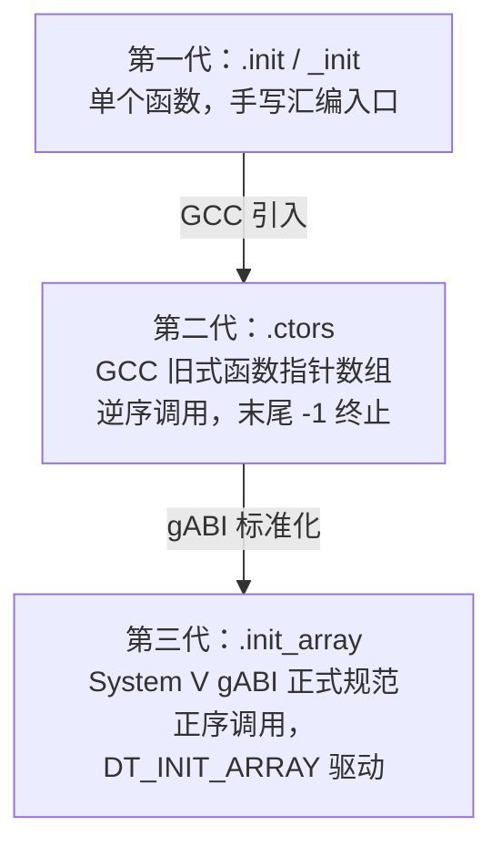
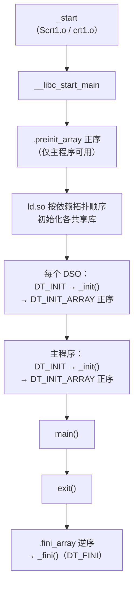

# 运行时与ABI（03）· 静态初始化与init_array

## 概述与定位

> [!abstract] TL;DR
> 程序在进入 `main` 之前，运行时需要完成**静态初始化**——调用全局对象构造函数、执行用户注册的 `constructor` 函数。这一机制历经三代演进：单函数 `.init`/`_init` → GCC 旧式 `.ctors`（逆序） → 现代 `.init_array`（正序）。理解调用链和顺序规则，是在逆向分析中定位"main 之前隐藏代码"和在安全研究中识别持久化植入的关键。

静态初始化（static initialization）是 C/C++ ABI 合同的重要组成部分：**编译器、链接器、运行时库**三方联手，确保所有具有静态存储期（static storage duration）的对象在 `main` 被调用之前处于"就绪"状态。它与上一篇（[[02.程序启动与crt0]]）形成接力——`_start` → `__libc_start_main` 的链条结束后，控制权即交给初始化子系统，然后才是 `main`。

本篇聚焦**运行时如何驱动初始化**，即"谁来调用、以什么顺序调用"。ELF 节的字节结构在 [[11.ELF文件详解/43.init_array节.md]] 已详细描述，本篇不重复——互补，不重叠。

---

## 原理与机制

### 三代初始化机制演进

静态初始化机制的演进伴随 Unix/ELF 工具链的发展，走过了三个阶段：



#### 第一代：`.init` / `_init`（单函数）

最古老的机制。链接器在 ELF 可执行文件中保留一个名为 `_init` 的函数（由 `crti.o` 提供函数头、`crtn.o` 提供尾）。`__libc_start_main` 在调用 `main` 之前会通过 `DT_INIT` 动态标签找到并调用它。这是一个**单入口点**，不支持多函数注册，扩展性差。对称的析构入口是 `_fini`（`.fini` 节，`DT_FINI`）。

> 节详解见 [[11.ELF文件详解/41.init节.md]]（`.init` 节）与 [[11.ELF文件详解/42.fini节.md]]（`.fini` 节）。

#### 第二代：`.ctors`（GCC 旧式，已废弃）

GCC 引入 `.ctors` 节作为私有扩展，解决了多函数注册的需求：

- 节内容：**函数指针数组**，32 位下每项 4 字节，64 位下 8 字节
- 末尾标志：`-1`（即 `0xFFFFFFFF…`）作为终止符（类比 C 字符串的 `\0`）
- **调用顺序：逆序**（从数组末尾向前遍历，最后写入的函数最先被调用）
- 对称的析构：`.dtors` 节，同样逆序

`.ctors` 由 `crtbegin.o`/`crtend.o` 的初始化代码遍历调用。它是 GCC 私有约定，未进入 System V gABI，不同工具链之间不可移植。

#### 第三代：`.init_array`（现代标准，主流）

System V gABI 规范化的方案，自 GCC 4.7 起全面默认，取代 `.ctors`：

| 属性 | `.ctors`（旧） | `.init_array`（新） |
|---|---|---|
| 调用顺序 | **逆序** | **正序** |
| 终止标记 | `-1` | 无（由 `DT_INIT_ARRAYSZ` 指定大小） |
| 标准归属 | GCC 私有 | System V gABI |
| 节类型 | `SHT_PROGBITS` | `SHT_INIT_ARRAY` |
| 对称析构 | `.dtors` | `.fini_array` |

`.preinit_array` 是比 `.init_array` 更早执行的特殊机制，**仅主可执行文件可用**（共享库不可使用），主要供 Sanitizer（ASan/TSan/MSan）等工具在 libc 初始化之前挂钩系统调用。

### 完整调用顺序

下图展示从 `_start` 到 `main` 的完整初始化顺序（System V gABI 契约）：



顺序规则精确描述（ABI 契约）：
1. `.preinit_array` 在所有共享库初始化**之前**，正序调用（仅主程序）
2. 每个 DSO 的初始化：先 `DT_INIT`（`_init`），再 `DT_INIT_ARRAY`（正序）
3. 多个 DSO 按**依赖图拓扑顺序**：被依赖者先初始化（叶节点先于根节点）
4. 析构对称逆序：`.fini_array` 逆序 → `_fini`（`DT_FINI`）

### 谁来遍历调用

**主程序 `.init_array` 的驱动者随 glibc 版本变化**：

```
# glibc < 2.34（旧式）
_start
  └── __libc_start_main(main, argc, argv, __libc_csu_init, __libc_csu_fini, ...)
          └── __libc_csu_init() {
                  _init();                          // 调用 DT_INIT 指向的 _init
                  for (fn in __init_array_start .. __init_array_end)
                      fn(argc, argv, envp);          // 正序遍历，传三参数（glibc 扩展）
              }

# glibc >= 2.34（新式，__libc_csu_init 已删除）
_start
  └── __libc_start_main(main, argc, argv, NULL, NULL, ...)
          └── 内部直接读 DT_INIT_ARRAY / DT_INIT_ARRAYSZ 动态标签
              正序调用每个函数指针
```

**共享库 `.init_array` 的驱动者是动态链接器 `ld.so`**：加载每个共享库时，`ld.so` 在 `_dl_init`（内部函数）中读取 DSO 的 `DT_INIT_ARRAY`，按正序遍历调用，无需应用程序代码参与。这一过程在 `__libc_start_main` 被调用之前就已完成（主程序 `_start` 是由 `ld.so` 转跳进入的）。

> 动态链接器初始化顺序的完整分析见 [[14.动态链接与加载器详解/11.初始化与析构顺序.md]]。

---

## 结构与示例详解

### `__attribute__((constructor))` 与优先级

GCC/Clang 提供 `__attribute__((constructor))` 属性，将函数注册进 `.init_array`；对应析构用 `__attribute__((destructor))`。

**优先级规则（ABI 硬约束）**：

| 优先级范围 | 归属 | 说明 |
|---|---|---|
| 0 – 100 | **实现保留** | GCC/libc/Sanitizer 专用。用户使用会触发 `-Wprio-ctor-dtor` 警告（默认视为错误） |
| 101 – 65535 | 用户可用 | 数值越小越早执行（constructor 正序，destructor 逆序）；`__attribute__((constructor))` 不带优先级等效 65535 |

同优先级内多个函数之间的相对顺序**在 ABI 层面未规定**（由链接顺序决定，不可依赖）。

**最小示例（含预期输出）**：

```c
/* ctor_demo.c */
#include <stdio.h>

__attribute__((constructor(101))) void early_init(void) {
    printf("[constructor 101] early_init\n");
}

__attribute__((constructor(200))) void mid_init(void) {
    printf("[constructor 200] mid_init\n");
}

__attribute__((constructor)) void late_init(void) {
    /* 无优先级，等同于 65535，最后执行 */
    printf("[constructor 65535] late_init\n");
}

__attribute__((destructor(200))) void mid_fini(void) {
    printf("[destructor 200] mid_fini\n");
}

__attribute__((destructor)) void late_fini(void) {
    printf("[destructor 65535] late_fini\n");
}

int main(void) {
    printf("main\n");
    return 0;
}
```

预期输出（constructor 正序、destructor 逆序）：

```text
[constructor 101] early_init
[constructor 200] mid_init
[constructor 65535] late_init
main
[destructor 65535] late_fini
[destructor 200] mid_fini
```

> [!warning] 示例输出为示意
> 以上输出为 GCC x86-64 Linux 下的典型行为。使用优先级 0–100 会产生编译器警告/错误，示例中已避免使用保留范围。

若尝试使用保留优先级（如 `constructor(50)`），GCC 会输出：

```text
warning: constructor priorities from 0 to 100 are reserved for the implementation
         [-Wprio-ctor-dtor]
```

> [!warning] 示例输出为示意
> 上述诊断消息来自 GCC，Clang 的措辞略有不同，但警告含义相同。

### `.init_array` 的内存布局

`.init_array` 节本质上是一个**函数指针数组**，x86-64 下每项 8 字节（小端序）：

```text
.init_array 节内存示意（x86-64，小端）：

偏移    内容（8 字节/项）            说明
0x00    78 56 34 12 00 00 00 00    → 0x0000000012345678  early_init()
0x08    90 23 40 00 00 00 00 00    → 0x0000000000402390  mid_init()
0x10    B0 24 40 00 00 00 00 00    → 0x00000000004024B0  late_init()
```

链接器通过将带优先级的输入节（`.init_array.00101`、`.init_array.00200`、`.init_array`）按数字顺序拼接，生成最终的输出节：

```text
输出 .init_array = .init_array.00101 || .init_array.00200 || ... || .init_array（无优先级）
```

### C++ 全局对象与 `.init_array`

C++ 编译器为**每个翻译单元（TU）** 中的非局部静态对象（全局变量、`namespace` 内静态变量等）生成一个初始化包装函数，典型符号名为 `_GLOBAL__sub_I_<源文件名>`，并将其指针写入 `.init_array`。

例如，对于：

```cpp
// foo.cpp
#include <string>
std::string g_name("world");
```

编译器生成（概念性伪代码）：

```cpp
// 编译器自动生成，写入 .init_array
void _GLOBAL__sub_I_foo_cpp(void) {
    // 调用 g_name 的构造函数
    new (&g_name) std::string("world");
    // 注册析构函数，exit() 时按构造逆序调用
    __cxa_atexit([](void *p){ ((std::string*)p)->~string(); },
                 &g_name,
                 &__dso_handle);
}
```

**析构不写 `.fini_array`**——C++ 全局对象的析构通过 `__cxa_atexit(fn, arg, &__dso_handle)` 注册到 exit 链表，在 `exit()` 时按构造逆序调用，比 `.fini_array` 的简单逆序遍历更精确（构造顺序问题留给第 04 章详述：[[04.C++全局对象构造与析构顺序]]）。

---

## 实战：readelf/objdump 定位 constructor

### 查看 `.init_array` 内容

```bash
# 查看节头，确认类型和大小
readelf -S a.out | grep -A4 init_array

# 十六进制转储函数指针
readelf -x .init_array a.out

# 带符号的内容查看（更直观）
objdump -s -j .init_array a.out

# 查看动态标签（动态链接器据此驱动初始化）
readelf -d a.out | grep -E 'INIT|PREINIT'
```

```text
# 示例输出为示意
$ readelf -x .init_array a.out

Hex dump of section '.init_array':
  0x00403000 80114000 00000000 a0114000 00000000  ..@.......@.....
  0x00403010 c0114000 00000000                    ..@.....

$ objdump -s -j .init_array a.out
Contents of section .init_array:
 403000 80114000 00000000 a0114000 00000000  ..@.......@.....
 403010 c0114000 00000000                   ..@.....
```

> [!warning] 示例输出为示意
> 上述地址和内容为典型示意值，与真实编译结果因版本、优化选项而异。

**从指针值定位具体函数**：小端序读取每个 8 字节项，得到函数地址，再用 `objdump` 反汇编：

```bash
# 已知指针值 0x401180，查看该函数反汇编
objdump -d --start-address=0x401180 --stop-address=0x4011c0 a.out

# 用 nm 查看地址对应符号
nm a.out | grep 401180

# 查看 _GLOBAL__sub_I_xxx 符号（C++ 全局初始化函数）
nm a.out | grep '_GLOBAL__sub_I'
```

```text
# 示例输出为示意
$ nm a.out | grep '_GLOBAL__sub_I'
0000000000401180 t _GLOBAL__sub_I_foo.cpp
00000000004011a0 t _GLOBAL__sub_I_bar.cpp
```

> [!warning] 示例输出为示意
> `t`（小写）表示局部符号，位于文本段（`.text`），编译时带 `-g` 或不剥除符号时可见。

### GDB 中单步跟踪初始化

```bash
gdb ./a.out
(gdb) info address __init_array_start          # 查看数组起始地址
(gdb) info address __init_array_end            # 查看数组结束地址
(gdb) x/4gx &__init_array_start               # 打印前 4 个函数指针
(gdb) break early_init                         # 在 constructor 函数设断点
(gdb) run                                      # 运行，在初始化阶段断住
```

在 glibc < 2.34 的环境下，也可在 `__libc_csu_init` 设断点，直接观察 `.init_array` 遍历循环。

---

## 安全性与正确使用

### `.init_array` 的滥用：隐蔽执行分析视角

从防御/逆向分析角度，`.init_array` 是**高价值关注点**：

- **恶意代码植入**：Rootkit、植入器可将 shellcode 指针或包装函数指针写入 `.init_array`，在 `main` 之前获得执行机会，对受害程序"透明"。逆向时**务必检查 `.init_array` 所有表项**，而不是仅从 `main` 起分析。
- **反调试/反分析**：`constructor` 函数中常见反调试代码（`ptrace`/`/proc/self/status` 检测），早于 `main` 运行，调试器必须在 `_start` 之前或在初始化函数处设断才能观察。
- **动态修改 `.init_array`**：若目标缺少 Full RELRO 保护（见 [[11.ELF文件详解/17.got节.md]] §11），运行时 `.init_array` 仍可写——任意写漏洞可覆盖函数指针，达到"在正常初始化调用时触发攻击载荷"的效果。

```bash
# 检查 RELRO 状态：Full RELRO 会将 .init_array 所在段设为只读
checksec --file=a.out
readelf -l a.out | grep GNU_RELRO
```

### 构造函数中抛异常的后果

**C++ 全局对象构造函数中抛出的异常会导致 `std::terminate` 被调用**，因为此时异常处理基础设施可能尚未完全就绪，且没有可传播到的 `catch` 块（`main` 还未进入调用栈）。

```cpp
// 危险：全局对象构造抛异常
struct Dangerous {
    Dangerous() {
        throw std::runtime_error("init failed");  // 程序直接 terminate，不可捕获
    }
};
Dangerous g_obj;  // 危险！
```

ABI 约定：初始化函数签名为 `void(void)`（或 glibc 扩展的 `void(int, char**, char**)`），它没有异常规格，抛出未捕获异常直接进入终止序列。

### 跨 TU 初始化顺序问题（预告）

同一 TU 内，全局对象按**定义顺序**初始化；但**跨 TU 顺序未定义**——这是著名的 **static initialization order fiasco**。`.init_array` 层面的表现是：不同 TU 对应的 `_GLOBAL__sub_I_xxx` 在数组中的位置由链接顺序决定，用户不可依赖。完整分析和 Meyers singleton 解法见第 04 章：[[04.C++全局对象构造与析构顺序]]。

### 正确使用建议

1. **优先级范围**：用户代码永远使用 101–65535，绝不触碰 0–100（保留给实现）。
2. **避免跨 TU 依赖**：`constructor` 函数内不要依赖其他 TU 的全局变量（它们可能尚未初始化）。
3. **轻量初始化**：`constructor` 函数应尽量短小快速；避免复杂锁、网络或阻塞操作——此时主线程还未启动，错误处理极为受限。
4. **析构对称**：用 `__attribute__((destructor))` 或 `__cxa_atexit` 注册析构，不要假设 `.fini_array` 遍历顺序。

---

## 小结

| 机制 | 节 | 调用顺序 | 驱动者 | 状态 |
|---|---|---|---|---|
| 单函数入口 | `.init` / `_init` | — | `__libc_start_main`（DT_INIT） | 仍存在，已弱化 |
| GCC 旧式 | `.ctors` | **逆序**，末尾 -1 | `crtbegin.o` 代码 | 已废弃 |
| 现代标准 | `.init_array` | **正序** | glibc / `ld.so` | 主流 |
| 早于主程序 | `.preinit_array` | 正序，主程序专用 | `__libc_start_main` | 特殊场景（Sanitizer）|
| 对称析构 | `.fini_array` / `.fini` | 逆序 | `ld.so` / `exit()` | — |

`.init_array` 是现代 ELF 静态初始化的**唯一推荐机制**：正序、无终止符、gABI 标准化、由 `DT_INIT_ARRAY`/`DT_INIT_ARRAYSZ` 动态标签驱动，既支持 C++ 全局对象构造（通过 `_GLOBAL__sub_I_xxx`），也支持 C 语言的 `__attribute__((constructor))` 扩展。逆向分析时，这里是"main 之前的世界"——任何在 `main` 之前运行的代码都藏在这张表里。

---

## 相关阅读

- ELF 节字节布局：[[11.ELF文件详解/43.init_array节.md]]、[[11.ELF文件详解/45.ctors节.md]]、[[11.ELF文件详解/44.fini_array节.md]]
- 动态链接器初始化/析构顺序：[[14.动态链接与加载器详解/11.初始化与析构顺序.md]]
- C++ 全局对象构造顺序与 `__cxa_atexit`：[[04.C++全局对象构造与析构顺序]]
- GOT 与 RELRO 保护：[[11.ELF文件详解/17.got节.md]]

---

⬅️ 上一篇 [[02.程序启动与crt0]] ｜ 🏠 [[00.C_C++运行时与ABI总览]] ｜ 下一篇 [[04.C++全局对象构造与析构顺序]] ➡️
