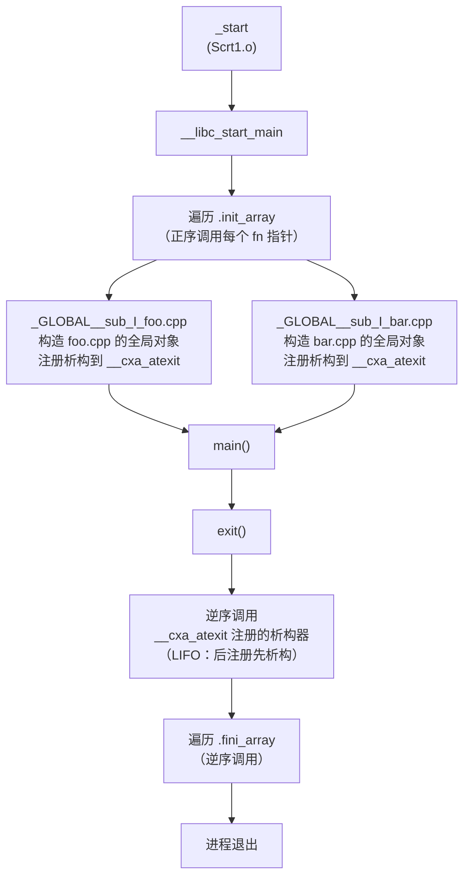

# 运行时与ABI（04）· C++全局对象构造与析构顺序

## 概述与定位

> [!abstract] TL;DR
> C++ 全局/静态对象的构造与析构受到严格的 ABI 契约约束，但同时也留有一个著名的未定义行为陷阱——**static initialization order fiasco（静态初始化顺序惨案）**。同一翻译单元（TU）内，非局部静态对象按**定义出现顺序**构造；**跨 TU 顺序则未定义（unspecified）**，这正是 fiasco 的根源。析构顺序与构造**严格相反（LIFO）**。析构注册机制是 `__cxa_atexit`，而非普通 `atexit`。C++11 起函数内静态（magic static）通过 guard 变量 + `__cxa_guard_acquire`/`__cxa_guard_release` 实现线程安全的惰性初始化，是 fiasco 的标准解法。

本篇衔接 [[03.静态初始化与init_array]]（`.init_array` 节与 `_GLOBAL__sub_I_*` 函数），向上对接第 05 篇的 name mangling，向下关联 ELF 节 [[11.ELF文件详解/43.init_array节.md]] 与动态链接器视角 [[14.动态链接与加载器详解/11.初始化与析构顺序.md]]。

---

## 原理与机制

### 构造时间线

全局/静态对象（非局部静态存储期对象）的构造发生在 `main` 被调用之前，由 `.init_array` 中的函数驱动（详见 [[03.静态初始化与init_array]]）。编译器为每个翻译单元生成一个 `_GLOBAL__sub_I_<file>` 函数，该函数依次调用所有本 TU 的全局对象构造函数，并向 `__cxa_atexit` 注册对应的析构器。



### 跨 TU 顺序问题（static initialization order fiasco）

**同一 TU 内**，非局部静态对象按**定义出现顺序**构造，这是 C++ 标准（[basic.start.static]）保证的。

**跨 TU 时**，`.init_array` 中各 TU 对应条目的执行顺序取决于链接顺序，**标准不对此作保证**（unspecified）。两个来自不同 TU 的全局对象，若存在初始化依赖，则极易产生"访问尚未构造的对象"的 undefined behavior。

**析构顺序**与构造顺序**严格相反（LIFO）**：后构造的对象先析构，这是通过 `__cxa_atexit` 的后进先出注册机制实现的。

---

## 源码与汇编详解

### fiasco 最小例子

```cpp
// logger.h
struct Logger {
    Logger();
    void log(const char* msg);
};
extern Logger g_logger;   // 定义在 logger.cpp

// logger.cpp
#include "logger.h"
#include <cstdio>
Logger g_logger;          // TU-A 的全局对象

Logger::Logger() { puts("[Logger] constructed"); }
void Logger::log(const char* msg) { puts(msg); }

// app.cpp — TU-B，依赖 g_logger 已经被构造
#include "logger.h"
struct App {
    App() { g_logger.log("App constructed"); }  // 若 g_logger 未构造 → UB！
};
App g_app;                // TU-B 的全局对象，可能先于 g_logger 构造
```

若链接器恰好先处理 `app.o` 再处理 `logger.o`，则 `g_app` 在 `g_logger` 构造之前执行，`g_logger.log(...)` 访问的是未初始化内存——这就是 **static initialization order fiasco**。

### `_GLOBAL__sub_I_*` 函数结构（伪代码）

编译器为每个 TU 生成如下形式的初始化驱动函数：

```cpp
// 编译器为 logger.cpp 生成（伪代码，实际在 .init_array 中注册）
void _GLOBAL__sub_I_logger_cpp() {
    // 1. 调用 g_logger 的构造函数
    Logger::Logger(&g_logger);

    // 2. 注册析构函数到 __cxa_atexit
    __cxa_atexit(
        [](void* obj) { static_cast<Logger*>(obj)->~Logger(); },
        &g_logger,
        &__dso_handle   // 标识本 DSO（模块）
    );
}
```

该函数指针被放入 `.init_array` 节，由 `__libc_start_main` 在调 `main` 前遍历执行。

### `__cxa_atexit`：不是普通 `atexit`

`__cxa_atexit` 是 Itanium C++ ABI 规定的 C++ 专属析构注册接口，签名如下：

```c
int __cxa_atexit(void (*dtor)(void*), void *arg, void *dso_handle);
```

| 参数 | 含义 |
|------|------|
| `dtor` | 析构回调，接受一个 `void*`（对象地址） |
| `arg` | 传给 `dtor` 的参数，即被析构对象的地址 |
| `dso_handle` | 标识所属 DSO，等于该共享库的 `__dso_handle` 符号地址 |

与普通 `atexit(void (*)(void))` 的关键区别：

| | `atexit` | `__cxa_atexit` |
|---|---|---|
| 参数签名 | `void (*)(void)` | `void (*)(void*)` + `arg` + DSO 句柄 |
| 作用域 | 全进程 | 可按 DSO 隔离 |
| `dlclose` 行为 | 不感知 | 卸载 DSO 时自动只析构该 DSO 注册的对象 |
| 顺序 | LIFO（全局） | LIFO（与全局 atexit 混合排序） |

当 `dlclose` 卸载一个 DSO 时，运行时只析构 `__dso_handle` 与该 DSO 一致的已注册对象，其余对象保持不变。这使得动态加载的插件/共享库可安全卸载。

### magic static（函数内静态）与 guard 变量

函数内静态变量是 **fiasco 的标准解法**，也称 **Meyers singleton** 模式：

```cpp
// Meyers singleton —— fiasco 解法
Logger& getLogger() {
    static Logger instance;   // 首次调用时构造，保证已初始化
    return instance;
}
```

**为什么函数内静态能解决 fiasco？** 函数内静态在**首次执行该语句时**才构造（惰性初始化），此时所有依赖已在调用链上自然初始化完毕。

**C++11 起：编译器保证线程安全**（magic static）。编译器为每个函数内静态变量生成一个 **guard 变量**（64 位，但实际只用首字节），并在构造前后调用 ABI 函数 `__cxa_guard_acquire` / `__cxa_guard_release` / `__cxa_guard_abort`。

#### guard 变量字节语义

```
guard 变量（64-bit，Little-Endian）:
┌──────────────┬──────────────────────────────────────────────────────────┐
│ Byte 0       │  初始化完成标志：0 = 未完成，非 0 = 已完成              │
├──────────────┼──────────────────────────────────────────────────────────┤
│ Byte 1       │  正在初始化中的锁标志（ABI 实现细节，GCC 使用此字节）   │
├──────────────┼──────────────────────────────────────────────────────────┤
│ Byte 2–7     │  保留                                                    │
└──────────────┴──────────────────────────────────────────────────────────┘
```

#### 编译器生成的 guard 逻辑（伪代码）

```cpp
// 编译器为 "static Logger instance;" 生成的伪代码
static __int64 __guard_for_instance = 0;  // 全零初始化（BSS 段）
static Logger instance;                   // 未初始化存储

Logger& getLogger() {
    // 快路径：首字节非零表示已构造完成（原子读）
    if ((__guard_for_instance & 0xFF) == 0) {
        // 慢路径：尝试获取初始化权
        if (__cxa_guard_acquire(&__guard_for_instance)) {
            // 本线程赢得初始化权
            try {
                Logger::Logger(&instance);   // 调用构造函数
                __cxa_guard_release(&__guard_for_instance);
                // 注册析构器
                __cxa_atexit(
                    [](void* obj){ static_cast<Logger*>(obj)->~Logger(); },
                    &instance,
                    &__dso_handle
                );
            } catch (...) {
                __cxa_guard_abort(&__guard_for_instance);
                throw;
            }
        }
        // 其他线程在 __cxa_guard_acquire 内等待，直到首字节变为非零
    }
    return instance;
}
```

`__cxa_guard_acquire` 的行为：
- 若 `guard[0]` 非零（已完成）→ 返回 0，跳过初始化。
- 若 `guard[0]` 为零且 `guard[1]` 为零（无竞争）→ 设置 `guard[1]` 加锁，返回 1，调用方执行初始化。
- 若 `guard[0]` 为零且 `guard[1]` 非零（有竞争）→ 阻塞等待（条件变量/futex），直到首字节变为非零后返回 0。

`__cxa_guard_release` 将 `guard[0]` 置为非零（原子写 + 内存屏障），释放等待线程。
`__cxa_guard_abort` 清除 `guard[1]`（解锁），允许其他线程重试（构造失败可重试语义）。

#### x86-64 反汇编对应（AT&T 语法，GCC -O2 输出）

```asm
; Logger& getLogger()
getLogger():
    ; 快路径：检查 guard 首字节是否非零
    movzbl  __guard_for_instance(%rip), %eax   ; 零扩展加载 guard[0]
    testb   %al, %al
    jne     .Ldone                              ; 非零 → 已完成，直接返回

    ; 慢路径：调用 __cxa_guard_acquire
    leaq    __guard_for_instance(%rip), %rdi
    call    __cxa_guard_acquire
    testl   %eax, %eax
    je      .Ldone                              ; 返回 0 → 已被其他线程初始化

    ; 本线程负责初始化
    leaq    instance(%rip), %rdi
    call    _ZN6LoggerC1Ev                      ; Logger::Logger()
    ; 注册析构
    leaq    _ZN6LoggerD1Ev(%rip), %rdi          ; dtor
    leaq    instance(%rip), %rsi                ; arg
    leaq    __dso_handle(%rip), %rdx
    call    __cxa_atexit
    ; 释放 guard
    leaq    __guard_for_instance(%rip), %rdi
    call    __cxa_guard_release

.Ldone:
    leaq    instance(%rip), %rax
    ret
```

> [!warning] 示例输出为示意
> 以上反汇编地址与符号名称为示意，实际地址随编译环境、ASLR 而不同。具体符号名会经 name mangling（见第 05 篇）。

---

## 逆向视角

### 认出 magic static（guard 变量 + `__cxa_guard_*`）

在反汇编中，函数内静态的特征模式（Meyers singleton 指纹）：

1. **快路径检查**：函数开头紧跟一个 `movzbl` + `testb` + `jne`，源操作数是一个 `.bss` 段的全局符号（地址为 `xxx(%rip)`），且名称通常含 `guard`（未 strip）。
2. **`__cxa_guard_acquire` 调用**：慢路径分支调用 `__cxa_guard_acquire`，传入 guard 变量地址。
3. **构造调用**：紧跟其后调用构造函数（mangled 名，如 `_ZN...C1Ev`）。
4. **`__cxa_atexit` 调用**：传入析构函数地址 + 对象地址 + `__dso_handle`。
5. **`__cxa_guard_release` 调用**：构造完成后释放 guard。

实战提示：若目标未 strip，`nm -D <binary> | grep guard` 可列出所有 guard 变量；`objdump -d <binary> | grep cxa_guard` 可定位所有 magic static 调用点。

### 认出 `__cxa_atexit` 注册点

`__cxa_atexit` 调用的特征：
- 三个参数依次传入 RDI / RSI / RDX（System V AMD64 调用规约）。
- RDI = 析构函数地址（可用 `c++filt` 解码 mangled 名）。
- RSI = 对象地址（通常是全局/静态变量的 `.data`/`.bss` 地址）。
- RDX = `__dso_handle`（本模块句柄，通常在 `.data.rel.ro` 或 `.bss`）。

在 `_GLOBAL__sub_I_*` 函数体内几乎必然出现这一模式：**先调用构造函数，后调用 `__cxa_atexit`**，两者配对出现。

```asm
; _GLOBAL__sub_I_logger_cpp 的典型反汇编片段（AT&T，示意）
_GLOBAL__sub_I_logger_cpp:
    ; 1. 调用 g_logger 的构造函数
    leaq    g_logger(%rip), %rdi
    call    _ZN6LoggerC1Ev              ; Logger::Logger()

    ; 2. 注册析构
    leaq    _ZN6LoggerD1Ev(%rip), %rdi  ; dtor = Logger::~Logger
    leaq    g_logger(%rip), %rsi        ; arg  = &g_logger
    leaq    __dso_handle(%rip), %rdx    ; dso  = 本模块句柄
    call    __cxa_atexit

    ret
```

> [!warning] 示例输出为示意
> 实际地址、寄存器值与符号名随目标二进制不同而变化。

---

## 安全性与正确使用

### fiasco 防御

**根本解法：用函数内静态（Meyers singleton）替代全局对象**：

```cpp
// 推荐写法：完全避免跨 TU 顺序依赖
Logger& getLogger() {
    static Logger instance;
    return instance;
}

// 反面教材：全局对象跨 TU 依赖
Logger g_logger;         // 可能先于使用方构造，也可能后
App g_app;               // 若依赖 g_logger 则有 fiasco 风险
```

**其他防御手段**：

| 手段 | 说明 |
|------|------|
| 函数内静态（首选） | 惰性初始化，天然避免跨 TU 顺序问题；C++11 起线程安全 |
| 避免全局对象间的初始化依赖 | 全局对象只依赖 POD 类型、字面量或常量表达式 |
| `-Wglobal-constructors`（Clang）| 编译器警告所有非平凡全局构造，帮助发现潜在 fiasco |
| 手动控制链接顺序 | 脆弱、不可移植，仅作临时兜底 |
| 使用 `constinit`（C++20） | 强制常量初始化（零初始化或 constexpr 构造），无顺序问题 |

### 析构期的危险：访问已销毁对象

析构在 `exit` 时以 LIFO 顺序逆序执行。若析构器 A 中访问了对象 B，而 B 已先于 A 析构（即 B 比 A 更晚构造），则产生**析构期悬空访问**（use-after-destruction）。

典型场景：全局日志对象（最先构造）在析构时最后析构，但若函数内静态的析构器试图使用已被析构的全局对象，则会产生 UB。

**防御方案**：

```cpp
// 不死单例（Never-Destroyed Singleton）
// 彻底绕过析构顺序问题，以内存泄漏换安全
Logger& getLogger() {
    static Logger* instance = new Logger();
    return *instance;   // 永不析构，进程退出时由 OS 回收
}
```

### `dlclose` 与局部析构

当调用 `dlclose` 卸载一个共享库时，glibc 运行时会遍历 `__cxa_atexit` 的注册表，析构所有 `dso_handle` 与该库一致的对象。这意味着：

- 共享库内的全局/静态对象在 `dlclose` 时**就地析构**，不等待进程退出。
- 析构顺序仍为 LIFO（按注册逆序）。
- 若析构器回调到已被卸载的代码（虚函数、函数指针），则引发 segfault。

这是动态插件开发中常见的崩溃来源，排查时可在 `__cxa_atexit` 的回调函数地址处设断点确认。

---

## 小结

| 契约点 | 规则 |
|--------|------|
| 同 TU 内构造顺序 | 按定义出现顺序（C++ 标准保证） |
| 跨 TU 构造顺序 | **未定义（unspecified）**，fiasco 根源 |
| 析构顺序 | 严格 LIFO，与构造相反 |
| 析构注册机制 | `__cxa_atexit(dtor, obj, __dso_handle)`，非普通 `atexit` |
| `dlclose` 析构 | 只析构对应 DSO 的对象（由 `__dso_handle` 标识） |
| fiasco 标准解法 | 函数内静态（Meyers singleton） |
| magic static 线程安全 | C++11 起由 guard 变量 + `__cxa_guard_acquire/release/abort` 保证 |
| guard 快路径 | 检查 guard 变量首字节是否非零（原子读） |
| `.init_array` 衔接 | `_GLOBAL__sub_I_*` 函数放入 `.init_array`，启动时正序调用 |

C++ 全局对象的构造与析构顺序是运行时 ABI 中最容易踩坑的区域之一。理解 `__cxa_atexit` 的 DSO 感知、guard 变量的字节语义、以及函数内静态的惰性初始化原理，不仅能写出更正确的 C++ 代码，也能在逆向时迅速识别 magic static、析构注册点与 singleton 模式。

---

## 相关阅读

- [[14.动态链接与加载器详解/11.初始化与析构顺序.md]] — 动态链接器视角的初始化与析构顺序
- [[11.ELF文件详解/43.init_array节.md]] — `.init_array` 节的字节布局与结构
- [[03.静态初始化与init_array]] — 本系列上一篇：`.init`/`.init_array`/`.ctors` 与 `constructor` 属性
- [[05.Itanium C++ ABI与name mangling]] — mangled 符号名解码（`_ZN...C1Ev`/`_ZN...D1Ev`）
- [[11.ELF文件详解/17.got节.md]] — GOT 与 PIC 机制基础

---

⬅️ 上一篇 [[03.静态初始化与init_array]] ｜ 🏠 [[00.C_C++运行时与ABI总览]] ｜ 下一篇 [[05.Itanium C++ ABI与name mangling]] ➡️
