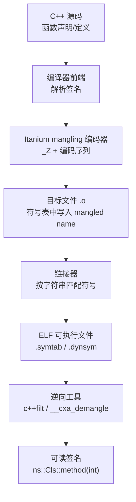

# 运行时与ABI（05）· Itanium C++ ABI与name mangling

## 概述与定位

> [!abstract] TL;DR
> C++ 支持函数重载、命名空间、模板，但链接器只识别**扁平、唯一的符号名**。编译器通过 **name mangling**（名字改写）将函数签名、所在命名空间/类、参数类型全部编码进符号名，使链接器无需理解 C++ 语义即可区分不同重载。**Itanium C++ ABI** 定义了 GCC/Clang 在 Linux x86-64（及众多其他平台）上统一使用的编码规则：符号以 `_Z` 开头，参数类型用单字母码表示，嵌套名字用 `N…E` 括起，重复出现的类型/名字可用 `S_`/`S0_` 等替换压缩。`c++filt` 和 `abi::__cxa_demangle` 可将 mangled 符号还原成可读签名。逆向 C++ 二进制时，动态符号表（`.dynsym`）里留存的 mangled 名是还原类/命名空间/函数签名最直接的线索。

C++ 与 C 在链接模型上的根本区别在于：C 的函数名在一个翻译单元内全局唯一（`foo` 就是 `foo`），而 C++ 允许同名函数在不同命名空间、不同类里、以不同参数列表共存。链接器在合并多个目标文件（`.o`）时只按符号名（字符串）匹配，无法理解"第一个参数是 `int` 还是 `long`"——于是**编译器在生成目标文件时就把完整签名编码进符号名**，让链接器看到的是每个重载独一无二的字符串。这一过程称为 **name mangling**（或 name decoration）。

Itanium C++ ABI（原为 Itanium IA-64 制定，后被 x86-64 Linux/macOS 等广泛采用）是 GCC 与 Clang 共同遵守的规范，本篇系统拆解其编码规则。

---

## 原理与机制

### 为何 mangling 不可避免

C++ 有三类场景会让同一"裸名"对应多个不同函数：

| 场景 | 示例 | 说明 |
|------|------|------|
| 函数重载 | `void f(int)` 与 `void f(double)` | 参数类型不同 |
| 命名空间 | `ns1::f()` 与 `ns2::f()` | 所在命名空间不同 |
| 类成员 | `Cls::method()` 与全局 `method()` | 所属类不同 |
| 模板实例 | `max<int>` 与 `max<double>` | 模板参数不同 |

没有 mangling，链接器会把所有 `f` 符号视为同一个，导致 ODR 违反或链接到错误重载。

### `extern "C"` —— 关闭 mangling

```cpp
// C++ 文件中
extern "C" int c_api_func(int x);   // 不做 mangling，符号就叫 c_api_func
```

`extern "C"` 告诉编译器：**这个函数按 C 规则导出，不做 mangling**。这是 C++ 与 C 库互操作的标准手段——C 的 `.h` 头文件在 C++ 中通常用 `extern "C" { … }` 包裹，确保函数符号不被 mangled，链接时 C 目标文件能找到它。

> [!warning] 注意
> `extern "C"` 函数不能重载：去掉 mangling 后，同名两个重载在链接器看来是同一个符号，会导致冲突。

### Itanium mangling 整体流程



> [!warning] 示例输出为示意

### 编码结构概览

Itanium mangled 符号的结构如下：

```
_Z <encoding>

<encoding> ::= <function name> <bare-function-type>
             | <data name>
             | <special-name>

<function name> ::= <unscoped-name>
                  | N <prefix> <unqualified-name> E    # 嵌套名
                  | Z <encoding> E <local-name>        # 局部名

<unscoped-name> ::= <unqualified-name>
                  | St <unqualified-name>              # std:: 前缀压缩

<unqualified-name> ::= <operator-name>
                     | <source-name>                  # 长度前缀名

<source-name> ::= <正整数，name的字节数> <identifier>
                  # 例："foo" → 3foo，"Cls" → 3Cls，"method" → 6method
```

---

## 编码规则详解

### 类型编码速查表

| 类型 | 编码 | 说明 |
|------|------|------|
| `void` | `v` | |
| `bool` | `b` | |
| `char` | `c` | signed char |
| `unsigned char` | `h` | |
| `short` | `s` | |
| `unsigned short` | `t` | |
| `int` | `i` | |
| `unsigned int` | `j` | |
| `long` | `l` | |
| `unsigned long` | `m` | |
| `long long` | `x` | |
| `unsigned long long` | `y` | |
| `float` | `f` | |
| `double` | `d` | |
| `long double` | `e` | |
| `__int128` | `n` | |
| `...` (variadic) | `z` | |
| `T*` | `P` + T的编码 | 指针 |
| `T&` | `R` + T的编码 | 左值引用 |
| `T&&` | `O` + T的编码 | 右值引用（C++11）|
| `const T` | `K` + T的编码 | const 修饰 |
| `volatile T` | `V` + T的编码 | volatile 修饰 |

修饰符**从最外层往内**依次列出：`const char*` = `PKc`（`P` + `K` + `c`），`const char* const` = `KPKc`。

### 例 1：`int foo(int, char)` → `_Z3fooic`

推导步骤：

```
_Z               ← 固定前缀
3foo             ← 函数名 "foo"，长度3
i                ← 第1参数：int
c                ← 第2参数：char

完整：_Z3fooic
```

验证：

```bash
$ c++filt _Z3fooic
foo(int, char)
```

> [!warning] 示例输出为示意

### 例 2：`ns::Cls::method()`（无参成员函数）→ `_ZN2ns3Cls6methodEv`

成员函数/命名空间限定名用 `N … E` 括起，内部各组件依次写出（每个都带长度前缀），最后参数列表接在 `E` 之后：

```
_Z               ← 固定前缀
N                ← 嵌套名开始
  2ns            ← 命名空间 "ns"（长度2）
  3Cls           ← 类名 "Cls"（长度3）
  6method        ← 函数名 "method"（长度6）
E                ← 嵌套名结束
v                ← 参数列表：void（无参）

完整：_ZN2ns3Cls6methodEv
```

验证：

```bash
$ c++filt _ZN2ns3Cls6methodEv
ns::Cls::method()
```

> [!warning] 示例输出为示意

> [!note] const 成员函数
> `ns::Cls::method() const` 在参数列表前加 `K`：`_ZNK2ns3Cls6methodEv`（`NK … E`，`K` 紧跟在 `N` 后面作为 qualifier）。

### 例 3：`void f(const char*)` → `_Z1fPKc`

```
_Z               ← 固定前缀
1f               ← 函数名 "f"（长度1）
PKc              ← 参数：P（指针）K（const）c（char）
                   即 const char* = pointer-to-const-char

完整：_Z1fPKc
```

验证：

```bash
$ c++filt _Z1fPKc
f(char const*)
```

> [!warning] 示例输出为示意

注意 `c++filt` 输出的是 `char const*`（"东向"写法），与 `const char*` 语义等价。

### 例 4：替换压缩（Substitution）—— `void g(int*, int*)`

当同一个类型（或名字）在参数列表中**重复出现**，Itanium ABI 使用**替换标记**避免冗余编码，节约符号长度：

- `S_` 指代"最近一个出现过的可替换实体"（第1个替换候选）
- `S0_` 指代第2个，`S1_` 指代第3个，以此类推（序号从0起数，但 `S_` 是第一个，`S0_` 是第二个）

```cpp
void g(int*, int*);
```

推导：

```
_Z               ← 固定前缀
1g               ← 函数名 "g"
Pi               ← 第1参数：P（指针）i（int）= int*
S_               ← 第2参数：与第1参数完全相同（int*），用 S_ 替代

完整：_Z1gPiS_
```

验证：

```bash
$ c++filt _Z1gPiS_
g(int*, int*)
```

> [!warning] 示例输出为示意

**替换规则细节**：替换候选按首次出现顺序编号，规则是：每当一个**完整类型**（含限定符、复合类型）第一次出现，就登记为下一个候选。`Pi`（`int*`）是第0个候选 → 记作 `S_`；若后续出现 `Pd`（`double*`），它成为第1个候选 → 记作 `S0_`；以此类推。

### 带 std:: 的替换压缩

`std::` 命名空间极为常见，Itanium ABI 为它设置了预定义替换：

| 替换码 | 含义 |
|--------|------|
| `St` | `std::` |
| `Sa` | `std::allocator` |
| `Sb` | `std::basic_string` |
| `Ss` | `std::basic_string<char, std::char_traits<char>, std::allocator<char>>` （即 `std::string`）|
| `Si` | `std::basic_istream<char, std::char_traits<char>>` |
| `So` | `std::basic_ostream<char, std::char_traits<char>>` |
| `Sd` | `std::basic_iostream<...>` |

例如 `std::string` 参数：

```
_Z1fSs       →  f(std::string)  （Ss 是 std::string 的预定义压缩）
```

### 模板实例

模板实例在名字后附加 `I … E` 表示模板参数列表：

```cpp
template<typename T>
T mymax(T a, T b);

// 实例化：int mymax<int>(int, int)
```

mangled：

```
_Z5mymax  IiE  ii
           ^^
           I...E = 模板参数列表：i = int
                   后续 ii = 两个 int 参数
```

完整：`_Z5mymaxIiEii`

```bash
$ c++filt _Z5mymaxIiEii
mymax<int>(int, int)
```

> [!warning] 示例输出为示意

---

## 逆向视角

### 工具链

#### `c++filt`：命令行 demangle

```bash
# 直接传符号
$ c++filt _ZN2ns3Cls6methodEv
ns::Cls::method()

# 从 nm 输出 pipeline
$ nm libfoo.so | c++filt

# 只过滤 mangled 符号，保留地址/类型列
$ nm -C libfoo.so        # -C 等价于 | c++filt
```

> [!warning] 示例输出为示意

#### `nm -C`：带 demangle 的符号表

```bash
$ nm -C libfoo.so | grep ' T '   # 只看 .text 导出符号
0000000000001234 T ns::Cls::method()
0000000000001260 T ns::Cls::method() const
```

> [!warning] 示例输出为示意

#### `abi::__cxa_demangle`：运行时 API

```cpp
#include <cxxabi.h>
#include <cstdlib>
#include <cstdio>

int main() {
    int status = 0;
    // mangled 符号
    const char* mangled = "_ZN2ns3Cls6methodEv";

    // demangle：返回 malloc 分配的字符串，调用方负责 free
    char* demangled = abi::__cxa_demangle(mangled, nullptr, nullptr, &status);

    if (status == 0 && demangled) {
        printf("Demangled: %s\n", demangled);   // ns::Cls::method()
        free(demangled);
    } else {
        printf("Demangle failed, status=%d\n", status);
    }
    return 0;
}
```

`status` 含义：`0` = 成功；`-1` = 内存分配失败；`-2` = 不是合法的 mangled 名；`-3` = 参数错误。

> [!note] 链接时需加 `-lstdc++`（GCC）或 `-lc++`（Clang/libc++），因为 `abi::__cxa_demangle` 在 `libstdc++`/`libc++` 中。

### 从动态符号表还原类结构

Strip 可以去掉 `.symtab`（本地符号表），但**动态导出符号**（`.dynsym`）必须保留（动态链接器依赖它）。逆向时，`.dynsym` 里的 mangled 符号是还原类/接口最直接的手段：

```bash
# 查看动态符号表（未 stripped 符号）
$ readelf -sW libfoo.so | grep ' FUNC ' | c++filt

# 或用 objdump
$ objdump -T libfoo.so | c++filt
```

> [!warning] 示例输出为示意

从 mangled 符号中可以读出：

| mangled 片段 | 可还原信息 |
|--------------|-----------|
| `N3FooE` | 类名 `Foo` |
| `N3Foo3BarE` | 嵌套类 `Foo::Bar` |
| `NK…E` | 该方法是 `const` 成员函数 |
| `Iv` 或 `Ii` | 模板参数类型 |
| 参数类型码序列 | 函数签名（参数个数与类型） |
| `_ZTV3Foo` | `Foo` 的 vtable（`TV` = vtable 前缀） |
| `_ZTI3Foo` | `Foo` 的 typeinfo（`TI` = typeinfo 前缀）|
| `_ZTS3Foo` | `Foo` 的 typeinfo name 字符串（`TS`）|

特殊前缀一览：

```
_Z     函数/变量 mangling 前缀
_ZN    嵌套名（命名空间/类成员）
_ZTV   vtable
_ZTI   typeinfo
_ZTS   typeinfo name（字符串）
_ZGV   guard variable（magic static 守卫变量）
_ZTIN  嵌套类 typeinfo
```

这意味着即使没有调试信息（DWARF），只要库有动态导出，逆向工程师就能通过 `readelf -sW + c++filt` 快速还原类层次结构、方法签名，甚至推断哪些类有虚函数（通过 `_ZTV` 前缀的 vtable 符号）。

### 实战：从 `libstdc++.so` 提取类接口

```bash
$ nm -CD /usr/lib/x86_64-linux-gnu/libstdc++.so.6 2>/dev/null | grep '_ZN9__gnu_cxx' | head -5
```

输出（示意）：

```
0000000000123456 T __gnu_cxx::__ops::_Iter_less_val::operator()(...)
...
```

> [!warning] 示例输出为示意

---

## 安全性与正确使用

### ABI 不兼容：混链不同编译器版本

Itanium mangling 规则本身很稳定，但**`std::` 类型的 mangled 名依赖标准库 ABI**。在 GCC 的发展历史中，`std::string` 在 GCC 5 之前使用 Copy-on-Write（COW）实现（`__cxx98`），GCC 5 起改为 SSO 实现（`__cxx11`），两者 **ABI 不兼容**：

- 旧 ABI：`std::string` 的 mangled 名如 `Ss`
- 新 ABI：`std::__cxx11::string`，mangled 为 `NSt7__cxx1112basic_stringIcSt11char_traitsIcESaIcEEE`

混链（一部分目标文件用旧 ABI，另一部分用新 ABI）会导致：

```
undefined reference to `std::__cxx11::basic_string<...>`
```

或更危险的是**链接成功但运行时崩溃**（字符串内部布局不同，跨越 ABI 边界传递会破坏内存结构）。

**防御措施**：
- 统一编译器版本与 ABI 标志（`-D_GLIBCXX_USE_CXX11_ABI=0/1`）
- 跨 ABI 边界的公共 API 用 `extern "C"` 导出，不暴露 C++ 类型
- 动态库的 ABI 稳定性承诺需要版本化符号（`__attribute__((visibility("default")))` + `.map` 文件）

### demangle 不可逆的信息边界

mangling 是**可逆编码**而非加密，demangle 可以精确还原签名——但有一类信息确实丢失了：

- **参数名**（`int x, int y` 中的 `x`、`y`）：mangling 只保留类型，不保留参数名
- **函数体、注释、局部变量**：全部在 mangling 之外，strip 后不可恢复
- **内联函数**：若被完全内联，不产生独立符号，无法从符号表还原
- **`static` 函数**：链接局部符号，strip `.symtab` 后消失（`.dynsym` 中无）

因此，从动态符号表 demangle 能还原**公共接口**，但类的私有/内联/静态方法在 stripped 二进制里通常不可见，需要结合 vtable 分析（`_ZTV` 符号）和 RTTI（`_ZTI`）进一步推断。

### 符号冲突与 ODR 违反

两个翻译单元定义了签名相同（因此 mangled 名相同）但实现不同的函数时，链接器通常**静默选一个**（取决于链接顺序），导致 ODR（One Definition Rule）违反，行为未定义。这类问题在模板特化时尤为隐蔽：

```cpp
// a.cpp
template<> void f<int>() { /* impl A */ }

// b.cpp
template<> void f<int>() { /* impl B */ }
// 两者 mangled 名相同，链接器静默忽略一个
```

address sanitizer 的 `-fsanitize=address -g` 不检测 ODR 违反；`-Wodr`（LTO 期间）或 `-fvisibility=hidden` + 显式导出可减少此类问题。

### MSVC 的不同方案（`?`-decoration）

MSVC（Visual C++）使用完全不同的 **`?`-decorated** mangling 方案，与 Itanium ABI **不兼容**：

| 特征 | Itanium（GCC/Clang） | MSVC |
|------|---------------------|------|
| 前缀 | `_Z` | `?` |
| 嵌套 | `N…E` | `@` 分隔 |
| 参数类型 | 单字母码 `i`/`c`/`d`… | `H`=int, `C`=char, `N`=double… |
| 示例 | `_Z3fooic` | `?foo@@YAHHD@Z` |

对照例：`int foo(int, char)`

```
Itanium:  _Z3fooic
MSVC:     ?foo@@YAHHD@Z
          ?    = mangling 前缀
          foo  = 函数名
          @@   = 全局函数标记（非类成员）
          YA   = 调用规约 __cdecl
          H    = 返回类型 int
          H    = 第1参数 int
          D    = 第2参数 char
          @Z   = 结束标记
```

Windows 上 demangle MSVC 符号的工具：

```
undname ?foo@@YAHHD@Z       # Windows SDK 自带的 undname.exe
```

> [!warning] 示例输出为示意

跨平台项目（如同时支持 Linux/Windows 的动态库）若暴露 C++ 符号，会因 mangling 方案不同导致跨编译器链接失败。正确做法是以 `extern "C"` 接口（或 COM-style 纯虚接口）作为公共 ABI 边界，在边界内部各用各的实现语言特性。

---

## 小结

| 知识点 | 核心结论 |
|--------|---------|
| 为何 mangling | 链接器只识别扁平符号名，C++ 的重载/命名空间/模板需要把签名编码进名字 |
| `extern "C"` | 关闭 mangling，用于 C 互操作；不能与重载共用 |
| `_Z` 前缀 | Itanium mangling 的起始标志 |
| `N…E` | 嵌套名（命名空间、类、类成员）的边界标记 |
| 长度前缀名 | `3foo` = 字符串 "foo"（3字节），`6method` = "method"（6字节）|
| 类型码 | `i`=int, `c`=char, `d`=double, `v`=void, `P`=指针, `K`=const, `R`=引用 |
| `S_`/`S0_` | 替换压缩，避免重复编码同一类型/名字 |
| `c++filt` / `nm -C` | 命令行 demangle 工具 |
| `abi::__cxa_demangle` | 运行时 demangle API |
| 逆向价值 | `.dynsym` 保存 mangled 符号，demangle 后可还原类名/签名/接口 |
| ABI 兼容性 | 不同编译器版本（GCC 4/5）、不同编译器（GCC vs MSVC）mangling 不兼容 |
| MSVC | `?`-decoration，用 `undname` 工具 demangle |

name mangling 是 C++ ABI 的第一道门：理解它，就能在反汇编中**一眼认出哪个符号属于哪个类、哪个重载**，也能在动态符号表中快速重建类层次——这是逆向 C++ 二进制的基础能力。后续章节将继续拆解对象在内存里的实际布局（第06篇）和虚表的运行时结构（第07篇）。

---

## 相关阅读

- [[11.ELF文件详解/09.symtab节.md]] — `.symtab` 完整符号表结构（本地 + 全局符号）
- [[11.ELF文件详解/15.dynsym节.md]] — `.dynsym` 动态符号表（strip 后依然保留的关键符号）
- [[11.ELF文件详解/00.ELF文件详解总览.md]] — ELF 节全景
- [[36.Objective-C与iOS运行时/00.Objective-C与iOS运行时总览.md]] — ObjC 的运行时符号查找（对照：ObjC 用 selector + IMP 表，无 mangling 但有类似的符号命名规范）
- [[22.调用规约/00.总览.md]] — 调用规约与 ABI 总览（mangling 的下游：参数如何传递）
- [[23.C_C++运行时与ABI/04.C++全局对象构造与析构顺序]] — 上一篇：`__cxa_atexit`、magic static 守卫

---

⬅️ 上一篇 [[04.C++全局对象构造与析构顺序]] ｜ 🏠 [[00.C_C++运行时与ABI总览]] ｜ 下一篇 [[06.对象内存布局与this指针]] ➡️
