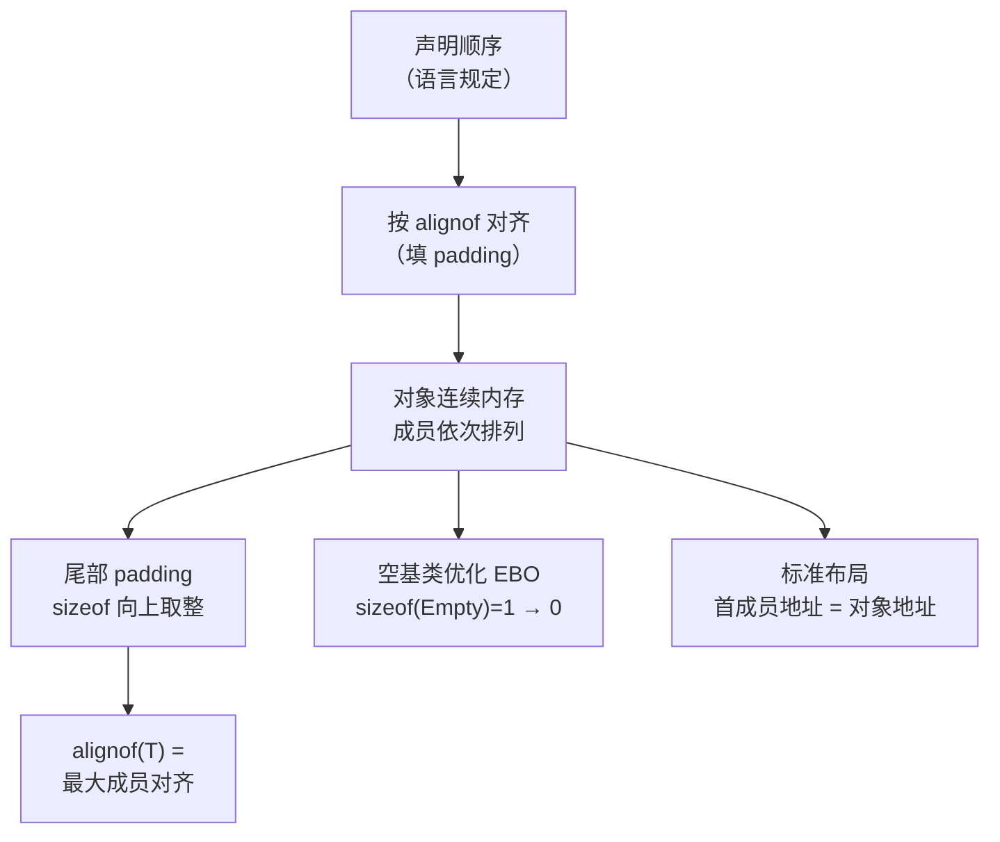

# 运行时与ABI（06）· 对象内存布局与this指针

## 概述与定位

> [!abstract] TL;DR
> C++ 对象的内存布局由 **ABI 约束**，而非语言标准完整规定。非静态数据成员按声明顺序排列，每个成员依 `alignof` 对齐，前面可能插入 **padding 字节**；整个对象的 `sizeof` 向上取整到最大成员对齐（尾部 padding）。成员函数通过隐藏首参 **`this`** 访问对象——在 System V AMD64 ABI 下 `this` 经 **RDI** 寄存器传入，访问成员等价于 `mov rax, [rdi + 偏移]`。理解布局规则是从反汇编"重建结构体字段"的根基。

C++ 对象模型规定了类在内存中的表示方式，是编译器、调试器、逆向工具共同遵守的隐性合同。本篇聚焦于**非虚类**（无虚函数）的基本布局规则；虚函数表 `vptr` 的引入见 [[07.虚函数表vtable与虚调用]]，多重虚继承布局见 [[08.多重继承与虚继承布局]]。

本篇基准平台：**Linux x86-64 + System V AMD64 ABI + Itanium C++ ABI（GCC/Clang）**。

---

## 原理与机制

### 布局规则总览



### 对齐三定律

| 规则 | 说明 |
|------|------|
| **成员对齐** | 每个成员的起始偏移必须是 `alignof(成员类型)` 的整数倍 |
| **对象对齐** | `alignof(T)` = 所有非静态成员中最大的 `alignof` 值 |
| **sizeof 取整** | `sizeof(T)` 向上取整到 `alignof(T)` 的整数倍（含尾部 padding） |

这三条规则确保对象数组中每个元素都满足对齐要求——数组地址 + `n * sizeof(T)` 必须始终对齐。

### 为何需要 padding

现代 CPU 要求对特定宽度的访问地址对齐（`int` 需 4B 对齐，`double` 需 8B 对齐）。未对齐访问在 x86-64 上虽然不崩溃，但会产生额外的内存总线事务、跨 cache line、以及在 SSE/AVX 路径下直接引发 `#GP`（若使用 `movdqa`）。因此编译器**主动插入 padding**，以换取每个成员在最优地址上。

---

## 布局详解

### 逐字节偏移表：含 `char / int / double` 的结构体

```cpp
struct Example {
    char   a;    // 1B, alignof=1
    int    b;    // 4B, alignof=4
    double c;    // 8B, alignof=8
};
```

| 偏移（字节） | 内容 | 说明 |
|:-----------:|------|------|
| 0 | `a`（1B） | `char`，无对齐要求，紧贴起始 |
| 1–3 | **padding**（3B） | 为下一个 `int b` 补到偏移 4 |
| 4–7 | `b`（4B） | `alignof(int)=4`，偏移 4 满足 |
| 8–15 | `c`（8B） | `alignof(double)=8`，偏移 8 满足 |
| 16 | 结束 | 无尾部 padding（16 已是 8 的倍数） |

结论：

- `sizeof(Example)` = **16**（非 1+4+8=13）
- `alignof(Example)` = **8**（`double` 的对齐要求最大）

#### 直观字节图（16 字节，每格 = 1 字节）

```
偏移: 00 01 02 03  04 05 06 07  08 09 0A 0B  0C 0D 0E 0F
      [a][  pad   ][ b (int)  ][ c (double)               ]
```

### 重排节省 padding

将同一字段按"大到小"重排，可消除 padding：

```cpp
struct ExamplePacked {
    double c;    // 偏移 0，8B
    int    b;    // 偏移 8，4B
    char   a;    // 偏移 12，1B
                 // 尾部 padding 3B → sizeof=16（同上，对齐要求不变）
};
```

> 对于此例，`sizeof` 恰好相同。但对于多个 `char` 字段穿插 `int`/`double` 的情况，重排可显著减小对象大小（有时能省 30–50% 空间），对缓存友好性有益。

### `#pragma pack` 与 `alignas`

**`#pragma pack(n)`**：将所有成员对齐限制为 `min(自然对齐, n)`。常见于网络报文/硬件寄存器映射：

```cpp
#pragma pack(1)
struct NetworkHeader {
    uint8_t  flags;
    uint32_t seq;    // 偏移 1（未对齐！）
    uint16_t checksum;
};
#pragma pack()
// sizeof = 7，alignof = 1
```

> [!warning] `#pragma pack` 的副作用
> 成员地址不对齐时，对 `seq` 的读写在 x86-64 软件上可能触发 **性能惩罚**；在某些 SIMD 或原子操作路径上可能触发 **运行时错误**。详见"安全性与正确使用"板块。

**`alignas(n)`**（C++11）：提升单个成员或整个类的对齐要求：

```cpp
struct CacheLine {
    alignas(64) int data[16];    // 强制缓存行对齐
};
// sizeof = 64, alignof = 64
```

### 位域（bit-fields）

位域允许在一个整型单元内紧凑存储若干字段：

```cpp
struct Flags {
    unsigned int a : 3;   // 3 位
    unsigned int b : 5;   // 5 位
    unsigned int c : 10;  // 10 位
    // 共 18 位，放入一个 unsigned int（32 位）
};
// sizeof(Flags) = 4
```

关键约束（实现定义）：

- **分配方向**（高位→低位 还是 低位→高位）：**由实现定义**，GCC/Clang 在 x86-64 上默认从低位开始；
- **不可跨越类型边界**：`unsigned int` 的位域不能跨越另一个 `unsigned int` 的边界，编译器会自动插入 padding 位；
- 位域成员不可取地址（`&Flags::a` 非法）。

### 空基类优化（EBO）

一个完整对象至少占 1 字节（保证不同对象拥有不同地址）。但若一个**空类**（无非静态数据成员、无虚函数）作为**基类**，编译器可以将其"合并"到派生类中，不额外占用空间：

```cpp
struct Empty {};                    // sizeof(Empty) = 1

struct Derived : Empty {
    int x;
};
// sizeof(Derived) = 4（EBO 生效，Empty 不额外占 1 字节 + padding）
// 若无 EBO：sizeof = 8（1 + 3pad + 4）
```

EBO 是标准库大量使用的优化技术，例如 `std::unique_ptr<T, Deleter>` 通过继承 `Deleter`（当 `Deleter` 为无状态空类时）消除 deleter 的存储开销。

**C++20 `[[no_unique_address]]`**：将 EBO 扩展到**成员**（而非仅基类）：

```cpp
struct [[no_unique_address]] Empty {};

struct S {
    [[no_unique_address]] Empty e;
    int x;
};
// sizeof(S) = 4（e 与 x 共享起始地址，不额外占空间）
```

### 标准布局（standard-layout）

C++ 将满足一组条件的类称为"标准布局类"（standard-layout class），其核心意义：

1. **首成员地址 = 对象地址**（可通过 `reinterpret_cast` 互转，不含 `vptr`）；
2. 可安全使用 `offsetof` 宏；
3. 与 C 结构体内存兼容，可通过 `extern "C"` 边界传递。

**满足标准布局的条件（C++17）**：

| 条件 | 说明 |
|------|------|
| 所有非静态成员相同访问控制（全 public 或全 private） | 不同访问级别允许编译器自由重排 |
| 无虚函数、无虚基类 | `vptr` 破坏布局预测性 |
| 首个非静态成员的类型不与基类相同 | 避免地址重叠歧义 |
| 基类（若有）也是标准布局 | 递归要求 |
| 至多一个类（基类 or 派生类）有非静态成员 | |

**POD（Plain Old Data）**：C++03 起，"POD" = "平凡类型（trivial）" + "标准布局"。C++11 起将两个概念拆分——`std::is_trivial<T>` 检查构造/析构/复制是否平凡，`std::is_standard_layout<T>` 检查布局。两者同时满足 = `std::is_pod<T>`（C++20 已弃用 `is_pod`，用组合替代）。

```cpp
#include <type_traits>
struct POD { int x; double y; };
static_assert(std::is_standard_layout_v<POD>);  // 通过
static_assert(std::is_trivial_v<POD>);           // 通过

struct NonSL {
    int x;
private:
    int y;   // 不同访问控制 → 非标准布局
};
static_assert(!std::is_standard_layout_v<NonSL>); // 通过
```

### `this` 指针与 RDI 传递

C++ 非静态成员函数在 ABI 层等价于带一个隐藏首参的普通函数：

```cpp
// 语言层
struct Point {
    int x, y;
    int sum() { return x + y; }
};

// ABI 等价（伪 C）
int _ZN5Point3sumEv(Point* this) {   // "Point::sum(void)"
    return this->x + this->y;
}
```

在 **System V AMD64 ABI（Itanium C++ ABI，GCC/Clang）** 下：

- `this` 作为**第一个整型参数**，经 **RDI** 寄存器传入；
- 后续显式参数依次用 RSI、RDX、RCX、R8、R9；
- 访问 `this->x` = `[rdi + 0]`，访问 `this->y` = `[rdi + 4]`。

> [!note] Windows x64 MSVC / `__thiscall` 差异
> MSVC 非虚成员函数使用 **`__thiscall`** 约定：`this` 经 **RCX** 传入（Windows x64 首整型寄存器）。32 位 MSVC 用 `thiscall`，`this` 经 **ECX** 传入，其余参数压栈。详见 [[22.调用规约/04.thiscall.md]]。

#### 反汇编示例（x86-64 Intel，GCC -O2）

```cpp
struct Counter {
    int value;         // 偏移 0
    int step;          // 偏移 4
    int advance() { return value += step; }
};
```

```asm
; Counter::advance() — x86-64 Intel 语法（GCC -O2 示意）
; 调用时：rdi = this（Counter* 指针）

_ZN7Counter7advanceEv:
    mov    eax, DWORD PTR [rdi+4]     ; eax = this->step（偏移 4）
    add    DWORD PTR [rdi+0], eax     ; this->value += eax（偏移 0）
    mov    eax, DWORD PTR [rdi+0]     ; eax = this->value（返回值）
    ret
```

> [!warning] 示例输出为示意
> 上述汇编为手工整理的示意代码，真实编译器输出可能因版本、优化选项不同而有差异；地址（偏移值）为示例。

关键观察：
1. `rdi` 始终是 `this`——函数入口无需任何设置；
2. 成员访问 = `[rdi + 固定常量偏移]`，偏移由布局规则确定；
3. 普通成员函数的 mangled name（`_ZN7Counter7advanceEv`）**不含 `this` 的类型信息**——it 由调用约定隐式传递，不参与 mangle（仅 `cv` 限定影响 mangle，如 `const` 成员函数会出现 `K`）。

---

## 逆向视角

### 从访问模式重建 struct/class 字段

在反汇编中，**`[基址寄存器 + 常量偏移]`** 的访问模式是识别结构体成员的核心信号：

```asm
; 某函数的片段（Intel）
mov    rdi, [rsp+8]          ; rdi = 某对象指针（this 或普通指针）
movzx  eax, BYTE PTR [rdi]   ; 偏移 0：char/bool 成员
mov    ecx, DWORD PTR [rdi+4] ; 偏移 4：int 成员（说明偏移 1–3 是 padding）
movsd  xmm0, [rdi+8]         ; 偏移 8：double 成员（8B SSE 访问）
```

从这三条指令可还原：

```cpp
struct Reconstructed {
    char  f0;     // 偏移 0
    // 3B padding
    int   f1;     // 偏移 4
    double f2;    // 偏移 8
};  // sizeof = 16
```

### 识别技巧

| 信号 | 含义 |
|------|------|
| `mov reg, [base+0]` 宽度 1B | `char` 或 `bool`（`movzx`/`movsx`）|
| `mov reg, [base+N]` 宽度 4B | `int` 或 `float`（注意 `cvtss2sd` 区分）|
| `mov reg, [base+N]` 宽度 8B | `long`/`pointer`/`double` |
| 偏移跳跃（如 1→4）| 中间有 padding，字段边界需对齐 |
| `rdi` 在函数入口即被解引用 | 极可能是 `this` 指针 |
| 函数名可 c++filt 还原 | 类名/方法名直接给出类型信息 |

### 工具辅助

**`gdb ptype`**（需 DWARF 调试信息）：

```
(gdb) ptype /o struct Example
type = struct Example {
/*    0      |    1 */    char a;
/* XXX 3-byte hole  */
/*    4      |    4 */    int b;
/*    8      |    8 */    double c;
                          /* total size (bytes):   16 */
                        }
```

> [!warning] 示例输出为示意

**`pahole`**（专门分析结构体 padding）：

```
$ pahole -C Example ./a.out
struct Example {
    char               a;            /*     0     1 */

    /* XXX 3 bytes hole, try to pack */

    int                b;            /*     4     4 */
    double             c;            /*     8     8 */

    /* size: 16, cachelines: 1, members: 3 */
    /* sum members: 13, holes: 1, sum holes: 3 */
};
```

> [!warning] 示例输出为示意

`pahole` 输出直接量化了 padding 浪费，是性能调优和逆向还原的利器。

---

## 安全性与正确使用

### ABI 跨编译单元与跨编译器布局一致性

C++ ABI 在**同一工具链（如 GCC + Itanium C++ ABI）的不同版本**之间通常保持布局兼容，但**跨编译器**（GCC vs MSVC vs MSVC/x64 vs 旧版 ARM AAPCS）之间**没有标准保证**。

| 场景 | 风险 |
|------|------|
| GCC 编译的 `.so` 与 MSVC 编译的 `.dll` 共用 C++ 类 | 字段偏移/名称修饰不兼容，直接崩溃 |
| 不同 GCC 主版本（< v5 vs ≥ v5）之间 | C++11 ABI 切换（`std::string` 布局变更），链接时 symbol 版本不匹配 |
| 编译选项 `-m32` / `-m64` 混用 | `sizeof(long)` / `sizeof(pointer)` 不同，跨边界传递对象必然错 |

**最佳实践**：跨编译单元传递类对象时，使用 **`extern "C"` 标准布局 POD 结构**或 C 接口，绝不在 ABI 边界暴露非标准布局 C++ 类。

### `#pragma pack` 误用的陷阱

```cpp
#pragma pack(1)
struct BadPack {
    uint8_t  flag;
    uint32_t value;   // 偏移 1，未对齐
};
#pragma pack()

BadPack bp;
uint32_t* p = &bp.value;   // p 未对齐
*p = 0xDEADBEEF;           // x86-64：性能惩罚（跨 cache line）
                            // ARM：SIGBUS（默认不支持未对齐访问）
```

潜在问题：

1. **性能**：x86-64 未对齐访问若跨 cache line，内存带宽翻倍消耗；
2. **正确性（ARM/MIPS）**：非 x86 架构默认禁止未对齐访问，`SIGBUS` 崩溃；
3. **原子操作**：`std::atomic<uint32_t>` 要求自然对齐，`pack(1)` 破坏后行为未定义；
4. **SIMD**：`movdqa`（对齐 SSE 传输）要求 16B 对齐，未对齐触发 `#GP`。

**安全做法**：`#pragma pack(1)` 只用于 I/O 序列化结构体（通过 `memcpy` 读写，不直接 cast 指针操作成员）。

### 跨版本 struct 版本化策略

公开 C++ API 中若需修改结构体（增删字段），正确策略：

- 在结构体末尾追加字段（仅适用于标准布局，且调用方须版本协商）；
- 使用 `size` 字段作为版本标记（`sizeof` 作为传入参数）；
- 完全拷贝式接口（传 POD，不传引用）以解耦 ABI 版本。

---

## 小结

| 规则 | 关键值 |
|------|--------|
| 成员排列顺序 | 按**声明顺序**（C++ 标准保证） |
| padding 插入 | 确保每个成员起始偏移 % `alignof(成员)` = 0 |
| `alignof(T)` | 所有非静态成员中最大的 `alignof` |
| `sizeof(T)` | 向上取整到 `alignof(T)`，含尾部 padding |
| `this` 传递 | SysV AMD64：**RDI**；MSVC x64：**RCX** |
| 成员访问 | `[this + 偏移]`，偏移由布局规则唯一确定 |
| EBO | 空基类不额外占空间；C++20 `[[no_unique_address]]` 推广到成员 |
| 标准布局 | 首成员地址 = 对象地址，可 `offsetof`，与 C 兼容 |

理解对象内存布局，就能在反汇编中**从"基址 + 固定偏移"的访问模式直接重建结构体**，并对 vtable/vptr（下一篇）、`this` 调整 thunk（多继承篇）等复杂机制建立直觉。

---

## 相关阅读

- [[07.虚函数表vtable与虚调用]]——`vptr` 在对象首部的排布，虚函数分派原理
- [[08.多重继承与虚继承布局]]——多个 `vptr`、`this` 调整 thunk 的完整分析
- [[22.调用规约/04.thiscall.md]]——`__thiscall` 与 MSVC 的 `this` 传递规约
- [[33.二进制漏洞与利用基础/01.内存布局与漏洞概览.md]]——对象布局视角下的内存漏洞
- [[21.Asm/31 编译器视角-C到汇编.md]]——编译器如何将成员访问翻译为偏移寻址
- [[11.ELF文件详解/51.data.rel.ro节.md]]——vtable 与 typeinfo 的只读存储位置

---

⬅️ 上一篇 [[05.Itanium C++ ABI与name mangling]] ｜ 🏠 [[00.C_C++运行时与ABI总览]] ｜ 下一篇 [[07.虚函数表vtable与虚调用]] ➡️
