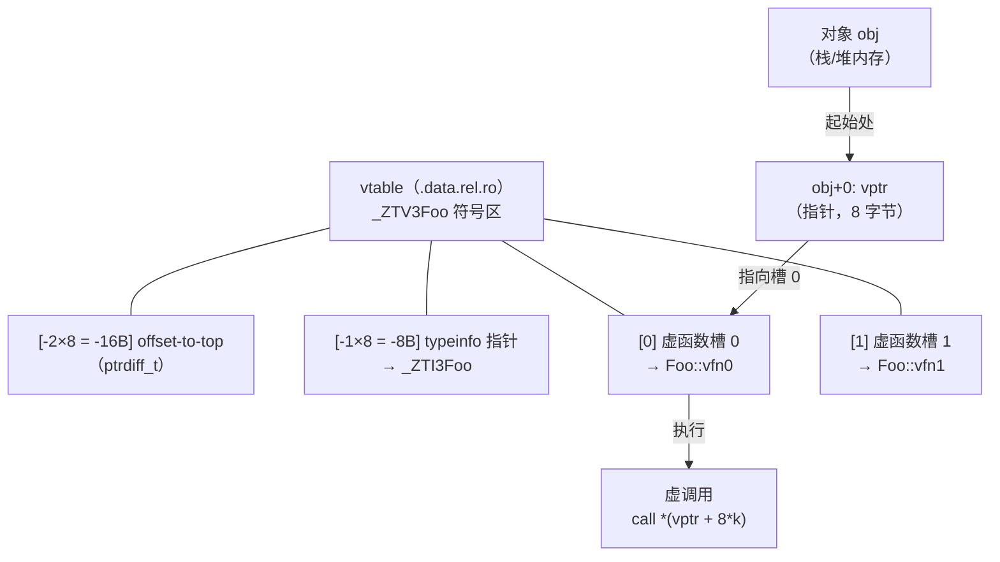

# 运行时与ABI（07）· 虚函数表vtable与虚调用

## 概述与定位

> [!abstract] TL;DR
> 含虚函数的 C++ 类在每个对象起始处嵌入一个 **`vptr`**（虚函数表指针）；`vptr` 指向该类的 **`vtable`**（虚函数表），表中依次存放各虚函数的地址。**Itanium C++ ABI** 规定 vtable 由三部分组成：`vptr` 所指位置的"上方"（负偏移）依次是 `typeinfo` 指针和 `offset-to-top`，其"下方"（从 `vptr` 所指槽位开始）是各虚函数地址。虚调用在运行时解引用 `vptr`，再按函数槽索引间接跳转——整个机制赋予 C++ 运行时多态性，也是逆向分析 C++ 程序的基础入口。
>
> 本章讲透：对象内存中 `vptr` 的位置；vtable 的精确布局（`offset-to-top`/`typeinfo`/函数槽）；虚调用的汇编序列；vtable 的 ELF 存放节与符号命名规范；构造期 `vptr` 切换机制；纯虚函数占位；逆向工具链；以及 vtable 劫持的安全含义。

虚调用是 C++ 运行时多态的核心机制，其实现完全由 ABI 规定。理解 vtable 结构，既是读懂 C++ 逆向汇编的前提，也是理解多重继承（第 08 章）、RTTI（第 09 章）、异常展开（第 10/11 章）的基础。

---

## 原理与机制

### 虚调用的整体模型



> `vptr` 存在对象起始偏移 0 处（单继承情形），是一个 8 字节指针（x86-64）。它**直接指向** vtable 中"第一个虚函数地址槽"，而不是指向 vtable 的开头——vtable 开头在 `vptr` 所存地址之前（负偏移方向）存放 `typeinfo` 和 `offset-to-top`。

### 为什么需要 vptr 与 vtable

- **单次间接层代替 if-else**：编译器不知道运行时具体类型，无法直接 `call` 函数地址；vtable 把"选哪个函数"变成一次内存查表，时间复杂度 O(1)。
- **ABI 契约（编译器无关）**：只要遵循 Itanium C++ ABI，不同编译单元生成的代码可以互操作——`vptr` 偏移、槽顺序、前缀布局均为契约。
- **多态对象大小固定**：vtable 只有一份，所有对象共享；对象本身只增加一个指针大小（8 字节）。

---

## 结构与汇编详解

### vtable 精确布局

以如下类为例：

```cpp
struct Foo {
    virtual ~Foo();          // 虚析构（槽 0/1）
    virtual void vfn1();     // 槽 2
    virtual int  vfn2(int);  // 槽 3
};
```

Itanium C++ ABI 规定的 vtable 内存布局（x86-64，每格 8 字节）：

```
地址偏移（相对 vptr 所指地址）   内容
──────────────────────────────────────────────────────
 -16（-2 * 8）   offset-to-top    （ptrdiff_t，单继承下为 0）
 - 8（-1 * 8）   typeinfo 指针    → _ZTI3Foo（std::type_info 子类）
══════════════════ ← vptr 指向此处（记为 vtable[0]）═════
  + 0（ 0 * 8）  虚函数槽 0      → Foo::~Foo()（完整析构符，D1 thunk）
  + 8（ 1 * 8）  虚函数槽 1      → Foo::~Foo()（删除析构符，D0 thunk）
 +16（ 2 * 8）   虚函数槽 2      → Foo::vfn1
 +24（ 3 * 8）   虚函数槽 3      → Foo::vfn2
```

关键约定：

- **`offset-to-top`**：当前子对象相对"完整对象起始"的偏移（负值或零）。单继承为 0；多重继承中次级子对象的 vtable 前缀此字段非零（详见第 08 章），用于 `dynamic_cast` 和 `this` 还原。
- **`typeinfo` 指针**：在 `vptr - 8` 处，指向该类的 `std::type_info` 子类对象，供 `typeid` 和 `dynamic_cast` 使用（详见第 09 章）。
- **虚析构函数占两个槽**：Itanium ABI 把虚析构拆成"完整对象析构"（D1，仅析构，不 delete）和"删除析构"（D0，析构后调 `operator delete`）。
- **槽序**：按类声明的虚函数出现顺序；派生类覆盖时**替换**对应槽，追加新虚函数在末尾。

### 对象内存中的 vptr

```
栈/堆上 Foo 对象内存：

 +0   vptr     → &vtable[0]（= _ZTV3Foo + 16，即跳过前缀两格）
 +8   （成员 a，若有）
 +16  （成员 b，若有）
 ...
```

> `sizeof(Foo)` 至少为 8（`vptr`），与 `vptr` 在偏移 0 是 Itanium ABI 对单继承的保证。

### 虚调用汇编序列（Intel 语法，x86-64）

C++ 源码：

```cpp
Foo* obj = new Foo();
obj->vfn1();   // 虚调用
```

编译器（-O2）生成等价汇编（示意）：

```asm
; RDI = obj（this 指针，System V AMD64 第一个整型参数寄存器）
; 1. 读取 vptr（obj+0）
mov    rax, QWORD PTR [rdi]       ; rax = vptr = vtable[0] 的地址

; 2. 按槽索引计算目标函数地址并调用
; vfn1 是槽 2（偏移 +16 字节 = 2 * 8）
call   QWORD PTR [rax + 16]       ; call vtable[2] = Foo::vfn1
```

> [!warning] 示例输出为示意
> 上方汇编为原理示意，实际编译器输出受优化级别、ABI 变体影响，地址与寄存器分配可能不同。

**识别特征**：
- `mov rax, [rdi]` 或 `mov rax, [rcx]`——从 `this` 偏移 0 取 `vptr`。
- `call QWORD PTR [rax + N]`（N 为 8 的倍数）——间接 `call` vtable 槽，这是**虚调用**的决定性特征。
- `this` 指针始终在 `RDI`（Itanium ABI 下，`this` 作为隐藏首参经 `RDI` 传递）。

更完整的调用流程（带参数）：

```asm
; obj->vfn2(42)
; 1. this → RDI（已经在 RDI 中，或从某处 mov）
mov    rdi, rbx          ; this = obj

; 2. 第一个显式参数 42 → RSI
mov    esi, 42

; 3. 取 vptr
mov    rax, QWORD PTR [rdi]

; 4. 查槽 3（vfn2，偏移 +24）并调用
call   QWORD PTR [rax + 24]
```

> [!warning] 示例输出为示意
> 参数编号与槽偏移对应关系取决于具体类声明，此处为示例。

### vtable 的 ELF 存放位置与符号命名

**ELF 节**：vtable 通常位于 **`.data.rel.ro`** 节（需要运行时重定位后变为只读），少数情况下位于 `.rodata`（全量静态链接且无需动态重定位时）。

- `.data.rel.ro` 节的存在原因：vtable 中的函数指针和 `typeinfo` 指针在加载时需要动态链接器填入实际地址（`R_X86_64_RELATIVE` 或 `R_X86_64_64` 重定位），填完后段通过 `RELRO` 机制被 `mprotect` 为只读。详见 [[11.ELF文件详解/51.data.rel.ro节.md]]。

**Itanium C++ ABI 符号命名**（name mangling）：

| 用途 | 符号格式 | 示例（类 `Foo`） |
|---|---|---|
| vtable 本身 | `_ZTV<mangled-type>` | `_ZTV3Foo` |
| typeinfo 对象 | `_ZTI<mangled-type>` | `_ZTI3Foo` |
| type name 字符串 | `_ZTS<mangled-type>` | `_ZTS3Foo`（字符串 `"3Foo"`） |
| 虚析构（完整） | `_ZN<type>D1Ev` | `_ZN3FooD1Ev` |
| 虚析构（删除） | `_ZN<type>D0Ev` | `_ZN3FooD0Ev` |
| VTT（虚继承） | `_ZTT<mangled-type>` | `_ZTT3Bar`（第 08 章） |

用 `nm` 或 `readelf` 可见这些符号：

```bash
nm -C a.out | grep vtable
readelf -s a.out | grep _ZTV
```

```text
# 示例输出为示意
0000000000403d60 V _ZTV3Foo      ← vtable 符号（V = weak/global defined）
0000000000403d80 V _ZTI3Foo      ← typeinfo 对象
```

> [!warning] 示例输出为示意

`_ZTV3Foo` 符号地址指向 vtable 的**真正起点**（即 `offset-to-top` 所在格），而 `vptr` 存放的是 `_ZTV3Foo + 2*8 = _ZTV3Foo + 16`（跳过两个前缀格，指向第一个虚函数槽）。

---

## 逆向视角

### 在反汇编中识别虚调用

```asm
; ─── 直接调用（非虚）───
call   0x401234          ; 绝对地址，IDA/Ghidra 直接解析到函数名

; ─── 虚调用（间接 call）───
mov    rax, [rdi]        ; 取 vptr
call   qword ptr [rax+8] ; 查 vtable[1]
```

**鉴别规则**：

1. `[reg]`（从对象起始偏移 0）取出 `vptr` 存入另一个寄存器。
2. 再 `call [vptr_reg + 8*k]`——间接 `call`，操作数为"寄存器加常数偏移"。
3. 偏移 **k × 8** 中的 k 即虚函数槽索引（k=0 通常是完整析构符）。

> `call [rax + 8]` = 调用槽 1（析构符 D0）；`call [rax + 16]` = 槽 2；依此类推。

### 由 vtable 还原类的虚函数列表

**步骤 1**：在 IDA/Ghidra 中找到 `_ZTV` 前缀符号，定位 vtable 数据段。

**步骤 2**：vtable 符号地址偏移 +16（跳过 `offset-to-top` 和 `typeinfo`）即第一个虚函数地址。依次读取，直到出现不像函数指针的值（通常是下一个 vtable 前缀或 0）。

**步骤 3**：对每个槽地址用 `c++filt` 解 mangle：

```bash
c++filt _ZN3Foo4vfn1Ev   # 输出：Foo::vfn1()
```

**步骤 4**：结合 `typeinfo`（`_ZTI`）和 `_ZTS`（type name 字符串）还原继承链（详见第 09 章）。

**步骤 5**：在 GDB 中可直接查看运行时 vtable：

```bash
(gdb) info vtbl obj          # 打印 obj 的 vtable 内容（需要调试信息）
(gdb) x/8gx *(void**)obj     # 手动：取 vptr 后打印 8 个槽
```

```text
# 示例输出为示意
vtable for 'Foo' @ 0x403d70 (subobject @ 0x0):
[0]: 0x401180 <Foo::~Foo()>
[1]: 0x401190 <Foo::~Foo()>
[2]: 0x4011a0 <Foo::vfn1()>
[3]: 0x4011b0 <Foo::vfn2(int)>
```

> [!warning] 示例输出为示意

**Ghidra/IDA 技巧**：
- Ghidra 可在 `_ZTV` 数据标签上右键 → "Auto Create Structure" 辅助识别。
- IDA 在开启 RTTI 分析插件后（如 RTTI Scanner）可自动将 `_ZTV` 重建为带名称的虚函数列表。
- `data.rel.ro` 段标记为 `R`（运行时重定位后只读），在静态分析时其内容即虚函数地址（已被链接器填入偏移，动态加载后由 RTLD 调整基址）。

### 构造函数中的 vtable 切换

在反汇编构造函数时，常见如下模式：

```asm
; 基类 Base 的构造函数体开头：
lea    rax, [rip + _ZTV4Base+16]    ; rax = &vtable<Base>[0]
mov    [rdi], rax                   ; obj->vptr = &vtable<Base>[0]

; 接着调用成员/基类初始化 ...

; 派生类 Derived 的构造函数体开头（调用完 Base::Base() 之后）：
lea    rax, [rip + _ZTV7Derived+16] ; rax = &vtable<Derived>[0]
mov    [rdi], rax                   ; obj->vptr = &vtable<Derived>[0]
; 至此 vptr 切换为 Derived 的 vtable
```

> [!warning] 示例输出为示意

这是逆向中识别构造函数层次的重要线索：**每次向 `this+0` 写入不同 `_ZTV` 地址，都标志着一层构造函数的开始。**

---

## 安全性与正确使用

### 构造期调用虚函数的陷阱

**现象**：在基类构造函数中调用虚函数，实际执行的是**基类版本**，而非派生类覆盖版本。

**原因**：构造顺序为"由基到派"，基类构造函数执行时 `vptr` 尚指向基类 vtable；此时调用虚函数走的是基类 vtable 中的槽，即基类实现。

```cpp
struct Base {
    Base() { init(); }       // 危险：调用虚函数
    virtual void init() { puts("Base::init"); }
};
struct Derived : Base {
    void init() override { puts("Derived::init"); }  // 不会被调用！
};

int main() {
    Derived d;   // 输出 "Base::init"，不是 "Derived::init"
}
```

**正确实践**：

1. 构造/析构函数内**不要调用虚函数**（或仅在清楚该语义时有意为之）。
2. 需要多态初始化时，使用"两阶段初始化"模式：先构造，再调用 `init()` 虚函数（此时 `vptr` 已指向最终派生类的 vtable）。

同样地，**析构函数**执行时 `vptr` 按"由派到基"逐层切换回去——析构函数中的虚调用也不走派生类版本。

### 纯虚函数与 `__cxa_pure_virtual`

对于纯虚函数（`virtual void f() = 0;`），Itanium ABI 要求其 vtable 槽位填入 **`__cxa_pure_virtual`** 的地址（由 libstdc++/libcxxabi 提供）。若在运行时意外通过对象直接调用纯虚函数（通常发生在构造/析构过程中），该函数被执行，会调用 `std::terminate` 并打印类似 `pure virtual method called` 的错误信息。

逆向中，槽值 = `__cxa_pure_virtual` 的地址是"该类为抽象类、此函数未实现"的标志。

### vtable 劫持：分析与防御视角

**攻击原理**：

vtable 指针 `vptr` 存在于对象内存中（偏移 0）。若攻击者能通过堆溢出、UAF（Use-After-Free）、类型混淆等漏洞**覆盖 `vptr`**，使其指向攻击者控制的伪造 vtable，则下一次虚调用会跳转到任意地址——实现控制流劫持：

```
攻击前：obj->vptr → _ZTV<LegitClass>+16 → 合法函数地址
攻击后：obj->vptr → fake_vtable         → 攻击者控制的地址
```

**常见漏洞链**：

| 漏洞类型 | 利用方式 |
|---|---|
| 堆溢出 | 溢出覆盖相邻对象的 `vptr` |
| UAF（Use-After-Free） | free 后重用内存写入 fake vtable，再触发虚调用 |
| 类型混淆（Type Confusion） | 将对象误认为另一个类，vtable 槽语义错位 |

详见 [[33.二进制漏洞与利用基础/13.现代利用与信息泄露.md]]。

**防御层次**：

| 防御机制 | 说明 | 有效性 |
|---|---|---|
| RELRO（Full）| vtable 数据在 `.data.rel.ro` 中，加载后只读，攻击者不能直接改 vtable 内容 | 防 vtable 内容篡改，但不防 vptr 覆盖 |
| CFI（Control Flow Integrity）| 在每次间接 `call` 前插入合法目标校验，`vptr` 必须指向合法 vtable | 直接防御 vptr 劫持 |
| VTable 指针保护（`-fsanitize=cfi-vcall`）| Clang CFI 的 vtable 调用检查，运行时验证 `vptr` 类型兼容性 | 开发/测试阶段高效检测 |
| ASLR + PIE | 随机化加载地址，攻击者需先泄漏地址才能构造 fake vtable | 增加利用难度 |
| Shadow Stack / PAC（ARM） | 指针认证或影子栈，防止指针伪造 | 平台相关 |

详见 [[34.现代二进制防护机制/08.CFI控制流完整性.md]]。

**逆向分析视角**：分析 CTF/漏洞利用时，在 GDB 中可用以下方式判断 `vptr` 是否被篡改：

```bash
(gdb) p/x *(void**)obj               # 查看当前 vptr 值
(gdb) info symbol *(void**)obj       # 尝试解析 vptr 是否为合法 _ZTV 符号
(gdb) x/4gx *(void**)obj - 16       # 查看 vtable 前缀（offset-to-top 和 typeinfo）
```

> [!warning] 示例输出为示意

若 `info symbol` 无法解析 `vptr`，或前缀字段异常（如 typeinfo 指针为 0 或乱序），则高度怀疑 `vptr` 已被劫持。

### MSVC ABI 对照说明

Windows x64 + MSVC 使用**不同的 ABI**，与 Itanium 不兼容：

- MSVC vtable 无 `offset-to-top`/`typeinfo` 前缀（RTTI 用独立机制，`RTTICompleteObjectLocator` 指针存于 vtable 之前，但格式不同）。
- MSVC 虚析构只有一个槽（通过调用者传参区分"是否 delete"）。
- 符号修饰（name mangling）使用 `?` 开头的 MSVC 格式，与 `_Z` 完全不同。

本章讨论均针对 Linux x86-64 + Itanium C++ ABI（GCC/Clang），涉及 Windows 时请显式对照 [[22.调用规约/04.thiscall.md]]。

---

## 小结

| 要点 | 核心结论 |
|---|---|
| `vptr` 位置 | 对象起始偏移 0（单继承），8 字节指针 |
| `vptr` 所指 | vtable 中第一个**虚函数地址槽**（不是 vtable 开头） |
| vtable 前缀 | `offset-to-top` 在 vptr−16（`vtable[-2×8]`）→ `typeinfo*` 在 vptr−8（`vtable[-1×8]`）→ 虚函数槽 0 在 vptr+0 |
| 虚调用汇编 | `mov rax,[rdi]` + `call [rax + 8*k]` |
| vtable ELF 位置 | `.data.rel.ro`（RELRO 保护，加载后只读） |
| 关键符号 | `_ZTV`（vtable）、`_ZTI`（typeinfo）、`_ZTS`（type name） |
| 构造期行为 | `vptr` 随构造层次切换，构造函数内虚调用不走派生版本 |
| 纯虚函数 | 槽填 `__cxa_pure_virtual`，误调用触发 `terminate` |
| 安全威胁 | vptr 劫持→控制流接管；防御：Full RELRO + CFI + ASLR/PIE |

vtable 机制是 C++ 运行时多态的"物理实现"，也是逆向 C++ 二进制的首要突破口：一旦能定位 `_ZTV` 符号、读懂 vtable 布局、追踪 `vptr` 值变化，类层次结构、继承关系、虚函数调用图就基本浮出水面——这为第 08 章（多重继承与 `this` 调整 thunk）和第 09 章（RTTI 与 `dynamic_cast`）打下坚实基础。

---

## 相关阅读

- **vtable 所在 ELF 节**：[[11.ELF文件详解/51.data.rel.ro节.md]]
- **CFI vtable 保护**：[[34.现代二进制防护机制/08.CFI控制流完整性.md]]
- **信息泄露与 vtable 利用**：[[33.二进制漏洞与利用基础/13.现代利用与信息泄露.md]]
- **RTTI 与 dynamic_cast**：[[09.RTTI与dynamic_cast]]（第 09 章）
- **多重继承 vptr 与 this 调整**：[[08.多重继承与虚继承布局]]（第 08 章）
- **对象内存布局**：[[06.对象内存布局与this指针]]（第 06 章）
- **thiscall 调用规约**：[[22.调用规约/04.thiscall.md]]
- **符号 mangle/demangle**：[[05.Itanium C++ ABI与name mangling]]（第 05 章）

---

⬅️ 上一篇 [[06.对象内存布局与this指针]] ｜ 🏠 [[00.C_C++运行时与ABI总览]] ｜ 下一篇 [[08.多重继承与虚继承布局]] ➡️
