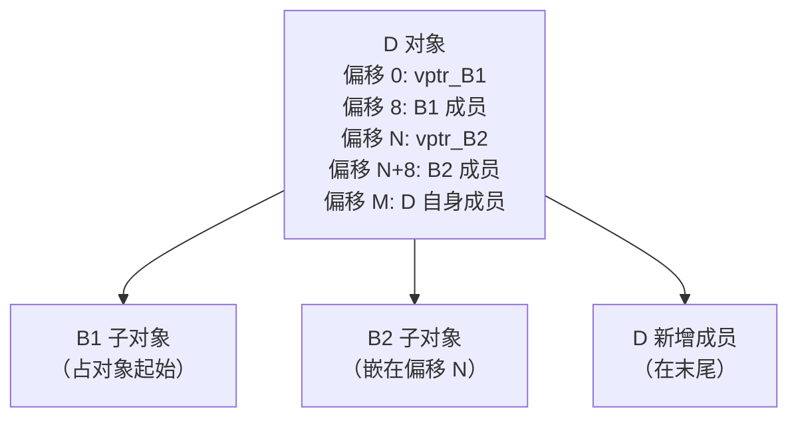
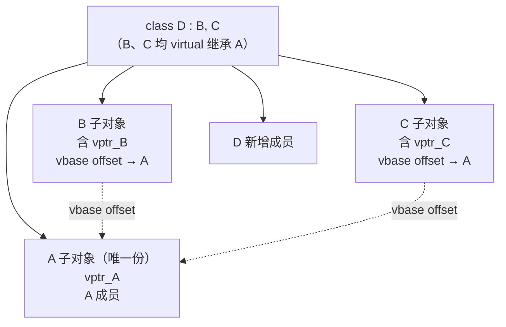

# 运行时与ABI（08）· 多重继承与虚继承布局

## 概述与定位

> [!abstract] TL;DR
> C++ 多重继承在 Itanium ABI 下的核心契约：**每个多态基类各有独立 vptr**，调用非第一基类继承来的虚函数时编译器插入 **adjustor thunk** 将 `this` 调整到正确子对象起点；vtable 前缀中的 **offset-to-top** 负偏移支持 `dynamic_cast<void*>` 和 `delete` 找回完整对象。**虚继承**通过 **vbase offset**（存于 vtable 负区）间接定位虚基类，构造期由 **VTT**（virtual table table）和 **construction vtable** 保证各级 vptr 在构造阶段指向正确的临时表。搞懂这套机制，逆向时一眼就能从多个 vptr、`sub rdi`/`add rdi` thunk、vtable 负区偏移辨认多重/虚继承结构。

多重继承与虚继承是 Itanium C++ ABI 中对象模型最复杂的部分，也是逆向 C++ 二进制时最容易踩坑的地方。上一篇 [[07.虚函数表vtable与虚调用]] 奠定了 vtable 基本结构；本篇在此基础上拆解：

- 多重继承如何布局多个 vptr 及各基类子对象；
- `this` 指针为何要调整、thunk 怎么生成、vtable 槽里放什么；
- `offset-to-top` 如何支持对象完整恢复；
- 虚继承如何用 vbase offset / VTT / construction vtable 解决菱形共享。

基准平台：**Linux x86-64 + System V AMD64 ABI + Itanium C++ ABI（GCC/Clang）**。

---

## 原理与机制

### 多重继承对象布局概览



规则摘要：
1. 第一个基类子对象与派生对象**共享起始地址（偏移 0）**，vptr_B1 同时也是 D 的 vptr；
2. 后续基类子对象**按声明序**依次内嵌，各自携带自己的 vptr；
3. 派生类新增成员放在最后；
4. 子对象的大小与对齐仍遵守各自的对齐规则，中间可能有填充。

### 虚继承（菱形）布局概览



关键约定：
- 虚基类 A 子对象**只存一份**，放在完整对象的末尾（Itanium 通常约定）；
- B 和 C 的 vtable 在负区存放 **vbase offset**（指向 A 相对自身子对象的偏移），运行时通过 `vptr[-2]`（或更深负偏移）读取后才能访问 A 成员；
- 虚基类子对象位置因具体派生而变，**无法在编译期固化为常量偏移**，必须走 vtable 间接。

---

## 结构详解

### 多重继承偏移布局图

以下面的类层次为例：

```cpp
// 基准示例
struct B1 {
    virtual void f();
    int x;          // 4 字节
};

struct B2 {
    virtual void g();
    int y;          // 4 字节
};

struct D : B1, B2 {
    virtual void f() override;  // 覆盖 B1::f
    virtual void g() override;  // 覆盖 B2::g
    int z;
};
```

`sizeof(D)` 在 x86-64 上的典型布局（无额外 padding）：

```
偏移    大小    内容
────────────────────────────────────────────────────────
 0       8     vptr_B1  →  D 的 vtable（for B1 部分）
 8       4     B1::x
12       4     (padding，使 B2 子对象对齐到 8)
16       8     vptr_B2  →  D 的 vtable（for B2 部分，含 thunk 槽）
24       4     B2::y
28       4     (padding)
32       4     D::z
36       4     (尾部 padding，sizeof(D) = 40)
```

> 注：实际偏移因编译器与字段类型不同而异，以 `g++ -fdump-lang-class` 输出为准。

对应的 vtable 结构（概念表示，非字节级布局）：

```
===  D 的 vtable（for B1/D 部分，vptr_B1 指向条目 [2]）===
[-2]  offset-to-top = 0    （B1 子对象即对象起点，偏移为 0）
[-1]  typeinfo 指针      →  D 的 typeinfo
[ 0]  D::f              →  D::f 真实实现
[ 1]  D::g              →  D::g 真实实现（D 新增虚函数，若有）

===  D 的 vtable（for B2 部分，vptr_B2 指向条目 [2]）===
[-2]  offset-to-top = -16   （B2 子对象在偏移 16，需 -16 回到对象起点）
[-1]  typeinfo 指针      →  D 的 typeinfo（同上）
[ 0]  D::g_thunk        →  adjustor thunk（this -= 16; jmp D::g）
```

> [!warning] 示例输出为示意
> 以上地址与偏移均为示例，真实值由编译器决定。可用 `g++ -fdump-lang-class foo.cpp` 或 `clang++ -Xclang -fdump-record-layouts` 验证。

### `this` 指针调整与 Adjustor Thunk

#### 为何需要调整

当 `B2* p = &d;`（`d` 是 `D` 对象），`p` 的值是 `&d + 16`（B2 子对象的起点）。若通过 `p->g()` 调用，硬件传入 `%rdi = p`，但 `D::g` 的实现内部需要访问 `D` 自身成员（偏移 32 的 `z`），这要求 `this` 指向 `D` 对象起点（`p - 16`）。

**adjustor thunk** 就是编译器自动生成的小包装：

```asm
; Intel 语法，x86-64
; D::g 对应 B2 子对象的 thunk（示意）
_ZThn16_N1D1gEv:          ; 符号名含"Thn16"表示 this -= 16
    sub    rdi, 16          ; 将 this 从 B2 子对象起点调回 D 对象起点
    jmp    _ZN1D1gEv        ; 跳转到 D::g 真实实现
```

> [!warning] 示例输出为示意
> 上述反汇编为概念示意。Itanium ABI name mangling 规定 thunk 符号名以 `_ZThn<偏移>_` 开头（负向调整）或 `_ZTh<偏移>_`（正向调整），可用 `c++filt` 解码。

vtable 中 B2 部分的 `g` 槽存放的是 **thunk 地址**，而不是 `D::g` 的直接地址。通过 `B2*` 调用时：

1. 从 `vptr_B2[0]` 取出 thunk 地址；
2. 调用 thunk，thunk 调整 `%rdi`；
3. 跳转到 `D::g` 真实实现。

通过 `D*` 或 `B1*` 调用时，走 B1/D 部分的 vtable，槽里直接放 `D::g` 真实地址（无需 thunk，因为 `this` 已经是 D 起点）。

#### Thunk 符号名规则（Itanium mangling）

```
_ZThn<调整量>_<函数 mangled 名>
```

例如：`_ZThn16_N1D1gEv` 解码为：`D::g` 的 this 调整 thunk，调整量 16（向负方向）。

### `offset-to-top` 的作用

vtable 在虚函数地址之前（负偏移 -2 位置，即 `vptr[-2]`）存放 `offset-to-top`，负偏移 -1 位置（`vptr[-1]`）存放 typeinfo 指针：

```
vptr[-2]  =  -(该子对象到完整对象起点的偏移)
vptr[-1]  =  typeinfo 指针
```

用途：
- `dynamic_cast<void*>(p)`：无论 `p` 是哪个子对象指针，读 `p->vptr[-2]` 得到负偏移，`(char*)p + offset` 即完整对象起点；
- `delete p`（多态 delete）：调用虚析构函数后，`operator delete` 需要完整对象的地址，通过 `offset-to-top` 恢复；
- 多重继承场景下，每个子对象的 vtable 都存各自的 `offset-to-top`（B1 部分为 0，B2 部分为 -16 等）。

伪代码：

```cpp
// dynamic_cast<void*>(p) 的编译器实现伪代码
void* dynamic_cast_to_void(void* p) {
    ptrdiff_t offset_to_top = *((ptrdiff_t*)*(void**)p - 2);
    return (char*)p + offset_to_top;  // offset_to_top 为负数
}
```

### 虚继承：菱形继承布局详解

#### 典型菱形结构

```cpp
struct A {
    virtual void a_method();
    int data_a;
};

struct B : virtual A {
    virtual void b_method();
    int data_b;
};

struct C : virtual A {
    virtual void c_method();
    int data_c;
};

struct D : B, C {
    virtual void d_method();
    int data_d;
};
```

`D` 对象的典型内存布局（x86-64，Itanium ABI）：

```
偏移    大小    内容
────────────────────────────────────────────────────────
 0       8     vptr_B   →  D 的 vtable（for B 部分）
                           vtable 含 vbase offset → A
 8       4     B::data_b
12       4     (padding)
16       8     vptr_C   →  D 的 vtable（for C 部分）
                           vtable 含 vbase offset → A
24       4     C::data_c
28       4     (padding)
32       4     D::data_d
36       4     (padding，使 A 对齐)
40       8     vptr_A   →  D 的 vtable（for A 部分）
48       4     A::data_a
52       4     (尾部 padding，sizeof(D) = 56)
```

> A 子对象只有一份，存在末尾，B 和 C 的 vtable 分别存有 vbase offset 指向它。

#### `vbase offset` 的位置

vbase offset 存在 vtable 的**负偏移区**（在 `offset-to-top` 和 `typeinfo` 之前）：

```
vtable（for B 部分，对应 D 对象中的 B 子对象）：
 ...
[-3]  vbase offset（B→A）= 40   （A 子对象相对 B 子对象偏移 40-0=40）
[-2]  offset-to-top = 0
[-1]  typeinfo 指针
[ 0]  B::b_method（或 D 覆盖）
[ 1]  A::a_method（通过 B 继承）
...

vtable（for C 部分，对应 D 对象中的 C 子对象）：
[-3]  vbase offset（C→A）= 24   （A 子对象在 40，C 子对象在 16，40-16=24）
[-2]  offset-to-top = -16
[-1]  typeinfo 指针
[ 0]  C::c_method
...
```

> [!warning] 示例输出为示意
> 具体负偏移索引和数值因编译器与类布局不同而异。可用 `g++ -fdump-lang-class` 输出的 vtable-groups 精确验证。

访问虚基类成员的编译器生成伪代码：

```cpp
// b_ptr->a_method() 的展开（通过 B* 访问虚基类 A 的方法）
void call_a_via_b(B* b_ptr) {
    // 从 vtable 负区读 vbase offset
    ptrdiff_t vbase_offset = b_ptr->vptr[-3];  // 示意索引
    A* a_ptr = (A*)((char*)b_ptr + vbase_offset);
    a_ptr->vptr[0](a_ptr);  // 调用 A::a_method
}
```

#### VTT（Virtual Table Table）与 Construction Vtable

**问题**：在构造 `D` 时，要先构造 `B`，但此时 `A` 尚未真正构建（D 才是分配者）。若 `B` 的构造函数用普通 vtable，vbase offset 中 A 的位置会是"相对独立 B 对象"的偏移（不适用于 D 的布局）。

**Itanium ABI 解法**：

1. **VTT（Virtual Table Table）**：每个需要虚继承的类有一张 VTT，里面是多个 vtable 指针（包括各级 construction vtable）；
2. **Construction vtable**：在构造/析构过程中临时使用的 vtable，vbase offset 和 vptr 已按"此时作为哪个完整对象的子对象"调整好；
3. **构造函数多版本**：编译器为有虚基类的类生成两个版本的构造函数：
   - **完整对象构造函数**（`C1`）：自己负责构造虚基类；
   - **基类子对象构造函数**（`C2`）：由更派生的类负责虚基类，自己只做"子对象部分"，接受 VTT 指针作为隐式参数。

```
D 的 VTT 布局（概念示意）：
[0]  D 的主 vtable指针（for D/B 部分）
[1]  D for B 的 construction vtable 指针
[2]  D for C 的 construction vtable 指针
[3]  D 的 vtable（for A 部分）指针
```

构造 `D` 时的顺序（Itanium ABI）：

```
1. 调用 A::A()（虚基类先于其他基类构造）
2. 调用 B::B(VTT*)  ← C2 版本，VTT 含 D-for-B construction vtable
3. 调用 C::C(VTT*)  ← C2 版本，VTT 含 D-for-C construction vtable  
4. 将 D 对象的 vptr 切换到 D 的最终 vtable
5. 执行 D::D() 函数体
```

每一步 `vptr` 都被设置为当前构造层次对应的（construction）vtable，以保证在构造过程中调用虚函数时行为一致。

---

## 逆向视角

### 认出 Adjustor Thunk

thunk 的特征极为明显：

```asm
; Intel 语法示意（x86-64）
; 函数符号带 _ZThn 前缀，c++filt 解码后含 "non-virtual thunk"
_ZThn16_N1D1gEv:
    sub    rdi, 0x10      ; 调整 this：0x10 == 16（B2 偏移）
    jmp    _ZN1D1gEv      ; 直接跳真实实现，无 call/ret
```

> [!warning] 示例输出为示意
> 具体偏移由类布局决定，`sub` 也可能是 `add`（正向调整，少见）。函数体只有两条指令。

识别要点：
- 只有 `sub`/`add rdi, 常量` + 单个 `jmp`，无局部变量/返回值处理；
- 符号名含 `_ZThn`（`c++filt` 输出含 "non-virtual thunk"）或 `_ZTv`（virtual thunk）；
- 从 vtable 中某槽指向此地址，通过交叉引用可找到真实函数。

### 由多 vptr 推断多重继承

在 IDA/Ghidra 中看到对象内多个 vptr 字段（偏移 0、16、32 等处各有一个指针指向不同 vtable）：

```
; 伪代码（IDA 视图，示意）
struct D {
    int64_t *vptr_B1;   // offset 0x00
    int32_t  x;
    int32_t  _pad;
    int64_t *vptr_B2;   // offset 0x10
    int32_t  y;
    ...
};
```

操作步骤：
1. 找所有对该对象的 vptr 读取（`mov rax, [rdi]` / `mov rax, [rdi+0x10]`）；
2. 追踪各 vtable，看 `offset-to-top`（vtable[-2]）：若为 0 则是第一基类，若为负值则是后续基类；
3. 多个不同的 vtable 指向同一 typeinfo → 同一完整对象类型的多个子对象视图。

### 由 vbase offset 推断虚继承

若 vtable 的负区（`vtable[-3]`、`vtable[-4]` 等）存在非零偏移值，且代码中有类似：

```asm
; Intel 语法示意
mov    rax, [rdi]            ; rax = vptr
mov    rcx, [rax - 0x18]    ; rcx = vbase offset（负区第3格，示意）
add    rdi, rcx              ; this += vbase offset → 虚基类子对象指针
call   [...]                 ; 调用虚基类方法
```

这是通过 vbase offset 访问虚基类的特征模式，说明类使用了虚继承。

### 使用工具验证

```bash
# 查看类的 vtable 与布局（GCC）
g++ -fdump-lang-class foo.cpp -c -o /dev/null

# 查看 vtable 符号
nm -C foo.o | grep vtable

# 解码 thunk 符号
echo '_ZThn16_N1D1gEv' | c++filt
# 输出（示意）：non-virtual thunk to D::g()

# 查看目标文件中的 vtable 内容（示意地址）
objdump -d -C foo.o | grep -A5 'vtable for D'
```

> [!warning] 示例输出为示意
> 上述命令的输出内容因具体代码、编译器版本和优化选项不同而异。

---

## 安全性与正确使用

### 虚继承的性能开销

| 操作 | 普通继承 | 虚继承 |
|------|---------|--------|
| 访问虚基类成员 | 直接偏移（编译期） | 经 vbase offset 间接（一次额外内存读） |
| 构造函数数量 | 1 份 | 2 份（C1 完整对象版 + C2 子对象版） |
| vtable 大小 | 无负区额外项 | 含 vbase offset 项 |
| VTT 开销 | 无 | 每个涉及虚继承的类一张 VTT |

**实践建议**：虚继承开销在深层多态类中累积明显（特别是频繁访问虚基类成员时）。非必要不用虚继承；菱形问题若能通过接口（纯虚基类，无成员）规避，代价更小。

### 常见误用与陷阱

**1. 误将虚基类构造函数调用交给中间类**

虚基类必须由**最派生类（most-derived class）**的构造函数显式初始化：

```cpp
struct A { A(int v); };
struct B : virtual A { B() : A(1) {} };  // 独立构建 B 时调用 A(1)
struct C : virtual A { C() : A(2) {} };
struct D : B, C { D() : A(99), B(), C() {} };  // D 必须也初始化 A！
// 构造 D 时：A(99) 被调用；B/C 中的 A(1)/A(2) 被忽略
```

忘记在 `D` 的成员初始化列表里写 `A(...)` 会导致调用 `A` 的默认构造函数（如果存在），而非 `B`/`C` 期望的版本——这是虚继承最常见的语义错误。

**2. 跨 ABI 边界传递含虚继承的对象**

不同编译器（如 GCC vs MSVC）的 vbase offset 存储位置、vtable 布局完全不同，**不能在 ABI 边界混用**。若需要跨边界，应使用纯 C 接口或平坦 POD 结构。

**3. MSVC ABI 的差异**

MSVC 使用完全不同的机制（vbptr — 虚基类指针，单独存字段，不存 vtable 负区），**不兼容 Itanium ABI**。逆向 Windows MSVC 二进制时：

| 机制 | Itanium (GCC/Clang/Linux) | MSVC (Windows) |
|------|--------------------------|----------------|
| vbase 定位 | vtable 负区 vbase offset | 独立 `__vbptr` 字段指向 vbtable |
| thunk 存放 | vtable 槽直接放 thunk 地址 | 隐藏调整参数或 vcall thunk |
| VTT | 有 | 无（不同机制） |
| offset-to-top | vtable[-2] | 不同位置 |

**4. `delete` 多基类子对象指针**

```cpp
B2* p = new D();
delete p;  // 正确：D 有虚析构，通过 offset-to-top 找到完整对象后 delete
```

若 `B2` 没有虚析构函数，`delete p` 只会释放 B2 子对象那块内存（即 `p` 本身，而非 `new D()` 返回的地址），导致未定义行为（堆损坏）。**多重继承基类必须有虚析构函数**，这是 `offset-to-top` 发挥作用的前提。

### 逆向安全视角

多重继承对象布局扩展了攻击面：

- **vtable 劫持**（fake vtable 攻击）：多重继承对象有多个 vptr，攻击者可伪造任意一个，只要目标代码通过该子对象 vptr 分派调用；
- **类型混淆（type confusion）**：若代码用 `reinterpret_cast` 错误地把一个多重继承对象当作其某个子对象，vptr 读取偏移错误会导致跳转到任意地址；
- **thunk 是 gadget**：adjustor thunk 只有 `sub rdi, N; jmp target` 两条指令，在 ROP 链中可用作调整寄存器值的 gadget；
- **CFI 保护**：Clang CFI（`-fsanitize=cfi-vcall`）对每个虚调用检查 vptr 指向的类型是否兼容，能缓解 vtable 劫持，但需完整链接时优化（LTO）配合。

---

## 小结

| 概念 | 核心要点 |
|------|---------|
| 多重继承布局 | 每个多态基类各一 vptr，依声明序内嵌，第一基类在偏移 0 |
| adjustor thunk | `sub/add rdi, N; jmp 真实函数`，修正 this 从子对象偏移到完整对象 |
| offset-to-top | vtable[-2]，负值，供 `dynamic_cast<void*>` 和 `delete` 恢复完整对象 |
| 虚继承 | 虚基类只存一份在末尾；vbase offset 存 vtable 负区；必须由最派生类构造 |
| vbase offset | vtable 更深负偏移处，运行时读取后确定虚基类子对象位置 |
| VTT | 一张 vtable 指针数组，用于构造/析构过程中依层次切换正确的 vtable |
| construction vtable | 构造期临时 vtable，含当前施工上下文正确的 vbase offset |
| 逆向识别 | 多 vptr → 多重继承；`sub/add rdi + jmp` → thunk；vtable 负区非零 → 虚继承 |

多重与虚继承是 Itanium C++ ABI 中机制最密集、最易出错也最值得逆向研究的部分。下一篇 [[09.RTTI与dynamic_cast]] 将在本篇 vtable/typeinfo/offset-to-top 基础上，讲清 `dynamic_cast` 如何利用 typeinfo 链在运行时做类型检查与指针调整。

---

## 相关阅读

- [[07.虚函数表vtable与虚调用]] — vtable 基本结构与虚调用分派，本篇直接依赖
- [[09.RTTI与dynamic_cast]] — RTTI typeinfo 家族与 `__dynamic_cast` 实现
- [[06.对象内存布局与this指针]] — 成员排布、对齐、EBO 基础
- [[11.ELF文件详解/51.data.rel.ro节.md]] — vtable 与 typeinfo 在 ELF 中的存储节
- [[22.调用规约/04.thiscall.md]] — `this` 作为隐藏首参（RDI）的调用规约背景
- [[33.二进制漏洞与利用基础/01.内存布局与漏洞概览.md]] — vtable 劫持与类型混淆漏洞

---

⬅️ 上一篇 [[07.虚函数表vtable与虚调用]] ｜ 🏠 [[00.C_C++运行时与ABI总览]] ｜ 下一篇 [[09.RTTI与dynamic_cast]] ➡️
