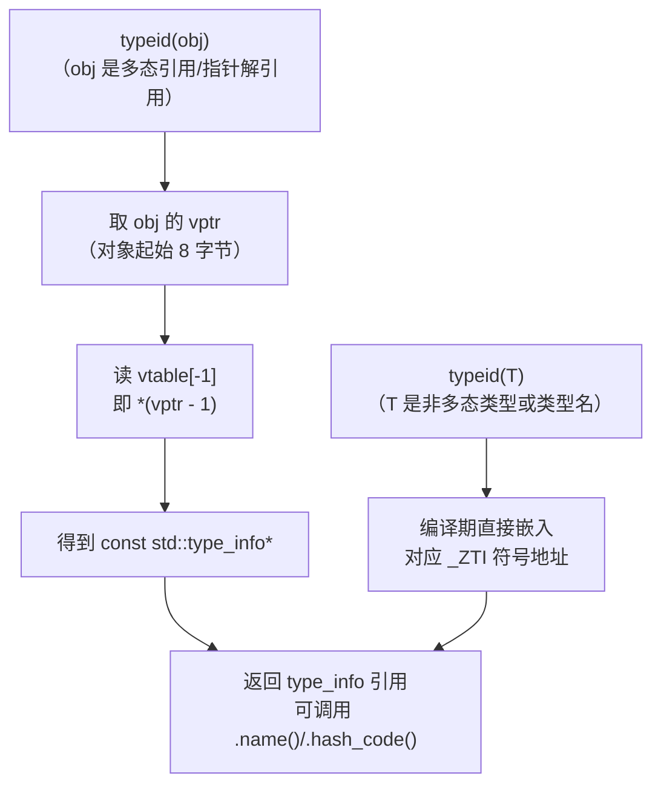
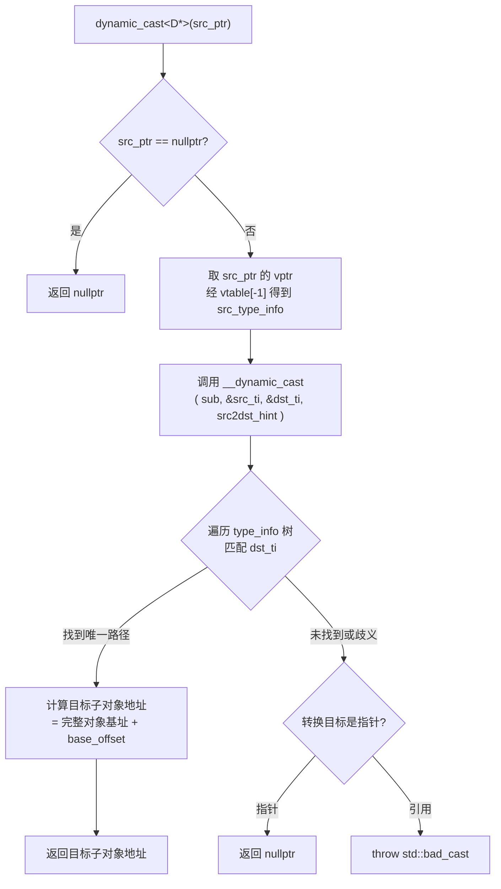

# 运行时与ABI（09）· RTTI与dynamic_cast

## 概述与定位

> [!abstract] TL;DR
> **RTTI（Run-Time Type Information）** 是 C++ 在运行时查询对象真实类型的机制，由 Itanium C++ ABI 严格规范。每个多态对象的 `vptr` 所指 vtable 的 **负偏移处（`vtable[-1]`）** 存有一个 `std::type_info*`，记录着该对象的完整类型信息。`typeid(obj)` 通过这条指针链在运行时取得类型描述符；`dynamic_cast` 则调用 `__dynamic_cast`，沿 `type_info` 家族树遍历、用 offset 计算子对象地址实现安全向下/侧向转换。逆向中，`_ZTI`（type_info）/ `_ZTS`（类名字符串）/ `_ZTV`（vtable）三类符号可直接还原完整类层次与类名，是重建 C++ 类结构的核心入口。

### 为什么要有 RTTI

C++ 多态的虚函数机制让"调用哪个实现"在运行时决策，但编译器有时需要更进一步：转型到派生类（`dynamic_cast`）、比较两个对象是否同类（`typeid`）、`catch` 子句匹配异常类型。这三种场景都需要在 **运行时** 知道对象的真实类型——静态类型系统无法独立完成这个任务。Itanium C++ ABI 因此规定了一套完整的 type_info 结构族和 `__dynamic_cast` 合约，作为编译器与运行时库共同遵守的"RTTI ABI 契约"。

与本系列的关系：
- RTTI 依附于 vtable（vtable[-1] 即 type_info 指针），与 [[07.虚函数表vtable与虚调用]] 紧密绑定。
- 多重/虚继承的 `__vmi_class_type_info` 需要理解 `offset-to-top`，与 [[08.多重继承与虚继承布局]] 直接衔接。
- type_info 对象和 vtable 本身落盘在 `[[11.ELF文件详解/51.data.rel.ro节.md]]`（加载后只读数据）。

---

## 原理与机制

### typeid 与 vtable[-1] 的获取流程



> [!note]
> 对**非多态类型**（无虚函数的类、基本类型、指针）`typeid` 是纯编译期行为，不访问 vptr；对**多态类型的空指针解引用** `typeid(*nullptr_ptr)` 则抛出 `std::bad_typeid`（Itanium ABI 要求）。

### dynamic_cast 的两阶段流程



**关键参数说明**：

| 参数 | 含义 |
|---|---|
| `sub` | 源指针（指向子对象，可能不是完整对象起始） |
| `src_ti` | 源静态类型的 `__class_type_info*` |
| `dst_ti` | 目标类型的 `__class_type_info*` |
| `src2dst_hint` | 编译器静态分析得到的偏移提示：`≥0` 表示已知偏移；`-1` 表示 src 不是 dst 的公开基类（需全遍历）；`-2` 表示 src 是虚基类 |

---

## 结构详解

### vtable 前缀布局回顾

在理解 type_info 存储前，先明确 vtable 的内存布局（Itanium ABI 规定）：

```
vtable 内存（低地址→高地址）
┌─────────────────────────────┐ ← vtable 基址
│  [−2] offset-to-top (ptrdiff_t) │  完整对象到此子对象的偏移（负值）
├─────────────────────────────┤
│  [−1] typeinfo ptr (void*)   │  ← *** type_info 指针在此 ***
├─────────────────────────────┤ ← vptr 指向此处
│  [0]  虚函数槽 0             │
│  [1]  虚函数槽 1             │
│  ...                        │
└─────────────────────────────┘
```

**`vptr` 指向虚函数槽 [0]**，因此 `typeinfo ptr = *(vptr - 1)`（8 字节对齐，x86-64）。

### std::type_info 基类

```cpp
// <typeinfo> 标准接口（简化）
namespace std {
  class type_info {
  public:
    virtual ~type_info();
    bool operator==(const type_info& rhs) const noexcept;
    bool operator!=(const type_info& rhs) const noexcept;
    bool before(const type_info& rhs) const noexcept;  // 排序（实现定义）
    size_t hash_code() const noexcept;
    const char* name() const noexcept;   // 返回 mangled name（如 "3Foo"）
  private:
    type_info(const type_info&) = delete;
    type_info& operator=(const type_info&) = delete;
  protected:
    const char* __type_name;    // mangled class name 字符串（即 _ZTS 符号）
  };
}
```

`__type_name` 指向 `.rodata` 中的 mangled 字符串（符号 `_ZTS<mangled>`）。

### Itanium type_info 三家族

Itanium C++ ABI 在 `__cxxabiv1` 命名空间中定义了三个派生类，覆盖所有继承拓扑：

#### 1. `__class_type_info`：无基类

用于**没有任何基类**的非多态类或多态类（最终根类）。

```cpp
namespace __cxxabiv1 {
  class __class_type_info : public std::type_info {
  public:
    // 仅继承自 type_info，无额外字段
    // 虚函数：__do_upcast / __do_catch（供 dynamic_cast 与 catch 使用）
    explicit __class_type_info(const char* __n)
        : std::type_info(__n) {}
    virtual ~__class_type_info();
  };
}
```

内存布局（x86-64，16 字节）：

```
__class_type_info 对象
┌───────────────────────┐
│ vptr（→ __class_type_info vtable）│  +0
│ __type_name*（→ mangled str）     │  +8
└───────────────────────┘
```

符号示例：类 `Foo` → `_ZTI3Foo`（type_info）、`_ZTS3Foo`（名称字符串 `"3Foo\0"`）

#### 2. `__si_class_type_info`：单一公有非虚直接基类

用于**只有一个公有非虚直接基类**的类（单继承最常见情形）。

```cpp
namespace __cxxabiv1 {
  class __si_class_type_info : public __class_type_info {
  public:
    const __class_type_info* __base_type;  // 指向基类的 type_info
    explicit __si_class_type_info(const char* __n,
                                   const __class_type_info* __base)
        : __class_type_info(__n), __base_type(__base) {}
    virtual ~__si_class_type_info();
  };
}
```

内存布局（x86-64，24 字节）：

```
__si_class_type_info 对象
┌───────────────────────────────────────┐
│ vptr（→ __si_class_type_info vtable）  │  +0
│ __type_name*                          │  +8
│ __base_type*（→ 基类 type_info 对象）   │  +16
└───────────────────────────────────────┘
```

符号示例：`class Derived : public Base` → `_ZTI7Derived`，其 `__base_type` 字段 = `&_ZTI4Base`

#### 3. `__vmi_class_type_info`：多重/虚/有歧义继承

用于**多重继承、虚基类、菱形继承**等复杂情形。

```cpp
namespace __cxxabiv1 {
  // 描述一个基类
  struct __base_class_type_info {
    const __class_type_info* __base_type;   // 基类 type_info 指针
    long __offset_flags;                    // 编码了 offset + 标志位
  };

  // __offset_flags 位域（Itanium ABI 规定）：
  //   低 8 位 = 标志位：
  //     位 [0] = __virtual_mask  （1 表示虚基类）
  //     位 [1] = __public_mask   （1 表示公有继承）
  //   高位（>> 8）= base offset（ptrdiff_t）：
  //     非虚基类：该基类子对象相对派生类对象起始的直接字节偏移
  //     虚基类  ：此字段为 0 或约定占位；实际位置由 __dynamic_cast
  //               通过 vtable 中的 vbase offset（运行时值）计算，
  //               不从 type_info 的 offset_flags 读取

  class __vmi_class_type_info : public __class_type_info {
  public:
    unsigned int __flags;        // 整体继承标志
    unsigned int __base_count;   // 直接基类个数
    __base_class_type_info __base_info[1];  // 柔性数组，实际 __base_count 项

    // __flags 取值（可组合）：
    //   __non_diamond_repeat_mask = 0x1  // 有非菱形重复基类
    //   __diamond_shaped_mask     = 0x2  // 有菱形继承
  };
}
```

内存布局示例（`class D : public A, virtual public B`，`__base_count=2`，x86-64）：

```
__vmi_class_type_info 对象
┌─────────────────────────────────────────────────────┐
│ +0   vptr（→ __vmi_class_type_info vtable）          │
│ +8   __type_name*                                   │
│ +16  __flags（unsigned int，4B）                     │
│ +20  __base_count（unsigned int，4B）= 2             │
│ +24  __base_info[0].__base_type*（→ A 的 type_info）│
│ +32  __base_info[0].__offset_flags                  │
│        高56位 = offset(A 在 D 中的偏移，通常 0)      │
│        bit[1]=1（public），bit[0]=0（非虚）          │
│ +40  __base_info[1].__base_type*（→ B 的 type_info）│
│ +48  __base_info[1].__offset_flags                  │
│        高56位 = 0 或编译器约定占位                   │
│        （虚基类实际位置由 __dynamic_cast 经 vtable  │
│          中的 vbase offset 计算，非此字段存储）      │
│        bit[1]=1（public），bit[0]=1（virtual）       │
└─────────────────────────────────────────────────────┘
```

### RTTI 符号命名规则

| 符号前缀 | 含义 | 示例（类 `ns::Foo`） |
|---|---|---|
| `_ZTV` | vtable | `_ZTVN2ns3FooE`（依 mangling 规则） |
| `_ZTI` | `type_info` 对象 | `_ZTIN2ns3FooE` |
| `_ZTS` | `type_info` 的名称字符串 | `_ZTSN2ns3FooE`（内容 `"N2ns3FooE\0"`） |
| `_ZTT` | VTT（virtual table table） | `_ZTTN2ns3FooE`（虚继承时） |

用 `c++filt` 解码示例：
```bash
$ c++filt _ZTI7Derived
typeinfo for Derived
$ c++filt _ZTS7Derived
typeinfo name for Derived
```

### `__dynamic_cast` 函数签名与伪代码

Itanium ABI 规定的运行时入口点：

```cpp
// 定义在 libstdc++ / libc++abi 的 dyncast.cc
extern "C"
void* __dynamic_cast(
    const void*              sub,           // 源子对象指针
    const __class_type_info* src_type,      // 源静态类型 type_info
    const __class_type_info* dst_type,      // 目标类型 type_info
    ptrdiff_t                src2dst_offset // 编译器提供的静态偏移提示
);
```

核心逻辑伪代码（基于 Itanium C++ ABI 规范 §2.9.7）：

```cpp
void* __dynamic_cast(const void* sub, const __class_type_info* src_ti,
                     const __class_type_info* dst_ti, ptrdiff_t hint) {
    // 1. 取完整对象基址：从 vptr 得 offset-to-top，加到 sub 上
    const void* vptr     = *reinterpret_cast<const void* const*>(sub);
    ptrdiff_t   off2top  = reinterpret_cast<const ptrdiff_t*>(vptr)[-2];
    const void* whole_obj = static_cast<const char*>(sub) + off2top;

    // 2. 从 vtable[-1] 取完整对象的 type_info（即最派生类型）
    const __class_type_info* whole_ti =
        *reinterpret_cast<const __class_type_info* const*>(
            static_cast<const char*>(vptr) - sizeof(void*));

    // 3. 利用 hint 快速路径
    if (hint >= 0) {
        // 编译器已知 src 在 dst 中的偏移
        const void* candidate = static_cast<const char*>(whole_obj) + hint;
        // 验证候选子对象的 type_info 链确实包含 dst_ti
        if (candidate 的 type_info 链包含 dst_ti 且可公有到达)
            return const_cast<void*>(candidate);
    }

    // 4. 慢路径：在 whole_ti 的基类树中搜索 dst_ti
    //    同时验证可达性（公有、无歧义）
    void* result = nullptr;
    bool  found_src  = false;
    bool  found_dst  = false;
    whole_ti->__do_dyncast(sub, /*sub2dst=*/ -3, dst_ti, src_ti,
                           whole_obj, result, found_src, found_dst);
    // __do_dyncast 递归遍历 __vmi_class_type_info.__base_info[]
    // 通过 __offset_flags 计算各基类子对象的地址

    return result;  // nullptr 表示失败
}
```

`__do_dyncast` 在 `__vmi_class_type_info` 中按 `__base_info[]` 遍历每个直接基类，对虚基类通过 vbase offset 定位，对非虚基类直接加 `offset_flags >> 8`，最终比较 type_info 地址确定是否匹配。

---

## 逆向视角

### 从 vtable 重建类层次的步骤

逆向 C++ 二进制时，RTTI 链是还原类层次的最可靠入口。步骤如下：

#### 步骤 1：定位 vtable 与 type_info 指针

```bash
# 列出所有 _ZTV（vtable）符号
nm -D target.so | grep ' _ZTV'
objdump -t target.so | grep _ZTV

# 读取 vtable 前缀（地址示例，非实跑）
# vtable for Derived（_ZTV7Derived）：
#   [−16字节] offset-to-top = 0
#   [−8字节]  typeinfo ptr  = &_ZTI7Derived
#   [+0]      虚函数槽[0]
```

> [!warning] 示例输出为示意

#### 步骤 2：读取 type_info 对象，识别家族

```bash
# 读 _ZTI7Derived 的 vptr，通过 vtable 类型区分 type_info 家族
# __class_type_info vtable    = _ZTVN10__cxxabiv117__class_type_infoE
# __si_class_type_info vtable = _ZTVN10__cxxabiv120__si_class_type_infoE
# __vmi_class_type_info vtable= _ZTVN10__cxxabiv121__vmi_class_type_infoE

readelf -s target.so | grep _ZTVN10__cxxabiv1
```

> [!warning] 示例输出为示意

识别规则（在 IDA/Ghidra 中观察 `_ZTI` 对象第一个字段指向的 vtable）：

| `_ZTI` 对象 vptr 指向 | type_info 家族 | 继承特征 |
|---|---|---|
| `_ZTVN10__cxxabiv117__class_type_infoE+16` | `__class_type_info` | 无基类（根类） |
| `_ZTVN10__cxxabiv120__si_class_type_infoE+16` | `__si_class_type_info` | 单一公有非虚基类 |
| `_ZTVN10__cxxabiv121__vmi_class_type_infoE+16` | `__vmi_class_type_info` | 多重/虚/菱形继承 |

#### 步骤 3：读取名称字符串（`_ZTS`）

`_ZTI` 对象 `+8` 处为 `__type_name*`，指向 mangled name 字符串（即 `_ZTS` 符号）：

```bash
# 解码类名
readelf -p .rodata target.so | grep -A1 '_ZTS'
# 或直接用 c++filt
nm target.so | grep _ZTS | while read addr t sym; do
    echo "$sym → $(c++filt $sym)"
done
```

> [!warning] 示例输出为示意

#### 步骤 4：沿 `__base_type` 递归，重建继承图

对 `__si_class_type_info`：`+16` 处 = 直接基类 `type_info*`，直接跳转读取。

对 `__vmi_class_type_info`（`+24` 起的 `__base_info[]` 数组）：

```
__base_info[i].__base_type*    → 基类 type_info（→ 递归读取）
__base_info[i].__offset_flags：
    >> 8 = 非虚基类在派生类对象中的直接字节偏移
           （虚基类时此字段为 0 或约定值，实际位置
            由 __dynamic_cast 通过 vtable vbase offset 运行时计算）
    & 1  = 1 → 虚基类（__virtual_mask）
    & 2  = 1 → 公有继承（__public_mask）
```

将所有信息汇总，即可在 IDA/Ghidra 中构造继承图：

```
（示意，非实跑）
_ZTI8Derived2 [__vmi] "Derived2"
  ├── base[0]: _ZTI4Base1 [__class] "Base1", offset=0, public, non-virtual
  └── base[1]: _ZTI4Base2 [__si]   "Base2", offset=8, public, non-virtual
       └── base: _ZTI4Root [__class] "Root"
```

> [!warning] 示例输出为示意

#### IDA/Ghidra 自动化 RTTI 解析

IDA Pro（File → Load file → FLIRT / 或 `idat -A` 批处理）和 Ghidra（RTTI Analyzer 插件）能够：
1. 识别 `_ZTVN10__cxxabiv1` 前缀的已知 vtable，标记 type_info 家族；
2. 从 `_ZTS` 字符串自动命名类；
3. 将 `_ZTV` vtable 与类名绑定，在反编译视图中恢复虚函数名；
4. 对 `__vmi_class_type_info` 展开 `__base_info[]`，画出继承关系。

对于 stripped 二进制，手动路径：**vtable[-1] → `_ZTI` → `__type_name`（`_ZTS`，`c++filt` 解码）→ 基类 `type_info` 链**——这是还原完整类名与层次的黄金链路。

---

## 安全性与正确使用

### `-fno-rtti` 的影响

编译时传入 `-fno-rtti` 会：
- 不生成 `_ZTI`/`_ZTS` 符号（无 type_info 对象）；
- 禁止 `typeid` 和 `dynamic_cast` 在**多态类型**上使用（编译报错）；
- vtable 中 `typeinfo ptr` 槽仍存在但填入 `nullptr`（GCC）或直接省略（Clang，视版本）；
- 链接混合 `-frtti`/`-fno-rtti` 的目标文件会导致 UB（type_info 不完整）。

> [!warning]
> 若在 `-fno-rtti` 编译的库中使用 `dynamic_cast`，其行为未定义——不会编译报错，但链接到其他 `-frtti` 目标时可能访问空 typeinfo 指针导致崩溃。务必保证同一链接单元中 `-frtti`/`-fno-rtti` 一致。

### RTTI 暴露类名的信息泄露面

`_ZTS` 符号存储的 mangled class name 字符串在 `.rodata` / `.data.rel.ro` 中以明文出现，即使 stripped 的二进制也保留这些字符串（它们不是符号，是数据内容）。攻击者可通过：

1. `strings target.so | grep -E '^N?[0-9]'`——匹配 mangled 名称格式，批量提取类名；
2. 对 PIE 二进制做格式化字符串泄漏或 UAF 读，将 `_ZTS` 字符串地址泄漏后辅助 vtable 定位；
3. 在堆喷/伪造对象攻击中，泄漏 `vptr` 后经 `vtable[-1]` 读到 `__type_name` 字符串，作为 vtable 真实地址的旁路信息。

这是 RTTI 天然携带的信息泄露面——与 [[33.二进制漏洞与利用基础/13.现代利用与信息泄露.md]] 直接相关。

缓解方式：
- `-fno-rtti`（代价是无法使用 `dynamic_cast`）；
- 链接时 `--strip-all`（去除符号表，但不能去除字符串数据）；
- 混淆工具（对 `_ZTS` 字符串做加密，运行时解密）——代价较大，仅用于高度安全场景。

### dynamic_cast 的性能开销

`__dynamic_cast` 的慢路径需遍历 `type_info` 基类树，时间复杂度 O(继承深度 × 宽度)。常见误用场景：

| 误用 | 代价 | 替代方案 |
|---|---|---|
| 热路径中频繁 `dynamic_cast` | 每次遍历 type_info 树 | 缓存结果或重构为访问者模式 |
| 用 `dynamic_cast` 代替 `typeid ==` 判等 | 比 `typeid` 慢（typeid 仅读 vtable[-1]） | 改用 `typeid(a) == typeid(b)` |
| 向上转型用 `dynamic_cast` | 静态已知时浪费 | 改用 `static_cast`（无运行时开销） |

`typeid` 本身：多态类型 = 一次 vptr 解引用 + 指针读取，O(1)，几乎无开销。

### dynamic_cast 与 nullptr 的正确处理

```cpp
Base* b = get_object();        // 可能为 nullptr

// 正确：先检查 nullptr
if (Derived* d = dynamic_cast<Derived*>(b); d != nullptr) {
    d->derived_method();
}

// 引用版本：失败抛 std::bad_cast
try {
    Derived& d = dynamic_cast<Derived&>(*b);  // *b 若为 nullptr → UB（不抛 bad_cast）
} catch (const std::bad_cast& e) {
    // 类型不匹配时才到这里
}
```

> [!warning]
> `dynamic_cast<T&>(*nullptr_ptr)` 是 **未定义行为**（解引用空指针），而非抛出 `bad_cast`。只有指针版本 `dynamic_cast<T*>(nullptr)` 保证返回 `nullptr`。

---

## 小结

| 知识点 | 核心结论 |
|---|---|
| type_info 位置 | vtable 负偏移处：`vptr[-1]`（即 `*(vptr - 1)`） |
| `__class_type_info` | 无基类；字段仅 `__type_name*` |
| `__si_class_type_info` | 单继承；多 `__base_type*` 指向基类 |
| `__vmi_class_type_info` | 多重/虚继承；`__flags` + `__base_count` + `__base_info[]` |
| 符号命名 | `_ZTI`=type_info，`_ZTS`=类名字符串，`_ZTV`=vtable |
| `__dynamic_cast` | 取 offset-to-top 定完整对象，遍历 type_info 树匹配目标类型 |
| 逆向价值 | vtable[-1]→`_ZTI`→`_ZTS`/`__base_info[]` 可还原完整类层次与类名 |
| `-fno-rtti` 影响 | 无 type_info/名称符号；禁用 `dynamic_cast`/`typeid` 多态用法 |
| 信息泄露面 | `_ZTS` 字符串明文存于二进制，`strings` 可直接提取类名 |

---

## 相关阅读

**本系列**：
- [[07.虚函数表vtable与虚调用]]——vtable 结构与 offset-to-top 详解
- [[08.多重继承与虚继承布局]]——VTT、construction vtable、vbase offset
- [[10.异常处理ABI与栈展开]]——`dynamic_cast` 失败抛 `bad_cast` 与异常 ABI 的交汇
- [[05.Itanium C++ ABI与name mangling]]——`_ZTI`/`_ZTS`/`_ZTV` 符号 mangling 规则

**ELF 节**：
- [[11.ELF文件详解/51.data.rel.ro节.md]]——vtable 与 type_info 对象的存储节（加载后只读）

**安全**：
- [[33.二进制漏洞与利用基础/13.现代利用与信息泄露.md]]——RTTI 字符串作为信息泄露旁路的利用技术

---

⬅️ 上一篇 [[08.多重继承与虚继承布局]] ｜ 🏠 [[00.C_C++运行时与ABI总览]] ｜ 下一篇 [[10.异常处理ABI与栈展开]] ➡️
