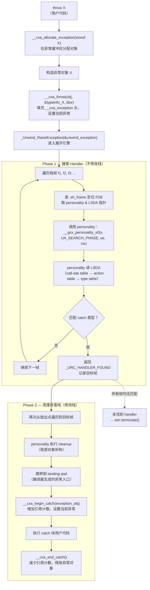

# 运行时与ABI（10）· 异常处理ABI与栈展开

## 概述与定位

> [!abstract] TL;DR
> C++ 异常处理在 Linux x86-64 上遵循 **Itanium C++ Exception ABI**，核心是"**零成本异常**"：正常执行路径无任何运行时开销，代价被转移到抛出时的表格查找上。抛出 `throw X` 会调用 `__cxa_allocate_exception`／`__cxa_throw`，随后触发 `_Unwind_RaiseException` 执行**两阶段展开**：Phase 1 遍历栈帧搜索 handler；Phase 2 再次遍历执行 cleanup 并落地到 catch 块。每个函数的 handler 与 cleanup 信息存放在 `.gcc_except_table` 的 **LSDA（Language-Specific Data Area）**中，personality routine `__gxx_personality_v0` 负责解读它。展开器靠 `.eh_frame` 的 CFI 回退帧寄存器（见第 11 章）。

异常处理 ABI 是系列中最复杂的一块，涉及四个层次：

| 层次 | 模块 | 作用 |
|---|---|---|
| C++ 语言层 | `__cxa_throw`、`__cxa_begin_catch` 等 | 管理异常对象生命周期 |
| 展开引擎层 | `_Unwind_RaiseException`、`_Unwind_Resume` | 驱动帧遍历（`libgcc_s` / `libunwind`） |
| Personality 层 | `__gxx_personality_v0` | 解读 LSDA，决定每帧动作 |
| 元数据层 | `.eh_frame`（CFI）、`.gcc_except_table`（LSDA） | 供展开器和 personality 查表 |

与本系列其他章节的关系：

- `.eh_frame` 的字节结构（CIE/FDE/CFI 操作码）见 [[11.eh_frame与DWARF_CFI]]（第 11 章）。
- `.gcc_except_table` 的节字节布局见 [[11.ELF文件详解/48.gcc_except_table节.md]]。
- 调试器复用同一套 CFI 做栈回溯见 [[44.调试器原理与实战/07.栈回溯unwind.md]]。

---

## 原理与机制

### 零成本异常的代价转移

传统异常实现（如早期 setjmp/longjmp 方案）在 `try` 入口就需要注册帧信息，正常路径也要付出开销。Itanium ABI 的方案相反：

- **正常路径**：编译器不生成任何运行时注册代码；所有 handler／cleanup 信息编译为静态表（`.gcc_except_table`），只在需要时读取。
- **异常路径**：发生 `throw` 时才查表，代价全转移到异常路径。

这就是"**零成本异常（zero-cost exception）**"的含义——正常路径代价为零，但代码体积会因表格膨胀。

### 两阶段展开流程



> [!warning] 示例输出为示意

关键要点：

- **Phase 1 不动栈**：仅读取元数据，确认有没有 catch 能接住这个异常类型，找到后记录目标帧地址。这样能在修改栈之前就知道"有人接"，若无人接则直接 `terminate`，不执行任何 cleanup。
- **Phase 2 才动栈**：从抛出点逐帧向下，对中间每帧执行 cleanup（析构局部对象），直到目标帧的 landing pad。
- 两个阶段都调用同一个 personality routine，区分靠参数 `_Unwind_Action`（`_UA_SEARCH_PHASE` vs `_UA_CLEANUP_PHASE | _UA_HANDLER_FRAME`）。

---

## 结构与流程详解

### 异常对象结构：`__cxa_exception`

展开引擎操作的最小单元是 `_Unwind_Exception`，Itanium C++ ABI 在其前面加了 C++ 专用的头部，合起来叫 `__cxa_exception`（位于 `<cxxabi.h>`）：

```c
/* 伪代码，基于 Itanium C++ ABI 规范 + GCC libstdc++ 实现 */
struct __cxa_exception {
    /* --- C++ 专用头部（在 _Unwind_Exception 之前，负偏移访问） --- */
    std::type_info   *exceptionType;    /* 异常静态类型的 typeinfo */
    void            (*exceptionDestructor)(void *); /* 析构函数指针 */
    std::unexpected_handler unexpectedHandler;
    std::terminate_handler  terminateHandler;
    __cxa_exception  *nextException;    /* 异常链（用于 rethrow） */
    int               handlerCount;     /* __cxa_begin/end_catch 引用计数 */
    int               handlerSwitchValue; /* landing pad selector */
    const char       *actionRecord;
    const char       *languageSpecificData; /* LSDA 指针 */
    _Unwind_Ptr       catchTemp;
    void             *adjustedPtr;      /* 调整后的异常对象指针（多重继承） */

    /* --- 展开引擎头部（personality 通过此结构找到 C++ 头部） --- */
    _Unwind_Exception unwindHeader;     /* 含 exception_class、cleanup 函数 */
};
```

内存布局（低地址 → 高地址）：

```
+------------------------+  ← __cxa_exception 起始
|  C++ 专用字段（负偏移）  |
|  exceptionType          |
|  exceptionDestructor    |
|  handlerCount           |
|  …                      |
+------------------------+  ← &unwindHeader（即 __cxa_throw 传给展开引擎的指针）
|  _Unwind_Exception      |  （exception_class = "GNUCC++\0"）
|  exception_cleanup      |
|  private[0,1]           |
+------------------------+  ← 这里开始是用户的异常对象（throw 的那个 X）
|  用户异常对象 X          |
+------------------------+
```

`__cxa_allocate_exception(sizeof X)` 分配的是整个结构；`__cxa_throw` 得到的 `obj` 指针指向用户对象 X 部分（`unwindHeader + 1`）。

### 抛出路径：`__cxa_throw` 伪代码

```c
/* 伪代码，基于 Itanium C++ ABI § 2.4.3 */
void __cxa_throw(void *thrown_object,
                 std::type_info *tinfo,
                 void (*dest)(void *)) {
    /* 1. 找到 __cxa_exception 头部（thrown_object 往前偏移） */
    __cxa_exception *header =
        ((__cxa_exception *)thrown_object) - 1;

    /* 2. 填充 C++ 专用字段 */
    header->exceptionType        = tinfo;
    header->exceptionDestructor  = dest;
    header->unexpectedHandler    = std::get_unexpected();
    header->terminateHandler     = std::get_terminate();
    header->handlerCount         = 0;

    /* 3. 填充展开引擎头部 */
    header->unwindHeader.exception_class   = 0x474E5543432B2B00; /* "GNUCC++\0" */
    header->unwindHeader.exception_cleanup = &__gxx_exception_cleanup;

    /* 4. 注册为当前线程的异常（线程局部存储） */
    __cxa_globals *globals = __cxa_get_globals();
    globals->caughtExceptions = header;
    globals->uncaughtExceptions++;

    /* 5. 驱动展开引擎 */
    _Unwind_RaiseException(&header->unwindHeader);

    /* 6. 如果 _Unwind_RaiseException 返回（Phase 1 遍历所有帧仍未找到 handler，
          返回 _URC_END_OF_STACK），直接调用 terminate。
          注意：此处绝不调用 __cxa_begin_catch；后者只在 Phase 2 成功落地到
          匹配的 catch 块时才被调用。 */
    __cxa_call_terminate(&header->unwindHeader);
    /* __cxa_call_terminate 内部调用 std::terminate()，不会返回 */
}
```

### LSDA 与 `.gcc_except_table`

LSDA（Language-Specific Data Area）是 personality routine 解读的元数据块，每个包含 `try`/`catch`/cleanup 的函数各有一份，存在 `.gcc_except_table` 节。结构（伪布局，字节为单位）：

```
LSDA Header
  [1B]  lpstart_encoding      /* landing pad 起始地址的编码格式（DW_EH_PE_*） */
  [?B]  lpstart              （可选，省略则为函数起始地址）
  [1B]  ttype_encoding        /* type table 条目的编码格式 */
  [ULEB]ttype_offset          /* 相对 type table 结尾的偏移 */
  [1B]  call_site_encoding    /* call-site 条目编码格式 */
  [ULEB]call_site_table_size  /* call-site table 字节数 */

Call-Site Table（紧接 header）
  每条 call-site entry:
  [?B]  cs_start   /* 调用点起始（相对 lpstart 的偏移） */
  [?B]  cs_len     /* 调用点长度 */
  [?B]  cs_lp      /* landing pad 偏移（0 = 无 landing pad，只需 unwind） */
  [ULEB]cs_action  /* action table 索引（1-based；0 = cleanup only） */

Action Table（紧接 call-site table）
  每条 action entry:
  [SLEB]ar_filter  /* 类型表索引（正数=catch类型，0=cleanup，负数=异常规格） */
  [SLEB]ar_disp    /* 下一条 action 的 SLEB 偏移（0=末尾） */

Type Table（从 ttype_offset 位置向低地址生长，逆序）
  每条 [?B] 指针：指向 std::type_info 对象（catch 的类型）
  索引 1 对应 Type Table 末尾第一条，依此类推
```

工作原理：

1. personality 先从 `.eh_frame` 的 FDE augmentation（字段 `L`）中找到该函数的 LSDA 指针。
2. 用当前 PC 在 call-site table 中二分查找，定位到对应 entry。
3. 若 `cs_lp == 0`：此调用点无 landing pad（无异常处理），继续上一帧。
4. 若 `cs_action == 0`：只有 cleanup（局部对象析构），Phase 2 会跳到 landing pad 执行析构，但 Phase 1 继续搜索。
5. 若 `cs_action > 0`：按 action table 链，逐条对比 `ar_filter` 指向的 typeinfo 与抛出异常类型（`__dynamic_cast` 语义），匹配则 Phase 1 返回 `_URC_HANDLER_FOUND`。

### `__cxa_*` 函数速查表

| 函数 | 层次 | 作用 |
|---|---|---|
| `__cxa_allocate_exception(size)` | C++ 运行时 | 从线程局部 emergency buffer 或 heap 分配异常缓冲区 |
| `__cxa_free_exception(obj)` | C++ 运行时 | 释放（引用计数降到 0 时） |
| `__cxa_throw(obj, tinfo, dtor)` | C++ 运行时 | 填充头部，调用 `_Unwind_RaiseException` |
| `__cxa_begin_catch(exc)` | C++ 运行时 | 进入 catch：增加引用计数，返回调整后的对象指针 |
| `__cxa_end_catch()` | C++ 运行时 | 离开 catch：减少引用计数，必要时释放异常对象 |
| `__cxa_rethrow()` | C++ 运行时 | `throw;`：将当前异常重新投入展开流程 |
| `__cxa_call_terminate(exc)` | C++ 运行时 | 在展开过程中调用 `terminate_handler`，最终 `abort` |
| `__gxx_personality_v0(...)` | GCC C++ | Personality routine：解读 LSDA，指导 Phase 1/2 |
| `_Unwind_RaiseException(ue)` | libgcc/libunwind | 驱动两阶段展开主循环 |
| `_Unwind_Resume(ue)` | libgcc/libunwind | Phase 2 在 cleanup landing pad 结束后继续展开 |
| `_Unwind_GetIP(ctx)` | libgcc/libunwind | 读当前帧 PC（personality 用来查 call-site） |
| `_Unwind_SetIP(ctx, val)` | libgcc/libunwind | Phase 2 中设置目标帧 PC（跳到 landing pad） |
| `_Unwind_SetGR(ctx, reg, val)` | libgcc/libunwind | 设置通用寄存器（传 exception pointer 和 selector） |

### catch 块的 landing pad 机制

编译器为每个 `try`/`catch` 生成 landing pad——一段异常入口代码，紧跟正常代码之后（或在函数末尾的 cold section）。Phase 2 中 personality 调用 `_Unwind_SetIP` 把 PC 设为 landing pad 地址，同时用 `_Unwind_SetGR` 把异常对象指针放入 `rax`（exception pointer 寄存器）、把 selector 放入 `rdx`。

landing pad 的典型汇编模式（x86-64 Intel 语法）：

```nasm
; Phase 2 personality 跳转到此
landing_pad:
    ; rax = 异常对象指针（exception pointer）
    ; rdx = selector（用于 switch 跳转到正确的 catch 分支）
    mov    [rbp-0x18], rax     ; 保存到局部变量槽（编译器分配）
    mov    [rbp-0x20], rdx

    ; 若有多个 catch，用 selector 做 switch
    cmp    rdx, 1
    je     catch_A
    cmp    rdx, 2
    je     catch_B
    ; 否则跳到 _Unwind_Resume（继续展开）

catch_A:
    ; 调用 __cxa_begin_catch，返回值为调整后的异常对象指针
    mov    rdi, rax
    call   __cxa_begin_catch
    ; ... 用户 catch 代码 ...
    call   __cxa_end_catch
    jmp    after_try
```

> [!warning] 示例输出为示意

对于仅 cleanup（局部对象析构）的 landing pad：

```nasm
cleanup_pad:
    ; rax = 异常对象指针
    mov    [rbp-0x18], rax
    ; 析构局部对象
    lea    rdi, [rbp-obj_offset]
    call   MyClass::~MyClass
    ; 继续展开，不捕获
    mov    rdi, [rbp-0x18]
    call   _Unwind_Resume      ; 把控制权还给展开引擎
```

### 终止路径：`noexcept` 与 `std::terminate`

```
noexcept 函数抛出异常
        ↓
personality 检测到此帧标记为 noexcept
        ↓
调用 std::terminate()
        ↓
__cxa_call_terminate(unwind_exception)
        ↓
调用 std::terminate_handler（默认 abort()）
```

`noexcept` 在二进制层面的实现：编译器为 `noexcept` 函数的 LSDA call-site table 生成一条覆盖整个函数体的条目，`cs_lp` 指向一个特殊的 terminate landing pad，该 pad 直接调用 `__cxa_call_terminate`。

未捕获异常（Phase 1 搜遍所有帧仍无 handler）：`_Unwind_RaiseException` 返回 `_URC_END_OF_STACK`，`__cxa_throw` 此时直接调用 `std::terminate()`（实现上通常经 `__cxa_call_terminate`）。**`__cxa_begin_catch` 不会被调用**——它只在 Phase 2 成功落地到匹配的 catch 块时才调用。

---

## 逆向视角

### 认出 landing pad

在反汇编中，landing pad 通常有以下特征：

1. **不在正常控制流中**：landing pad 不被正常 `jmp`/`call` 跳转覆盖，只被展开引擎"隐式跳转"。
2. **两个寄存器入参**：`rax`（exception ptr）和 `rdx`（selector），紧接着有 `call __cxa_begin_catch` 或 `call _Unwind_Resume`。
3. **位置**：常在函数末尾，或编译器的 `-freorder-blocks` 把 cold 代码集中到后面。

用 `objdump` 识别：

```bash
# 查看函数反汇编，寻找 __cxa_begin_catch 调用
objdump -d -C ./a.out | grep -A5 '__cxa_begin_catch'
```

> [!warning] 示例输出为示意

### 认出 personality 函数

在 `.eh_frame` 的 CIE 的 augmentation 数据中（augmentation string 含 `P`），存有 personality routine 的地址（或 PC-relative 编码）：

```bash
readelf --debug-dump=frames ./a.out | head -40
```

输出示例（示意）：

```
00000000 0000001c 00000000 CIE
  Version:               1
  Augmentation:          "zPLR"
  Code alignment factor: 1
  Data alignment factor: -8
  Return address column: 16
  Augmentation data:     0x03 0xXXXXXXXX   ← P: personality = __gxx_personality_v0
                         0x1b               ← L: LSDA encoding = DW_EH_PE_pcrel|sdata4
                         0x1b               ← R: FDE encoding
```

> [!warning] 示例输出为示意

### 定位并解读 `.gcc_except_table`

```bash
# 查看节是否存在及大小
readelf -S ./a.out | grep gcc_except

# 十六进制 dump
readelf -x .gcc_except_table ./a.out

# objdump 可能直接标注 LSDA
objdump -d -C --dwarf=exception_table ./a.out
```

> [!warning] 示例输出为示意

在 IDA Pro / Ghidra 中，反编译器一般能自动识别 LSDA 并在 try 块上注释 catch 类型；若无法自动识别（stripped binary），可手动从 `.eh_frame` FDE 的 augmentation 字段提取 LSDA 偏移，再跳到 `.gcc_except_table` 对应位置手动解析 call-site table。

### 认出 `__cxa_exception` 头部

在堆分析或 GDB 中，异常对象的 `_Unwind_Exception` 处可以检验 `exception_class` 字段：

```text
(gdb) x/2gx exception_ptr
0x555555778eb0: 0x474e5543432b2b00   ← "GNUCC++\0"（小端，逆序读）
0x555555778eb8: 0x00007ffff7ba7f40   ← exception_cleanup 函数指针
```

> [!warning] 示例输出为示意

往低地址偏移 `sizeof(__cxa_exception) - sizeof(_Unwind_Exception)` 即可找到 `exceptionType`（`std::type_info*`），用 `typeid` 机制（见第 9 章 RTTI）还原类型名。

---

## 安全性与正确使用

### 异常安全保证

| 保证等级 | 含义 | 实现要求 |
|---|---|---|
| 基本保证（Basic） | 异常后对象处于有效但未指定状态，无资源泄漏 | 析构函数不抛出；RAII |
| 强保证（Strong） | 异常后状态不变（commit-or-rollback） | copy-and-swap / transactional |
| 无抛出保证（Nothrow） | 不抛出异常，标记 `noexcept` | 所有路径无 `throw` |

析构函数应始终标为 `noexcept`（C++11 起默认如此）。若析构函数在 Phase 2 cleanup 期间抛出异常，将有两个活跃异常，导致 `std::terminate`。

### `noexcept` 与终止

```cpp
void f() noexcept {
    throw std::runtime_error("oops"); // 直接 terminate，无 Phase 1
}
```

`noexcept` 的 ABI 含义：personality 为此函数生成 terminate landing pad，Phase 2 遇到时调用 `std::terminate` 而非继续展开。这比"编译时保证无 throw"更严格——即使内部间接调用了会抛出的函数，也是 terminate 而非传播。

在 ABI 边界（动态库接口）暴露 C++ 异常是危险的：

- 两侧必须用同一异常 ABI（Itanium ABI 不兼容 MSVC SEH）。
- 两侧必须链接相同的 `libstdc++`（或 `libc++`），否则 `typeinfo` 地址比较失效，`catch` 可能漏接。
- C 接口（`extern "C"`）必须用 `noexcept` 或 `try...catch` 包裹，绝不能让 C++ 异常越过 C ABI 边界。

### 异常跨 ABI 边界的风险

```
[库 A，libstdc++] → throw MyException
        ↓ 穿越 dlopen 边界
[库 B，libc++]    → catch(MyException &)  ← 永远不会匹配
                                            （typeinfo 地址来自不同 DSO）
```

类型匹配规则：Itanium ABI 先比较 `typeinfo` 指针地址（同一 DSO 中指针相同），失败时再比较 `type_info::name()` 字符串（跨 DSO）。若链接时使用 `-Bsymbolic` 或 visibility 设置不当，`typeinfo` 地址会因 DSO 隔离而不同，字符串比较才是最后防线。

### 常见陷阱

| 陷阱 | 后果 | 解法 |
|---|---|---|
| 析构函数抛出异常 | Phase 2 cleanup 中 terminate | 析构函数标 `noexcept`，内部 `try-catch` 吞掉异常 |
| `catch(...)` 滥用后不 rethrow | 掩盖错误类型 | 仅作日志/清理用，必须 `throw;` 重新抛出 |
| 跨 DSO C++ 异常 | typeinfo 不匹配，catch 漏接 | 接口层 `noexcept` + 错误码，或确保统一运行时 |
| `noexcept` 函数调用可能抛出的函数 | terminate（非 propagate） | 仔细审查调用链，或在 `noexcept` 内部 try-catch |
| 多线程中 `__cxa_get_globals` | 每线程独立，交叉不受影响 | 理解 TLS，不人为跨线程传 exception 指针 |

---

## 小结

- Itanium C++ 异常 ABI 采用**两阶段展开**：Phase 1 只搜索、不修改栈；Phase 2 执行 cleanup 并落地到 landing pad。这保证了"要么有人接、要么 terminate"的强语义。
- 抛出路径：`throw X` → `__cxa_allocate_exception` → 构造 X → `__cxa_throw` 填充 `__cxa_exception` 头 → `_Unwind_RaiseException` 驱动展开引擎。
- personality routine `__gxx_personality_v0` 是 C++ 语言与展开引擎的桥梁，通过读取 **LSDA（`.gcc_except_table`）** 的 call-site table／action table／type table 决定每帧的动作。
- 展开引擎靠 **`.eh_frame`** 的 CFI 在帧间回退寄存器（详见第 11 章），personality 指针与 LSDA 指针由 FDE 的 augmentation 引出。
- **零成本异常**：正常路径无运行时开销，代价仅在抛出时的表格查找上，代价是目标文件体积因 `.gcc_except_table` 和 `.eh_frame` 膨胀。
- `noexcept` 违反、析构函数抛出、未捕获异常均导致 `std::terminate`；C++ 异常不得跨语言 ABI 边界传播。

---

## 相关阅读

- **CFI 与 `.eh_frame` 字节结构**：[[11.eh_frame与DWARF_CFI]]
- **`.gcc_except_table` 节完整字节布局**：[[11.ELF文件详解/48.gcc_except_table节.md]]
- **`.eh_frame` 节字节布局**：[[11.ELF文件详解/46.eh_frame节.md]]
- **调试器栈回溯（复用同一 CFI）**：[[44.调试器原理与实战/07.栈回溯unwind.md]]
- **RTTI 与 typeinfo（catch 类型匹配所需）**：[[09.RTTI与dynamic_cast]]
- **动态链接器初始化顺序**：[[14.动态链接与加载器详解/11.初始化与析构顺序.md]]

---

⬅️ 上一篇 [[09.RTTI与dynamic_cast]] ｜ 🏠 [[00.C_C++运行时与ABI总览]] ｜ 下一篇 [[11.eh_frame与DWARF_CFI]] ➡️
