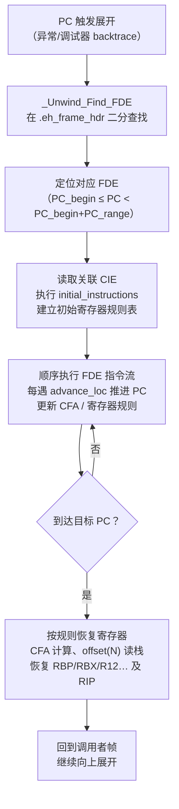

# 运行时与ABI（11）· eh_frame 与 DWARF CFI

## 概述与定位

> [!abstract] TL;DR
> `.eh_frame` 是 ELF 二进制中常驻内存（`SHF_ALLOC`）的展开表，由一系列 **CFI（Call Frame Information）** 记录组成。CFI 告诉运行时"在任意指令地址处，如何从当前寄存器恢复调用者的栈帧"——具体说就是 **CFA（Canonical Frame Address）** 的计算方式，以及每个被调用者保存寄存器在哪里。这张表有两个使用者：① **C++ 异常两阶段展开**（第 10 章，`_Unwind_RaiseException` 逐帧回退）；② **调试器栈回溯**（GDB/LLDB `backtrace`）。即便二进制被 stripped，`.eh_frame` 仍然存在，仍能做可靠回溯——这是它与 `.debug_frame` 最根本的区别。

CFI 的核心结构是两种记录：

- **CIE（Common Information Entry）**：描述一组 FDE 共享的元信息（版本、增强串、对齐因子、初始寄存器状态）。
- **FDE（Frame Description Entry）**：描述一个具体函数（PC 范围）在其生命周期内各指令处的展开规则变化序列。

与 [[11.ELF文件详解/46.eh_frame节.md]] 互补：那篇聚焦"节的字节格式与字段布局"，本篇聚焦"运行时如何使用 CFI 来恢复寄存器、做帧间展开，以及调试器如何依赖它做栈回溯"。

---

## 原理与机制

### CFI 状态机概念

CFI 把每个函数的展开信息编码为一段**字节码指令流**（`DW_CFA_*`）。运行时把它当作虚拟机来执行：从 CIE 给定的**初始状态**出发，按 FDE 中的指令流**逐步推进 PC**，在每个指令位置更新"寄存器规则表"。当需要展开时，展开器定位目标 PC 所在的 FDE，重放指令流直到当前 PC，便得到该处的完整恢复规则。

### CFA——所有规则的基准

**CFA（Canonical Frame Address）** 是栈展开的基准地址，其语义为：

> **被调用者（callee）入口时，调用者（caller）RSP 的值。**

由于 `call` 指令把 8 字节返回地址压栈，函数一进入时 `RSP` 已下移 8 字节，因此：

```
CFA = RSP + 8          （函数入口，尚未执行 push rbp）
```

执行 `push rbp` 后，RSP 再减 8，CFA 不变（仍是入口时 RSP），但规则改为 `CFA = RSP + 16`；执行 `mov rbp, rsp` 后可改用 `RBP` 定义 CFA（`CFA = RBP + 16`），使 CFA 在函数体中保持稳定。

所有寄存器的恢复位置（"在栈上哪里"）均**相对 CFA 表达为偏移**，返回地址也是一条规则（通常 `ra at CFA-8`）。

### 展开状态机流图



---

## 结构详解

### CIE 字段

| 字段 | 宽度 | 说明 |
|------|------|------|
| `length` | 4 B | 从 `CIE_id` 到记录末尾的字节数；`0xffffffff` 表示 64-bit 扩展格式 |
| `CIE_id` | 4 B | CIE 固定为 `0`；FDE 中为指向关联 CIE 的偏移（非零可区分） |
| `version` | 1 B | `1` = DWARF2；`3` = DWARF3（带符号 data_alignment_factor） |
| `augmentation` | NUL 结尾串 | 控制扩展字段：`""` / `"zR"` / `"zPLR"` 等（见下文） |
| `code_alignment_factor` | ULEB128 | `advance_loc` delta 乘以此值得字节偏移；x86-64 通常为 1 |
| `data_alignment_factor` | SLEB128 | `offset` 操作数乘以此值得字节偏移；x86-64 通常为 `-8` |
| `return_address_register` | ULEB128 | 返回地址寄存器编号；x86-64 为 `16`（`rip`） |
| `augmentation_data_length` | ULEB128 | 仅 augmentation[0]=='z' 时存在 |
| `augmentation_data` | 变长 | 按 augmentation 字符含义依次排列（P/L/R 编码及指针） |
| `initial_instructions` | 字节码 | 所有 FDE 共享的初始寄存器规则，通常设 `CFA = RSP+8` 并记录 `rip at CFA-8` |
| `padding` | — | NOP 填充，使记录总长度按指针大小对齐 |

**augmentation 字符含义：**

| 字符 | 位置 | 含义 |
|------|------|------|
| `z` | 首位 | 存在 `augmentation_data_length`；使解析器可跳过未知字段 |
| `R` | CIE aug_data（1 B） | FDE 中 PC_begin/PC_range 的 `DW_EH_PE_*` 编码方式 |
| `P` | CIE aug_data（1 B 编码 + 指针） | personality routine 指针（如 `__gxx_personality_v0`） |
| `L` | CIE aug_data（1 B 编码）；FDE aug_data（指针） | LSDA 指针编码（CIE）与实际 LSDA 指针（FDE） |

常见组合：`"zR"` 仅紧凑编码 PC，用于纯 C 函数；`"zPLR"` 完整 C++ 异常支持（含 personality + LSDA + PC 编码）。

### FDE 字段

| 字段 | 宽度 | 说明 |
|------|------|------|
| `length` | 4 B | 从 `CIE_pointer` 到记录末尾的字节数 |
| `CIE_pointer` | 4 B | 本字段地址减去关联 CIE 起始地址的偏移（正值，非零） |
| `PC_begin` | 编码 | 函数起始地址，编码方式由 CIE 的 R 字符指定 |
| `PC_range` | 编码 | 函数代码字节数 |
| `augmentation_data_length` | ULEB128 | 仅 CIE aug 含 `z` 时存在 |
| `augmentation_data` | 变长 | 含 `L` 时包含 LSDA 指针（供 `_Unwind_GetLanguageSpecificData` 取用） |
| `call_frame_instructions` | 字节码 | 在 CIE `initial_instructions` 基础上的差分指令序列 |
| `padding` | — | NOP 对齐填充 |

### 寄存器规则类型

每个寄存器在每个 PC 处有且仅有一条规则：

| 规则 | CFI 指令 | 含义 |
|------|---------|------|
| `undefined` | `DW_CFA_undefined(reg)` | 调用者的该寄存器值无法恢复（已被覆盖） |
| `same_value` | `DW_CFA_same_value(reg)` | 函数未修改该寄存器，值与调用者相同 |
| `offset(N)` | `DW_CFA_offset(reg, N)` | 值在 `CFA + N × data_align` 处的内存（已压栈） |
| `register(R)` | `DW_CFA_register(reg1, reg2)` | 值当前在另一个寄存器 reg2 中 |
| `expression` | `DW_CFA_expression(reg, expr)` | 值在 DWARF 表达式计算地址处 |
| `val_expression` | `DW_CFA_val_expression(reg, expr)` | 值由 DWARF 表达式直接给出（非地址） |

**返回地址规则**：在 x86-64 上，CIE initial_instructions 通常设 `DW_CFA_offset: r16 (rip) at cfa-8`，表示返回地址（即调用者的下一条指令 PC）保存在 `CFA - 8` 处（即 `call` 压栈的那 8 字节）。

### 常用 DW_CFA_* 指令

| 指令 | 作用 |
|------|------|
| `DW_CFA_def_cfa(reg, offset)` | 设 `CFA = reg + offset`（函数入口典型：`rsp + 8`） |
| `DW_CFA_def_cfa_offset(offset)` | 仅更新 CFA 偏移，寄存器不变（每次 push 后偏移增大） |
| `DW_CFA_def_cfa_register(reg)` | 仅更换 CFA 寄存器，偏移不变（`mov rbp, rsp` 后切换到 RBP） |
| `DW_CFA_def_cfa_expression(expr)` | 用 DWARF 表达式计算 CFA（复杂栈帧，如 `alloca`） |
| `DW_CFA_offset(reg, N)` | 记录 reg 保存在 `CFA + N × data_align` |
| `DW_CFA_restore(reg)` | 将 reg 规则恢复为 CIE 初始状态（函数尾声） |
| `DW_CFA_advance_loc(delta)` | PC 推进 `delta × code_align` 字节（对应一段指令） |
| `DW_CFA_advance_loc1/2/4` | 更大 delta 的变体（1/2/4 字节操作数） |
| `DW_CFA_remember_state` | 压栈当前规则表快照（用于尾声与序言交叉的复杂函数） |
| `DW_CFA_restore_state` | 弹栈恢复规则快照 |
| `DW_CFA_nop` | 无操作，用于填充对齐 |

### 典型 x86-64 函数序言：CFI 指令序列示意

下面以标准序言 `push rbp; mov rbp, rsp` 为例，展示 CIE 初始规则和 FDE 指令流共同描述的规则演进：

```
# ── CIE initial_instructions（所有 FDE 共享的起点）──
DW_CFA_def_cfa: r7 (rsp) ofs 8      # 入口：CFA = RSP + 8（返回地址已压栈）
DW_CFA_offset:  r16 (rip) at cfa-8  # rip（返回地址）在 CFA-8 = RSP 处

# ── FDE call_frame_instructions（差分描述本函数）──

# 指令 push rbp（1 字节）
DW_CFA_advance_loc: 1               # PC 推进 1 字节
DW_CFA_def_cfa_offset: 16           # RSP 减了 8 → CFA = RSP + 16
DW_CFA_offset: r6 (rbp) at cfa-16  # rbp 保存在 CFA-16 = RSP 处

# 指令 mov rbp, rsp（3 字节）
DW_CFA_advance_loc: 3               # PC 推进 3 字节
DW_CFA_def_cfa_register: r6 (rbp)  # 改用 rbp 定义 CFA（CFA = RBP + 16，稳定）

# 函数尾声：pop rbp; ret
DW_CFA_advance_loc: <body_size>
DW_CFA_def_cfa: r7 (rsp) ofs 8     # 切回 RSP（rbp 已 pop，RSP 恢复）
DW_CFA_restore: r6 (rbp)            # rbp 恢复为初始规则（same_value 或 CIE 状态）
```

通过上述指令流，展开器在函数体任意 PC 处都能精确计算 CFA 并定位被调用者保存寄存器的值。

### 解码后规则表示意

`readelf --debug-dump=frames-interp` 会把指令流"解释展开"成一张表：

```text
# 示例输出为示意
# LOC          CFA        rbp         rip
# 00400690     rsp+8      u           c-8
# 00400691     rsp+16     c-16        c-8
# 00400694     rbp+16     c-16        c-8
# ...（函数体，CFA 稳定在 rbp+16）
# 00400714     rsp+8      r            c-8
```

> [!warning] 示例输出为示意

其中 `c` 代表 CFA，`r` 代表 `same_value`，`u` 代表 `undefined`。

---

## 实战

### readelf / objdump 读 frames

```bash
# 解析所有 CIE/FDE，逐字段显示（最常用）
readelf --debug-dump=frames a.out

# 以"解释后"规则表形式展示（直观）
readelf --debug-dump=frames-interp a.out

# objdump 风格（输出格式略有不同）
objdump --dwarf=frames a.out

# llvm-dwarfdump（Clang 工具链）
llvm-dwarfdump --eh-frame a.out

# 查看原始十六进制
readelf -x .eh_frame a.out
objdump -s -j .eh_frame a.out
```

示例输出片段：

```text
# 示例输出为示意
The section .eh_frame contains:

00000000 0000001c 00000000 CIE "zR" cf=1 df=-8 ra=16
  DW_CFA_def_cfa: r7 (rsp) ofs 8
  DW_CFA_offset: r16 (rip) at cfa-8
  DW_CFA_nop

00000020 00000044 00000024 FDE cie=00000000 pc=004006b0..00400715
  DW_CFA_advance_loc: 1 to 004006b1
  DW_CFA_def_cfa_offset: 16
  DW_CFA_offset: r6 (rbp) at cfa-16
  DW_CFA_advance_loc: 3 to 004006b4
  DW_CFA_def_cfa_register: r6 (rbp)
  DW_CFA_advance_loc: 97 to 00400715
  DW_CFA_def_cfa: r7 (rsp) ofs 8
  DW_CFA_nop
```

> [!warning] 示例输出为示意

解读要点：`CIE "zR"` 表示 augmentation 为 `zR`，`cf=1` 为 code_alignment_factor，`df=-8` 为 data_alignment_factor；FDE 的 `pc=004006b0..00400715` 是函数覆盖的 PC 区间。

### .eh_frame_hdr：二分查找索引

`.eh_frame_hdr` 节提供一个按 PC 排序的 FDE 地址表（`DW_EH_PE_pcrel` 编码），运行时通过 `_Unwind_Find_FDE` 对其**二分查找**，快速定位目标 FDE，避免线性扫描整个 `.eh_frame`。

```text
# .eh_frame_hdr 结构（示意）
version: 1
eh_frame_ptr_enc:  0x1b (pcrel|sdata4)
fde_count_enc:     0x03 (udata4)
table_enc:         0x3b (datarel|sdata4)
eh_frame_ptr:      <.eh_frame 起始地址>
fde_count:         <FDE 总数>
# 排序表：[(PC_begin, FDE_offset), ...]
```

> [!warning] 示例输出为示意

### 用 GDB / LLDB 查看展开信息

```bash
# GDB 内部即用 .eh_frame 做栈回溯
(gdb) backtrace
(gdb) info frame          # 显示当前帧的 CFA 和寄存器保存位置

# LLDB 同样依赖 .eh_frame
(lldb) thread backtrace
(lldb) frame info

# 验证 stripped 后仍可回溯（.eh_frame 不被 strip --strip-debug 删除）
strip --strip-debug a.out
readelf -S a.out | grep eh_frame   # 仍然存在
```

### pyelftools 编程解析

```python
from elftools.elf.elffile import ELFFile

with open('a.out', 'rb') as f:
    elf = ELFFile(f)
    if elf.has_dwarf_info():
        dwarf = elf.get_dwarf_info()
        for cfi in dwarf.CFI_entries():
            if cfi.__class__.__name__ == 'CIE':
                print(f"CIE version={cfi['version']} aug='{cfi['augmentation']}'")
                print(f"  code_align={cfi['code_alignment_factor']}")
                print(f"  data_align={cfi['data_alignment_factor']}")
            else:  # FDE
                pc_begin = cfi['initial_location']
                pc_end   = pc_begin + cfi['address_range']
                print(f"FDE PC 0x{pc_begin:x}..0x{pc_end:x}")
```

---

## ARM 异常处理 ABI（EHABI）

### ARM EHABI（.ARM.exidx / .ARM.extab）

ARM32 平台采用了与 DWARF CFI **完全不同**的异常处理方案——**ARM Exception Handling ABI（EHABI）**，通过两个专用节（`.ARM.exidx` 与 `.ARM.extab`）描述展开信息，而非使用 `.eh_frame`。AArch64（ARM64）则回归 DWARF CFI，与 x86-64 的 `.eh_frame` 方案对齐。

#### 设计动机

ARM32 嵌入式场景对**代码体积**极为敏感，DWARF CFI 的字节码相对冗长。ARM EHABI 设计了更紧凑的编码：每个函数只需 2 个 32 位字（8 字节）的索引条目，常见的简单函数（仅使用 push/pop 保存寄存器）甚至可以把完整展开指令内联进索引表，无需额外的 `.ARM.extab` 条目。

#### .ARM.exidx：异常索引表

`.ARM.exidx` 是**异常索引表**，按函数地址排列，每个条目固定为 **2 个 32 位字（word）**：

```
.ARM.exidx 布局（每个条目 8 字节）：
┌──────────────────────────────────────┐
│  Word 0：函数起始地址（PREL31 编码）  │  ← 相对于本字段地址的有符号 31 位偏移
├──────────────────────────────────────┤
│  Word 1：展开信息                    │  ← 取值规则见下表
└──────────────────────────────────────┘
```

**PREL31 编码**：Word 0 的低 31 位是相对于该字段自身地址的有符号偏移（bit31 = 0），用于计算函数的绝对地址。运行时二分查找此表（按函数地址排序）定位目标函数。

**Word 1 取值规则**：

| Word 1 值 | 含义 |
|-----------|------|
| `0x00000001`（`EXIDX_CANTUNWIND`）| 函数不可展开（如纯汇编叶函数、无需展开的函数）；若异常传播到此帧，直接 `terminate()` |
| `bit31 == 1`（bit31 置1，bit30:0 为展开指令）| **内联展开指令**：3 字节展开字节码直接嵌入 Word 1（适合简单函数，无需 `.ARM.extab`）|
| `bit31 == 0` 且非 CANTUNWIND | **PREL31 指向 `.ARM.extab` 条目**：bit30:0 为相对偏移，指向该函数在 `.ARM.extab` 中的完整展开描述 |

内联展开指令格式（Word 1，bit31 = 1 时）：

```
Word 1 = 0x80xxxxxx（高字节为 personality 选择子 0x80 = pr0）
  高字节 [31:24]：0x80（代表 compact model 0，单字内联）
  次字节 [23:16]：展开指令字节 1
  再次字节 [15:8]：展开指令字节 2
  低字节  [7:0]：展开指令字节 3（0xB0 = FINISH 结束标记）
```

示例：函数只做 `PUSH {r4, lr}` / `POP {r4, pc}` 的典型序言/尾声：

```
Word 1 = 0x84048400
  0x84 = 选用 compact pr1（2字段内联）
  0x04 = vsp += 4*1（调整栈指针）
  0x84 = 恢复 r4
  0x00 = 恢复 lr → pc（返回）
```

> [!warning] 展开指令字节码取值为示意

#### .ARM.extab：展开指令表

当 `.ARM.exidx` Word 1 不足以内联（函数较复杂、保存了更多寄存器、或需要 personality 指针），Word 1 指向 `.ARM.extab` 中的条目：

```
.ARM.extab 条目格式（变长，首字决定后续结构）：
┌──────────────────────────────────────────────────┐
│  Word 0：personality routine 编码                 │
│    bit31 == 1：compact model（0x81/0x82 前缀）   │
│    bit31 == 0：PREL31 指向 personality 函数地址  │
├──────────────────────────────────────────────────┤
│  后续展开指令字节流（依 personality 决定字节数）  │
├──────────────────────────────────────────────────┤
│  （可选）LSDA 指针（PREL31），供 personality 使用│
└──────────────────────────────────────────────────┘
```

ARM EHABI 定义了三种**紧凑 personality routine**（编号 pr0/pr1/pr2），对应不同的展开字节数：

| Personality | 标识 | 展开指令字节数（不含首字） | 典型用途 |
|-------------|------|--------------------------|---------|
| `__aeabi_unwind_cpp_pr0` | `0x80xxxxxx` | 3 字节（内联在首字余下3字节）| 极简函数，无 LSDA |
| `__aeabi_unwind_cpp_pr1` | `0x81xxxxxx` | 首字 3 字节 + 可选附加字（`0x81<<16` 的 extra-words 字段）| 普通 C++ 函数（含 LSDA）|
| `__aeabi_unwind_cpp_pr2` | `0x82xxxxxx` | 同上，更多字 | 大型函数 |

**展开指令字节码**（部分常用指令，完整列表见 ARM IHI0038B）：

| 字节值范围 | 含义 |
|-----------|------|
| `0x00–0x3f` | `vsp += (uleb * 4) + 4`（栈指针向上调整）|
| `0x40–0x7f` | `vsp -= (uleb * 4) + 4`（栈指针向下调整）|
| `0x80–0x8f + 次字节` | 恢复 r0–r15 中的若干寄存器（位图）|
| `0x90–0x9f` | `vsp = core register[Rn]`（从寄存器设置 vsp）|
| `0xa0–0xaf` | 恢复 r4–r{4+nnn} 以及可选的 r14 |
| `0xb0` | FINISH（结束展开字节流）|
| `0xb1 00 xx` | 恢复 r0–r3（低字节寄存器列表）|
| `0xc0–0xcf` | 恢复 VFP 双精度寄存器（fstmfdx）|

查看工具：

```bash
# objdump 可解码 ARM 展开表
arm-linux-gnueabi-objdump -d --exception a.out

# readelf 查看 .ARM.exidx 原始内容
arm-linux-gnueabi-readelf -u a.out

# llvm 工具链
llvm-readelf --unwind a.out
```

#### 与 DWARF CFI（.eh_frame）的模型对比

| 维度 | DWARF CFI（`.eh_frame`）x86-64/AArch64 | ARM EHABI（`.ARM.exidx/.ARM.extab`）ARM32 |
|------|----------------------------------------|-------------------------------------------|
| 索引结构 | `.eh_frame_hdr` 排序表，4+4 字节/条目 | `.ARM.exidx` 排序表，**8 字节固定**/ 条目 |
| 展开指令编码 | DWARF `DW_CFA_*` 字节码（通用、冗长）| ARM 自定义字节码（紧凑、ARM 专用）|
| 内联展开 | 否，FDE 中的指令流独立 | **支持**：简单函数 3 字节内联进 Word 1 |
| 不可展开标记 | `DW_CFA_undefined` + 特殊 personality | `EXIDX_CANTUNWIND`（单值 `0x00000001`）|
| 节地址 | `SHF_ALLOC`（常驻进程地址空间）| `.ARM.exidx` 亦有 `SHF_ALLOC`，运行时可读 |
| 指针编码 | `DW_EH_PE_*`（pcrel/datarel/uleb 等）| PREL31（固定 31 位 PC 相对有符号偏移）|
| personality 调用 | CIE augmentation `P` 字段指针 | `.ARM.extab` 首字嵌入 PREL31 或紧凑编号 |
| LSDA | FDE augmentation `L` 字段 | `.ARM.extab` 末尾 PREL31 指针 |
| 工具 | `readelf --debug-dump=frames` | `readelf -u` / `arm-objdump --exception` |

#### AArch64 回归 DWARF CFI

AArch64（ARM64）**放弃了 ARM EHABI**，转而使用与 x86-64 相同的 DWARF CFI + `.eh_frame` 方案：

- AArch64 寄存器更多（X0–X30、SP、NZCV、V0–V31），DWARF 的通用字节码更适合描述复杂的寄存器保存规则。
- AArch64 不再有对代码体积的极端限制（服务器/移动主流场景）。
- 工具链统一性：LLVM/GCC 已为 AArch64 生成标准 DWARF CFI，`readelf --debug-dump=frames` 对 ARM64 二进制同样适用。

因此，**本篇前述的 DWARF CFI 内容直接适用于 AArch64**；ARM32 逆向才需要理解 `.ARM.exidx/.ARM.extab` 这套 EHABI 体系。

---

## 安全性与正确使用

### 缺失或损坏 CFI 导致的后果

| 场景 | 后果 |
|------|------|
| 手写汇编未补 `.cfi_*` 伪指令 | 调试器 `backtrace` 在该帧处截断；异常无法穿越该帧（调用 `std::terminate`） |
| 汇编优化后 CFI 未同步更新 | 展开器计算出错误的 CFA，读到错误内存地址，恢复出错误的寄存器值 |
| `.eh_frame` 被意外 strip | 异常机制依赖它，strip 全部会导致 C++ 异常抛出崩溃；调试器无法正确回溯 |
| FDE PC_range 覆盖错误 | 展开器在该函数内找不到 FDE，异常无法处理，退化为 `std::terminate` |

> [!warning]
> `strip` 默认仅删除 `.debug_*` 节，**不会删除 `.eh_frame`**（因为 `.eh_frame` 有 `SHF_ALLOC`，是运行时必需的）。只有显式使用 `strip --remove-section=.eh_frame` 或链接时加 `-Wl,--no-eh-frame-hdr` 才会影响它，但这将导致 C++ 异常在非 trivial 情形下工作异常。

### 手写汇编必须补 CFI 伪指令

汇编代码进行非标准的栈操作时，必须同步维护 `.cfi_*` 伪指令，汇编器会据此生成正确的 FDE：

```asm
; x86-64 Intel 语法（手写汇编 CFI 示例）
my_func:
    .cfi_startproc
    push    rbp
    .cfi_def_cfa_offset 16        ; CFA = RSP + 16
    .cfi_offset rbp, -16          ; rbp 在 CFA-16
    mov     rbp, rsp
    .cfi_def_cfa_register rbp     ; 改用 rbp 定义 CFA
    ; ... 函数体 ...
    pop     rbp
    .cfi_def_cfa rsp, 8           ; 恢复 RSP 定义 CFA
    ret
    .cfi_endproc
```

编译器（GCC/Clang）对 C/C++ 代码会自动生成这些伪指令；手写汇编或混入汇编 shim 时需手动维护。

### CFI 展开 vs. Frame Pointer 展开

| 维度 | CFI（`.eh_frame`）展开 | Frame Pointer（`rbp`）展开 |
|------|----------------------|--------------------------|
| 依赖 | `.eh_frame` 节存在 | `rbp` 寄存器未被用作通用寄存器 |
| 编译选项 | `-fasynchronous-unwind-tables`（默认开） | `-fno-omit-frame-pointer` |
| 性能开销 | 零运行开销（数据只在展开时读） | 每次函数调用额外 `push/pop rbp`；`rbp` 占用一个寄存器 |
| 可靠性 | 精确（每条指令处均有记录） | 叶子函数、优化后可能不压 `rbp` 导致链断裂 |
| stripped 后 | 仍可用（`.eh_frame` 常驻） | 仍可用（`rbp` 是运行时寄存器值） |
| 推荐场景 | 生产环境（默认）；需要 C++ 异常时必须 | 性能剖析（perf `--call-graph fp`）、简单调试环境 |

现代 Linux 生产环境默认使用 CFI 展开；`perf` 等工具有时需要 frame pointer 才能做 stack sampling。两者可共存（`-fno-omit-frame-pointer` + 默认 CFI），兼得正确展开与 perf 友好。

### `.eh_frame` vs `.debug_frame` 对比

| 特性 | `.eh_frame` | `.debug_frame` |
|------|------------|---------------|
| `SHF_ALLOC` | 是（常驻进程地址空间） | 否（仅文件中） |
| `CIE_id` 为 CIE 时 | `0x00000000` | `0xffffffff`（DWARF32）/ `0xffffffffffffffff`（DWARF64） |
| augmentation | 支持 `zRPLS` | 无 augmentation |
| 指针编码 | `DW_EH_PE_*` 紧凑/相对编码 | 绝对地址 |
| 生成条件 | 总是（无论 `-g`） | 仅带 `-g` |
| `strip --strip-debug` | **不删除** | 删除 |
| 主要使用者 | 运行时展开器、`backtrace()` | 调试器（GDB/LLDB 文件读取） |

---

## 小结

`.eh_frame` / DWARF CFI 是 C/C++ 运行时中连接**异常处理**与**调试器栈回溯**的枢纽：

1. **CFI 本质**：一张"PC 到寄存器恢复规则"的状态机表，由 CIE（共享头）+ FDE（每函数差分指令流）编码。
2. **CFA 是锚**：所有规则以 CFA 为基准表达偏移，使展开器无需硬编码任何帧布局假设。
3. **寄存器规则**：`undefined` / `same_value` / `offset(N)` / `register(R)` / `expression`，覆盖全部恢复场景。
4. **双重用途**：C++ 两阶段展开（`_Unwind_RaiseException`）靠它定位帧间 CFA；GDB/LLDB `backtrace` 靠它恢复调用链。
5. **`.eh_frame_hdr`** 提供 PC 索引，`_Unwind_Find_FDE` 二分查找，O(log n) 定位 FDE。
6. **实战**：`readelf --debug-dump=frames-interp` 是最直观的查看方式；strip 后 `.eh_frame` 仍在，仍可做可靠回溯。
7. **正确使用**：手写汇编必须维护 `.cfi_*` 伪指令；CFI 损坏会导致回溯截断和异常传播中断。

---

## 相关阅读

- [[11.ELF文件详解/46.eh_frame节.md]] — `.eh_frame` 节的字节格式与字段布局
- [[11.ELF文件详解/47.eh_frame_hdr节.md]] — `.eh_frame_hdr` 二分查找索引结构
- [[11.ELF文件详解/32.debug_frame节.md]] — 调试用 `.debug_frame` 对应物
- [[44.调试器原理与实战/07.栈回溯unwind.md]] — 调试器如何实际执行栈回溯
- [[44.调试器原理与实战/05.调试信息DWARF.md]] — DWARF 调试信息完整体系
- [[10.异常处理ABI与栈展开]] — 两阶段展开 ABI、`__cxa_throw`、personality、LSDA（上一篇）
- [[12.参数传递与调用规约细节]] — System V AMD64 调用规约细节（下一篇）

---

⬅️ 上一篇 [[10.异常处理ABI与栈展开]] ｜ 🏠 [[00.C_C++运行时与ABI总览]] ｜ 下一篇 [[12.参数传递与调用规约细节]] ➡️
