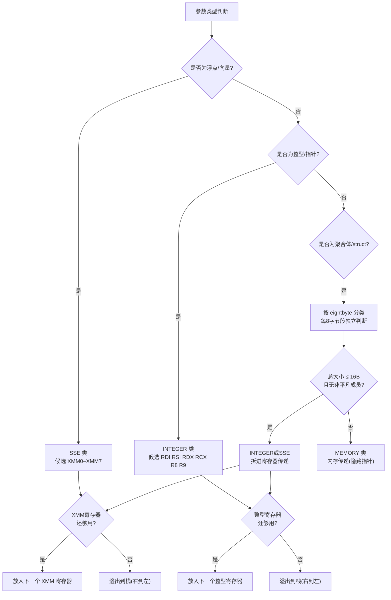

# 运行时与ABI（12）· 参数传递与调用规约细节

## 概述与定位

> [!abstract] TL;DR
> **System V AMD64 psABI** 规定：整型/指针参数依次放 **RDI RSI RDX RCX R8 R9**，浮点放 **XMM0–XMM7**，多余参数右到左压栈；返回值整型走 **RAX**（64位以上用 RDX 接高位），浮点走 **XMM0**；聚合体（struct）按 **8字节（eightbyte）分类**规则决定走寄存器还是内存；RSP 以下 **128 字节红区**供叶函数免调整直接使用；varargs 函数入口 **AL = 使用的向量寄存器个数**；callee-saved 寄存器为 **RBX RBP R12–R15**（及 RSP）。Windows x64 ABI 差异显著：整型参数只有 **RCX RDX R8 R9**，调用者必须预留 **32 字节 shadow space**，且**没有红区**；callee-saved 浮点为 **XMM6–XMM15**——两套 ABI 绝对不能混用。

调用规约（Calling Convention）是编译器、链接器和运行时之间的"参数传递契约"——决定了函数调用时谁占哪个寄存器、谁负责保存寄存器、栈如何对齐。这套契约隐含在每一行函数调用的汇编中。逆向工程师读汇编时必须能从寄存器装载顺序反推参数类型；安全研究员必须知道红区/对齐/shadow space 规则，才能正确布置 ROP 链或解释崩溃现场。

本篇专注 **System V AMD64 psABI**（Linux/macOS x86-64），Win64 作对照。调用规约在汇编/架构层的全貌见 [[22.调用规约/00.总览.md]]，汇编指令层见 [[21.Asm/15 x86(64).md]] 与 [[21.Asm/23 调用约定对比.md]]。

---

## 原理与机制

### 为什么需要统一的调用规约

调用规约要解决三个问题：

1. **参数在哪里**：调用者和被调用者必须约定好参数放在寄存器还是栈上、以什么顺序。
2. **谁保存寄存器**：caller 负责保存的寄存器，被调用者可以随意修改；callee 负责保存的寄存器，被调用者使用后必须还原。
3. **栈如何对齐与清理**：进入函数时 RSP 必须满足对齐要求，退出时栈必须恢复原状。

### 参数分类决策流程

System V AMD64 psABI 对每个参数做以下分类决策：



---

## 规则详解

### 整型与指针参数寄存器

System V AMD64 ABI 为整型参数指定了固定的传参寄存器序列：

| 参数位置 | 寄存器 | 备注 |
|---|---|---|
| 第 1 个 | **RDI** | 也是 C++ `this` 指针位置 |
| 第 2 个 | **RSI** | |
| 第 3 个 | **RDX** | |
| 第 4 个 | **RCX** | |
| 第 5 个 | **R8** | |
| 第 6 个 | **R9** | |
| 第 7 个起 | **栈（右到左）** | 最后一个参数最先压栈 |

记忆顺口溜：**RDI RSI RDX RCX R8 R9**（"迪 西 德 塞 八 九"）。

"整型/指针"涵盖所有可放入 64 位整数寄存器的类型：`char`/`short`/`int`/`long`/`long long`/指针/引用/枚举。

### 浮点与向量参数寄存器

| 参数位置 | 寄存器 |
|---|---|
| 第 1 个浮点 | **XMM0** |
| 第 2 个浮点 | **XMM1** |
| … | … |
| 第 8 个浮点 | **XMM7** |
| 第 9 个起 | **栈（右到左）** |

浮点参数使用独立的寄存器槽，与整型参数互不干扰——一个 `(int, double, int)` 签名的函数，第一个 `int` 进 RDI，`double` 进 XMM0，第二个 `int` 进 RSI，不存在"占了 XMM0 就少一个整型位"的情况。

`__m128`/`__m256` 等 SIMD 向量类型也走 XMM（YMM/ZMM 的低 128 位），超出 8 个同样溢出到栈。

### 返回值规则

| 返回类型 | 使用寄存器 |
|---|---|
| 整型（≤64位） | **RAX** |
| 128位整型 | **RAX**（低64位）+ **RDX**（高64位） |
| 浮点（float/double） | **XMM0** |
| 128位浮点（long double x2等） | **XMM0** + **XMM1** |
| ≤16B 可拆 struct | 按两段 eightbyte 分类分别放寄存器 |
| 大对象（>16B 或含非 trivially copyable 成员） | **隐藏指针（sret）**，见下节 |

#### 大对象的隐藏指针（sret）

当返回值是无法放入寄存器的大 struct 时，调用者负责在栈（或其他内存）上分配足够空间，把该空间的指针作为"隐藏首参数"放入 **RDI**。此时真正的第一个参数"下移"到 RSI，原来的 RSI 变为 RDX，以此类推。被调用者在 RDI 指向的内存中写入返回值，并在退出时**同时把该指针值放回 RAX**。

```
; 伪代码示意（AT&T 语法，Intel 语法标记）
; BigStruct foo(int a, int b) 编译后调用点（示意）
;
; 调用者侧：
;   lea   rdi, [rsp-sizeof(BigStruct)]   ; rdi = sret 指针（隐藏首参）
;   mov   esi, a                          ; 真正第 1 参数 → RSI
;   mov   edx, b                          ; 真正第 2 参数 → RDX
;   call  _Z3fooii
;   ; 返回后 rax == rdi（原 sret 指针）
;
; 被调用者侧序言：
;   ; rdi = 隐藏指针，rsi = a，rdx = b
;   ; 构造完后：
;   mov   rax, rdi   ; 返回 sret 指针
;   ret
```

> [!warning] 示例输出为示意

### 聚合体（struct）的 eightbyte 分类规则

System V AMD64 psABI 以 8 字节（一个 eightbyte）为单位对 struct 的每个段分类：

**分类规则：**

1. 将 struct 从起始地址起每 8 字节划为一段。
2. 对每段内的所有字段递归分类：
   - 含整型/指针字段 → **INTEGER**
   - 仅含浮点字段（float/double）→ **SSE**
   - 有 `__float128`/向量 → **SSE** 或 **SSEUP**
3. 段内字段类别合并时，INTEGER 优先级 > SSE。
4. 整体判定：若 struct **总大小 ≤16B 且所有成员均为 trivially copyable 类型**（无虚函数、无非平凡构造/析构/复制/移动构造）：
   - 按每段分类结果分配寄存器（INTEGER → 下一个整型寄存器，SSE → 下一个 XMM）。
5. 否则（>16B 或含非 trivially copyable 成员——有非平凡复制/移动构造、非平凡析构、或虚函数等）→ **MEMORY**：走内存传递（对于传入参数是 caller 复制到栈上，对于返回值是 sret 指针）。

**典型示例：**

```c
// 示例 A：两个 int（8B，一个 eightbyte）
struct A { int x; int y; };
// eightbyte[0]：含两个 int → INTEGER
// 总大小 8B ≤ 16B → 走寄存器
// 传递：整个 struct 放入 RDI（调用 foo(A) 时 rdi = 合并后的 64 位值）

// 示例 B：int + double（16B，两个 eightbyte）
struct B { int x; double d; };
// eightbyte[0]：含 int → INTEGER → RDI
// eightbyte[1]：含 double → SSE → XMM0
// 总大小 16B ≤ 16B → 两段分别放 RDI 和 XMM0

// 示例 C：三个 int（12B，两个 eightbyte）
struct C { int a; int b; int c; };
// eightbyte[0]：a+b → INTEGER → RDI
// eightbyte[1]：c(+4B padding) → INTEGER → RSI
// 总大小 12B ≤ 16B → RDI:RSI

// 示例 D：大 struct（>16B → MEMORY）
struct D { int arr[5]; };
// 总大小 20B > 16B → MEMORY
// 传入时 caller 将 D 的副本压栈，被调用者直接访问栈上数据
// 作为返回值时走 sret（隐藏 RDI 指针）

// 示例 E：含虚函数（有非平凡成员 → MEMORY）
struct E { virtual void f(); int x; };
// 有虚函数 → 非平凡 → MEMORY，无论大小
```

> [!warning] 示例输出为示意

### 红区（Red Zone）

**红区**是 RSP 以下 **128 字节**的保留区域，ABI 保证信号处理程序或中断处理程序在调用时会保护这 128 字节（内核会在信号帧之外预留或保存）。

**叶函数**（leaf function，即不再调用其他函数的函数）可以直接使用红区存放局部变量，**无需执行 `sub $N, %rsp`** 来调整栈指针——节省了序言/尾声的 2 条指令，对小型热路径函数有可观的性能提升。

```nasm
; 叶函数利用红区示例（Intel 语法，示意）
leaf_func:
    ; 不需要 sub rsp, N
    ; 直接在 [rsp-8] 到 [rsp-128] 范围内使用局部变量
    mov    DWORD PTR [rsp-4], edi     ; 把参数存到红区
    ; ... 计算 ...
    mov    eax, DWORD PTR [rsp-4]
    ret
```

> [!warning] 示例输出为示意

**红区陷阱**：非叶函数**不能**依赖红区——执行 `call` 指令后，RSP 向下移动（压返回地址），叫出者的红区内容会被覆盖。内核信号处理会跳过红区，但显式 `call` 不会。

**Windows x64 没有红区**，详见 Win64 对照表。

### 栈对齐要求

ABI 要求：在 `call` 指令**执行前一刻**（即被调用者尚未执行时），**RSP 必须 16 字节对齐**。

`call` 指令本身会把 8 字节返回地址压栈，因此进入被调用者的序言时 RSP 的低 4 位为 `0x8`（即 RSP mod 16 == 8）。这就是为什么函数序言常见以下模式之一：

```nasm
; 模式 A：push 保存寄存器（每 push 8B，奇数个 push → 恢复对齐）
push   rbp          ; RSP 减8 → 再对齐到 16B
mov    rbp, rsp

; 模式 B：明确补齐
sub    rsp, 8       ; 手动补 8B，恢复 16B 对齐
; ... 或者 sub rsp, N（N 为奇数倍的 8）

; 模式 C：一个 push + 偶数个 push（奇数对 push 消了对齐，还需再 sub 8 或再 push）
```

**调用者的责任**：在安排好参数后、执行 `call` 前，确保 RSP mod 16 == 0。编译器会自动处理，手写汇编时必须自己保证。

栈未对齐的后果：SSE/AVX 指令（`movaps`/`vmovaps` 等）要求 16/32 字节对齐，未对齐会触发 `#GP`（通用保护异常），表现为 `SIGBUS` 或 `SIGSEGV`。

### varargs：AL 寄存器的语义

对于可变参数函数（`printf`/`scanf` 等），调用者在调用前必须把**实际使用的 XMM 寄存器个数**存入 **AL**（RAX 的最低字节）。这是为了让 `va_start` 的实现能知道需要将多少个 XMM 寄存器的内容保存到"寄存器保存区"（register save area）中。

```nasm
; 调用 printf("fmt", 1, 2.0) 示意（Intel 语法）
; 参数：fmt → RDI, 1 → RSI, 2.0 → XMM0
lea    rdi, [rip + fmt_str]   ; 格式字符串
mov    esi, 1                  ; 第1个整型参数
movsd  xmm0, [rip + two_0]   ; 第1个浮点参数
mov    al, 1                   ; 使用了 1 个 XMM 寄存器
call   printf
```

> [!warning] 示例输出为示意

若没有浮点参数，AL = 0；若使用了 3 个 XMM 寄存器传递浮点参数，AL = 3。上界为 8（XMM0–XMM7 全用时 AL = 8）。非 varargs 函数忽略 AL 的值，但编译器通常也会设置它（保守做法）。

### 寄存器保存约定

寄存器分为两类：

**Caller-saved（调用者保存，volatile，被调用者可随意修改）：**

| 寄存器 | 说明 |
|---|---|
| RAX, RCX, RDX | 参数/返回值寄存器，调用后失效 |
| RSI, RDI | 参数寄存器 |
| R8, R9, R10, R11 | R10/R11 为临时寄存器，调用后失效 |
| XMM0–XMM15 | 全部浮点/SIMD 寄存器 |
| EFLAGS（条件码）| 调用后失效 |

调用者若在 `call` 之后还需要这些寄存器的值，必须在 `call` 之前自行保存（push 到栈或存入 callee-saved 寄存器）。

**Callee-saved（被调用者保存，non-volatile，调用后仍有效）：**

| 寄存器 | 说明 |
|---|---|
| **RBX** | 通用，callee 使用时必须保存/恢复 |
| **RBP** | 帧指针（可选使用，但若使用则必须保存） |
| **R12** | callee-saved |
| **R13** | callee-saved |
| **R14** | callee-saved |
| **R15** | callee-saved |
| **RSP** | 栈指针，`ret` 时必须还原到进入时的值 |

被调用者若需要使用这些寄存器，必须在序言中保存（通常 push 到栈上），并在尾声中恢复（pop），然后再 `ret`。

**记忆：callee-saved = RBX + RBP + R12–R15（共 6 个通用寄存器）+ RSP。**

### C++ this 指针的传递

在 Itanium C++ ABI（GCC/Clang）下，非静态成员函数的 `this` 指针作为**隐藏的首个参数**，按 INTEGER 类处理，放入 **RDI**。

```cpp
// C++ 源码
struct Obj { int val; void set(int x); };
void Obj::set(int x) { val = x; }

// 编译后等价（System V AMD64）
// _ZN3Obj3setEi(Obj* this, int x)
// this → RDI, x → RSI
```

逆向时，若看到成员函数调用前有 `lea rdi, [...]`（加载对象地址）或 `mov rdi, ...`（传递对象指针），通常就是 `this`。详见 [[22.调用规约/04.thiscall.md]]。

### Windows x64 ABI 对照

**Windows x64** 使用微软自定义的 ABI，与 System V AMD64 的差异如下：

| 特性 | System V AMD64（Linux/macOS） | Windows x64 |
|---|---|---|
| 整型参数寄存器 | **RDI RSI RDX RCX R8 R9** | **RCX RDX R8 R9** |
| 浮点参数寄存器 | XMM0–XMM7 | **XMM0–XMM3**（与整型 1:1 对应） |
| 超出寄存器的参数 | 右到左压栈 | 右到左压栈 |
| shadow space | **无** | **32 字节**（调用者必须在 RSP 之上预留） |
| 红区（red zone）| **128 字节** | **无** |
| 栈对齐 | call 前 16B 对齐 | call 前 16B 对齐 |
| callee-saved 整型 | RBX RBP R12–R15 | RBX RBP **RDI RSI** R12–R15 |
| callee-saved 浮点 | 无（XMM 全 caller-saved）| **XMM6–XMM15** |
| 大对象返回（sret） | 隐藏 RDI | 隐藏 RCX（首参位） |
| varargs AL 寄存器 | AL = XMM 个数 | **无此约定**，整型/浮点参数并行传 |
| `this` 指针 | RDI（首参） | **RCX**（首参） |

**Shadow Space（影子空间）**是 Win64 的独特要求：调用者在 `call` 之前必须在当前 RSP 的上方（已调整后的栈上）留出 **32 字节**（4 × 8B）的空间，供被调用者将寄存器参数"影射"回栈上使用（通常用于调试/va_start 等场景），即使被调用者实际上不使用这 32 字节也必须预留。

```nasm
; Windows x64 调用示意（Intel 语法）
sub    rsp, 40          ; 32B shadow space + 8B 补对齐
mov    rcx, arg1        ; 第1参数
mov    rdx, arg2        ; 第2参数
call   some_func
add    rsp, 40          ; 还原
```

> [!warning] 示例输出为示意

更完整的跨平台调用规约对照见 [[21.Asm/23 调用约定对比.md]] 和 [[22.调用规约/00.总览.md]]。

---

## 逆向视角

### 从调用点汇编反推参数个数与类型

调用一个函数前，编译器会按参数顺序装载寄存器。逆向时从 `call` 指令往前扫描，观察哪些参数寄存器被赋值：

```nasm
; 示例：调用点逆向分析（Intel 语法，示意地址）
0x400600:  lea    rdi, [rip + 0x200]     ; 第1参 = 某字符串指针（char*）
0x400607:  mov    esi, 0x10              ; 第2参 = 整型 0x10（int/size_t）
0x40060c:  xorps  xmm0, xmm0            ; 第3参 = 浮点 0.0（double/float）
0x40060f:  mov    al, 1                  ; AL=1 → 这是一个 varargs 函数，用了1个XMM
0x400611:  call   0x4004a0              ; 目标函数
```

**分析结论**：该函数接受 `(const char*, int/unsigned, double, ...)` 形式的参数——是个类 `printf` 的 varargs 函数，AL=1 证实有浮点参数通过 XMM0 传入。

> [!warning] 示例输出为示意

**规律**：
- 看到 `mov rdi, ...` + `mov rsi, ...` + `mov rdx, ...` 连续赋值 → 函数有至少 3 个整型/指针参数
- 看到 `movsd xmm0, ...` 或 `movss xmm0, ...` → 有浮点参数
- 看到 `mov al, N`（N 为小整数）紧跟 `call` → varargs 函数，N 个浮点参数
- 看到 `lea rdi, [...]`（指向栈或 BSS 对象）→ 可能是 sret 隐藏指针，返回值是大对象

### 识别 sret（大对象返回）

```nasm
; sret 识别示意（Intel 语法）
; BigStruct make_obj(int a)
sub    rsp, 0x30             ; 为 BigStruct 分配栈空间（序言中已见过 sizeof ≥ 16）
lea    rdi, [rsp]            ; rdi = 隐藏指针，指向栈上 BigStruct 存储区
mov    esi, 5                ; 参数 a = 5（真正第1参→ RSI）
call   _Z8make_obji
; 返回后 rax == 之前的 rdi（sret 指针），可从 [rax] 读结果
```

> [!warning] 示例输出为示意

**识别特征**：调用前 `lea rdi, [rsp+...]`（或 `lea rdi, [rbp-...]`）且目标函数名经 `c++filt` 解码后返回类型为非指针 struct/class——极大概率是 sret。

### 识别成员函数的 this 调用

```nasm
; 成员函数调用识别（Intel 语法，示意）
; obj.method(42) 编译后
lea    rdi, [rbp - 0x20]     ; rdi = &obj（this 指针）
mov    esi, 0x2a             ; 参数 42
call   _ZN3Obj6methodEi      ; c++filt → Obj::method(int)
```

> [!warning] 示例输出为示意

`_ZN3Obj6methodEi` 经 `c++filt` 解码为 `Obj::method(int)`，可知函数签名确实有 `this`（Obj*）+ `int` 两个参数，分别进 RDI 和 RSI。

### Windows x64 下的调用识别

```nasm
; Windows x64 调用示意（Intel 语法）
sub    rsp, 0x28             ; 32B shadow + 8B 对齐
lea    rcx, [rsp+0x30]       ; sret 指针（或 this，Windows 下首参用 RCX）
mov    edx, 3                ; 第2参（整型）
call   func
add    rsp, 0x28
```

> [!warning] 示例输出为示意

与 SysV 的最大区别：看到 `sub rsp, 0x20`（或 `0x28`/`0x30` 等 32 对齐后的值）然后直接 `call`，中间没有 push 操作——这是 shadow space 的标志，基本可以断定是 Windows x64 代码。

---

## 安全性与正确使用

### ABI 不匹配的后果

当调用者和被调用者遵循不同的 ABI（例如在同一个 Linux 进程中混入了按 Win64 ABI 编译的对象文件，或在手写汇编中寄存器顺序搞错），会产生以下问题：

- **参数解析错误**：被调用者从 RSI 读"第一个参数"，但调用者把它放在了 RDI，导致取值错误。
- **寄存器污染**：若错误地认为 R12 是 caller-saved，被调用者修改了它，调用者返回后 R12 的值已被破坏。
- **栈不平衡**：shadow space 未预留，被调用者将参数写入 [RSP-8] 到 [RSP-24]，踩到调用者的局部变量；或 callee 的 `add rsp, N` 的 N 与 caller 的 `sub rsp, N` 不对等，导致栈指针漂移，最终 `ret` 地址错误、进程崩溃。

**典型误区**：在 Linux 上用 `extern "C"` 声明了一个其实按 Windows x64 规约实现的函数，编译器按 SysV 生成调用代码，第一个参数放在 RDI，但函数从 RCX 读——静默错误，调试极难。

### 手写汇编不守约定

手写汇编/内联汇编若违反 ABI 约定，常见事故：

```nasm
; 错误示例：未保存 callee-saved 寄存器（Intel 语法，示意）
my_func:
    push   rbp
    mov    rbp, rsp
    ; 直接使用 R12 而不保存
    mov    r12, rdi           ; ← 覆盖了调用者的 R12！
    ; ...
    pop    rbp
    ret
    ; 返回后调用者的 r12 已损坏 → 行为未定义
```

> [!warning] 示例输出为示意

**修正**：在序言中 `push r12`，在尾声中 `pop r12`（位置对称）。

### 红区被信号破坏

叶函数依赖红区的场景下，有一个微妙陷阱：

- **正确使用**：信号处理程序由内核调度，内核会在当前 RSP 以下 **额外跳过 128 字节**再建立信号帧，因此红区内容不会被信号帧覆盖——**红区对信号是安全的**。
- **错误场景**：在内核模式、Hypervisor 或自定义 setjmp/longjmp 实现中，若手动操作 RSP 而没有遵循红区保护规则，就可能踩到叶函数的红区数据。
- **另一个陷阱**：叶函数被内联后不再是叶函数，但编译器可能已经优化掉了 `sub rsp`，依赖了红区。若后续增加了一个函数调用导致函数不再内联或成为非叶函数，红区假设就破了——这是"非叶函数使用红区"的隐蔽来源。

**Windows x64 无红区**：在 Win64 上移植代码时，凡依赖红区的叶函数优化必须加回 `sub rsp, N`，否则第一个 `call` 就会踩到局部变量。

### 聚合体分类错误的 ABI 破坏

一个常见的手写绑定陷阱：C++ 库暴露返回 struct 的函数，Python/Rust/Go 等语言的 FFI 绑定可能错误地按"返回指针"处理（认为一定是 sret），但实际上该 struct ≤16B 且无非平凡成员，编译器让它走了寄存器返回（RAX:RDX 或 RAX:XMM0）。结果 FFI 层去读返回指针（0），得到空指针，程序崩溃或静默损坏。

**验证方法**：用 `objdump -d` 或 `gdb disassemble` 观察实际的调用点——是否有 `lea rdi, [...]` 在 `call` 前装载指针（sret），还是直接读 `rax` 或 `rax`+`rdx`。与 [[33.二进制漏洞与利用基础/05.ret2libc.md]] 结合可用于栈帧布局分析。

### 栈不对齐引发的 SSE 崩溃

```nasm
; 错误示例：caller 未对齐就 call（Intel 语法，示意）
push   rax                   ; 此前 RSP 已对齐（16B），push 后 RSP mod 16 = 8
; 忘记再调整，直接 call
call   func_using_movaps     ; 进入 func 后 RSP mod 16 = 0（因为 call 再压 8B 返回地址）
;                             ← 实际上这次恰好对齐了，但若 push 数量是偶数就会错位
```

> [!warning] 示例输出为示意

规律：`call` 前 RSP 必须是 16 的倍数（mod 16 == 0）。`call` 本身压 8 字节，进入被调用者时 RSP mod 16 == 8。若使用 `movaps`/`vmovaps` 等对齐指令在 16B 未对齐的地址读写，触发 `#GP`，Linux 上表现为 `SIGSEGV`（信号 11）。

---

## 小结

System V AMD64 psABI 的调用规约可以用三句话概括：

1. **参数走寄存器，多余走栈**：整型依次 RDI RSI RDX RCX R8 R9，浮点依次 XMM0–XMM7；struct ≤16B 且简单则拆进寄存器，否则走内存（大返回值用 sret 隐藏指针）。
2. **栈对齐与红区**：call 前 RSP 16B 对齐；叶函数可用 RSP 以下 128B 红区免调整；varargs 靠 AL 传 XMM 计数。
3. **寄存器保护边界**：callee-saved = RBX RBP R12–R15（+ RSP），其余均 caller-saved。

Windows x64 的核心差别：整型参数改为 RCX RDX R8 R9（4 个），强制 32 字节 shadow space，无红区，callee-saved 多了 RDI/RSI 和 XMM6–15。两套 ABI 混用会导致参数错位、寄存器污染、栈崩溃——逆向时先判断平台再对号入座。

---

## 相关阅读

- [[22.调用规约/00.总览.md]] — 调用规约全平台总览（x86/x64/ARM/MIPS 系统性对比）
- [[22.调用规约/04.thiscall.md]] — C++ thiscall 与 this 指针传递细节
- [[21.Asm/23 调用约定对比.md]] — 汇编视角的跨平台调用约定对比
- [[21.Asm/15 x86(64).md]] — x86-64 寄存器/指令集基础
- [[33.二进制漏洞与利用基础/05.ret2libc.md]] — 利用调用规约构造 ret2libc 链
- [[11.ELF文件详解/17.got节.md]] — GOT 与 PLT 的延迟绑定（调用规约的实际落地）
- [[44.调试器原理与实战/07.栈回溯unwind.md]] — 栈展开与 CFI（与本篇栈帧布局互补）

---

⬅️ 上一篇 [[11.eh_frame与DWARF_CFI]] ｜ 🏠 [[00.C_C++运行时与ABI总览]] ｜ 下一篇 [[13.TLS线程局部存储]] ➡️
