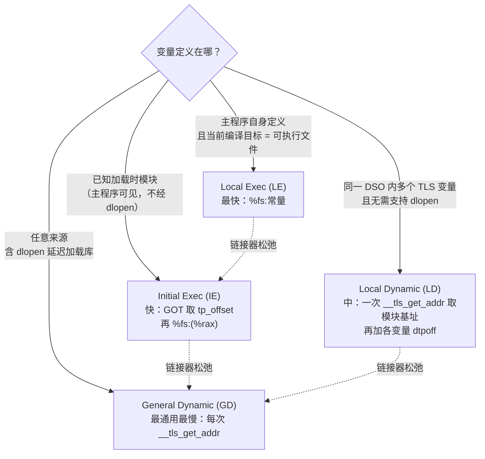
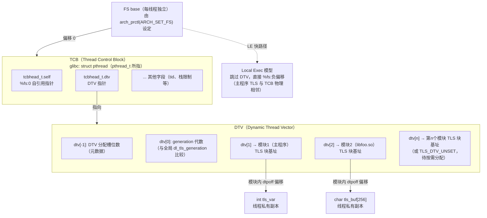

# 运行时与ABI（13）· TLS线程局部存储

## 概述与定位

> [!abstract] TL;DR
> - **TLS（Thread-Local Storage）** 让每个线程拥有变量的私有副本：同一符号名，操作的却是各线程独立的内存块。
> - 语言层：`__thread`（GCC 扩展）/ `thread_local`（C++11）/ `_Thread_local`（C11）；区别仅在析构语义——`thread_local` 支持非平凡析构，其余仅限 POD。
> - ELF 用 `.tdata`（有初值）/ `.tbss`（零初始化）作为 TLS **模板**，每个线程在运行时克隆一份独立的 TLS 块。
> - 编译器按"变量来源 + 当前编译目标"选择四种 ABI 访问模型：**General Dynamic（GD）→ Local Dynamic（LD）→ Initial Exec（IE）→ Local Exec（LE）**，从最通用/最慢到最受限/最快。
> - x86-64 用 **FS base** 作为线程指针（TP）：`%fs:0` 指向 TCB 自引用，TCB 内含 DTV 指针以索引各模块 TLS 块；LE 模型跳过 DTV，直接 `%fs:负偏移`。
> - 关键重定位：IE GOT 槽用 `R_X86_64_TPOFF64`（**加载时 ld.so 填**）、指令用 `R_X86_64_GOTTPOFF`；LE 用 `R_X86_64_TPOFF32`（**链接时确定**立即数）；GD/LD 用 `R_X86_64_DTPMOD64` / `R_X86_64_DTPOFF64`。

本篇从 **ABI 与代码生成**视角讲透 TLS：编译器如何选模型、生成什么指令序列、产生哪些重定位、逆向时如何识别。加载器如何在运行时扩展 DTV、`dlopen` 的慢路径细节、Windows/macOS TLS，参见 [[14.动态链接与加载器详解/12.TLS的实现.md]]（两篇互补不重复）。

基准平台：**Linux x86-64 + System V AMD64 ABI + glibc nptl**。

---

## 原理与机制

### 语言层声明与语义

三种关键字在 ELF 层面产生完全相同的节属性（`SHF_TLS`）与重定位类型，差异在析构：

```c
/* GCC 扩展，C 和 C++ 均可用，仅支持 POD */
__thread int errno_copy;
__thread char strtok_buf[64];

/* C11 标准 */
_Thread_local int c11_counter;

/* C++11 标准，支持非平凡析构函数 */
thread_local std::string per_thread_name;   /* 析构由 __cxa_thread_atexit 注册 */
```

**构造与析构语义**（x86-64 Itanium ABI）：

| 关键字 | 构造时机 | 析构时机 | 非平凡析构 |
|---|---|---|---|
| `__thread` / `_Thread_local` | 线程创建时零初始化或复制 `.tdata` 模板 | 线程退出时系统回收 TLS 块，无析构回调 | 不支持 |
| `thread_local`（C++11） | 同上（POD）；非 POD 则在首次访问时构造（如同函数内静态对象） | 线程退出时由 `__cxa_thread_atexit` 注册的析构链调用 | 支持 |

非 POD 的 `thread_local` 对象，编译器会在访问路径插入守卫检查（类似 magic static），保证每线程仅构造一次，析构由 `__cxa_thread_atexit` 注册到线程局部析构链。

### TLS 段：模板与块的区别

**`.tdata`（Template Data）** 和 **`.tbss`（Template BSS）** 是编译产物，存储在 ELF 文件中充当模板：

```
.tdata 节（SHF_TLS | SHF_ALLOC | SHF_WRITE, sh_type = SHT_PROGBITS）
  ├── thread_local int x = 42;     → 4 字节，值 42
  └── thread_local int y = 100;    → 4 字节，值 100

.tbss 节（SHF_TLS | SHF_ALLOC | SHF_WRITE, sh_type = SHT_NOBITS）
  └── thread_local char buf[256];  → 256 字节占位，文件中无内容
```

**每个线程**在创建时，运行库（glibc nptl）为每个已加载模块：
1. 分配 `p_memsz` 大小的 TLS 块内存；
2. 将 `.tdata` 部分（`p_filesz` 字节）复制到块的头部；
3. 将剩余 `.tbss` 部分清零。

模板本身只读（`PT_TLS` 的 `p_flags = PF_R`）；每个线程的 TLS 块是可读写的私有副本。

### 四种 TLS 访问模型的选择逻辑

编译器由以下因素决定模型（`-ftls-model=` 可强制覆盖）：



**链接器 TLS 松弛（TLS Relaxation）**：链接器在最终链接时掌握更完整的信息，可将编译器生成的保守模型降级为更快的模型（同时重写指令字节）：

| 松弛前 | 松弛后 | 条件 |
|---|---|---|
| GD `R_X86_64_TLSGD` | LE `R_X86_64_TPOFF32` | 链接主程序且变量在本模块 |
| GD `R_X86_64_TLSGD` | IE `R_X86_64_GOTTPOFF` | 链接主程序，变量来自已知 DSO |
| LD `R_X86_64_TLSLD` | LE `R_X86_64_TPOFF32` | 链接主程序 |
| IE `R_X86_64_GOTTPOFF` | LE `R_X86_64_TPOFF32` | 链接主程序且变量在本模块 |

松弛时链接器同时修改指令编码（如将 `leaq @tlsgd(%rip); rex.W call __tls_get_addr` 的特定字节序列改写为 `movq $0, %rax; nop` 或直接嵌入 `%fs:offset`），依赖汇编器生成的特定前缀编码以供链接器识别。

### x86-64 运行时结构：FS base → TCB → DTV

x86-64 每个线程通过 `arch_prctl(ARCH_SET_FS, tcb_addr)` 将 TCB 地址写入 FS.base MSR（`IA32_FS_BASE`，MSR 地址 `0xC0000100`），从此 `%fs:0` = TCB 自引用。



**TCB 与 TLS 块的物理布局**（x86-64 Variant II，glibc 采用）：主程序的 TLS 块紧贴 TCB 低地址端，因此主程序 TLS 变量的偏移为**负值**（相对于 `%fs:0`）。

```
低地址
┌──────────────────────────────┐
│  ...（运行库预留空间）        │
├──────────────────────────────┤ ← 主程序 TLS 块起始
│  .tdata 副本（初始化变量）    │
├──────────────────────────────┤
│  .tbss 区（零初始化变量）     │
├──────────────────────────────┤ ← %fs:0 处（TCB 起始）
│  tcbhead_t.self（自引用）     │  %fs:0x00  = TCB 地址自身
│  tcbhead_t.dtv（DTV 指针）   │  %fs:0x08
│  ... 其他 pthread 字段        │
└──────────────────────────────┘
高地址

主程序 TLS 变量 tpoff 示例：
  thread_local int x = 42;  → 假设 tpoff = -8
  → LE 访问：movl %fs:-8, %eax
```

---

## 结构/汇编详解

### General Dynamic（GD）模型

**使用场景**：共享库默认；变量可能来自 `dlopen` 加载的库；最通用。

**GOT 需求**：为每个 TLS 变量分配 **2 个连续 GOT 槽位**：`[ti_module（模块编号）, ti_offset（块内偏移）]`，加载时由 `ld.so` 填充。

**汇编序列（x86-64 AT&T，GD 重定位前缀为固定编码供松弛识别）**：

```asm
; GD 模型访问 tls_var（示意偏移，非真实地址）
; ---------------------------------------------------
0x1100:  .byte 0x66                          ; REX 前缀（松弛标记，链接器识别用）
0x1101:  leaq  tls_var@tlsgd(%rip), %rdi    ; rdi = GOT 中 tls_index{module, offset} 的地址
                                              ;   → 产生 R_X86_64_TLSGD 重定位
0x1108:  rex.W call __tls_get_addr@plt       ; 调用 __tls_get_addr(&tls_index)
                                              ;   rax = 当前线程 tls_var 的地址
                                              ;   (调用前 %rdi = tls_index 地址)
0x110f:  movl  (%rax), %eax                  ; 读取变量值
```

`__tls_get_addr` 原型（glibc `sysdeps/x86_64/dl-tls.S` 伪 C）：

```c
typedef struct {
    size_t ti_module;   /* 模块编号（dtv 索引），加载时由 ld.so 填入 GOT 槽位 0 */
    size_t ti_offset;   /* 模块 TLS 块内偏移，加载时填入 GOT 槽位 1 */
} tls_index;

void * __tls_get_addr(tls_index *ti) {
    dtv_t *dtv = THREAD_DTV();                       /* 读 %fs:0x8 = DTV 指针 */
    if (dtv[0].counter != dl_tls_generation)
        return __tls_get_addr_slow(ti);              /* 慢路径：DTV 过时，扩容更新 */
    void *p = dtv[ti->ti_module].pointer.val;
    if (p == TLS_DTV_UNSET)
        return __tls_get_addr_slow(ti);              /* 慢路径：该模块 TLS 块未分配 */
    return p + ti->ti_offset;                        /* 快路径：DTV 直接索引 */
}
```

### Local Dynamic（LD）模型

**使用场景**：同一 DSO 内访问多个 TLS 变量时的编译器优化——只调用一次 `__tls_get_addr` 获取**模块 TLS 基址**，各变量地址用 `dtpoff` 加法求得。

**GOT 需求**：1 个槽位（模块基址描述符），不含 `ti_offset`。

```asm
; LD 模型：一次 __tls_get_addr 取模块基址
; ---------------------------------------------------
leaq    tls_module_base@tlsld(%rip), %rdi   ; rdi = LD 描述符地址
                                              ;   → 产生 R_X86_64_TLSLD 重定位
rex.W call __tls_get_addr@plt                ; rax = 当前模块 TLS 块基址

; 各变量地址 = 基址 + dtpoff（由 R_X86_64_DTPOFF32 重定位给出）
leaq    var_a@dtpoff(%rax), %rcx             ; rcx = &tls_var_a
                                              ;   → 产生 R_X86_64_DTPOFF32 重定位
movl    (%rcx), %ecx                         ; 读取 tls_var_a

leaq    var_b@dtpoff(%rax), %rdx             ; rdx = &tls_var_b
movl    (%rdx), %edx                         ; 读取 tls_var_b
```

相比 GD，访问 N 个同模块变量只需 1 次 `__tls_get_addr`，适合内联函数或频繁访问多个线程本地变量的代码。

### Initial Exec（IE）模型

**使用场景**：变量来自加载时已知的模块（主程序或启动时静态加载的 DSO）；无需支持 `dlopen`。

**GOT 需求**：1 个槽位，存储 **tp_offset**（变量地址相对 TP 即 `%fs:0` 的有符号偏移）；加载时由 `ld.so` 以 `R_X86_64_TPOFF64` 重定位填充。

```asm
; IE 模型：从 GOT 取 tp_offset，再经 %fs 间接访问
; ---------------------------------------------------
movq    tls_var@gottpoff(%rip), %rax    ; rax = GOT[tls_var] = tp_offset（负值）
                                         ;   → 产生 R_X86_64_GOTTPOFF 重定位
                                         ;   GOT 槽在加载时被填充为 &tls_var - TP
movl    %fs:(%rax), %eax                ; 读取 %fs:tp_offset 处的值
                                         ;   等价于 movl (%fs_base + tp_offset), %eax
```

`tp_offset` 为**负数**（x86-64 Variant II：TLS 块在 TCB 低地址端），例如 `-0x8` 表示距 FS base 偏移 -8 字节。无 `__tls_get_addr` 调用，比 GD 快一个数量级。

**关键限制**：IE 模型要求 TLS 块在线程创建时已存在（静态 TLS 区域），不能用于 `dlopen` 加载的库（运行时无法追加到静态 TLS 区域）。若带 IE 重定位的 DSO 被 `dlopen`，`ld.so` 会尝试使用预留的 `TLS_STATIC_SURPLUS` 空间；若超出则报 `dlopen` 失败或崩溃。

### Local Exec（LE）模型

**使用场景**：可执行文件（非 DSO）自身定义并访问的 TLS 变量；编译期即可确定 `tp_offset`。

**GOT 需求**：0 个槽位——`tp_offset` 直接作为立即数嵌入指令。

```asm
; LE 模型：最快，直接 %fs + 编译期常量
; ---------------------------------------------------
movl    %fs:tls_var@tpoff, %eax         ; 等价于 movl %fs:-8, %eax
                                         ;   → 产生 R_X86_64_TPOFF32 重定位
                                         ;   链接器将 tpoff 替换为立即数（如 -8）
```

最终生成的机器码：`64 8b 04 25 f8 ff ff ff`（`movl %fs:0xfffffff8, %eax`，`0xfffffff8` = `-8` 的 32 位补码）。整个 TLS 变量访问退化为单条指令，性能与访问普通全局变量相当。

### 四模型对比总表

| 模型 | 目标场景 | GOT 槽位 | 函数调用 | x86-64 汇编特征 | 核心重定位类型 |
|---|---|---|---|---|---|
| General Dynamic | 任意（含 dlopen） | 2 个（module + offset） | `__tls_get_addr` | `leaq @tlsgd; rex.W call` | `R_X86_64_TLSGD` |
| Local Dynamic | 同模块多变量 | 1 个（模块基址） | `__tls_get_addr`（1次） | `leaq @tlsld; call; leaq @dtpoff` | `R_X86_64_TLSLD` + `R_X86_64_DTPOFF32/64` |
| Initial Exec | 加载时已知模块 | 1 个（tp_offset） | 无 | `movq @gottpoff; %fs:(%rax)` | `R_X86_64_GOTTPOFF`（指令重定位）/ `R_X86_64_TPOFF64`（GOT 槽，**加载时 ld.so 填**）|
| Local Exec | 主程序自身 | 0 个 | 无 | `%fs:常量（负值）` | `R_X86_64_TPOFF32` / `R_X86_64_TPOFF64` |

### TLS 相关重定位类型汇总

| 重定位类型 | 适用模型 | 填充内容 | 填充时机 |
|---|---|---|---|
| `R_X86_64_TLSGD` | GD | GOT 两槽：`{ti_module, ti_offset}` | 加载时（ld.so） |
| `R_X86_64_TLSLD` | LD | GOT 一槽：`{ti_module, 0}` | 加载时（ld.so） |
| `R_X86_64_DTPMOD64` | GD/LD | 模块编号（DTV 索引） | 加载时（ld.so） |
| `R_X86_64_DTPOFF64` | GD/LD | TLS 块内偏移（`dtpoff`） | 链接时确定/加载时 |
| `R_X86_64_DTPOFF32` | LD | 同上，32 位 | 链接时确定 |
| `R_X86_64_GOTTPOFF` | IE | GOT 槽：`tp_offset`（负值） | 加载时（ld.so） |
| `R_X86_64_TPOFF64` | IE（GOT 槽）/ LE | IE：GOT 槽存 `tp_offset`，**加载时由 ld.so 填入**；LE：`tp_offset` 立即数，**链接时确定** | 见说明 |
| `R_X86_64_TPOFF32` | LE | 同上，32 位 | 链接时确定 |

---

## 逆向视角

### 识别 TLS 访问的三个特征

逆向时，识别 TLS 变量访问只需抓住以下规律：

#### 特征 1：`%fs:` 前缀访问 = TLS 变量（IE 或 LE 模型）

```asm
; 反汇编中凡出现 fs: 前缀，直接判定为 TLS 变量访问
64 8b 04 25 f8 ff ff ff    movl  %fs:0xfffffff8, %eax   ; LE 模型：负常量
64 8b 00                   movl  %fs:(%rax), %eax        ; IE 模型：rax 来自 GOT 的 tp_offset
```

区分 LE 和 IE：
- **LE**：`%fs:` 后紧跟**编译期常量**（往往是负值的 32 位立即数，如 `0xfffffff8`）
- **IE**：前面有 `movq symbol@gottpoff(%rip), %rax`，再 `%fs:(%rax)`（寄存器间接）

#### 特征 2：`call __tls_get_addr` = GD 或 LD 模型

```asm
; GD 模型特征：leaq @tlsgd(%rip) + call __tls_get_addr
66 48 8d 3d xx xx xx xx    leaq  tls_var@tlsgd(%rip), %rdi   ; 0x66 0x48 前缀序列
ff 15 xx xx xx xx          rex.W call *__tls_get_addr@plt

; LD 模型特征：leaq @tlsld(%rip) + call，之后无 @tlsgd 只有 @dtpoff
48 8d 3d xx xx xx xx       leaq  base@tlsld(%rip), %rdi
e8 xx xx xx xx             call  __tls_get_addr
48 8d 80 XX 00 00 00       leaq  var_a@dtpoff(%rax), %rax    ; dtpoff 为正值常量
```

**推断来源**：
- 看到 `__tls_get_addr` → 该变量来自共享库（或编译器未松弛的 GD/LD 模型）
- 看到 LD 模式（一次 `__tls_get_addr` + 多个 `leaq @dtpoff`）→ 变量来自同一 DSO，编译器做了批量优化

#### 特征 3：从模型推断变量归属

| 观察到的特征 | 推断 |
|---|---|
| `%fs:负常量`（单条指令） | LE 模型；变量在主程序 TLS 块，编译期绑定 |
| `movq @gottpoff(%rip); %fs:(%rax)` | IE 模型；变量在加载时已知 DSO，无法 `dlopen` |
| `leaq @tlsgd; call __tls_get_addr` | GD 模型；变量来自任意 DSO，含 `dlopen` 库 |
| `leaq @tlsld; call; leaq @dtpoff` | LD 模型；同 DSO 内多变量批量访问优化 |
| `movq @gottpoff(%rip); %fs:(%rax)` 但链接时已松弛 | 可能被松弛为 LE，看实际字节 |

> [!warning] 示例输出为示意
> 以上汇编片段中的 `xx xx xx xx` 为偏移占位，实际地址随 ASLR 和链接地址变化。`0x66 0x48` 前缀是 GD 指令序列的链接器松弛标记，不同工具链版本可能略有差异。

### 使用工具确认 TLS 模型

```bash
# 1. 查看 TLS 重定位类型，判断每个变量的访问模型
readelf -r a.out | grep -E 'TLS|TPOFF|DTPMOD|GOTTPOFF'

# 2. 查看 TLS 段（.tdata / .tbss）
readelf -S a.out | grep -E 'tdata|tbss'

# 3. 反汇编查 LE/IE 访问特征
objdump -d a.out | grep -E 'fs:|tls_get_addr'

# 4. GDB 查 FS base 与 TCB 结构
# (gdb) p/x $fs_base          → TCB 地址
# (gdb) x/2gx $fs_base        → 前 8 字节：self 指针；第 9-16 字节：DTV 指针
```

```text
# 示例输出（代表性，非本机实跑）
$ readelf -r libtls.so | grep TLS
  000000003fe8  000100000013 R_X86_64_TLSGD    0 tls_var + 0

$ readelf -r tls_exe | grep TPOFF
  000000403ff0  000100000022 R_X86_64_TPOFF64  0 tls_var + 0
```

> [!warning] 示例输出为示意
> `0x13` = `R_X86_64_TLSGD`，出现在共享库；`0x22` = `R_X86_64_TPOFF64`，出现在可执行文件（LE 模型），类型值随 psABI 版本可能不同，以 `readelf --wide -r` 的符号名为准。

---

## ARM64 与 Windows TLS

### ARM64 TLS：TPIDR_EL0 与 Variant I 布局

ARM64（AArch64）的 TLS 机制在**线程指针寄存器**和**TLS 块布局**上与 x86-64 有明显差异，但四种访问模型（GD/LD/IE/LE）的逻辑相同。

#### 线程指针寄存器：TPIDR_EL0

x86-64 使用 FS base MSR 作为线程指针（TP），而 AArch64 使用系统寄存器 **`TPIDR_EL0`**（Thread Process ID Register, Exception Level 0）：

```
# x86-64：读线程指针
movq %fs:0, %rax           ; 通过 FS 段前缀访问 TCB 自引用

# AArch64：读线程指针
mrs  x0, tpidr_el0         ; 将 TPIDR_EL0 读入 X0
                            ; X0 即 TCB/TP 地址
```

`TPIDR_EL0` 在线程创建时由内核（`clone` 系统调用）或 glibc nptl 通过 `arch_prctl` 的 AArch64 等价操作（`set_tls` 系统调用，AArch64 `clone` 的 `CLONE_SETTLS` 标志）写入。用户态只读（非 ring 0 不可写），因此不存在用户态直接修改线程指针的安全问题。

#### Variant I vs Variant II：TLS 块布局差异

AAPCS64 采用 **Variant I**（与 x86-64 的 Variant II 相反）：

| 布局 | 平台 | TCB 位置 | 主程序 TLS 相对 TP 偏移 |
|------|------|----------|------------------------|
| Variant I | AArch64、ARM32（部分）、MIPS | **TP 指向 TCB 开头**；TLS 块在 TCB **高地址方向**（正偏移）| 正值（+N）|
| Variant II | x86-64（glibc）| **TP 指向 TCB 末尾**（即 TCB 自引用处）；TLS 块在 TCB **低地址方向**（负偏移）| 负值（-N）|

Variant I 布局示意（AArch64 glibc）：

```
低地址
┌──────────────────────────────┐ ← TPIDR_EL0（TP）
│  TCB（struct pthread）       │
│  pthread.self（自引用）       │  +0x00
│  pthread.dtv（DTV 指针）     │  +0x08
│  ...                         │
├──────────────────────────────┤ ← TP + sizeof(TCB)（或对齐后的偏移）
│  主程序 .tdata 副本          │  正偏移
│  主程序 .tbss 零初始化区     │
├──────────────────────────────┤
│  其他 DSO TLS 块（DTV 索引）  │
└──────────────────────────────┘
高地址
```

因此，AArch64 LE 模型的汇编访问是**正偏移**：

```asm
; AArch64 LE 模型：thread_local int x（tpoff = +8 为示意）
mrs  x0, tpidr_el0          ; x0 = TP
ldr  w1, [x0, #8]           ; 读 TP + 8 处的 TLS 变量
                             ; R_AARCH64_TPREL_LO12_NC 重定位确定立即数
```

AArch64 的 TLS 重定位类型（类比 x86-64）：

| 重定位类型 | 对应模型 | 填充内容 |
|-----------|---------|---------|
| `R_AARCH64_TLSGD_ADR_PAGE21` / `R_AARCH64_TLSGD_ADD_LO12_NC` | GD | GOT 中 `tls_index` 描述符的 ADRP+ADD 对 |
| `R_AARCH64_TLSLD_ADR_PAGE21` | LD | GOT 中模块基址描述符 |
| `R_AARCH64_TLSIE_GOTTPREL_PAGE21` / `R_AARCH64_TLSIE_LD64_GOTTPREL_LO12_NC` | IE | GOT 中 `tp_offset`（正值）|
| `R_AARCH64_TLSLE_ADD_TPREL_HI12` / `R_AARCH64_TLSLE_ADD_TPREL_LO12_NC` | LE | 立即数形式的 `tp_offset`（正值）|

AArch64 GD 模型也通过 `__tls_get_addr` 实现，入口参数同样是 `tls_index*`，但通过 X0 传递（AArch64 第一参数寄存器），而非 x86-64 的 RDI。

### Windows TLS

Windows 的 TLS 实现与 Linux（ELF + glibc）从机制到接口都截然不同，分为**显式 TLS**和**隐式 TLS（`__declspec(thread)`）**两套 API，底层由 `.tls` 节和 `IMAGE_TLS_DIRECTORY` 结构支撑。

#### IMAGE_TLS_DIRECTORY：PE 的 TLS 元数据

PE（Portable Executable）格式在可选头的数据目录中有一个 **TLS Directory**（`IMAGE_DIRECTORY_ENTRY_TLS`，索引 9），指向 `IMAGE_TLS_DIRECTORY64` 结构：

```c
// IMAGE_TLS_DIRECTORY64（WinNT.h）
typedef struct _IMAGE_TLS_DIRECTORY64 {
    ULONGLONG StartAddressOfRawData;   // .tls 节模板数据起始 VA
    ULONGLONG EndAddressOfRawData;     // .tls 节模板数据结束 VA
    ULONGLONG AddressOfIndex;          // TLS 槽索引变量地址（DWORD*，ld.so 填槽号）
    ULONGLONG AddressOfCallBacks;      // TLS 回调函数指针数组地址（重要！见下文）
    DWORD     SizeOfZeroFill;          // 零初始化 TLS 数据大小（对应 .tbss）
    DWORD     Characteristics;         // 对齐等属性
} IMAGE_TLS_DIRECTORY64;
```

**`.tls` 节**（Section Name `.tls`）：存储 `__declspec(thread)` 变量的初始值模板，结构上类比 ELF 的 `.tdata`；零初始化部分由 `SizeOfZeroFill` 描述，类比 `.tbss`。

加载器（`ntdll.dll`）在进程/线程启动时，为每个线程从 `.tls` 模板复制一份 TLS 块，并把块地址存入 TEB（Thread Environment Block）的 TLS 数组（`TEB.TlsSlots[]`）。

#### TLS 回调（AddressOfCallBacks）——在入口点前执行

`AddressOfCallBacks` 是 Windows TLS 最被逆向研究者关注的特性。它指向一个以 `NULL` 结尾的**函数指针数组**，每个函数原型为：

```c
typedef VOID (NTAPI *PIMAGE_TLS_CALLBACK)(
    PVOID  DllHandle,    // 模块基址（和 DllMain 的 hinstDLL 相同）
    DWORD  Reason,       // 调用原因（见下表）
    PVOID  Reserved      // 保留，通常为 NULL
);
```

`Reason` 取值与 `DllMain` 相同：

| Reason | 值 | 触发时机 |
|--------|-----|---------|
| `DLL_PROCESS_ATTACH` | 1 | 进程启动时（**在 `main`/`WinMain`/`DllMain` 之前**）|
| `DLL_THREAD_ATTACH` | 2 | 每个新线程创建时 |
| `DLL_THREAD_DETACH` | 3 | 每个线程退出时 |
| `DLL_PROCESS_DETACH` | 4 | 进程退出时 |

**最关键的特性**：对于可执行文件（EXE），TLS 回调由 `ntdll` 加载器在**调用入口点（`WinMain`/`main`）之前**依次执行。这使 TLS 回调成为执行非常早期代码的机制——早于任何用户入口点。

**恶意软件与反调试的利用**：

```
进程创建流程（Windows）：
ntdll.dll 初始化
  → 加载依赖 DLL（执行各 DLL 的 TLS 回调 + DllMain）
  → 加载 EXE 的 TLS 段
  → **执行 EXE 的 TLS 回调数组**  ← 在此处执行！
  → 调用 EXE 入口点（CRT 初始化 → main）
```

恶意软件常见用法：

```c
// TLS 回调示例：早期反调试检测
void NTAPI tls_callback(PVOID instance, DWORD reason, PVOID reserved) {
    if (reason == DLL_PROCESS_ATTACH) {
        // 此时调试器可能尚未在 OEP（Original Entry Point）处断下
        if (IsDebuggerPresent()) {
            TerminateProcess(GetCurrentProcess(), 0);  // 检测到调试器，自杀
        }
        // 或：解密代码段、验证完整性、反 VM 检测
    }
}

// 注册 TLS 回调（MSVC）
#pragma comment(linker, "/INCLUDE:_tls_used")
#pragma data_seg(".CRT$XLB")
PIMAGE_TLS_CALLBACK my_callbacks[] = { tls_callback, NULL };
#pragma data_seg()
```

> [!note] 逆向检测要点
> - 用 `pestudio`/`CFF Explorer` 查看 PE 的 TLS 目录：Data Directory[9] 非零 → 存在 TLS。
> - `AddressOfCallBacks` 指向的数组每个非 NULL 指针都是一个 TLS 回调。
> - 在 IDA Pro 中，TLS 回调出现在 `Segments` 窗口的 `.tls` 节，或通过 `Image Base + RVA(TlsCallbacks)` 直接跳转。
> - OllyDbg/x64dbg 有"在 TLS 回调处停下"选项，确保调试从 TLS 回调入口开始，而非从 OEP 开始。

#### `__declspec(thread)`：隐式 TLS

`__declspec(thread)`（MSVC）等价于 `thread_local`（C++11），编译器将变量放入 `.tls` 节，运行时自动管理每线程副本：

```c
// MSVC
__declspec(thread) int per_thread_counter = 0;
```

**访问机制**：MSVC 为 `.exe` 生成直接 TLS 槽访问代码（类似 LE 模型），通过 TEB 的 `TlsSlots` 数组索引；DLL 中的 `__declspec(thread)` 则通过加载器填入的 `AddressOfIndex`（槽号）间接访问。

**限制**：在 Windows XP 之前，DLL（动态库）不能使用 `__declspec(thread)`（加载器不支持 `LoadLibrary` 后追加 TLS 槽），Vista 之后才完整支持 `GetModuleHandle`/`LoadLibrary` 场景。

#### 显式 TLS：TlsAlloc / TlsGetValue

Windows 还提供运行时显式 TLS API，类比 `pthread_key_create`/`pthread_getspecific`：

```c
// 显式 TLS API（kernel32.dll）
DWORD  TlsAlloc(void);                       // 分配一个 TLS 槽，返回槽索引
BOOL   TlsFree(DWORD dwTlsIndex);            // 释放槽
BOOL   TlsSetValue(DWORD dwTlsIndex,         // 设置当前线程的槽值
                   LPVOID lpTlsValue);
LPVOID TlsGetValue(DWORD dwTlsIndex);        // 获取当前线程的槽值

// 典型用法
static DWORD g_tls_index = TLS_OUT_OF_INDEXES;

void thread_init() {
    // 进程初始化时分配槽（通常在 DllMain DLL_PROCESS_ATTACH）
    g_tls_index = TlsAlloc();

    // 每线程设置私有数据
    DWORD *per_thread = (DWORD*)HeapAlloc(GetProcessHeap(), 0, sizeof(DWORD));
    *per_thread = GetCurrentThreadId();
    TlsSetValue(g_tls_index, per_thread);
}

void thread_use() {
    DWORD *per_thread = (DWORD*)TlsGetValue(g_tls_index);
    printf("Thread %u data: %u\n", GetCurrentThreadId(), *per_thread);
}
```

| 特性 | `__declspec(thread)` / `thread_local` | `TlsAlloc/TlsGetValue` |
|------|---------------------------------------|------------------------|
| 声明方式 | 关键字修饰变量 | 运行时函数调用 |
| 生命周期管理 | 自动（加载器）| 手动（`TlsAlloc`/`TlsFree`）|
| `LoadLibrary` 后支持 | Vista 后 DLL 可用，XP 前 DLL 不可用 | 始终支持 |
| 性能 | 稍快（索引已知）| 一次间接函数调用 |
| 析构通知 | 无（需在 `DllMain DLL_THREAD_DETACH` 手动处理）| 同左 |

**逆向要点对比（Linux ELF vs Windows PE）**：

| 特性 | Linux x86-64 ELF | Windows x64 PE |
|------|-----------------|----------------|
| 线程指针寄存器 | **FS base**（`%fs:0`）| **GS base**（`%gs:XX`，指向 TEB）|
| TLS 初始化数据 | `.tdata` / `.tbss` 节 | `.tls` 节 + `IMAGE_TLS_DIRECTORY` |
| 早期回调机制 | 无（`__attribute__((constructor))` 最早在 `main` 前）| **TLS 回调**（`AddressOfCallBacks`，早于入口点）|
| 访问模型 | GD/LD/IE/LE 四模型 + `__tls_get_addr` | 隐式（`.tls` 节）/ 显式（`TlsAlloc`）|
| 逆向工具 | `readelf -u` / `objdump -d \| grep fs:` | `pestudio` TLS 目录 / x64dbg TLS 断点 |

---

## 安全性与正确使用

### IE 模型不能 `dlopen`：静态 TLS 的容量限制

IE 模型将 `tp_offset` 固化于 GOT，要求对应 TLS 块在线程创建时即已分配（与 TCB 物理相邻的静态 TLS 区域）。`dlopen` 调用时，静态 TLS 区域已随线程创建定型，无法追加。

glibc 为此预留了有限的 `TLS_STATIC_SURPLUS`（通常 512 或 1024 字节），允许少量使用 IE 的 DSO 被 `dlopen`；超出限制时 `dlopen` 返回 `NULL`，`dlerror()` 报 `"cannot allocate memory in static TLS block"`。

**实践建议**：
- 打算支持 `dlopen` 的共享库，不要强制指定 `-ftls-model=initial-exec`；
- 若出于性能强制使用 IE，需在文档中明确"本库不支持 `dlopen`"；
- glibc ≥ 2.25 的 `dlopen` 对启动时加载但含 IE 的库做了改进，但 `dlopen` 的 DSO 仍应避免 IE。

### `dlopen`/`dlclose` 与 TLS 生命周期

`dlopen` 加载含 TLS 的库后：
1. 全局 `dl_tls_generation` 递增；
2. 已有线程的 DTV 代数（`dtv[0].counter`）落后，下次调 `__tls_get_addr` 触发慢路径扩展 DTV；
3. 该线程 TLS 块按需分配（首次 `__tls_get_addr` 时 `malloc`）。

`dlclose` 后：
- 对应模块的 TLS 块内存被释放；
- `dtv[module_id]` 置为 `TLS_DTV_UNSET`；
- 若此时仍有线程持有指向该 TLS 块的指针，则是**悬空指针**——这是多线程 `dlclose` 的经典危险。

**逆向视角**：分析 `dlopen` 后的 TLS 使用，要追踪 `__tls_get_addr` 被调用的时机和返回值的生命周期；若库被 `dlclose` 后还能观察到 `%fs:(%rax)` 访问，很可能是 use-after-free 型漏洞。

### `thread_local` 析构顺序陷阱

C++ `thread_local` 非 POD 对象的析构在线程退出时通过 `__cxa_thread_atexit` 注册的析构链调用（类似 `atexit`，但每线程独立）。

**析构顺序问题（"phoenix" 问题）**：若 TLS 对象 A 的析构函数间接访问另一个已析构的 TLS 对象 B，是 undefined behavior。glibc 实现用 `pthread_key_create` 驱动 TLS 析构，逆序（LIFO）于注册顺序——跨 DSO 的析构顺序则完全不由标准保证。

详细析构顺序语义参见 [[14.动态链接与加载器详解/12.TLS的实现.md]] 攻防章节。

### 性能取舍与 TLS 块大小

| 访问模型 | 相对代价 | 适用场景 |
|---|---|---|
| Local Exec (LE) | ~1 ns（单条 `%fs:const`） | 主程序自有 TLS，高频访问路径 |
| Initial Exec (IE) | ~2-4 ns（GOT 读取 + `%fs:(%rax)`） | 加载时已知 DSO，性能敏感路径 |
| Local Dynamic (LD) | ~20-50 ns（一次 `__tls_get_addr` 摊销） | 同 DSO 批量访问多 TLS 变量 |
| General Dynamic (GD) | ~20-50 ns/次（每次 `__tls_get_addr`） | `dlopen` 库，无法优化 |

**内存代价**：每个线程为每个含 TLS 的模块分配一份 TLS 块副本。若进程有 N 个线程，每个 DSO 有 M 字节 TLS 数据，则该 DSO 消耗 `N × M` 字节私有内存。大型 `thread_local` 缓冲区（如 `thread_local char buf[1 << 20]`）会随线程数线性放大内存占用，应改为 `thread_local` 指针 + 显式 `new/delete`。

---

## 小结

1. **语言层**：`__thread`（GCC）/ `thread_local`（C++11）/ `_Thread_local`（C11）三种关键字在 ELF 层等价；`thread_local` 额外支持非平凡析构，析构通过 `__cxa_thread_atexit` 注册到每线程析构链。

2. **TLS 段是模板**：`.tdata`（有初值）和 `.tbss`（零初始化）仅是编译产物模板；运行时每个线程为每个模块克隆一份 TLS 块（复制 `.tdata` + 清零 `.tbss` 部分）。

3. **四种访问模型由编译器按"变量来源 + 编译目标"选择**，从慢到快：
   - **GD**：最通用，支持 `dlopen`，每次访问调 `__tls_get_addr(tls_index)`;
   - **LD**：同模块多变量优化，一次 `__tls_get_addr` 取模块基址后加 `dtpoff`；
   - **IE**：加载时绑定，GOT 存 `tp_offset`，`movq @gottpoff; %fs:(%rax)`；
   - **LE**：最快，主程序自用，编译期确定负偏移，直接 `%fs:常量`。

4. **运行时结构**：x86-64 用 FS base 指向 TCB，TCB 含 DTV 指针，`dtv[module_id].pointer.val + dtpoff` 即 TLS 变量地址；LE 跳过 DTV，直接 `%fs:负偏移`（主程序 TLS 块与 TCB 物理相邻）。

5. **重定位类型**：GD/LD 用 `R_X86_64_DTPMOD64` + `R_X86_64_DTPOFF64`（填充 GOT 中 `tls_index`，**加载时 ld.so 填**）；IE 用 `R_X86_64_GOTTPOFF`（指令 RIP 相对重定位，**加载时 ld.so 填** GOT 槽 `tp_offset`，对应 `R_X86_64_TPOFF64`）；LE 用 `R_X86_64_TPOFF32/64`（嵌入立即数，**链接时确定**）。

6. **逆向识别**：`%fs:` 前缀 = TLS；`%fs:负常量` = LE；`movq @gottpoff; %fs:(%rax)` = IE；`call __tls_get_addr` = GD/LD；从模型可推断变量是否来自 `dlopen` 库。

7. **安全陷阱**：IE 模型不可用于需 `dlopen` 的库（静态 TLS 容量有限）；`dlclose` 后 DTV 槽被清零，持有 TLS 指针则悬空；`thread_local` 析构顺序跨 DSO 不保证。

---

## 相关阅读

- **加载器视角的 TLS（dlopen/DTV 扩展/Windows/macOS）**：[[14.动态链接与加载器详解/12.TLS的实现.md]]
- **TLS 模板段 `.tbss` 与普通 `.bss` 的区别**：[[11.ELF文件详解/08.bss节.md]]
- **GOT 中的 TLS 重定位条目（GLOB_DAT/TPOFF64）**：[[11.ELF文件详解/17.got节.md]]
- **TLS 重定位与 `.rela.dyn`**：[[14.动态链接与加载器详解/07.重定位机制详解.md]]
- **初始化与析构顺序（__cxa_thread_atexit 上下文）**：[[14.动态链接与加载器详解/11.初始化与析构顺序.md]]
- **调用规约（__tls_get_addr 的参数传递：rdi = tls_index*）**：[[12.参数传递与调用规约细节]]

---

⬅️ 上一篇 [[12.参数传递与调用规约细节]] ｜ 🏠 [[00.C_C++运行时与ABI总览]] ｜ 下一篇 [[14.C运行时库与启动全景实战]] ➡️
