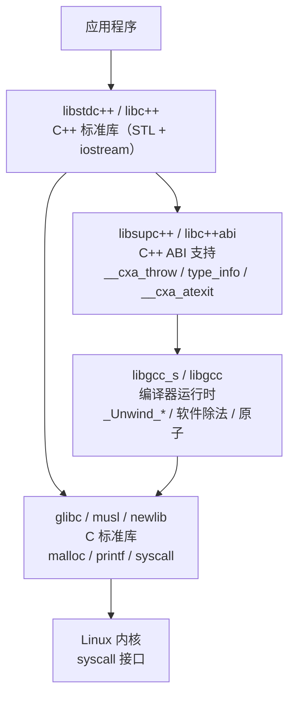
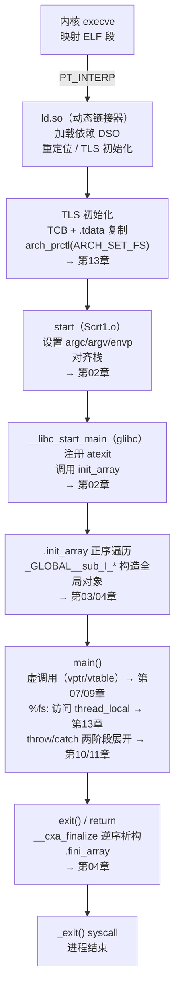

# 运行时与ABI（14）· C运行时库与启动全景实战

## 概述与定位

> [!abstract] TL;DR
> 本篇是系列**收官实战篇**。前 13 章分别拆解了启动链、静态初始化、name mangling、对象布局、虚表、多重虚继承、RTTI、异常展开、`.eh_frame`/DWARF CFI、调用规约与 TLS——本篇把这些知识节点**串成一条时间线**，走查一个含全局对象 + `thread_local` + `throw/catch` 的小 C++ 程序从"二进制装入"到"进程退出"的完整路径。同时系统对比三大 C 运行时库（**glibc / musl / newlib**）和编译器运行时（**libgcc / libstdc++ / libc++**）的分工，讲清静态与动态链接对启动路径的影响，以及在内核/bootloader/嵌入式场景下如何**裁剪 CRT**。

---

## 运行时库全景

### C 运行时库（libc）的三巨头

"C 运行时库（libc）"不是单一规范，而是一族**提供 POSIX/C 标准接口的实现**。三个主流实现各有侧重：

| 维度 | **glibc** | **musl** | **newlib** |
|---|---|---|---|
| 全称 | GNU C Library | Musl Libc | Newlib |
| 典型宿主 | Linux（Debian/Ubuntu/RHEL/Fedora） | Alpine Linux、静态二进制发行 | 嵌入式（ARM Cortex、RISC-V 裸板）|
| 许可 | LGPL 2.1 | MIT | BSD/各维护者 |
| 体积 | 大（>2 MB DSO） | 小（~1 MB 静态可行） | 极小（无 OS，需 syscall 移植层）|
| POSIX 完整性 | 最高，含大量 GNU 扩展 | 接近完整，部分 GNU 扩展缺失 | 仅 C 标准子集，无线程/信号等 |
| 静态链接友好度 | 中（`getaddrinfo`/`dlopen` 动态加载 NSS，静态有坑）| **高**（设计即静态友好） | **极高**（本就用于裸板静态链接）|
| Unicode / locale | 完整 | 简化（无 `LC_COLLATE` 复杂规则）| 基本无 |
| 线程模型 | NPTL（`libpthread` 内嵌 glibc）| 内建 | 无或依赖移植层 |
| 启动文件 | `Scrt1.o`/`crt1.o`，`crti.o`，`crtn.o`，`crtbeginS.o`/`crtbegin.o`，`crtendS.o`/`crtend.o` | `Scrt1.o`/`crt1.o`，`crti.o`，`crtn.o` | `crt0.o`（无 crtbegin/crtend，靠 `-lgcc` 提供）|
| 启动函数 | `__libc_start_main` | `__libc_start_main`（兼容接口） | `__libc_init` 或直接跳 `main` |

> [!info] glibc 的 NSS 静态陷阱
> glibc 的 Name Service Switch（`getaddrinfo`/`gethostbyname`）通过 `dlopen` 加载 `/lib/libnss_*.so`，静态链接后仍会在运行时 `dlopen`——若目标系统缺少对应 NSS 模块，DNS 解析直接失败。**musl** 没有这个问题，是构建"真正静态二进制"的首选。

### Bionic（Android libc）

**Bionic** 是 Android 的 C 运行时库，由 Google 专门为 Android 从头开发，取代 glibc 以满足嵌入式移动设备的许可证（Apache 2.0，无 GPL/LGPL 污染）、体积和启动速度需求。

#### 核心设计目标与 glibc 的剪裁

Bionic 相比 glibc **有意省略**了一些复杂功能：

| 功能 | glibc | Bionic | 原因/说明 |
|------|-------|--------|---------|
| `locale` 完整支持 | 完整（`LC_ALL`/`LC_COLLATE`/`LC_MONETARY`…）| **极简**（仅 `C`/`POSIX` locale，无 `LC_COLLATE` 复杂规则）| 移动设备多语言由 Android Framework 层处理，libc 层不需要 |
| `iconv`（字符集转换）| 完整 | **无内置**（需单独库 `libicui18n`）| 减小 libc 体积 |
| `getpwent`/`getgrent`（NSS）| 完整 NSS 插件体系 | **无**（Android 无传统 `/etc/passwd`，用户/组信息来自 Android Framework）| 无 NSS 设计，无 `dlopen` NSS 插件 |
| C++ 异常（`libstdc++`）| 通过 `libstdc++.so` | **通过 `libc++.so`**（LLVM libc++，Google 维护的 NDK 版本）| Android NDK r18+ 默认 libc++，已弃用 `libstdc++` |
| 线程 | `libpthread.so`（独立库，后合并进 glibc）| **内建**（pthread 直接在 `libc.so` 中）| Bionic 从一开始就将线程内建 |
| `dlopen`/`dlsym` | 通过 `libdl.so` | **内建**（`linker64` / `linker` 就是动态链接器，`dlopen` 在 `libdl.so` 中但实际由 linker 服务）| Android 动态链接架构特殊 |

#### `__libc_init`：Bionic 启动函数

Bionic 的启动入口不叫 `__libc_start_main`，而是 **`__libc_init`**：

```c
// Bionic 启动伪代码（bionic/libc/bionic/libc_init_dynamic.cpp，简化）
__attribute__((visibility("hidden")))
__noreturn void __libc_init(
    void* raw_args,                       // 内核传入的栈顶（含 argc/argv/envp/auxv）
    void (*onexit)(void) __unused,        // 历史参数，现代 Bionic 忽略
    int (*slingshot)(int, char**, char**), // main 函数指针
    structors_array_t const* const structors // .init_array/.fini_array 函数指针数组
) {
    __sanitizer_start_switch_fiber(nullptr, nullptr, 0);  // AddressSanitizer 钩子

    // 从 raw_args 解析 argc/argv/envp/auxv
    KernelArgumentBlock args(raw_args);

    // 初始化 TLS：设置 bionic_tcb + __get_thread()
    __libc_init_main_thread_early(args, &temp_tcb);

    // 初始化堆（jemalloc/scudo，取决于 Android 版本）
    __libc_init_malloc(&temp_tcb);

    // 运行 .preinit_array（如有）
    call_array(structors->preinit_array, structors->preinit_array_count, argc, argv, envp);

    // 运行 .init_array（全局构造函数）
    call_array(structors->init_array, structors->init_array_count, argc, argv, envp);

    // 注册 .fini_array 析构（通过 __cxa_atexit 或 on_exit）
    ...

    exit(slingshot(args.argc, args.argv, args.envp));  // 调 main
}
```

与 glibc 的 `__libc_start_main` 相比，`__libc_init` 的 `.init_array` 由**调用者传入的 `structors`** 结构体携带（而非 `__libc_start_main` 自行通过 ELF 辅助向量或 `PT_DYNAMIC` 段定位），这是 Bionic 与 linker64 分工的结果：`.init_array` 的扫描由 linker64 在加载时完成并填入 `structors`。

#### linker64：Android 动态链接器

Android 的动态链接器是 **`/system/bin/linker64`**（64 位）或 `/system/bin/linker`（32 位），不是传统的 `ld.so`。其关键特性：

- **Namespace 隔离**：linker64 实现了 **linker namespace**（类似 SELinux 的 dlopen 沙箱），不同 namespace 之间的 `dlopen` 相互隔离，系统库无法被 APP 随意 `dlopen`（`RTLD_GLOBAL` 亦受限）。这是 Android 8.0（Treble）引入的 Native ABI 稳定化机制的基础。
- **`DT_SONAME` 白名单**：APP 只能 `dlopen` NDKABI 明确公开的库（如 `libc.so`、`libm.so`、`liblog.so`、`libandroid.so`）；`dlopen` 非 NDK 系统库会报权限拒绝。
- **ELF relocation 优化**：支持 `DT_GNU_HASH`、`DT_ANDROID_REL`（压缩重定位，Android 特有格式）。
- **`DT_NEEDED` 传递性隔离**：与 Linux glibc ld.so 不同，linker64 不自动暴露传递依赖（`RTLD_GLOBAL` 受 namespace 限制），每个库须显式声明依赖。

#### Android 特有 API

Bionic 提供了若干 Linux glibc 没有的 Android 平台 API，在 NDK 和系统服务中广泛使用：

**系统属性（System Property）**：

```c
#include <sys/system_properties.h>

// 读取系统属性（类似 Java 层的 SystemProperties.get）
char value[PROP_VALUE_MAX];  // PROP_VALUE_MAX = 92
__system_property_get("ro.build.version.release", value);
printf("Android version: %s\n", value);   // e.g., "14"

// 读取数字属性（Bionic 封装，更方便）
#include <android/api-level.h>
int api_level = android_get_device_api_level();  // e.g., 34 for Android 14
```

**日志（log）**：

```c
#include <android/log.h>

// 输出到 logcat（替代 printf，在 Android 上 stdout 无人读）
__android_log_print(ANDROID_LOG_DEBUG, "MyTag", "Value = %d", 42);
// 等价宏（NDK 常用）
#define LOGD(...) __android_log_print(ANDROID_LOG_DEBUG, "Tag", __VA_ARGS__)
LOGD("Hello from JNI");
```

**`android_dlopen_ext`**（扩展 dlopen）：

```c
#include <android/dlext.h>

// 带 namespace 的 dlopen（系统服务使用）
android_dlextinfo info = {};
info.flags = ANDROID_DLEXT_USE_NAMESPACE;
info.library_namespace = my_ns;
void* handle = android_dlopen_ext("libfoo.so", RTLD_NOW, &info);
```

#### glibc / musl / Bionic 三方对比表

| 维度 | glibc | musl | Bionic（Android）|
|------|-------|------|-----------------|
| 许可证 | LGPL 2.1 | MIT | Apache 2.0 |
| 体积（动态库）| ~2 MB（libc.so.6）| ~0.5 MB | ~1.5 MB（libc.so）|
| 静态链接友好 | 中（NSS 有坑）| 高（设计目标）| 不支持静态链接 libc（App 侧）|
| 启动函数 | `__libc_start_main` | `__libc_start_main`（兼容签名）| **`__libc_init`** |
| 动态链接器 | `ld-linux.so` / `ld-linux-x86-64.so.2` | `ld-musl-x86-64.so.1` | **`linker64` / `linker`**（专用）|
| `locale`/`iconv` | 完整 | 简化（无复杂 COLLATE）| **几乎无**（Framework 层处理）|
| 线程库 | `libpthread.so`（glibc ≥ 2.34 合并）| 内建 | **内建** |
| `malloc` 实现 | ptmalloc2 | 自研 | **jemalloc**（≤ Android 10）/**scudo**（Android 11+）|
| 动态链接 namespace | 无 | 无 | **有**（linker namespace，Treble 核心）|
| Android 特有 API | 无 | 无 | system property、logcat、`android_dlopen_ext` |
| 典型用途 | Linux 服务器/桌面 | Alpine、静态容器镜像 | Android 平台所有 Native 代码 |
| C++ 标准库搭档 | `libstdc++`（GCC）或 `libc++`（Clang）| `libc++`（通常）| **`libc++`**（NDK 默认）|

### 编译器运行时：libgcc / libstdc++ / libc++

libc 只负责 C 标准库部分。C++ 程序还需要两层编译器运行时：

```
┌──────────────────────────────────────────────────────┐
│  应用程序 / C++ 标准库算法/容器（<vector>/<string>…）  │
├──────────────────────────────────────────────────────┤
│  C++ 标准库实现（libstdc++ 或 libc++）                 │
│  • STL 容器/算法/流（<iostream>…）                     │
│  • C++ ABI 支持层（libsupc++ / libc++abi）             │
│    ├── name mangling / __cxa_demangle                 │
│    ├── 异常：__cxa_throw / __cxa_allocate_exception   │
│    ├── RTTI：type_info / __dynamic_cast               │
│    └── 全局析构：__cxa_atexit / __cxa_finalize        │
├──────────────────────────────────────────────────────┤
│  编译器内置运行时（libgcc_s.so / libgcc.a）            │
│  • 软件除法/模运算（__divdi3/__moddi3）                │
│  • 栈展开：_Unwind_RaiseException / _Unwind_Resume    │
│  • 原子操作降级（无硬件原子时的 __sync_*）              │
├──────────────────────────────────────────────────────┤
│  C 标准库（glibc / musl / newlib）                     │
│  • malloc/free / printf / syscall 封装 / pthreads     │
└──────────────────────────────────────────────────────┘
```

**分工关键点**：

| 库 | 属于 | 主要职责 |
|---|---|---|
| `libgcc` / `libgcc_s` | GCC 编译器运行时 | 软件整数除法、软浮点、栈展开引擎（`_Unwind_*`）|
| `libsupc++` | GCC C++ ABI 支持 | `__cxa_*` 系列函数、type_info、RTTI |
| `libstdc++` | GCC C++ 标准库 | STL + `libsupc++`（已静态包含）|
| `libc++abi` | LLVM C++ ABI 支持 | 等价 `libsupc++`，供 Clang/libc++ 使用 |
| `libc++` | LLVM C++ 标准库 | STL + 依赖 `libc++abi` |

> `libstdc++` ≠ `libsupc++`：前者是完整 C++ 标准库，后者只是 ABI 支持层（仅含 `__cxa_*`/RTTI），可以脱离 STL 单独链接。

### 运行时库关系 Mermaid



---

## 链接方式与 CRT 裁剪

### 动态链接启动路径（默认）

编译 `g++ hello.cpp -o hello` 时，GCC 默认传给链接器的文件序列（简化）为：

```
crt1.o（或 Scrt1.o for PIE）
crti.o
crtbeginS.o（GCC 提供）
… 目标文件 / -lstdc++ -lgcc_s -lgcc -lc …
crtendS.o
crtn.o
```

- `crt1.o` / `Scrt1.o`：提供 `_start`，调用 `__libc_start_main`（见[[02.程序启动与crt0]]）
- `crti.o` / `crtn.o`：提供 `_init`/`_fini` 的函数序言/尾声（`.init`/`.fini` 节）
- `crtbeginS.o` / `crtendS.o`：GCC 提供，向 `.init_array` 和 `.fini_array` 注入框架代码；包含 `__cxa_finalize` 调用

动态链接时，内核将控制权交给 **`ld.so`（动态链接器/加载器）**，而不是 `_start`：

```
内核 exec → 映射 ELF 段 → 找 PT_INTERP → 启动 ld.so
  → ld.so 加载所有依赖 DSO（libstdc++/libc/libgcc_s 等）
  → 运行每个 DSO 的 .init_array（库构造）
  → 跳到主程序 _start → __libc_start_main
  → 主程序 .init_array（全局对象构造）
  → main()
  → exit() → .fini_array / atexit 回调
```

### 静态链接启动路径（`-static`）

```bash
g++ hello.cpp -o hello_static -static
```

- 无 `ld.so`，无 `PT_INTERP`；内核直接将 `e_entry`（`_start`）作为入口
- 使用 `crt1.o`（非 `Scrt1.o`），GOT/PLT 已在链接时完全解析
- `.init_array` 遍历由 `__libc_start_main` 内部完成（无加载器参与）
- libstdc++/libgcc/libc 的代码全部复制进二进制（体积膨胀）

**静态链接取舍**：

| 维度 | 静态 `-static` | 静态 C++ 库 `-static-libstdc++` | 动态（默认）|
|---|---|---|---|
| 二进制自包含 | 完全 | C++ 自包含，libc 动态 | 依赖系统库版本 |
| 体积 | 最大 | 中 | 最小 |
| libc ABI 绑定 | 无（已复制）| libc 动态（有 glibc 版本锁）| 有 |
| glibc NSS 坑 | 可能触发（见上）| 不涉及 | 不涉及 |
| 安全补丁 | 需重新编译 | 部分需重新编译 | 更新系统库即可 |

### 裁剪 CRT：freestanding 与自定义 `_start`

在内核、bootloader、嵌入式固件场景，不需要（也不能用）完整 CRT：

```bash
# 不链接标准启动文件（crt1/crti/crtn），但仍链接 libc
gcc -nostartfiles custom_start.c -o mybin

# 不链接任何标准库（含 libc），纯裸机
gcc -nostdlib -nostartfiles mykernel.c -o kernel.elf

# 告诉编译器目标不是托管环境（不假设 main/exit/标准库存在）
gcc -ffreestanding bare_metal.c -c -o bare_metal.o
```

| 选项 | 效果 |
|---|---|
| `-nostartfiles` | 不链接 `crt1.o`/`crti.o`/`crtn.o`/`crtbegin.o`/`crtend.o`；仍链接 `-lc`/`-lgcc` |
| `-nostdlib` | 同上，且不自动链接 `-lc`/`-lgcc`/`-lgcc_s`；需手动指定所需库 |
| `-ffreestanding` | 编译标志：允许省略 `main` 原型、禁止编译器假设标准库语义（如 `memcpy` 不特化）|
| `-e mysymbol` | 指定入口符号（替代 `_start`）|

自定义 `_start` 最小骨架（x86-64 AT&T 汇编）：

```asm
# 自定义 _start（AT&T 语法，x86-64）
.globl _start
_start:
    xorl    %ebp, %ebp          # 标志栈底（SysV ABI 要求）
    movq    (%rsp), %rdi        # argc
    leaq    8(%rsp), %rsi       # argv
    leaq    8(%rsi,%rdi,8), %rdx # envp = argv + argc + 1
    andq    $-16, %rsp          # 16 字节对齐
    call    main
    movl    %eax, %edi
    call    _exit               # 不经 libc exit，直接 syscall
```

> [!warning] 示例输出为示意
> 上述汇编为示意骨架，实际工程还需处理 `AT_SYSINFO_EHDR`/vDSO 注册、TLS 初始化（见[[13.TLS线程局部存储]]）等。

---

## 启动全景实战（核心收口）

### 实验程序

```cpp
// demo.cpp — 含全局对象 + thread_local + throw/catch
#include <cstdio>
#include <stdexcept>

struct Greeter {
    Greeter()  { printf("[CTOR] Greeter constructed\n"); }
    ~Greeter() { printf("[DTOR] Greeter destructed\n"); }
    virtual void greet() const { printf("Hello from Greeter\n"); }
};

static Greeter g_obj;             // 全局对象，触发 .init_array 构造

thread_local int tls_counter = 42; // TLS 变量

int main() {
    printf("[MAIN] tls_counter = %d\n", tls_counter);  // %fs: 访问

    g_obj.greet();                  // 虚调用

    try {
        throw std::runtime_error("demo exception");     // 两阶段展开
    } catch (const std::exception& e) {
        printf("[CATCH] %s\n", e.what());
    }

    return 0;
}
```

编译：

```bash
g++ -g -O0 demo.cpp -o demo
```

---

### 站 1：`readelf -h` 看 `e_entry`

```bash
readelf -h demo | grep -E 'Entry|Type|Class'
```

```
  Class:                             ELF64
  Type:                              DYN (Position-Independent Executable file)
  Entry point address:               0x1060
```

> [!warning] 示例输出为示意
> 地址 `0x1060` 为示例值，实际因 PIE ASLR 而异；装入后加 load bias。

`e_entry` 指向的符号是 `_start`，位于 `Scrt1.o`（PIE 启动文件）：

```bash
objdump -d demo | grep -A 20 '<_start>'
```

```
0000000000001060 <_start>:
    1060: endbr64
    1064: xor    %ebp,%ebp
    1066: mov    %rdx,%r9          # rtld_fini（ld.so 传入）
    1069: pop    %rsi              # argc
    106a: mov    %rsp,%rdx        # argv
    106d: and    $0xfffffffffffffff0,%rsp
    1071: push   %rax
    1072: push   %rsp
    1073: xor    %r8d,%r8d        # fini = NULL（glibc ≥2.34）
    1076: xor    %ecx,%ecx        # init = NULL（glibc ≥2.34）
    1079: mov    $0x...,%rdi      # main 地址
    1080: call   __libc_start_main@plt
```

> [!warning] 示例输出为示意

**回链**：`_start` 的职责与参数传递详见[[02.程序启动与crt0]]。

---

### 站 2：`_start` → `__libc_start_main`

`__libc_start_main`（glibc 内部，简化伪代码）：

```c
// glibc 源码级伪代码（glibc ≥2.34，已内联 __libc_csu_init/__libc_csu_fini）
int __libc_start_main(
    int (*main)(int, char**, char**),
    int argc, char** argv,
    void (*init)(void),   // glibc ≥2.34 传 NULL
    void (*fini)(void),   // glibc ≥2.34 传 NULL
    void (*rtld_fini)(void),
    void* stack_end)
{
    __libc_init_first(argc, argv, envp);   // 初始化 glibc 内部状态
    __cxa_atexit(rtld_fini, NULL, NULL);   // 注册 ld.so 析构
    if (fini != NULL) __cxa_atexit(fini, NULL, NULL);  // 注册 .fini_array 遍历（旧版；glibc ≥2.34 传 NULL，跳过）

    // 遍历主程序 .init_array（glibc ≥2.34 直接在此完成，不再调用 init 回调）
    call_init(argc, argv, envp);           // 正序调用 .init_array 所有函数指针

    exit((*main)(argc, argv, envp));       // 调 main，返回值交给 exit
}
```

> [!warning] 示例输出为示意

**回链**：`__libc_start_main` 的完整签名与 crt 文件链接顺序见[[02.程序启动与crt0]]；`.init_array` 遍历机制见[[03.静态初始化与init_array]]。

---

### 站 3：`.init_array` 触发全局对象构造

```bash
# 查看 .init_array 中注册的函数指针
readelf -W -S demo | grep init_array
objdump -d --section=.init_array demo
```

```
Contents of section .init_array:
 3d90 60110000 00000000 b0120000 00000000  `...............
```

> [!warning] 示例输出为示意
> 两个函数指针：第一个通常是 `frame_dummy`（GCC EH 框架注册），第二个是 `_GLOBAL__sub_I_demo.cpp`。

```bash
objdump -d demo | grep -A 30 '_GLOBAL__sub_I_'
```

```
0000000000001260 <_GLOBAL__sub_I_demo.cpp>:
    1260: endbr64
    1263: push   %rbp
    1264: mov    %rsp,%rbp
    1267: call   0x1210 <__static_initialization_and_destruction_0(int, int)>
    126c: pop    %rbp
    126d: ret
```

> [!warning] 示例输出为示意

`__static_initialization_and_destruction_0` 内部：

```cpp
// 编译器生成的静态初始化函数（伪代码）
void __static_initialization_and_destruction_0(int init_p, int obj_p) {
    if (init_p == 1 && obj_p == 65535) {
        // 构造 g_obj
        Greeter::Greeter(&g_obj);
        // 注册析构：进程退出时逆序调用
        __cxa_atexit(&Greeter::~Greeter, &g_obj, &__dso_handle);
    }
}
```

**回链**：`.init_array` 正序语义、`constructor` 属性与优先级规则见[[03.静态初始化与init_array]]；`__cxa_atexit` 与析构顺序见[[04.C++全局对象构造与析构顺序]]。

---

### 站 4a：`main` 中的虚调用

```cpp
g_obj.greet();   // 虚调用
```

反汇编（Intel 语法，示意）：

```asm
; main 内虚调用 g_obj.greet()
lea    rdi, [rip + g_obj]       ; this = &g_obj
mov    rax, QWORD PTR [rdi]     ; rax = vptr（对象首字）
mov    rax, QWORD PTR [rax]     ; rax = vptr[0] = &Greeter::greet
call   rax
```

> [!warning] 示例输出为示意

vtable 结构（`readelf -a demo | grep -A 5 'vtable for Greeter'`）：

```
Greeter vtable @ 0x3d50（示例地址）:
  [−16]  offset-to-top = 0
  [−8]   typeinfo ptr  → typeinfo for Greeter
  [ 0]   &Greeter::greet      ← vptr 指向此处
  [ 8]   &Greeter::~Greeter   （虚析构 D1）
  [16]   &Greeter::~Greeter   （虚析构 D0）
```

> [!warning] 示例输出为示意

**回链**：vtable 结构（`offset-to-top`/typeinfo/槽）见[[07.虚函数表vtable与虚调用]]；`dynamic_cast` 走 `__dynamic_cast` 遍历 typeinfo 链见[[09.RTTI与dynamic_cast]]。

---

### 站 4b：`%fs:` 访问 `thread_local`

```cpp
printf("[MAIN] tls_counter = %d\n", tls_counter);
```

反汇编（AT&T 语法，示意，Initial Exec 模型）：

```asm
movl   tls_counter@GOTTPOFF(%rip), %eax   # 得到 tls_counter 相对 TCB 的偏移
mov    %fs:0(%rax), %esi                  # 读 FS_base + 偏移 = 线程私有值
```

> [!warning] 示例输出为示意

- `%fs` 基址 = TCB（Thread Control Block）地址，由 `arch_prctl(ARCH_SET_FS, …)` 设置
- 主线程的 TLS 块在 glibc 启动期 `__tls_init_tp()` 中分配（在 `__libc_start_main` 之前）
- 动态加载的 DSO 中的 `thread_local` 变量走 General Dynamic 模型 → `__tls_get_addr()`

**回链**：四种 TLS 模型（GD/LD/IE/LE）、DTV、TCB、`%fs` base 详见[[13.TLS线程局部存储]]与[[14.动态链接与加载器详解/12.TLS的实现.md]]。

---

### 站 5：`throw` → 两阶段展开 → landing pad

```cpp
throw std::runtime_error("demo exception");
```

**gdb 断点验证**：

```bash
gdb ./demo
(gdb) break __cxa_throw
(gdb) run
```

```
Breakpoint 1, __cxa_throw (obj=0x..., tinfo=0x..., dest=0x...) at eh_throw.cc:...
(gdb) bt
#0  __cxa_throw (...)
#1  0x... in main () at demo.cpp:22
```

> [!warning] 示例输出为示意

两阶段展开过程（伪代码）：

```
throw std::runtime_error("demo exception")
  ↓
__cxa_allocate_exception(sizeof(std::runtime_error))   # 在异常缓冲区分配
__cxa_throw(exception_obj, &typeid(runtime_error), destructor)
  ↓
_Unwind_RaiseException(&exception_header)
  ↓
  Phase 1（搜索阶段）：
    对每帧调用 __gxx_personality_v0(..., _UA_SEARCH_PHASE)
    → 查 LSDA（.gcc_except_table）找到 catch(const std::exception&) 能匹配
    → personality 返回 _URC_HANDLER_FOUND
  ↓
  Phase 2（清理阶段）：
    对每帧再次调用 __gxx_personality_v0(..., _UA_CLEANUP_PHASE)
    → 执行局部析构（landing pad 中的 cleanup）
    → 跳到匹配 handler 的 landing pad
  ↓
__cxa_begin_catch(&exception_header)    # landing pad 入口调用
  → 打印 e.what()
__cxa_end_catch()                       # catch 块结束
```

查看 landing pad 地址（`.gcc_except_table`）：

```bash
readelf -wE demo 2>/dev/null | head -60
# 或用 llvm-readelf --exception
```

> [!warning] 示例输出为示意

**回链**：两阶段展开 ABI（`__cxa_throw`/`_Unwind_RaiseException`/personality/landing pad/LSDA）详见[[10.异常处理ABI与栈展开]]；`.gcc_except_table` 结构与 LSDA 编码见[[11.ELF文件详解/48.gcc_except_table节.md]]；CIE/FDE/CFA 寄存器恢复规则见[[11.eh_frame与DWARF_CFI]]与[[11.ELF文件详解/46.eh_frame节.md]]。

---

### 站 6：`exit` → `__cxa_atexit` 析构逆序跑

`main` 返回后，`__libc_start_main` 调用 `exit(retval)`：

```
exit(0)
  ↓
__cxa_finalize(NULL)   # 遍历 atexit 链表，逆注册顺序调用
  ↓
  Greeter::~Greeter(&g_obj)    # 输出 [DTOR] Greeter destructed
  ↓
  （其他通过 __cxa_atexit 注册的析构，如 DSO 全局对象的析构）
  ↓
_exit(0)               # 最终 syscall（跳过 stdio flush）
```

验证析构顺序：

```bash
./demo
```

```
[CTOR] Greeter constructed
[MAIN] tls_counter = 42
Hello from Greeter
[CATCH] demo exception
[DTOR] Greeter destructed
```

> [!warning] 示例输出为示意

**回链**：`__cxa_atexit` 注册语义、`.fini_array` 逆序遍历与 static init order fiasco 解法见[[04.C++全局对象构造与析构顺序]]。

---

### 各站工具串联小结

| 站 | 工具 | 命令示例 | 对应章节 |
|---|---|---|---|
| 1. `e_entry` → `_start` | `readelf -h` | `readelf -h demo \| grep Entry` | [[02.程序启动与crt0]] |
| 2. `__libc_start_main` | `gdb` | `(gdb) break __libc_start_main` | [[02.程序启动与crt0]] |
| 3. `.init_array` 构造 | `readelf -W -S` / `objdump -d` | `objdump -d demo \| grep _GLOBAL__sub` | [[03.静态初始化与init_array]]、[[04.C++全局对象构造与析构顺序]] |
| 4a. 虚调用 | `objdump -d` | `objdump -d demo \| grep -A 5 'call.*rax'` | [[07.虚函数表vtable与虚调用]]、[[09.RTTI与dynamic_cast]] |
| 4b. TLS | `objdump -d` | `objdump -d demo \| grep '%fs:'` | [[13.TLS线程局部存储]] |
| 5. throw/展开 | `gdb` | `(gdb) break __cxa_throw` | [[10.异常处理ABI与栈展开]]、[[11.eh_frame与DWARF_CFI]] |
| 6. 析构/exit | 运行 + `ltrace` | `ltrace -e __cxa_atexit ./demo` | [[04.C++全局对象构造与析构顺序]] |

---

### 启动全景图 Mermaid



> [!info] 静态链接差异
> 静态链接时无 `ld.so` 节点，`_start` 直接由内核启动；`TLSINIT` 由 `__libc_start_main` 内部完成（`__tls_init_tp`）；`.init_array` 遍历也在 `__libc_start_main` 内完成，无加载器参与。

---

## 安全性与正确使用

### 裁剪 CRT 的风险

使用 `-nostdlib`/`-nostartfiles` 构建内核或 bootloader 时，必须手动处理原本由 CRT 完成的工作：

| 被裁剪功能 | 风险 | 缓解 |
|---|---|---|
| `.init_array` 遍历 | C++ 全局对象永不构造，使用 `g_obj` 时访问未初始化内存 | 要么手写 `.init_array` 遍历循环，要么禁止全局对象 |
| TLS 初始化 | `thread_local` 变量访问崩溃（`%fs` base 为 0）| 手动 `arch_prctl(ARCH_SET_FS, ...)` 或禁用 `thread_local` |
| `__cxa_atexit` | C++ 全局析构永不运行，可能泄漏资源/破坏不变量 | 在 `_start` 末尾手动调用析构，或禁止全局对象 |
| stack canary（`__stack_chk_guard`）| 需在 `_start` 初始化，否则 `-fstack-protector` 编译的函数崩溃 | 提供 `__stack_chk_guard` 和 `__stack_chk_fail` 符号 |
| `malloc`/`free` | newlib 等需要用户提供 `_sbrk`/`_mmap` 系统调用 stub | 实现 syscall 移植层（ newlib retarget） |

### 混用 libc/libstdc++ 版本的 ABI 风险

C++ ABI 不稳定（libstdc++ 曾在 GCC 3.4 / GCC 5 做过 ABI break）：

- **同进程混用不同版本 libstdc++**：`std::string` 布局（GCC < 5 短字符串优化方式不同）、`std::list::size()` O(1)/O(n) 差异 → 跨 DSO 传递 STL 容器必然崩溃
- **解决方案**：跨 DSO 边界只传 C 类型（`char*`/`int`/`size_t`）或 extern "C" 封装；或全部 DSO 用同一编译器/libstdc++ 版本；或用 `-static-libstdc++` 让每个 DSO 自带一份（会有重复析构注册问题）
- **`__cxxabiv1::__si_class_type_info` 跨 DSO RTTI**：两个 DSO 分别定义同名 `type_info`，若地址不同则 `typeid(x) == typeid(y)` 为 `false` → 异常 `catch` 失败。glibc/ld.so 通过**合并相同名字的 `type_info` 弱符号**解决（需要动态链接；静态链接每个编译单元有独立副本）。

**回链**：name mangling 与 `type_info` 名字规则见[[05.Itanium C++ ABI与name mangling]]；`__si_class_type_info`/`__vmi_class_type_info` 结构见[[09.RTTI与dynamic_cast]]。

### 静态链接的许可证与安全权衡

- **许可证**：glibc 是 LGPL 2.1，动态链接不影响应用许可证；**静态链接** glibc 可能要求公开应用源码（LGPL 合规问题），musl（MIT）无此限制
- **安全补丁**：静态链接后 libc 安全漏洞（如 `printf` 格式字符串漏洞、`glibc` CVE）**无法通过更新系统库修复**，需重新编译发布——嵌入式/容器镜像特别注意
- **地址空间与 ASLR**：PIE（`-fPIE -pie`）让 `_start` 的实际地址随机化；静态链接 non-PIE 二进制 `_start` 固定在 `0x400000`，削弱 ASLR 保护
- **Stack canary 与 CRT**：`__stack_chk_guard` 在 `__libc_start_main` 前由 glibc 初始化（从 `AT_RANDOM` auxv 取随机值）；裁剪 CRT 后需自行实现

**回链**：系统调用规约与栈帧布局见[[12.参数传递与调用规约细节]]；vtable/布局安全利用见[[33.二进制漏洞与利用基础/01.内存布局与漏洞概览.md]]。

---

## 小结

本系列历经 14 篇，将"一段 C++ 程序从二进制到退出"的全链路 ABI 契约逐一剖开：

| 篇 | 主题 | 核心契约 |
|---|---|---|
| 01 | 概览 | ABI 是编译器/链接器/加载器的"看不见的合同" |
| 02 | 启动链 | `_start`→`__libc_start_main`→`main`→`exit` |
| 03 | 静态初始化 | `.init_array` 正序、`.ctors` 逆序、`constructor(prio)`（优先级 0–100 保留，用户用 101–65535）|
| 04 | 全局析构 | `__cxa_atexit`、magic static 守卫、init order fiasco |
| 05 | name mangling | `_Z` 前缀、Itanium 编码规则、`c++filt` |
| 06 | 对象布局 | 成员对齐/padding、EBO、标准布局 |
| 07 | vtable/虚调用 | `vptr`→vtable[k]、`offset-to-top`、构造期 vptr 切换 |
| 08 | 多重/虚继承 | 多 vptr、`this` 调整 thunk、VTT |
| 09 | RTTI | `__class_type_info` 家族、`__dynamic_cast` |
| 10 | 异常展开 | 两阶段 `_Unwind_RaiseException`、LSDA |
| 11 | `.eh_frame`/CFI | CIE/FDE/CFA、展开表双用途（异常+调试器）|
| 12 | 调用规约 | SysV AMD64 寄存器分类/红区/varargs/Win64 对照 |
| 13 | TLS | 四模型/DTV/TCB/`%fs` base |
| 14 | 实战收口 | glibc/musl/libgcc/libstdc++ 分工 + 全程走查 |

**一句话收束**：从内核 `execve` 到 `_exit` syscall，C/C++ 程序经过的每一步——加载、重定位、TLS 初始化、全局构造、main 执行（虚调用/异常展开/TLS 访问）、全局析构——背后都是编译器、链接器、加载器和运行时库共同遵守的 ABI 契约。读懂这套契约，你才能在反汇编里识别每一个"看不见的机制"。

---

## 相关阅读

- [[14.动态链接与加载器详解/00.动态链接与加载器总览.md]] — 加载器/ld.so 全面解析
- [[14.动态链接与加载器详解/16.实战观察加载全过程.md]] — `LD_DEBUG`/`strace` 观察加载
- [[11.ELF文件详解/00.ELF文件详解总览.md]] — ELF 节结构全集（`.init_array`/`.eh_frame`/`.got`）
- [[44.调试器原理与实战/00.调试器原理与实战总览.md]] — gdb/DWARF/栈回溯原理

---

⬅️ 上一篇 [[13.TLS线程局部存储]] ｜ 🏠 [[00.C_C++运行时与ABI总览]] ｜ ➡️ 下一篇 [[15.Windows_x64_SEH与Unwind_ABI]]
