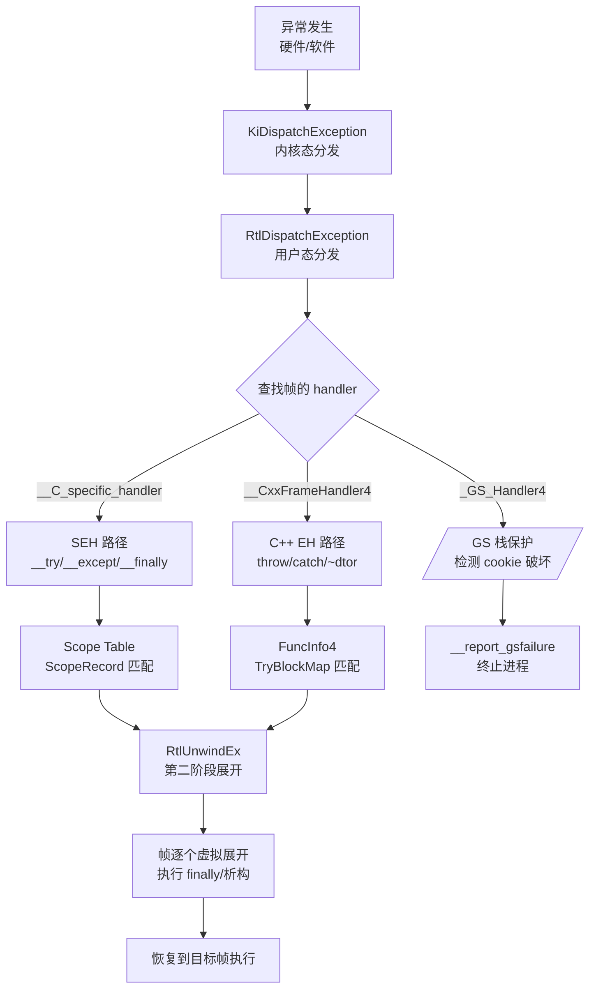
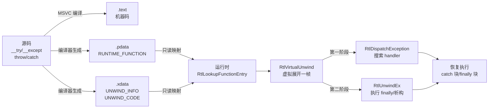

---
tags:
  - ABI
  - 运行时
  - tier3
  - windows
  - SEH
  - 异常处理
---
# Windows x64 SEH 与 Unwind ABI
> [!abstract] TL;DR
> Windows x64 放弃了 x86 的链式 SEH 帧（栈上链表），改用**纯表驱动**的 Unwind ABI：编译器将每个非叶函数的 prologue 信息编码进 `.pdata`（RUNTIME_FUNCTION 数组）和 `.xdata`（UNWIND_INFO + UNWIND_CODE 字节流），运行时通过 `RtlLookupFunctionEntry` / `RtlVirtualUnwind` 零侵入地还原任意帧的寄存器状态，再配合两阶段分发（`RtlDispatchException` 找 handler → `RtlUnwindEx` 真正展开）完成结构化异常处理与 C++ EH。与 Linux DWARF CFI 的核心差异在于：Win64 只为 prologue 建表，epilogue 靠识别代码序列；DWARF 则描述全函数每条指令的 CFA 变化。逆向工程中 `.pdata` 是函数边界的权威来源，SafeSEH/SEHOP 是 x86 遗留缓解措施，x64 上已由表驱动 ABI 天然消除了传统 SEH 链劫持攻击面。

## 概述与定位

### 为什么 x86 SEH 不够用

x86 Windows 的 SEH 实现以**栈帧链表**为基础：每个 `__try` 块在函数进入时把一个 `EXCEPTION_REGISTRATION_RECORD`（包含 handler 指针和指向前一节点的 `prev` 指针）压入栈顶，FS:[0] 始终指向链表头。异常发生时内核沿链表遍历，依次调用每个 handler。

这一设计有两个根本缺陷：

1. **性能**：即使函数从不抛出，进入/退出都要维护链表节点，产生额外的 push/pop 和内存写。
2. **安全**：handler 指针存在栈上，栈溢出可覆盖它，攻击者可劫持控制流（经典的 SEH overwrite 漏洞）。SafeSEH 和 SEHOP 是事后打补丁，治标不治本。

x64 ABI 的设计目标是：**异常路径零开销，handler 元数据脱离栈，存于只读 PE 节**。

### 表驱动 Unwind 的整体架构

```
PE 文件
├── .text          ← 机器码（函数体）
├── .pdata         ← RUNTIME_FUNCTION[]（RVA 三元组数组，只读）
├── .xdata         ← UNWIND_INFO + UNWIND_CODE[]（可变长编码，只读）
└── ...

运行时查询路径：
  RIP → RtlLookupFunctionEntry → RUNTIME_FUNCTION
                                       ↓
                              UNWIND_INFO（via UnwindData RVA）
                                       ↓
                              RtlVirtualUnwind → 虚拟展开一帧
```

`.pdata` 和 `.xdata` 均为只读映射，攻击者无法通过堆/栈溢出覆盖，从根本上消除了 handler 劫持的攻击面。

---

## 原理与机制

### Leaf Function vs Non-Leaf Function

x64 ABI 将函数分为两类：

**叶函数（Leaf Function）**：
- 不调用任何其他函数（即函数生命周期内 RSP 不会因 `CALL` 而改变）。
- 不修改非易失性寄存器（RBX/RBP/RDI/RSI/R12–R15/XMM6–XMM15）。
- 不分配栈空间（或只用红区，x64 Windows 无红区，x64 Linux 有 128 字节红区）。
- **不需要 `.pdata` 条目**，展开时只需弹出返回地址即可。

**非叶函数（Non-Leaf Function）**：
- 调用其他函数，或分配了栈空间，或保存了非易失性寄存器。
- **必须有 `.pdata` 条目**，否则展开器无法还原调用者状态，调试器也无法回溯栈帧。

边界陷阱：内联汇编写的函数若保存了非易失性寄存器但没有对应 `.pdata`，在异常或 `/EH` 展开时会静默破坏寄存器，产生极难调试的内存错误。

### Prologue 的规范形式

x64 ABI 规定 prologue 必须严格按以下顺序执行，展开器依赖此顺序：

```asm
; 1. 保存非易失性整数寄存器（PUSH 形式）
push  rbx
push  rdi
push  rsi
; 2. 分配局部栈空间（SUB 形式）
sub   rsp, 0x58
; 3. 保存非易失性 XMM 寄存器（MOVAPS 到栈）
movaps [rsp+0x20], xmm6
movaps [rsp+0x30], xmm7
; 4. 可选：建立帧指针（LEA 形式）
lea   rbp, [rsp+0x40]
```

**关键约束**：
- 整个 prologue 必须是原子性的（展开器假定 prologue 内任意一点的状态都可由 UNWIND_CODE 序列精确描述）。
- 不允许在 prologue 中有条件跳转（否则展开器无法唯一确定已执行了哪些操作）。
- `CALL` 不能出现在 prologue 中（因为 CALL 会改变 RSP，破坏展开状态的计算）。

---

## 结构/算法/伪代码详解

### .pdata 节：RUNTIME_FUNCTION

`.pdata` 节是 `RUNTIME_FUNCTION` 结构的紧密数组，按 `BeginAddress` 升序排列（便于二分查找）。

```c
// winnt.h
typedef struct _RUNTIME_FUNCTION {
    ULONG BeginAddress;   // 函数起始 RVA（相对虚拟地址，相对于模块基址）
    ULONG EndAddress;     // 函数结束 RVA（不含，即 [Begin, End) 区间）
    ULONG UnwindData;     // UNWIND_INFO 的 RVA，或链式 RUNTIME_FUNCTION 的 RVA
} RUNTIME_FUNCTION, *PRUNTIME_FUNCTION;
```

三个字段的深层含义：

- **BeginAddress / EndAddress**：定义了函数的代码范围。逆向工程中，遍历 `.pdata` 即可得到所有非叶函数的边界——这比启发式函数识别（IDA 的 Function Finder）精确得多，因为它是编译器写入的权威信息。
- **UnwindData**：
  - 若最低位（bit 0）为 0：指向 UNWIND_INFO 结构（常规情况）。
  - 若最低位（bit 0）为 1：去掉最低位后，指向另一个 RUNTIME_FUNCTION（**链式展开**，用于分拆函数或 epilog 的情况）。

`RtlLookupFunctionEntry(ControlPc, ImageBase, HistoryTable)` 的内部实现：
1. 用 `ControlPc - ImageBase` 计算 RVA。
2. 在模块的 `.pdata` 数组中二分搜索，找 `BeginAddress <= RVA < EndAddress` 的条目。
3. 返回指向该 `RUNTIME_FUNCTION` 的指针，同时通过 `ImageBase` 输出参数传回模块基址。

若找不到（叶函数），返回 NULL，展开器直接用 `[RSP]` 取返回地址。

### .xdata 节：UNWIND_INFO

`UNWIND_INFO` 是变长结构，紧跟可变数量的 `UNWIND_CODE` 条目：

```c
// 每个 UNWIND_CODE 占 2 字节（一个 USHORT），部分操作码需要额外 2/4 字节
typedef union _UNWIND_CODE {
    struct {
        UCHAR CodeOffset;   // prologue 内的偏移（从函数起始算起）
        UCHAR UnwindOp : 4; // 操作码（UWOP_xxx 枚举）
        UCHAR OpInfo   : 4; // 操作码附加信息（寄存器编号或大小修饰）
    };
    USHORT FrameOffset;     // 当需要 16 位立即数时作为第二个槽
} UNWIND_CODE, *PUNWIND_CODE;

typedef struct _UNWIND_INFO {
    UCHAR  Version       : 3;  // 必须为 1（当前 ABI 版本）
    UCHAR  Flags         : 5;  // 标志位（见下）
    UCHAR  SizeOfProlog;       // prologue 的字节长度
    UCHAR  CountOfCodes;       // UNWIND_CODE 条目数（非结构数，因有些操作码占多个槽）
    UCHAR  FrameRegister : 4;  // 帧指针寄存器（0=无，1=RCX...15=R15，实际对应寄存器编码）
    UCHAR  FrameOffset   : 4;  // 帧指针相对 RSP 的偏移（实际值 = FrameOffset * 16）
    UNWIND_CODE UnwindCode[1]; // 变长：CountOfCodes 个槽（从高到低地址，即逆 prologue 顺序）
    // 4 字节对齐后跟可选字段：
    // ULONG ExceptionHandler; // 若 Flags & (UNW_FLAG_EHANDLER|UNW_FLAG_UHANDLER)
    // void* HandlerData;      // handler 自定义数据（scope table 等）
    // 或
    // RUNTIME_FUNCTION ChainedUnwindInfo; // 若 Flags & UNW_FLAG_CHAININFO
} UNWIND_INFO, *PUNWIND_INFO;
```

**Flags 字段**（5 位）：

| 位掩码 | 名称 | 含义 |
|--------|------|------|
| `0x01` | `UNW_FLAG_EHANDLER` | 有 exception handler（`__except`/`catch`） |
| `0x02` | `UNW_FLAG_UHANDLER` | 有 unwind handler（`__finally`/析构函数） |
| `0x04` | `UNW_FLAG_CHAININFO` | 链式展开，UnwindCode 后跟另一个 RUNTIME_FUNCTION |

**FrameRegister / FrameOffset**：
- 若使用了帧指针（如 `lea rbp, [rsp+N]`），`FrameRegister` 指定寄存器（RBP=5），`FrameOffset` 存储 `N/16`。
- 展开器在处理 UWOP_SET_FPREG 之后，会用帧指针替代 RSP 作为基准，以支持 RSP 在函数体内变化的情况（如 `alloca`）。

### UNWIND_CODE 操作码完整枚举

| 操作码 | 值 | OpInfo 含义 | 槽数 | 说明 |
|--------|---|------------|------|------|
| `UWOP_PUSH_NONVOL` | 0 | 寄存器编号 | 1 | `PUSH reg`，RSP -= 8 |
| `UWOP_ALLOC_LARGE` | 1 | 0=中型,1=大型 | 2 或 3 | `SUB RSP, N`，N>128 |
| `UWOP_ALLOC_SMALL` | 2 | (N-8)/8 | 1 | `SUB RSP, N`，8≤N≤128 |
| `UWOP_SET_FPREG` | 3 | 0（保留） | 1 | `LEA FP, [RSP+FrameOffset*16]` |
| `UWOP_SAVE_NONVOL` | 4 | 寄存器编号 | 2 | `MOV [RSP+N], reg`，N 为 16 位偏移 |
| `UWOP_SAVE_NONVOL_FAR` | 5 | 寄存器编号 | 3 | `MOV [RSP+N], reg`，N 为 32 位偏移 |
| `UWOP_SAVE_XMM128` | 8 | XMM 寄存器号 | 2 | `MOVAPS [RSP+N], xmmN` |
| `UWOP_SAVE_XMM128_FAR` | 9 | XMM 寄存器号 | 3 | `MOVAPS [RSP+N], xmmN`，32 位偏移 |
| `UWOP_PUSH_MACHFRAME` | 10 | 0=无错误码,1=有 | 1 | 中断/异常帧入口（内核用） |

**UWOP_ALLOC_LARGE 细节**：
- `OpInfo=0`：下一个槽（16 位）存储 `N/8`，实际分配 N 字节，N 最大约 512KB。
- `OpInfo=1`：下两个槽（32 位）存储 N（字节数），支持 4GB 内栈帧，极罕见。

**UWOP_PUSH_MACHFRAME**：用于 IDT/GDT 入口，内核中断处理程序使用。`OpInfo=1` 时表示硬件压入了错误码（如 #PF）。此操作码的 CodeOffset 可为 0（因为是函数的"伪 prologue"）。

**UNWIND_CODE 排列顺序**：数组按 **CodeOffset 降序**存储（即最后执行的 prologue 操作排最前），展开器逆序执行以还原状态。

### 展开算法：RtlVirtualUnwind

`RtlVirtualUnwind` 是 Unwind ABI 的核心。其伪代码如下：

```c
EXCEPTION_ROUTINE* RtlVirtualUnwind(
    ULONG HandlerType,          // 0=UNW_FLAG_NHANDLER, 1=EHANDLER, 2=UHANDLER
    ULONG64 ImageBase,
    ULONG64 ControlPc,
    RUNTIME_FUNCTION* FunctionEntry,
    CONTEXT* ContextRecord,     // [in/out] 当前机器状态，展开后更新
    void** HandlerData,         // [out] handler 自定义数据指针
    ULONG64* EstablisherFrame,  // [out] 此帧的 RSP（展开后）
    KNONVOLATILE_CONTEXT_POINTERS* NvContext  // [out] 非易失寄存器的栈地址
) {
    UNWIND_INFO* ui = (UNWIND_INFO*)(ImageBase + FunctionEntry->UnwindData);
    ULONG64 rsp = ContextRecord->Rsp;
    
    // 1. 判断 ControlPc 是否在 prologue、epilogue 或函数体内
    ULONG offset = (ULONG)(ControlPc - ImageBase - FunctionEntry->BeginAddress);
    
    if (offset < ui->SizeOfProlog) {
        // 在 prologue 内：只执行 CodeOffset > offset 的操作码（已执行的）
        // 注意：展开器要跳过尚未执行的操作
    } else if (IsInEpilog(ControlPc)) {
        // 在 epilogue 内：识别 epilogue 代码序列，模拟执行
        // 不使用 UNWIND_CODE，直接扫描指令
    } else {
        // 在函数体内（正常情况）：执行全部 UNWIND_CODE
        for (int i = 0; i < ui->CountOfCodes; ) {
            UNWIND_CODE* uc = &ui->UnwindCode[i];
            switch (uc->UnwindOp) {
                case UWOP_PUSH_NONVOL:
                    ContextRecord->IntRegs[uc->OpInfo] = *(ULONG64*)rsp;
                    rsp += 8;
                    i += 1;
                    break;
                case UWOP_ALLOC_SMALL:
                    rsp += (uc->OpInfo + 1) * 8;
                    i += 1;
                    break;
                case UWOP_ALLOC_LARGE:
                    if (uc->OpInfo == 0) { rsp += ui->UnwindCode[i+1].FrameOffset * 8; i += 2; }
                    else { rsp += *(ULONG32*)&ui->UnwindCode[i+1]; i += 3; }
                    break;
                case UWOP_SET_FPREG:
                    rsp = ContextRecord->IntRegs[ui->FrameRegister]
                          - ui->FrameOffset * 16;
                    i += 1;
                    break;
                // ... 其他操作码类似
            }
        }
    }
    
    // 2. 更新 RSP：弹出返回地址
    ContextRecord->Rip = *(ULONG64*)rsp;  // 取返回地址
    ContextRecord->Rsp = rsp + 8;
    *EstablisherFrame = rsp;
    
    // 3. 返回 handler（若有）
    if ((ui->Flags & HandlerType) && !(in_prologue || in_epilog)) {
        *HandlerData = (void*)(ImageBase + after_codes_aligned);
        return (EXCEPTION_ROUTINE*)(ImageBase + ui->ExceptionHandler);
    }
    return NULL;
}
```

**Epilogue 识别规则**（展开器扫描字节序列）：
合法 epilogue 模式：
1. `ADD RSP, N` 或 `LEA RSP, [FP+N]`（调整栈指针）
2. 若干 `POP reg`（恢复非易失寄存器）
3. `RET` 或 `JMP [mem]`（通过导入表跳转）或 `JMP reg`

若 ControlPc 落在这些指令的某一处，展开器模拟执行剩余指令（不使用 UNWIND_CODE），还原状态。

### 两阶段异常分发

Windows x64 异常分发分两轮遍历调用栈：

```
第一阶段（搜索 handler）：RtlDispatchException
    ├── 遍历每一帧：RtlVirtualUnwind(UNW_FLAG_EHANDLER)
    ├── 调用 handler(ExceptionRecord, EstablisherFrame, Context, DispatcherContext)
    │       └── handler 返回：
    │           ├── ExceptionContinueSearch  → 继续遍历下一帧
    │           ├── ExceptionContinueExecution → 恢复执行（可修改 Context）
    │           └── ExceptionNestedException  → 嵌套异常
    └── 找到愿意处理的帧后，停止第一阶段

第二阶段（实际展开）：RtlUnwindEx(TargetFrame, TargetIp, ...)
    ├── 遍历每一帧：RtlVirtualUnwind(UNW_FLAG_UHANDLER)
    ├── 调用 handler（此时为 unwind 语义，执行 __finally 块/析构函数）
    └── 直到到达第一阶段找到的目标帧，恢复 Context 继续执行
```

**为什么需要两阶段**：
- 第一阶段是"干运行"（dry run），只决策，不修改任何状态。若 C++ 的 `catch(...)` 匹配类型失败，不应该已经把 `finally` 块跑了一半。
- 第二阶段确认找到目标帧后，才真正执行展开（析构、finally、`__except` 前导），保证原子性语义。

EXCEPTION_RECORD 结构（关键字段）：

```c
typedef struct _EXCEPTION_RECORD {
    NTSTATUS ExceptionCode;         // 异常代码（如 0xC0000005 = ACCESS_VIOLATION）
    ULONG    ExceptionFlags;        // EH_NONCONTINUABLE(1), EH_UNWINDING(2), EH_EXIT_UNWIND(4)
    struct _EXCEPTION_RECORD* ExceptionRecord; // 链式（嵌套异常）
    PVOID    ExceptionAddress;      // 异常发生时的 RIP
    ULONG    NumberParameters;      // 附加参数个数（最多 15）
    ULONG_PTR ExceptionInformation[EXCEPTION_MAXIMUM_PARAMETERS];
    // 对于 ACCESS_VIOLATION：[0]=读(0)/写(1)/执行(8), [1]=故障地址
    // 对于 C++ EH：[0]=0x19930520（魔数）, [1]=C++对象指针, [2]=ThrowInfo*
} EXCEPTION_RECORD, *PEXCEPTION_RECORD;
```

### __C_specific_handler 与 Scope Table

`__C_specific_handler` 是 MSVC 为 `__try`/`__except`/`__finally` 生成的运行时 handler，其 HandlerData 指向一个 **Scope Table**：

```c
typedef struct _SCOPE_TABLE {
    ULONG Count;
    struct {
        ULONG BeginAddress;   // __try 块起始 RVA
        ULONG EndAddress;     // __try 块结束 RVA（不含）
        ULONG HandlerAddress; // filter 函数 RVA（__except）或 finally 函数 RVA（__finally）
                              // 特殊值：1 = __finally 块（无 filter）
        ULONG JumpTarget;     // __except 块起始 RVA（handler 执行位置）
                              // 0 = __finally 块（无 jump target）
    } ScopeRecord[1];         // Count 个条目，按嵌套从内到外排列
} SCOPE_TABLE;
```

**第一阶段**（`ExceptionFlags` 不含 `EH_UNWINDING`）：
1. 遍历 ScopeRecord，找 `BeginAddress <= ControlPc < EndAddress` 的条目。
2. 若 `JumpTarget != 0`（`__except`）：调用 `HandlerAddress`（filter 函数），传入 `GetExceptionInformation()`。
   - Filter 返回 `EXCEPTION_EXECUTE_HANDLER(1)`：返回 `ExceptionCollidedUnwind`，告知分发器此帧处理异常。
   - Filter 返回 `EXCEPTION_CONTINUE_SEARCH(0)`：继续搜索外层 scope。
   - Filter 返回 `EXCEPTION_CONTINUE_EXECUTION(-1)`：恢复执行。
3. 若 `JumpTarget == 0`（`__finally`）：第一阶段跳过。

**第二阶段**（`ExceptionFlags` 含 `EH_UNWINDING`）：
1. 遍历 ScopeRecord，找匹配 ControlPc 的条目。
2. 若 `JumpTarget == 0`（`__finally`）：调用 finally handler（`HandlerAddress`），传入 `abnormal=TRUE`。
3. 若 `JumpTarget != 0` 且是目标帧：用 `JumpTarget` 作为返回地址，恢复执行。

### C++ EH：__CxxFrameHandler4 与 FuncInfo

C++ 异常由 `__CxxFrameHandler4`（MSVC 2019+ 的版本 4 编码）处理，其 HandlerData 指向 `FuncInfo4` 结构（相较早期版本采用了压缩编码）：

```c
// 简化的逻辑结构（实际为压缩编码，非直接内存布局）
struct FuncInfo4 {
    uint32_t magicNumber;       // 0x19930522（C++ EH 魔数）
    int32_t  maxState;          // 最大状态数（try depth）
    uint32_t dispUnwindMap;     // UnwindMap[] 的 RVA（析构动作表）
    uint32_t dispTryBlockMap;   // TryBlockMap[] 的 RVA（try 块与 catch 的映射）
    uint32_t dispIPtoStateMap;  // IP-to-State 表的 RVA（当前 IP 对应的 try 嵌套深度）
    uint32_t dispHandlerType;   // 可选：类型相关信息
};

struct TryBlockMapEntry {
    int32_t  tryLow;            // try 块的最低状态
    int32_t  tryHigh;           // try 块的最高状态
    int32_t  catchHigh;         // catch 块结束状态
    int32_t  nCatches;          // catch 处理器个数
    uint32_t dispHandlerArray;  // HandlerType[] 的 RVA
};

struct HandlerType {
    uint32_t adjectives;        // 标志（const、reference、ellipsis 等）
    uint32_t dispType;          // TypeDescriptor 的 RVA（nullptr = catch(...)）
    int32_t  dispCatchObj;      // catch 参数相对帧的偏移（0=无参数）
    uint32_t dispOfHandler;     // catch 块代码的 RVA
    uint32_t dispFrame;         // 帧指针（用于 re-throw 时定位对象）
};

struct TypeDescriptor {
    void**   pVFTable;          // type_info 的 vftable（RTTI）
    void*    spare;             // 保留
    char     name[];            // mangled 类型名（如 ".PAVstdexception@@"）
};
```

**C++ EH 的 IP-to-State 机制**：

MSVC 维护一个隐式的"EH 状态机"。每当进入 try 块或构造一个有析构函数的对象，状态计数器递增；退出时递减。IPtoStateMap 将每段 RIP 区间映射到状态值，展开器由此知道当前需要析构哪些对象。

注意：与 x86 的显式状态变量（存在栈帧中）不同，x64 的状态完全由 IP 推导，**无运行时开销**。

### SEH 与 C++ EH 的关系



C++ `throw` 调用 `RaiseException(0xE06D7363, ...)` 触发 SEH 异常，ExceptionInformation[0] 固定为 `0x19930520`，这是 C++ EH 与底层 SEH 的接驳点。

---

## 工具视角与实战

### dumpbin /unwindinfo：解析 .pdata/.xdata

```
> dumpbin /unwindinfo example.dll

Function Table (1234 entries):

  00001000 00001234 0005A000
    Unwind version: 1
    Unwind flags: EHANDLER
    Size of prologue: 0x17
    Count of codes: 8
    Frame register: rbp
    Frame offset: 0x30

    Unwind codes:
      17: SET_FPREG, rbp offset=0x30
      11: ALLOC_SMALL, size=0x58
      0C: PUSH_NONVOL, register=rdi
      0B: PUSH_NONVOL, register=rsi
      0A: PUSH_NONVOL, register=rbx

    Exception handler: 00056780 (__C_specific_handler)
    Handler data: 000567A0
      Scope table -- count=2
        00001050  00001100  00056800  00001150  (try 1)
        00001080  000010F0  00000001  00000000  (finally)
```

### IDA Pro 逆向：利用 .pdata 恢复函数边界

IDA 在加载 PE 时自动解析 `.pdata`，生成函数边界。对于 stripped 的 release binary，这是最可靠的函数识别手段：

```python
# IDAPython：遍历所有 RUNTIME_FUNCTION
import ida_nalt, ida_funcs, idc

pdata_seg = ida_segment.get_segm_by_name(".pdata")
ea = pdata_seg.start_ea
while ea < pdata_seg.end_ea:
    begin_rva = idc.get_wide_dword(ea)
    end_rva   = idc.get_wide_dword(ea + 4)
    unwind_rva = idc.get_wide_dword(ea + 8)
    base = ida_nalt.get_imagebase()
    print(f"Function: {base+begin_rva:#x} - {base+end_rva:#x}, "
          f"UNWIND_INFO @ {base+unwind_rva:#x}")
    ea += 12  # sizeof(RUNTIME_FUNCTION)
```

`.pdata` 给出的函数边界比 IDA 的 Function Finder 更准确，尤其对于：
- 尾调用优化（tail call）后被合并的函数
- 手写汇编存根（thunks）
- 编译器生成的特殊 prologue（如 `/guard:cf` 的 `__guard_check_icall_nop`）

### WinDbg：展开栈帧

```
0:000> k                  ; 回溯调用栈（依赖 .pdata）
0:000> .fnent <address>   ; 显示指定地址的 RUNTIME_FUNCTION
0:000> !unwind            ; 手动触发展开，显示每帧的 UNWIND_INFO
```

查看 UNWIND_INFO 原始字节：

```
0:000> dt ntdll!_UNWIND_INFO <address>
0:000> db <xdata_address> L40  ; dump 原始字节
```

### 手工构造 UNWIND_INFO（汇编实现非叶函数）

MASM 中可用 `.PUSHREG`/`.ALLOCSTACK` 等伪指令自动生成 `.pdata`/`.xdata`：

```asm
MyFunc PROC FRAME
    .PUSHREG rbx
    push    rbx
    .PUSHREG rdi
    push    rdi
    .ALLOCSTACK 0x28
    sub     rsp, 0x28
    .ENDPROLOG          ; 标记 prologue 结束
    
    ; 函数体
    ...
    
    add     rsp, 0x28
    pop     rdi
    pop     rbx
    ret
MyFunc ENDP
```

MASM 会据此生成正确的 `.pdata` 和 `.xdata` 条目，省去手动填写的麻烦。

### 链式展开（Chained Unwind Info）

当函数过大（prologue 超过 255 字节）或编译器将函数分拆为多个代码块时，使用链式展开：

```
UNWIND_INFO（主块）
  Flags: UNW_FLAG_CHAININFO
  UnwindCode[0..N]   ← 仅描述主块的 prologue
  RUNTIME_FUNCTION   ← 尾部：指向父 UNWIND_INFO（共用 prologue）
```

逆向时发现 `Flags & 0x04` 为真，则需继续跟踪链式 RUNTIME_FUNCTION，将两段 UNWIND_CODE 合并解释。

---

## 安全性与正确使用

### SafeSEH（x86 遗留机制）

SafeSEH 是针对 x86 SEH 链劫持的缓解措施：

**机制**：链接器在 PE 的 `IMAGE_LOAD_CONFIG_DIRECTORY` 中嵌入一个 `SEHandlerTable`（合法 handler 的 RVA 数组）和 `SEHandlerCount`。当 OS（XP SP2+）分发 SEH 时，验证即将调用的 handler 是否在白名单内。

```c
// 链接器生成（IMAGE_LOAD_CONFIG_DIRECTORY 扩展字段）
typedef struct {
    ...
    ULONG SEHandlerCount;   // 合法 handler 数量
    ULONG SEHandlerTable;   // handler RVA 数组的 VA
} IMAGE_LOAD_CONFIG_DIRECTORY32;
```

**绕过方法（历史）**：
- 利用不含 SafeSEH 的模块（如旧 DLL）中的 handler 地址
- `pop pop ret` 序列（使 handler 地址指向可控数据）
- Heap spray 覆盖 `SEHandlerTable`（需绕过 ASLR）

**x64 上 SafeSEH 不适用**：x64 的 SEH 完全基于 `.pdata`/`.xdata`，OS 只调用 `.xdata` 中登记的 handler，攻击者无法注入 handler 指针到栈上，SafeSEH 的问题场景在 x64 上不存在。

### SEHOP（SEH Overwrite Protection）

SEHOP 是 Vista SP1 引入的针对 x86 SEH 链完整性的缓解：

**机制**：OS 在线程创建时，在 SEH 链的末尾（最顶层帧）放一个已知的哨兵 handler（`ntdll!FinalExceptionHandler`）。当异常发生时，在遍历 SEH 链之前，先验证链的尾部是否为哨兵，若被破坏则直接终止进程。

```
SEH 链（栈从低到高）：
  handler3 → handler2 → handler1 → FinalExceptionHandler（哨兵）
  
攻击者覆盖链后：
  handler3 → ATTACKER_ADDR → （链中断）
  
SEHOP 检测：
  验证 chain[-1] == FinalExceptionHandler：失败 → 终止
```

**绕过方法（历史）**：
- 信息泄露获取哨兵地址（ASLR 使哨兵地址随机化，但 32 位熵有限）
- 伪造完整的 SEH 链（需要精确控制栈布局）

### x64 表驱动 ABI 的安全增益

x64 SEH 的根本安全性来自：

1. **Handler 地址不在栈上**：`.xdata` 映射为只读（或至少不与可写内存重叠），堆/栈溢出无法覆盖 handler 指针。
2. **函数边界由 .pdata 决定**：OS 只对有 `.pdata` 条目的地址范围执行展开，ROP 链中的 gadget 地址通常没有对应的 RUNTIME_FUNCTION，展开器会在第一个无效帧处停止（无法跨越无 `.pdata` 的 gadget）。
3. **CFG（Control Flow Guard）**：`/guard:cf` 在间接调用点插入 `__guard_check_icall`，验证目标地址在编译期确定的合法间接调用目标集合内。对于 SEH 相关的 handler 调用，CFG 额外用 `__guard_eh_cont_table` 验证 catch 块的入口地址。

### 正确使用 __try/__except 的边界陷阱

**陷阱 1：filter 表达式中不能有 C++ 对象**

```c
// 错误：filter 中的临时对象析构顺序未定义
__except(log_exception(GetExceptionInformation()), EXCEPTION_CONTINUE_SEARCH) {
    // log_exception 内部若用 std::string，可能在展开路径上造成重入
}
```

**陷阱 2：__finally 中不能 return/goto**

`__finally` 中的 `return`/`goto` 会触发隐式 `EXCEPTION_CONTINUE_EXECUTION` 语义（仅 x86），在 x64 上行为未定义（实际上 MSVC 会将 `__finally` 中的 `return` 编译为正常返回并警告 C4532）。

**陷阱 3：setjmp/longjmp 与 SEH 的交互**

`_setjmp` 在 x64 上保存 RIP/RSP/RBP 等寄存器，`longjmp` 调用 `RtlUnwindEx` 执行真正的展开（触发路径上的 `__finally`），而非简单的寄存器恢复。这意味着 `longjmp` 的开销在 x64 上显著高于 x86。

**陷阱 4：叶函数识别**

若函数体内含有 `__try`，MSVC 会自动将其标记为非叶，生成 `.pdata`。若手写汇编混合了 `CALL` 指令但没有 `.pdata`，异常到达时展开器会因找不到 RUNTIME_FUNCTION 而直接终止进程（`STATUS_ACCESS_VIOLATION` 在展开路径上 = 不可恢复）。

---

## 小结



Windows x64 SEH/Unwind ABI 的设计哲学可归纳为五点：

1. **零运行时开销**：正常路径不接触 `.pdata`/`.xdata`，异常仅在发生时才有开销（表查询 + 虚拟展开）。
2. **数据与代码分离**：展开元数据存于只读 PE 节，根除了 x86 栈链劫持的攻击面。
3. **Prologue 完整描述**：UNWIND_CODE 精确覆盖 prologue 的每一步，加上 epilogue 识别规则，理论上任意 RIP 位置都可展开。
4. **两阶段语义**：先决策后执行，保证异常处理的原子语义，防止部分展开后无法继续。
5. **可扩展 handler 体系**：`__C_specific_handler`、`__CxxFrameHandler4`、`_GS_Handler4` 共用同一底层 unwind 引擎，通过 HandlerData 多态分发，语言级语义解耦于 OS 级展开机制。

与 Linux DWARF CFI 的终极对比：

| 维度 | Windows x64 SEH | Linux DWARF CFI |
|------|-----------------|-----------------|
| 覆盖范围 | 仅 prologue（+ epilogue 识别） | 每条指令都有对应 CFA 规则 |
| 编码方式 | 自定义字节码（UNWIND_CODE） | DWARF 操作码（`.eh_frame`） |
| 大小 | 较紧凑 | 较冗长（CIE + FDE） |
| 精确度 | prologue 外依赖 epilogue 扫描 | 精确到任意指令 |
| Handler | 在 `.xdata` 中（只读） | 在 `.eh_frame` GCC 扩展中 | 
| 展开类型 | 双阶段（filter + unwind） | 单遍（personality function） |
| 内核支持 | `RtlVirtualUnwind` 在 ntdll | `libgcc`/`libunwind` 用户态 |

两者都是"表驱动"，但 Windows 的表只描述 prologue，用识别规则处理 epilogue；DWARF 的表覆盖全函数但体积更大。Windows 方案在实现上更简单（展开器代码量约为 DWARF 展开器的 1/3），但对编译器的 prologue 规范要求更严格。

---

## 相关阅读

- [Microsoft 官方 x64 Exception Handling 文档](https://learn.microsoft.com/en-us/cpp/build/exception-handling-x64)
- [Microsoft x64 ABI 规范：Prolog and Epilog](https://learn.microsoft.com/en-us/cpp/build/prolog-and-epilog)
- [winnt.h RUNTIME_FUNCTION / UNWIND_INFO 定义](https://github.com/mic101/windows/blob/master/WRK-v1.2/public/sdk/inc/ntdef.h)
- [MSVC __C_specific_handler 源码分析（ReactOS）](https://github.com/reactos/reactos/blob/master/sdk/lib/crt/except/except.c)
- Matt Pietrek, "A Crash Course on the Depths of Win32 Structured Exception Handling", *MSJ* 1997
- Ken Johnson (Skywing), "Programming against the x64 exception handling ABI", *NTInternals* 2006
- Ero Carrera, "Exceptions Directory Entry (.pdata)", PE Format Deep Dive
- [[11.eh_frame与DWARF_CFI|第11章：.eh_frame 与 DWARF CFI（Linux 对比）]]

---

[[00.C_C++运行时与ABI总览|⬆ 系列总览]] | [[14.C运行时库与启动全景实战|← 上一章]] | [[16.C++协程ABI与协程帧布局|→ 下一章]]
