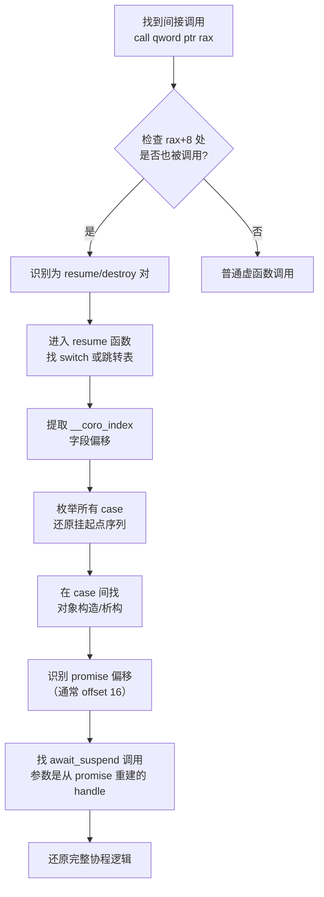

---
tags:
  - ABI
  - 运行时
  - tier3
  - C++
  - coroutine
  - ABI
---
# C++协程ABI与协程帧布局
> [!abstract] TL;DR
> C++20 协程在编译器层面被 lowering 为状态机：协程帧（coroutine frame）是一个堆分配的结构体，偏移 0/8 存放 resume/destroy 函数指针（ABI 固定），之后依次是 `promise_type`、挂起点索引 `__coro_index`、参数副本与局部变量。`coroutine_handle<T>` 本质是裸指针，指向该帧。`co_await` 展开为 `await_transform` → `await_ready` → `await_suspend` → `await_resume` 四步；`final_suspend` 必须 `noexcept` 且常返回 `std::suspend_always` 以避免帧提前销毁。HALO 优化在调用者生命期可见时可省略堆分配。对称传递（symmetric transfer）利用尾调用 ABI 实现 O(1) 链式协程切换，避免栈溢出。Clang 用 `__builtin_coro_*` 系列 intrinsic，MSVC 有独立的内部 intrinsic，帧布局存在差异。逆向时通过识别 resume/destroy 双指针与 switch-case 状态机即可还原协程逻辑。

## 概述与定位

C++20 协程（Coroutines）是标准化进入语言核心的第一个无栈（stackless）协程机制，以 `co_await`、`co_yield`、`co_return` 三个关键字为语法入口，由编译器完成从「可挂起函数」到「状态机 + 堆帧」的完整转换。与 Boost.Context、ucontext_t 等有栈协程不同，C++20 协程**不保留独立的调用栈**，所有跨挂起点存活的局部变量都被提升（promoted）到堆上的协程帧中；恢复时只需跳转到帧内记录的挂起点偏移处，无需切换栈指针。

### 为什么需要理解协程 ABI

ABI 层面的协程帧布局有以下工程意义：

1. **跨编译单元互操作**：协程的 `coroutine_handle` 是跨 TU 传递的不透明指针，接收方必须按 ABI 约定偏移访问 resume/destroy 指针。
2. **内存模型与析构**：协程帧的生命周期由用户代码手动控制（`handle.destroy()`），错误理解布局会导致 double-free 或泄漏。
3. **性能分析**：HALO 优化能否触发直接决定是否产生堆分配；理解条件才能写出可被优化的协程代码。
4. **逆向与安全分析**：二进制中的协程状态机有独特的 switch-case 模式，识别它是逆向分析现代 C++ 异步代码的基础。

### 与其他语言协程的横向对比

| 特性 | C++20 协程 | Go goroutine | Python asyncio | Rust async/await |
|------|-----------|-------------|---------------|-----------------|
| 栈类型 | 无栈（堆帧） | 有栈（可增长栈） | 无栈（帧对象） | 无栈（Future 状态机） |
| 帧分配 | `operator new`（可省略） | 运行时分配 2-8KB | 解释器堆 | 调用者分配（零堆） |
| 调度 | 用户自定义 | M:N 运行时 | 事件循环 | 执行器（Executor） |
| ABI 固定 | 是（前 16 字节） | 无公开 ABI | 无 | 无 |
| 对称传递 | 支持（尾调用） | 不适用 | 不支持 | 支持 |

C++20 的设计哲学是「zero-overhead abstraction」——标准只规定语义，具体帧布局由编译器决定，但 Clang 与 MSVC 均事实上固定了前 16 字节的 resume/destroy 指针约定，这构成了事实 ABI。

## 原理与机制

### 协程帧的本质：一个编译器生成的结构体

当编译器遇到包含 `co_await`/`co_yield`/`co_return` 的函数时，整个函数体被重写。原函数变为一个**协程帧分配器与启动器**，真正的函数逻辑被编译进两个内部函数：

- `__coro_resume(void* frame)`：恢复协程执行
- `__coro_destroy(void* frame)`：销毁协程帧并调用析构

协程帧（coroutine frame）是一个匿名结构体，其精确内存布局如下（以 Clang/Itanium ABI 为基准）：

```
+-----------------------------------+  <- frame ptr (coroutine_handle::address())
| offset 0:  void (*resume)(void*)  |  8 bytes — resume 函数指针
+-----------------------------------+
| offset 8:  void (*destroy)(void*) |  8 bytes — destroy 函数指针
+-----------------------------------+
| offset 16: promise_type           |  sizeof(promise_type) bytes
+-----------------------------------+
| [padding if needed]               |
+-----------------------------------+
| __coro_index (挂起点索引)          |  通常 2~4 bytes (int16_t 或 int32_t)
+-----------------------------------+
| 参数副本（函数参数的拷贝）          |
+-----------------------------------+
| 跨挂起点存活的局部变量             |
+-----------------------------------+
| [临时对象，生命期不跨挂起点，可栈上] |
+-----------------------------------+
```

**偏移 0 和 8 是 ABI 约定中最关键的部分**：无论 `promise_type` 是何类型，无论局部变量有多少，前 16 字节永远是函数指针对。`coroutine_handle<void>::resume()` 的实现仅仅是：

```cpp
// coroutine_handle<T>::resume() 的实际实现（伪代码）
void coroutine_handle<T>::resume() const {
    // this->ptr_ 是帧指针
    auto fn = *reinterpret_cast<void(**)(void*)>(ptr_);  // 读偏移 0
    fn(ptr_);
}

void coroutine_handle<T>::destroy() const {
    auto fn = *reinterpret_cast<void(**)(void*)>(
        reinterpret_cast<char*>(ptr_) + 8);  // 读偏移 8
    fn(ptr_);
}
```

### coroutine_handle<T>：裸指针的类型安全包装

`std::coroutine_handle<T>` 的本质是一个包含单个 `void*` 成员的类模板：

```cpp
template<typename Promise = void>
struct coroutine_handle {
    void* ptr_ = nullptr;  // 协程帧指针，唯一数据成员

    static coroutine_handle from_address(void* addr) noexcept {
        coroutine_handle h;
        h.ptr_ = addr;
        return h;
    }

    void* address() const noexcept { return ptr_; }

    Promise& promise() const {
        // 从帧指针计算 promise 对象的地址
        // 实际偏移由编译器的 __builtin_coro_promise 确定
        return *reinterpret_cast<Promise*>(
            __builtin_coro_promise(ptr_, alignof(Promise), false));
    }

    bool done() const noexcept {
        // 检查 resume 函数指针是否为 nullptr（表示到达 final suspend）
        return *reinterpret_cast<void(**)(void*)>(ptr_) == nullptr;
    }
};
```

`from_promise()` 是反向操作——从 `promise_type` 对象获取 `coroutine_handle`：

```cpp
static coroutine_handle from_promise(Promise& p) noexcept {
    // __builtin_coro_promise(ptr, align, /*from_promise=*/true) 返回帧指针
    // 即从 promise 地址反推帧起始地址
    coroutine_handle h;
    h.ptr_ = __builtin_coro_promise(
        std::addressof(p), alignof(Promise), /*from_promise=*/true);
    return h;
}
```

这个双向转换依赖编译器知道 `promise_type` 在帧内的精确偏移。

### promise_type 的角色：协程的策略接口

`promise_type` 不是标准的 Promise（如 `std::promise<T>`），而是用户定义的**策略类**，编译器通过它的方法控制协程行为：

```cpp
struct my_promise {
    // 1. 协程启动时的初始挂起行为
    std::suspend_always initial_suspend() noexcept;  // 惰性启动
    // 或
    std::suspend_never initial_suspend() noexcept;   // 立即执行

    // 2. co_return 时被调用
    void return_void();           // co_return; 或函数末尾
    void return_value(T val);     // co_return expr;

    // 3. 最终挂起（必须 noexcept！）
    std::suspend_always final_suspend() noexcept;

    // 4. 异常逃逸协程体时被调用
    void unhandled_exception();

    // 5. 获取协程返回对象（给调用者）
    ReturnType get_return_object();

    // 6. 可选：co_await 的变换钩子
    template<typename Expr>
    auto await_transform(Expr&& e);
};
```

编译器通过 `std::coroutine_traits<ReturnType, ArgTypes...>::promise_type` 查找 `promise_type`，这允许对同一返回类型的不同参数组合定制行为。

## 结构/算法/伪代码详解

### co_await 的完整展开步骤

以 `co_await expr` 为例，编译器生成的等价逻辑如下（精确展开顺序）：

```cpp
// 原始代码
auto result = co_await expr;

// 编译器展开后的伪代码
auto&& awaitable = [&]() -> decltype(auto) {
    // 步骤 1: await_transform（若 promise 有此方法）
    if constexpr (has_await_transform<promise_type>) {
        return promise.await_transform(static_cast<decltype(expr)>(expr));
    } else {
        return static_cast<decltype(expr)>(expr);
    }
}();

// 步骤 2: 获取 awaiter 对象（通过 operator co_await 或直接使用）
auto&& awaiter = get_awaiter(awaitable);
// get_awaiter 按此优先级：awaitable.operator co_await() > 
//   operator co_await(awaitable) > awaitable 本身

// 步骤 3: await_ready — 快速路径，避免挂起开销
if (!awaiter.await_ready()) {
    // 步骤 4: 保存状态到协程帧
    __coro_index = N;  // 当前挂起点编号
    // （此时跨挂起点的局部变量已在帧中）

    // 步骤 5: await_suspend — 挂起，将控制权交出
    // await_suspend 的三种返回值类型：
    //   void:               无条件挂起
    //   bool:               true=挂起, false=立即恢复
    //   coroutine_handle<>: 对称传递，恢复目标协程
    auto suspend_result = awaiter.await_suspend(
        coroutine_handle<promise_type>::from_promise(promise));
    
    // 根据返回类型处理
    if constexpr (is_void_v<decltype(suspend_result)>) {
        return;  // 挂起，返回调用者/恢复者
    } else if constexpr (is_bool_v<decltype(suspend_result)>) {
        if (suspend_result) return;  // 真正挂起
        // 否则 fall through 到 await_resume
    } else {
        // coroutine_handle 对称传递：尾调用恢复目标协程
        suspend_result.resume();
        return;
    }

RESUME_POINT_N:  // resume 函数跳转到这里
    ;  // 编译器生成的标签
}

// 步骤 6: await_resume — 获取挂起结果
auto result = awaiter.await_resume();
```

**边界陷阱**：`await_suspend` 执行完成、协程被挂起后，另一个线程可能**立刻**恢复甚至销毁该协程。因此 `await_suspend` 返回后不能再访问 `this` 或任何协程局部变量——它们可能已被覆写或释放。这是协程中最常见的 use-after-free 场景。

### 状态机变换：switch-case 代码生成

以下是一个简单协程及其编译器生成的等价 C 代码：

```cpp
// 原始协程
Task<int> compute(int x) {
    int a = x * 2;
    co_await some_async_op();     // 挂起点 1
    int b = a + 1;
    co_await another_async_op();  // 挂起点 2
    co_return a + b;
}
```

编译器生成的协程帧结构（伪代码）：

```c
// 编译器生成的帧结构（伪 C）
struct compute_frame {
    void (*__resume)(compute_frame*);   // offset 0
    void (*__destroy)(compute_frame*);  // offset 8
    Task<int>::promise_type promise;    // offset 16
    int16_t __coro_index;               // 挂起点索引
    // 参数副本
    int x;
    // 跨挂起点的局部变量
    int a;
    int b;
    // awaiter 对象（若跨越挂起点）
    SomeAsyncOp __awaiter1;
    AnotherAsyncOp __awaiter2;
};
```

编译器生成的 resume 函数（状态机核心）：

```c
void compute_resume(compute_frame* frame) {
    // 从帧中恢复 promise 引用
    auto& promise = frame->promise;

    switch (frame->__coro_index) {
    case 0:  // 初始状态（从头开始执行）
        // initial_suspend
        {
            auto&& is = promise.initial_suspend();
            if (!is.await_ready()) {
                frame->__coro_index = -1;  // initial_suspend 点
                is.await_suspend(
                    coroutine_handle<promise_type>::from_promise(promise));
                return;
            }
        }
INITIAL_SUSPEND_RESUME:
        // 协程体开始
        frame->a = frame->x * 2;

        // co_await some_async_op()
        frame->__awaiter1 = some_async_op();
        if (!frame->__awaiter1.await_ready()) {
            frame->__coro_index = 1;  // 挂起点 1
            frame->__awaiter1.await_suspend(
                coroutine_handle<promise_type>::from_promise(promise));
            return;  // 真正挂起
        }
        goto SUSPEND_POINT_1_RESUME;

    case 1:  // 从挂起点 1 恢复
SUSPEND_POINT_1_RESUME:
        /* await_resume 的结果此处被丢弃（co_await 无赋值） */
        frame->__awaiter1.await_resume();
        frame->b = frame->a + 1;

        // co_await another_async_op()
        frame->__awaiter2 = another_async_op();
        if (!frame->__awaiter2.await_ready()) {
            frame->__coro_index = 2;  // 挂起点 2
            frame->__awaiter2.await_suspend(
                coroutine_handle<promise_type>::from_promise(promise));
            return;
        }
        goto SUSPEND_POINT_2_RESUME;

    case 2:  // 从挂起点 2 恢复
SUSPEND_POINT_2_RESUME:
        frame->__awaiter2.await_resume();

        // co_return a + b
        promise.return_value(frame->a + frame->b);
        goto FINAL_SUSPEND;

    FINAL_SUSPEND:
        // 析构跨挂起点的局部变量（按照反序）
        frame->__awaiter2.~AnotherAsyncOp();
        frame->__awaiter1.~SomeAsyncOp();

        // final_suspend
        {
            auto&& fs = promise.final_suspend();  // 必须 noexcept
            if (!fs.await_ready()) {
                frame->__resume = nullptr;  // 标记协程已完成 (done() == true)
                fs.await_suspend(
                    coroutine_handle<promise_type>::from_promise(promise));
                return;
            }
        }
        // final_suspend 不挂起则直接销毁
        goto DESTROY;

    DESTROY:
        // 调用 destroy 路径的析构
        frame->promise.~promise_type();
        operator delete(frame);
        return;
    }
}
```

**关键观察**：`__coro_index` 的值在不同编译器/优化级别下可能是负数（-1 代表 initial suspend），或使用紧凑的枚举。Clang 在 `-O2` 下有时用跳转表（`jmp qword ptr [rax*8 + table]`），`-O0` 下是 if-else 链。

### initial_suspend 与 final_suspend 的语义

**initial_suspend** 控制协程是否在执行任何代码前先挂起：
- `suspend_never`：调用协程函数后立即开始执行，直到第一个 `co_await`
- `suspend_always`：调用后立即将控制返回调用者，需显式 `handle.resume()` 才开始执行（惰性协程）

**final_suspend 必须 noexcept 的原因**：
`final_suspend` 在协程体完成执行（`co_return` 之后、帧销毁之前）被调用。此时：
1. 协程体内的所有析构已完成（或正在进行）
2. 没有调用栈可以传播异常
3. 若此处抛出异常，C++ 运行时调用 `std::terminate()`（因为无法在 noexcept 上下文中传播）

若 `final_suspend` 返回 `suspend_always`（最常见用法），协程帧保持存活，调用者通过 `handle.done()` 检测完成并取走结果后手动调用 `handle.destroy()`。若返回 `suspend_never`，帧在函数内部自动销毁——此后持有的 `coroutine_handle` 变为悬垂指针，是严重的 UB。

### 异常处理：协程体内的异常传播

协程函数体被一个隐式的 try-catch 包裹：

```cpp
// 编译器生成的协程体包装（伪代码）
try {
    // ... 协程体（包含所有 co_await/co_yield）...
    promise.return_void();  // 或 return_value
} catch (...) {
    promise.unhandled_exception();  // 用户处理异常
}
// goto FINAL_SUSPEND
```

`unhandled_exception()` 通常的实现是 `eptr_ = std::current_exception()` 将异常存入 `promise` 中；当 `Task<T>::operator co_await` 的 `await_resume` 被调用时，再 `std::rethrow_exception(eptr_)` 重新抛出，传播给等待该协程的父协程。

**边界陷阱**：若 `unhandled_exception()` 本身抛出异常，行为未定义（C++20 规范要求不抛出，否则 `std::terminate`）。

### HALO：堆分配省略优化

Heap Allocation eLision Optimization（HALO）是 Clang/GCC 实施的一个关键优化，在满足条件时将协程帧分配在调用者的栈帧或内联到调用者对象中。

**触发条件**：
1. 协程对象（`coroutine_handle`）的生命周期对调用者的编译单元可见（不逃逸到编译单元外）
2. 协程帧大小在编译期可确定
3. 调用者的生命期严格覆盖协程生命期（无须堆分配来延长）

```cpp
// HALO 可触发的场景
Task<void> inner() {
    co_await std::suspend_never{};
    co_return;
}

Task<void> outer() {
    // inner() 的帧可以分配在 outer 的帧内（不逃逸）
    co_await inner();  // HALO 可能省略 inner 的 operator new
}
```

**HALO 无法触发的场景**：
- 协程 handle 存入容器或全局变量（逃逸分析失败）
- 协程 handle 通过虚函数传递
- 帧大小不确定（VLA 等，但 C++20 协程不允许 VLA）

可用 `-fcoro-elide-allocations`（Clang）或检查汇编中是否有 `call operator new` 来确认优化是否生效。

### 对称传递（Symmetric Transfer）

对称传递允许一个协程的 `await_suspend`（通常是 `final_suspend` 的 awaiter）返回 `coroutine_handle<Other>` 来直接恢复另一个协程，而不经过调用栈的中间层，实现 O(1) 的链式协程切换。

**问题背景**：在 Task 实现中，若 inner 协程完成时通过 `parent_handle.resume()` 恢复父协程，每层嵌套都会加深调用栈：

```
outer::resume -> inner::resume -> inner_inner::resume -> ...
                                                        <- 返回
                                    <- 返回
               <- 返回
```

N 层嵌套会导致 O(N) 的调用栈深度，造成栈溢出。

**对称传递解法**：

```cpp
struct final_awaiter {
    bool await_ready() noexcept { return false; }

    // 返回 coroutine_handle<> 触发对称传递
    std::coroutine_handle<> await_suspend(
        std::coroutine_handle<promise_type> h) noexcept {
        // 返回父协程的 handle，编译器用尾调用实现恢复
        return h.promise().continuation_;  // 父协程 handle
    }

    void await_resume() noexcept {}
};
```

编译器将 `await_suspend` 返回 `coroutine_handle<>` 的情况变换为**尾调用**（tail call）：

```asm
; 伪汇编：对称传递的尾调用
call    inner_final_suspend_await_suspend   ; 获取父协程 handle
; 返回值是父协程的帧指针（rax）
mov     rdi, rax                            ; 帧指针作为参数
mov     rax, [rdi]                          ; 读取 resume 函数指针（offset 0）
jmp     rax                                 ; 尾调用！栈帧不增长
```

这将 O(N) 栈深度降为 O(1)，是实现生产级 `Task<T>` 的关键。**在 Clang 中**，这由 `__builtin_coro_resume`（尾调用版本）实现；**在 MSVC 中**，编译器识别返回 `coroutine_handle<>` 的 `await_suspend` 并自动生成尾跳转。

## 工具视角与实战

### Clang 与 MSVC 的帧布局差异

```
Clang (Itanium ABI 约定)          MSVC (x64 __cdecl)
─────────────────────────          ─────────────────────
offset  0: resume fn ptr           offset  0: resume fn ptr
offset  8: destroy fn ptr          offset  8: destroy fn ptr  
offset 16: promise_type            offset 16: promise_type
offset ?: __coro_index (i16)       offset ?: __coro_index (i32, 通常)
offset ?: 局部变量                  offset ?: 局部变量
```

主要差异点：

| 方面 | Clang | MSVC |
|------|-------|------|
| 挂起点索引类型 | `int16_t`（2 字节） | `int32_t`（4 字节） |
| 索引值含义 | 0=初始, N=挂起点N, -1=final | 0=initial, 正数=挂起点, INT_MAX=final |
| promise 偏移 | `__builtin_coro_promise` | 固定于偏移 16（对齐后） |
| 内部 intrinsic | `__builtin_coro_*` | `_coro_resume`, `_coro_destroy` 等 |
| 对称传递 | 尾调用 `__builtin_coro_resume` | 识别返回值类型自动生成 |
| 分配省略 | HALO（`-fcoro-elide-allocations`） | HALO（部分场景，/O2） |

Clang 的关键 `__builtin_coro_*` intrinsic 列表：

```cpp
// 核心 intrinsic
void*  __builtin_coro_frame();              // 获取当前协程帧指针
void*  __builtin_coro_id(align, p, n, d);  // 协程标识符（用于 HALO 分析）
bool   __builtin_coro_alloc();              // 是否需要分配（HALO 检查结果）
void*  __builtin_coro_begin(void* mem);     // 初始化帧，返回帧指针
void   __builtin_coro_end(void* frame, bool unwind); // 标记协程结束
void*  __builtin_coro_promise(void* frame, int align, bool from_promise);
bool   __builtin_coro_done(void* frame);    // 检查是否到 final suspend
void   __builtin_coro_resume(void* frame);  // 恢复（可尾调用优化）
void   __builtin_coro_destroy(void* frame); // 销毁
int    __builtin_coro_suspend(bool final);  // 产生挂起点
void   __builtin_coro_param(void* original, void* copy); // 参数副本通知
```

### 关键汇编特征（clang -O0 -S）

以下是典型协程函数在 `-O0` 下的汇编特征，用于识别：

```asm
; 协程入口函数（分配器）
compute:
    ; 分配协程帧
    mov     edi, [frame_size]      ; 帧大小（编译期常量）
    call    operator new(unsigned long)
    mov     [rbp - 8], rax         ; 保存帧指针

    ; 初始化 resume/destroy 函数指针（偏移 0 和 8）
    lea     rdi, compute.resume    ; resume 函数地址
    mov     [rax + 0], rdi
    lea     rdi, compute.destroy   ; destroy 函数地址
    mov     [rax + 8], rdi

    ; 初始化 __coro_index = 0
    mov     word ptr [rax + 24], 0   ; 假设 promise 16 字节后

    ; 调用 promise.get_return_object() 并返回
    ...

; resume 函数
compute.resume:
    ; 读取 __coro_index
    movsx   eax, word ptr [rdi + 24]
    ; 跳转表或 if-else
    cmp     eax, 0
    je      .case0
    cmp     eax, 1
    je      .case1
    cmp     eax, 2
    je      .case2
    ...

.case0:
    ; initial_suspend + 协程体前半段
    ...

.case1:
    ; 从挂起点 1 恢复
    ...

; destroy 函数
compute.destroy:
    ; 读取 __coro_index 决定需要析构哪些对象
    movsx   eax, word ptr [rdi + 24]
    ...
    ; 最后释放帧
    call    operator delete(void*)
    ret
```

### 在 IDA Pro 中识别协程帧

逆向分析时，协程有以下可识别特征：

**特征 1：双函数指针头部**

进入一个被间接调用的函数（如 `call qword ptr [rax]`），若该函数有配套的 `call qword ptr [rax + 8]` 调用模式，且两个函数都接受同一个指针参数，很可能是 resume/destroy 对。

**特征 2：switch-case 状态机**

在 resume 函数中，通常第一条有效指令是读取某个小整数字段（`movsx`/`movzx`），然后是 switch 或跳转表。状态值通常是 0 到 N 的连续整数。

**特征 3：自引用的帧指针**

在 `await_suspend` 调用中，会看到类似 `lea rsi, [rbp + promise_offset]` 然后调用 `from_promise` 来重建 `coroutine_handle`，这产生「帧指针 - 常量偏移」形式的表达式。

**逆向还原流程**：



**IDA 实战技巧**：

1. 用 `Edit -> Struct` 定义协程帧结构体，将 offset 0 标注为 `resume_fn`，offset 8 标注为 `destroy_fn`，offset 16 标注为 `promise`
2. 对 resume 函数右键 -> `Set function type` 改为 `void resume(FrameType*)`
3. 在 switch 的每个 case 块末尾，找 `mov word ptr [frame + XX], N` — 这就是设置下一个挂起点索引
4. 对 final suspend 的 case 中，找 `mov qword ptr [frame], 0` — 这是将 resume 指针置 null（`done() == true`）

### 实战 C++20 协程使用示例

下面是一个完整的单头文件 Task 实现，展示上述所有原理的综合运用：

```cpp
#include <coroutine>
#include <exception>
#include <stdexcept>
#include <optional>

template<typename T>
class Task {
public:
    struct promise_type {
        std::optional<T> value_;
        std::exception_ptr exception_;
        std::coroutine_handle<> continuation_;  // 等待此 Task 的父协程

        // 给调用者返回 Task 对象
        Task get_return_object() {
            return Task{
                std::coroutine_handle<promise_type>::from_promise(*this)};
        }

        // 惰性启动：构造后不立即执行
        std::suspend_always initial_suspend() noexcept { return {}; }

        // final_suspend 必须 noexcept
        // 返回 final_awaiter 以实现对称传递
        struct final_awaiter {
            bool await_ready() noexcept { return false; }

            // 关键：返回父协程 handle 实现对称传递（O(1) 尾调用）
            std::coroutine_handle<> await_suspend(
                std::coroutine_handle<promise_type> h) noexcept {
                auto cont = h.promise().continuation_;
                // 若无等待者，返回 noop_coroutine 避免 UB
                return cont ? cont : std::noop_coroutine();
            }

            void await_resume() noexcept {}
        };

        final_awaiter final_suspend() noexcept { return {}; }

        void return_value(T val) { value_ = std::move(val); }

        void unhandled_exception() {
            exception_ = std::current_exception();
        }
    };

    // Task 本身作为 awaitable（被 co_await 时的行为）
    struct awaiter {
        std::coroutine_handle<promise_type> inner_;

        bool await_ready() noexcept {
            return inner_.done();  // 若已完成则无需挂起
        }

        // 挂起外部协程，恢复内部协程（启动 inner_）
        std::coroutine_handle<> await_suspend(
            std::coroutine_handle<> outer) noexcept {
            inner_.promise().continuation_ = outer;
            return inner_;  // 对称传递：直接恢复 inner_
        }

        T await_resume() {
            if (inner_.promise().exception_)
                std::rethrow_exception(inner_.promise().exception_);
            return std::move(*inner_.promise().value_);
        }
    };

    awaiter operator co_await() && noexcept {
        return awaiter{handle_};
    }

    // 顶层调用：手动 pump 协程
    T sync_get() {
        handle_.resume();  // 启动协程（初始挂起后的第一次 resume）
        if (!handle_.done())
            throw std::runtime_error("Task not completed synchronously");
        if (handle_.promise().exception_)
            std::rethrow_exception(handle_.promise().exception_);
        auto result = std::move(*handle_.promise().value_);
        handle_.destroy();
        handle_ = nullptr;
        return result;
    }

    ~Task() {
        if (handle_) handle_.destroy();
    }

    Task(Task&&) noexcept = default;
    Task& operator=(Task&&) noexcept = default;
    Task(const Task&) = delete;

private:
    explicit Task(std::coroutine_handle<promise_type> h) : handle_(h) {}
    std::coroutine_handle<promise_type> handle_;
};

// 使用示例
Task<int> add_async(int a, int b) {
    co_return a + b;  // 最简协程
}

Task<int> compute_async() {
    int x = co_await add_async(3, 4);  // 链式 co_await
    int y = co_await add_async(x, 10);
    co_return y;
}
```

## 安全性与正确使用

### 生命周期管理：最常见的 UB 来源

协程的生命周期不由 RAII 自动管理（除非封装在 Task 等对象中），以下是常见陷阱：

**陷阱 1：final_suspend 返回 suspend_never 后使用 handle**

```cpp
// 危险：final_suspend 返回 suspend_never 时帧自毁
struct bad_promise {
    std::suspend_never final_suspend() noexcept { return {}; }
    // ...
};

auto h = my_coro();   // 获取 handle
h.resume();           // 协程执行完毕，帧已销毁！
h.done();             // UB：访问已释放的内存
h.destroy();          // UB：double free
```

**陷阱 2：await_suspend 后访问 this**

```cpp
struct dangerous_awaiter {
    SomeState state_;

    std::coroutine_handle<> await_suspend(
        std::coroutine_handle<> h) {
        schedule(h);        // 另一个线程可能立即恢复并销毁协程
        return h;           // 危险！h 可能已被销毁
        // 也不能访问 state_，协程帧（含 awaiter）可能已销毁
    }
};
```

**正确做法**：在 `schedule(h)` 之前完成所有需要的读取；若使用引用计数，在 `schedule` 前增加引用计数。

**陷阱 3：协程参数的悬垂引用**

```cpp
Task<void> process(const std::string& s) {
    // s 是引用！若调用者在协程挂起期间销毁了 s 所绑定的对象
    co_await something();
    std::cout << s;  // UB：s 引用的对象可能已析构
}

// 调用者
{
    std::string local = "hello";
    auto task = process(local);  // 帧内保存了 local 的引用
    task.resume();
    // local 析构
}
task.resume();  // UB：s 引用已悬垂
```

**解决方案**：按值传递或确保生命期覆盖。

### 协程与异常的安全交互

协程体内的异常必须经过 `promise_type::unhandled_exception()`，不会直接传播到 `resume()` 调用处——这是与普通函数的重要区别：

```cpp
// 错误理解：认为异常会从 resume() 传播
try {
    handle.resume();  // 异常不会从这里逃出（除非 await_resume 重新抛出）
} catch (...) {
    // 捕获不到协程体内的异常
}

// 正确方式：通过 promise 传递
struct Task {
    T get_result() {
        if (promise().exception_)
            std::rethrow_exception(promise().exception_);  // 在这里传播
        return promise().value_;
    }
};
```

### 协程与析构：在挂起点处销毁

若持有协程 handle 的对象被析构而协程还挂起中，需要调用 `handle.destroy()` 来清理：

```cpp
~Task() {
    if (handle_ && !handle_.done()) {
        // 协程还在挂起状态，需要销毁帧
        // destroy 函数会析构所有跨挂起点的局部变量
        handle_.destroy();
    } else if (handle_ && handle_.done()) {
        // 协程已在 final_suspend，需要释放帧
        handle_.destroy();
    }
}
```

`destroy()` 函数（即帧 offset 8 处的指针所指函数）会根据 `__coro_index` 的当前值，析构在该挂起点时仍存活的所有局部对象，然后释放帧内存。这是编译器为每个挂起点生成独立析构路径的原因。

### 性能注意事项

1. **帧大小**：每个跨挂起点的局部变量都会进入帧，注意不要在挂起点间存储大对象（如大数组）；考虑使用 `unique_ptr` 等间接方式。

2. **awaiter 的存储**：临时 awaiter 对象若其生命期不跨越挂起点，可以在栈上（不进帧）；若 `co_await` 表达式中临时对象需要跨越 `await_suspend`，则必须进帧。

3. **HALO 友好的写法**：
   ```cpp
   // 不利于 HALO：handle 逃逸到容器
   std::vector<std::coroutine_handle<>> pending;
   auto h = my_coro();
   pending.push_back(h.handle_);  // handle 逃逸，HALO 无法省略分配
   
   // 有利于 HALO：handle 局部可见
   auto task = inner_coro();
   co_await task;  // task 的帧可能内联到外部帧
   ```

## 小结

C++20 协程的 ABI 设计体现了「编译器负责状态机变换，用户负责调度策略」的分工哲学：

- **帧布局**：前 16 字节是 ABI 约定的 resume/destroy 函数指针，使得 `coroutine_handle` 只需裸指针即可实现跨 TU 的协程控制。
- **状态机**：`__coro_index` 驱动的 switch-case 是协程执行的核心机制，每个挂起点对应一个 case，resume 从正确的 case 恢复执行。
- **co_await 展开**：六步流程（transform → ready → suspend → save state → await → resume）中，`await_suspend` 后的访问是最危险的并发陷阱。
- **final_suspend**：必须 noexcept，控制帧的最终生命期；配合对称传递实现 O(1) 链式协程。
- **HALO**：通过逃逸分析省略堆分配，让协程接近有栈协程的性能（零分配时）。
- **对称传递**：尾调用 ABI 实现常数栈深度的协程链，是生产级 Task 实现的必备技术。
- **逆向识别**：双函数指针头 + switch-case 状态机是二进制中协程的签名特征。

理解协程 ABI 的本质——一个编译器生成的状态机结构体与一对函数指针——是正确使用 C++20 协程、分析性能瓶颈和进行逆向工程的基础。

## 相关阅读

- [[00.C_C++运行时与ABI总览|C/C++ 运行时与 ABI 总览]] — 本系列导引
- [[07.虚函数表vtable与虚调用|虚函数表 vtable 与虚调用]] — 函数指针表的类似结构
- [[10.异常处理ABI与栈展开|异常处理 ABI 与栈展开]] — 协程与异常的底层交互基础
- [[12.参数传递与调用规约细节|参数传递与调用规约细节]] — 对称传递的尾调用 ABI 基础
- [P0057R8: Coroutines](https://www.open-std.org/jtc1/sc22/wg21/docs/papers/2018/p0057r8.pdf) — C++20 协程标准提案
- [Lewiss Baker's Asymmetric Transfer](https://lewissbaker.github.io/2020/05/11/understanding_symmetric_transfer) — 对称传递深度解析
- [Clang Coroutines Documentation](https://clang.llvm.org/docs/LanguageExtensions.html#c-coroutines-support-builtins) — Clang `__builtin_coro_*` 参考
- [CppCoro Library](https://github.com/lewissbaker/cppcoro) — 生产级协程原语参考实现

---

[[00.C_C++运行时与ABI总览|⬆ 系列总览]] | [[15.Windows_x64_SEH与Unwind_ABI|← 上一章]] | [[17.Sanitizer运行时ABI|→ 下一章]]
