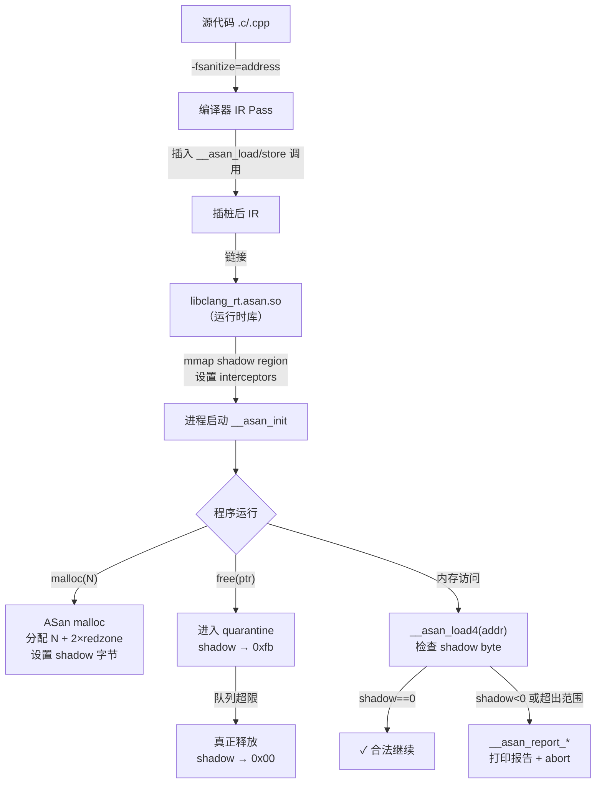
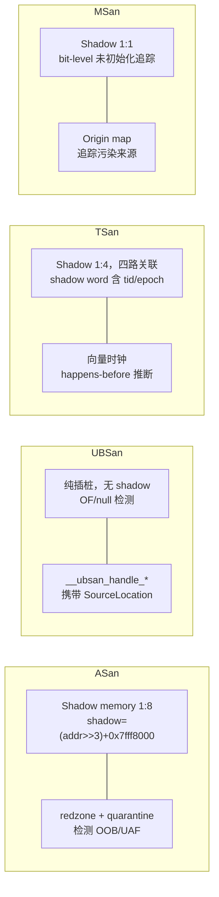

---
tags:
  - ABI
  - 运行时
  - tier3
  - sanitizer
  - ASan
  - 运行时
---
# Sanitizer 运行时 ABI：插桩、Shadow Memory 与跨工具对比
> [!abstract] TL;DR
> Sanitizer 家族（ASan/UBSan/TSan/MSan）通过编译器在每条内存访问前插入调用桩，并在运行时维护与应用内存 1:8 映射的 shadow memory 来追踪内存状态。ASan 用 shadow byte 语义编码堆/栈/全局量的 redzone 与已释放内存；UBSan 在有符号溢出、类型混淆等位置注入 `__ubsan_handle_*` 调用并携带精确的源码位置信息；TSan 用 shadow word 存储访问历史实现 happens-before 推断；MSan 追踪未初始化字节的传播。理解这套 ABI 对调试崩溃报告、逆向识别插桩二进制、以及在 Fuzzing 工程中利用覆盖率信息都有直接价值。

## 概述与定位

Sanitizer 并不是单一工具，而是编译器（Clang/GCC）和对应运行时库共同构成的**动态分析框架**。从 ABI 视角看，它的核心契约是：

1. **编译期**：`-fsanitize=address`（或 `thread`/`undefined`/`memory`）指示编译器在 IR 层插入检查桩（instrumentation pass）。
2. **运行期**：`libclang_rt.asan-x86_64.so`（或对应平台变体）在 `LD_PRELOAD` 机制（或静态链接）下接管 `malloc`/`free`/`memcpy` 等函数，并维护辅助数据结构。
3. **ABI 接口**：编译器与运行时之间通过一组固定名称的 C 语言链接函数通信——`__asan_load4`、`__ubsan_handle_add_overflow`、`__tsan_write8` 等，这些函数名必须精确匹配，构成**插桩 ABI**。

与普通编译器运行时（如 `libgcc`/`libunwind`）不同，Sanitizer 运行时会在进程启动时通过 `__asan_init` 完成 shadow memory 映射、interceptor 注入等初始化，其对进程地址空间的改造是激进的。下面逐层展开。

### 各 Sanitizer 的定位对比

| 工具 | 检测目标 | shadow 比例 | 性能开销 | 内存开销 |
|------|---------|------------|---------|---------|
| ASan | 堆/栈/全局量越界、UAF、double-free | 1:8 | ×1.5～2 | +340% |
| TSan | 数据竞争（race condition） | 1:4 | ×5～10 | +700% |
| MSan | 未初始化内存读取 | 1:1（shadow + origin） | ×2～3 | +200% |
| UBSan | 未定义行为（溢出/NULL/越界等） | 无（纯插桩） | ×1.1～1.5 | 极小 |

---

## 原理与机制

### ASan 的核心思路：Shadow Memory

AddressSanitizer 的基本假设是：**每 8 个应用字节，用 1 个 shadow byte 描述该 8 字节的访问合法性**。

#### 地址映射公式（Linux x86_64）

```
shadow_addr = (app_addr >> 3) + 0x7fff8000
```

这条公式将整个 64 位虚拟地址空间切分为若干区域：

```
低地址（0x000000000000 - 0x00007fffffffffff）  →  用户代码+堆+栈
shadow 区（0x00007fff8000 - 0x00010fff7fff）   →  应用低 47 位空间的影子
shadow of shadow（会形成循环，ASan 需绕过）
高地址（内核区）
```

32 位映射使用不同偏移 `0x20000000`，且由于地址空间较小，映射更紧凑：

```
shadow_addr = (app_addr >> 3) + 0x20000000   // 32 位 Linux
```

初始化时 ASan 会用 `mmap` 将整个 shadow 区映射为可读写的匿名内存，初始值全 0（表示可访问）。

#### Shadow Byte 语义详解

| shadow byte 值 | 含义 |
|--------------|------|
| `0x00` | 该 8 字节全部可访问 |
| `0x01`～`0x07` | 该 8 字节中前 N 字节可访问，后 (8-N) 字节是 redzone 或填充 |
| `0xfa` (−6) | 堆 redzone（heap left/right redzone） |
| `0xfb` (−5) | 堆内存已释放（freed heap region） |
| `0xf1` (−15) | 栈左侧 redzone（stack left redzone） |
| `0xf2` (−14) | 栈中间 redzone（两个局部变量之间） |
| `0xf3` (−13) | 栈右侧 redzone（stack right redzone） |
| `0xe8` (−24) | 全局变量 redzone（globals） |
| `0xe9` (−23) | 全局变量内存本身（部分实现标记） |
| `0xf5` (−11) | 大内存块的 redzone（对齐到 shadow 粒度） |

**为什么用负数？** 检查逻辑需要区分"有效范围末尾的部分访问"和"完全非法区域"。`0x01`～`0x07` 是半有效的（partial），负数（最高位为 1）是完全非法的。一条 `jge` 指令即可将二者分开：如果 shadow byte > 访问长度则报错，如果 shadow byte < 0（即 `sf != of` 在有符号比较中）也报错。

### 插桩函数：`__asan_load*` 与 `__asan_store*`

对每条可能非法的内存访问，编译器插入以下调用：

```
__asan_load1(addr)     // 1字节读
__asan_load2(addr)     // 2字节读（需地址对齐到2）
__asan_load4(addr)
__asan_load8(addr)
__asan_load16(addr)
__asan_store1(addr)    // 1字节写
// ... 以此类推
```

编译器还会生成"内联"变体，把 shadow 检查直接展开在调用点（避免函数调用开销）：

```asm
; x86_64 内联 ASan 插桩示例（4字节读 [rdi]）
mov    rax, rdi          ; 取地址
shr    rax, 3            ; >> 3
add    rax, 0x7fff8000   ; + shadow 偏移
movzx  ecx, byte ptr [rax]  ; 取 shadow byte
test   ecx, ecx
je     .ok               ; shadow==0，全部合法，跳过
; 慢路径：检查部分访问或报错
mov    esi, edi
and    esi, 7            ; addr & 7
add    esi, 3            ; + (access_size - 1)
cmp    cl, sil           ; shadow >= 访问范围末尾?
jge    __asan_report_load4  ; 触发报告
.ok:
```

**不插桩的情形：**

- **编译期常量地址**：编译器能证明目标是全局变量且访问在范围内，无需插桩。
- **栈上已知对齐的 trivial 访问**：在 `-O2` 以上，若编译器能静态验证栈变量边界且没有 redzone 信息（例如访问局部 `int` 的中间字节），可省略。
- **SIMD 宽指令**：对 `__asan_load32`/`__asan_store32`（AVX 256 位），会批量检查；若编译器认为访问来自已对齐的数组，在已知容量内可裁剪。
- **`__attribute__((no_sanitize("address")))`** 标注的函数。

### Redzone 布局：堆内存的前后围栏

当 ASan 的 `malloc` interceptor 分配 N 字节时，实际布局为：

```
[左 redzone(≥32字节)] [用户数据(N字节)] [右 redzone(≥32字节+对齐填充)]
```

redzone 大小规则：
- 最小 16 字节（以匹配 shadow 粒度的 2 个 shadow byte）
- 实际为 `max(16, 对齐到 8 的倍数)` 且通常取 32～128
- 大对象（>= 某阈值，约 512B）的 redzone 可达 256 字节
- redzone 中存储魔数（chunk 元数据），用于验证完整性

chunk 元数据包含：分配时的栈回溯、大小、线程 ID、分配时间戳等，用于报告时输出精确的错误信息。

### Quarantine：UAF 的延迟释放机制

`free(ptr)` 被 ASan interceptor 拦截后，**不立即归还给操作系统或 allocator**，而是：

1. 将 chunk 对应的 shadow 字节全部设置为 `0xfb`（freed）
2. 将 chunk 压入 **quarantine 队列**（FIFO 环形缓冲区）
3. 直到队列总字节数超过阈值（默认约 256MB，可用 `ASAN_OPTIONS=quarantine_size_mb=N` 调整）
4. 超出阈值时，从队列头部取出最老的 chunk，将 shadow 清零（0x00），真正释放

在 quarantine 窗口内，若有代码再次访问已 `free` 的内存，shadow byte 仍为 `0xfb`，检查逻辑捕捉到负值立即报 `heap-use-after-free`。这个窗口越大，UAF 检测率越高，但内存消耗也越大。

### Interceptor 机制：如何劫持 `malloc`/`free`/`memcpy`

ASan 运行时通过以下手段替换 C 库函数：

**动态链接场景（`libasan.so` 通过 `LD_PRELOAD`）：**
- `malloc`/`free`/`calloc`/`realloc` 等符号直接在 `libasan.so` 中定义，动态链接器优先找到它们
- `memcpy`/`memset`/`memmove`/`strcpy`/`strncpy`/`strcat` 等由运行时通过 `__interception` 机制处理

**静态链接场景：**
- 使用 `__interceptor_malloc` 等弱符号覆盖，配合 `#define malloc __interceptor_malloc`

**interceptor 框架**（`compiler-rt/lib/interception/interception.h`）的宏展开示意：

```c
// 运行时内部
INTERCEPTOR(void*, malloc, size_t size) {
    void* result = asan_malloc(size, GET_CALLER_PC());
    // 设置 redzone shadow，记录调用栈
    return result;
}
// 展开后：
// 原 malloc → 保存为 __real_malloc 或 real_malloc
// 新 malloc 指向 interceptor 版本
```

`memcpy` 等函数的 interceptor 会额外进行"poison 检查"——读取源区域时验证 shadow，写入目标时验证目标合法性。

---

## 结构/算法/伪代码详解

### ASan shadow 检查的完整逻辑（伪代码）

```c
// 访问 addr，大小为 access_size（1/2/4/8/16/32）
void __asan_loadN(uintptr_t addr) {
    uintptr_t shadow_addr = (addr >> 3) + SHADOW_OFFSET;
    int8_t shadow_val = *(int8_t*)shadow_addr;
    
    if (shadow_val == 0) return;  // 快路径：全部合法
    
    // 慢路径
    if (shadow_val < 0) {
        // 完全非法：heap redzone / freed / stack redzone / global redzone
        __asan_report_loadN(addr);
    }
    // shadow_val 在 1-7：只有前 shadow_val 字节合法
    // 检查本次访问是否溢出合法区间
    int offset = addr & 7;  // 在 8 字节槽内的偏移
    if (offset + access_size > shadow_val) {
        __asan_report_loadN(addr);
    }
}
```

`__asan_report_*` 系列函数（也是公开 ABI）负责：解码 shadow byte、查找 chunk 元数据、打印堆栈回溯、调用 `abort()`。

### UBSan 的插桩 ABI

UBSan 是**无 shadow memory 的纯插桩方案**，编译器在每个潜在 UB 点前后插入条件检查，失败时调用报告函数。

#### 插桩点类型与对应 handler

| 检测类型 | 插桩产生的 handler | 触发条件示例 |
|---------|----------------|------------|
| 有符号整数溢出 | `__ubsan_handle_add_overflow` | `INT_MAX + 1` |
| 有符号整数乘法溢出 | `__ubsan_handle_mul_overflow` | |
| 有符号整数减法溢出 | `__ubsan_handle_sub_overflow` | |
| 除零 | `__ubsan_handle_divrem_overflow` | `x / 0` |
| 移位指数越界 | `__ubsan_handle_shift_out_of_bounds` | `1 << 64` |
| 空指针解引用 | `__ubsan_handle_type_mismatch_v1` | `*(int*)nullptr` |
| 类型对齐违反 | `__ubsan_handle_type_mismatch_v1` | 未对齐 load |
| 浮点转整数越界 | `__ubsan_handle_float_cast_overflow` | `(int)1e18f` |
| VLA 边界 | `__ubsan_handle_vla_bound_not_positive` | `int a[-1]` |
| 整数范围转换 | `__ubsan_handle_implicit_conversion` | `uint8_t = 256` |
| 函数指针类型不符 | `__ubsan_handle_function_type_mismatch` | |
| 无效 bool 值 | `__ubsan_handle_load_invalid_value` | |
| 返回路径缺失 | `__ubsan_handle_missing_return` | |

#### handler 函数签名（以 `type_mismatch_v1` 为例）

```c
// TypeMismatchData 结构（编译器静态生成，存于 .rodata）
struct TypeMismatchData {
    SourceLocation Loc;       // 文件名 + 行号 + 列号（指针到字符串）
    const TypeDescriptor *Type; // 类型名称描述符
    uint8_t LogAlignment;     // log2(alignment)
    uint8_t TypeCheckKind;    // 0=load, 1=store, 2=ref binding, ...
};

// handler ABI
void __ubsan_handle_type_mismatch_v1(
    TypeMismatchData *data,  // 指向 .rodata 中静态数据
    uintptr_t ptr            // 实际发生问题的指针值
);

// abort 版本（-fsanitize-trap=undefined 或运行时无法继续时）
void __ubsan_handle_type_mismatch_v1_abort(
    TypeMismatchData *data,
    uintptr_t ptr
);
```

`SourceLocation` 的内存布局：

```c
struct SourceLocation {
    const char *Filename;  // 指向只读字符串常量
    uint32_t Line;
    uint32_t Column;
};
```

`TypeDescriptor` 的内存布局：

```c
struct TypeDescriptor {
    uint16_t TypeKind;     // 0=整数, 1=浮点, 0xffff=unknown
    uint16_t TypeInfo;     // 整数时：(bitwidth << 1) | is_signed
    char TypeName[];       // 变长字符串，如 "int" "unsigned long"
};
```

这些结构全部静态生成，存放在 `.data.rel.ro` 或 `.rodata` 段，运行时直接读取。**逆向时可通过 `__ubsan_handle_*` 的第一个参数指向的数据段数据还原源码位置信息**。

#### `-fsanitize-minimal-runtime` 的差异

| 模式 | 特点 | 报错信息 |
|------|-----|---------|
| 默认 `-fsanitize=undefined` | 完整诊断，链接 `libubsan.so` | 文件/行/列/类型名/值 |
| `-fsanitize-minimal-runtime` | 极小运行时，只输出错误码 | `SUMMARY: UBSan: undefined-behavior` |
| `-fsanitize=undefined -fno-sanitize-recover=all` | 首次 UB 即 abort | 同上但立刻终止 |
| `-fsanitize-trap=undefined` | 编译为 `ud2`/`trap` 指令，无运行时 | 产生 SIGILL，无文字报告 |

`-fsanitize-minimal-runtime` 专为嵌入式或对二进制大小敏感的场景设计，生成的函数名带 `_minimal` 后缀（`__ubsan_handle_add_overflow_minimal`），不携带 `TypeDescriptor` 参数，代码体积减少约 60%。

### TSan：Shadow Word 与 Happens-Before

#### Shadow Memory 布局（TSan）

TSan 使用 **1:4** 的 shadow 比例（每 8 字节应用内存对应 32 字节 shadow），且为**四路关联缓存**结构，即每个 8 字节对齐槽对应 4 个 shadow word，轮转存储最近的访问记录。

Shadow word（64 位）的位域布局：

```
[63]    : is_write (1=写, 0=读)
[62:61] : access_size_log2 (00=1B, 01=2B, 10=4B, 11=8B)
[60:45] : epoch (16位，逻辑时钟)
[44:41] : tid (4位线程 ID，最多 16 线程；更多线程用扩展槽)
[40:0]  : addr 的低 41 位（用于验证是否同一地址）
```

（注意：不同版本的 TSan 位域定义略有差异，以 compiler-rt 源码为准）

#### 插桩函数

```
__tsan_read1(addr)    __tsan_write1(addr)
__tsan_read2(addr)    __tsan_write2(addr)
__tsan_read4(addr)    __tsan_write4(addr)
__tsan_read8(addr)    __tsan_write8(addr)
__tsan_read16(addr)   __tsan_write16(addr)

// 原子操作有专属族：
__tsan_atomic32_load(addr, mo)
__tsan_atomic64_store(addr, val, mo)
__tsan_atomic_thread_fence(mo)
```

每次访问时，TSan 运行时在对应 shadow slot 中查找是否有来自**其他线程**的相冲突记录（一方写、另一方读/写，且无 happens-before 关系）。

#### Happens-Before 向量时钟

每个线程维护一个**向量时钟**（Vector Clock）`VC[i]`，表示"已知线程 i 至少执行到 epoch X"。

```
Thread 1: VC = [3, 0, 0]   // 自身 epoch=3
Thread 2: VC = [0, 5, 0]   // 自身 epoch=5

// Thread 1 执行 mutex_unlock → 发布 VC[1]=[3,0,0]
// Thread 2 执行 mutex_lock  → 合并：VC[2] = [max(0,3), max(5,0), 0] = [3,5,0]
// 此时 Thread2 知晓 Thread1 的 epoch=3 前的所有写
```

当检测到访问冲突时，TSan 将两次访问的线程 ID、epoch、shadow word 以及对应的栈回溯全部收集，通过 `__tsan_report_race` 输出报告。

### MSan：未初始化内存的 Shadow + Origin Map

MSan 的目标是检测 **使用未初始化值** 导致的条件分支或系统调用参数污染（use-of-uninitialized-value）。

#### 双层 Shadow 结构

MSan 使用 **1:1** 的 shadow（每个应用字节对应 1 个 shadow bit/byte）：

- **Shadow map**（1 bit per byte）：`0` = 已初始化，`1` = 未初始化
- **Origin map**（4 bytes per 4 bytes）：存储 "这个未初始化值从哪来" 的调用栈摘要 ID

地址映射（Linux x86_64）：

```
shadow_addr = app_addr ^ 0x500000000000   // XOR 翻转高位
origin_addr = (app_addr ^ 0x100000000000) & ~3
```

#### 传播规则（Taint Propagation）

```c
// 示例：y = x + z，其中 x 未初始化
// 编译器插桩后等价于：
shadow_y = shadow_x | shadow_z;  // 未初始化的位传播给 y
```

算术运算、逻辑运算、内存拷贝时，shadow 位随数据流传播。**直到未初始化 shadow 影响了条件分支**（`if (y > 0)`），才实际触发报告：

```c
__msan_warning_noreturn();   // 触发报告并终止
// 或：
__msan_check_mem_is_initialized(addr, size);  // 显式检查
```

`__msan_check_mem_is_initialized` 是一个显式断言 API，可在自定义内存分配器或序列化代码中使用，相当于 `assert(memory[addr..addr+size] is initialized)`。

### Mermaid：Sanitizer 插桩数据流总览



---

## 工具视角与实战

### 编译与使用

```bash
# ASan（最常用）
clang -fsanitize=address -g -O1 -fno-omit-frame-pointer foo.c -o foo

# UBSan（可叠加）
clang -fsanitize=address,undefined -g foo.c -o foo

# TSan（不能与 ASan 同时使用）
clang -fsanitize=thread -g -O1 foo.c -o foo

# MSan（要求所有依赖库也用 MSan 编译，否则大量误报）
clang -fsanitize=memory -g -O1 foo.c -o foo

# UBSan 最小运行时（嵌入式/大小敏感）
clang -fsanitize=undefined -fsanitize-minimal-runtime -O2 foo.c -o foo
```

**常用运行时选项（环境变量）：**

```bash
ASAN_OPTIONS=detect_leaks=1:quarantine_size_mb=512:abort_on_error=1 ./foo
UBSAN_OPTIONS=print_stacktrace=1:halt_on_error=1 ./foo
TSAN_OPTIONS=second_deadlock_stack=1 ./foo
```

### 崩溃报告解读

ASan 堆越界典型报告结构：

```
==12345==ERROR: AddressSanitizer: heap-buffer-overflow
READ of size 4 at 0x602000000010 thread T0
    #0 0x400xxx in foo /path/foo.c:15
    #1 0x400yyy in main /path/foo.c:30

0x602000000010 is located 0 bytes to the right of 16-byte region [0x602000000000,0x602000000010)
allocated by thread T0 here:
    #0 0x7f...  in malloc
    #1 0x400aaa in foo /path/foo.c:10
```

**关键字段解析：**
- `0x602000000010 is located 0 bytes to the right of 16-byte region`：恰好在结尾的下一字节，越界 1 个元素
- `[0x602000000000, 0x602000000010)` 是分配区间，左闭右开

UBSan 报告：

```
foo.c:42:15: runtime error: signed integer overflow: 2147483647 + 1 cannot be represented in type 'int'
SUMMARY: UBSan: undefined-behavior foo.c:42:15 in foo()
```

TSan 数据竞争报告包含两次访问的完整栈回溯、线程 ID 和访问类型，是三者中信息最丰富的。

### Fuzzing 中的 ASan 集成

AFL++/libFuzzer 都依赖 ASan 来将内存越界转化为崩溃（`SIGSEGV`/`abort`）：

1. **Coverage feedback**：`-fsanitize-coverage=trace-pc-guard` 在每个基本块入口插入计数器更新，Fuzzer 读取覆盖率变化决定是否保留语料。
2. **Crash 分类**：ASan 的报告类型（`heap-buffer-overflow` vs `heap-use-after-free` vs `stack-buffer-overflow`）用于自动去重。
3. **`__asan_poison_memory_region`**：在自定义分配器中主动毒化内存，扩大检测范围。

---

## 安全性与正确使用

### 逆向视角：识别 ASan 插桩二进制

在 IDA Pro 或 Ghidra 中，ASan 插桩后的二进制有以下明显特征：

**特征 1：大量 shadow check 模式（内联插桩）**

```asm
; 典型 x86_64 ASan 内联检查序列
mov     rax, [rbp-8]          ; 取地址
mov     rcx, rax
shr     rcx, 3                ; >>3
add     rcx, 7FFF8000h        ; + SHADOW_OFFSET
movsx   edx, byte ptr [rcx]   ; 取 shadow byte（有符号扩展）
test    edx, edx
jz      short loc_ok          ; ==0 快路径
mov     esi, eax
and     esi, 7                ; addr & 7
add     esi, 3                ; + (4-1) 对于 4 字节访问
cmp     dl, sil
jge     short loc_ok          ; shadow >= offset+3，合法
lea     rdi, [rbp-8]          ; 传地址给报告函数
call    __asan_report_load4   ; 报告
loc_ok:
```

**识别关键字**：
- 常量 `0x7FFF8000`（或 `0x20000000` 在 32 位）出现在 `add` 指令
- `shr reg, 3` 出现在地址计算
- 调用 `__asan_report_*` 系列（未 strip 时）

**特征 2：函数 prologue 中的栈 redzone 毒化**

```asm
; 栈帧初始化时 ASan 毒化局部变量间隙
call    __asan_stack_malloc_2  ; 分配带 redzone 的栈 shadow
; ... 实际函数体 ...
call    __asan_stack_free_2    ; 离开前清除 shadow
```

**特征 3：`__asan_init` 存在**

若二进制未 strip，全局构造函数列表（`.init_array`）中会有 `__asan_init` 和 `__asan_version_mismatch_check_v*` 的引用。

### 逆向视角：识别 UBSan 插桩

```asm
; 有符号加法溢出检测（x86_64）
; 编译器生成 overflow-aware 加法：
add     edi, esi              ; 执行加法
jo      ubsan_overflow_path   ; 溢出标志 OF=1 则跳转到 UBSan 报告

ubsan_overflow_path:
lea     rdi, [rip + ubsan_data_add_overflow]  ; 指向 .rodata 中的 TypeMismatchData
mov     rsi, rax              ; 实际指针值
call    __ubsan_handle_add_overflow
```

**IDA 分析技巧**：搜索交叉引用 `__ubsan_handle_*`，其第一个参数（RDI）总是指向 `.rodata` 中结构体，结构体的第一个字段是 `const char*`（文件名），可用于还原源码位置。

### 边界陷阱与常见误用

**陷阱 1：MSan 与未插桩库的交互**

MSan 无法追踪系统库（如 glibc 内部的 SSE 优化 `memcpy`）的初始化，因为这些库未经 MSan 编译。结果是：从系统库返回的内存被视为"未初始化"→大量误报。解决方案：用 MSan 重新编译所有依赖，或在调用系统函数后调用 `__msan_unpoison(ptr, size)` 手动标记为已初始化。

**陷阱 2：TSan 与 `pthread_mutex` 以外的同步原语**

TSan 对 `std::mutex`/`pthread_mutex` 的 happens-before 有内置支持，但对自定义自旋锁（如基于 `__atomic_compare_exchange` 的实现）需要显式注解：

```c
__tsan_acquire(lock_addr);  // 获取锁后调用
__tsan_release(lock_addr);  // 释放锁前调用
```

否则 TSan 会误报数据竞争。

**陷阱 3：ASan + `longjmp`/协程**

ASan 的栈 redzone 追踪假设函数按正常 call/ret 顺序，`longjmp` 跳过 redzone 清除逻辑会导致误报（false positive）。需要在 `longjmp` 前调用 `__asan_handle_no_return()` 通知运行时。协程框架（libco、boost.context）也需要类似处理。

**陷阱 4：`-fsanitize=address` 与 `-fsanitize=thread` 互斥**

ASan 和 TSan **不能同时使用**——它们对同一地址空间区域有冲突的映射需求（ASan shadow offset 与 TSan shadow region 重叠）。如需同时检测内存安全和数据竞争，需分两次运行。

**陷阱 5：容器溢出的 ASan 局限**

ASan 只检测 `malloc`/`free` 及栈帧边界的 redzone，对 `std::vector::operator[]` 的越界（in-bound-of-allocation-but-out-of-logical-size）**默认不检测**。需要启用 `ASAN_OPTIONS=detect_container_overflow=1` 并在 vector 实现中配合 `__asan_poison_memory_region` 注解。

### Sanitizer ABI 的版本兼容性

`__asan_version_mismatch_check_vN` 函数的存在确保运行时与编译器版本匹配：

```c
// 链接时自动引用
__asan_version_mismatch_check_v8();  // Clang/LLVM 特定版本
```

若编译时 LLVM 版本与运行时版本不匹配，进程启动时即报错退出，防止 ABI 漂移导致静默错误。UBSan 的 `TypeMismatchData` 结构中 `v1` 后缀（`__ubsan_handle_type_mismatch_v1`）正是为此目的的版本化 ABI。

---

## 小结

Sanitizer 家族在 ABI 层的核心设计理念是**最小化编译器与运行时的接口**：编译器只需插入固定名称的函数调用，运行时负责全部重量逻辑。这种设计让 Sanitizer 能够跨编译器版本演进而保持兼容。

各工具的关键机制对比：



从逆向工程视角，ASan 插桩代码（`shr reg,3` / `add reg, 0x7fff8000` / `movsx ecx, byte`）在反汇编中构成高度特征化的模式，可用于快速判断目标二进制是否来自 Sanitizer 构建——这对分析 Fuzzing 生成的崩溃样本、或判断安全研究目标是否使用内部 Sanitizer CI 尤为有用。

---

## 相关阅读

- [[00.C_C++运行时与ABI总览|C/C++ 运行时与 ABI 系列总览]]
- [[10.异常处理ABI与栈展开|异常处理 ABI 与栈展开]]
- [[11.eh_frame与DWARF_CFI|eh_frame 与 DWARF CFI]]
- [[14.C运行时库与启动全景实战|C 运行时库与启动全景实战]]
- [AddressSanitizer: A Fast Address Sanity Checker（原论文，Serebryany et al., USENIX ATC 2012）](https://www.usenix.org/conference/atc12/technical-sessions/presentation/serebryany)
- [MemorySanitizer: fast detector of uninitialized memory use（Stepanov & Serebryany, CGO 2015）](https://static.googleusercontent.com/media/research.google.com/zh-CN//pubs/archive/43308.pdf)
- [ThreadSanitizer – data race detection in practice（Serebryany & Iskhodzhanov, WBIA 2009）](https://static.googleusercontent.com/media/research.google.com/zh-CN//pubs/archive/35604.pdf)
- `compiler-rt/lib/asan/` — LLVM 项目 ASan 运行时源码
- `compiler-rt/lib/ubsan/` — UBSan 运行时源码（`ubsan_handlers.cpp`）

[[00.C_C++运行时与ABI总览|⬆ 系列总览]] | [[16.C++协程ABI与协程帧布局|← 上一章]] | [[18.std_function与类型擦除ABI|→ 下一章]]
