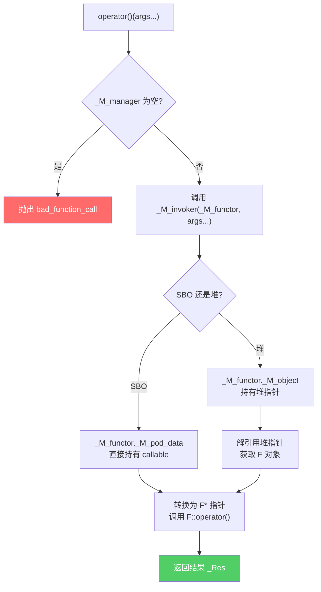

---
tags:
  - ABI
  - 运行时
  - tier3
  - C++
  - 类型擦除
---
# std::function 与类型擦除 ABI
> [!abstract] TL;DR
> `std::function` 是 C++ 标准库中最典型的「类型擦除」容器：它在编译期抹去可调用对象的具体类型，在运行时通过函数指针表（或虚函数）实现统一调用。三大主流实现（libstdc++、libc++、MSVC STL）在 SBO 阈值、内部布局、调用机制上各有差异，直接决定 ABI 边界行为。掌握其内存布局，可在逆向工程中从内存直接还原被擦除的 callable。

## 概述与定位

`std::function<R(Args...)>` 解决了一个根本性的 C++ 问题：如何在类型安全的前提下，持有并调用「任意可调用对象」——普通函数、成员函数指针、lambda、仿函数（functor）——而无需事先知道其具体类型，也无需强迫它们继承某个基类。

这类需求在 C 时代只能用 `void*` + 函数指针手工管理，极其危险；早期 C++ 用模板或继承，但均有根本局限。`std::function` 通过「类型擦除」将这些局限一并化解，代价是引入了运行时间接层与潜在的堆分配。

### 类型擦除的三要素

类型擦除并非魔法，它依赖三个核心要素：

1. **持有大小未知的值**：使用固定大小的存储区（SBO buffer）或堆分配，使容器本身大小固定。
2. **通过统一接口调用**：将「如何调用具体类型」编码为函数指针或虚函数，在创建时绑定。
3. **不依赖继承**：目标对象（lambda、仿函数等）无需修改，不需从任何基类派生。

这三点缺一不可。第三点尤为关键——「侵入式」继承方案要求被存储类型必须从特定基类派生，对第三方库类型无能为力；而类型擦除是完全「非侵入式」的。

### 为什么不直接用虚函数

虚函数需要**固定的 vtable 布局**，这意味着被存储类型必须从特定基类派生。考虑如下场景：

```cpp
// 无法让 int(*)(int) 这种普通函数类型派生自任何基类
std::function<int(int)> f = [](int x){ return x + 1; };
f = std::sin;  // 换成内置函数
f = MyFunctor{};  // 换成自定义仿函数
```

`std::sin` 和 `MyFunctor` 没有共同基类，虚函数机制无法直接适用（需要包装）。类型擦除绕过这一限制，在赋值时动态地「烘焙」调用逻辑进函数指针。

---

## 原理与机制

### 手工类型擦除：void* + 函数指针表

在理解标准库实现之前，先看最朴素的类型擦除实现，这是所有高级实现的本质：

```cpp
// 手工类型擦除示例——演示原理
struct TypeErasedCallable {
    void* storage;                          // 持有被擦除对象的指针
    void  (*invoke)(void*, int);            // 调用函数
    void  (*destroy)(void*);               // 析构函数
    void* (*clone)(const void*);           // 拷贝构造
};

// 绑定一个具体类型
template<typename F>
TypeErasedCallable make_erased(F f) {
    return {
        new F(std::move(f)),                // 堆分配存储
        [](void* p, int x) {               // invoke：知道具体类型 F
            (*static_cast<F*>(p))(x);
        },
        [](void* p) {                       // destroy
            delete static_cast<F*>(p);
        },
        [](const void* p) -> void* {       // clone
            return new F(*static_cast<const F*>(p));
        }
    };
}
```

上述实现的每个 lambda 在编译时**捕获了类型 `F`**——这就是「烘焙」。从外部看，`TypeErasedCallable` 的大小固定；但调用、销毁、克隆的逻辑已经被编码进函数指针。这正是 `std::function` 的精髓。

标准库在此基础上增加了：
- **SBO（Small Buffer Optimization）**：避免所有情况都堆分配
- **`type_info` 查询**：支持 `target_type()` / `target()` 接口
- **完整的移动语义**

### SBO 的必要性与工作原理

堆分配代价高昂（典型 malloc 约 50–100 ns），而大量 `std::function` 持有的是简单 lambda 或函数指针（8–16 字节）。SBO 将小对象**直接嵌入 `std::function` 对象内部**，避免堆分配：

```
std::function<void()> 内存布局（libstdc++ x86-64）：
┌──────────────────────────────┐  offset 0
│  _M_manager (函数指针, 8B)   │  ← 管理函数：clone/destroy/typeinfo
├──────────────────────────────┤  offset 8
│  _M_invoker (函数指针, 8B)   │  ← 调用函数：实际执行 callable
├──────────────────────────────┤  offset 16
│  SBO buffer / 堆指针 (16B)   │  ← 小对象直接存这里，大对象存指针
└──────────────────────────────┘  总大小 32 字节
```

SBO 的判断发生在**模板实例化时**（赋值操作符或构造函数），是静态决策：

```cpp
// libstdc++ 内部判断（简化）
template<typename _Functor>
static constexpr bool __stored_locally =
    (sizeof(_Functor) <= _M_max_size)           // 大小限制
    && (alignof(_Functor) <= _M_max_align)      // 对齐限制
    && is_trivially_copyable_v<_Functor>;       // 不一定，见下文详解
```

注意：libstdc++ 并不严格要求 trivially_copyable，而是用 `__is_location_invariant` trait（当类型 trivially_copyable 时返回 true），保证 SBO buffer 中的对象可以被 memcpy 移动而不产生 UB。

### manager 函数指针：单指针实现多态

libstdc++ 用**单个函数指针** `_M_manager` 实现了四种操作的「多态」，通过枚举参数区分：

```cpp
// libstdc++ _Function_base 中的操作枚举
enum _Manager_operation {
    __get_type_info,   // 返回 typeid(F)，用于 target_type()
    __get_functor_ptr, // 返回 callable 的地址，用于 target<F>()
    __clone_functor,   // 拷贝构造 callable
    __destroy_functor  // 析构 callable
};

// manager 函数签名
using _Manager_type = bool (*)(_Any_data&, const _Any_data&, _Manager_operation);
```

这个设计非常精妙：用一个函数指针代替了传统虚函数表中的多个指针，减少了每个 `std::function` 对象的内存占用。代价是 manager 函数内部有一个 `switch` 分支，略微增加代码体积。

与之对比，libc++ 选择了更「正统」的虚函数路线（见后文），MSVC 则采用类似 libstdc++ 的方案但细节不同。

---

## 结构/算法/伪代码详解

### libstdc++ 完整数据结构

```cpp
// 位于 <bits/std_function.h>，以下为关键结构（经简化注释）

// 类型擦除存储联合体
union _Any_data {
    void*       _M_object;         // 堆分配时存储指针
    const void* _M_const_object;   // const 版本
    char        _M_pod_data[sizeof(void*)]; // SBO 存储区（实际16字节，含对齐）
};

// std::function 基类
class _Function_base {
protected:
    // SBO 阈值定义
    static const size_t _M_max_size  = sizeof(_Any_data);  // 16 字节（x86-64）
    static const size_t _M_max_align = __alignof__(void*); // 8 字节

    // 存储区：SBO buffer 或堆指针
    _Any_data _M_functor;

    // 单个 manager 函数指针替代 vtable
    bool (*_M_manager)(_Any_data&, const _Any_data&, _Manager_operation);
};

// std::function 完整类
template<typename _Res, typename... _ArgTypes>
class function<_Res(_ArgTypes...)> : private _Function_base {
    // invoker：实际执行调用
    _Res (*_M_invoker)(const _Any_data&, _ArgTypes&&...);

    // 对外接口
    _Res operator()(_ArgTypes... args) const {
        // 空 function 调用抛 std::bad_function_call
        if (_M_empty()) throw bad_function_call{};
        return _M_invoker(_M_functor, std::forward<_ArgTypes>(args)...);
    }
};
```

**内存布局映射（x86-64 ABI）**：

| 偏移 | 字段 | 大小 | 说明 |
|------|------|------|------|
| +0   | `_M_manager` | 8B | 管理函数指针（含 clone/destroy/typeinfo） |
| +8   | `_M_invoker` | 8B | 调用函数指针 |
| +16  | SBO buffer   | 16B | 小型 callable 直接嵌入；大型 callable 存堆指针 |
| 总计 | | 32B | |

注意字段顺序：`_M_manager` 来自基类 `_Function_base`，`_M_invoker` 定义在派生类 `function` 中，但由于 C++ 标准布局规则，基类成员先排列，实际上 manager 先于 invoker。

### libstdc++ 的 _Handler 模板：绑定具体类型

```cpp
// 对每个具体 Functor 类型 F，生成一个特化的 _Handler
template<typename _Functor>
struct _Function_handler {

    // invoker：知道 F 的具体类型
    static _Res _M_invoke(const _Any_data& __functor, _ArgTypes&&... __args) {
        // SBO 路径
        return (*_Base::_M_get_pointer(__functor))(
            std::forward<_ArgTypes>(__args)...);
    }

    // manager：处理四种操作
    static bool _M_manager(_Any_data& __dest, const _Any_data& __source,
                            _Manager_operation __op) {
        switch (__op) {
        case __get_type_info:
            // 返回 typeid(F)，用于 target_type()
            __dest._M_access<const type_info*>() = &typeid(_Functor);
            break;
        case __get_functor_ptr:
            // 返回 callable 地址，用于 target<F>()
            __dest._M_access<_Functor*>() = _Base::_M_get_pointer(__source);
            break;
        case __clone_functor:
            // SBO 路径：memcpy 或拷贝构造
            // 堆路径：new F(*source_ptr)
            _Base::_M_init_functor(__dest,
                *const_cast<_Functor*>(_Base::_M_get_pointer(__source)));
            break;
        case __destroy_functor:
            // SBO 路径：析构 SBO 中的对象（若有析构函数）
            // 堆路径：delete ptr
            _Base::_M_destroy(__dest, _Local_storage());
            break;
        }
        return false;
    }
};
```

### libc++ 实现：虚函数路线

libc++ 选择了截然不同的架构——用真正的虚函数实现多态：

```cpp
// libc++ 内部（简化）

// 虚基类：代表「任意可调用对象」
template<class _Fp>
class __base {
public:
    virtual __base* __clone() const = 0;
    virtual void    __clone(__base*) const = 0;
    virtual void    destroy() noexcept = 0;
    virtual void    destroy_deallocate() noexcept = 0;
    virtual _Rp     operator()(_ArgTypes&&...) = 0;
    virtual const std::type_info& target_type() const noexcept = 0;
    virtual const void* target(const type_info&) const noexcept = 0;
};

// 具体实现（每种 Functor 类型 F 生成一个特化）
template<class _Fp, class _Alloc, class _Rp, class... _ArgTypes>
class __func<_Fp, _Alloc, _Rp(_ArgTypes...)> : public __base<_Rp(_ArgTypes...)> {
    _Fp __f_;  // 实际存储的 callable
    // ... 实现所有虚函数
};

// std::function 内存布局（libc++，x86-64）
class function<R(Args...)> {
    // vtable ptr（隐藏，属于 __base）  ← 注意：没有单独的 manager 指针
    // SBO buffer（24字节）
    // __base* 指针（若非 SBO 则指向堆）
};
```

**libc++ SBO buffer = 24 字节**（比 libstdc++ 大 8 字节），原因是 libc++ 在 SBO buffer 内存放虚函数对象时，该对象含有隐式 vtable 指针（8字节），实际可用空间只有 16 字节，因此 buffer 需要更大。

### MSVC STL 实现

MSVC 的 `std::function` 实现在 `<functional>` 中，核心是 `_Func_impl` + `_Compressed_pair`：

```cpp
// MSVC STL（Visual C++ 2019+，简化）
template<class _Rx, class... _Types>
class _Func_base {
public:
    virtual _Func_base* _Copy(void*) = 0;
    virtual _Func_base* _Move(void*) = 0;
    virtual _Rx          _Do_call(_Types&&...) = 0;
    virtual const type_info& _Target_type() const noexcept = 0;
    virtual void         _Destroy() noexcept = 0;
    virtual void         _Delete_this() noexcept = 0;
};

class function<_Rx(_Types...)> {
    // MSVC SBO 缓冲区：6 × sizeof(void*) = 48 字节（x86-64）
    static constexpr size_t _IMPL_BYTES = 6 * sizeof(void*);
    aligned_union_t<_IMPL_BYTES, _Func_base*> _Storage;
    _Func_base<_Rx, _Types...>* _Impl;  // 指向 SBO 内或堆上的 _Func_impl
};
```

MSVC 的 SBO 阈值是 **48 字节**（6 × 8），远大于 libstdc++ 的 16 字节和 libc++ 的 24 字节，意味着更多 callable 可以避免堆分配，但每个 `std::function` 对象本身也更大。

### 三大实现 SBO 阈值对比

```
┌─────────────────┬──────────────┬──────────────┬──────────────┬────────────┐
│ 实现            │ SBO 阈值     │ 对象总大小   │ 多态机制     │ Manager    │
├─────────────────┼──────────────┼──────────────┼──────────────┼────────────┤
│ libstdc++ 14    │ 16 字节      │ 32 字节      │ 函数指针表   │ 单指针枚举 │
│ libc++ (LLVM)   │ ~24 字节*   │ 48 字节      │ 虚函数       │ vtable     │
│ MSVC STL 2019+  │ 48 字节      │ ~64 字节     │ 虚函数       │ vtable     │
└─────────────────┴──────────────┴──────────────┴──────────────┴────────────┘
* libc++ 的 SBO buffer 是 24 字节，但其中含 vtable 指针，实际存储可用 16 字节
```

### std::any 的类型擦除——同族但有别

`std::any` 与 `std::function` 使用相同的类型擦除架构，但细节有差异：

```cpp
// libstdc++ std::any 的 manager 操作枚举
enum _Op {
    _Op_access,       // 获取存储地址
    _Op_get_type_info,// typeid 查询
    _Op_clone,        // 拷贝
    _Op_destroy,      // 析构
    _Op_xfer          // 移动（transfer）
};

// any 内部仅有一个 manager 函数指针（比 std::function 少 invoker）
class any {
    void (*_M_manager)(any&, const any*, _Op);
    union _Storage {
        // SBO：≤16字节且 nothrow_move_constructible
        aligned_storage<...> _M_buffer;
        void* _M_ptr;  // 堆指针
    } _M_storage;
};
```

`any_cast<T>` 的工作原理：调用 `_M_manager(__get_type_info)` 获取存储类型的 `type_info`，与 `typeid(T)` 比较；若匹配则调用 `__get_functor_ptr` 获取指针后 `static_cast`。若不匹配则抛 `bad_any_cast`。

这里有一个**跨 DSO 的 ABI 陷阱**：`type_info` 比较使用 `operator==`，其实现最终比较 `name()` 字符串（在 `RTTI_UNIQUE_NAMES` 关闭时）或指针（GCC 默认使用指针比较，要求 `type_info` 对象唯一）。若 `any` 跨 DSO 边界传递，可能因 `type_info` 指针不同导致 `any_cast` 失败，即使类型名相同。

### Mermaid：std::function 调用流程



### Mermaid：赋值时类型信息的「烘焙」

```mermaid
sequenceDiagram
    participant 用户代码
    participant function as std::function
    participant Handler as _Function_handler<F>
    participant SBO as SBO buffer / 堆

    用户代码->>function: f = [](int x){ return x+1; }
    function->>Handler: 模板实例化（编译期）
    Handler-->>function: _M_manager = &Handler::_M_manager<br/>_M_invoker = &Handler::_M_invoke
    function->>SBO: 若 sizeof(F)≤16: 原地构造<br/>若 sizeof(F)>16: new F(callable)
    Note over function: 类型信息已「烘焙」进函数指针<br/>function 本身不再知道 F 的类型
    用户代码->>function: f(42)
    function->>function: _M_invoker(_M_functor, 42)
    function->>SBO: 取出 F* 调用
```

### 移动与拷贝语义的细节

**拷贝**：调用 `_M_manager(__clone_functor)`，manager 知道 callable 在 SBO 还是堆上，分别处理：
- SBO 路径：若 trivially_copyable，memcpy SBO buffer；否则调用拷贝构造函数原地构造
- 堆路径：`new F(*source_heap_ptr)` + 存储新指针

**移动**：这里有一个微妙的地方——**SBO 对象的移动仍然是拷贝**。原因：SBO 对象嵌入在源 `std::function` 的内部，无法「转移所有权」，只能把 SBO buffer 的内容复制到目标的 SBO buffer 中。对 trivially_copyable 类型这是 memcpy，开销极小；但若 SBO 对象含有指针等资源，则需调用移动构造函数。

堆分配对象的移动则是真正的零拷贝：只复制指针，不拷贝对象本体。

**`std::move_only_function`（C++23）**：标准委员会认识到上述局限，引入了 `move_only_function`：
- 不要求 callable 可拷贝构造（支持仅可移动的 callable）
- `operator()` 是非 const 的（避免 `std::function` 因 const 调用非 const lambda 的问题）
- 实现上可以跳过 clone 路径，简化 manager 逻辑

---

## 工具视角与实战

### 逆向视角：从内存布局还原被擦除的 callable

掌握 `std::function` 的内存布局后，在 IDA Pro / GDB 中分析回调机制变得直接可操作。

**GDB 动态调试**：

```bash
# 假设 f 是一个 std::function<void(int)>
(gdb) p f
$1 = {<std::_Function_base> = {_M_manager = 0x55555555a2a0 <...::_M_manager(...)>},
      _M_invoker = 0x55555555a260 <...::_M_invoke(...)>}

# 查看 SBO buffer 内容
(gdb) x/2xg f._M_functor._M_pod_data
0x7fffffffe010:  0x00007ffff7a3c140  0x0000000000000000
# 若第一个 8 字节是函数地址，则 callable 是函数指针，存在 SBO 中
```

**IDA Pro 静态分析**：

在 IDA 中，`std::function` 对象的 layout 如下（libstdc++，x86-64）：

```c
// IDA 伪代码风格
struct std_function_void_int {
    void* manager;      // +0x00: 指向 _Handler::_M_manager 的函数
    void* invoker;      // +0x08: 指向 _Handler::_M_invoke 的函数
    char  sbo_buf[16];  // +0x10: SBO buffer 或堆指针
};

// 调用点通常是：
// mov rdi, [func_obj + 8]   ; 加载 invoker
// mov rsi, [func_obj + 0x10] ; SBO buffer 地址
// call rdi                   ; 调用 invoker
```

**情形一：SBO 路径，callable 是函数指针**

当 `std::function` 持有普通函数指针时（8 字节，满足 SBO 条件），SBO buffer `[+0x10]` 直接存储函数地址：

```asm
; 汇编片段示意（调用 std::function<void(int)>）
lea  rdi, [rbp - 0x30]   ; rdi = &func_obj（传给 invoker 的 const _Any_data&）
mov  rax, [rbp - 0x28]   ; rax = invoker 函数指针（偏移 +8）
mov  esi, 42              ; 参数
call rax

; 在 _M_invoke 内部（IDA 视图）：
; 由于持有函数指针，实现类似：
mov  rax, [rdi]           ; 从 SBO buffer 取出函数指针
mov  esi, esi             ; 参数已就位
call rax                  ; 调用实际函数
```

定位步骤：断点在 `call rax`（第二个），`rax` 即真实 callable 地址。

**情形二：堆分配路径**

当 callable 超过 SBO 阈值（>16B），`[+0x10]` 存储堆指针，真实 callable 在堆上：

```c
// IDA 伪代码——堆分配 callable 的调用路径
void __cdecl large_functor_invoke(const _Any_data* functor_data, int arg) {
    // SBO buffer 存放的是堆指针
    LargeFunctor* ptr = *(LargeFunctor**)functor_data->pod_data;
    ptr->operator()(arg);  // 最终调用
}
```

定位步骤：取 `[func_obj + 0x10]` 作为指针，解引用两次可能到达 vtable（若是复杂对象）或直接到函数指针。

**情形三：lambda 捕获变量**

Lambda 生成一个匿名结构体，捕获的变量作为成员。SBO buffer 存放该结构体（若足够小）：

```c
// 对应 auto f = [x, y](int z){ return x + y + z; };
// lambda 类型 = struct { int x; int y; operator()(int z); }
// sizeof = 8 字节，进 SBO buffer

struct __lambda_closure {
    int x;  // 偏移 +0x10 in std::function 对象
    int y;  // 偏移 +0x14 in std::function 对象
};

// IDA 中可以直接从 function 对象读取捕获变量：
// func_obj[0x10] = x 的值
// func_obj[0x14] = y 的值
```

**还原被擦除类型的系统性方法**：

```
1. 定位 std::function 对象（通常在局部变量、成员变量或全局区）
2. 读取 [+0x00] = manager 指针 → 交叉引用 → 确认是哪种 callable 类型
   （manager 函数在编译期为每种 F 生成，函数名中含有 F 的 mangled name）
3. 读取 [+0x08] = invoker 指针 → 进入 invoker 函数 → 看它如何访问 _Any_data
4. 若 invoker 直接用 [rdi] 或 [rdi+0x10] 取值，则是 SBO；
   若 invoker 先解引用指针，则是堆分配
5. 在 manager 函数名中使用 c++filt 解开 mangled name 即得 F 的类型
```

### target_type() 与 target<T>() 的实现路径

这两个接口直接调用 `_M_manager` 的 `__get_type_info` 和 `__get_functor_ptr` 分支：

```cpp
const std::type_info& target_type() const noexcept {
    if (_M_manager) {
        _Any_data __typeinfo_result;
        _M_manager(__typeinfo_result, _M_functor, __get_type_info);
        return *__typeinfo_result._M_access<const type_info*>();
    }
    return typeid(void);  // 空 function 返回 void
}

template<typename T>
T* target() noexcept {
    if (target_type() == typeid(T)) {
        _Any_data __ptr_result;
        _M_manager(__ptr_result, _M_functor, __get_functor_ptr);
        return __ptr_result._M_access<T*>();
    }
    return nullptr;
}
```

**ABI 警告**：`target_type()` 返回的 `type_info&` 引用的生命周期与 `std::function` 对象绑定（指向的对象是静态存储期），安全。但跨 DSO 使用 `target_type() == typeid(T)` 时，若链接器未合并 `type_info` 符号，可能误判。GCC 在默认 `-fvisibility=default` 时合并 `type_info`，隐藏符号时则不保证。

### std::function 的性能特征

理解实现有助于性能调优：

| 操作 | SBO 路径 | 堆路径 |
|------|---------|--------|
| 构造/赋值 | ~1–5 ns（memcpy 或原地构造） | ~50–100 ns（malloc + 构造） |
| 调用 | ~2–5 ns（indirect call） | ~2–5 ns（额外一次解引用） |
| 拷贝 | ~1–5 ns | ~50–100 ns |
| 移动 | ~1–5 ns（仍是 memcpy） | ~1 ns（指针赋值） |

调用开销的主体是**间接跳转**（indirect call），阻止 CPU 的分支预测与指令流水线——这是 `std::function` 相比直接调用/模板约束的固有代价，通常比直接调用慢 3–10 倍。

---

## 安全性与正确使用

### 陷阱一：空 function 调用

```cpp
std::function<void()> f;
f();  // 抛出 std::bad_function_call（不是未定义行为！）
```

这是有保障的行为，但需要 try-catch 或事先检查 `if (f)` / `f.operator bool()`。

### 陷阱二：self-referential std::function

```cpp
std::function<void()> f;
f = [&f]() { f(); };  // 捕获 f 自身
f();  // 无限递归，栈溢出
```

更危险的是：若 lambda 比 std::function 先析构，则捕获的引用悬空。

### 陷阱三：跨 ABI 边界传递 std::function

`std::function` 是**非稳定 ABI**（non-stable ABI）类型。不同编译器版本、不同标准库实现的 `std::function` 内存布局不兼容。绝对不能：

```cpp
// 错误：在 DLL 接口上暴露 std::function
// mylib.h
void register_callback(std::function<void(int)> cb);  // 危险！
```

正确做法：在 ABI 边界使用 C 风格函数指针 + `void*` 上下文，或使用 COM 接口。

### 陷阱四：性能敏感路径中滥用 std::function

热路径中的 `std::function` 调用比模板回调慢 3–10 倍，且可能有堆分配。替代方案：

```cpp
// 替代方案 1：直接模板参数（零开销）
template<typename F>
void hot_path(F&& callback) { callback(data); }

// 替代方案 2：固定类型函数指针（低开销，无堆分配）
void hot_path(void (*callback)(int)) { callback(data); }

// 替代方案 3：inplace_function（固定大小，无堆分配）
// 来自 SG14 或 abseil 等库
```

### 陷阱五：移动后的 std::function

```cpp
std::function<void()> f = some_lambda;
auto g = std::move(f);
f();  // 未定义行为？—— 不，f 变为空，抛 bad_function_call
```

移动后的 `std::function` 处于「有效但未指定」状态，标准保证它可以被赋值或析构，但调用会抛异常（因为 manager 被清空）。

### 线程安全

`std::function` 的线程安全保证与 STL 容器一致：并发读取安全，并发写入（包括赋值）不安全。若需并发修改回调，需外加 mutex。

---

## 小结

`std::function` 是 C++ 类型擦除技术的标杆实现，其设计揭示了三个核心权衡：

1. **内联 vs 间接**：SBO 避免堆分配，但调用仍有间接跳转开销；彻底消除开销需用模板（`auto` 参数或 `std::invocable` 约束）。

2. **函数指针表 vs 虚函数**：libstdc++ 选择单指针枚举（更小对象大小，更大代码体积），libc++ 和 MSVC 选择虚函数（更大对象，但语义更直接）。两者在现代 CPU 上性能差异不大，主要影响是对象大小与代码结构。

3. **通用性 vs ABI 稳定**：`std::function` 为了支持任意 callable 牺牲了 ABI 稳定性，不能跨库边界使用。`std::move_only_function`（C++23）进一步放宽约束但仍非 ABI 稳定类型。

从逆向工程视角，`std::function` 的 manager/invoker 函数指针是绝佳的「指纹」——通过交叉引用这两个指针，可以在没有符号的二进制中迅速识别回调注册点，并通过 manager 函数的 mangled name 还原被擦除的 callable 类型。

---

## 相关阅读

- [[00.C_C++运行时与ABI总览|C/C++ 运行时与 ABI 总览]]
- [[17.Sanitizer运行时ABI|Sanitizer 运行时 ABI]]
- [[19.LTO与内联对ABI边界的影响|LTO 与内联对 ABI 边界的影响]]
- GCC libstdc++ 源码：`libstdc++-v3/include/bits/std_function.h`
- LLVM libc++ 源码：`libcxx/include/__functional/function.h`
- P0288R9：`move_only_function` 提案（C++23）
- Arthur O'Dwyer：*"Type Erasure in C++"*（CppCon 2019）
- Jason Turner：*"C++ Weekly - Ep 333 - Lambdas As State Machines"*

---

[[00.C_C++运行时与ABI总览|⬆ 系列总览]] | [[17.Sanitizer运行时ABI|← 上一章]] | [[19.LTO与内联对ABI边界的影响|→ 下一章]]
