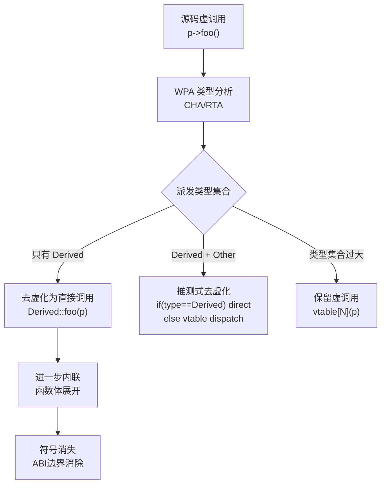

---
tags:
  - ABI
  - 运行时
  - tier3
  - LTO
  - 优化
---
# LTO与内联对ABI边界的影响
> [!abstract] TL;DR
> 链接时优化（LTO）让编译器在链接阶段跨越编译单元边界做内联、常量传播、虚调用去虚化和符号 internalize，彻底打破「每个 .o 就是一个 ABI 单元」的假设。结果是：函数可以从符号表消失、参数数量可以减少、调用规约可以局部特化。对逆向工程师而言，LTO 编译的二进制是函数边界模糊、符号稀少、跨模块逻辑交织的典型难题。理解 LTO 的内部机制——LLVM bitcode 节、ThinLTO module summary、GCC GIMPLE 字节码、WPA 全程序分析——是破局的前提。

## 概述与定位

### 为什么 LTO 是一个 ABI 议题

传统编译模型下，每个翻译单元（Translation Unit，TU）独立编译成 `.o`，链接器只做符号解析和重定位，不理解函数体。这意味着两个 TU 之间的调用必须严格遵守调用规约（SysV AMD64 / Win64 ABI），参数通过约定寄存器传递，调用方/被调用方的代码生成完全解耦。ABI 边界是清晰的——每个函数入口就是一道契约。

LTO（Link-Time Optimization）打破了这道契约。当编译器在链接阶段可以看到所有 TU 的中间表示（IR）时，它可以：

1. **跨 TU 内联**：把 `libfoo.o` 里的函数体直接展开到 `main.o` 的调用点，调用本身消失。
2. **符号 internalize**：把原本对外可见（`default` visibility）的函数改为内部链接，然后做更激进的优化，最终可能把函数完全删除。
3. **去虚化（devirtualization）**：在全程序视角下确定虚调用的目标类型，把 `vtable[N]()` 的间接调用变为直接调用甚至内联。
4. **调用规约特化**：对只有一个调用点的内部函数，编译器可以自行选择更高效的参数传递方式，不再受 ABI 约束。

这些变换在单个 `.o` 层面完全不可见，只在最终二进制里才能观察到。逆向 LTO 编译的二进制，会看到函数边界模糊、符号缺失、调用图拓扑与源码逻辑不对应——这是 LTO 对 ABI 边界影响的直接体现。

### 与本系列其他章节的关系

本章是系列 23 的技术延伸：
- 第 3 章讲 C++ mangling——LTO 的符号 internalize 会让 mangled 符号彻底消失；
- 第 5 章讲 vtable 布局——LTO devirtualization 让 vtable 间接调用变为直接调用；
- 第 10 章讲异常 unwind——LTO 修改函数边界后，`.eh_frame` / `.pdata` 的 CFI 记录也需相应更新（编译器负责）；
- 第 13 章讲 TLS——LTO 可以内联 TLS 访问序列，消除对 `__tls_get_addr` 的调用。

## 原理与机制

### 2.1 传统编译 vs LTO 编译流水线

```
传统模型：
  src_a.cpp ──[前端+中端]──> a.o (机器码)
  src_b.cpp ──[前端+中端]──> b.o (机器码)
  ld: a.o + b.o ──[符号解析+重定位]──> 最终二进制

LTO 模型：
  src_a.cpp ──[前端]──> a.o (含 IR/bitcode)
  src_b.cpp ──[前端]──> b.o (含 IR/bitcode)
  ld + LTO plugin: 合并 IR ──[全程序优化]──[后端]──> 最终二进制
```

关键差异在于：LTO 模型里，链接器调用编译器插件（Gold/LLD 的 LTO plugin），把所有 TU 的 IR 合并成一个大 IR 模块，再交给优化 pass 做全程序分析，最后才生成机器码。

### 2.2 LLVM LTO 的两种模式：FullLTO vs ThinLTO

#### FullLTO（`-flto`）

所有 TU 的 LLVM IR 在链接时合并成**单一大模块**，然后整体跑优化 pass。优化质量最高，但内存消耗极大（等于所有 TU IR 之和），并行化困难，构建时间长。

编译阶段：
```bash
clang -flto -c foo.cpp -o foo.o   # .o 里存 LLVM bitcode，不是机器码
clang -flto -c bar.cpp -o bar.o
```

链接阶段（通过 LTO plugin 自动触发）：
```bash
clang -flto foo.o bar.o -o program
# 等价于：ld.lld + LTO plugin，读取 bitcode，合并，优化，生成机器码
```

`foo.o` 和 `bar.o` 里存的是 ELF 格式的对象文件，但 `.text` 节等位置存放的是 LLVM bitcode，而非机器码。

#### ThinLTO（`-flto=thin`）

ThinLTO 是 LLVM 2016 年引入的可扩展方案，核心思路是**把全程序分析分为两阶段**：

**阶段一：生成 Module Summary（摘要）**

每个 TU 编译时，除了生成 bitcode，还生成一份轻量的**模块摘要（Module Summary Index）**，记录：
- 所有函数的符号信息、调用图边（callee/caller）；
- 函数的 hot/cold 属性；
- 全局变量的引用关系；
- 函数体的哈希（用于去重）。

**阶段二：分布式后端**

链接时，ThinLTO plugin 读取所有摘要，做全局分析（决定哪些函数需要跨 TU 导入、哪些可以 internalize），然后**每个 TU 独立跑后端**，只需导入被决策选中的函数 IR，无需把所有 TU IR 合并成单一模块。这使得 ThinLTO 可以并行化，构建时间接近普通编译。

```
ThinLTO 流程：
  src_a.cpp ──> a.o (bitcode + summary)
  src_b.cpp ──> b.o (bitcode + summary)
  链接器: 读取所有 summary ──[全局分析]──> 导入决策
  并行: 后端(a.o + 导入的b的函数) ──> a.native.o
        后端(b.o + 导入的a的函数) ──> b.native.o
  ld: a.native.o + b.native.o ──> 最终二进制
```

ThinLTO 的优化质量略低于 FullLTO（因为每个 TU 独立后端，全局视野有限），但构建速度快 3-10 倍，工业界（Chrome、Firefox、LLVM 自身、Android）普遍采用 ThinLTO。

### 2.3 Fat Object（`-ffat-lto-objects`）

Fat object 是一种兼容格式：`.o` 文件同时包含**机器码**和 **LLVM bitcode**，两者都嵌入。这样，支持 LTO 的链接器可以使用 bitcode 做 LTO，而不支持 LTO 的链接器直接用机器码链接。

在 ELF 格式里，fat object 通过两个特殊节实现：
- `.llvmbc`：存放 LLVM bitcode；
- `.llvmcmd`：存放编译该模块时的命令行参数。

```bash
clang -flto -ffat-lto-objects -c foo.cpp -o foo.o
objdump -h foo.o | grep llvm
#   16 .llvmbc       00012345  0000...  CONTENTS, READONLY
#   17 .llvmcmd      00000089  0000...  CONTENTS, READONLY
```

逆向时，`.llvmbc` 节的存在是判断目标是否经过 LTO 编译的直接线索（见第 4 节）。

### 2.4 GCC LTO：GIMPLE 字节码

GCC 的 LTO 机制与 LLVM 路线不同，IR 使用的是 GCC 的 GIMPLE（Generic/Gimple Intermediate Language）表示，而非 LLVM IR。

GCC 编译时加 `-flto`，`.o` 文件里的 `.gnu.lto_*` 节存储的是序列化的 GIMPLE 字节码（GCC 私有二进制格式，非标准）。链接时，GCC 的 lto-wrapper 读取这些节，重建 GIMPLE，再做优化，最终生成机器码。

GCC LTO 的关键特征：
- **节名前缀**：`.gnu.lto_`（区别于 LLVM 的 `.llvmbc`）；
- **格式封闭**：GIMPLE 序列化格式随 GCC 版本变化，无公开规范，工具链绑定强；
- **无 ThinLTO 等价物**：GCC 的 LTO 基本是 FullLTO 模式，虽然有 partition 支持（`-flto=N` 把工作分成 N 个 job），但全局性不及 ThinLTO 的 summary 机制。

```bash
gcc -flto -c foo.cpp -o foo.o
readelf -S foo.o | grep gnu.lto
#   [14] .gnu.lto_foo.c   NOTE  ...
#   [15] .gnu.lto_.inline  NOTE  ...
```

### 2.5 全程序分析（WPA）

WPA（Whole Program Analysis）是 LTO 的核心决策引擎，负责：

1. **调用图构建**：合并所有 TU 的调用图，得到完整的程序调用关系。
2. **可达性分析**：从入口点（`main` / 动态库的导出符号）出发，找出所有可达函数，标记不可达函数为可删除。
3. **内联启发式**：根据调用频率、函数大小、是否跨热路径，决定哪些跨 TU 调用值得内联。
4. **符号 internalize**：把仅在程序内部使用、无需对外暴露的符号改为内部链接（`internal` linkage），为后续更激进的优化解除约束。
5. **去虚化分析**：分析虚调用点的实际类型集合（type set），若只有一种可能类型，直接降级为直接调用。

```
WPA 决策流（简化）：
  for each 函数 F:
    if F 在导出符号集之外 AND 未被 dlsym 引用:
      mark F as internalizable
  
  for each 虚调用 VCALL:
    TypeSet = 分析可能派发到 VCALL 的所有类型
    if |TypeSet| == 1:
      devirtualize(VCALL, TypeSet[0].method)
    elif |TypeSet| == N (小):
      生成 N 路分支 + 直接调用（speculative devirtualization）
  
  for each 调用边 (caller, callee):
    if inlining_profitable(caller, callee):
      schedule_inline(caller, callee)
```

## 结构/算法/伪代码详解

### 3.1 跨 TU 内联的 ABI 影响

考虑如下场景：

```cpp
// math.cpp
int add(int a, int b) { return a + b; }

// main.cpp
extern int add(int a, int b);
int main() { return add(3, 4); }
```

不开 LTO 时：
- `math.o` 有符号 `_Z3addii`（mangled）；
- `main.o` 调用 `_Z3addii`，遵守 SysV AMD64 ABI（`rdi=3, rsi=4`，`call _Z3addii`）；
- 链接器把两者连接，最终二进制有 `add` 函数体和完整的调用约定。

开 LTO 时：
- WPA 发现 `add` 只有一个调用点，且函数体极小；
- `add` 被内联到 `main` 里，`call` 指令被 `lea eax, [rdi+rsi]` 替换（实际上常量折叠后直接变成 `mov eax, 7`）；
- 符号 `_Z3addii` 从最终二进制的符号表消失（或降为本地符号 `STB_LOCAL`）；
- ABI 边界消失，调用规约无从验证。

逆向分析时，函数 `add` 不在符号表，也没有单独的函数体，IDA Pro / Ghidra 找不到对应函数——这就是 LTO 对 ABI 边界的直接破坏。

### 3.2 符号 internalize 与可见性

Linux/ELF 有三种符号可见性（`visibility` attribute）：

| 可见性 | 含义 | LTO 下的行为 |
|--------|------|------------|
| `default` | 默认，对外可见，可被动态链接器解析 | LTO 可能 internalize（若判断无动态引用） |
| `hidden` | 对 SO 外不可见，但模块内可见 | LTO 优化时无约束，可自由内联/删除 |
| `protected` | 可被外部引用但不可被 interpose | 较少见，LTO 不能 internalize |
| `internal` | 等同于 `hidden`，且不能形成函数指针被外部使用 | 优化最激进 |

`-fvisibility=hidden` 是工业界的常用编译选项，把所有符号默认设为 `hidden`，只有显式标注 `__attribute__((visibility("default")))` 的才对外暴露。这配合 LTO 可以让编译器极激进地 internalize 和内联。

```cpp
// 显式标注为 default visibility，LTO 不会 internalize
__attribute__((visibility("default"))) 
int exported_api(int x) { return process(x); }

// hidden visibility，LTO 可以内联进 exported_api 并删除符号
static int process(int x) { return x * 2 + 1; }
```

LTO internalize 的决策逻辑（伪代码）：

```
function try_internalize(symbol S):
  if S.visibility == default AND S is in export_list:
    return  // 必须保留，ABI 契约
  if S.is_referenced_by_dynamic_linker():
    return  // dlsym 或动态重定位引用
  if S.is_address_taken_cross_module():
    return  // 函数指针可能从外部传入
  // 可以 internalize
  S.linkage = internal
  // 现在 S 可以被内联、特化、甚至删除
```

### 3.3 去虚化（devirtualization）的全程序视角

传统单 TU 编译下，虚函数调用无法去虚化，因为编译器不知道调用点的运行时类型。LTO 提供了全程序视角，可以做**类型层级分析（Class Hierarchy Analysis，CHA）**和**快速类型测试（Rapid Type Analysis，RTA）**：

```
class Base { virtual void foo(); };
class Derived : public Base { void foo() override; };
class Other : public Base { void foo() override; };
```

如果 WPA 分析发现整个程序里，传给某个调用点的 `Base*` 只可能是 `Derived` 的实例（因为 `Other` 从未被构造），则：

```
// 源码（虚调用）：
void call_foo(Base* p) { p->foo(); }

// LTO 后（去虚化为直接调用，甚至内联）：
void call_foo(Base* p) {
  // assert(dynamic_cast<Derived*>(p));  // 可选的类型检查
  Derived::foo(p);  // 直接调用，可进一步内联
}
```

去虚化不仅消除了 vtable 间接跳转（性能提升），还可能让 `Derived::foo` 被内联，使得符号 `_ZN7Derived3fooEv` 从符号表消失。

Mermaid 图示：



### 3.4 调用规约特化（非标准调用规约的隐式生成）

当函数被 internalize 且只有有限调用点时，编译器可以为其生成**非标准调用规约**的变体（private calling convention）。例如：

- **参数消除**：若某个参数在所有调用点都是常量（如 `flags=0`），编译器可以创建一个特化版本，删掉该参数，在函数体里直接用常量替代；
- **返回值改为输出参数**：若所有调用点都把返回值存到某个结构体成员，编译器可以把结构体指针作为参数传入，函数直接写入；
- **寄存器分配全局优化**：跨调用保存寄存器的 callee-saved 约定可以打破，只要 caller/callee 协商一致。

这些优化对外部完全透明（因为函数已 internalize），但逆向时会看到：

1. 函数签名与头文件声明不符（参数数量或类型对不上）；
2. 寄存器使用模式不符合标准 ABI（例如 `r12` 不保存就直接使用）；
3. 内联后根本找不到独立的函数体。

### 3.5 LTO 与调试信息的关系

LTO 对调试信息（DWARF）的处理是一个需要特别注意的点：

**FullLTO**：所有 IR 合并后统一优化，调试信息也随之整合。原则上 DWARF 应该能正确描述内联信息（`DW_TAG_inlined_subroutine`），但实际上某些 LTO 优化 pass 会破坏调试信息的一致性，导致 `addr2line` 报告错误的行号，GDB 无法正确展开内联帧。

**ThinLTO**：每个 TU 独立后端，调试信息分散在各 partition，跨模块内联的调试信息需要跨 partition 合并，往往更容易出问题。

逆向时，LTO 二进制即使带 DWARF 也经常出现：
- 函数体位于调试信息记录的「不存在」范围；
- 内联展开导致同一地址对应多个「源文件行号」；
- 变量的 `DW_AT_location` 在内联后失效。

## 工具视角与实战

### 4.1 识别 LTO 编译产物

**识别 LLVM LTO 的 `.o` 文件（bitcode-only fat object）：**

```bash
# 方法1：用 file 命令
file foo.o
# foo.o: LLVM IR bitcode  (纯 bitcode，无机器码)

# 方法2：检查 .llvmbc 节（fat object）
readelf -S foo.o | grep -E 'llvmbc|llvmcmd'
# [14] .llvmbc   ...

# 方法3：llvm-dis 直接反汇编 bitcode
llvm-dis foo.o -o foo.ll
cat foo.ll | head -20
```

**识别 GCC LTO 的 `.o` 文件：**

```bash
readelf -S foo.o | grep gnu.lto
#   [12] .gnu.lto_foo    NOTE  ...
```

**识别最终链接二进制是否经过 LTO：**

最终二进制已经是机器码，但有几个间接线索：
1. **符号稀少**：`nm -D binary | wc -l` 比同源非 LTO 二进制少很多；
2. **函数边界模糊**：`objdump -d` 看到大量连续代码块，函数间缺少 `nop` 填充或对齐 padding；
3. **字符串常量跨原函数边界**：同一函数内出现来自多个源文件的字符串（内联的结果）；
4. **`.comment` 节或 build-id**：有些工具链在 `.comment` 里记录编译参数，可以 `strings binary | grep flto`。

### 4.2 逆向 LTO 二进制的实战策略

#### 策略一：从导出符号切入

LTO 无法删除对外导出的符号（动态库的公开 API、可执行文件的 `main`），这些符号是逆向的起点。从 `nm -D` 或 `readelf -Ws` 列出的 `GLOBAL DEFAULT` 符号开始，逐步追踪调用图。

```bash
nm -D libfoo.so | grep ' T '   # 列出所有全局函数符号
```

#### 策略二：识别 ThinLTO Summary 信息

对于 fat object，ThinLTO 的 summary 包含调用图信息，可以用 LLVM 工具提取：

```bash
llvm-bcanalyzer --dump foo.o 2>&1 | grep -A2 'FUNCTION_SUMMARY'
# 可以看到每个函数的调用出边（callees）
```

`llvm-lto2` 工具也可以显示 ThinLTO 的导入/导出决策：

```bash
llvm-lto2 dump-info foo.o bar.o 2>&1 | head -100
```

#### 策略三：用 IDA Pro / Ghidra 的启发式识别内联函数

LTO 内联后，函数体展开到调用点，原来的函数体消失。IDA Pro 7.5+ 和 Ghidra 都支持从字节模式识别常见库函数（FLIRT 签名 / BSim），即使函数没有符号，也可能通过函数体特征匹配到对应的源码。

```
IDA Pro 流程：
  1. File > Load FLIRT signature（选择对应版本的 libc/libstdc++ sig）
  2. View > Open subviews > Functions（查看识别率）
  3. 未识别的大函数：分析是否为多函数内联体
  4. 寻找可复用的局部模式（如 `memcpy` 的 SSE 展开序列）
```

#### 策略四：对比 fat object 中的 bitcode

如果目标是 fat object（含 `.llvmbc` 节），可以直接提取 bitcode 做更深层分析：

```bash
# 提取 .llvmbc 节
objcopy --dump-section .llvmbc=foo.bc foo.o

# 反编译为可读 LLVM IR
llvm-dis foo.bc -o foo.ll

# 查看 IR 里的函数列表（比机器码更接近源码结构）
grep '^define' foo.ll
```

这是逆向 LTO 编译固件的「降维打击」策略：在 IR 层面分析，远比在机器码层面分析更容易理解函数语义。

#### 策略五：利用 PGO profile 残留信息

生产环境编译通常是 LTO + PGO（Profile-Guided Optimization）组合。PGO profile 数据会影响内联决策（热路径优先内联），但 profile 本身通常不嵌入最终二进制。不过，`.llvmbc` 节里有时会保留 profile 权重注解，可以从 IR 里推断哪些路径是热路径。

### 4.3 Fat Object 在 Android NDK 中的应用

Android AOSP 从 Android 10 开始在大量模块使用 ThinLTO。其编译产物特征：

```bash
# AOSP 系统库的 fat object
readelf -S libandroid_runtime.so | grep llvm
# 通常最终 .so 没有 .llvmbc（已完成 LTO，bitcode 不保留）
# 但构建中间产物 .o 有 .llvmbc
```

逆向 Android 系统库时：
- 下载 AOSP 源码和对应版本的 prebuilt toolchain；
- 用 `ANDROID_BUILD_TOP/out/target/product/xxx/obj/` 里的 `.o` 文件提取 bitcode；
- 对 `libdvm.so` / `libart.so` 等核心库做 IR 级分析。

### 4.4 LTO 对二进制差异分析（BinDiff）的影响

版本间二进制差异分析（BinDiff / Diaphora）在 LTO 编译的库上准确率下降明显：

- **函数地址漂移**：内联决策随优化版本变化，导致同一逻辑的代码位置大幅移动；
- **函数合并**：两个小函数在新版本被内联合并，旧版本的一个匹配不到新版本的任何函数；
- **函数分裂**：loop unswitching / partial inlining 可能把一个函数拆成多个块。

应对策略：
1. 用 **基于语义的对比**（Diaphora 的 partial ratio / levenshtein 模式）代替纯基于 CFG 的对比；
2. 优先对比**导出符号**（LTO 不会修改这些）；
3. 使用 **BinSkim** 或 **QUARK Engine** 做更高层的语义差异分析。

## 安全性与正确使用

### 5.1 LTO 不可侵犯的 ABI 边界

LTO 再激进，也有不能越过的红线：

1. **动态链接器解析的符号**：`GLOBAL DEFAULT` 可见性、在 `.dynsym` 里的符号，LTO 不能删除或改变其调用规约；
2. **`__attribute__((used))`**：强制保留符号，LTO 不会删除；
3. **`__attribute__((visibility("default"))) + -fvisibility=hidden`**：显式标注 `default` 的才对外，其余内联；
4. **`extern "C"` 函数**：C 链接函数的 mangling 形式固定（无 mangling），但 LTO 仍然可以在满足条件时 internalize（若确认无外部引用）；
5. **跨 SO 边界的调用**：LTO 原则上只在同一链接单元内（同一 `ld` 命令的所有输入）做优化，跨 SO 的调用保留 ABI 契约。

### 5.2 LTO 引入的正确性风险

LTO 在极端情况下可能引入 bug：

**风险一：`volatile` 语义破坏**

LTO 跨 TU 分析可能错误地消除对 `volatile` 变量的访问，因为某些编译器实现的 LTO 中间 pass 未正确处理跨模块的 `volatile` 语义链。（LLVM 近年修复了多个相关 bug。）

**风险二：`__attribute__((noinline))` 被忽视**

少数情况下，LTO 的跨 TU 内联决策与 `noinline` 属性冲突。正确行为是 `noinline` 应当阻止 LTO 内联，但历史上有 bug（`clang` 在 ThinLTO 下偶发此问题）。

**风险三：One Definition Rule（ODR）违反放大**

LTO 合并 IR 时，若两个 TU 对同一模板实例化产生不同的函数体（ODR 违反），LTO 会选择其中一个，另一个静默丢弃。这在非 LTO 链接时通常不报错（链接器随机选一个），但 LTO 可能选择"更差"的那个，导致运行时 bug。

**风险四：sanitizer + LTO 的兼容性**

ASan / UBSan 的插桩与 LTO 优化有时产生冲突——LTO 内联可能把 sanitizer 插桩点移出原有函数作用域，导致误报或漏报。Google 的 Chrome 团队在 `is_component_build + asan + thinlto` 组合下遇到过多次此类问题。

建议规则：

```
if 正在开发调试阶段:
  不开 LTO，保持 ABI 边界清晰，调试器可靠
elif 需要 sanitizer:
  不开 LTO（或用 -fsanitize=...  + -fno-lto 组合）
elif 生产发布:
  开 ThinLTO，配合 -fvisibility=hidden 和 export list
```

### 5.3 `-fno-lto` 边界隔离策略

在混合代码库中，可以对某些需要保持稳定 ABI 的模块禁用 LTO：

```cmake
# CMakeLists.txt：对安全关键模块禁用 LTO
target_compile_options(crypto_module PRIVATE -fno-lto)
target_link_options(crypto_module PRIVATE -fno-lto)
```

这样 `crypto_module` 的函数保持标准 ABI，即使全局开了 LTO，该模块与外部的调用边界也不会被 LTO 优化。

### 5.4 export list 的重要性

生产环境使用 LTO 必须配合 **export list**（也叫 `--version-script` 或 `-exported_symbols_list`），明确告知 LTO plugin 哪些符号必须保留：

```
# symbols.map（GCC/Clang ld 版本脚本）
{
  global:
    my_lib_init;
    my_lib_process;
    my_lib_cleanup;
  local:
    *;   # 其余全部 internalize
};
```

```bash
clang -flto=thin -Wl,--version-script=symbols.map -o libfoo.so *.o
```

没有 export list 的 LTO 共享库，动态链接器可能找不到应该暴露的函数（已被 internalize），导致 `dlopen` 后 `dlsym` 返回 NULL。

### 5.5 逆向工程的法律与道德边界

对 LTO 编译的商业二进制做逆向分析时：
- 提取 `.llvmbc` 节并 `llvm-dis` 反编译到 IR 级别，在法律上与汇编级反汇编处于相似地位，各地法律不同；
- 对于开源项目（Android AOSP、Chromium），利用构建系统提取 fat object 并分析 IR 完全合法；
- 安全研究（漏洞分析）通常受法律保护，但应遵守披露规范。

## 小结

LTO 是一种系统性的 ABI 边界重构机制，其影响总结如下：

| 现象 | LTO 机制 | 逆向影响 |
|------|---------|--------|
| 函数符号消失 | internalize + 内联 | nm/IDA 找不到函数 |
| 参数数量变化 | 常量传播 + 参数消除 | 函数签名与头文件不符 |
| 虚调用变直接调用 | devirtualization（CHA/RTA） | vtable 分析失效 |
| 调用规约特化 | 私有调用规约 | 寄存器使用模式异常 |
| 函数边界模糊 | 跨 TU 内联 | 反汇编函数分块错误 |
| 调试信息不准 | 内联后 DWARF 更新不完整 | addr2line 行号错误 |

应对策略优先级：
1. **有 fat object**：提取 `.llvmbc`，在 IR 层分析，事半功倍；
2. **有 FLIRT/BSim 库**：匹配标准库函数，重建调用图；
3. **从导出符号入手**：LTO 不动的边界，是最可靠的分析起点；
4. **对比 ThinLTO Summary**：`llvm-lto2 dump-info` 可以得到调用图骨架；
5. **参考 AOSP/Chromium 构建产物**：这两个大型开源项目大量使用 ThinLTO，逆向技巧有丰富社区经验可以参考。

FullLTO 优化质量最高但构建慢，ThinLTO 是工业界主流折中方案。GCC GIMPLE 与 LLVM bitcode 是两套不互通的 LTO IR 体系。无论哪种，ABI 契约的核心不变：**对外导出的动态符号永远受保护，内部符号是 LTO 的猎场**。

## 相关阅读

- [[00.C_C++运行时与ABI总览|系列总览]]
- LLVM 文档：[LTO](https://llvm.org/docs/LinkTimeOptimization.html) / [ThinLTO](https://clang.llvm.org/docs/ThinLTO.html)
- Teresa Johnson, Mehdi Amini, Xinliang David Li —「ThinLTO: Scalable and Incremental LTO」(CGO 2017)
- GCC 文档：[Link-Time Optimization](https://gcc.gnu.org/onlinedocs/gccint/LTO-Overview.html)
- Rui Ueyama —「LLD: LLVM Linker」相关章节（lld.llvm.org）
- Android LTO 实践：[AOSP LTO 文档](https://source.android.com/docs/core/architecture/lto)
- Peter Collingbourne —「ControlFlowIntegrity + LTO」（LLVMdev 演讲）
- 本系列相关章节：第 3 章（名字修饰与符号）、第 5 章（vtable 与虚函数布局）、第 10 章（异常展开 ABI）

---

[[00.C_C++运行时与ABI总览|⬆ 系列总览]] | [[18.std_function与类型擦除ABI|← 上一章]] | [[20.栈保护运行时Canary与CET与SafeStack|→ 下一章]]
