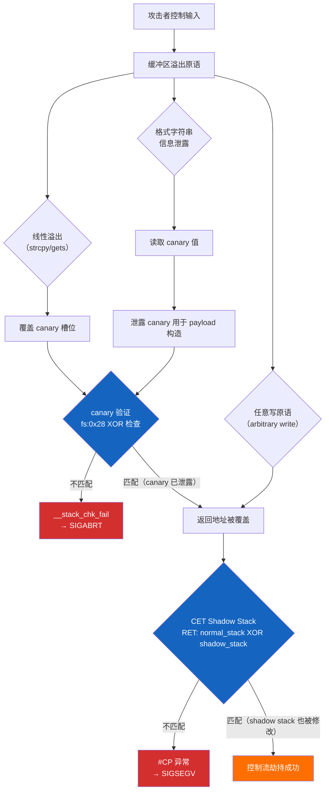

---
tags:
  - ABI
  - 运行时
  - tier3
  - 栈保护
  - CET
---
# 栈保护运行时：Canary、CET 与 SafeStack

> [!abstract] TL;DR
> 栈保护机制是现代 C/C++ 运行时的重要 ABI 组成部分，涵盖三个层次：**软件层**（Stack Canary，编译器在函数入口/出口插入 `fs:0x28` 守卫值校验）、**硬件层**（Intel CET Shadow Stack，以 `ENDBR64`/`WRSS` 指令维护独立的返回地址影子栈）、**编译器双栈层**（LLVM SafeStack，将不安全对象隔离到独立栈）。这三套机制均在运行时二进制中留下可识别的特征序列，是逆向工程师必须理解的 ABI 契约，也是漏洞防御研究的核心知识点。ARM 平台的 PAC/BTI 机制提供了与 CET 对等的指针认证保护。

## 概述与定位

栈缓冲区溢出（Stack Buffer Overflow）是历史上最古老、危害最深远的内存安全漏洞类别之一。从 1988 年 Morris 蠕虫利用 `fingerd` 的 `gets()` 溢出，到 2000 年代初期 Shellcode 横行的黄金时代，攻击者的核心目标始终是覆盖栈上的**返回地址**，将控制流劫持到任意位置。为此，操作系统、编译器、处理器厂商先后在不同层次引入了多种防护机制，形成了今天纵深防御体系中的"栈完整性保护层"。

理解这套机制对于三类人群至关重要：

**对于安全研究人员**：在授权渗透测试或漏洞研究中，必须准确识别目标二进制开启了哪些保护，以便评估攻击面和设计防御性概念验证（PoC）。识别 canary 读取序列（`mov rax, fs:[0x28]`）、CET 指令前缀（`ENDBR64`）是分析固件和应用程序安全性的基本功。

**对于逆向工程师**：栈保护代码序列大量出现在反汇编输出中，若不能识别并在精神上"过滤"这些序列，会严重干扰对真实业务逻辑的理解。每一个使用 `-fstack-protector` 编译的函数，都会在函数序言（prologue）和尾声（epilogue）中插入若干条指令，不认识它们就会把安全代码误读为业务逻辑。

**对于 C/C++ 开发者**：在嵌入式、内核、高性能计算等场景中，需要在性能开销与安全保证之间做出权衡，必须理解各个保护选项（`-fstack-protector-strong`、`-fcf-protection`、`-fsanitize=safe-stack`）的实际覆盖范围和代价。

从 ABI 角度看，这套机制的约束性体现在：canary 的位置（TLS 偏移 `fs:0x28`）是操作系统与 C 运行时之间的接口契约；`ENDBR64` 指令是 ABI 规范要求间接调用/跳转目标必须携带的标记；SafeStack 的不安全栈指针是线程局部变量，其访问方式由编译器与运行时共同约定。这些约定跨越编译器版本和操作系统版本，构成了可观测、可依赖的运行时 ABI。

## 原理与机制

### Stack Canary：软件层返回地址保护

Stack Canary 的核心思想极其简洁：在可能被溢出的缓冲区与保存的返回地址之间，插入一个**随机的哨兵值**（canary），在函数返回之前校验这个值是否被篡改。由于线性溢出（如 `strcpy` 覆盖）要覆盖返回地址，必然先覆盖 canary；一旦校验失败，立即调用 `__stack_chk_fail` 终止进程。

#### canary 的历史分类

**Terminator Canary（终止符 Canary）**：最早期的实现（StackGuard，1998 年，Crispin Cowan 等人提出）使用特殊字符如 `\0`、`\n`、`-1` 等作为 canary 值，因为这些字符是 `strcpy`、`gets` 等函数的自然终止符——溢出函数无法通过这些字节，因此无法将攻击者控制的数据越过 canary。这种方法的缺点是可预测。

**Random Canary（随机 Canary）**：现代实现使用 `/dev/urandom` 或等效的密码学安全随机源在进程启动时生成 canary 值，并存储在线程局部存储（TLS）中。Linux 上的 canary 存储在 `pthread_t` 结构体中，通过 `fs` 段寄存器（x86-64）或 `gs` 段寄存器（x86-32）的固定偏移访问，具体位置是：

- **x86-64 Linux**：`fs:0x28`（即 `fs` 段基址 + 40 字节偏移处）
- **x86-32 Linux**：`gs:0x14`（即 `gs` 段基址 + 20 字节偏移处）
- **Windows x64**：`gs:0x28`（Windows 使用 `gs` 段寄存器索引线程信息块 TIB）

这个固定偏移是操作系统与 C 运行时之间的约定，是不可更改的 ABI 契约。

#### 哨兵值的初始化

在 Linux 上，canary 的初始化发生在 `glibc` 的启动代码中，具体是 `security_init()` 函数（位于 `csu/init-first.c`）。该函数从 `/dev/urandom` 读取 8 字节（x86-64）或 4 字节（x86-32）随机值，并将其写入当前线程的 TLS 区域的固定偏移处。

一个重要的实现细节：随机 canary 的**最低字节被强制清零**（即 canary 值的最低有效字节 = `0x00`）。这是有意为之的设计——使 canary 同时兼具 Terminator Canary 的性质，使得即使攻击者知道 canary 不是纯随机（最低字节为 0），基于字符串函数的溢出也无法绕过这个零字节屏障（`strcpy` 会在遇到 `\0` 时停止复制）。

#### 栈帧中的 canary 位置

编译器将 canary 放置在局部变量区域与已保存寄存器/返回地址之间。具体的栈布局如下（x86-64，向低地址增长）：

```
高地址
+---------------------------+
| 调用者的返回地址           |  <-- 攻击目标
+---------------------------+
| 已保存的 rbp               |
+---------------------------+
| canary 值（fs:0x28 的副本）|  <-- 保护屏障
+---------------------------+
| 局部数组/缓冲区（危险区域）|  <-- 潜在溢出源
+---------------------------+
| 其他局部变量               |
+---------------------------+
低地址（栈顶 rsp 方向）
```

这个布局确保了：从低地址向高地址的线性溢出，必须先覆盖 canary 才能到达返回地址。

#### 汇编层的 canary 读写序列

一个典型的 canary 插桩序列（x86-64 GCC/Clang 输出）如下：

**函数序言（prologue）——读取并保存 canary**：
```asm
push   rbp
mov    rbp, rsp
sub    rsp, 0x40          ; 分配栈帧
mov    rax, fs:[0x28]     ; 从 TLS 读取 canary
mov    [rbp-0x8], rax     ; 保存到栈帧中 canary 槽位
xor    eax, eax           ; 清零 rax（避免寄存器中留有 canary 副本）
```

**函数尾声（epilogue）——验证 canary**：
```asm
mov    rax, [rbp-0x8]     ; 从栈帧读回 canary
xor    rax, fs:[0x28]     ; 与 TLS 中的原始值 XOR
je     .L_ok              ; 相等则跳过错误处理
call   __stack_chk_fail   ; 不相等则调用失败处理函数
.L_ok:
leave
ret
```

注意：验证使用 `xor` 而非比较指令，`xor` 结果为零（ZF=1）表示两值相同，这是编译器优化的结果——`xor` 后紧跟 `je` 比 `cmp` + `je` 少一条指令。

#### `__stack_chk_fail` 的行为

当 canary 不匹配时，`__stack_chk_fail` 被调用。在 glibc 实现中，该函数：
1. 向 `stderr` 打印 `*** stack smashing detected ***` 消息
2. 调用 `abort()` 终止进程，产生 `SIGABRT` 信号

关键：`__stack_chk_fail` **不返回**，函数属性被标记为 `__attribute__((noreturn))`。这意味着如果攻击者控制了 canary 槽位并使其通过验证（通过泄露 canary 值）或绕过检查逻辑，那么返回地址的覆盖才真正生效。

### -fstack-protector 系列编译选项

GCC 和 Clang 提供了一组覆盖范围递增的选项：

| 选项 | 插桩策略 |
|------|----------|
| `-fstack-protector` | 仅对含有字符数组（`char[]`）且大小 ≥ 8 字节的函数插桩（最保守） |
| `-fstack-protector-strong` | 对含有数组（任意类型）、地址被取出的局部变量、`alloca()` 调用的函数插桩（GCC 4.9+ / Clang 3.4+，推荐的平衡选项） |
| `-fstack-protector-all` | 对**所有**函数插桩，无论栈帧内容（最激进，性能开销最高） |
| `-fno-stack-protector` | 禁用栈保护（内核代码、性能敏感路径） |

`-fstack-protector-strong` 覆盖的场景远比 `-fstack-protector` 广泛，因为现实中的漏洞不仅来自 `char[]`，整型数组溢出同样危险。当前主流 Linux 发行版（Debian、Fedora、Ubuntu）均默认使用 `-fstack-protector-strong`。

### Intel CET：硬件层控制流强制

Intel Control-flow Enforcement Technology（CET）是 Intel 在第 11 代 Tiger Lake 处理器（2020 年）引入的硬件安全特性，提供两个相互独立的子功能：

#### Shadow Stack（影子栈）

Shadow Stack 是 CET 中保护返回地址的核心机制。其工作原理如下：

**硬件维护独立的影子栈**：CPU 维护一个专用的**影子栈指针寄存器（SSP，Shadow Stack Pointer）**，指向内存中的一块独立区域（影子栈）。影子栈页面由操作系统通过新增的页表属性标记为"影子栈可写"（shadow-stack writable）。

**`CALL` 指令的行为变化**：当 CPU 执行 `CALL` 指令时，同时向普通栈压入返回地址，**也向影子栈写入返回地址**（通过 `WRSS` 或内部 `CALL` 逻辑）。

**`RET` 指令的行为变化**：当 CPU 执行 `RET` 指令时，从普通栈弹出返回地址，同时从影子栈弹出返回地址，**比较两者是否相同**。若不同，产生 `#CP`（Control Protection Exception，异常向量 21）。

**SSP 寄存器（Shadow Stack Pointer）**：
- `SSP` 是新增的架构寄存器，不通过通用寄存器访问
- `RDSSP`（Read Shadow Stack Pointer）：读取当前 SSP 到通用寄存器
- `INCSSPQ`/`INCSSPD`：递增 SSP（用于 `longjmp` 等非本地跳转场景）
- `WRSS`（Write Shadow Stack）：向影子栈写入值（仅在特定条件下可用，用于 `longjmp` 状态恢复）
- `SAVEPREVSSP`/`RSTORSSP`：保存/恢复 SSP（用于协程或上下文切换）

影子栈的关键安全属性：**普通 `MOV` 指令无法写入影子栈页面**。攻击者即使通过缓冲区溢出覆盖了普通栈上的返回地址，但影子栈中的副本未被篡改，`RET` 执行时发现不一致，立即触发异常。这使得传统的 Stack Smashing 攻击（仅针对普通栈的返回地址覆盖）彻底失效。

#### IBT：间接分支跟踪

IBT（Indirect Branch Tracking）是 CET 的第二个子功能，防御 JOP（Jump-Oriented Programming）和 COP（Call-Oriented Programming）攻击。

**ENDBR64 / ENDBR32 指令**：IBT 要求所有间接 `CALL` 和间接 `JMP` 的合法目标必须以 `ENDBR64`（64 位模式）或 `ENDBR32`（32 位模式）指令开头。这两条指令的编码分别是：
- `ENDBR64`：`F3 0F 1E FA`（4 字节）
- `ENDBR32`：`F3 0F 1E FB`（4 字节）

在不支持 CET 的处理器上，这两条指令被解码为 `NOP`（`F3` 前缀 + `0F 1E`，合法的 hint NOP），因此**向下兼容**，不会在老处理器上引发异常。

**TRACKER 状态机**：处理器内部维护一个单比特 TRACKER 状态：
- 初始状态：`IDLE`
- 执行间接 `CALL`/`JMP` 时，TRACKER → `WAIT_FOR_ENDBR`
- 下一条指令若为 `ENDBR64/32`：TRACKER → `IDLE`（合法）
- 下一条指令若非 `ENDBR64/32`：产生 `#CP` 异常

这意味着任何 ROP/JOP 跳转到不以 `ENDBR64` 开头的 gadget，都会立即被硬件检测到。

**编译器支持（GCC/Clang）**：
```bash
-fcf-protection=full      # 同时启用 IBT 和 Shadow Stack（需 CET 支持）
-fcf-protection=branch    # 仅启用 IBT（ENDBR64 插入）
-fcf-protection=return    # 仅启用 Shadow Stack
-fcf-protection=none      # 禁用（默认）
```

启用 `-fcf-protection=branch` 后，编译器在每个函数入口（间接调用/跳转的合法目标）插入 `ENDBR64`，在每个间接跳转目标（switch 跳转表目标）也插入 `ENDBR64`。

#### Linux 内核对 CET 的支持

Linux 5.18 起内核支持用户态 CET Shadow Stack，通过 `arch_prctl(ARCH_ENABLE_CET_SS, ...)` 启用。glibc 2.39 起在支持的处理器上自动为进程启用 IBT；glibc 2.41 起默认启用 Shadow Stack（若 CPU 支持）。操作系统通过 `#CP` 异常处理，在检测到 Shadow Stack 违规时向进程发送 `SIGSEGV`。

### LLVM SafeStack：编译器双栈分离

SafeStack 是 LLVM 提出的一种纯软件栈保护方案，不依赖特定 CPU 特性，通过**将栈对象分离到两个独立的栈**来提供保护：

**安全栈（Safe Stack）**：存放经过编译器静态分析，确认不可能被外部访问（即不存在指针泄露给外部函数、不涉及动态大小分配等）的局部变量。安全栈使用普通的 `rsp` 寄存器维护，布局与普通函数栈帧相同。

**不安全栈（Unsafe Stack）**：存放可能被不安全访问的局部变量——即任何无法被编译器静态证明为安全的对象，包括：
- 地址被传递给其他函数的变量（`foo(&local_var)`）
- 动态大小的数组（VLA、`alloca`）
- 大型聚合类型（struct/array）
- 向量化代码中使用的数组

不安全栈指针存储在线程局部变量（TLS）中，通常通过 `__safestack_unsafe_stack_ptr` 符号访问。在 x86-64 Linux 上，其访问方式类似 canary 的 `fs:offset` 模式，但偏移量取决于具体实现。

**关键安全属性**：返回地址存放在**安全栈**中，而潜在的溢出目标（不安全的缓冲区）在**不安全栈**中。两个栈位于不同的内存区域，地址空间不相邻（通过 mmap 分配，位置随机化）。即使攻击者溢出了不安全栈上的缓冲区，也无法线性覆盖到安全栈上的返回地址，因为两者之间没有连续的内存映射。

**编译选项**：
```bash
-fsanitize=safe-stack     # 启用 SafeStack
```

SafeStack 与 ASan 不能同时使用（两者均修改栈布局，互不兼容）。

### ARM PAC：指针认证

ARM 从 ARMv8.3-A 起引入**指针认证（Pointer Authentication, PAC）**，提供与 Intel CET Shadow Stack 类似（但机制不同）的保护：

**核心原理**：ARM 引入了**指针认证码（PAC）**，存储在指针值的高位（利用虚拟地址空间的未使用位）。PAC 通过带密钥的单向函数（类似 MAC）计算，密钥存储在不可用户态直接读取的系统寄存器（`APIAKEYLO_EL1` 等）中。

**关键指令**：
- `PACIA Xn, Xm`：对地址 `Xn` 用上下文 `Xm` 和密钥 IA 签名（插入 PAC 到高位），常用于对返回地址 `LR` 签名
- `AUTIA Xn, Xm`：验证 `Xn` 中的 PAC，若验证失败则将 `Xn` 置为无效地址（访问会产生 fault），用于函数返回前验证 `LR`
- `PACIASP`：对 `LR`（Link Register，即返回地址）使用 `SP` 作为上下文签名（常见的函数序言指令）
- `AUTIASP`：验证 `LR` 中的 PAC，使用 `SP` 作为上下文（常见的函数尾声指令）

**AArch64 函数序言/尾声的 PAC 模式**：
```asm
; 函数序言（PAC 签名）
PACIASP                    ; 对 LR 签名（使用 SP 作为上下文）
STP X29, LR, [SP, #-16]!  ; 压栈（保存含 PAC 的 LR）

; 函数尾声（PAC 验证）
LDP X29, LR, [SP], #16    ; 出栈（恢复含 PAC 的 LR）
AUTIASP                    ; 验证 LR 中的 PAC（若失败则 LR 变为无效地址）
RET                        ; 跳转到 LR
```

**BTI（Branch Target Identification）**：ARM 的 BTI 与 Intel 的 IBT 功能对应。BTI 使用 `BTI` 指令（`HINT #32`、`HINT #34`、`HINT #36`、`HINT #38`）标记合法的间接跳转/调用目标：
- `BTI c`：合法的间接调用目标（`BLR` 的目标）
- `BTI j`：合法的间接跳转目标（`BR` 的目标）
- `BTI jc`：两者均合法

编译选项：
```bash
-mbranch-protection=standard    # 启用 PAC (bti,pac-ret) 在 AArch64
-mbranch-protection=pac-ret     # 仅返回地址签名
-mbranch-protection=bti         # 仅间接分支保护
```

## 结构/算法/伪代码详解

### 完整的 Canary 生命周期

以下是 canary 从进程启动到函数执行全生命周期的伪代码描述：

**阶段一：进程启动时的 canary 初始化（glibc `_dl_start` → `security_init`）**：

```c
// 简化的 glibc canary 初始化逻辑
void security_init(void) {
    // 从 /dev/urandom 读取随机字节
    uintptr_t canary = 0;
    int fd = open("/dev/urandom", O_RDONLY);
    read(fd, &canary, sizeof(canary));
    close(fd);
    
    // 强制最低字节为 0（兼容 terminator canary 语义）
    canary &= ~0xFFULL;  // 清零最低 8 位（LSB）
    
    // 写入主线程 TLS（fs 段基址 + 0x28 偏移）
    __builtin_ia32_wrfsbase(tls_base);  // 设置 fs 段基址
    // 或直接通过 arch_prctl(ARCH_SET_FS, tls_base)
    *(uintptr_t*)(tls_base + 0x28) = canary;
    
    // 同时写入全局变量 __stack_chk_guard（某些实现/版本）
    __stack_chk_guard = canary;
}
```

**阶段二：编译器插入的函数序言/尾声（C 代码 → 伪汇编）**：

```c
// 原始 C 代码
int vulnerable_function(char *input) {
    char buf[64];
    strcpy(buf, input);  // 潜在的溢出点
    return strlen(buf);
}
```

```c
// 编译器将其变换为（概念层面的 C 等价物）
int vulnerable_function(char *input) {
    // 序言：读取并保存 canary
    uintptr_t __canary = *(uintptr_t*)(fs_base + 0x28);
    
    char buf[64];
    strcpy(buf, input);  // 潜在的溢出点
    int result = strlen(buf);
    
    // 尾声：验证 canary
    if (__canary ^ *(uintptr_t*)(fs_base + 0x28)) {
        // canary 被修改
        __stack_chk_fail();  // noreturn
    }
    return result;
}
```

**阶段三：`__stack_chk_fail` 的执行（glibc 实现）**：

```c
// glibc 实现（简化）
__attribute__((noreturn))
void __stack_chk_fail(void) {
    // 通过安全的 write 系统调用（而非 fprintf/printf，因为 stdio 可能被污染）
    const char msg[] = "*** stack smashing detected ***\n";
    write(STDERR_FILENO, msg, sizeof(msg) - 1);
    abort();  // 产生 SIGABRT，触发 core dump
}
```

### CET Shadow Stack 的完整交互模型

```
普通执行流（普通栈）        CET Shadow Stack 并行维护
                           
CALL target:               同步发生：
  push RIP+size → [RSP]    push RIP+size → [SSP]
  SSP -= 8                 （SSP 自动递减）
  JMP target               ENDBR64 检查（若 IBT 启用）
                           
RET:                       同步发生：
  pop RIP ← [RSP]         pop shadow_RIP ← [SSP]
  RSP += 8                 SSP += 8
  if (RIP ≠ shadow_RIP):  
    raise #CP exception    （Control Protection Fault）
  JMP RIP                  
```

### SafeStack 的静态分析算法

LLVM SafeStack 中，编译器在 IR 层面对每个局部变量进行**安全性分析**（`isSafeStackAlloca` 函数），判断标准如下：

```
函数: isSafeStackAlloca(alloca_inst)
  对 alloca 的所有 use 递归分析：
  
  case LoadInst:       → 安全（仅读取）
  case StoreInst:      
    if (stored_value == alloca): → 不安全（地址被存储）
    else: → 安全（写入内容）
  case CallInst/InvokeInst:
    if (alloca 是参数之一): → 不安全（地址传出函数）
    if (alloca 是函数指针): → 不安全
  case GetElementPtrInst:
    if (所有 index 为常量 且 不越界): → 递归分析 GEP 的 use
    else: → 不安全（动态 GEP，无法静态验证）
  case BitCastInst: → 递归分析 cast 的 use
  case PHINode/Select: → 递归分析（但检测循环）
  default: → 不安全（保守策略）
```

如果一个 `alloca` 被判定为不安全，它会被分配到不安全栈上；否则保留在普通（安全）栈上，正常使用 `rsp`。

### ARM PAC 的密码学机制

PAC 的计算使用 **QARMA** 算法（一种轻量级可调分组密码，针对 64 位指针设计）：

```
PAC = QARMA(
    value   = 地址值（去除 PAC 位后的纯地址），
    tweak   = 上下文值（如 SP 或 0），
    key     = 系统寄存器中的密钥（APIAKey 等，用户态不可读）
)
```

签名后的指针格式（以 `PACIA` 为例，48 位有效地址空间场景）：

```
63     55     47                 0
 [ 扩展 |  PAC  |    有效地址      ]
  (符号) (8位)   (48位虚拟地址)
```

验证失败时，`AUTIA` 不产生异常，而是将指针的高位填充错误标记（bit 55 被翻转），使得后续的内存访问（`RET` 或 `LDR`）因地址无效而产生 `SIGSEGV`，从而延迟但有效地检测到篡改。

## 工具视角与实战

### 逆向识别：Canary 序列的特征模式

在反汇编工具（IDA Pro、Ghidra、Binary Ninja、radare2）中，可以通过以下特征快速识别 canary 保护：

**序言特征**（x86-64）：
```asm
; 典型 GCC 生成的 canary 序言
mov    rax, qword ptr fs:[0x28]   ; 读取 canary（特征：fs 段寄存器 + 0x28 偏移）
mov    qword ptr [rbp-0x8], rax   ; 保存到栈帧（偏移通常为 -0x8 或 -0x10）
xor    eax, eax                   ; 清零 rax
```

**尾声特征**：
```asm
; 典型验证序列
mov    rax, qword ptr [rbp-0x8]   ; 读回 canary
xor    rax, qword ptr fs:[0x28]   ; 与 TLS 原值 XOR
je     .return_ok                 ; 若 ZF=1（相等）则正常返回
call   __stack_chk_fail           ; 否则调用失败处理
```

**Clang 的变体**（可能生成略有不同的序列）：
```asm
; Clang 有时生成
mov    rax, qword ptr fs:[0x28]
mov    qword ptr [rsp+0x38], rax  ; 相对于 rsp 而非 rbp
```

**GDB/LLDB 中的 canary 调试**：
```bash
# 在 GDB 中读取当前线程的 canary 值
(gdb) x/xg (void*)($fs_base + 0x28)

# 设置断点在 __stack_chk_fail 观察溢出
(gdb) break __stack_chk_fail

# 用 pwndbg 插件查看栈布局
(pwndbg) stack 20
(pwndbg) canary
```

**Checksec 工具检查二进制保护状态**：
```bash
# 使用 checksec 检查 ELF 二进制的保护特性
checksec --file=./target_binary

# 典型输出
RELRO           STACK CANARY      NX            PIE             
Full RELRO      Canary found      NX enabled    PIE enabled
```

### 逆向识别：CET 指令特征

**识别 IBT（ENDBR64）**：在支持 CET 编译的二进制中，每个函数开头（以及 switch 跳转表目标）均有 `ENDBR64`：

```asm
00000000004011a0 <main>:
  4011a0: f3 0f 1e fa    endbr64          ; CET IBT 标记（F3 0F 1E FA）
  4011a4: 55             push   rbp
  4011a5: 48 89 e5       mov    rbp, rsp
```

在不支持 CET 的工具中，`ENDBR64` 可能显示为 `REP NOP` 或 `NOP`，需要注意辨别。

**readelf 检查 CET 属性**：
```bash
# ELF 文件中的 CET 支持信息存储在 .note.gnu.property 节中
readelf -n target_binary | grep -i cet

# 或
objdump -d --section=.note.gnu.property target_binary
```

**识别 Shadow Stack 操作**（在汇编中搜索）：
```bash
# 在二进制中搜索 WRSS 指令（F3 0F AE /4 或 F3 0F AE /5）
# 或 RDSSP（F3 0F 1E C8）
objdump -d target_binary | grep -E 'rdssp|wrss|incssp|rstorssp'
```

### 逆向识别：SafeStack 特征

SafeStack 编译的二进制中，可以观察到对 TLS 变量的额外访问：

```asm
; SafeStack 的不安全栈访问特征
mov    rax, qword ptr fs:[__safestack_unsafe_stack_ptr@TPOFF]
sub    rax, 0x100          ; 在不安全栈上分配空间
mov    qword ptr fs:[__safestack_unsafe_stack_ptr@TPOFF], rax

; 函数结束时恢复不安全栈指针
add    rax, 0x100
mov    qword ptr fs:[__safestack_unsafe_stack_ptr@TPOFF], rax
```

符号 `__safestack_unsafe_stack_ptr` 在二进制中可见（若未被 strip），是识别 SafeStack 的关键标志。

### 识别 ARM PAC 特征

```asm
; PAC 保护的 AArch64 函数序言（iOS/macOS 二进制）
<function_start>:
    PACIASP                    ; F3 0F 1E FA（AArch64 编码不同，实为 hint #25）
    STP X29, LR, [SP, #-0x20]!
    MOV X29, SP

; 函数尾声
    LDP X29, LR, [SP], #0x20
    AUTIASP                    ; 验证 LR 中的 PAC
    RET
```

在 arm64 上的 `otool -t` 或 `llvm-objdump -d` 输出中，`PACIASP` 和 `AUTIASP` 是 PAC 保护的明确标志。iOS/macOS 平台从 iOS 13/macOS 10.15 起系统库全面启用 PAC。

### 动态分析：检测 CET 是否生效

```bash
# 在 Linux 上检查 CPU 是否支持 CET
grep -E 'shstk|ibt' /proc/cpuinfo

# 检查当前进程是否启用了 shadow stack（Linux 6.6+）
cat /proc/self/status | grep -i shadow

# 使用 strace 观察 shadow stack 相关的 prctl 调用
strace -e prctl ./target_binary 2>&1 | grep -i cet
```

### 性能开销分析

| 保护机制 | 典型性能开销 | 代码体积增长 |
|----------|-------------|-------------|
| `-fstack-protector-strong` | 1-3%（主要来自 TLS 访问） | ~5%（每个受保护函数 +4 条指令） |
| `-fcf-protection=branch`（IBT） | < 1%（ENDBR64 为 NOP 语义） | ~2%（每个函数入口 +4 字节） |
| CET Shadow Stack（硬件）| 1-3%（影子栈访问带来 cache 压力） | 极小（指令集扩展，无代码膨胀） |
| SafeStack | 3-10%（双栈维护开销，取决于不安全对象比例） | ~10-20%（额外的 TLS 访问指令） |
| ARM PAC | < 1%（PACIASP/AUTIASP 均为单条指令） | ~2%（每个函数 +2 条指令） |

### 工具链集成示例

**完整的多层保护编译命令（GCC x86-64 Linux）**：
```bash
gcc -o secure_binary source.c \
    -fstack-protector-strong \
    -fcf-protection=full \
    -D_FORTIFY_SOURCE=2 \
    -pie -fPIE \
    -Wl,-z,relro,-z,now \
    -O2
```

**Clang + SafeStack（特别适合低信任代码路径）**：
```bash
clang -o safe_binary source.c \
    -fsanitize=safe-stack \
    -fstack-protector-strong \
    -O2
```

## 安全性与正确使用

> [!caution]
> **研究伦理声明**：本章节涉及 canary 泄露、CET 绕过等防护机制的对抗性分析，所有技术内容**仅面向授权的防御性安全研究**，包括：针对己方系统的安全评估、CTF 竞赛、学术研究、以及在合法渗透测试协议下对客户系统的测试。这些知识不得用于针对未经授权的系统，不提供任何武器化利用代码或具体攻击步骤的实现。理解绕过手法的目的是**更好地理解保护机制的边界，从而设计更强的防御**。

### 各保护机制的防御边界与局限

#### Canary 的已知局限性

**1. 信息泄露（Information Disclosure）**：Canary 的安全性依赖于攻击者不知道 canary 值。若存在**格式字符串漏洞**（`printf(user_input)`）、**任意读取原语**（OOB read）、或**堆上的指针泄露**，攻击者可以先读取 canary 值，再将其正确地写入溢出 payload，使 canary 校验通过。这是 leak-then-overwrite 攻击模式的核心。

防御响应：在 Canary 之上叠加**地址空间布局随机化（ASLR）**和**全局偏移表只读（RELRO + Full RELRO）**，使即使 canary 泄露，攻击者也难以确定有效地利用目标地址。

**2. 非线性覆盖**：Canary 仅防御从低地址向高地址的**线性溢出**。若漏洞允许**任意写**（arbitrary write primitive，如 `*(attacker_controlled_ptr) = attacker_value`），可以直接覆盖返回地址而无需经过 canary，canary 完全失效。

防御响应：CET Shadow Stack 在这种场景下仍然有效，因为影子栈只能通过特定的 `WRSS` 指令修改（而非普通内存写）。

**3. 覆盖非返回地址目标**：Canary 仅保护返回地址，不保护**函数指针**、**虚函数表指针（vtable pointer）**、**异常处理表记录**等其他控制流目标。溢出若只覆盖这些目标而不触及 canary 位置，则完全绕过 canary 保护。

防御响应：`-fstack-protector-strong`（保护含指针的局部变量所在函数）+ CFI（Control Flow Integrity，如 Clang 的 `-fsanitize=cfi`）组合防御。

**4. 同一 `char[]` 数组内的溢出**：若漏洞是数组越界读/写（OOB），但溢出目标是数组内部（而非溢出到 canary 上方），则 canary 无法检测。

#### CET 的已知局限性

**1. 粗粒度 IBT**：当前 IBT 实现是**粗粒度**的——所有标记为 `ENDBR64` 的位置都是合法的间接跳转目标，无法区分同类型函数。这意味着即使 IBT 开启，ROP 链仍可以跳转到任何以 `ENDBR64` 开头的代码序列（这些序列虽然减少了，但仍有数千个）。

**细粒度 CFI** 方案（如 Clang 的 `-fsanitize=cfi-icall`）提供更严格的约束：间接调用只能跳转到**类型匹配**的函数，进一步压缩可用 gadget 集合。

**2. JOP "蹦床" 绕过**：若存在特定形式的 `ENDBR64` + indirect jump gadget，攻击者可以通过多跳 JOP 链实现所需语义，即使每一跳都满足 IBT 约束。这是活跃研究领域。

**3. Shadow Stack 与 `longjmp`/协程的兼容性**：非局部跳转（`setjmp`/`longjmp`）和协程切换需要操控 SSP，因此需要特殊的 ABI 支持（`INCSSPQ`/`RSTORSSP`）。若这些路径处理不当，可能引入新的脆弱性。glibc 的 `setjmp.h` 已经更新为在 CET 启用时使用 `WRSS` 保存 Shadow Stack 状态。

#### SafeStack 的已知局限性

**1. 信息泄露绕过**：不安全栈的地址（通过 `fs:[__safestack_unsafe_stack_ptr@TPOFF]` 获取）若被泄露，攻击者可以通过任意写直接修改不安全栈上的数据，但依然无法到达安全栈上的返回地址。SafeStack 的隔离强度取决于不安全栈地址的不可预测性（ASLR）。

**2. 不安全栈上的函数指针**：若函数指针被划分到不安全栈（因为其地址被取出），溢出可以覆盖这些指针，从而劫持控制流（尽管返回地址安全）。

### 正确使用建议（防御视角）

**纵深防御层次**：
```
层次 0（基础）：-fstack-protector-strong + ASLR + NX
层次 1（标准）：+Full RELRO + PIE + -D_FORTIFY_SOURCE=2
层次 2（增强）：+-fcf-protection=full（若 CPU 支持 CET）
层次 3（严格）：+SafeStack 或 细粒度 CFI（-fsanitize=cfi）
层次 4（最强）：+ARM PAC/BTI（AArch64）或 CET（x86-64）
```

**不同场景的选择建议**：
- **用户态应用程序**：层次 1-2，标准且开销可接受
- **内核模块/驱动**：`-fstack-protector-strong`，避免 `-fcf-protection`（内核 CET 有独立路径）
- **嵌入式固件**（资源受限）：至少 `-fstack-protector` 或 ARM PAC（若 CPU 支持）
- **高性能计算/游戏引擎关键路径**：逐函数 `__attribute__((no_stack_protector))` 排除，其余保持保护

## 小结

本章系统梳理了栈保护运行时的三个技术层次，关键认识如下：

**Canary（软件层）**是成本最低、部署最广的基础保护，`fs:0x28`（x86-64）和 `gs:0x14`（x86-32）是其不可更改的 ABI 接口，所有 C/C++ 开发者和逆向工程师都必须认识 `mov rax, fs:[0x28]` + `xor rax, [rbp-0x8]` + `call __stack_chk_fail` 这一固定序列。`-fstack-protector-strong` 是生产环境的合理默认选项，而 `-fstack-protector-all` 覆盖最全但性能代价最高。

**Intel CET（硬件层）**分两个维度：IBT（`ENDBR64`）压缩间接分支的合法目标集合，Shadow Stack（`WRSS`/`INCSSPQ`/`RDSSP`）在硬件层维护不可伪造的返回地址副本。两者都属于运行时 ABI——`ENDBR64` 是 ABI 规定每个间接调用目标必须携带的前缀，影子栈的 `SSP` 寄存器是硬件维护的隐式 ABI 状态。编译选项 `-fcf-protection=full` 同时启用两者。

**LLVM SafeStack（编译器层）**通过静态分析将局部变量分类，把"不安全"对象隔离到独立的随机映射内存区域，打断了溢出到返回地址的内存连续性。其 TLS 变量 `__safestack_unsafe_stack_ptr` 是另一个可识别的 ABI 特征。

**ARM PAC/BTI** 在 AArch64 平台提供了与 CET 对等的保护：`PACIASP`/`AUTIASP` 对返回地址签名/验证，`BTI` 限制间接跳转目标。这已成为 iOS/macOS 平台的强制要求（A12 Bionic 及以后的苹果芯片），是分析 Apple 平台二进制的必备知识。

三层机制的防护互补关系清晰：Canary 防线性溢出，CET Shadow Stack 防任意写覆盖返回地址，SafeStack 防止溢出在内存上延伸到返回地址，CFI 限制控制流的合法目标范围。真正的纵深防御需要多层叠加，而理解每层的原理与局限，是设计有效防御策略的前提。



## 相关阅读

- **StackGuard 原始论文**：Crispin Cowan et al.，"StackGuard: Automatic Adaptive Detection and Prevention of Buffer-Overflow Attacks"，USENIX Security 1998——Canary 机制的源头文献。
- **Intel CET 规范**：Intel Architecture Instruction Set Extensions and Future Features Programming Reference，Chapter 17: Control-Flow Enforcement Technology——`ENDBR64`、`WRSS`、`RDSSP` 等指令的完整规范。
- **glibc TLS 布局**：`nptl/sysdeps/x86_64/tls.h` 和 `csu/libc-start.c`——`fs:0x28` canary 位置在源码中的出处。
- **LLVM SafeStack 设计文档**：https://clang.llvm.org/docs/SafeStack.html——SafeStack 的设计目标、静态分析算法和已知局限性。
- **ARM 架构参考手册（ARMv8.3-A）**：章节 "D5: Pointer authentication in AArch64 state"——PAC 指令 `PACIA`/`AUTIA`/`PACIASP`/`AUTIASP` 的完整规范及 QARMA 算法引用。
- **Linux CET 支持跟踪**：`arch/x86/kernel/shstk.c`（Linux 内核），以及 H.J. Lu 的 kernel patch series——Linux 内核如何管理用户态 Shadow Stack 的实现细节。
- **系列关联**：第 13 章（TLS 机制）详解 `fs` 段寄存器与线程局部存储的布局，是理解 `fs:0x28` canary 存储的前置知识；第 10 章（异常展开 ABI）中的 `longjmp` 机制在 CET 环境下需要 `INCSSPQ` 配合，是重要的 ABI 交互点；第 15 章（调用规约）的栈帧布局是理解 canary 位置选择（紧靠 saved rbp 之下）的基础。
- **推荐工具**：`checksec`（检查二进制保护特性）、`pwndbg`（GDB 扩展，提供 `canary`/`stack` 命令）、`pwntools` 的 `ELF.canary` 属性、`readelf -n`（查看 CET .note.gnu.property 节）。

[[00.C_C++运行时与ABI总览|⬆ 系列总览]] | [[19.LTO与内联对ABI边界的影响|← 上一章]] | [[21.C++20模块对ABI的影响|→ 下一章]]
