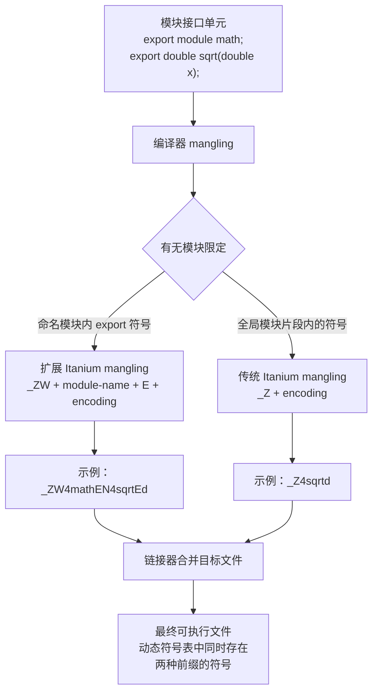
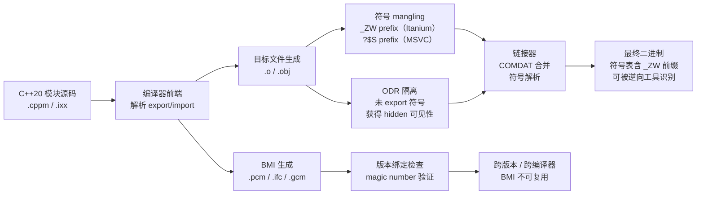

---
tags:
  - ABI
  - 运行时
  - tier3
  - C++20
  - modules
---
# C++20 模块对 ABI 的影响

> [!abstract] TL;DR
> C++20 模块（Modules）重构了 C++ 的编译单元边界与名字导出机制，并在 ABI 层面引发了一系列深层变化：编译器需要生成 BMI/CMI（Binary/Compiled Module Interface）来描述导出符号；Itanium ABI mangling 方案新增模块名限定符（`_ZW` 前缀）；ODR（One Definition Rule）在模块边界获得更精确的语义；Clang（`.pcm`）、MSVC（`.ifc`）、GCC（`.gcm`）三家 BMI 格式完全不兼容；逆向 C++20 模块产物时，mangling 特征和符号可见性规则均有显著变化。本章从编译模型出发，逐层剖析这些 ABI 影响。

## 概述与定位

### 为什么 Modules 与 ABI 深度相关

传统 C++ 基于头文件的编译模型中，ABI 契约完全由目标文件的符号表、mangling 规则和对象布局决定，头文件本身只是文本包含，不构成 ABI 实体。C++20 模块打破了这一模型：

1. **编译单元边界改变**：模块接口单元（Module Interface Unit）不仅产生目标文件，还额外生成 BMI（Binary Module Interface），后者成为 `import` 语句的直接输入，替代了 `#include` 的文本展开。
2. **名字导出语义明确化**：`export` 关键字精确控制哪些声明对外可见，未 `export` 的内部名字即便在头文件中出现也不构成模块的 ABI 接口。
3. **Mangling 方案扩展**：为区分同名的模块内符号与全局命名空间符号，Itanium ABI 和 MSVC ABI 分别引入了带模块名的 mangling 前缀。
4. **ODR 语义收紧**：模块内的实体定义在 ODR 判断上受模块隶属关系约束，改变了链接器的合并策略。

本章面向两类读者：一是需要理解 C++20 模块工程实践的开发者；二是需要逆向分析模块编译产物的安全研究员。

### 与传统头文件模型的根本差异

```
传统模型：
  foo.h（文本）→ #include → 预处理展开 → 编译 → foo.o（符号表）

模块模型：
  foo.cppm（模块接口）→ 编译 → foo.o + foo.pcm（BMI）
  bar.cpp（导入方）→ import foo → 读取 foo.pcm → 编译 → bar.o
```

BMI 不是 ELF/PE 目标文件，而是编译器私有的序列化格式，存储了 AST 子集、类型信息、内联函数体等。这意味着 `import foo` 实际上是在读取编译器的内部数据结构，而非展开文本——这一本质差异决定了 BMI 天然与编译器版本绑定。

## 原理与机制

### 模块编译模型：四类编译单元

C++20 标准将模块相关的源文件划分为四类：

| 编译单元类型 | 语法特征 | 产物 |
|---|---|---|
| 模块接口单元（Module Interface Unit） | `export module foo;` | `.o` + BMI |
| 模块实现单元（Module Implementation Unit） | `module foo;`（无 `export`） | `.o` |
| 模块分区接口单元（Partition Interface） | `export module foo:bar;` | `.o` + 分区 BMI |
| 全局模块片段（Global Module Fragment） | `module;` 开头 + `#include` | 无独立产物，合入主接口 |

以 Clang 为例，完整构建流程如下：

```bash
# 第一步：编译模块接口单元，生成 BMI（.pcm）和目标文件
clang++ -std=c++20 --precompile -o math.pcm math.cppm
clang++ -std=c++20 -fmodule-file=math.pcm -c -o math.o math.cppm

# 第二步：编译实现单元
clang++ -std=c++20 -fmodule-file=math=math.pcm -c -o math_impl.o math_impl.cpp

# 第三步：编译使用方
clang++ -std=c++20 -fmodule-file=math=math.pcm -c -o main.o main.cpp

# 链接
clang++ -o app main.o math.o math_impl.o
```

关键点：**BMI（`math.pcm`）只在编译阶段使用，不参与链接**。链接器看到的仍然是普通目标文件，与传统模型无差异。模块对链接的影响完全体现在符号表内容和 mangling 上，而非链接器协议。

### BMI/CMI 的本质：序列化 AST 的编译器私有格式

BMI（Binary Module Interface，Clang 术语）、CMI（Compiled Module Interface，GCC 术语）、IFC（Interface File Container，MSVC 术语）本质上都是编译器内部 AST 的序列化快照，包含：

- 所有 `export` 声明的完整类型信息（不仅是声明，还包含 inline 函数体、constexpr 求值所需信息）
- 模块分区的拓扑结构
- 宏定义（若通过 header unit 导入）
- 模板实例化的预计算结果

**三家格式对比**：

| 特性 | Clang `.pcm` | MSVC `.ifc` | GCC `.gcm` |
|---|---|---|---|
| 文件扩展名 | `.pcm` | `.ifc` | `.gcm` |
| 格式基础 | LLVM bitcode 衍生 | 专有二进制（基于 MS IFC 规范） | 专有二进制 |
| 可读性 | `clang-query` 可检视 | 官方提供 `ifc-reader` | 无官方工具 |
| 版本绑定 | 强（magic number 含编译器版本） | 强（主版本号嵌入） | 强 |
| 跨编译器兼容 | 不兼容 | 不兼容 | 不兼容 |
| 包含宏 | 仅 header unit 模式 | 仅 header unit 模式 | 仅 header unit 模式 |

这三种格式的**互不兼容**是 C++20 模块当前最重大的 ABI 限制：一个用 Clang 编译的 `.pcm` 无法被 GCC 或 MSVC 直接消费。这意味着在混合编译器环境（如 Windows 上 MSVC 主体 + Clang 插件）中，模块边界必须退回到传统 `extern "C"` 或共享头文件的方式。

### 符号可见性与 reachability：比 export 更精细的控制

C++20 模块引入了两个不同的访问层次，这两个层次直接影响哪些符号进入目标文件的符号表：

**可见性（Visibility）**：只有通过 `export` 导出的名字在模块外部可以被名字查找找到。

**可达性（Reachability）**：未 `export` 但从 `export` 实体可传递到达的实体，在模块外部仍然语义上可用（例如 export 函数的返回类型即便未 export 也是可达的），但不能直接命名。

```cpp
// math.cppm
export module math;

// 未 export 的内部类型——不可见但可达（若作为 export 函数的返回值出现）
struct InternalVector { double x, y, z; };

// export 的函数——可见且产生外部符号
export InternalVector computeResult(double a, double b);

// 完全内部的帮助函数——不可见、不可达、不产生导出符号
static double helper(double x) { return x * 2.0; }
```

在目标文件层面，`computeResult` 会产生外部可见符号（ELF `STB_GLOBAL`/`STV_DEFAULT`），而 `helper` 即便没有 `static` 修饰（模块内部链接已由模块语义保证），也不会产生外部符号。

### `export`/`import`/`module` 三个关键字的 ABI 语义

**`module`**：声明当前编译单元属于某个命名模块（或匿名模块）。

```cpp
export module math;        // 模块接口单元，模块名 = math
module math;               // 模块实现单元
module math:detail;        // 模块分区实现单元
module;                    // 全局模块片段开始（后面可以 #include 旧头文件）
```

**`export`**：标记名字为模块外部接口的一部分，影响 ABI 可见性。

```cpp
export class Matrix { ... };           // 类整体导出
export { void foo(); void bar(); }     // 批量导出
export template<typename T> T add(T a, T b) { return a + b; }  // 模板导出
```

**`import`**：读取指定模块或头文件单元的 BMI，使其导出名字进入当前作用域。

```cpp
import math;               // 导入命名模块
import <cstdio>;           // 导入标准头文件单元（header unit）
import "mylib.h";          // 导入用户头文件单元
```

注意：`import <cstdio>` 与 `#include <cstdio>` 在 ABI 上等价，区别在于编译速度——头文件单元会被编译成 BMI 缓存，后续 import 直接读取 BMI 而无需重新展开头文件。

### 全局模块片段（Global Module Fragment）的特殊地位

全局模块片段（`module;` ... `export module foo;` 之间的部分）允许在模块接口中包含传统头文件：

```cpp
module;                    // 全局模块片段开始
#include <cstring>         // 传统头文件，宏和声明进入全局模块片段
#include <sys/types.h>     // POSIX 头文件

export module mymod;       // 模块声明，全局模块片段结束

// 此后的代码属于命名模块 mymod
export void processString(const char* s);
```

全局模块片段中 `#include` 引入的名字属于**全局模块**（Global Module），不属于 `mymod`，因此不会获得模块名 mangling 前缀。这是保持与传统代码 ABI 兼容的重要机制。

## 结构/算法/伪代码详解

### Itanium ABI 的模块名 Mangling 扩展

Itanium ABI（被 GCC 和 Clang 用于 Linux/macOS）在 C++20 模块引入后扩展了 mangling 方案，核心变化是引入了**模块名限定符**。

#### 基础 Mangling 结构

传统 Itanium mangling 结构：
```
_Z <encoding>
```

模块扩展后：
```
_ZW <module-name-encoding> E <encoding>
```

其中 `W` 是新增的模块名引导符，`E` 是终止符，`module-name-encoding` 对模块名进行编码。

#### 模块名编码规则

模块名编码遵循与命名空间类似的长度前缀格式：

```
模块名 "math"           → W4mathE
模块名 "com.example"    → W3com7exampleE（按 . 分割，分别编码每个组件）
分区 "math:detail"      → W4math6detailE（分区名紧接在主模块名后）
```

实际上，点号（`.`）分隔的模块名组件按顺序拼接，每个组件前加长度。分区名（`:` 后的部分）同样按此规则追加。

#### 具体示例

```cpp
// 模块 math 中的函数
export module math;
export double sqrt(double x);
```

传统（无模块）mangling：`_ZN4math4sqrtEd`（假设在命名空间 `math` 中）

模块 mangling：`_ZW4mathEN4sqrtEd`

注意区别：传统命名空间限定用 `N...E`，模块限定用 `W...E`，两者的区别在逆向时非常重要——看到 `_ZW` 前缀即可确认这是 C++20 模块编译产物。



#### 模块分区的 Mangling

分区（Partition）是模块的子单元，用于将大型模块拆分为多个文件：

```cpp
// math-core.cppm
export module math:core;   // 模块 math 的分区 core
export double cos(double x);
export double sin(double x);

// math.cppm
export module math;
export import :core;       // 重导出 core 分区
```

`math:core` 中的 `cos` 函数 mangling 为 `_ZW4math4coreEN3cosEd`。分区名在最终二进制中体现在 mangling 里，但分区的 `export import :core` 重导出后，从消费方视角看到的仍然是不带分区名的 `_ZW4mathEN3cosEd`（因为 export import 将分区符号重新以主模块名导出）。

### MSVC ABI 的模块 Mangling

MSVC 使用自己的名字修饰方案（Windows decorated names），也为 C++20 模块引入了扩展。MSVC 在模块名前添加 `?$S` 前缀标记：

```
传统：?foo@@YANXZ           （void foo() 的 MSVC mangling）
模块：?foo@?$Smath@@YANXZ   （模块 math 内的 foo）
```

其中 `?$S` 是模块作用域的分隔符，模块名 `math` 跟在后面。MSVC 的 `.ifc` 文件中存储了完整的 decorated name，链接器通过这些 decorated name 进行符号解析。

### ODR 在模块下的语义变化

传统 C++ 的 ODR（One Definition Rule）要求：同一个实体在整个程序中只能有一个定义，否则行为未定义（即便多个翻译单元各自包含了头文件导致同一个类被重复定义，只要定义相同就是合法的——这是 ODR 的"相同定义豁免"）。

模块改变了 ODR 的语义边界：

**规则1：模块内实体的 ODR 归属**
```cpp
// traditional.h（传统）
inline int compute(int x) { return x * 2; }  // 允许多个 TU 包含同一定义

// math.cppm（模块）
export module math;
export inline int compute(int x) { return x * 2; }  // 定义归属于模块 math
```

在模块模型中，`compute` 的定义明确归属于模块 `math`，其他模块无法再提供另一个同名同签名的 `compute` 并声称属于不同实体——这消除了传统 ODR 的模糊地带。

**规则2：未导出定义的 ODR 隔离**
```cpp
// mod_a.cppm
export module mod_a;
// 未 export 的内部类
class InternalHelper { int state; };  // 定义隔离在 mod_a 内部
export void func_a();

// mod_b.cppm
export module mod_b;
// 同名但完全独立的类
class InternalHelper { double value; };  // 与 mod_a::InternalHelper 无关
export void func_b();
```

两个模块内的 `InternalHelper` 不构成 ODR 违反，因为它们分属不同模块的内部名字空间，链接器不会尝试合并它们。这在传统模型中（如果两个头文件各自定义了同名类）是典型的 ODR 陷阱。

**规则3：模板实例化的 ODR 与模块边界**

```cpp
// util.cppm
export module util;
export template<typename T>
void print(T val) {
    // 模板定义在模块 util 内
}

// user1.cpp
import util;
void test1() { print(42); }    // 实例化 print<int>

// user2.cpp
import util;
void test2() { print(3.14); }  // 实例化 print<double>
```

模板实例化（`print<int>`、`print<double>`）的 ODR 判断：在模块模型下，链接器通过 COMDAT 折叠（相同 mangled name 的 COMDAT 节只保留一份）处理多个翻译单元中的重复实例化，这一机制与传统模型相同，但 mangling 本身包含了模块名，从而避免跨模块同名模板实例的错误合并。

### 头文件单元（Header Unit）：传统头文件的模块化包装

头文件单元（Header Unit）是 C++20 提供的过渡机制，允许将传统头文件以类模块的方式导入：

```cpp
import <vector>;           // 将 <vector> 作为头文件单元导入
import "mylib.h";          // 将 mylib.h 作为头文件单元导入
```

从 ABI 角度，头文件单元的关键特性：

1. **宏定义保留**：与命名模块不同，头文件单元会导出其中的宏（这是头文件单元区别于命名模块的最大特征）。
2. **符号 mangling 不变**：头文件单元中声明的函数不获得模块名 mangling 前缀，其 mangling 与传统 `#include` 后的结果完全相同。这是故意设计的——头文件单元的目的是加速编译，而非改变 ABI。
3. **BMI 格式相同**：编译器同样为头文件单元生成 BMI 文件，但内容包含宏信息。

```
头文件单元处理流程：
  <vector> 头文件 → 编译为 vector.pcm（包含宏 + 声明）
  import <vector>  → 读取 vector.pcm → 名字进入当前 TU（含宏）
  符号 std::vector 的 mangling：与传统 #include 完全一致（无 _ZW 前缀）
```

### inline 函数与模板在模块下的 ABI 处理

**inline 函数**：模块接口中的 `export inline` 函数，其函数体存储在 BMI 中，消费方编译时可以直接内联，无需通过符号表调用。但编译器同时会在接口单元的目标文件中生成一个带外部链接的定义（作为不支持内联时的回退），这个定义使用带模块名的 mangling。

**模板显式实例化**：

```cpp
// math.cppm
export module math;

export template<typename T>
T clamp(T val, T lo, T hi) {
    return val < lo ? lo : (val > hi ? hi : val);
}

// 显式实例化声明（告知链接器此实例化在别处定义）
extern template float clamp<float>(float, float, float);
```

显式实例化在模块模型下的 mangling：`_ZW4mathEN5clampIfEET_S0_S0_S0_`

这个 mangling 在不同的翻译单元间是稳定的，链接器可以正确合并。

## 工具视角与实战

### 识别模块编译产物：逆向工程视角

在实际逆向分析中，判断一个二进制是否使用了 C++20 模块编译，可以从以下几个维度入手：

#### 1. 符号表特征

使用 `nm` 或 `readelf -s` 检查符号表：

```bash
# Linux/macOS
nm -D ./libmath.so | grep "_ZW"

# 典型输出（存在 _ZW 前缀符号即为模块编译产物）
0000000000001234 T _ZW4mathEN4sqrtEd
0000000000001290 T _ZW4mathEN3cosEd
```

若看到大量 `_ZW` 前缀符号，可以确认使用了 C++20 命名模块。若仅有传统 `_Z` 前缀符号，则可能使用了头文件单元（或纯传统模式）。

#### 2. 目标文件节（Section）特征

Clang 生成的对象文件中可能包含 `.llvm_bc` 节（用于 LTO 的 LLVM bitcode），这与模块无直接关联，但模块编译时若同时开启 LTO，两者并存。GCC 的模块编译产物中可能在 `.gnu.linkonce` 节存储特定模板实例化。

#### 3. MSVC 产物识别

在 Windows 上，通过 `dumpbin /symbols` 检查：

```
?foo@?$Smath@@YANXZ   → 存在 ?$S 前缀，确认为 C++20 模块导出符号
```

MSVC 还在 `.obj` 文件中嵌入模块依赖信息，可用 `dumpbin /headers` 查看 `.msvcjmc` 节。

#### 4. BMI 文件检视

如果能获取到 BMI 文件：

```bash
# Clang：使用 clang-query 或直接读取 LLVM bitcode
llvm-dis math.pcm -o math.ll   # 不一定成功，格式有差异
clang-scan-deps -format=p1689 ...  # 获取模块依赖图

# MSVC：使用官方 ifc-reader 工具（VS 2022 附带）
ifc-reader math.ifc

# GCC：目前没有官方检视工具，需要用十六进制查看器手动分析
```

### 编译器版本绑定与 ABI 稳定性

BMI 与编译器版本的强绑定是 C++20 模块最重要的工程约束：

**Clang 的版本绑定机制**：`.pcm` 文件头部包含一个 magic number，格式为：

```
CPCH<major>.<minor>
```

其中 `major` 和 `minor` 是 Clang 版本号。尝试用 Clang 17 读取 Clang 16 生成的 `.pcm` 会立即报错：

```
error: PCH was compiled with a different version of compiler
```

**MSVC 的版本绑定**：`.ifc` 文件头部存储编译器版本，主版本号不同的 MSVC 生成的 `.ifc` 不能互用。

**GCC 的版本绑定**：`.gcm` 文件格式变化频繁，即使是次版本更新（如 GCC 13.1 → 13.2）也可能导致 `.gcm` 不兼容。

**工程实践建议**：
- 在 CMake 中，不要跨子项目共享预编译的 BMI，每次构建应重新生成。
- CI/CD 系统中，BMI 的缓存策略必须以编译器完整版本字符串为键。
- 分布式编译（distcc/icecc）需要特殊配置以支持模块：每个编译节点必须与驱动节点使用完全相同版本的编译器。

### CMake 与构建系统的模块支持

CMake 3.28 正式支持 C++20 模块（通过 `cmake_minimum_required(VERSION 3.28)` 和 `target_sources(... FILE_SET CXX_MODULES ...)`）：

```cmake
cmake_minimum_required(VERSION 3.28)
project(MathLib CXX)

set(CMAKE_CXX_STANDARD 20)

add_library(math)
target_sources(math
    PUBLIC
        FILE_SET CXX_MODULES FILES
            src/math.cppm           # 模块接口单元
            src/math_core.cppm      # 模块分区接口单元
    PRIVATE
        src/math_impl.cpp           # 模块实现单元
)
```

CMake 通过依赖扫描（`cmake -E cmake_depends`）自动确定模块间的编译顺序，确保 BMI 在被消费前已经生成。这一机制依赖编译器提供 `-MF`（依赖文件）或 P1689 格式的依赖输出。

### 使用 `c++filt` 解析模块 mangling

```bash
# 解析带模块名的 mangled symbol
echo "_ZW4mathEN4sqrtEd" | c++filt
# 输出：math::sqrt(double)   （注意：输出形式与命名空间 math 下的 sqrt 相同）

# 解析分区符号
echo "_ZW4math4coreEN3cosEd" | c++filt
# 输出：math:core::cos(double)   （使用 :: 表示分区分隔）
```

注意 `c++filt` 可能将模块名显示为伪命名空间形式，这与真正的命名空间在逆向工具（如 IDA Pro、Ghidra）中可能显示相同，需要结合符号前缀（`_ZW` vs `_ZN`）加以区分。

### IDA Pro / Ghidra 中处理模块符号

IDA Pro 7.7+ 和 Ghidra 10.3+ 对 Itanium mangling 的 `_ZW` 扩展有基础支持，但在显示上可能将模块名和命名空间混淆。

实用技巧：
1. 在 IDA 中搜索 `_ZW` 前缀符号，可以快速定位所有模块导出的函数。
2. 通过模块名结构（如 `_ZW7network5https...`）可以推断原始模块层次结构。
3. 注意 inline 函数的多重定义：同一个 `_ZW...` mangled name 可能在多个目标文件中出现（COMDAT），IDA 中应检查所有出现位置。

## 安全性与正确使用

### BMI 不可移植性的工程陷阱

BMI 与编译器版本强绑定这一特性，在以下场景中会引发实际问题：

**场景1：预构建库分发**

如果你的库以模块形式提供（分发 `.cppm` 源码 + 预构建 `.pcm`），消费者必须使用完全相同版本的编译器才能复用你的 BMI。更实际的做法是：
- 仍然分发 `.cppm` 源码，让消费者自行编译生成 BMI。
- 或者同时提供传统头文件作为回退（使用 `#ifdef __cpp_modules` 条件编译）。

```cpp
// mylib.h（传统头文件，作为回退）
#pragma once
namespace mylib {
    double compute(double x);
}

// mylib.cppm（模块接口，现代 C++20 用法）
module;
#include "mylib_impl_detail.h"  // 全局模块片段引入内部实现细节

export module mylib;
export namespace mylib {
    double compute(double x);
}
```

**场景2：跨编译器的模块边界**

在同一个项目中混用 GCC 和 Clang（如某些嵌入式工具链）时，两个编译器生成的模块**完全无法互相消费**。此时只能通过 `extern "C"` 接口或传统头文件在编译器边界处建立 ABI 契约，模块只能在各自编译器的内部使用。

**场景3：头文件单元的宏泄漏**

```cpp
// 传统
#include <cassert>   // assert 宏进入当前 TU
// 模块
import <cassert>;    // assert 宏也进入当前 TU（头文件单元保留宏）

// 但命名模块不导出宏！
// 如果 assert 在命名模块中定义后未 export（宏不能 export），消费方看不到它
```

这意味着：将 `#include <cassert>` 改为 `import <cassert>` 是安全的（行为等价），但将 `#include` 改为自定义命名模块时必须检查宏依赖。

### 链接器兼容性与静态库打包

静态库（`.a`/`.lib`）中包含模块编译的目标文件时，有以下注意事项：

1. **静态库不包含 BMI**：`.a` 文件只是 `.o` 的归档，不包含 `.pcm`。消费静态库的项目仍然需要单独获取 `.pcm` 才能使用 `import`。
2. **符号可见性**：模块内未导出的符号在编译时获得 `STV_HIDDEN`（ELF）或对应的 MSVC 属性，链接时不参与外部解析，静态库的这些符号不会"泄漏"到消费方。
3. **COMDAT 合并**：模块 inline 函数和模板实例化的 COMDAT 处理与传统模型相同，链接器会保留一份丢弃其余副本。

### 调试信息与模块

使用 DWARF（Linux/macOS）或 PDB（Windows）调试带模块的程序时：

- DWARF 中的 `DW_AT_module` 属性（DWARF 5 新增）记录了代码所属的模块，GDB 11+ 可以利用这一信息在调试时正确显示模块限定名。
- LLDB 对 Clang 模块有原生支持，能够在断点和变量检视时正确处理模块作用域。
- MSVC PDB 格式也扩展了对模块的支持，VS 2022 调试器可以正确显示模块名限定符。

### 模板与显式实例化声明的工程规范

在模块环境中，大量使用模板时建议显式控制实例化，以避免多个翻译单元重复实例化同一模板带来的目标文件膨胀：

```cpp
// math.cppm
export module math;

export template<typename T>
T clamp(T val, T lo, T hi) { ... }

// 在模块接口中声明常用实例化，由实现文件提供定义
extern template float  clamp<float> (float,  float,  float);
extern template double clamp<double>(double, double, double);
extern template int    clamp<int>   (int,    int,    int);

// math_instances.cpp（模块实现单元）
module math;
template float  clamp<float> (float,  float,  float);
template double clamp<double>(double, double, double);
template int    clamp<int>   (int,    int,    int);
```

这样消费方在 `import math` 后使用 `clamp<float>` 时，不会在自己的目标文件中生成实例化定义，而是引用模块提供的显式实例化——减小了目标文件大小，也使 ABI 边界更清晰。

### 跨版本兼容性策略

实际工程中，如果你的库需要同时支持 C++17 和 C++20 模块用户，推荐的策略是双模式头文件：

```cpp
// mylib_module.cppm
module;
#include "mylib_compat.h"   // 全局模块片段：引入所有不需要模块化的内容

export module mylib;

// 重新导出 mylib_compat.h 中的公共接口
export {
    using ::MyLibClass;
    using ::mylib_compute;
}

// mylib_compat.h（同时可被传统 #include 使用）
#pragma once
class MyLibClass { ... };
double mylib_compute(double x);
```

这种双模式设计让 C++17 用户通过 `#include "mylib_compat.h"` 获取接口，C++20 用户通过 `import mylib` 获取相同接口，ABI 层面两者完全一致（没有 `_ZW` 前缀，因为接口定义在全局模块片段）。

## 小结

C++20 模块对 ABI 的影响可以从以下几个维度归纳：

**Mangling 变化**：命名模块内 `export` 的符号获得 `_ZW<module-name>E` 前缀（Itanium ABI）或 `?$S<module-name>` 前缀（MSVC ABI），在逆向工具中可据此快速识别模块编译产物。头文件单元和全局模块片段中的符号 mangling 不变，保持 ABI 向后兼容。

**BMI 格式不兼容**：Clang `.pcm`、MSVC `.ifc`、GCC `.gcm` 三种格式互不兼容，且与编译器版本强绑定，这是 C++20 模块当前最大的工程限制。预构建 BMI 不可分发，分布式构建和缓存需要以编译器完整版本为键。

**ODR 语义精化**：模块为 ODR 判断引入了模块隶属维度，模块内未导出实体之间的同名冲突不再违反 ODR，改善了大型项目中的名字隔离性。

**符号可见性**：未导出符号在目标文件层面获得 hidden 可见性，有效减少了符号表污染，但也意味着模块内部实现的逆向分析需要额外的符号恢复手段（如 debug info 或 sanitizer 符号）。

**链接器透明**：模块对链接器完全透明——BMI 只在编译阶段使用，链接阶段看到的仍然是普通目标文件和符号表，无需链接器作任何修改。

**逆向实践**：识别 `_ZW` 前缀是判断 C++20 模块产物的首要特征；模块分区名会出现在 mangling 中但经 `export import` 重导出后在消费方看到的是主模块名；`c++filt` 和现代逆向工具（IDA 7.7+、Ghidra 10.3+）对 `_ZW` 有基础解析支持。



## 相关阅读

- [P1689R5 - Format for describing dependencies of source files](https://www.open-std.org/jtc1/sc22/wg21/docs/papers/2022/p1689r5.html)：CMake 模块依赖扫描格式规范
- [Itanium C++ ABI - Module Name Mangling](https://itanium-cxx-abi.github.io/cxx-abi/abi.html#mangling-module)：Itanium ABI 官方文档中模块 mangling 扩展章节
- [P1787R6 - Declarations and where to find them](https://www.open-std.org/jtc1/sc22/wg21/docs/papers/2020/p1787r6.html)：模块名字查找与可达性规则
- [Microsoft IFC Specification](https://github.com/microsoft/ifc-spec)：MSVC `.ifc` 格式的开源规范文档（Microsoft 官方发布）
- [Clang Modules documentation](https://clang.llvm.org/docs/StandardCPlusPlusModules.html)：Clang 官方 C++20 模块支持文档
- [GCC C++ Modules wiki](https://gcc.gnu.org/wiki/cxx-modules)：GCC 模块实现状态与 `.gcm` 格式说明
- [CppCon 2021 - C++20 Modules: The Packaging Story](https://www.youtube.com/watch?v=3GGhZZ10bUc)：模块打包与 ABI 挑战的会议演讲
- Nathan Sidwell, "C++ Modules - a Brief Tour"：GCC 模块主要作者的技术博客系列，深入讲解 `.gcm` 内部格式
- [P2822 - Providing user-facing parallelism in the C++ standard library](https://www.open-std.org/jtc1/sc22/wg21/docs/papers/2023/p2822r0.html)：相关提案，了解模块在标准库现代化中的角色

[[00.C_C++运行时与ABI总览|⬆ 系列总览]] | [[20.栈保护运行时Canary与CET与SafeStack|← 上一章]] | [[22.Rust与Swift与C++ABI互操作|→ 下一章]]
