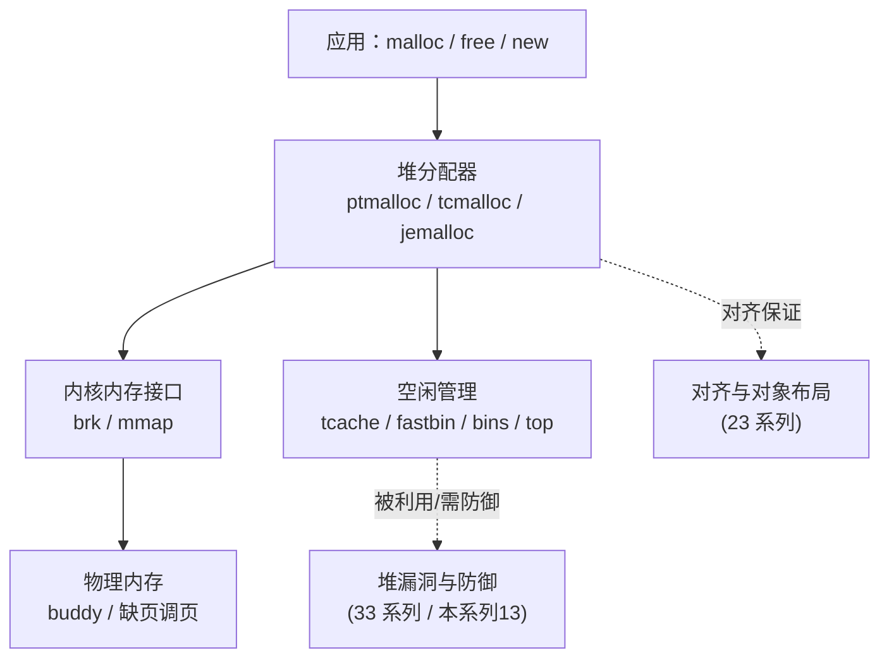

# 内存管理与堆分配器 · 系列总览

> 作者原创系列，共 **13** 篇。系统拆解 **用户态内存管理与堆分配器内部原理**：从 **虚拟内存/进程地址空间**、**`mmap` vs `brk` 内核接口**、**内存对齐**，到 **glibc ptmalloc2**（arena、`malloc_chunk`、bins、tcache、`malloc`/`free` 全流程），再到 **tcmalloc**、**jemalloc**、**内核分配器（buddy/slab）** 与其他分配器对比，最后落到 **内存安全与调试**（ASan/Valgrind/加固分配器，防御视角）。基准平台 **Linux x86-64 + glibc 2.31+（含 tcache）**。堆分配器是"应用与内核之间的内存中间商"——本系列与 [[33.二进制漏洞与利用基础/00.二进制漏洞与利用基础总览|二进制漏洞与利用基础]]（堆利用，互补防御视角）、[[23.C_C++运行时与ABI/00.C_C++运行时与ABI总览|C/C++运行时与ABI]]（对齐与对象布局）、[[14.动态链接与加载器详解/00.动态链接与加载器总览|动态链接与加载器]]（地址空间映射）、[[34.现代二进制防护机制/00.现代二进制防护机制总览|现代二进制防护机制]]（加固分配器）深度互补。

## 一、虚拟内存与内核接口

| # | 章节 | 说明 |
| --- | --- | --- |
| 01 | [[01.内存管理概览]] | 分配器要解决什么、应用→libc→内核分层、本系列地图 |
| 02 | [[02.进程地址空间与虚拟内存]] | 地址空间分区、VMA、页与缺页、`/proc/<pid>/maps` |
| 03 | [[03.mmap与brk内核内存接口]] | `brk`/`sbrk` 推进堆顶 vs `mmap` 匿名映射、按需调页 |
| 04 | [[04.内存对齐与数据布局]] | 对齐规则、malloc 16B 对齐保证、false sharing、`alignas` |

## 二、glibc ptmalloc2 内部

| # | 章节 | 说明 |
| --- | --- | --- |
| 05 | [[05.ptmalloc2总览与arena]] | `main_arena` vs 线程 arena、`malloc_state`、多线程并发 |
| 06 | [[06.ptmalloc2的chunk结构]] | `malloc_chunk`、size 低 3 位标志、`fd`/`bk`、in-use vs free |
| 07 | [[07.ptmalloc2的bins与空闲管理]] | fastbin/unsorted/smallbin/largebin 的结构与数量 |
| 08 | [[08.tcache机制]] | `tcache_perthread_struct`、64 bin×7、`key`、double-free 检测（防御） |
| 09 | [[09.malloc与free分配释放流程]] | 分配/释放完整决策链、top chunk、合并、mmap 阈值 |

## 三、现代与内核分配器

| # | 章节 | 说明 |
| --- | --- | --- |
| 10 | [[10.tcmalloc原理]] | thread cache + central list + page heap、size class、span |
| 11 | [[11.jemalloc原理]] | 多 arena、extent/run、size class、tcache、抗碎片 |
| 12 | [[12.内核分配器与其他分配器]] | buddy system、slab/slub/slob、mimalloc、分层关系 |

## 四、内存安全

| # | 章节 | 说明 |
| --- | --- | --- |
| 13 | [[13.内存安全与调试]] | UAF/double-free/溢出成因、ASan/Valgrind、safe-linking/加固分配器（防御） |

## 内存管理的三层视角

> 一句话：堆分配器是应用与内核之间的"内存中间商"——它向内核批发大块内存（`brk`/`mmap`），再零售给应用（`malloc`），并把释放的块按大小分门别类缓存进 bins/tcache 以便复用。读懂 `malloc_chunk` 的字节布局、bins 的组织、`malloc`/`free` 的决策链，你既能解释程序的内存行为与性能，也能理解堆漏洞为何发生、加固分配器如何防御。本系列与 33 系列互为表里：那边讲"怎么被利用"，这边讲"内部如何运作、如何防御"。
