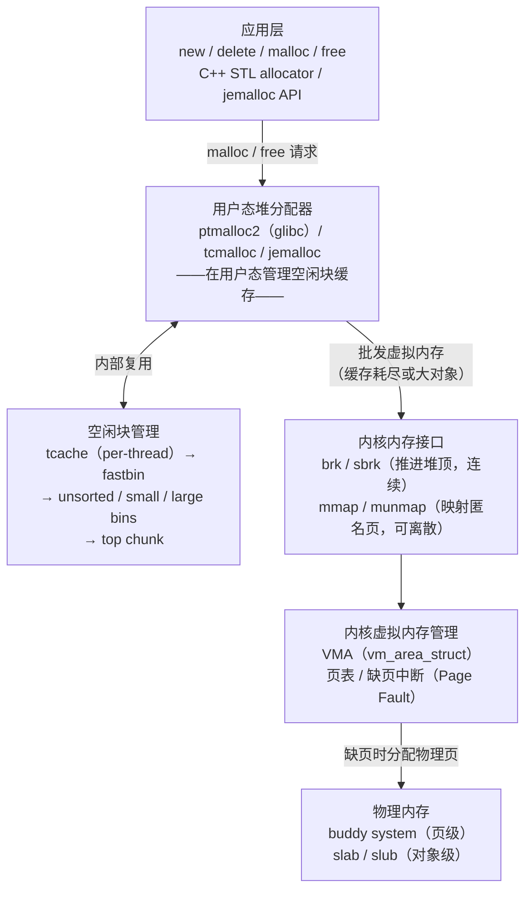

# 内存与堆（01）· 内存管理概览

## 概述与定位

> [!abstract] TL;DR
> `malloc` 不是"向内核申请内存"——它是用户态堆分配器在已有的虚拟内存区域上切割、缓存、复用空闲块的过程。理解这一层，才能解释"为什么 `free` 不会立刻还给内核"、"为什么多线程程序会因分配器锁产生竞争"、"为什么堆漏洞能劫持控制流"。本章是全系列的入口：讲清分配器要解决什么问题、应用→libc→内核→物理内存的三层分层、分配器发展简史，并给出本系列 13 篇的导览地图。

程序每次调用 `malloc(n)` 时，背后发生了什么？表面上看只是"申请了 n 字节"，但实际路径远比这复杂：

1. **大多数时候内核根本没被叫到**：用户态分配器维护着一批按大小分类的空闲块缓存（bins / tcache），命中缓存则直接返回，零系统调用。
2. **缓存不够时才向内核批发**：通过 `brk` 推进堆顶，或 `mmap` 映射新的匿名页——拿到大块虚拟内存后再自行切割分发。
3. **物理内存按需到达**：内核只建立虚拟-物理映射条目（页表），物理页在首次读写时才由缺页中断从 buddy 分配器取来。

这种分层设计是理解内存性能（碎片、局部性、锁竞争）与内存安全（UAF、double-free、堆溢出）的根基。

---

## 原理与机制

### 三层分层模型

下图描述了从应用代码到物理内存的完整路径，以及各层的职责边界：



各层职责对比：

| 层次 | 代表实现 | 职责 | 可见性 |
|---|---|---|---|
| 应用层 | 用户代码 / C++ `new` | 发起分配请求 | 应用开发者 |
| 用户态分配器 | ptmalloc2 / tcmalloc / jemalloc | 缓存与切割空闲块，批发虚拟内存 | 可替换（`LD_PRELOAD`） |
| 内核接口 | `brk` / `mmap` | 分配虚拟地址范围 | 系统调用边界 |
| 内核 VM | `mm_struct` / VMA | 建立页表，处理缺页 | 内核态 |
| 物理分配器 | buddy / slab | 分配物理页帧 | 内核态 |

> [!note] 为什么分层？
> 系统调用开销（`brk`/`mmap`）远高于用户态操作（纳秒级 vs 微秒级）。分配器在用户态维护空闲块缓存，批量向内核要内存、零售给应用，极大减少了系统调用次数。这一思路与 CPU L1/L2 缓存对主存的批量预取如出一辙。

### 虚拟内存与物理内存的解耦

`mmap(MAP_ANONYMOUS)` 或 `brk` 返回后，对应的虚拟地址范围已在内核的 VMA 链表中登记，但**尚无物理页**。首次写入该地址时，CPU 触发缺页中断，内核调用 buddy 分配器拿到一个物理页，建立页表映射，再重新执行写指令——这一切对应用透明。

这意味着：
- `malloc(1 * 1024 * 1024)` 成功返回，但如果你从不写入，不会消耗任何物理内存。
- `free` 把块还给分配器缓存，操作系统看到的 RSS（常驻内存）可能根本不变。

---

## 分配器设计目标详解

堆分配器需要同时优化三个相互制约的目标：

### 1. 速度：减少系统调用，提升缓存局部性

**少系统调用**的策略：
- 向内核批发大块内存，分配器内部切割，避免每次 `malloc` 都陷入内核。
- 释放时不立刻归还内核，而是放入 bins/tcache，等下次同尺寸请求到来直接命中。

**缓存局部性**的策略：
- 按大小分类缓存（size class），同类对象连续分配，减少 CPU cache miss。
- tcache 是 per-thread 的，热路径完全无锁（单线程访问自己的 tcache）。

### 2. 低碎片：内部碎片与外部碎片

| 碎片类型 | 定义 | 分配器应对策略 |
|---|---|---|
| **内部碎片** | 分配块大于实际请求，多余部分无法被其他请求使用 | 精细的 size class 分级（如 16/24/32/48 字节档），减少对齐浪费 |
| **外部碎片** | 空闲块分散，总空闲量够但没有连续块满足大请求 | 合并相邻空闲块（consolidation）；largebin 内按大小有序，首次适配找最优块 |

ptmalloc2 在 `free` 时会检查前后相邻 chunk 的 `PREV_INUSE` 标志，将连续空闲块合并（coalesce）后放入 unsorted bin，再在下次分配整理时归入 smallbin/largebin。

### 3. 多线程可扩展：per-thread cache 与多 arena

多线程下，若所有线程共享一把全局分配器锁，竞争会成为瓶颈。现代分配器的解法：

- **tcache（glibc ≥ 2.26）**：每线程独立的小对象缓存，`malloc`/`free` 优先走 tcache，完全无锁。
- **多 arena（ptmalloc2）**：当线程争用 `main_arena` 锁时，创建新的线程 arena（通过 `mmap` 独立映射），上限约 `8 × CPU 核数`（64 位）。各 arena 独立锁，竞争分散。
- **tcmalloc**：每线程独立的 thread-local cache，central free list 加锁但粒度更细；适合高并发短命对象场景。
- **jemalloc**：多 arena + per-thread tcache，arena 数可与核数对齐，arena 间几乎无共享状态。

### 简史：从 dlmalloc 到现代分配器

| 时期 | 分配器 | 关键贡献 |
|---|---|---|
| 1987 | **dlmalloc**（Doug Lea Malloc） | 奠定 bin-based 分配思想：按大小分类空闲块、边界标签（boundary tag）实现 O(1) 合并 |
| ~2001 | **ptmalloc**（Wolfram Gloger） | 在 dlmalloc 基础上引入多 arena，使 glibc 能支持多线程；`ptmalloc2` 被 glibc 采用，即今天的 `malloc` |
| 2005 | **tcmalloc**（Google） | thread-local cache + central free list + page heap；极大降低多线程分配延迟；用于 Chrome/Go 运行时 |
| 2005 | **jemalloc**（Jason Evans，FreeBSD） | 多 arena + extent/run + size class；强调低碎片、可预测延迟；被 Firefox / Redis / Facebook 广泛采用 |
| 2019+ | **mimalloc**（Microsoft） | 极简设计、高吞吐；free list sharding 减少锁粒度；已在 Windows / .NET 生态中使用 |

> [!note] glibc 中的 ptmalloc2
> 你在 Linux 上调用的 `malloc` 默认就是 ptmalloc2。它的源码在 glibc 的 `malloc/malloc.c`，本系列 05～09 章深入其数据结构与算法。

---

## 实战视角

### 观察程序的内存：`/proc/<pid>/maps`

```bash
# 运行一个简单程序后，另一终端查看其内存映射
cat /proc/$(pidof your_prog)/maps
```

```text
# 示例输出（代表性，非本机实跑）
55a3b2000000-55a3b2001000 r--p 00000000 08:01 131072  /usr/bin/cat   # text
55a3b2001000-55a3b2004000 r-xp 00001000 08:01 131072  /usr/bin/cat   # text（可执行）
55a3b2202000-55a3b2223000 rw-p 00000000 00:00 0       [heap]         # brk 堆
7f8a3c000000-7f8a3c021000 rw-p 00000000 00:00 0                       # mmap 匿名（arena）
7ffc12345000-7ffc12367000 rw-p 00000000 00:00 0       [stack]        # 栈
```

> [!warning] 示例输出为示意
> 实际地址因 ASLR 每次运行不同；`[heap]` 段是 `brk` 管理的主 arena 区域；大 chunk（≥ 128KB 默认阈值）和线程 arena 的块会以独立的匿名 `mmap` 段出现，没有 `[heap]` 标签。

关键字段解读：

| 列 | 含义 |
|---|---|
| `55a3b2202000-55a3b2223000` | VMA 的虚拟地址范围 |
| `rw-p` | 权限（r=读，w=写，x=执行，p=私有） |
| `[heap]` | 内核标注的 brk 堆区 |

深入解析见 [[02.进程地址空间与虚拟内存]]。

### 用 `ltrace` 追踪分配行为

```bash
ltrace -e malloc+free+mmap ./your_prog 2>&1 | head -30
```

```text
# 示例输出（代表性，非本机实跑）
malloc(24)                         = 0x55a3b2202260
malloc(4096)                       = 0x55a3b2202280
free(0x55a3b2202260)               = <void>
mmap(0, 135168, PROT_READ|PROT_WRITE, MAP_ANON|MAP_PRIVATE, -1, 0) = 0x7f8a3c000000
```

> [!warning] 示例输出为示意
> `ltrace` 通过 PLT hook 拦截库调用，对性能有影响，仅用于分析；生产环境使用 `perf` 或 `heaptrack`。

可以看到：
- 小请求（24 字节、4096 字节）直接从已有堆段返回——无 `mmap` 系统调用。
- 大请求触发 `mmap`，返回独立的虚拟内存区域。

更多调试工具（`pwndbg heap`、ASan、Valgrind）在 [[13.内存安全与调试]] 详述。

---

## 安全性与正确使用

### 内存管理是安全的核心战场

堆分配器内部的元数据（chunk 头部的 `size` 字段、`fd`/`bk` 指针、tcache 的 `next` 指针）与用户数据共存于同一内存区域。这种设计在性能上高效（无需额外内存区存放元数据），但也意味着：

- **堆溢出**可覆盖相邻 chunk 的 `size` 或 `PREV_INUSE` 标志，干扰合并逻辑。
- **UAF（Use-After-Free）**可读写已进入 tcache/fastbin 的 `fd` 指针，操纵下次 `malloc` 的返回值。
- **double-free** 在早期 glibc 中无检测，直接导致链表破坏；glibc ≥ 2.29 引入 `tcache_entry.key` 检测，glibc ≥ 2.32 引入 safe-linking（指针异或 `ptr ^ (addr >> 12)`）加固 tcache/fastbin 单链表。

### 本系列的防御视角声明

> [!important] 本系列定位
> 本系列从**分配器设计者与内存安全防御者**的视角出发，讲清 UAF / double-free / 堆溢出的**成因与检测原理**，以及 ASan、GWP-ASan、safe-linking、hardened_malloc 等防御机制的实现。与 [[33.二进制漏洞与利用基础/00.二进制漏洞与利用基础总览.md]] 互补：那边讲利用基础，这边讲分配器内部结构与防御。本系列**不提供针对真实第三方系统的武器化利用链**。

### 正确使用分配器的基本原则

| 原则 | 违反后果 | 检测工具 |
|---|---|---|
| 每次 `malloc` 对应一次 `free` | 内存泄漏，RSS 持续增长 | Valgrind `--leak-check=full`、ASan `-fsanitize=address` |
| 不在 `free` 后继续使用指针（UAF） | 读写 tcache `fd` 指针，数据损坏或任意地址写 | ASan、GWP-ASan |
| 不重复 `free` 同一指针（double-free） | 破坏 bin 链表，或触发 tcache `key` 检测崩溃 | ASan、glibc 内置检测（2.29+） |
| 不写超过分配大小的数据（堆溢出） | 覆盖相邻 chunk 元数据 | ASan redzone、Valgrind |

详细防御机制见 [[13.内存安全与调试]]。

---

## 本系列地图

下图将 13 篇文章串联成一条学习路径，括号内为本系列章节编号：


**一句话串联**：进程地址空间决定堆的位置（02）→ `brk`/`mmap` 向内核批发内存（03）→ 对齐规则决定 chunk 粒度（04）→ ptmalloc2 的 arena 组织多线程并发（05）→ `malloc_chunk` 是分配器管理的基本单元（06）→ bins 按大小分类缓存空闲块（07）→ tcache 是优先级最高的 per-thread 快速路径（08）→ `malloc`/`free` 决策链把以上全部串联（09）→ tcmalloc/jemalloc 用不同思路解决同样问题（10-11）→ 内核 buddy/slab 是更底层的分配器（12）→ 理解内部结构后，才能真正理解堆漏洞成因与防御（13）。

---

## 小结

| 要点 | 核心结论 |
|---|---|
| 分配器的本质 | 用户态的"内存中间商"：向内核批发，向应用零售，缓存复用空闲块 |
| 三大设计目标 | 速度（少系统调用）、低碎片（内部/外部）、多线程可扩展（tcache/多 arena） |
| 三层分层 | 应用 → 用户态分配器（bins/tcache） → 内核接口（brk/mmap） → 物理内存（buddy） |
| 简史关键节点 | dlmalloc 奠基 → ptmalloc2（glibc 多线程）→ tcmalloc/jemalloc（现代高并发） |
| 安全关联 | 分配器元数据与用户数据共存 → 堆溢出/UAF/double-free 成因；safe-linking/ASan 防御 |
| 观察工具 | `/proc/<pid>/maps`（地址空间）、`ltrace`（分配追踪）、`pwndbg heap`（调试器视图） |

---

## 相关阅读

- 本系列下一篇：[[02.进程地址空间与虚拟内存]]
- 进程内存映射细节：[[14.动态链接与加载器详解/04.可执行文件的内存映射.md]]
- C/C++ 对象布局与对齐：[[23.C_C++运行时与ABI/00.C_C++运行时与ABI总览.md]]
- 堆漏洞利用基础（互补）：[[33.二进制漏洞与利用基础/00.二进制漏洞与利用基础总览.md]]
- 加固分配器与防护机制：[[34.现代二进制防护机制/00.现代二进制防护机制总览.md]]
- 内核分配器背景：[[15.操作系统加载与启动/00.操作系统加载与启动总览.md]]

---

🏠 [[00.内存管理与堆分配器总览]] ｜ 下一篇 [[02.进程地址空间与虚拟内存]] ➡️
