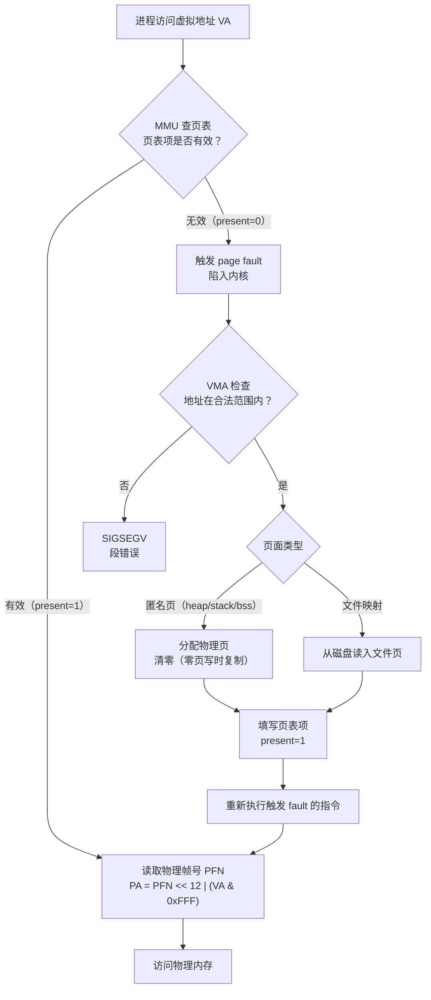

# 内存与堆（02）· 进程地址空间与虚拟内存

## 概述与定位

> [!abstract] TL;DR
> 每个进程拥有独立的 **虚拟地址空间**（x86-64 用户态 0 ~ 0x0000_7fff_ffff_ffff），MMU 经**页表**把虚拟地址翻译为物理地址。地址空间从低到高依次是：代码/只读数据 → 初始化/未初始化数据 → **堆（brk 向上增长）** → mmap 区（库/匿名/线程栈）→ **主线程栈（向下增长）** → vdso/vvar。内核用 `vm_area_struct`（VMA）描述每一段连续映射；映射时不立即分配物理页，首次访问触发 **page fault** 再懒分配。`/proc/<pid>/maps` 可一览全局。理解这张地图是读懂 `mmap`/`brk`、堆分配器、堆漏洞的先决条件。

本篇在系列中的定位：

- 第 01 篇（[[01.内存管理概览]]）建立了"应用→libc→内核"分层心智模型。
- **本篇（第 02 篇）**：进程地址空间的结构与原理——虚拟内存机制、各段布局、VMA、缺页、ASLR、`/proc/<pid>/maps` 观察。
- 第 03 篇（[[03.mmap与brk内核内存接口]]）将深入 `mmap`/`brk` 系统调用的细节。

---

## 原理与机制

### 虚拟内存 vs 物理内存

**虚拟内存**是操作系统给每个进程提供的一种抽象：让进程认为自己独占一个巨大的、连续的地址空间，而实际使用的物理内存可以远少于虚拟地址空间，甚至分散在物理内存的任意位置。

三个关键属性：

| 属性 | 说明 |
|---|---|
| **隔离** | 进程 A 的地址 `0x401000` 与进程 B 的 `0x401000` 映射到不同物理页，彼此不可见 |
| **按需调页** | 映射时不立即占用物理内存，首次访问才由内核分配 |
| **超量提交（overcommit）** | 所有进程虚拟地址之和可超过物理内存总量，依赖按需分配与 swap |

**MMU 与页表**

CPU 内置的 **MMU（Memory Management Unit）** 负责在每次内存访问时把虚拟地址翻译为物理地址，翻译依据是内核维护的**页表（page table）**。

- x86-64 采用 4 级页表（PML4 → PDPT → PD → PT），每级 9 bit，加 12 bit 页内偏移，共 48 bit 有效虚拟地址（用户态高位全 0，内核态高位全 1）。
- 每页大小默认 **4 KB**（2¹²）；也支持 **2 MB 大页**（`MAP_HUGETLB`，跳过 PT 层）和 **1 GB 巨页**（PDPT 直接指物理页）。
- 页表项缺失或权限不符时，MMU 触发 **page fault（缺页异常）**，陷入内核处理。

> **本篇够用原则**：页表的多级结构与 TLB/CR3 细节留给 `15` 系列（操作系统加载与启动）。此处只需理解"虚拟→物理翻译由 MMU+页表完成，失败时产生 page fault"即可。

### 虚拟地址翻译与缺页流程



### 按需调页与 MAP_POPULATE

- `mmap()` 返回后，对应的 VMA 已存在，但**页表项全部缺失**（present=0）。
- 首次读写某页 → page fault → 内核在物理内存中找一个空闲页 → 对于匿名页清零（防止信息泄露）→ 填写页表项 → 重执指令。
- 若希望提前预填所有物理页（避免运行时 fault 延迟），可在 `mmap()` 时传 **`MAP_POPULATE`** 标志，内核在 `mmap` 返回前批量触发 fault 并填充页表。代价是 `mmap` 调用本身变慢。

---

## 地址空间布局详解

### x86-64 用户态地址空间（低→高）

```
用户态虚拟地址空间（示意，非精确数值，ASLR 会偏移各段基址）
─────────────────────────────────────────────────
0x0000_0000_0000_0000  │ NULL（不可映射，保留）
                        │
0x0000_0000_0040_0000  │ .text  （代码段，r-xp）
                        │ .rodata（只读数据，r--p）
                        │
                        │ .data  （已初始化全局/静态，rw-p）
                        │ .bss   （未初始化全局/静态，rw-p，文件中不占空间）
                        │
  [heap 起点 = brk₀]  │ ← program break 初始位置（紧接 .bss 之上）
        ↕  heap 向上增长（brk/sbrk 推进 program break）
  [heap 当前顶 = brk]  │
                        │
         （空洞）        │
                        │
       mmap 区           │ 动态库（libc.so、ld.so …）：r-xp / r--p / rw-p
（从高向低分配，          │ 匿名映射（malloc 大块 ≥128KB 直接 mmap）
 或依 ASLR 随机基址）    │ 线程栈（每个非主线程的栈）
                        │ 线程 arena（ptmalloc 线程本地 heap）
                        │
  [stack 当前顶]        │ ← 主线程栈顶（当前 RSP）
        ↕  stack 向下增长（RSP 递减）
  [stack 底]            │ ← 主线程栈起点（初始 RSP，argv/envp）
                        │
  [vvar]               │ 内核导出只读变量（时钟等），r--p
  [vdso]               │ 内核 vsyscall 虚拟共享库，r-xp
─────────────────────────────────────────────────
0x0000_7fff_ffff_ffff  │ 用户态地址上边界（48 bit 有效地址）
─────────────────────────────────────────────────
0xffff_8000_0000_0000  │ 内核空间（用户进程不可直接访问）
…                       │ （内核代码、内核堆栈、物理内存直接映射等）
0xffff_ffff_ffff_ffff  │
```

要点总结：

| 段 | 增长方向 | 典型权限 | 来源 |
|---|---|---|---|
| `.text` / `.rodata` | 固定 | `r-xp` / `r--p` | ELF 加载 |
| `.data` / `.bss` | 固定 | `rw-p` | ELF 加载，bss 按需清零 |
| heap | 向上（↑） | `rw-p` | `brk`/`sbrk`；ptmalloc 管理 |
| mmap 区（库/匿名） | 向下（↓）或随机 | 随映射 | `mmap`；动态链接器 |
| 线程栈（非主线程） | 向下（↓） | `rw-p` | `pthread_create` 内部 mmap |
| 主线程栈 | 向下（↓） | `rw-p` | 内核 exec 时设置 |
| vdso / vvar | 固定（高地址） | `r-xp` / `r--p` | 内核映射 |

> **堆与 mmap 区的分界**：ptmalloc 对于请求大小 ≥ `M_MMAP_THRESHOLD`（默认 **128 KB**）的 chunk，不走 brk 而直接 `mmap` 匿名页，分配在 mmap 区；free 时 `munmap` 立即归还。详见 [[03.mmap与brk内核内存接口]]。

### VMA（虚拟内存区域）

内核用 `struct vm_area_struct`（简称 **VMA**）描述进程地址空间中的每一段**连续且属性相同的映射**。每个 `mmap()` 调用（包括加载 ELF、分配线程栈、`malloc` 大块）都会产生一个新 VMA（若与相邻 VMA 属性兼容，可能被合并）。

VMA 的关键字段（内核 `include/linux/mm_types.h`）：

```c
struct vm_area_struct {
    unsigned long   vm_start;    /* 起始虚拟地址（含） */
    unsigned long   vm_end;      /* 终止虚拟地址（不含） */
    pgprot_t        vm_page_prot;/* 页保护标志（读/写/执行） */
    unsigned long   vm_flags;    /* VMA 标志：VM_READ / VM_WRITE / VM_EXEC / VM_SHARED … */
    struct file    *vm_file;     /* 若为文件映射，指向 struct file；匿名映射为 NULL */
    unsigned long   vm_pgoff;    /* 文件映射时，文件内页偏移 */
    /* … rb_tree / list 链接、fault handler 等省略 */
};
```

一次 `mmap(NULL, size, PROT_READ|PROT_WRITE, MAP_ANONYMOUS|MAP_PRIVATE, -1, 0)` → 产生一个匿名 VMA（`vm_file = NULL`，`vm_flags = VM_READ|VM_WRITE`）。

VMA 的完整列表即 `/proc/<pid>/maps` 的内容（见下文"实战"节）。

### ASLR（地址空间随机化布局）

**ASLR（Address Space Layout Randomization）** 在每次进程启动时对地址空间各段基址引入随机偏移，使攻击者难以预测目标地址。

Linux ASLR 随机化的对象：

| 对象 | 随机化方式 |
|---|---|
| 堆基址（heap start） | `brk₀` 在 `.bss` 之上随机偏移若干页 |
| mmap 基址 | 动态库、匿名映射起始地址随机 |
| 主线程栈基址 | 初始 RSP 引入随机偏移 |
| 可执行文件加载基址 | **仅 PIE（Position-Independent Executable）** 时随机；非 PIE 固定在 `0x400000` |

`/proc/sys/kernel/randomize_va_space`：
- `0` — 禁用 ASLR
- `1` — 随机化栈/mmap，heap 不随机
- `2`（默认）— 随机化栈/mmap/heap/PIE 基址

> ASLR 对于 PIE 可执行文件才能随机化代码段。编译时加 `-pie -fPIE` 生成 PIE。与 ASLR 深度互补的内容参见 [[14.动态链接与加载器详解/09.ASLR与位置无关代码.md]]。

---

## 实战：读 `/proc/<pid>/maps`

`/proc/<pid>/maps` 是观察进程地址空间最直接的工具，每行描述一个 VMA。

### 格式说明

```
<起始地址>-<终止地址> <权限> <偏移> <主设备:次设备> <inode> <路径/名称>
```

各字段含义：

| 字段 | 含义 |
|---|---|
| 地址范围 | VMA 的虚拟地址 `[start, end)`，单位字节 |
| 权限 | `r`/`-`（读）、`w`/`-`（写）、`x`/`-`（执行）、`p`（私有 COW）/`s`（共享） |
| 偏移 | 文件映射时在文件中的页偏移；匿名映射为 `00000000` |
| 设备 | 主设备号:次设备号（文件映射）；`00:00`（匿名） |
| inode | 文件 inode 号；`0`（匿名） |
| 路径 | 可执行文件/库路径；`[heap]`/`[stack]`/`[vdso]`/空（匿名 mmap） |

### 示例解读

```
# cat /proc/12345/maps
55a2f4000000-55a2f4001000 r--p 00000000 08:01 131073  /usr/bin/cat
55a2f4001000-55a2f4006000 r-xp 00001000 08:01 131073  /usr/bin/cat
55a2f4006000-55a2f4008000 r--p 00006000 08:01 131073  /usr/bin/cat
55a2f4009000-55a2f400a000 r--p 00008000 08:01 131073  /usr/bin/cat
55a2f400a000-55a2f400b000 rw-p 00009000 08:01 131073  /usr/bin/cat
55a2f5c00000-55a2f5c21000 rw-p 00000000 00:00 0       [heap]
7f3b98000000-7f3b98028000 r--p 00000000 08:01 526337  /usr/lib/x86_64-linux-gnu/libc.so.6
7f3b98028000-7f3b981bd000 r-xp 00028000 08:01 526337  /usr/lib/x86_64-linux-gnu/libc.so.6
7f3b981bd000-7f3b98215000 r--p 001bd000 08:01 526337  /usr/lib/x86_64-linux-gnu/libc.so.6
7f3b98215000-7f3b98216000 ---p 00215000 08:01 526337  /usr/lib/x86_64-linux-gnu/libc.so.6
7f3b98216000-7f3b9821a000 r--p 00215000 08:01 526337  /usr/lib/x86_64-linux-gnu/libc.so.6
7f3b9821a000-7f3b9821c000 rw-p 00219000 08:01 526337  /usr/lib/x86_64-linux-gnu/libc.so.6
7f3b9821c000-7f3b98229000 rw-p 00000000 00:00 0       
7f3b98400000-7f3b98428000 r--p 00000000 08:01 526341  /usr/lib/x86_64-linux-gnu/ld-linux-x86-64.so.2
7f3b98428000-7f3b98452000 r-xp 00028000 08:01 526341  /usr/lib/x86_64-linux-gnu/ld-linux-x86-64.so.2
7f3b98452000-7f3b9845d000 r--p 00052000 08:01 526341  /usr/lib/x86_64-linux-gnu/ld-linux-x86-64.so.2
7f3b9845e000-7f3b98460000 rw-p 0005e000 08:01 526341  /usr/lib/x86_64-linux-gnu/ld-linux-x86-64.so.6
7ffc2d000000-7ffc2d021000 rw-p 00000000 00:00 0       [stack]
7ffc2d1ab000-7ffc2d1af000 r--p 00000000 00:00 0       [vvar]
7ffc2d1af000-7ffc2d1b1000 r-xp 00000000 00:00 0       [vdso]
```

> [!warning] 示例输出为示意
> 以上地址、inode、大小均为说明性示例，非真实运行数据。真实输出受 ASLR、内核版本、库版本影响。

逐区解读：

- **`/usr/bin/cat` 多段**：一个 ELF 被映射为多个 VMA，分别对应 ELF PT_LOAD 段的各个视图（`r--p` 头部、`r-xp` 代码、`r--p` 只读数据、`rw-p` 数据/GOT）。
- **`[heap]`（`rw-p`，匿名，inode=0）**：ptmalloc 通过 `brk` 管理的堆区，随 `malloc`/`free` 增缩。大块（≥128 KB）`malloc` 产生的匿名 mmap chunk **不在此处**，而在 libc 下方的匿名 VMA（路径为空）。
- **`libc.so.6` 多段**：`r-xp` 代码段（多进程共享同一物理页）、`r--p` 只读数据/RODATA、`rw-p` 数据/.got（各进程 COW 私有副本）、`---p` 保护页（零权限，防止溢出跨段）。
- **匿名 `rw-p`（路径空，inode=0）**：libc 内部 mmap 分配（如线程 arena、大 malloc chunk）。
- **`[stack]`（`rw-p`，匿名）**：主线程栈，向下增长；内核用 `expand_stack` 在缺页时自动扩展（到 `ulimit -s` 上限）。
- **`[vvar]` / `[vdso]`**：内核为高频系统调用（`gettimeofday`、`clock_gettime`）映射的特殊段，无需进入内核即可读取。

### 其他观察工具

```bash
# 查看当前进程地址空间（简洁版）
cat /proc/self/maps

# pmap：格式化输出，可显示 RSS（常驻内存）
pmap -x <pid>

# /proc/<pid>/smaps：每个 VMA 的详细内存统计
#   Size（虚拟大小）、RSS（常驻）、Pss（比例集）、Private_Clean/Dirty
cat /proc/<pid>/smaps

# 在 gdb/pwndbg 中
(gdb) info proc mappings       # 等价 /proc/<pid>/maps
pwndbg> vmmap                  # 彩色高亮、可过滤
```

> [!warning] 示例输出为示意
> 以上命令的真实输出依进程、内核版本、库而异。

---

## 安全性与正确使用

### 地址空间信息泄露面

ASLR 的防御效果依赖**攻击者不知道各段的加载地址**。一旦程序存在信息泄露漏洞（格式化字符串、越界读、UAF 等），攻击者可从泄露的指针还原各段基址，从而绕过 ASLR。

常见泄露场景：

- **栈指针泄露**：从错误日志、未初始化缓冲区读到返回地址/栈帧指针 → 泄露栈段基址。
- **堆指针泄露**：`malloc` 返回的指针被打印或写入可读区域 → 推算堆基址（受 ptmalloc arena 位置影响）。
- **libc 指针泄露**：`puts@got`、`__libc_start_main` 地址 → 泄露 libc 基址 → 已知 libc 版本可推所有 libc 符号地址（如 `system`、`__free_hook`）。
- **可执行文件基址泄露**：非 PIE 时基址固定（`0x400000`），PIE 开启后需额外泄露。

**防御原则**：

1. **非 PIE 的可执行文件**：代码段基址在非 PIE 下固定，无需泄露即可使用 ROP gadget。务必开启 `-pie -fPIE`。
2. **不要在错误路径暴露指针值**：日志、assert、用户可见的错误信息不应包含原始指针。
3. **safe-linking（glibc ≥ 2.32）**：ptmalloc 对 tcache/fastbin 的 `fd` 指针做 `ptr ^ (addr >> 12)` 异或混淆，防止直接伪造 `next` 指针。详见 [[08.tcache机制]]。

### ASLR 对地址空间布局的影响

| 情形 | 结果 |
|---|---|
| ASLR=0，非 PIE | 所有段地址完全固定，最易利用 |
| ASLR=2，非 PIE | 代码段固定，栈/mmap/堆随机，代码 gadget 不需要泄露 |
| ASLR=2，PIE | 所有段随机，利用需先泄露至少一个段内指针 |

观察当前 ASLR 级别：

```bash
cat /proc/sys/kernel/randomize_va_space
# 0 = 关闭 / 1 = 部分 / 2 = 完全（默认）
```

### 栈与堆的相对位置与安全含义

- 栈在高地址，向下增长；堆在低地址，向上增长。二者方向相反，天然隔离。
- ASLR 使二者基址均随机，即便栈溢出也不能确定性地定位堆上数据。
- **线程栈**（非主线程）通过 `mmap` 分配在 mmap 区，其地址与主线程栈无直接关联。
- **栈溢出**越过当前栈帧的保护页（`---p` 权限的 guard page）会触发 SIGSEGV，而不是默默写入相邻映射。ptmalloc 线程 arena 之间同样有 guard page 保护。

### 误用陷阱

1. **依赖地址固定性**：硬编码地址（`void *p = (void*)0x7ffd1234`）在 ASLR 下必然崩溃。应始终用返回值/符号地址。
2. **忘记 `munmap`**：每次 `mmap` 产生一个 VMA，进程 VMA 数有上限（`/proc/sys/vm/max_map_count`，默认 65536）。频繁 `mmap` 不 `munmap` 会导致 `ENOMEM`。
3. **MAP_FIXED 覆盖已有映射**：`MAP_FIXED` 会静默替换目标地址的现有映射，造成数据丢失。优先用 `MAP_FIXED_NOREPLACE`（Linux 4.17+）。
4. **误读 `/proc/<pid>/maps` 中的"匿名 VMA"**：路径为空的 `rw-p` VMA 不一定是堆——也可能是线程 arena、大 malloc chunk、JIT 代码等；区分需结合地址范围与 `[heap]` 标签。

---

## 小结

- 每个进程拥有独立的 **虚拟地址空间**；MMU 经页表把虚拟地址翻译为物理地址，失败时产生 **page fault**，内核懒分配物理页。
- x86-64 用户态地址空间从低到高：代码/只读 → 数据/bss → **heap（↑brk）** → mmap 区 → **stack（↓）** → vdso/vvar。
- 内核用 `vm_area_struct`（**VMA**）描述每段连续映射；`/proc/<pid>/maps` 列出所有 VMA，是定位 heap/mmap/stack 的第一工具。
- **ASLR** 随机化堆/mmap/栈（及 PIE 代码段）基址，是抵御利用的第一道防线；信息泄露漏洞可绕过 ASLR。
- 理解地址空间布局是后续一切（`brk`/`mmap` 接口、ptmalloc arena 位置、tcache/bins 管理、堆漏洞成因）的基础。

---

## 相关阅读

- [[14.动态链接与加载器详解/04.可执行文件的内存映射.md]] — ELF 如何被 `execve` 映射进地址空间（与本篇互补）
- [[14.动态链接与加载器详解/09.ASLR与位置无关代码.md]] — ASLR 与 PIE/PIC 的深度机制
- [[33.二进制漏洞与利用基础/01.内存布局与漏洞概览.md]] — 从漏洞利用视角看同一张地址空间地图
- [[03.mmap与brk内核内存接口]] — 本系列下一篇：`brk`/`mmap` 系统调用细节
- [[11.ELF文件详解/08.bss节.md]] — `.bss` 段在地址空间中的位置与按需清零
- [[15.操作系统加载与启动/00.操作系统加载与启动总览.md]] — 页表/MMU/buddy system 更深层次（内核视角）

---

⬅️ 上一篇 [[01.内存管理概览]] ｜ 🏠 [[00.内存管理与堆分配器总览]] ｜ 下一篇 [[03.mmap与brk内核内存接口]] ➡️
