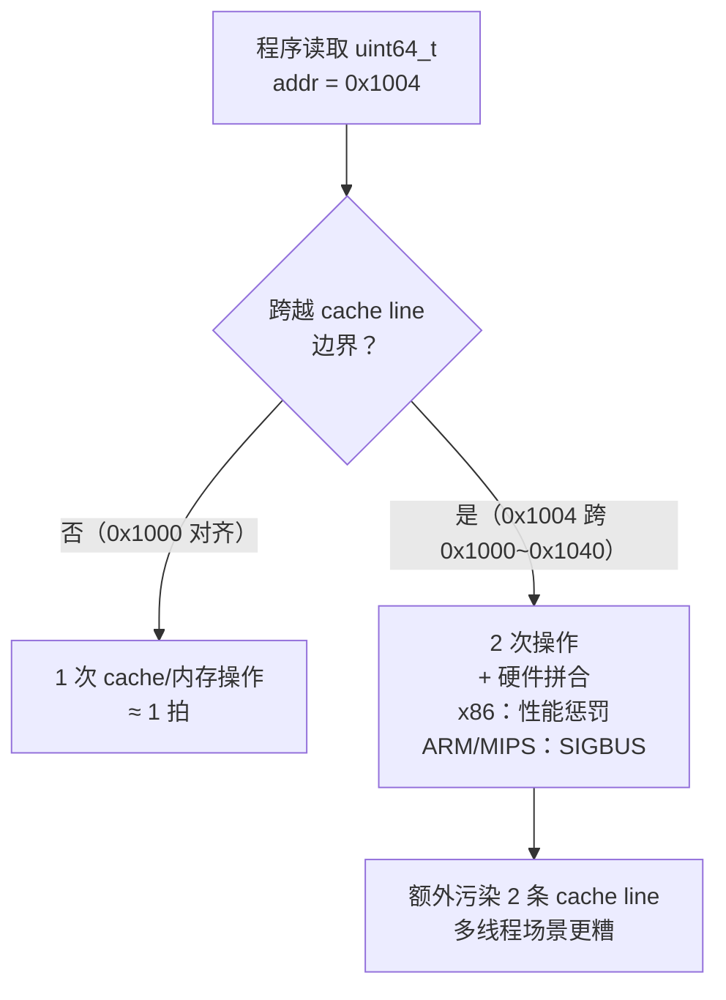
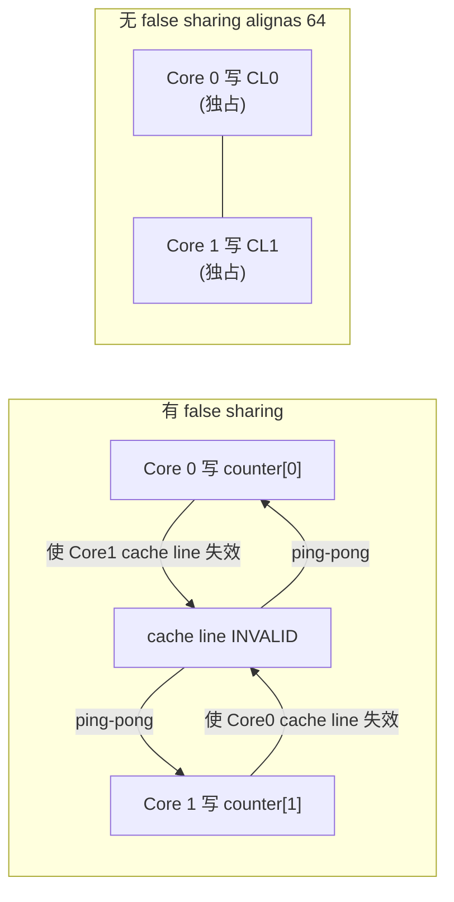

# 内存与堆（04）· 内存对齐与数据布局

## 概述与定位

> [!abstract] TL;DR
> **为什么要对齐**：CPU 按对齐边界取数效率最高；非对齐访问在 x86 上变慢（或引发 #GP），在 ARM/MIPS 上直接触发异常；原子操作与 SIMD 指令对对齐有硬性要求。
> **规则**：标量按自身大小对齐；结构体按最大成员对齐、尾部补齐（对象布局细节见 [[23.C_C++运行时与ABI/06.对象内存布局与this指针.md]]，本篇聚焦"分配器/内存视角"）。
> **glibc 保证**：`malloc` 返回指针按 `MALLOC_ALIGNMENT = 2 * SIZE_SZ = 16 字节`（x86-64）对齐，满足任意标量与常见 SIMD 需求。
> **false sharing**：cache line 64 字节，多线程写同一 cache line 的不同变量会触发 cache 一致性风暴，用 `alignas(64)` padding 隔离。

本篇处于系列第一部分（虚拟内存与内核接口），承接 [[03.mmap与brk内核内存接口]] 从内核取到内存之后，讲清**分配器如何在字节粒度上交付符合对齐要求的指针**，以及对齐对性能与安全的影响。这是理解 ptmalloc2 chunk 结构（`MINSIZE = 0x20`、`chunk 大小是 16 的倍数`）的基础。

---

## 原理与机制

### 为什么 CPU 关心对齐

现代 CPU 访问内存的最小粒度是 **cache line**（x86-64 通常为 64 字节），而加载/存储单元在硬件层面按**自然对齐边界**取数：一个 8 字节的 `uint64_t` 位于 0x1000 时，一次内存操作即可取完；若跨越 0x1004，硬件需要两次读取再拼合——即使 x86 "支持"非对齐访问，也会额外消耗时钟周期，并污染两条 cache line。

在严格架构（ARMv7 未开 SCTLR.A、MIPS 等）上，非对齐访问直接触发**对齐异常（Alignment Fault）**，操作系统通常以 `SIGBUS` 杀掉进程。

原子操作（`lock cmpxchg`、C11 `_Atomic`）要求操作数**不跨越 cache line 边界**（通常等价于自然对齐），否则锁总线也无法保证原子性。

SIMD 指令对对齐要求更严格：

| 指令集 | 寄存器宽度 | 对齐要求（未使用 `u` 变体时） |
|--------|-----------|-------------------------------|
| SSE2 `movdqa` | 128 bit（16 字节） | **16 字节对齐** |
| AVX2 `vmovdqa` | 256 bit（32 字节） | **32 字节对齐** |
| AVX-512 `vmovdqa64` | 512 bit（64 字节） | **64 字节对齐** |

使用不对齐的 `movdqa` 会触发 `#GP(0)`；`movdqu` 允许非对齐但性能有损失。

### Cache Line 与访问代价 — Mermaid 示意



---

## 规则详解

### 自然对齐规则

"自然对齐"即：**类型的对齐要求等于其大小**（上限通常为指针大小 = 8）。

| 类型 | 大小 | 对齐要求（x86-64） |
|------|------|--------------------|
| `char` | 1 | 1 |
| `short` | 2 | 2 |
| `int` / `float` | 4 | 4 |
| `long` / `double` / 指针 | 8 | 8 |
| `long double` | 16（x87 80 bit 补齐） | 16 |
| `__m128` (SSE) | 16 | 16 |
| `__m256` (AVX) | 32 | 32 |

C/C++ 编译器遵循 **System V AMD64 ABI** 规定的对齐规则，结构体内填充 padding 以满足每个成员的对齐要求，结构体尾部填充以使整体大小是最大成员对齐值的倍数。

> 对象内布局与 `sizeof`/`offsetof` 细节见 [[23.C_C++运行时与ABI/06.对象内存布局与this指针.md]]。本篇聚焦分配器视角：**分配器在交付指针时必须保证该指针满足用户需要的对齐要求**。

### malloc 的 16 字节对齐保证

glibc ptmalloc2 在 x86-64 上定义：

```c
/* malloc/malloc.c (glibc) */
#define SIZE_SZ         sizeof(INTERNAL_SIZE_T)   /* = 8 (x86-64) */
#define MALLOC_ALIGNMENT (2 * SIZE_SZ)             /* = 16 */
#define MALLOC_ALIGN_MASK (MALLOC_ALIGNMENT - 1)   /* = 0xf */
```

`malloc` 返回的 user data 指针满足 `ptr % 16 == 0`。这一保证覆盖：

- 所有标量类型（最大自然对齐 8 字节）
- `long double`（16 字节）
- SSE2 `__m128`（16 字节）
- AVX2 `__m256`（32 字节）需要显式 32 字节对齐——**普通 `malloc` 不保证**

这也是 chunk 大小必须是 **16 的倍数**的直接原因：相邻 chunk 的 user data 部分才能保持 16 字节对齐。结合 `MINSIZE = 0x20`（32 字节，含 16 字节 header），最小 chunk 的 user data 同样 16 字节对齐（chunk base 对齐则 `chunk_base + 16 = user_data`，仍对齐）。

字节布局示意（x86-64，allocated chunk）：

```
偏移  字段          大小   说明
+0    prev_size     8B    前一个 chunk 大小（仅在前一 chunk 空闲时有效）
+8    size          8B    本 chunk 大小 | flags（低 3 位）
+16   user data  →  N B   ← malloc 返回指针指向这里，16B 对齐
...
```

> 详细 chunk 结构见 [[06.ptmalloc2的chunk结构]]。

### 显式对齐分配 API

当需要超过 16 字节对齐（如 AVX-512 的 64 字节）或指定任意 2 的幂对齐时，使用以下 API：

```c
#include <stdlib.h>   /* posix_memalign, aligned_alloc */
#include <malloc.h>   /* memalign（非标准，Linux） */

/* POSIX.1-2001：align 须是 2 的幂且是 sizeof(void*) 的倍数 */
int posix_memalign(void **memptr, size_t align, size_t size);

/* C11：align 须是 2 的幂，size 须是 align 的倍数 */
void *aligned_alloc(size_t align, size_t size);

/* 非标准，早期接口，部分系统不可用 memalign 释放后 free */
void *memalign(size_t align, size_t size);
```

语言层面的对齐关键字：

```c
/* C11 / C++11 */
#include <stdalign.h>   /* C */

alignas(32) float vec[8];   /* 32 字节对齐的栈数组 */
size_t a = alignof(double); /* 查询类型对齐要求，= 8 */
```

```cpp
// C++17 new 支持 over-aligned 类型
struct alignas(64) CacheAligned { int data; };
auto *p = new CacheAligned;          // 保证 64 字节对齐
```

glibc 在 `aligned_alloc` / `posix_memalign` 内部向上调整请求大小使之能放入合法 chunk，并在 chunk 内部通过分割或填充 fake chunk header 对齐 user data 指针——内部实际分配的 chunk 可能比请求更大。

### False Sharing 与 Cache Line 隔离

**false sharing**（虚假共享）是多线程程序中最隐蔽的性能杀手之一：

```
cache line 0 (0x00 ~ 0x3F)
┌──────────────────────────────────────────────────────────┐
│  thread_A 的计数器 (offset +0, 8B)  │  thread_B 的计数器 (offset +8, 8B) │ ...
└──────────────────────────────────────────────────────────┘
```

两个线程各写自己的字段，却落在同一 cache line。CPU 缓存一致性协议（MESI）要求写操作前先获取该 cache line 的独占所有权，导致 cache line 在核间**乒乓（ping-pong）**，每次写都可能触发跨核通信——吞吐量可下降 10×~100×。

**示意对比**：

```c
/* 有 false sharing：counter[0] 和 counter[1] 共享同一 cache line */
static long counter[2];

/* 避免 false sharing：每个计数器独占一条 cache line */
struct alignas(64) PaddedCounter {
    long value;
    /* 隐式填充：结构体大小补齐到 64 字节 */
};
static PaddedCounter counter[2];
```

Mermaid 示意——有无 false sharing 的 cache line 状态：



> [!tip] 对齐填充本身也是碎片
> `alignas(64)` 结构体在 64 字节中若只存 8 字节数据，56 字节为内部填充（internal fragmentation）。分配器的碎片率也会因此上升。这是性能与内存效率之间的典型权衡。

---

## 实战

### 用 `aligned_alloc` 分配 SIMD 缓冲区

```c
#include <stdlib.h>
#include <stdio.h>
#include <stdint.h>
#include <immintrin.h>   /* AVX2 */

int main(void) {
    /* AVX2 需要 32 字节对齐；size 须是 align 的整数倍 */
    const size_t N = 256;
    float *buf = aligned_alloc(32, N * sizeof(float));
    if (!buf) { perror("aligned_alloc"); return 1; }

    /* 此处 buf 保证 32 字节对齐，可安全用 vmovdqa */
    for (size_t i = 0; i < N; i++) buf[i] = (float)i;

    /* 验证对齐 */
    printf("buf addr = %p, aligned to 32: %s\n",
           (void *)buf, ((uintptr_t)buf % 32 == 0) ? "yes" : "no");

    free(buf);
    return 0;
}
```

> [!warning] 示例输出为示意
> ```
> buf addr = 0x55a3b7c02020, aligned to 32: yes
> ```

### 用 `alignas` 消除 false sharing

```c
#include <stddef.h>   /* alignas（C11 via stdalign.h） */
#include <stdatomic.h>
#include <stdalign.h>
#include <threads.h>  /* C11 threads */

#define NTHREADS 4
#define ITERS    1000000

struct alignas(64) Counter {   /* 每个 Counter 独占一条 cache line */
    atomic_long value;
};

static struct Counter counters[NTHREADS];

int worker(void *arg) {
    int id = (int)(intptr_t)arg;
    for (long i = 0; i < ITERS; i++)
        atomic_fetch_add_explicit(&counters[id].value, 1, memory_order_relaxed);
    return 0;
}
```

### gdb 观察对齐

```bash
$ gcc -g -O0 false_sharing.c -o false_sharing
$ gdb -q ./false_sharing
(gdb) run
(gdb) p &counters[0]
$1 = (struct Counter *) 0x404040     # 应为 0x...40（64B 对齐）
(gdb) p (unsigned long)&counters[0] % 64
$2 = 0                               # 确认 64 字节对齐
(gdb) p &counters[1]
$3 = (struct Counter *) 0x404080     # 间距 0x40 = 64，独占 cache line
```

> [!warning] 示例输出为示意

### `perf` 观察 false sharing 引子

```bash
# 对比有/无 false sharing 的运行时间与 cache 事件
perf stat -e cache-references,cache-misses,LLC-load-misses \
    ./false_sharing_bad
perf stat -e cache-references,cache-misses,LLC-load-misses \
    ./false_sharing_good
```

`LLC-load-misses`（Last Level Cache 未命中）与 `cache-references` 的比率若在 `_bad` 版本中明显高于 `_good`，则说明 false sharing 在发生。真实测量需结合 `perf c2c`（cache-to-cache 检测工具）。

---

## 安全性与正确使用

### 非对齐访问与未定义行为（UB）

在 C/C++ 中，通过误对齐的指针解引用是**未定义行为**，编译器可基于 strict aliasing 和对齐假设做出激进优化，导致实际结果不可预测：

```c
char buf[8] = {0};
/* 强制转换为 int* 但地址可能不是 4 字节对齐 */
int *p = (int *)(buf + 1);   /* UB：p 未对齐 */
*p = 42;                      /* 行为未定义，可能崩溃或悄悄读错数据 */
```

正确做法是使用 `memcpy` 进行非对齐读写（编译器会生成高效代码）：

```c
int val;
memcpy(&val, buf + 1, sizeof(int));   /* 合法：无对齐假设 */
```

### `alignas` 误用

`alignas` 指定的对齐值须是 2 的幂，且不小于类型的自然对齐：

```c
struct alignas(3) Bad { int x; };  /* 错误：3 不是 2 的幂，编译报错或忽略 */
struct alignas(2) AlsoWrong { int x; };  /* 对 int（需 4B）降低对齐：UB */
```

`alignas` 只影响静态/自动存储期的变量与类成员；动态分配须用 `aligned_alloc` / `posix_memalign`。

### SIMD 对齐要求与 `_mm_load_si128` vs `_mm_loadu_si128`

| 内联函数 | 对齐要求 | 非对齐行为 |
|---------|---------|-----------|
| `_mm_load_si128` | **16 字节对齐** | `#GP` 异常 → SIGSEGV |
| `_mm_loadu_si128` | 无 | 安全，但可能慢 |
| `_mm256_load_si256` | **32 字节对齐** | `#GP` 异常 → SIGSEGV |
| `_mm512_load_si512` | **64 字节对齐** | `#GP` 异常 → SIGSEGV |

当使用 `-march=haswell` 或更新目标时，编译器的自动向量化会生成 `vmovdqa`；若数据不对齐，运行时崩溃。务必配合 `aligned_alloc(32, ...)` 或 `alignas(32)` 声明缓冲区。

### 对齐填充导致的信息残留（安全隐患）

结构体内部 padding 和尾部 padding 是**未初始化字节**，编译器不会自动清零：

```c
struct Msg {
    char type;    /* 1B */
    /* 3B padding（未初始化，可能含栈垃圾） */
    int  code;    /* 4B */
};

struct Msg m;
m.type = 'A';
m.code = 42;
/* m 的 3 字节 padding 含有栈上的历史数据 */
send(sock, &m, sizeof(m), 0);   /* 可能泄漏内核地址、密钥等 */
```

防御手段：`memset(&m, 0, sizeof(m));` 在赋值前清零，或使用 `__attribute__((packed))` 消除 padding（但须承担非对齐访问代价）。在安全敏感场景（网络协议、系统调用参数）务必显式清零结构体。

### 对齐与堆碎片

分配器内部为满足对齐要求，会：
1. **圆整请求大小**至 `MALLOC_ALIGNMENT` 的倍数（内部碎片）；
2. `posix_memalign(align, size)` 当 `align > MALLOC_ALIGNMENT` 时，分配 `size + align` 的超大 chunk，在内部寻找对齐位置，前段 padding 可能作为 free chunk 归还 bins（外部碎片）。

高对齐要求（如 `aligned_alloc(4096, size)`）可能产生大量碎片，影响分配器的整体利用率。

---

## 小结

| 要点 | 关键数值 |
|------|---------|
| glibc `malloc` 对齐保证 | `MALLOC_ALIGNMENT = 16 字节`（x86-64，`2 * SIZE_SZ`） |
| chunk 大小粒度 | **16 字节**倍数（保持 user data 16B 对齐） |
| `MINSIZE`（含 header） | **0x20 = 32 字节** |
| cache line 大小 | **64 字节**（x86-64 主流） |
| false sharing 隔离 | `alignas(64)` padding，每个"热"变量独占一条 cache line |
| AVX-512 安全分配 | `aligned_alloc(64, size)` 或 `posix_memalign(&p, 64, size)` |
| 结构体 padding 安全 | 显式 `memset` 清零，防止信息泄漏 |

对齐是分配器、ABI、硬件三者之间的"隐性契约"：理解它既能解释 `malloc_chunk` 为何是 16 字节粒度，也能定位 false sharing 性能问题，还能规避非对齐 UB 与 SIMD 崩溃。

---

## 相关阅读

- **对象内存布局与 this 指针（ABI 视角）**：[[23.C_C++运行时与ABI/06.对象内存布局与this指针.md]]
- **原子操作与内存模型（对齐与原子性的硬件基础）**：[[21.Asm/28 原子操作与内存模型.md]]
- **chunk 结构详解**：[[06.ptmalloc2的chunk结构]]
- **tcache 与 bins（分配器如何维护对齐分配）**：[[07.ptmalloc2的bins与空闲管理]]、[[08.tcache机制]]
- **堆漏洞基础（互补，利用视角）**：[[33.二进制漏洞与利用基础/09.堆管理基础.md]]

---

⬅️ 上一篇 [[03.mmap与brk内核内存接口]] ｜ 🏠 [[00.内存管理与堆分配器总览]] ｜ 下一篇 [[05.ptmalloc2总览与arena]] ➡️
