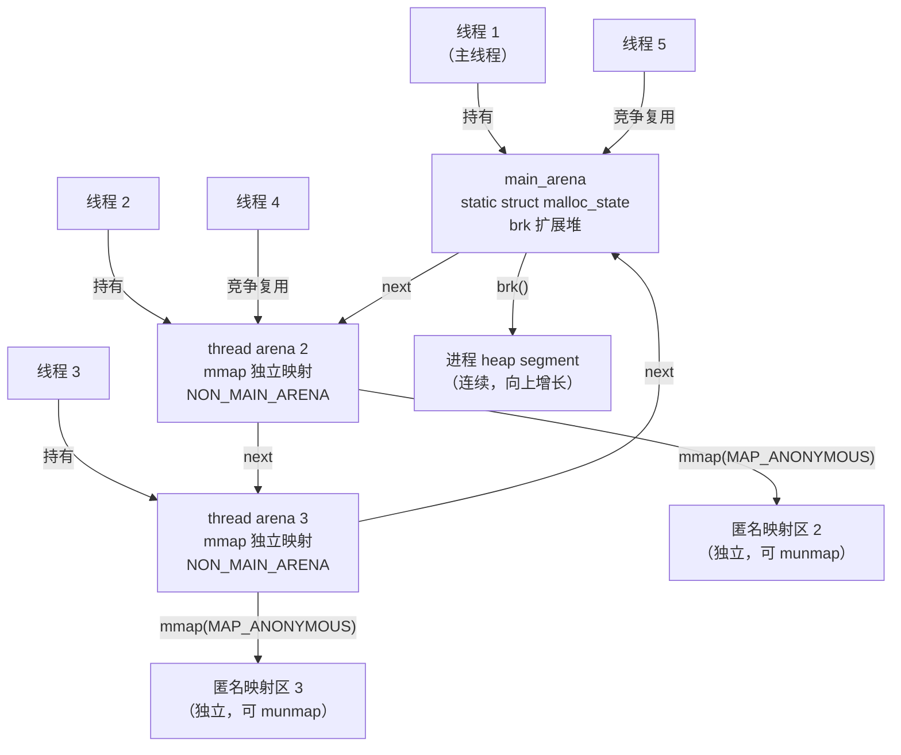
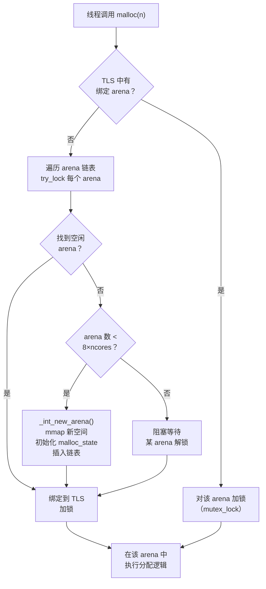

# 内存与堆（05）· ptmalloc2总览与arena

## 概述与定位

> [!abstract] TL;DR
> - **ptmalloc2** 是 glibc 默认堆分配器，由 dlmalloc 扩展而来，源码位于 `malloc/malloc.c`，核心改动是引入 **多 arena** 支持多线程并发。
> - **arena** 是一套管理结构（`struct malloc_state`）加上它所支配的堆内存的整体，多 arena 的设计目标是让不同线程各持一个 arena，减少互斥锁竞争。
> - **main\_arena**（静态全局）通过 `brk` 扩展堆；**线程 arena** 在首次需要时由 `mmap` 申请一块匿名映射，`malloc_state` 头带 `NON_MAIN_ARENA` 语义。
> - arena 数量上限默认 ≈ **8 × CPU 核数**（64 位），超出后线程竞争使用已有 arena 并加锁等待。
> - `struct malloc_state` 的关键字段包括 `mutex`、`fastbinsY[]`、`top`、`bins[]`、`next` 等；用 pwndbg 的 `arena` / `arenas` 命令可直接观察。

ptmalloc2 是绝大多数 Linux 程序的堆分配器，理解它的 **arena 层次**是读懂后续 chunk 结构（[[06.ptmalloc2的chunk结构]]）、bins 组织（[[07.ptmalloc2的bins与空闲管理]]）乃至分配释放流程（[[09.malloc与free分配释放流程]]）的前提。本篇聚焦 **"为什么需要 arena、arena 是什么、线程如何被分配到 arena"**，不重复 33 系列已覆盖的堆利用步骤（详见 [[33.二进制漏洞与利用基础/09.堆管理基础.md]]）。

---

## 原理与机制

### dlmalloc → ptmalloc2：多线程的诞生

Doug Lea 于 1987 年设计了 **dlmalloc**，它是单线程设计：一把全局锁、一个共享堆，在多线程环境下所有 `malloc` / `free` 请求都要串行通过这把锁，高并发场景下锁竞争成为瓶颈。

Wolfram Gloger 在 dlmalloc 基础上增加了 **per-thread arena（多 arena 机制）**，命名为 **ptmalloc**，后演化为 **ptmalloc2**，并于 glibc 2.3 起成为 glibc 的默认分配器，源码位于 `glibc/malloc/malloc.c`。

ptmalloc2 对 dlmalloc 的核心改动：

| 方面 | dlmalloc | ptmalloc2 |
|---|---|---|
| 锁粒度 | 一把全局锁 | 每 arena 一把锁（`mutex`） |
| arena 数量 | 1 | 多个（main\_arena + 若干线程 arena） |
| 线程扩展 | 不支持 | 支持，`arena_get` 分配/复用 arena |
| 扩堆方式 | `brk` | main\_arena 用 `brk`；线程 arena 用 `mmap` |
| 源码位置 | standalone | glibc `malloc/malloc.c` |

### 多 arena 与线程映射



> [!note] arena 之间通过 `malloc_state.next` 构成**循环单链表**，`main_arena` 是链表头；线程首次 malloc 时由 `arena_get` 遍历链表寻找空闲 arena，或在未达上限时新建一个。

### 线程到 arena 的分配流程

1. **线程首次 `malloc`**：调用 `arena_get`，尝试从 TLS（线程本地存储）读取已绑定 arena；若 TLS 为空，进入以下步骤。
2. **寻找空闲 arena**：遍历 arena 链表，尝试 `try_lock`（非阻塞），首个加锁成功的 arena 被本线程"持有"。
3. **新建 arena**：若链表中所有 arena 都被持有且数量未达上限，调用 `_int_new_arena` → `mmap` 一块新的 heap 内存，初始化 `malloc_state`，插入链表。
4. **超过上限则竞争**：若 arena 数已达 `8 × ncores`，线程只能等待（阻塞加锁）某个现有 arena 被释放。
5. **TLS 缓存**：持有成功后将 arena 指针写入 TLS，下次 malloc 直接读 TLS，无需再遍历链表。



---

## 结构详解

### `struct malloc_state`（arena 头部）

`malloc_state` 是 arena 的核心管理结构，定义于 `malloc/malloc.c`。`main_arena` 是一个静态全局变量，线程 arena 的 `malloc_state` 被分配在 `mmap` 区域的起始处（紧接着是受管理的 heap 内存）。

```c
/* 简化自 glibc malloc/malloc.c，字段名与源码一致 */
struct malloc_state {
    /* ① 互斥锁：每 arena 独立一把，多线程安全的核心 */
    mutex_t mutex;

    /* ② 标志位：NON_MAIN_ARENA 等 */
    int flags;

    /* ③ fastbin 数组：单链 LIFO，默认管 ≤ 0x80(128B) 的 chunk */
    mfastbinptr fastbinsY[NFASTBINS];   /* NFASTBINS 约 10 */

    /* ④ top chunk 指针：堆末尾的剩余大块（wilderness） */
    mchunkptr top;

    /* ⑤ last_remainder：上次切割 chunk 后的余量 */
    mchunkptr last_remainder;

    /* ⑥ bins 数组：small bin（62条）+ large bin（63条）+ unsorted bin（1条）
       共 NBINS = 128 个"头节点"（每条双链需要 2 个指针，故数组大小为 2*NBINS） */
    mchunkptr bins[NBINS * 2 - 2];

    /* ⑦ binmap：位图，快速判断对应 bin 是否非空 */
    unsigned int binmap[BINMAPSIZE];

    /* ⑧ next：指向链表中下一个 arena（循环单链） */
    struct malloc_state *next;

    /* ⑨ next_free：空闲 arena 链表（当前无线程持有的 arena） */
    struct malloc_state *next_free;

    /* ⑩ system_mem：本 arena 已从内核申请的总内存（字节） */
    INTERNAL_SIZE_T system_mem;
    INTERNAL_SIZE_T max_system_mem;
};
```

各字段功能速览：

| 字段 | 类型 | 作用 |
|---|---|---|
| `mutex` | `mutex_t` | 保护本 arena 的所有操作；每 arena 独立，不同 arena 并行 |
| `flags` | `int` | 低位含 `NON_MAIN_ARENA`（0x1）、`FASTCHUNKS_BIT`（0x2）等标志；注意：此处 `NON_MAIN_ARENA` 位值为 `0x1`，与 chunk `size` 低 3 位中同名标志（`NON_MAIN_ARENA=0x4`）是同名不同字段、不同位值，勿混淆 |
| `fastbinsY[]` | `mfastbinptr[~10]` | fastbin 单链数组，index 对应 chunk 大小；默认覆盖 16–128 字节 |
| `top` | `mchunkptr` | 指向 top chunk（堆末尾剩余），分配时优先从 bins 取，bins 不足时从 top 切割 |
| `last_remainder` | `mchunkptr` | 上次 small/large bin 分配后剩下的余量，用于局部性优化 |
| `bins[]` | `mchunkptr[2*(NBINS-1)]` | unsorted bin（index 1）+ small bins（2–63）+ large bins（64–126）的链表头节点数组 |
| `binmap` | `uint[4]` | 128 位位图，bit i=1 表示 bins[i] 非空，快速跳过空 bin |
| `next` | `malloc_state *` | 循环链表，连接所有 arena；`main_arena.next` 指向第一个线程 arena |
| `next_free` | `malloc_state *` | 当前无线程持有的 arena 链；用于快速找到可用 arena |
| `system_mem` | `size_t` | 本 arena 的堆总大小；超过 `trim_threshold` 时触发 `sbrk(-n)` 归还 |

### arena 数量上限

```
最大 arena 数 = mallopt(M_ARENA_MAX) 设置值
默认值（64 位 Linux）= 8 × get_nprocs()   ← 约等于 8 × CPU 核数
默认值（32 位 Linux）= 2 × get_nprocs()
```

也可通过环境变量覆盖：

```bash
MALLOC_ARENA_MAX=4 ./myprogram   # 限制最多 4 个 arena
```

或在代码中：

```c
#include <malloc.h>
mallopt(M_ARENA_MAX, 4);   /* 必须在第一次 malloc 前调用才有效 */
```

> [!note] `M_ARENA_MAX` 是"已分配（曾经创建）的 arena 数上限"，不是"同时被线程持有的数量"。arena 一旦创建就不会销毁，`next_free` 链表管理当前无人持有的空闲 arena 以便复用。

### main\_arena vs 线程 arena 对比

| 维度 | main\_arena | 线程 arena |
|---|---|---|
| 定义方式 | `static struct malloc_state main_arena` | 动态分配，结构体位于 `mmap` 区头部 |
| 扩堆系统调用 | `brk()` / `sbrk()`，连续线性扩展 | `mmap(MAP_ANONYMOUS | MAP_PRIVATE)`，独立映射 |
| 收缩 | `sbrk(-n)` 向下收缩 program break | `munmap` 直接归还内核 |
| `NON_MAIN_ARENA` 标志 | `flags` 中该位为 0 | `flags` 中该位为 1；其管理的 chunk `size` 低 3 位也有此标志（bit 2） |
| 地址连续性 | 与 bss/data 段连续，`/proc/pid/maps` 中同属 `[heap]` | 独立 VMA，`/proc/pid/maps` 中显示为匿名 `mmap` 区 |
| chunk 归还 | top chunk 缩减时 `sbrk(-n)`（不能独立 munmap） | top chunk 耗尽时整块 `munmap` 归还 |
| libc 符号 | `main_arena`（有调试符号时可直接访问） | 无静态名，通过 `main_arena.next` 链找到 |

---

## 实战：pwndbg 观察 main\_arena 与 bins

> [!warning] 示例输出为示意
> 以下命令及输出在安装了 pwndbg 的 Linux gdb 环境中运行，地址随 ASLR 和 glibc 版本变化，本节仅示意典型格式，非本机实跑。

### 编译测试程序

```c
/* arena_demo.c */
#include <stdio.h>
#include <stdlib.h>

int main(void) {
    void *a = malloc(0x88);   /* 进 fastbin 范围（≤ 0x80 默认，或进 tcache） */
    void *b = malloc(0x200);  /* 中等块 */
    void *c = malloc(0x500);  /* 较大块 */
    free(b);                  /* 释放后进 unsorted bin（tcache 满时） */
    free(a);
    /* 在此处设断点，观察 arena 状态 */
    return 0;
}
```

```bash
gcc -g -o arena_demo arena_demo.c
gdb -q arena_demo
```

### 观察 main\_arena

```
pwndbg> arena
main_arena @ 0x7ffff7e19c60
{
  mutex        = 0,
  flags        = 0,
  have_fastchunks = 1,
  fastbinsY    = {0x0, 0x0, ..., 0x5555555596a0, ...},
  top          = 0x555555559b90,
  last_remainder = 0x0,
  bins         = {0x7ffff7e19cf0, 0x7ffff7e19cf0, ...},
  binmap       = {0, 0, 0, 0},
  next         = 0x7ffff7e19c60,   /* 单 arena 时 next 指向自身 */
  next_free    = 0x0,
  system_mem   = 0x21000
}
```

> [!warning] 示例输出为示意

### 列出所有 arena

```
pwndbg> arenas
arena @ 0x7ffff7e19c60 (main_arena)
  top = 0x555555559b90, system_mem = 0x21000
  next = 0x7ffff7e19c60  ← 循环回自身（无线程 arena）
```

多线程程序中可能看到：

```
pwndbg> arenas
arena @ 0x7ffff7e19c60 (main_arena)
  top = 0x555555559b90, system_mem = 0x21000
  next = 0x7ffff0000020

arena @ 0x7ffff0000020 (thread arena)
  top = 0x7ffff0021100, system_mem = 0x21000
  next = 0x7ffff7e19c60
```

> [!warning] 示例输出为示意

### 查看 bins 链表头

```
pwndbg> bins
tcachebins
0x90  [2]: 0x555555559960 —▸ 0x555555559290 ◂— 0x0
fastbins
Empty.
unsortedbin
all: 0x5555555599f0 —▸ 0x7ffff7e19cf0 (main_arena+48) ◂— 0x5555555599f0
smallbins
Empty.
largebins
Empty.
```

> [!warning] 示例输出为示意

### 直接访问 main\_arena 符号

gdb 有调试符号时可直接：

```bash
(gdb) p main_arena          # 打印 malloc_state 结构体
(gdb) p main_arena.top      # 打印 top chunk 地址
(gdb) p main_arena.next     # 打印 arena 链表下一个指针
(gdb) x/10gx &main_arena    # 十六进制查看 arena 头部的前 80 字节
```

无符号（stripped）时通过 `libc` 偏移计算 `main_arena` 地址：

```python
# pwndbg 中
pwndbg> p &main_arena
$1 = (struct malloc_state *) 0x7ffff7e19c60
# 或：libc_base + libc.symbols['main_arena']（pwntools 离线计算）
```

> [!warning] 示例输出为示意

---

## 安全性与正确使用

### arena 过多导致内存膨胀

每个 arena 都拥有自己独立的 `top chunk`、fastbin 缓存以及 bin 链表，这意味着**同一大小的空闲 chunk 可能散布在多个 arena 中，无法互相利用**，导致内存实际占用远高于理论需求——这是 ptmalloc2 最被诟病的行为之一。

典型场景：一个使用大量短生命周期线程的服务，每条线程短暂 malloc/free 后退出，但 arena 不销毁，其中驻留的碎片累积，造成"RSS 只增不减"的内存膨胀现象。

**缓解手段**：

```bash
# 方法一：环境变量限制 arena 数（牺牲并发换内存）
MALLOC_ARENA_MAX=2 ./myserver

# 方法二：代码中限制（需在第一次 malloc 前调用）
mallopt(M_ARENA_MAX, 2);

# 方法三：定期调用 malloc_trim 释放 top chunk 以上的空间
malloc_trim(0);   /* 参数为保留字节数，0 表示尽量归还 */
```

### 多线程一致性

- `malloc` / `free` 本身是线程安全的（arena 级 `mutex` 保证）；但 `mallopt` **并非线程安全**，必须在任何线程调用 `malloc` 之前设置。
- `arena_get` 绑定 arena 的过程以 TLS 为缓存，TLS 切换（如 coroutine / fiber）时可能绑定错误 arena，需手动处理（一般不推荐在 coroutine 中跨 arena 操作）。
- 调用 `fork()` 后，子进程会继承父进程所有 arena 的状态，包括锁——若父进程某线程持有 arena 锁时执行 `fork()`，子进程（单线程）将永久死锁。解法：`fork` 前调用 `pthread_atfork` 注册解锁回调，或只在 `fork` 后立即 `exec`（不再 malloc）。

### `MALLOC_ARENA_MAX` 调优建议

| 场景 | 建议 |
|---|---|
| 内存紧张（容器/嵌入式） | `MALLOC_ARENA_MAX=1`（退化为单 arena，内存最省） |
| 高并发服务（核数 ≥ 8） | 保持默认（`8×ncores`）或适当降低至 `4` |
| 内存泄漏排查 | `MALLOC_ARENA_MAX=1` + Valgrind，避免多 arena 干扰定位 |
| 替换分配器 | 用 tcmalloc / jemalloc 代替 ptmalloc2，彻底绕过 arena 问题（详见 [[10.tcmalloc原理]]、[[11.jemalloc原理]]） |

> [!warning] 将 `MALLOC_ARENA_MAX` 设为 1 会让所有线程共用 `main_arena`，高并发时 `mutex` 竞争可能成为瓶颈，需用基准测试验证。

### 安全研究视角

- **`main_arena` 符号泄露**：若攻击者通过堆漏洞读到 `main_arena` 地址，可立即计算出 libc 基址（`main_arena` 是 libc 数据段中的静态变量），是 ASLR 绕过的经典途径。
- **`malloc_state` 伪造**：理论上，若攻击者能覆盖 `arena.top` 或 `arena.bins[]`，可让后续 `malloc` 返回任意地址；现代 glibc 对 top chunk 地址的对齐和大小有校验，降低了可行性。
- **arena 数过少的副作用**：若强制 `MALLOC_ARENA_MAX=1`，攻击者只需针对 `main_arena` 一个目标；适度多 arena 反而增加了攻击难度（需确认目标线程所在 arena）。

防御全景详见 [[13.内存安全与调试]] 与 [[34.现代二进制防护机制/00.现代二进制防护机制总览.md]]。

---

## 小结

1. **ptmalloc2 = dlmalloc + 多 arena**：唯一的改动目标是支持多线程并发；glibc 默认采用，源码在 `malloc/malloc.c`。
2. **arena 的本质**：`struct malloc_state`（管理头）+ 其支配的堆内存。`main_arena` 静态存在于 libc 数据段，线程 arena 动态创建于 `mmap` 区。
3. **内存来源不同**：main\_arena 用 `brk` 连续扩展；线程 arena 用 `mmap` 独立申请，chunk 的 `NON_MAIN_ARENA`（bit 2）标记归属。
4. **arena 数上限 ≈ 8 × 核数**（64 位），可通过 `mallopt(M_ARENA_MAX, N)` 或 `MALLOC_ARENA_MAX=N` 调整；超出时线程共享并竞争锁。
5. **`malloc_state` 关键字段**：`mutex`（锁粒度）、`fastbinsY[]`（fastbin 数组）、`top`（top chunk）、`bins[]`（small/large/unsorted 链表头）、`next`（arena 循环链表）、`system_mem`（堆大小统计）。
6. **多 arena 的代价**：各 arena 独立缓存空闲 chunk，无法跨 arena 复用，高并发短命线程场景易内存膨胀；可用 `MALLOC_ARENA_MAX`、`malloc_trim`、或替换分配器（tcmalloc / jemalloc）缓解。
7. **调试入口**：pwndbg 的 `arena`、`arenas` 命令；`main_arena` libc 符号；`/proc/pid/maps` 观察 `[heap]` 与匿名 mmap 区。

---

## 相关阅读

- **堆管理基础（互补，利用视角）**：[[33.二进制漏洞与利用基础/09.堆管理基础.md]]
- **mmap 与 brk 内核内存接口**：[[03.mmap与brk内核内存接口]]
- **chunk 结构（下一篇）**：[[06.ptmalloc2的chunk结构]]
- **bins 与空闲管理**：[[07.ptmalloc2的bins与空闲管理]]
- **tcache 机制**：[[08.tcache机制]]
- **内存安全与调试**：[[13.内存安全与调试]]

---

⬅️ 上一篇 [[04.内存对齐与数据布局]] ｜ 🏠 [[00.内存管理与堆分配器总览]] ｜ 下一篇 [[06.ptmalloc2的chunk结构]] ➡️
