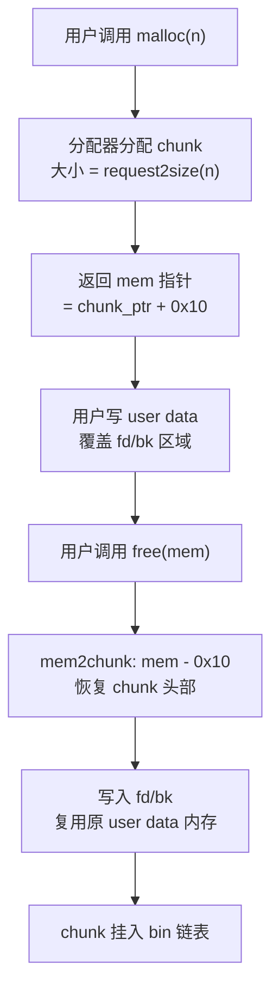

# 内存与堆（06）· ptmalloc2的chunk结构

## 概述与定位

> [!abstract] TL;DR
> - ptmalloc2 以 **`malloc_chunk`** 为内存管理的原子单位；每个 chunk 含 `prev_size`、`size`（低 3 位是标志）、以及空闲时的 `fd`/`bk` 指针。
> - `size` 低 3 位标志：**`PREV_INUSE (P) = 0x1`**、**`IS_MMAPPED (M) = 0x2`**、**`NON_MAIN_ARENA (N) = 0x4`**；真实大小 = `size & ~0x7`。
> - `malloc` 返回的是 **mem 指针**（user data 起点），而非 chunk 头部；`chunk2mem(p) = p + 2*SIZE_SZ = p + 0x10`（x86-64，`SIZE_SZ=8`）。
> - 使用中的 chunk 与空闲 chunk 布局不同：**前者的下一个 chunk 的 `prev_size` 字段被本块借用作 user data**（节省 8 字节）；后者的 `fd`/`bk` 复用 user data 区，且下块 `prev_size` 记录本块大小、下块 `P` 位清零。
> - `MINSIZE = 0x20`（32 字节含 header），chunk 大小 **16 字节对齐**；`request2size(req)` 将用户请求换算为含 header 且对齐的 chunk 大小。
> - 用 pwndbg 的 `heap` / `malloc_chunk <addr>` 可直接观察上述字段。

---

## 原理与机制

### 核心设计思想：借位与复用

`malloc_chunk` 的设计体现了两个节约内存的核心思想：

1. **`prev_size` 借位**：只有当前驱 chunk 空闲时，`prev_size` 才有实际含义（记录前驱大小以供合并定位）。若前驱正在使用，则本块的 `prev_size` 字段被前驱 chunk 借用作 user data，节省 8 字节。
2. **`fd`/`bk` 复用**：chunk 分配后，原来的 `fd`/`bk` 指针区域归用户使用——user data 直接覆盖在那块内存上；只有 chunk 空闲时，这区域才真正存放链表指针。



---

## 结构与字节详解

### `malloc_chunk` 字段定义

```c
/* 简化自 glibc malloc/malloc.c */
struct malloc_chunk {
    size_t  prev_size;  /* 前驱空闲 chunk 的大小（前驱在使用时此字段被前驱借用为 user data） */
    size_t  size;       /* 本 chunk 大小（含 header），低 3 位是标志位 */

    /* 以下字段仅空闲 chunk 使用；分配后被 user data 覆盖 */
    struct malloc_chunk *fd;          /* bin 链表中下一个空闲 chunk（forward） */
    struct malloc_chunk *bk;          /* bin 链表中上一个空闲 chunk（backward） */

    /* 仅 large chunk（largebin）额外使用 */
    struct malloc_chunk *fd_nextsize; /* largebin 内部跳表：指向下一个更小 chunk */
    struct malloc_chunk *bk_nextsize; /* largebin 内部跳表：指向上一个更大 chunk */
};
```

各字段说明：

| 字段 | 大小（x86-64） | 说明 |
|---|---|---|
| `prev_size` | 8 字节 | 前驱**空闲** chunk 的字节大小。前驱在使用时此字段被前驱借用作 user data；本 chunk 的 `P` 标志（`PREV_INUSE`）为 1 时，该字段内容由前驱决定 |
| `size` | 8 字节 | 本 chunk 完整大小（含 header），低 3 位是标志位（见下文），真实大小 = `size & ~0x7` |
| `fd` | 8 字节 | 空闲时：bin 链表 forward 指针；使用时：user data 的第 1 个 8 字节 |
| `bk` | 8 字节 | 空闲时：bin 链表 backward 指针；使用时：user data 的第 2 个 8 字节 |
| `fd_nextsize` | 8 字节 | 仅 largebin：跳表 forward，指向下一个不同大小的 chunk |
| `bk_nextsize` | 8 字节 | 仅 largebin：跳表 backward，指向上一个不同大小的 chunk |

### `size` 字段低 3 位标志

```
bit 0 = PREV_INUSE   (P) = 0x1  ── 前驱 chunk 是否正在使用（1=使用中，0=空闲）
bit 1 = IS_MMAPPED   (M) = 0x2  ── 本 chunk 是否由 mmap 直接分配（大块 ≥ 128KB）
bit 2 = NON_MAIN_ARENA (N) = 0x4── 本 chunk 是否属于非主 arena（线程 arena）
```

对应的 glibc 宏（位于 `malloc/malloc.c`）：

```c
#define PREV_INUSE     0x1
#define IS_MMAPPED     0x2
#define NON_MAIN_ARENA 0x4

/* 读取 chunk 真实大小（掩去低 3 位标志） */
#define chunksize(p)        ((p)->size & ~0x7)

/* 判断前驱是否在使用 */
#define prev_inuse(p)       ((p)->size & PREV_INUSE)

/* 判断是否 mmap 分配 */
#define chunk_is_mmapped(p) ((p)->size & IS_MMAPPED)

/* 判断是否非主 arena */
#define chunk_non_main_arena(p) ((p)->size & NON_MAIN_ARENA)
```

#### 读取示例

若 `p->size = 0x61`：
- 真实大小 = `0x61 & ~0x7 = 0x60`（96 字节）
- `P = 0x61 & 0x1 = 1`（前驱使用中）
- `M = 0x61 & 0x2 = 0`（非 mmap）
- `N = 0x61 & 0x4 = 0`（主 arena）

---

### chunk 指针 vs mem 指针

`malloc` 返回给用户的地址（**mem 指针**）并非 chunk 头部，而是 user data 的起点：

```
chunk 指针（chunk_ptr）
    │
    ▼
┌──────────────┐  ← offset +0x00：chunk_ptr（chunk 头部起点）
│  prev_size   │  8 字节
├──────────────┤  ← offset +0x08
│  size | P|M|N│  8 字节
├──────────────┤  ← offset +0x10 = chunk_ptr + 2*SIZE_SZ ← mem 指针（malloc 返回此地址）
│  user data   │
│  （fd 区域） │  8 字节
├──────────────┤  ← offset +0x18
│  user data   │
│  （bk 区域） │  8 字节
├──────────────┤
│  ...更多 ud.  │
└──────────────┘
```

对应宏定义（`SIZE_SZ = sizeof(size_t) = 8`）：

```c
#define SIZE_SZ          sizeof(size_t)          /* = 8，x86-64 */
#define MALLOC_ALIGNMENT (2 * SIZE_SZ)           /* = 16 */

/* chunk 指针 → mem 指针（+0x10，跳过 prev_size 和 size） */
#define chunk2mem(p)   ((void *)((char *)(p) + 2 * SIZE_SZ))

/* mem 指针 → chunk 指针（-0x10） */
#define mem2chunk(mem) ((mchunkptr)((char *)(mem) - 2 * SIZE_SZ))
```

---

### MINSIZE 与对齐规则

```c
/* glibc 中的最小 chunk 大小（含 header，16 字节对齐） */
#define MINSIZE  ((unsigned long)(((MIN_CHUNK_SIZE + MALLOC_ALIGN_MASK) & ~MALLOC_ALIGN_MASK)))
/* x86-64 上 MINSIZE = 0x20 = 32 字节 */
```

规则总结：
- chunk 大小是 **16 字节**（`MALLOC_ALIGNMENT = 2*SIZE_SZ = 16`）的倍数
- 最小 chunk：**MINSIZE = 0x20 = 32 字节**（含 8 字节 `prev_size` + 8 字节 `size` + 至少 16 字节 user data/fd/bk）
- chunk 的低 4 位中有效位仅低 3 位用于标志，其余对齐保证低 4 位为 `0`（除标志位外）

### `request2size`：用户请求 → chunk 大小

```c
/* 将用户请求大小换算为分配器实际分配的 chunk 大小（含 header，对齐）
   近似公式（精确实现见 malloc.c）：*/
#define request2size(req)  \
    (((req) + SIZE_SZ + MALLOC_ALIGN_MASK) & ~MALLOC_ALIGN_MASK)
/* 其中 MALLOC_ALIGN_MASK = MALLOC_ALIGNMENT - 1 = 15
   即：(req + 8 + 15) & ~15，且结果不低于 MINSIZE */
```

几个典型换算：

| `malloc(n)` 请求 | `request2size` 计算 | 实际 chunk 大小 |
|---|---|---|
| `malloc(1)` | `(1+8+15)&~15 = 24 & ~15 = 16` → 取 MINSIZE=0x20 | `0x20`（32 B） |
| `malloc(0x18)` | `(24+8+15)&~15 = 47 & ~15 = 32` → 取 MINSIZE=0x20 | `0x20`（32 B） |
| `malloc(0x20)` | `(32+8+15)&~15 = 55 & ~15 = 48` | `0x30`（48 B） |
| `malloc(0x50)` | `(80+8+15)&~15 = 103 & ~15 = 96` | `0x60`（96 B） |
| `malloc(0x100)` | `(256+8+15)&~15 = 279 & ~15 = 272` | `0x110`（272 B） |

---

### 使用中（in-use）vs 空闲（free）字节布局对比

#### 使用中 chunk（in-use chunk）

```
地址偏移   内容
─────────────────────────────────────────────────────────
+0x00  ┌─────────────────────────────────────┐
       │  prev_size（被前驱 chunk 借用）        │  ← 前驱使用中时，此 8 字节
       │  实际存储的是前驱 chunk 的 user data  │    归前驱 user data 区
+0x08  ├─────────────────────────────────────┤
       │  size │ P=1 | M=? | N=?             │  ← P=1 表示前驱使用中（借位有效）
+0x10  ├─────────────────────────────────────┤  ← malloc() 返回此地址（mem 指针）
       │  user data（字节 0–7）               │  ← 覆盖了 fd 所在偏移
+0x18  ├─────────────────────────────────────┤
       │  user data（字节 8–15）              │  ← 覆盖了 bk 所在偏移
+0x20  ├─────────────────────────────────────┤
       │  ... 更多 user data ...              │
       │                                     │
+0xNN  ├─────────────────────────────────────┤
       │  [下一个 chunk 的 prev_size]         │  ← 被本 chunk 借用！存本块的 user data 末尾
+0xNN+8├─────────────────────────────────────┤
       │  [下一个 chunk 的 size]              │
       └─────────────────────────────────────┘
```

**关键点**：前一个使用中 chunk 会"借用"当前 chunk 的 `prev_size` 字段（低 8 字节）作为自己的 user data 末尾，从而节省 8 字节。只有前驱空闲时，`prev_size` 才恢复其"记录前驱大小"的本职。

#### 空闲 chunk（free chunk，在 bin 链表中）

```
地址偏移   内容
─────────────────────────────────────────────────────────
+0x00  ┌─────────────────────────────────────┐
       │  prev_size（前驱也空闲时记录其大小）  │  ← 若前驱也空闲，记录前驱 chunk 大小
+0x08  ├─────────────────────────────────────┤
       │  size │ P=0 | M=? | N=?             │  ← P=0 表示前驱也空闲（借位不适用）
+0x10  ├─────────────────────────────────────┤
       │  fd（指向 bin 链表下一空闲 chunk）    │  ← 复用了原 user data 区
+0x18  ├─────────────────────────────────────┤
       │  bk（指向 bin 链表上一空闲 chunk）    │
+0x20  ├─────────────────────────────────────┤
       │  （可选）fd_nextsize                  │  ← 仅 largebin chunk 使用
+0x28  ├─────────────────────────────────────┤
       │  （可选）bk_nextsize                  │
+0x30  ├─────────────────────────────────────┤
       │  剩余原 user data 区（内容不确定）    │
       │                                     │
+0xNN  ├─────────────────────────────────────┤
       │  [下一个 chunk 的 prev_size]         │  ← 记录本 chunk 大小（供合并定位）
+0xNN+8├─────────────────────────────────────┤
       │  [下一个 chunk 的 size]              │  ← P 位清 0，表示前驱（本块）空闲
       └─────────────────────────────────────┘
```

**关键点**：
- `fd`/`bk` 复用了原先的 user data 内存区域
- 下一个 chunk 的 `prev_size` 存放本 chunk 的大小（供 `free` 向前合并时定位本块头部）
- 下一个 chunk 的 `P` 位（`PREV_INUSE`）被清零，表示前驱（本块）已空闲

---

### 两种布局对比图（紧凑视图）

```
┌──────────────────────────────────────────────────────────────────┐
│          使用中 chunk（chunk A）        空闲 chunk（chunk B）      │
│                                                                   │
│  chunk A 头:  prev_size (借用)          chunk B 头:  prev_size    │
│               size | P=1               (若 A 也空闲才有意义)       │
│  ─ mem 指针 ─► user data ........      ─ mem 指针 ─► fd ────────► │
│               user data               bk ◄─────────             │
│               user data               (空闲 user data 区)         │
│               user data                                           │
│  ─ 下块 prev_size (被 A 借用)─ ─ ─     下块 prev_size = chunksize(B)│
│  ─ 下块 size | P=1 ─ ─ ─ ─ ─ ─ ─     下块 size | P=0            │
└──────────────────────────────────────────────────────────────────┘
```

---

### largebin chunk 的额外字段

当 chunk 属于 largebin（通常 ≥ 512 字节），除 `fd`/`bk` 外还有两个跳表指针，用于在同一 largebin 内按大小快速定位：

```
+0x10  fd          → 链表中下一个空闲 chunk（同大小或不同大小）
+0x18  bk          → 链表中上一个空闲 chunk
+0x20  fd_nextsize → 跳表：下一个大小更小的 chunk（跳过同大小的）
+0x28  bk_nextsize → 跳表：上一个大小更大的 chunk
```

最小 largebin chunk（含 header + `fd`/`bk` + `fd_nextsize`/`bk_nextsize`）= 0x30（48 字节）；但 largebin 覆盖的大小范围远大于此。

---

## 实战：pwndbg 观察 chunk 字段

### 准备环境

```c
/* heap_chunk_demo.c */
#include <stdio.h>
#include <stdlib.h>
#include <string.h>

int main(void) {
    /* 分配三块，观察 chunk 布局 */
    char *a = malloc(0x28);   /* request2size(0x28) = (40+8+15)&~15 = 0x38 */
    char *b = malloc(0x50);   /* request2size(0x50) = (80+8+15)&~15 = 0x60 */
    char *c = malloc(0x10);   /* 占位，防止 b free 后与 top chunk 合并 */

    memset(a, 'A', 0x28);
    memset(b, 'B', 0x50);

    free(b);   /* b 进 tcache（glibc 2.26+） */
    free(a);   /* a 进 tcache */

    return 0;
}
```

```bash
gcc -g -o heap_chunk_demo heap_chunk_demo.c
gdb -q ./heap_chunk_demo
```

### 观察 chunk 字段

以下为 `free(b)` 之后（`b` 进 tcache），在 pwndbg 中的示例操作：

```bash
pwndbg> heap
```

```
Allocated chunk | PREV_INUSE
Addr: 0x555555559000
prev_size: 0x0
size: 0x291    ← tcache_perthread_struct（0x290 + PREV_INUSE=1）

Allocated chunk | PREV_INUSE
Addr: 0x555555559290
prev_size: 0x0
size: 0x41     ← chunk a（0x38 + PREV_INUSE=1 = 0x39，此处示意取整）

Free chunk | PREV_INUSE
Addr: 0x5555555592d0
prev_size: 0x0
size: 0x61     ← chunk b（0x60 + PREV_INUSE=1，前驱 a 使用中所以 P=1）
fd: 0x555555559290  ← tcache 中 next 指针（glibc 2.32+ 异或混淆）
bk: 0x0

Allocated chunk | PREV_INUSE
Addr: 0x555555559330
prev_size: 0x0
size: 0x21     ← chunk c（占位）
...
```

> [!warning] 示例输出为示意
> 以上地址与 `size` 值为代表性示意，非本机实跑（本机 Windows 环境）；glibc 版本、ASLR、编译选项均会影响实际输出。请在 Linux + glibc 2.26+ 环境、安装 pwndbg 后运行获取真实值。

### 直接解析 chunk

```bash
pwndbg> malloc_chunk 0x5555555592d0
```

```
struct malloc_chunk @ 0x5555555592d0 {
  prev_size = 0x0
  size = 0x61                 ← chunksize = 0x60，P=1（前驱使用中）
  fd = 0x555555559290         ← tcache next 指针（glibc 2.32+ 会异或混淆）
  bk = 0x0
}
```

> [!warning] 示例输出为示意

### 验证 `chunk2mem` 与 `mem2chunk`

```bash
# 已知 chunk 头地址 0x5555555592d0
pwndbg> p (void *)0x5555555592d0 + 0x10
$1 = (void *) 0x5555555592e0   ← mem 指针（malloc 返回值）

# 已知 mem 地址（malloc 返回值），反推 chunk 头
pwndbg> p (void *)0x5555555592e0 - 0x10
$2 = (void *) 0x5555555592d0   ← chunk 指针
```

> [!warning] 示例输出为示意

### 常用 pwndbg 命令速查

| 命令 | 作用 |
|---|---|
| `heap` | 列出当前 arena 所有 chunk（含 `prev_size`/`size`/标志） |
| `malloc_chunk <addr>` | 解析指定地址的 `malloc_chunk` 结构 |
| `vis_heap_chunks` | 彩色可视化 chunk 布局（区分 in-use/free） |
| `bins` | 列出 tcache/fastbin/unsorted/small/largebin 内容 |
| `p/x ((struct malloc_chunk *)<addr>)->size` | 手动读 `size` 字段 |
| `p/x ((struct malloc_chunk *)<addr>)->size & ~7` | 手动计算真实大小 |
| `p/x ((struct malloc_chunk *)<addr>)->size & 1` | 读 `PREV_INUSE` 位 |

---

## 安全性与正确使用

### `size` 字段被篡改的后果

`size` 字段是分配器定位相邻 chunk 的唯一依据——分配器通过 `(char*)chunk + chunksize(chunk)` 找到下一个 chunk。若 `size` 被攻击者篡改为更大的值，分配器计算"下一个 chunk"时会跳到错误位置，导致：

- **`free` 时错误解析 `PREV_INUSE` 位**：误判前驱是否空闲，触发对错误地址的合并（unlink）操作
- **`malloc` 时返回错误地址**：分配器以为找到了合法的空闲 chunk，实际地址是用户/攻击者控制的区域
- **abort()/ segfault**：若 glibc 的完整性校验（下一块 `P` 位与当前块大小不一致等）触发

glibc 的多版本加固（`size` 合法性检查、unlink 双向链表校验 `fd->bk == P && bk->fd == P`）在一定程度上拦截了这些路径，但设计上 chunk header 本身无加密/签名保护。

### `prev_size` 借位带来的溢出敏感性

**堆溢出（heap overflow）** 最直接的威胁就来自 `prev_size` 借位设计：

```
chunk A（使用中）
 ┌─────────────────────────────────┐
 │ prev_size（被 A 借用的 8 字节） │ ← chunk B 的 prev_size 偏移
 │ size | P=1                      │ ← chunk B 的 size
 │ user data of B ...              │
 └─────────────────────────────────┘

← user data of A（紧接 size 字段后）向上写超出边界，
  第一个被覆盖的恰好是 chunk B 的 size 字段（偏移 +0x08 处）
```

即：向 chunk A 的 user data 写入超过 `malloc(n)` 请求大小的数据时，**最先被覆盖的 8 字节**正是下一个 chunk（B）的 `size` 字段（因为 `prev_size` 被 A 借用了，A 的 user data 紧接 A 的 `size` 字段之后，下一块的 `prev_size` 属于 A 的 user data 末尾，然后下一块的 `size` 紧随）。这使得堆溢出可精确覆盖相邻 chunk 的大小与标志位，是大量堆漏洞的起点。

**防御建议**：
1. **写入前检查长度**：任何向 heap buffer 写入的操作，确保不超过 `malloc(n)` 的 `n` 字节
2. **使用 ASan 检测**：`-fsanitize=address` 在 user data 末尾插入 redzone，溢出立即报告
3. **Valgrind/memcheck**：测试阶段全量扫描越界写
4. **代码审查关注 off-by-one**：`memcpy(dst, src, len+1)` 这类 off-by-one 恰好可覆盖下块 `size` 字段的 1 字节（`\x00` 覆盖）

### 标志位被篡改的后果

- **`PREV_INUSE (P)` 被错误清零**：`free` 认为前驱空闲，用 `prev_size`（可能被控制）定位"前驱"头部，触发 unlink 到任意地址
- **`IS_MMAPPED (M)` 被错误置 1**：`free` 调用 `munmap` 归还该内存页，若页上还有其他对象则引发 use-after-free
- **`NON_MAIN_ARENA (N)` 被错误设置**：分配器查找错误的 arena，导致混乱的内存状态

### 合规边界

本节仅从**防御与内存安全**视角描述上述机制；完整的堆漏洞利用链见 [[33.二进制漏洞与利用基础/10.堆漏洞入门.md]]（互补，利用视角）。本系列不提供针对真实第三方系统的武器化利用步骤。

---

## 小结

1. **`malloc_chunk` = 分配器的原子单位**：`prev_size`（条件性，可借位）+ `size`（含 3 标志位）+ 空闲时的 `fd`/`bk` + largebin 的 `fd_nextsize`/`bk_nextsize`，是堆上一切行为的基础。
2. **三标志位精确**：`PREV_INUSE = 0x1`，`IS_MMAPPED = 0x2`，`NON_MAIN_ARENA = 0x4`；`chunksize(p) = p->size & ~0x7`；`prev_inuse(p) = p->size & 0x1`。
3. **chunk 指针 vs mem 指针**：`malloc` 返回的是 `chunk_ptr + 0x10`（mem 指针），`chunk2mem` 和 `mem2chunk` 实现这两个视角的转换；`SIZE_SZ = 8`，`chunk2mem = +0x10`。
4. **`MINSIZE = 0x20`，16 字节对齐**：`request2size` 将用户请求 `n` 换算为不低于 MINSIZE 且 16 字节对齐的 chunk 大小；最小 `malloc(1)` 也分配 0x20 字节的 chunk。
5. **in-use vs free 布局截然不同**：使用中时 user data 覆盖 `fd`/`bk`，且下块 `prev_size` 被借用；空闲时 `fd`/`bk` 恢复作链表指针，下块 `prev_size` 记录本块大小、`P` 位清零。
6. **`prev_size` 借位是溢出敏感点**：user data 写超界后最先覆盖的是下块的 `size` 字段，这是大量堆漏洞的起点；ASan/Valgrind 是最有效的检测手段。

---

## 相关阅读

- **堆管理基础（互补，利用视角）**：[[33.二进制漏洞与利用基础/09.堆管理基础.md]]
- **堆漏洞入门（chunk 结构被破坏时的后果）**：[[33.二进制漏洞与利用基础/10.堆漏洞入门.md]]
- **ptmalloc2 总览与 arena（本章上文）**：[[05.ptmalloc2总览与arena]]
- **bins 与空闲管理（本章下文）**：[[07.ptmalloc2的bins与空闲管理]]
- **tcache 机制（优先于 bins 的快速路径）**：[[08.tcache机制]]
- **malloc/free 分配释放流程（chunk 结构的运用）**：[[09.malloc与free分配释放流程]]
- **对象内存布局与对齐（ABI 侧）**：[[23.C_C++运行时与ABI/06.对象内存布局与this指针.md]]
- **现代二进制防护机制（safe-linking/加固分配器）**：[[34.现代二进制防护机制/00.现代二进制防护机制总览.md]]

---

⬅️ 上一篇 [[05.ptmalloc2总览与arena]] ｜ 🏠 [[00.内存管理与堆分配器总览]] ｜ 下一篇 [[07.ptmalloc2的bins与空闲管理]] ➡️
