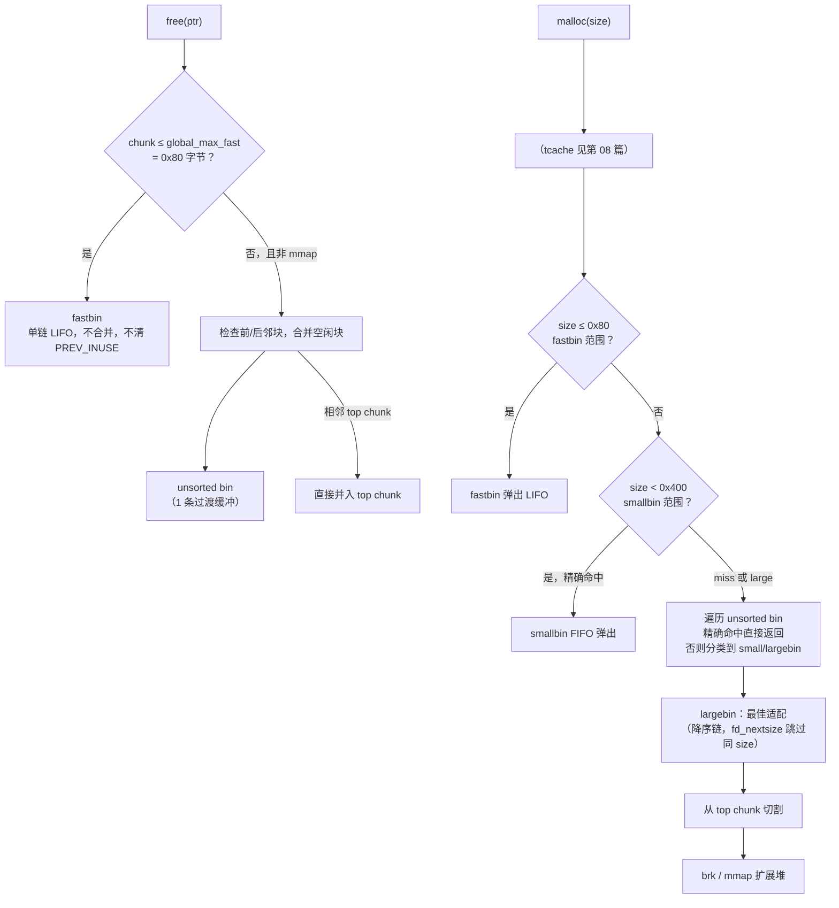

# 内存与堆（07）· ptmalloc2的bins与空闲管理

## 概述与定位

> [!abstract] TL;DR
> - ptmalloc2 用 **5 类空闲容器**管理释放的 chunk：**fastbin**（单链 LIFO，≤0x80 字节，≈10 条）、**unsorted bin**（1 条，过渡缓冲）、**smallbin**（62 条双链 FIFO，<0x400 字节固定大小）、**largebin**（63 条双链，按范围降序）、**top chunk**（堆顶剩余）。
> - 本章不含 tcache——tcache（glibc ≥2.26）优先于所有 bin，详见 [[08.tcache机制]]。
> - **malloc 查找顺序（不含 tcache）**：fastbin → smallbin（精确命中）→ unsorted bin（遍历并分类）→ largebin → top chunk → `brk`/`mmap` 扩展。
> - fastbin **不清 `PREV_INUSE`、不与邻块合并**，是性能与安全的主要取舍点；`malloc_consolidate` 才将 fastbin 内容并入 unsorted bin。
> - small/large bin 共用 `bins[]` 数组；`binmap` 位图加速跳过空 bin。

上一篇 [[06.ptmalloc2的chunk结构]] 讲透了 `malloc_chunk` 的字节布局与低 3 位标志（`PREV_INUSE`/`IS_MMAPPED`/`NON_MAIN_ARENA`）。本篇向上一层：当 `free` 把 chunk 还给分配器后，它被放进哪条"货架"？下次 `malloc` 又按什么顺序从货架上取货？这正是 **bins**（箱组）的职责——按 chunk 大小分门别类缓存空闲块，使后续分配尽量复用旧内存而不总向内核申请。

---

## 原理与机制

### 整体架构

ptmalloc2 的空闲管理遵循一条核心思想：**按大小分级，小而频繁的走快速路径（fastbin），大而少见的走精确路径（small/largebin），中间用 unsorted bin 做缓冲，超过所有 bin 能力才切顶或扩堆**。



### malloc 查找顺序（不含 tcache）

| 优先级 | 容器 | 条件 |
|---|---|---|
| 1 | fastbin | 请求 size ≤ 0x80 且对应 fastbin 非空 |
| 2 | smallbin | 请求 size < 0x400 且对应 bin 精确命中 |
| 3 | unsorted bin | 遍历分类，精确命中时直接返回 |
| 4 | largebin | 大小范围匹配，best-fit |
| 5 | top chunk | 切割 top 满足请求 |
| 6 | `brk`/`mmap` | top 不足，向内核扩展 |

> [!note] 以上顺序在 glibc 2.26+ 前提下省略了 tcache 层（见第 08 篇）。tcache 的优先级高于 fastbin 和 smallbin。

---

## 结构详解

### fastbin（快速箱）

**定位**：处理生命周期短、反复分配/释放的小对象（如临时缓冲区、小型节点）。牺牲合并换速度。

**数量与范围**：
- 约 **10** 条（`fastbinsY[NFASTBINS]`，`NFASTBINS = 10`），按 16 字节步进。
- 默认覆盖 `MIN_FAST`（0x20，含头）到 `global_max_fast`（**0x80** 即 128 字节）的 chunk。
- `global_max_fast` 可通过 `mallopt(M_MXFAST, ...)` 调整，但默认值即 0x80。

**数据结构**：单向链表（`fd` 指针），LIFO（后入先出）。

```
fastbinsY[0]  → chunk(0x20) → chunk(0x20) → NULL   （size=0x20，index=0）
fastbinsY[1]  → chunk(0x30) → NULL                  （size=0x30，index=1）
...
fastbinsY[9]  → chunk(0x80) → NULL                  （size=0x80，index=9）
```

**关键设计决策**：
- **不清 `PREV_INUSE`**：fastbin chunk 的下一物理 chunk 的 `PREV_INUSE` 位仍置 1，使相邻空闲块检测失效，防止触发合并。
- **不与邻块合并**：`free` 进 fastbin 时跳过前/后向合并，速度极快。
- **`malloc_consolidate`**：当 `malloc` 请求大 chunk 且 fastbin 非空时触发，将所有 fastbin chunk 并入 unsorted bin 并做合并，防止碎片无限积累。

**大小索引计算**（glibc malloc.c 记号）：

```c
/* fastbin 索引：(sz >> 4) - 2，sz 为 chunk 实际大小（含头） */
#define fastbin_index(sz)  ((sz) >> (SIZE_SZ == 8 ? 4 : 3)) - 2)
/* 例：chunk size = 0x30 → (0x30 >> 4) - 2 = 3 - 2 = 1 → fastbinsY[1] */
```

---

### unsorted bin（无序箱）

**定位**：free 的 chunk（非 fastbin 大小、非 mmap）先进 unsorted bin，作为"**延迟分类**"的过渡缓冲。它是双链表中索引 1 的 bin（`bins[1]`）。

**数量**：**1** 条。

**工作流程**：
1. `free(ptr)` → 相邻空闲块合并 → 合并结果入 unsorted bin 头部。
2. 下次 `malloc` 时遍历 unsorted bin：
   - 若某 chunk **精确命中**请求大小，直接返回（可能切割出 `last_remainder`）。
   - 否则，按大小将该 chunk 分类放入对应的 small/largebin，继续遍历。

**`last_remainder`**：当 unsorted bin 中的大 chunk 被切割后剩余部分（remainder），暂时留在 unsorted bin 中，作为下次分配的优先候选，对连续小分配有缓存局部性优化。

**双链维护**：

```c
/* unsorted bin 是 bins[1]，双向循环链（fd/bk） */
/* 插入头部（LIFO for free，FIFO-ish for scan） */
bck = unsorted_chunks(av);  /* av = arena */
fwd = bck->fd;
p->fd = fwd;
p->bk = bck;
fwd->bk = p;
bck->fd = p;
```

---

### smallbin（小对象箱）

**定位**：精确大小缓存，FIFO 语义（先入先出），适合请求固定大小且反复使用的对象。

**数量**：**62** 条（`bins[2]` 到 `bins[63]`，index 2–63），按 16 字节步进。

**大小范围**（x86-64）：

| smallbin index | chunk size（字节） | 用户请求范围（约）|
|---|---|---|
| 2（bins[2]） | 0x20 | 1–8 |
| 3（bins[3]） | 0x30 | 9–24 |
| … | … | … |
| 63（bins[63]） | 0x3f0 | ≤0x3e0（992 字节） |

- 覆盖 chunk size < **0x400**（1024 字节）的范围（x86-64 64 位）。
- 同一 bin 内 chunk **大小完全相同**（固定 size），无需再做 best-fit。

**FIFO 语义**：

```
smallbin[idx] head ↔ chunk_A ↔ chunk_B ↔ chunk_C ↔ tail
free 时插入 head 端（最新），malloc 时从 tail 端取出（最旧）
→ 先入先出，提升缓存时间局部性
```

**合并**：相邻空闲块（非 fastbin）会在 `free` 时合并（检查 `PREV_INUSE`），合并后转入 unsorted bin。

---

### largebin（大对象箱）

**定位**：处理大 chunk（≥1024 字节），每条 bin 覆盖一个**大小范围**（而非固定大小），内部按 size 降序排列，使用 best-fit 分配策略。

**数量**：**63** 条（`bins[64]` 到 `bins[126]`）。

**大小范围分布**（x86-64，选取）：

| largebin index（bins[]） | chunk size 范围 | 步进粒度 |
|---|---|---|
| 64（bins[64]）| 0x400–0x430 | 0x40 |
| 72（bins[72]）| 0x800–0xbf0 | 0x40 |
| 80（bins[80]）| 0x1000–0x17f0 | 0x80 |
| … | … | 越大步进越粗 |
| 126（bins[126]）| 极大 chunk | 不限 |

- 越大的 chunk 范围越宽，防止 bin 数量膨胀。

**内部排序**：同一 largebin 内 chunk 按 size **降序**排列（最大的在头部），使用 `fd_nextsize`/`bk_nextsize` 字段跳过同 size 的 chunk，快速定位下一个不同 size 的节点。

```
largebin[idx] head
  → chunk(0x460) ─fd_nextsize→ chunk(0x440) ─fd_nextsize→ chunk(0x420)
    ↕ bk_nextsize               ↕ bk_nextsize
    (同 size 的 chunk 通过 fd/bk 串联，fd_nextsize 跳过整个同 size 组)
```

**best-fit 分配**：`malloc` 在 largebin 中找到满足 size 需求的最小可用 chunk（降序链中第一个 `≥ request` 的），切割后余块入 unsorted bin（`last_remainder` 策略）。

---

### top chunk（wilderness，堆顶剩余）

**定位**：arena 中"最顶部"的特殊 chunk，代表已向内核申请但尚未分配给用户的内存。

- `malloc_state.top` 指向 top chunk。
- 所有 bin 都无法满足请求时，从 top chunk **切割**：
  - top chunk size ≥ request + MINSIZE（需保留最小 top）→ 切割，余下部分继续作 top。
  - top chunk 不够 → 调 `sbrk`（`brk`）扩展 main_arena 的堆，或 `mmap` 扩展线程 arena。
- `free` 若释放的 chunk 与 top 相邻，直接合并入 top（top chunk 不进 unsorted bin）。

---

### bins[] 数组组织与 binmap

small/large bin 共用 `malloc_state.bins[]` 数组（128 项，每项是双链表头节点的 `fd`/`bk` 对）：

```
bins[0]  = 未使用（占位）
bins[1]  = unsorted bin
bins[2]  ~ bins[63]  = 62 个 smallbin（index 2–63）
bins[64] ~ bins[126] = 63 个 largebin（index 64–126）
```

**`binmap` 位图**：`malloc_state.binmap[4]`（128 位），每位对应一个 bin 是否非空。`malloc` 在遍历 small/largebin 前先查 `binmap`，用 `next_bit` 快速跳过空 bin，避免逐个检查 128 条链表。

```c
/* binmap 操作（glibc malloc.c 伪代码） */
#define mark_bin(m,i)    ((m)->binmap[idx2block(i)] |=  idx2bit(i))
#define unmark_bin(m,i)  ((m)->binmap[idx2block(i)] &= ~idx2bit(i))
#define get_binmap(m,i)  ((m)->binmap[idx2block(i)] &  idx2bit(i))
```

---

### 各类 bin 数量与特性对比

| 类型 | 数量 | 链表形式 | 顺序 | chunk 大小 | 合并 | 特殊字段 |
|---|---|---|---|---|---|---|
| fastbin | ≈10（NFASTBINS=10） | 单链 | LIFO | 固定（≤0x80） | 不合并 | — |
| unsorted bin | 1 | 双链循环 | 无序（过渡） | 任意（非 fast/mmap） | 合并 | `last_remainder` |
| smallbin | 62 | 双链循环 | FIFO | 固定，按 16B 步进 | 合并 | — |
| largebin | 63 | 双链循环 | 降序（size） | 范围，步进递增 | 合并 | `fd_nextsize`/`bk_nextsize` |
| top chunk | 1（特殊） | 无链表 | — | 剩余全部 | 与邻块合并 | `malloc_state.top` |

---

## 实战：pwndbg 观察各 bin

> [!warning] 示例输出为示意

以下展示在 glibc 2.31 调试会话中，`pwndbg` 的 `bins` 命令典型输出。

### 查看 fastbin

```
pwndbg> fastbins
fastbins
0x20: 0x0
0x30: 0x0
0x40: 0x555555559290 ◂— 0x0    ← size=0x40 的 fastbin，1 个 chunk
0x50: 0x0
0x60: 0x555555559250 —▸ 0x555555559210 ◂— 0x0    ← 2 个 chunk，LIFO
0x70: 0x0
0x80: 0x0
```

> [!warning] 示例输出为示意

### 查看 unsorted/small/largebin

```
pwndbg> bins
tcachebins    （见第 08 篇）
fastbins
  (empty)
unsortedbin
  all: 0x555555559360 —▸ 0x7ffff7fb3be0 (main_arena+96) ◂— 0x555555559360
smallbins
  (empty)
largebins
  0x400-0x430: 0x555555559360 —▸ 0x7ffff7fb3fd0 (main_arena+1072) ◂— 0x555555559360
```

> [!warning] 示例输出为示意

- `unsortedbin` 显示 1 条双链，chunk 地址 ↔ `main_arena+96`（unsorted bin 头的 `fd`/`bk` 指针）。
- largebin 显示 chunk 地址指向 `main_arena+1072`（对应 largebin[0] 头节点）。

### 查看 top chunk

```
pwndbg> top_chunk
Top chunk | PREV_INUSE
Addr: 0x5555555593a0    ← top chunk 起始地址（示意）
Size: 0x20c61           ← top chunk 剩余大小（示意）
```

> [!warning] 示例输出为示意

### pwndbg 实用命令速查

| 命令 | 用途 |
|---|---|
| `bins` | 显示所有 bin（tcache/fastbin/unsorted/small/large） |
| `fastbins` | 单独展示 fastbin |
| `heap` | 遍历 arena 内所有 chunk（含 in-use/free） |
| `top_chunk` | 显示 top chunk 地址与大小 |
| `vis_heap_chunks` | 可视化 chunk 布局（含颜色编码） |
| `p main_arena` | 打印 `malloc_state` 结构，含 `fastbinsY`、`bins`、`top` 字段 |

---

## 安全性与正确使用

### fastbin 的脆弱性——防御视角

fastbin 的"快"来自于三个绕过：不清 `PREV_INUSE`、不合并、检查宽松。这带来了几类经典的攻击面：

#### 1. fastbin dup（双重释放制造环）

fastbin 在某些旧版本 glibc 只检查链表头是否与即将插入的 chunk 相同，不遍历整个链表。攻击者可通过以下步骤制造环：

```
free(A)  → fastbin: A → NULL
free(B)  → fastbin: B → A → NULL   （插入 B，此时头是 B，非 A，绕过浅层检查）
free(A)  → fastbin: A → B → A → … （环！重复释放）
```

环成立后，连续 3 次 `malloc` 第 3 次返回 A；此时用户写入 A 的 `fd` 字段，即控制了下次 `malloc` 的返回地址——**任意地址分配原语**。

> **防御（glibc 2.32+）**：fastbin 取出路径引入 **safe-linking**（指针异或混淆，`stored_fd = real_fd ^ (chunk_addr >> 12)`），攻击者需泄露堆地址才能精确控制目标；此外 2.29+ tcache 的 `key` 字段已为 tcache 的 double free 提供直接检测，使大多数双重释放在 tcache 层就被拦截。

#### 2. fastbin 不合并导致碎片积累

fastbin chunk 长期不合并会导致堆顶被细小空洞填满，top chunk 虽还有空间但无法利用相邻空洞。`malloc_consolidate` 周期性合并可缓解，但在分配模式单一时仍可能导致显著内存碎片。**防御**：设计分配器使用方时，避免反复分配/释放 fastbin 大小的对象与大对象混用同一 arena，或使用 tcmalloc/jemalloc 替代。

#### 3. 不清 `PREV_INUSE` 的后果

fastbin chunk 释放后相邻块不知道它是空闲的（`PREV_INUSE` 仍为 1），若后者被 free 时依赖 `PREV_INUSE` 判断是否前向合并，会**错误认为 fastbin chunk 仍在使用中**，跳过合并——这正是 fastbin 设计的初衷，但攻击者可利用此特性在溢出场景下阻止合并触发的 unlink 校验。

### bin 完整性检查的意义

ptmalloc2 在 `free` 的 unlink 路径上强制校验双向链表一致性：

```c
/* glibc malloc.c unlink 宏（示意） */
if (__builtin_expect(FD->bk != P || BK->fd != P, 0))
    malloc_printerr("corrupted double-linked list");
```

该校验封堵了经典的"unlink 任意写"技术（老版 glibc <2.3.6 中，伪造 `fd`/`bk` 可在 unlink 时向任意地址写任意值）。**当前防御层次**：

| 校验/机制 | 针对的威胁 | glibc 版本 |
|---|---|---|
| unlink 双链一致性校验 | 伪造 fd/bk 的 unlink 任意写 | 2.3.6+ |
| fastbin size 校验（取出时） | 伪造 fake chunk 大小不匹配 fastbin | 2.x+ |
| safe-linking（tcache/fastbin fd 混淆） | 直接控制 fd 指向任意地址 | 2.32+ |
| tcache key 防 double free | tcache 双重释放 | 2.29+ |
| chunk size 范围与对齐校验 | 膨胀/越界 size | 持续加固 |

> 安全建议（防御视角）：生产程序应开启 **Full RELRO + PIE + NX + Stack Canary**；高安全场景考虑 **hardened_malloc** 或 **scudo**（LLVM）等加固分配器，它们从分配器设计层面隔离元数据与用户数据。详见 [[24.内存管理与堆分配器/13.内存安全与调试]]；利用视角互补参见 [[33.二进制漏洞与利用基础/10.堆漏洞入门.md]]。

---

## 小结

1. **5 类空闲容器，各司其职**：fastbin 快速处理小对象（≤0x80，LIFO，不合并）；unsorted bin 做延迟分类缓冲（1 条双链）；smallbin 精确匹配固定大小（62 条，FIFO，<0x400）；largebin best-fit 覆盖大对象（63 条，降序，fd_nextsize 跳过同 size）；top chunk 兜底并向内核扩展。
2. **malloc 查找链（不含 tcache）**：fastbin → smallbin（精确）→ unsorted scan + 分类 → largebin → top → `brk`/`mmap`。
3. **`bins[]` + `binmap`**：small/large bin 共用同一数组，`binmap` 位图让跳过空 bin 的代价降至 O(1)，是 128 条链表高效遍历的关键。
4. **fastbin 的代价**：速度来自绕过合并与检查，同时带来碎片和利用面；`malloc_consolidate` 周期性将 fastbin 纳入主流路径做合并。
5. **防御是分层的**：unlink 校验、safe-linking、tcache key 各自针对特定攻击路径，现代 glibc 在分配器层已大幅收窄攻击面，但根本防御仍在应用层（智能指针/RAII、free 后置 NULL、ASan 测试）。

---

## 相关阅读

- **chunk 结构前置（prev_size/size/fd/bk/标志位）**：[[06.ptmalloc2的chunk结构]]
- **tcache（优先于 fastbin/smallbin，下一篇）**：[[08.tcache机制]]
- **malloc/free 完整决策链（流程全景）**：[[09.malloc与free分配释放流程]]
- **堆漏洞防御视角（互补）**：[[33.二进制漏洞与利用基础/10.堆漏洞入门.md]]、[[33.二进制漏洞与利用基础/09.堆管理基础.md]]
- **防护机制全貌（RELRO/safe-linking/加固分配器）**：[[34.现代二进制防护机制/00.现代二进制防护机制总览]]

---

⬅️ 上一篇 [[06.ptmalloc2的chunk结构]] ｜ 🏠 [[00.内存管理与堆分配器总览]] ｜ 下一篇 [[08.tcache机制]] ➡️
