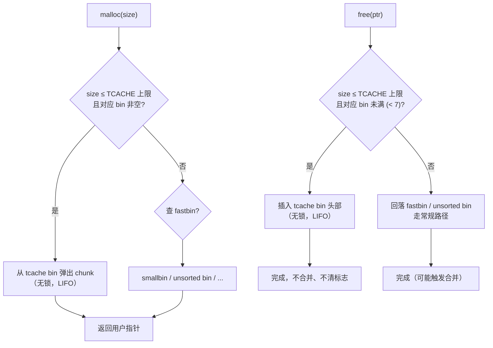

# 内存与堆（08）· tcache机制

## 概述与定位

> [!abstract] TL;DR
> - **tcache**（Thread-Local Cache）由 glibc **≥ 2.26** 引入，是 ptmalloc2 的**每线程私有、无锁**快速缓存层。
> - malloc/free 对小块内存**优先命中 tcache**，无需获取 arena 锁，显著降低多线程竞争开销。
> - 核心结构：每线程一个 `tcache_perthread_struct`（本身分配在堆上），含 **64 个 bin**，每 bin 最多 **7 个** chunk（`TCACHE_FILL_COUNT=7`），**单链表 LIFO**。
> - 安全加固演进：glibc **≥ 2.29** 加入 `key` 字段检测 double free；glibc **≥ 2.32** 引入 **safe-linking**，对 `next` 指针异或混淆，提高指针伪造难度。
> - 防御视角：理解 tcache 结构有助于借助 ASan/Valgrind 检测自有程序的内存漏洞，了解 `key` 与 safe-linking 如何层叠提升加固门槛。

上一篇 [[07.ptmalloc2的bins与空闲管理]] 详细介绍了 ptmalloc2 的 fastbin、unsorted bin、smallbin、largebin 结构与计数。本篇聚焦 **tcache 这一优先级最高的分配/释放路径**：讲清其引入动机、核心数据结构、64 bin × 7 slot 的组织方式、`key` 防护机制与 safe-linking 加固，并从防御视角分析 tcache poisoning、double free 的成因及检测手段。

---

## 原理与机制

### tcache 的引入动机

传统 ptmalloc2 的每次 malloc/free 都需要**竞争 arena 的互斥锁**（`struct malloc_state::mutex`）。在多线程高并发场景下，锁竞争成为性能瓶颈：即使每个线程拥有独立的线程 arena，同一 arena 上的并发操作仍需串行。

tcache 的设计思路来自 tcmalloc 等现代分配器：为每个线程维护**一块完全私有的 chunk 缓存**，在常见的小块分配/释放场景下**绕过 arena 锁**，直接在线程本地完成操作，实现真正的零竞争。

tcache 命中条件：
- 请求大小在 tcache 管理范围内（≤ 约 1032 字节，64 位）
- 对应 bin 非空（malloc 时）或未满（free 时）

一旦 tcache 命中，整个操作**不触碰任何 arena、不获取任何锁**，相比原路径可节省大量同步开销。

### tcache 优先路径



> [!note] tcache 不合并相邻 chunk，也不清除 `PREV_INUSE` 标志——这与 fastbin 行为一致，合并操作仅发生在 unsorted/small/large bin 路径上。

---

## 结构详解

### tcache_perthread_struct

每个线程（首次调用 malloc 时）在**堆上**分配一个 `tcache_perthread_struct`，该结构自身占用一个 chunk，地址存储于线程私有的指针（`tcache`）：

```c
/* glibc malloc/malloc.c（简化，基于 glibc 2.31 记号） */
typedef struct tcache_entry {
    struct tcache_entry *next;            /* 单链表，指向下一个空闲 chunk */
    struct tcache_perthread_struct *key;  /* ≥2.29：指向本线程 tcache 结构，用于 double-free 检测 */
} tcache_entry;

typedef struct tcache_perthread_struct {
    uint16_t counts[TCACHE_MAX_BINS];    /* 每 bin 当前缓存的 chunk 数量 */
    tcache_entry *entries[TCACHE_MAX_BINS]; /* 每 bin 链表头指针 */
} tcache_perthread_struct;
```

| 字段 | 类型 | 说明 |
|---|---|---|
| `counts[64]` | `uint16_t[64]` | 每个 bin 已缓存的 chunk 个数，最大 `TCACHE_FILL_COUNT=7` |
| `entries[64]` | `tcache_entry*[64]` | 每个 bin 的链表头，LIFO；NULL 表示该 bin 为空 |

`tcache_perthread_struct` 本身**以普通 chunk 形式分配在堆上**，位于进程堆区的较低地址（每线程第一次 malloc 触发创建），大小约为 `sizeof(tcache_perthread_struct) + chunk_header`。

### 64 个 bin 的覆盖范围

tcache 使用固定数量的 bin，与 chunk 大小一一对应：

| 常量 | 值 | 说明 |
|---|---|---|
| `TCACHE_MAX_BINS` | **64** | bin 的总数量 |
| `TCACHE_FILL_COUNT` | **7** | 每个 bin 最多缓存 chunk 数 |

在 x86-64（`SIZE_SZ=8`，`MALLOC_ALIGNMENT=16`）上，bin 下标与 chunk 大小的对应关系：

```
bin 索引    chunk 大小（含 header）
  0          0x20  (32  字节)
  1          0x30  (48  字节)
  2          0x40  (64  字节)
  ...        每步增加 0x10 (16 字节)
  63         0x410 (1040 字节，即约 1032 字节用户数据)
```

即 tcache 覆盖最小 chunk（`MINSIZE = 0x20`）到约 **1032 字节用户数据**（对应 0x410 大小 chunk）的所有小 chunk。超出此范围的请求直接走 largebin 或 mmap 路径，不经 tcache。

### tcache_entry 与 key 字段

`tcache_entry` 覆盖在 chunk 的**用户数据区头部**（与 `fd`/`bk` 的复用类似）：

```
in-use chunk：
  [ prev_size | size | ←用户数据→ ]

free'd chunk（进入 tcache 后）：
  [ prev_size | size | next (tcache_entry.next) | key (tcache_entry.key) | ... ]
                        ↑ 用户数据区起始
```

- `next`：指向同 bin 下一个空闲 chunk（构成单链表）。
- `key`（**glibc ≥ 2.29**）：`free` 时写入当前线程 `tcache_perthread_struct` 的地址。再次 `free` 同一 chunk 时，glibc 检测到 `key` 已指向有效的 tcache 结构，立即报告 **double free detected** 并调用 `abort()`：

```c
/* glibc 2.29+ free 路径（简化伪代码）*/
if (e->key == tcache) {
    /* key 命中当前 tcache 结构 → double free */
    malloc_printerr("free(): double free detected in tcache N");
}
e->key = tcache;  /* 写入 key，标记"已在 tcache 中" */
```

`key` 让早期对 tcache double free 的无成本利用变得困难：攻击者在再次 free 前必须先通过 UAF 写清除 `key` 字段，增加了操作复杂度。

### safe-linking（glibc ≥ 2.32）

glibc 2.32 为 tcache 和 fastbin 引入 **safe-linking**：`next` 指针在写入 chunk 时不再明文存储，而是与所在位置地址的高位进行异或（**PROTECT_PTR**）：

```
PROTECT_PTR(pos, ptr) = (pos >> 12) ^ ptr
REVEAL_PTR(pos, mptr)  = (pos >> 12) ^ mptr   /* 还原 */
```

其中 `pos` 为存储 `next` 字段的内存地址（即 chunk 的用户数据起始地址），`ptr` 为明文 `next` 值。

**写入（free 时）**：
```c
tcache_entry *e = /* chunk 用户区起始 */;
e->next = PROTECT_PTR(&e->next, tcache->entries[tc_idx]);
```

**读出（malloc 时）**：
```c
tcache_entry *e = tcache->entries[tc_idx];
tcache->entries[tc_idx] = REVEAL_PTR(&e->next, e->next);
```

#### 为什么用 `pos >> 12`？

页大小为 4096（0x1000），`pos >> 12` 丢弃页内偏移，保留页号。对于同一页内的地址，`pos >> 12` 相同——这个"页号掩码"充当线程/进程私有的随机盐（依赖 ASLR 使堆地址随机）。攻击者若不知道 `pos` 的具体值（即需先**泄露堆地址**），便无法计算正确的异或值，无法将 `next` 精确伪造到目标地址。

#### 保护效果与局限

| 场景 | 有无保护 |
|---|---|
| 攻击者修改 `next` 为明文 `evil_addr` | 取出时变为 `(pos>>12) ^ evil_addr`，偏离预期 |
| 攻击者已泄露精确堆地址 | 可计算正确异或值，绕过 safe-linking |
| 相邻 chunk 溢出（不修改 `next`，修改其他字段） | safe-linking 无效 |

safe-linking 提高了门槛（需要额外的信息泄露步骤），但并非绝对防线，通常配合 ASLR、PIE、Full RELRO 组成纵深防御。

---

## 防御分析

本节从**防御视角**解析 tcache poisoning 和 double free 的**成因**，以及加固措施如何逐步提升利用门槛。

### tcache poisoning 成因

tcache 是**单链表 LIFO、无围栏校验**的设计——早期版本仅检查 `counts` 和 `size` 范围，对 `next` 指针内容完全信任：

```
tcache bin[N] → chunk_A → chunk_B → NULL
```

若攻击者（通过 UAF 或堆溢出）能修改已释放 `chunk_A` 的 `next` 字段：

```
tcache bin[N] → chunk_A → evil_addr  ← 篡改！
```

则连续两次 `malloc(N字节)`：
1. 第 1 次弹出 `chunk_A`（正常 chunk，返回给调用者）。
2. 第 2 次弹出 `evil_addr`（被误认为合法空闲 chunk）——写此"chunk"即向 `evil_addr` 写任意值。

**成因核心**：单链表 `next` 可被外部修改，且老版本无任何链表完整性校验。

glibc 2.32 引入 safe-linking 后，`next` 明文被替换为 `PROTECT_PTR` 值，直接写 `evil_addr` 会被异或成乱码地址，需额外泄露堆地址才能精确控制——门槛显著提高。

### double free 成因与 key 检测

早期（glibc < 2.29）tcache 的 double free：

```
初始：tcache[0x30] → chunk_A → NULL
free(ptr):  tcache[0x30] → chunk_A → chunk_A  （环！）
```

`chunk_A` 出现两次——首次 malloc 弹出后，`next` 指向自身，再次 malloc 同样返回 `chunk_A`。此时 `chunk_A` **同时被用户持有并存在于 tcache 链**，对其写操作直接篡改 tcache 链的下一个 `next` 指针。

**glibc 2.29 key 检测的工作方式**：

```
free(ptr) 第 1 次：
  检查 e->key：为 0（未初始化）→ 正常插入
  写 e->key = tcache（当前线程 tcache_perthread_struct 地址）

free(ptr) 第 2 次：
  检查 e->key：等于 tcache → double free detected → abort()
```

攻击者要绕过 key 检测，必须在两次 free 之间通过 UAF **将 key 字段清零或改为其他值**，这需要额外的原语——使利用链更加复杂。

### key + safe-linking 的层叠防御

```
glibc 版本   防御措施                      利用门槛
< 2.26       无 tcache，fastbin 路径       需绕过 fastbin double free 检测
≥ 2.26       引入 tcache，无 key           tcache double free 无开销
≥ 2.29       tcache key                   需 UAF 清除 key 字段
≥ 2.32       safe-linking（PROTECT_PTR）  需额外信息泄露（堆地址）
```

每一代加固都直接针对前一代暴露的攻击手法，防御能力层叠累加。

---

## 安全性与正确使用

### 自有程序的 double free 检测

对于 **C/C++ 项目**，tcache 的 `key` 检测和 safe-linking 都属于 glibc 运行时层面的检测，对开发者而言是"最后一道防线"。建议在开发/测试阶段主动引入更早、更精确的检测工具：

#### AddressSanitizer（ASan）

```bash
# 编译时插桩：检测 double free、UAF、堆溢出（开发/CI 阶段使用）
gcc -g -fsanitize=address -fno-omit-frame-pointer -o prog prog.c

# 或 clang 版本
clang -g -fsanitize=address -fno-omit-frame-pointer -o prog prog.c
```

ASan 在每次 `free` 后将 chunk 标记为"中毒"（poisoned），任何后续读写触发立即报告，精确到源码行号，远早于 glibc key 检测介入。

```bash
# 示例：double free 时 ASan 输出片段（示意，非本机实跑）
==1234==ERROR: AddressSanitizer: attempting double-free on address 0x602000000010
    #0 0x... in free ...
    #1 0x... in main prog.c:8
```

> [!warning] 示例输出为示意

#### Valgrind/memcheck

```bash
# 无需重新编译，运行时检测（约 10–20x 性能开销，适合功能测试）
valgrind --tool=memcheck --leak-check=full ./prog
```

#### GWP-ASan（生产采样）

Android / glibc 2.32+ 支持 GWP-ASan，以极低采样率在生产环境中检测堆漏洞，无需全量 ASan 开销。

### 合规边界与正确使用

| 场景 | 推荐做法 |
|---|---|
| C 语言手动内存管理 | `free` 后立即将指针置 `NULL`，防止悬垂指针被意外解引用 |
| C++ 对象生命周期 | 优先使用 `std::unique_ptr` / `std::shared_ptr`（RAII），从语言层消除 UAF 和 double free |
| 开发/CI 阶段 | 开启 ASan（`-fsanitize=address`）或 Valgrind，捕获内存错误 |
| 生产编译加固 | Full RELRO + PIE + NX + Stack Canary（`-fPIE -pie -Wl,-z,relro,-z,now -fstack-protector-strong`） |
| 安全研究与 CTF | 在**隔离的教学/实验环境**中分析缓解机制；不对真实第三方软件构造或部署利用载荷 |

> [!warning] tcache poisoning、double free 利用链属于**自有程序安全评估和 CTF 学习**范畴。针对真实第三方软件的武器化利用链超出本系列讨论边界。

---

## 观察：pwndbg 查看 tcache 状态

在 gdb + pwndbg 环境中，可用以下命令直接审查 tcache 状态：

```bash
# 查看 tcache 所有 bin 及每 bin 链表头
pwndbg> tcache

# 查看当前非空 tcache bin（更简洁）
pwndbg> tcachebins
```

> [!warning] 示例输出为示意（非本机实跑，本机 Windows 环境，需 Linux + glibc + pwndbg）

```
pwndbg> tcachebins
tcachebins
0x20 [2]: 0x555555559300 —▸ 0x555555559280 ◂— 0x0
0x30 [1]: 0x5555555592e0 ◂— 0x0
```

> [!warning] 示例输出为示意

**字段解读**：
- `0x20 [2]`：对应 chunk 大小 0x20、当前缓存 2 个 chunk。
- 地址链：链表从头到尾，最终以 `0x0`（NULL）结尾。
- glibc ≥ 2.32 时，上述地址实为 `PROTECT_PTR` 值（异或后），pwndbg 会自动还原为明文显示。

```bash
# 查看 tcache_perthread_struct 本身（通常位于 heap 起始 +0x10 附近）
pwndbg> heap
```

> [!warning] 示例输出为示意

---

## 小结

1. **tcache 是 ptmalloc2 的无锁快速路**：glibc ≥ 2.26 引入，每线程私有、malloc/free 优先命中，显著减少多线程锁竞争。
2. **核心结构**：`tcache_perthread_struct`（堆上分配）持有 64 个 bin（`TCACHE_MAX_BINS=64`），每 bin 最多 7 个 chunk（`TCACHE_FILL_COUNT=7`），`tcache_entry.next` 构成单链表 LIFO；`key` 字段（≥2.29）指向本线程 tcache 结构用于 double free 检测。
3. **bin 覆盖范围**：64 位下 idx 0–63 对应 chunk 大小 0x20–0x410（步进 0x10），即用户数据最大约 **1032 字节**。
4. **安全加固演进**：`key`（≥2.29）让 double free 在检测点立即 abort；safe-linking（≥2.32）用 `PROTECT_PTR = (pos>>12) ^ ptr` 对 `next` 指针异或，使指针伪造需额外泄露堆地址。
5. **防御要点**：自有程序应在开发阶段用 ASan/Valgrind 及早发现 double free/UAF；生产开启 Full RELRO + PIE + NX 组成纵深防御；C++ 优先选择 RAII 智能指针从语言层消除问题。
6. 下一篇 [[09.malloc与free分配释放流程]] 将把 tcache 路径嵌入 malloc/free 的完整决策链，展示 tcache → fastbin → unsorted → small/large bin → top chunk → mmap 的全貌。

---

## 相关阅读

- **堆漏洞入门（利用视角，与本篇防御互补）**：[[33.二进制漏洞与利用基础/10.堆漏洞入门.md]]
- **防护机制全貌（safe-linking / 加固分配器）**：[[34.现代二进制防护机制/00.现代二进制防护机制总览.md]]
- **ptmalloc2 bins 体系（tcache 的回落路径）**：[[07.ptmalloc2的bins与空闲管理]]
- **malloc/free 完整决策链（tcache 在其中的位置）**：[[09.malloc与free分配释放流程]]
- **C++ RAII 与对象内存布局（防 UAF 的语言层手段）**：[[23.C_C++运行时与ABI/06.对象内存布局与this指针.md]]

---

⬅️ 上一篇 [[07.ptmalloc2的bins与空闲管理]] ｜ 🏠 [[00.内存管理与堆分配器总览]] ｜ 下一篇 [[09.malloc与free分配释放流程]] ➡️
