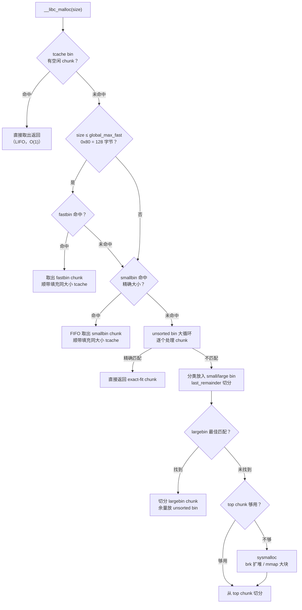
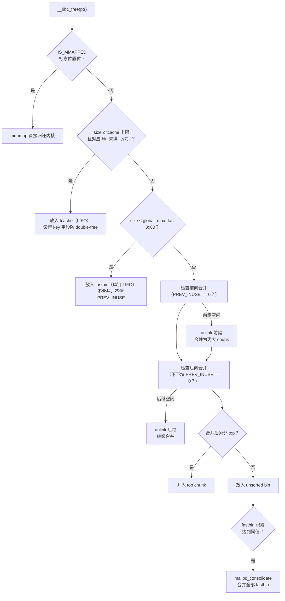
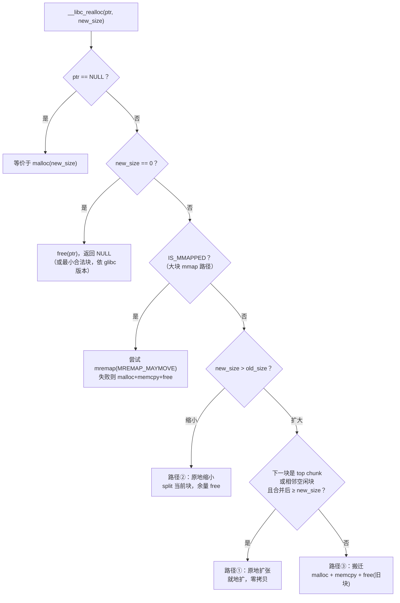

# 内存与堆（09）· malloc 与 free 分配释放流程

## 概述与定位

> [!abstract] TL;DR
> `malloc` 和 `free` 是用户态内存管理的两个核心入口。glibc ptmalloc2 在两者内部各有一条精密的决策链：**malloc** 从最快的 tcache 出发，逐级向 fastbin、smallbin、unsorted bin、largebin 过渡，最终兜底到 top chunk 或向内核申请（`sysmalloc`）；**free** 则按 mmap 标志、tcache 容量、chunk 大小、相邻空闲状态，分别走不同路径，并在合适时机触发合并（`malloc_consolidate`）以抑制碎片。理解这两条决策链是读懂堆漏洞成因、性能分析与调试的基础。

本篇承接 [[08.tcache机制]]（tcache 数据结构与 double-free 检测）、[[07.ptmalloc2的bins与空闲管理]]（bins 结构与数量），重点描述 **`__libc_malloc` → `_int_malloc`** 与 **`__libc_free` → `_int_free`** 的完整决策链，并给出可在 gdb/pwndbg 中实际验证的观察方法。

---

## 原理与机制

### malloc 决策链总览



### free 决策链总览



---

## 流程详解

### 1. malloc 六步决策

#### 步骤 1：tcache 命中（最快路径）

`__libc_malloc` 首先调用 `tcache_get`，在当前线程的 `tcache_perthread_struct` 中查找对应大小的 bin（共 64 个，覆盖至约 1032 字节的 chunk）。命中即直接弹出头部 chunk，O(1) 返回，无需加锁。

```c
/* 源码级伪代码（基于 glibc malloc/malloc.c 记号） */
if (tc_idx < mp_.tcache_bins
    && tcache->counts[tc_idx] > 0) {
    return tcache_get(tc_idx);   /* 直接返回，最快路径 */
}
```

tcache 不存在时（glibc < 2.26），或 bin 已空，进入下一步。

#### 步骤 2：fastbin 查询

请求大小 ≤ `global_max_fast`（默认 **0x80 = 128 字节**）时，查对应的 fastbin 槽（数组 `fastbinsY[]`，约 10 条单链表，LIFO）。命中后弹出 chunk，并将同大小的 fastbin 中**剩余 chunk 批量填充到 tcache**，减少后续竞争。

> 关键：fastbin chunk 的 `PREV_INUSE` 位**不被清零**，相邻 chunk 的 `prev_size` 也**不更新**，因此 fastbin chunk 在 bin 中时仍呈"已分配"外观——这是 fastbin 不触发合并的根本原因。

#### 步骤 3：smallbin 精确匹配

smallbin 共 **62 条**，每条管理一个固定大小，覆盖 0x20 ~ 0x3f0 字节（< 0x400/1024 字节），双向循环链表，FIFO 取出。命中后同样批量填充 tcache。

#### 步骤 4：unsorted bin 大循环

对于不满足前三步的请求，`_int_malloc` 进入 **unsorted bin 大循环**（`while` 遍历整条链）：

```c
while ((victim = unsorted_chunks(av)->bk) != unsorted_chunks(av)) {
    bck = victim->bk;
    size = chunksize(victim);

    /* 精确匹配：直接返回 */
    if (size == nb) {
        /* 顺带填充 tcache（若目标 tcache bin 未满） */
        return victim;
    }

    /* 不匹配：按大小分类放入 smallbin 或 largebin */
    if (in_smallbin_range(size))
        place_chunk_in_smallbin(victim, size);
    else
        place_chunk_in_largebin(victim, size);

    /* last_remainder 切分（smallbin 大小范围且存在 last_remainder） */
    if (remainder_size >= MINSIZE) {
        set_head(remainder, remainder_size | PREV_INUSE);
        unsorted_chunks(av)->bk = unsorted_chunks(av)->fd = remainder;
        av->last_remainder = remainder;
    }
}
```

`last_remainder` 是上次 smallbin/unsorted 切分后留下的残余块，可直接从中再次切分，有利于减少碎片。

#### 步骤 5：largebin 最佳匹配（best-fit）

largebin 共 **63 条**，每条管理一段大小范围，内部按 size **降序**排列（利用 `fd_nextsize`/`bk_nextsize` 跳表快速定位）。`_int_malloc` 从最接近且 ≥ 请求大小的 chunk 切分，余量返还 unsorted bin。

#### 步骤 6：top chunk / sysmalloc

所有 bin 均无合适 chunk 时，从 **top chunk**（wilderness，堆顶）切分。top chunk 不足时调用 `sysmalloc`：

- 普通请求：`brk` 延伸 program break（一般扩充 `MINSIZE + nb + 0x20000` 以减少系统调用次数）；
- 大请求（≥ `M_MMAP_THRESHOLD`，默认 **128 KB**）：直接 `mmap(MAP_ANONYMOUS)`，置 `IS_MMAPPED` 标志，free 时 `munmap` 归还内核，**不经 bins**。

---

### 2. free 五步决策

#### 步骤 1：IS_MMAPPED → munmap

若 chunk 的 `size` 字段低 3 位中 `IS_MMAPPED`（0x2）置位，直接调 `munmap`，流程结束，无需经过任何 bin。

#### 步骤 2：放入 tcache（优先）

chunk 大小在 tcache 覆盖范围内（chunk size ≤ 约 1040 字节），且对应 tcache bin 的 `counts[tc_idx] < TCACHE_FILL_COUNT`（默认 **7**），则直接插入 tcache 链表头部，设置 `key` 字段（glibc ≥ 2.29 用于 double-free 检测）。

```c
/* 伪代码 */
if (tc_idx < mp_.tcache_bins
    && tcache->counts[tc_idx] < mp_.tcache_count) {
    tcache_put(p, tc_idx);   /* 设置 e->key = tcache，然后链入 */
    return;
}
```

#### 步骤 3：放入 fastbin（小块缓冲）

chunk size ≤ `global_max_fast`（0x80）时插入对应 fastbin 槽头部（单链 LIFO）。**不合并，不清 PREV_INUSE**，下一块 chunk 看到 PREV_INUSE 仍为 1 而不会尝试合并。

#### 步骤 4：合并 + 放入 unsorted bin

大于 fastbin 上限的 chunk 进入合并流程：

**前向合并（backward consolidation）**：检查前驱 chunk 是否空闲（当前 chunk `prev_size` 域 + `PREV_INUSE` 标志）。若前驱空闲则调 `unlink` 宏将其从 bin 中摘除，与当前 chunk 合并。

**后向合并（forward consolidation）**：读取后继 chunk 的 size，检查后继的后继 chunk 的 `PREV_INUSE` 是否为 0。若为 0（后继空闲），则 `unlink` 后继并合并。

合并后如果紧邻 top chunk，则**并入 top chunk**；否则放入 **unsorted bin**。

#### 步骤 5：malloc_consolidate（fastbin 合并）

> [!note] 触发时机说明
> `malloc_consolidate` **主要在 malloc 路径触发**（如大请求进入 unsorted bin 大循环前、或 `sysmalloc` 前），而非仅由 free 触发。free 流程图中将其画在末尾，是因为 free 大块时也可能间接触发（fastbin 积累超阈值），但这不是主路径；首要触发点是 `_int_malloc` 处理超出 smallbin 范围的请求时。

当检测到 fastbin 积累达到一定程度（通常由 `_int_malloc` 无法满足大请求时触发，也可能在 free 大块时触发），调 `malloc_consolidate`：遍历所有 fastbin，清 `PREV_INUSE`，逐一按正常合并逻辑归入 unsorted bin（可进一步合并相邻空闲块），随后 unsorted bin 大循环再次整理。

---

### 3. realloc 的三条路径

`realloc(ptr, new_size)` 的核心任务是把 `ptr` 指向的块调整到 `new_size` 字节。glibc 内部由 `__libc_realloc` → `_int_realloc` 实现，根据当前块与相邻内存的状态走三条截然不同的路径，性能差异巨大。



#### 路径①：原地扩张（零拷贝，最优）

**条件**：扩大请求时，当前块的**紧后继**是 top chunk 或一个空闲块，且合并后总大小 ≥ `new_size`。

```c
/* __libc_realloc / _int_realloc 伪码（扩张分支） */
oldp   = mem2chunk(ptr);          /* 用户指针 → chunk header */
oldsize = chunksize(oldp);
nb     = request2size(new_size);  /* 对齐后的 chunk 大小 */

nextp  = chunk_at_offset(oldp, oldsize);   /* 紧后继 chunk */

if (nextp == av->top) {
    /* 后继是 top chunk：直接把 top 向后推 */
    if (oldsize + chunksize(nextp) >= nb) {
        newsize = oldsize + chunksize(nextp);
        /* 就地扩展：更新当前块 size，收缩 top chunk */
        set_head(oldp, nb | (oldsize & NON_MAIN_ARENA) | PREV_INUSE);
        av->top = chunk_at_offset(oldp, nb);
        set_head(av->top, (newsize - nb) | PREV_INUSE);
        return chunk2mem(oldp);   /* 原指针原封不动返回，零拷贝 */
    }
} else if (!inuse(nextp)) {
    /* 后继是空闲块：unlink 后合并 */
    nextsize = chunksize(nextp);
    if (oldsize + nextsize >= nb) {
        unlink(av, nextp, bck, fwd);      /* 从 bin/tcache 摘出后继 */
        newsize = oldsize + nextsize;
        set_head(oldp, nb | PREV_INUSE);
        /* 若有剩余，split 后余量放 unsorted bin */
        if (newsize - nb >= MINSIZE) {
            remainder = chunk_at_offset(oldp, nb);
            set_head(remainder, (newsize - nb) | PREV_INUSE);
            _int_free(av, remainder, 1);
        }
        return chunk2mem(oldp);           /* 同样零拷贝 */
    }
}
```

**关键性质**：
- **零拷贝**：数据原地不动，只更新 chunk header 和 top 指针。
- **不触发 tcache/fastbin**：直接操作连续内存，不经 bins。
- **逆向视角**：可通过控制后继块的 size/inuse 位伪造"空闲后继"，欺骗 `realloc` 吸收受控内存区域（Heap Grooming 技术）。

#### 路径②：原地缩小（split）

**条件**：`new_size < old_size`，且剩余大小 ≥ `MINSIZE`（0x20 字节，x86-64）。

```c
/* 原地缩小伪码 */
if (nb <= oldsize) {
    remainder_size = oldsize - nb;
    if (remainder_size >= MINSIZE) {
        /* 将当前块缩到 nb，余量切分为新 chunk */
        set_head(oldp, nb | PREV_INUSE | (flags & NON_MAIN_ARENA));
        remainder = chunk_at_offset(oldp, nb);
        set_head(remainder, remainder_size | PREV_INUSE);
        set_foot(remainder, remainder_size);
        _int_free(av, remainder, 1);   /* 余量走普通 free 流程 */
    }
    /* 若 remainder_size < MINSIZE，保留全部 oldsize（防止产生碎片） */
    return chunk2mem(oldp);
}
```

**关键性质**：
- 返回**原指针**，无需拷贝。
- 若剩余不足 `MINSIZE`，宁可"多给"也不产生极小碎片（`realloc` 返回的块实际上可能比 `new_size` 稍大）。

#### 路径③：搬迁（malloc + memcpy + free，最慢）

**条件**：无法原地扩张（后继非 top/空闲，或合并后仍不够）。

```c
/* 搬迁伪码 */
newp = _int_malloc(av, nb);   /* 在 arena 中寻找新块（经历完整 malloc 决策链） */
if (newp) {
    /* 仅拷贝旧数据（取 old_size 与 new_size 的较小值） */
    size_t copy_size = MIN(oldsize, nb) - SIZE_SZ * 2;  /* 排除 chunk header */
    memcpy(chunk2mem(newp), ptr, copy_size);
    _int_free(av, oldp, 1);   /* 释放旧块，可能触发合并 */
}
return chunk2mem(newp);   /* 返回新地址，与旧地址不同！ */
```

**关键性质**：
- **返回新指针**：旧 `ptr` 已被 free，继续使用旧 `ptr` 是**悬垂指针（dangling pointer）**——这是 `realloc` 最常见的安全漏洞根源。
- 若 `_int_malloc` 失败（OOM），`realloc` 返回 `NULL`，**旧 `ptr` 仍然有效**，不能丢弃（常见错误：`ptr = realloc(ptr, n)`，OOM 时旧块泄漏）。

```c
/* 正确用法 */
void *tmp = realloc(ptr, new_size);
if (!tmp) {
    /* ptr 依然有效，可以 free(ptr) 或继续使用 */
    handle_oom();
    return;
}
ptr = tmp;   /* 只在成功时更新 ptr */
```

#### mmap 大块路径：mremap 优化

mmap 分配的块（`IS_MMAPPED` 位置位，通常 > 128 KB）走独立快速路径：

```c
if (IS_MMAPPED(oldp)) {
    /* 尝试原地 mremap（Linux 特有，无需拷贝） */
    newp = mremap(oldp, oldsize + SIZE_SZ,
                  nb    + SIZE_SZ, MREMAP_MAYMOVE);
    if (newp != MAP_FAILED) {
        /* mremap 成功：内核直接修改页表，零拷贝（即使地址改变）*/
        newp->size = nb | IS_MMAPPED;
        return chunk2mem(newp);
    }
    /* mremap 失败：回退到 malloc+memcpy+munmap */
}
```

`mremap(MREMAP_MAYMOVE)` 由内核重映射页表项，即使物理地址不变、虚拟地址改变，也**无需 CPU 拷贝数据**，是大块 realloc 的最快路径。

#### 边界行为汇总

| 调用形式 | 等价行为 | 说明 |
|---|---|---|
| `realloc(NULL, n)` | `malloc(n)` | POSIX 明确规定 |
| `realloc(ptr, 0)` | `free(ptr)`，返回 NULL 或最小合法块 | POSIX 允许实现相关；glibc 实践中返回最小块（而非 NULL），不推荐依赖 |
| `realloc(ptr, same_size)` | 通常走路径②（原地），有时直接返回原 ptr | 不保证零开销，勿在热路径滥用 |
| `realloc(ptr, very_large)` | 若无法原地，走路径③；若超 mmap 阈值则 mmap 新块 | |

#### 逆向/漏洞视角

| 场景 | 危险点 | 利用/调试方式 |
|---|---|---|
| 路径③搬迁后使用旧 `ptr` | **悬垂指针（Use-After-Free）**：旧块已被 `_int_free` 放回 bins，可被后续 `malloc` 取走 | ASan 可检测；pwndbg `heap` 观察旧地址是否进入 tcache/unsorted bin |
| `realloc(ptr, 0)` 返回非 NULL 但大小为 0 | 继续读写该地址是 UAF | 应视 glibc 版本检查返回值与是否为 0 大小块 |
| 控制相邻空闲块 size 诱导路径① | **Heap Grooming**：使 realloc 扩张时吸收攻击者控制的内存 | 精密控制堆布局，详见 [[33.二进制漏洞与利用基础/10.堆漏洞入门.md]] |
| 路径③ OOM 丢弃旧 ptr | **内存泄漏**：`ptr = realloc(ptr, n)` 在 NULL 返回时丢失原 ptr | 使用临时变量 `tmp` 接收返回值 |

---

### 4. unlink 宏：合并时摘链与完整性检查

`unlink(av, P, BK, FD)` 是从双向链表中摘除 chunk `P` 的核心操作：

```c
/* 简化版 unlink 伪代码（glibc 源码记号） */
#define unlink(AV, P, BK, FD) {                            \
    FD = P->fd;                                            \
    BK = P->bk;                                           \
    /* 完整性检查 1：双链一致性 */                            \
    if (__builtin_expect(FD->bk != P || BK->fd != P, 0))  \
        malloc_printerr("corrupted double-linked list");   \
    FD->bk = BK;                                          \
    BK->fd = FD;                                          \
    /* 完整性检查 2：largebin nextsize 链一致性 */            \
    if (!in_smallbin_range(chunksize_nomask(P))            \
        && P->fd_nextsize != NULL) {                       \
        if (P->fd_nextsize->bk_nextsize != P              \
            || P->bk_nextsize->fd_nextsize != P)          \
            malloc_printerr("corrupted double-linked list (not small)"); \
        /* ... 摘除 nextsize 链 ... */                     \
    }                                                      \
}
```

关键阈值与常量汇总：

| 常量 / 阈值 | 值（x86-64 glibc 2.31）| 含义 |
|---|---|---|
| `SIZE_SZ` | 8 字节 | `size_t` 大小 |
| `MALLOC_ALIGNMENT` | 16 字节 | malloc 返回指针对齐 |
| `MINSIZE` | 0x20（32 字节）| chunk 最小大小（含 header） |
| `global_max_fast` | 0x80（128 字节）| fastbin 上限 |
| `TCACHE_MAX_BINS` | 64 | tcache bin 数量 |
| `TCACHE_FILL_COUNT` | 7 | 每个 tcache bin 最大 chunk 数 |
| smallbin 数量 | 62 条 | 固定大小，<0x400 字节 |
| largebin 数量 | 63 条 | 按大小范围，含 nextsize 跳表 |
| mmap 阈值 | 128 KB（动态，最大 32 MB）| 超过则 mmap 直接分配 |

---

## 实战：gdb 跟踪 malloc/free 命中不同 bin

以下示例演示如何在 gdb/pwndbg 中观察分配释放经过哪条路径。

### 示例程序

```c
/* heap_trace.c */
#include <stdlib.h>
#include <string.h>

int main(void) {
    /* 请求 1：小块，预期命中 tcache / fastbin */
    void *a = malloc(0x20);
    void *b = malloc(0x20);
    free(a);   /* 进 tcache */
    void *c = malloc(0x20);  /* tcache 命中 */

    /* 请求 2：大块，预期走 sysmalloc / mmap */
    void *big = malloc(0x40000);  /* > 128KB，走 mmap */
    free(big);                    /* munmap */

    /* 请求 3：触发合并 */
    void *x = malloc(0x100);
    void *y = malloc(0x100);
    void *z = malloc(0x100);
    free(x);
    free(z);
    free(y);  /* y 前后均空闲（x、z 均已释放），触发合并 */

    return 0;
}
```

编译：

```bash
gcc -g -O0 heap_trace.c -o heap_trace
```

### gdb + pwndbg 观察步骤

```bash
gdb ./heap_trace
```

```gdb
# 断点：_int_malloc 和 _int_free 的关键点
(gdb) break __libc_malloc
(gdb) break __libc_free
(gdb) run

# 第一次 malloc(0x20)：观察 tcache 状态
(gdb) finish          # 执行完 malloc，拿到返回地址
(gdb) p/x $rax        # malloc 返回的用户指针
(gdb) heap            # pwndbg：显示堆布局
(gdb) tcache          # pwndbg：显示 tcache 链表

# 继续到 free(a)：观察 chunk 进入 tcache
(gdb) break *__libc_free
(gdb) continue
(gdb) tcache          # 应看到对应 bin counts 变为 1

# 继续到第二次 malloc(0x20)：tcache 命中
(gdb) continue
(gdb) tcache          # counts 应回到 0

# 观察大块 mmap 分配
(gdb) continue        # 到 malloc(0x40000)
(gdb) p/x $rax
(gdb) vmmap           # pwndbg：查看内存映射，应有新 mmap 段

# 观察合并
(gdb) continue        # 到 free(y)
(gdb) heap            # 应看到三块合并为一块放入 unsorted bin
(gdb) bins            # pwndbg：显示 unsorted/small/large bin 内容
```

```gdb
# 手动查看 chunk header（以指针 p 为例，chunk = p - 0x10）
(gdb) x/4gx ($rax - 0x10)
# 输出示例：
# 0x555555559290:  0x0000000000000000  0x0000000000000031
#                  ^^^prev_size(0)      ^^^size=0x30,PREV_INUSE=1
# 0x5555555592a0:  0x0000000000000000  0x0000000000000000
#                  ^^^fd（in-use时为用户数据）
```

> [!warning] 示例输出为示意
> 上述地址与字段值为示意性输出，真实运行因 ASLR/glibc 版本不同而不同。pwndbg 的 `heap`、`bins`、`tcache` 命令需安装 pwndbg 插件（`github.com/pwndbg/pwndbg`）。

---

## 安全性与正确使用

### 完整性检查与报错含义

glibc ptmalloc2 在多个关键点内置完整性检查，触发时以 `malloc_printerr` 输出错误信息并终止进程。理解这些报错有助于**定位内存错误的根因**（防御与调试视角）：

| 报错信息 | 触发位置 | 含义（内存错误根因） |
|---|---|---|
| `corrupted double-linked list` | `unlink` 宏 | `fd->bk != P` 或 `bk->fd != P`：双向链表指针被破坏，通常因堆溢出改写了 chunk 的 `fd`/`bk` 字段 |
| `corrupted double-linked list (not small)` | `unlink` largebin 分支 | largebin 的 `fd_nextsize`/`bk_nextsize` 不一致，同上 |
| `malloc(): invalid size (unsorted)` | unsorted bin 大循环 | 从 unsorted bin 取出的 chunk size 字段异常（size 为 0 或过大），通常是堆溢出或 UAF 改写了 chunk header |
| `malloc(): smallbin double linked list corrupted` | smallbin 取出路径 | smallbin 双链被破坏 |
| `malloc(): corrupted top chunk` | 取 top chunk 路径 | top chunk size 字段被改写 |
| `free(): invalid pointer` | `_int_free` 入口 | 传入的指针不是 malloc 返回的合法用户指针（未对齐或地址越界） |
| `free(): invalid size` | `_int_free` 入口 | chunk size 字段不合法（非 16 的倍数或过小） |
| `free(): invalid next size (normal)` | 合并前检查 | 后继 chunk size 字段被改写 |
| `double free or corruption (!prev)` | 合并前检查 | 相邻 chunk 的 PREV_INUSE 与实际状态矛盾，或将已释放 chunk 再次释放到 fastbin 以外路径 |
| `double free or corruption (out)` | 合并前检查 | 释放的 chunk 地址超出 arena 管理范围 |
| `double free or corruption (fasttop)` | fastbin 插入 | 向 fastbin 插入时检测到头部 chunk 与当前 chunk 相同（fastbin double-free） |

> [!info] 报错含义与防御原则
> 上述报错均指向**内存破坏**：堆溢出（改写 chunk header）、UAF（对已释放 chunk 的写入）、double-free。遇到这些报错，优先使用 ASan 或 Valgrind 精确定位根因——它们能在实际内存错误发生时立即报告，而非等到分配器校验失败。

### 防御视角：各检查点的保护范围

| 防御机制 | 保护对象 | glibc 版本 |
|---|---|---|
| `unlink` 双链一致性检查（`fd->bk == P && bk->fd == P`）| 防止伪造 fd/bk 构造任意写（经典 unlink 攻击）| glibc ≥ 2.3.4 |
| tcache `key` 字段（`e->key = tcache`）| 检测 tcache double-free | glibc ≥ 2.29 |
| safe-linking（`PROTECT_PTR`，`ptr ^ (addr >> 12)`）| 防止 tcache/fastbin fd 指针被泄漏或篡改（需知堆地址才能伪造）| glibc ≥ 2.32 |
| top chunk size 校验 | 防止 House of Force 类攻击（伪造 top size 为极大值）| glibc ≥ 2.29（强化） |
| unsorted bin chunk size 校验 | 防止伪造大小绕过 bin 分类 | glibc ≥ 2.26（逐步加强）|

### 正确使用原则

1. **严禁 double-free**：即使 glibc ≥ 2.29 的 key 检测能拦截部分情况，double-free 仍是未定义行为，部分路径（如大 chunk 走 unsorted bin）无法被 key 检测到。
2. **严禁释放后访问（UAF）**：释放后 chunk 的 `fd`/`bk`/`key` 字段会被分配器写入，读取到的值已非原始数据；再次写入则会破坏 bin 链。
3. **不要写超出 malloc 返回的内存**：堆溢出改写后继 chunk 的 `prev_size`/`size` 字段，是 `corrupted double-linked list` 报错和堆漏洞的最常见根因。
4. **生产环境启用 ASan / Valgrind 检测**：`gcc -fsanitize=address` 或 `valgrind --tool=memcheck`；关键服务考虑 `hardened_malloc` 或开启 `MALLOC_CHECK_=3` 环境变量（增加 ptmalloc 内部断言）。
5. **多线程场景注意 arena 竞争**：高并发时多线程争抢同一 arena 锁，可改用 tcmalloc/jemalloc（参见 [[10.tcmalloc原理]]、[[11.jemalloc原理]]）。

---

## 小结

- **malloc 六步**：tcache → fastbin（+填充 tcache）→ smallbin（+填充 tcache）→ unsorted bin 大循环（精确匹配 / 分类整理 / last_remainder 切分）→ largebin best-fit → top chunk / sysmalloc（brk 或 mmap）。
- **free 五步**：IS_MMAPPED → tcache → fastbin（不合并）→ 合并（前/后向）+ unsorted bin → malloc_consolidate（fastbin 批量合并）。
- **关键阈值**：fastbin 上限 0x80、tcache bin 64 个 × 7 个、mmap 阈值 128 KB、MINSIZE 0x20。
- **unlink 双链一致性检查** 是抵御"伪造 chunk fd/bk 构造任意写"的第一道防线，各 bin 路径的 size 校验则防止 chunk header 被破坏后静默传播。
- 报错信息（`corrupted double-linked list`、`malloc(): invalid size` 等）直接指向内存破坏根因，遇到应优先用 ASan/Valgrind 精确定位。

---

## 相关阅读

- [[08.tcache机制]] — tcache 数据结构、`key` 字段与 double-free 检测（本篇上游）
- [[07.ptmalloc2的bins与空闲管理]] — fastbin/unsorted/smallbin/largebin 的结构与数量
- [[06.ptmalloc2的chunk结构]] — `malloc_chunk`、size 低 3 位标志、`fd`/`bk` 字段
- [[05.ptmalloc2总览与arena]] — `main_arena`、`malloc_state`、多线程并发
- [[10.tcmalloc原理]] — 多线程下更优的分配器（本篇下游）
- [[33.二进制漏洞与利用基础/10.堆漏洞入门.md]] — 堆漏洞利用基础（本篇防御视角的互补）
- [[33.二进制漏洞与利用基础/09.堆管理基础.md]] — 堆管理基础（利用视角）
- [[34.现代二进制防护机制/00.现代二进制防护机制总览.md]] — safe-linking、加固分配器等防护机制

---

⬅️ 上一篇 [[08.tcache机制]] ｜ 🏠 [[00.内存管理与堆分配器总览]] ｜ 下一篇 [[10.tcmalloc原理]] ➡️
