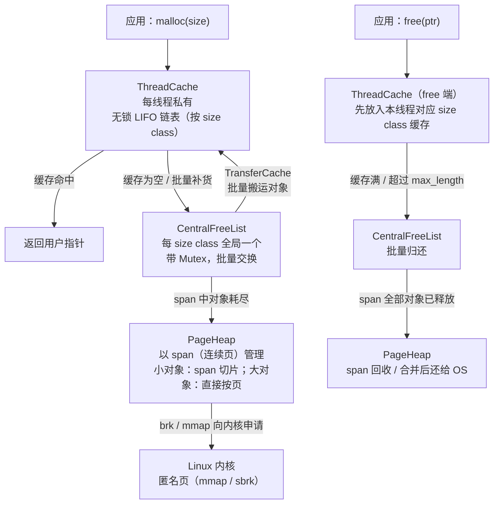

# 内存与堆（10）· tcmalloc原理

## 概述与定位

> [!abstract] TL;DR
> tcmalloc（Thread-Caching Malloc）是 Google 为**高并发服务器**设计的用户态内存分配器，核心设计目标是**多线程低锁竞争与高可扩展性**。它通过"每线程缓存（ThreadCache）→ 中央缓存（CentralFreeList / TransferCache）→ 页堆（PageHeap）"的三层结构，将小对象分配的**快速路径做成无锁操作**，大幅减少多线程 malloc/free 的锁竞争。元数据集中管理（无 inline chunk header），与 glibc ptmalloc2 的设计思路有本质差异。
>
> - **来源**：Google 开源，通过 [gperftools](https://github.com/gperftools/gperftools)（旧版）与 [google/tcmalloc](https://github.com/google/tcmalloc)（Google 新版）两条线演进；本篇以 gperftools tcmalloc 经典设计为主，现代演进见末节。
> - **对比锚**：与 glibc ptmalloc2（[[05.ptmalloc2总览与arena]]）的多 arena 加锁方案相比，tcmalloc 在小对象分配路径上完全无锁，多线程扩展性更强。

tcmalloc 将所有分配请求按大小分为两类：

| 请求大小 | 走哪条路径 |
|---|---|
| ≤ 最大 size class（默认约 **256 KB** 以下的小/中对象） | ThreadCache → CentralFreeList → PageHeap |
| 超出最大 size class（大对象） | 直接由 PageHeap 按页分配 |

> [!note] 来源标注
> 以下结构描述基于 Google gperftools tcmalloc 设计文档（[gperftools/docs/tcmalloc.html](https://gperftools.github.io/gperftools/tcmalloc.html)）与源码，具体阈值/类数随版本和编译配置有所不同，以实际版本为准。

---

## 原理与机制

### 三层结构总览



> [!note] 说明
> `TransferCache` 是 CentralFreeList 内部的一层批量搬运缓冲，用于减少细粒度锁持有时间；现代 Google 内部 TCMalloc（per-CPU cache 版）已将 TransferCache 做了进一步优化。

### 快速路径与慢速路径

```
malloc(n) 决策链（小对象）：
  1. 将 n 向上取整到最近 size class → sc
  2. 读当前线程的 ThreadCache.free_list[sc]
  3. 若非空：pop 一个对象 → 返回（无锁，O(1)）
  4. 若为空：向 CentralFreeList 批量取 batch_size 个对象
             → 填充 ThreadCache.free_list[sc]
             → pop 一个 → 返回
  5. CentralFreeList 若也无空闲对象：
             → 向 PageHeap 申请一个新 span
             → 按 sc 的 object_size 切成对象链
             → 填充 CentralFreeList

free(ptr) 决策链（小对象）：
  1. 识别 ptr 属于哪个 size class（通过 span 元数据）
  2. 将 ptr 放入 ThreadCache.free_list[sc] 头部（无锁）
  3. 若 free_list[sc].length > max_length：
             → 批量将 batch_size 个对象归还 CentralFreeList
```

---

## 结构详解

### ThreadCache — 每线程无锁缓存

ThreadCache 是 tcmalloc 多线程扩展性的核心。每个线程拥有独立的 `ThreadCache` 实例，通过 TLS（Thread-Local Storage）访问，**分配/释放小对象无需任何锁**。

```
struct ThreadCache {
    // 每个 size class 一条空闲对象单链表
    FreeList  list_[kNumClasses];   // 数组，按 size class 索引

    // 本 ThreadCache 当前持有的内存总量（字节）
    size_t    size_;

    // GC 触发阈值：size_ 超过 max_size_ 时触发 Scavenge
    size_t    max_size_;

    // 链入全局 ThreadCache 链（用于 GC 遍历）
    ThreadCache* next_;
    ThreadCache* prev_;
};

struct FreeList {
    void*    list_;        // 单链表头（next 指针复用对象首 sizeof(void*) 字节）
    uint32_t length_;      // 当前链表长度
    uint32_t max_length_;  // 动态调整上限（慢启动式增长）
    uint32_t lowater_;     // 近期最小 length，用于 GC 判断
};
```

- `max_length_` 以"慢启动"策略动态增长：首次不足时 +1，命中 batch 时翻倍，上限受全局 `kMaxDynamicFreeListLength` 约束。
- 当 `size_` 超过 `max_size_`（初始约 4 MB，可配置），触发 **Scavenge**：将各 `FreeList` 中超过 `lowater_` 以上的空闲对象批量归还 CentralFreeList，缩减本线程持有量。

### size class — 尺寸类

tcmalloc 将 `[1, MAX_SIZE]` 的请求区间划分为约 **80–170 个**预定义尺寸类（具体类数随版本/配置不同），每个 size class 对应一个固定的 `object_size`：

```
size class 示例（gperftools tcmalloc，仅作示意，非完整列表）：
  sc=1  : object_size =     8 B  ─┐
  sc=2  : object_size =    16 B   │ 小步长区：8 B 步进（8–256 B）
  sc=3  : object_size =    32 B   │
  ...                              │
  sc=n  : object_size =   256 B  ─┘
  sc=n+1: object_size =   512 B  ─┐
  sc=n+2: object_size =   768 B   │ 中步长区：64/128/256 B 递增
  sc=n+3: object_size =  1024 B   │ （256 B → 1 KB → 数 KB 渐进）
  ...                              │
  sc=m  : object_size =  8192 B  ─┘
  sc=m+1: object_size = 16384 B  ─┐
  ...                              │ 大步长区：步进继续翻倍
  最大 sc：object_size ≈ 256 KB  ─┘  ← 此为 gperftools tcmalloc 的上限
                                       超出后直接走 PageHeap（大对象路径）
```

> [!important] 版本口径说明
> **"小对象上限约 256 KB、之后直走 PageHeap"** 是 **gperftools tcmalloc**（旧版，ThreadCache 架构）的口径，来源见 [gperftools/docs/tcmalloc.html](https://gperftools.github.io/gperftools/tcmalloc.html)。
> **google/tcmalloc**（新版，per-CPU cache 架构）的 size class 数量、各档步长与精确阈值均有差异（以源码 `tcmalloc/size_classes.cc` / `size_class_info` 为准），不可混用两个版本的具体数字。

| 设计要点 | 说明 |
|---|---|
| **请求向上取整** | `malloc(n)` → 找最小的 `object_size ≥ n` 的 size class |
| **减少外部碎片** | 对象大小固定，同 size class 的对象完美复用，无碎片 |
| **O(1) 管理** | 通过数组索引直接定位 FreeList / CentralFreeList，无需搜索 |
| **内部碎片** | 向上取整带来内部碎片，tcmalloc 的大小类设计使平均碎片率 ≈ 12% |

### span — 页级内存单元

**span** 是 tcmalloc 的页级内存管理单元，代表**一段连续的物理页**（page-aligned）：

```
struct Span {
    PageID   start;       // 起始页号（start_addr = start * kPageSize）
    Length   length;      // span 占用的页数
    Span*    next;        // PageHeap 空闲链表 / CentralFreeList 链表
    Span*    prev;
    void*    objects;     // 小对象：已切片后的空闲对象链表头
    uint32_t refcount;    // 已分配出去的对象数（0 时 span 可回收）
    size_t   sizeclass;   // 0 = 大对象 span；>0 = 小对象 size class 编号
    bool     in_use;
};
```

tcmalloc 维护一张**页映射表（PageMap）**，以页号为 key，查出该页属于哪个 span：

```
PageMap: page_id → *Span
```

这使得 `free(ptr)` 时可以 O(1) 定位 ptr 所属 span → 识别 size class → 归还到正确的 FreeList。

**与 ptmalloc2 的根本差异**：ptmalloc 将 `malloc_chunk` 的 header（`prev_size`、`size`、标志位）**内联存储在用户分配区域的前面**；tcmalloc 的元数据（span、size class）**完全集中在独立的管理结构**中，用户拿到的指针指向纯净的数据区，无任何 inline header。

### CentralFreeList 与 TransferCache

每个 size class 对应全局唯一一个 `CentralFreeList`，是 ThreadCache 与 PageHeap 之间的缓冲层：

```
struct CentralFreeList {
    Mutex        lock_;          // 全局锁（per size class，粒度较细）
    size_t       size_class_;
    Span*        nonempty_;      // 含空闲对象的 span 链表
    Span*        empty_;         // 对象全被取走的 span 链表（refcount > 0）
    size_t       num_objects_;   // 当前空闲对象总数
    TransferCache tc_;           // 批量搬运缓冲（见下）
};
```

**TransferCache** 是 CentralFreeList 内置的无锁（或低锁）批量搬运层，以 **batch_size**（通常 16–64 个对象）为粒度在 ThreadCache 与 CentralFreeList 之间转移对象，将锁的持有次数从"每次 malloc/free 各一次"降低到"每 batch_size 次一次"：

```
BatchSize(sc) ≈ min(kMaxObjectsToMove, floor(kMaxSizeToMove / object_size(sc)))
# kMaxObjectsToMove ≈ 128，kMaxSizeToMove ≈ 8 KB（值随版本变化）
```

### PageHeap — 页级分配器

PageHeap 是 tcmalloc 最底层的内存管理组件，管理从 OS 获取的全部内存页：

```
struct PageHeap {
    SpanSet  free_[kMaxPages];   // free_[k]：空闲 span，长度恰好 k 页
    SpanSet  large_;             // 超大 span（> kMaxPages 页）的集合
    Stats    stats_;
    // 向 OS 申请内存（mmap MAP_ANONYMOUS 或 sbrk）
};
```

分配逻辑（简化）：

```
Span* PageHeap::New(Length n) {
    // 1. 在 free_[n] 中找恰好 n 页的 span
    if (free_[n] 非空) return free_[n].pop();
    // 2. 找 k > n 的最小空闲 span，切割
    for k in [n+1 .. kMaxPages]:
        if free_[k] 非空:
            span = free_[k].pop()
            remainder = Split(span, n)   // 切出 n 页，剩余放回
            return span
    // 3. 向 OS 申请新内存
    return GrowHeap(n)
}
```

释放时，PageHeap 检查相邻 span 是否也空闲，执行**合并**（coalesce），减少碎片；若合并后的 span 超过阈值，调用 `madvise(MADV_DONTNEED)` 归还物理页给 OS（虚拟地址保留）。

### 大对象分配

请求大小超出最大 size class 时，绕过 ThreadCache 和 CentralFreeList，**直接由 PageHeap 分配整数个页**：

```
malloc(large_size):
  pages_needed = ceil(large_size / kPageSize)
  span = PageHeap::New(pages_needed)
  span->sizeclass = 0        // 标记为大对象
  return span->start_addr

free(large_ptr):
  span = PageMap::Find(large_ptr)   // 页映射查 span
  assert(span->sizeclass == 0)
  PageHeap::Delete(span)             // 归还 span，可能合并
```

大对象的 span 元数据同样在 PageMap 中查找，无 inline header。

---

## 对比分析

### tcmalloc vs ptmalloc2

| 维度 | ptmalloc2（glibc） | tcmalloc（Google gperftools） |
|---|---|---|
| **多线程策略** | 多 arena（≈ `8×CPU` 个），每个 arena 带一把锁 | ThreadCache 完全无锁；CentralFreeList per-size-class 锁，粒度更细 |
| **元数据位置** | `malloc_chunk` header **内联**在用户内存前（`prev_size`/`size`/标志位） | 元数据**集中**（Span/PageMap/ThreadCache），用户指针指向纯数据区 |
| **大小类管理** | fastbin（10 条）/ smallbin（62 条）/ largebin（63 条），多种 bin 类型 | 统一 size class（约 88 类），三层结构统一管理 |
| **小对象分配路径** | tcache（glibc ≥2.26，无锁，但只有 64 bin×7 slot）→ fastbin → unsorted/small bin（加 arena 锁） | ThreadCache 无锁（缓存充足时零锁） |
| **碎片** | 合并机制（consolidation）减少外部碎片；bin 切割有内部碎片 | 同 size class 完美复用，内部碎片约 12%；span 合并减少外部碎片 |
| **堆顶扩展方式** | main arena 用 `brk`；线程 arena 用 `mmap` | 全部用 `mmap`（或 sbrk），PageHeap 统一管理 |
| **内存归还 OS** | `MADV_DONTNEED` / `munmap`，受 `M_TRIM_THRESHOLD` 控制 | PageHeap span 合并后 `MADV_DONTNEED` 或 `munmap` |
| **调试/Profiling** | Valgrind/ASan 接入；无内置 heap profiler | 内置 **heap profiler**（`gperftools`），支持采样式内存泄漏检测 |
| **安全性** | tcache key（glibc ≥2.29）、safe-linking（glibc ≥2.32）防 double-free/poison | 无 inline header 消除 header 覆写类漏洞；但无等价 safe-linking 保护（详见安全节） |
| **来源** | GNU libc（glibc），系统默认 | Google 开源（gperftools / google/tcmalloc） |

---

## 安全性与正确使用

### 无 inline header 的取舍

ptmalloc2 将 chunk header 存储在紧邻用户数据的低地址处，带来"堆溢出覆写 size/fd/bk 字段"这一类经典漏洞面（详见 [[33.二进制漏洞与利用基础/00.二进制漏洞与利用基础总览.md]]）。tcmalloc 消除了 inline header，**堆溢出无法通过覆写相邻 chunk 元数据直接劫持分配器**。

但这并不意味着 tcmalloc 无漏洞面：

| 漏洞类型 | tcmalloc 中的表现 |
|---|---|
| **Use-After-Free（UAF）** | 释放后对象放入 ThreadCache 空闲链表（`next` 指针复用对象首字节），UAF 可污染链表指针，导致后续分配返回任意地址 |
| **Double-free** | tcmalloc（gperftools 旧版）对 double-free **缺乏类似 glibc tcache key 的检测**，重复 free 同一对象可能导致链表损坏；现代版本有一定缓解但非完整防护 |
| **堆溢出** | 无法覆写邻居 chunk header，但仍可覆写同 span 内其他对象的数据；大对象 span 相邻则类似 ptmalloc 情形 |
| **元数据攻击** | PageMap 集中存储，若可任意写内存则可覆写 Span 结构，影响页级分配逻辑（比 ptmalloc 攻击面集中但仍存在） |

### Heap Profiling（tcmalloc 独有优势）

tcmalloc 最实用的功能之一是**内置采样式堆分析器**，通过 `gperftools` 的 `HeapProfiler` 接口，可以：

```bash
# 链接 tcmalloc profiling 版本
gcc -o myapp myapp.c -ltcmalloc_and_profiler

# 运行并生成堆快照
HEAPPROFILE=/tmp/myapp.hprof ./myapp

# 分析快照
pprof --pdf ./myapp /tmp/myapp.hprof.0001.heap > heap.pdf
```

tcmalloc 在每次分配时以概率 `1/512KB`（默认）进行采样，记录调用栈，开销极低（约 1–5% 性能损耗），远优于 Valgrind 的全量跟踪。

### 何时选择 tcmalloc

```
适合 tcmalloc 的场景：
  - 高并发服务器（多线程频繁小对象分配/释放）
  - 需要内置 heap profiling 的性能分析场景
  - 希望减少因多 arena 锁竞争导致的内存膨胀

不适合 / 需权衡的场景：
  - 对分配器安全加固有强需求（优先考虑 hardened_malloc 或带 GWP-ASan 的方案）
  - 嵌入式/资源受限环境（tcmalloc 元数据开销相对较大）
  - 已深度集成 glibc 内存调试工具链的场景
```

> [!warning] 替换系统 malloc 的风险
> 通过 `LD_PRELOAD=libtcmalloc.so` 或链接时替换系统 `malloc` 时，需注意：
> - 同一进程中不能混用 tcmalloc 分配的指针与 glibc `free` 释放（反之亦然），否则崩溃；
> - 部分 glibc 内部实现（如 `dlopen`）在初始化阶段可能早于 tcmalloc 初始化，需确认链接顺序；
> - 与 ASan 同时使用时，需使用 tcmalloc 的 ASan 兼容版本或改用 ASan 自带的分配器。

### 现代演进：per-CPU cache 与 Restartable Sequences

Google 内部的新版 **TCMalloc**（[google/tcmalloc](https://github.com/google/tcmalloc)，与 gperftools tcmalloc 是不同仓库）引入了更激进的优化：

- **per-CPU cache**：将 ThreadCache 从"每线程"升级为"每 CPU core"，利用 Linux 内核的 **Restartable Sequences（`rseq` 系统调用，Linux 4.18+）** 实现无锁的 CPU 本地缓存访问——分配时若未被调度出去，则整个操作原子完成，无需任何锁或原子指令。
- per-CPU cache 的容量更大、线程切换时无需迁移缓存，进一步降低了缓存抖动。
- 该特性依赖 `rseq` 支持，在旧内核或非 Linux 平台上自动回退到 per-thread 模式。

> [!note] 来源标注
> per-CPU cache 与 `rseq` 的详细设计见 [google/tcmalloc: Design doc](https://google.github.io/tcmalloc/design.html)（2020+）；`rseq` 机制见 Linux kernel 文档 `Documentation/rseq.rst`（Linux 4.18 引入）。gperftools tcmalloc 与 google/tcmalloc 是两个独立项目，API 和内部结构均有差异，使用时需明确区分。

---

## 小结

tcmalloc 的核心贡献在于将多线程小对象分配的**快速路径设计为真正的无锁操作**（ThreadCache），同时以 CentralFreeList 的批量交换和 PageHeap 的 span 管理为后盾，兼顾了内存复用效率与多线程可扩展性：

| 关键设计 | 效果 |
|---|---|
| ThreadCache（每线程，无锁） | 小对象分配/释放零锁竞争，延迟极低 |
| size class 统一索引 | 分配 O(1)，同类对象完美复用，减少外部碎片 |
| TransferCache 批量搬运 | 跨线程交换以 batch 粒度完成，降低中央锁持有频率 |
| span + PageMap 集中元数据 | 消除 inline header，减少一类堆溢出攻击面 |
| 内置 heap profiler | 低开销采样分析，工程实践中极为实用 |
| per-CPU cache（新版） | 用 `rseq` 彻底消除 per-thread 缓存迁移开销 |

与 glibc ptmalloc2 相比，tcmalloc 无需为每个线程维护独立的 arena 加锁，元数据集中管理也使分配器的行为更可预测；代价是引入了更多启动开销与元数据内存（PageMap、Span 结构体）。在高并发服务器场景下，tcmalloc 通常优于 ptmalloc2，而在内存受限或需要强安全加固的场景下则需审慎评估。

---

## 相关阅读

- **ptmalloc2（对比起点）**：[[05.ptmalloc2总览与arena]]
- **chunk 结构（ptmalloc inline header 对比）**：[[06.ptmalloc2的chunk结构]]
- **jemalloc（另一现代分配器）**：[[11.jemalloc原理]]
- **堆漏洞基础（互补防御视角）**：[[33.二进制漏洞与利用基础/00.二进制漏洞与利用基础总览.md]]
- **加固分配器与防护机制**：[[34.现代二进制防护机制/00.现代二进制防护机制总览.md]]
- **内存安全与调试**：[[13.内存安全与调试]]

---

⬅️ 上一篇 [[09.malloc与free分配释放流程]] ｜ 🏠 [[00.内存管理与堆分配器总览]] ｜ 下一篇 [[11.jemalloc原理]] ➡️
