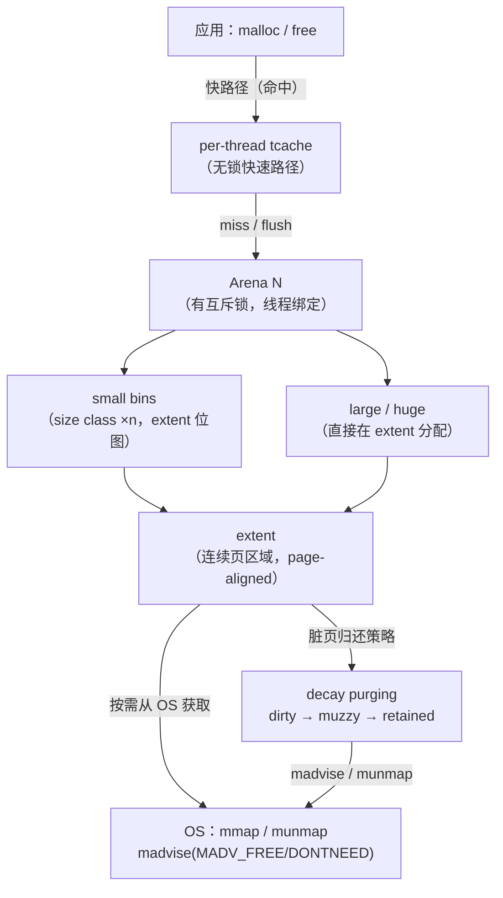

# 内存与堆（11）· jemalloc原理

## 概述与定位

> [!abstract] TL;DR
> jemalloc 起源于 **FreeBSD libc**（Jason Evans，2005），由 Facebook 大力发展并维护至今（当前主线 5.x）。其核心设计目标有两个：**降低长期碎片**（fragmentation）和**多核横向扩展**（scalability）。与 glibc ptmalloc2 的"每个线程争抢主 arena"不同，jemalloc 引入**多 arena 轮询绑定**+**per-thread tcache**，让大多数分配/释放路径完全无锁。size class 比 ptmalloc 细得多，外加 decay-based purging（脏页按策略延迟归还内核），使 RSS 和碎片率明显低于 ptmalloc。

### 主要使用方（标注）

| 项目 | 说明 |
|---|---|
| **FreeBSD libc** | 默认系统分配器（自 2005 年，Jason Evans 原始论文平台）|
| **Firefox** | Mozilla 自 2007 年集成，降低浏览器长期 RSS；见 [Mozilla blog 2007](https://www.jemalloc.net/)|
| **Redis** | 默认链接 jemalloc（Linux 版本）；`INFO memory` 可见 `mem_allocator:jemalloc-5.x`|
| **Android（早期）** | Android 5.x Lollipop 前曾使用；后续改 Scudo 加固分配器|
| **Rust（早期默认）** | Rust 1.0 至 1.31（2018）曾以 jemalloc 为默认系统分配器；后换为平台 libc 默认分配器（[RFC 1974](https://github.com/rust-lang/rfcs/blob/master/text/1974-global-allocator.md)）|
| **Meta/Facebook 内部** | 大规模服务端 C++ 应用，Facebook 长期是主要维护方|

> 版本说明：本章以 **jemalloc 5.x**（当前主线）为基准，老版本（3.x/4.x）使用 `chunk`/`run` 术语，5.x 改为统一的 `extent`；涉及版本差异时会标注。

---

## 原理与机制

### 整体层次 Mermaid



### 关键路径（以 `malloc` 为例）

1. **tcache 命中**：在线程私有 tcache 对应 size class 的 bin 中弹出一个 region，直接返回。全程无锁。
2. **tcache miss → Arena**：加锁进入绑定 arena，从对应 size class 的 bin（小块）或直接在 extent 上切割（大块）满足请求。
3. **Arena 无可用 extent**：通过 `mmap` 向内核申请新的内存区域，创建新 extent 并纳入 arena 管理。
4. **`free` 路径**：先尝试放回 tcache；tcache 满时 flush 到对应 arena 的 bin；arena 判断是否触发 decay purging（脏页归还）。

---

## 结构详解

### 1. 多 Arena 设计

#### 创建数量

jemalloc 5.x 默认创建约 **4 × CPU 逻辑核数** 个 arena（精确值由 `opt.narenas` 控制，也可通过 `MALLOC_CONF=narenas:N` 覆盖）。每个 arena 是一个独立的内存管理器，拥有独立的 `extent` 集合和互斥锁。

> 对比：glibc ptmalloc2 的线程 arena 上限是 **8 × CPU 核数**（64 位），创建策略类似，但 jemalloc 的 arena 粒度更细、size class 更精确。

#### 线程绑定策略

```
线程首次调用 malloc
  └─ 轮询（round-robin）或哈希选一个 arena 并记录到 TLS（thread-local storage）
       └─ 后续同线程的分配/释放优先使用同一 arena（减少锁竞争）
```

- jemalloc 内部通过 `tsd`（thread-specific data）存储 `iarena`（当前绑定 arena 指针）。
- 可用 `MALLOC_CONF=narenas:1` 退化为单 arena 便于调试（此时行为接近 ptmalloc）。

#### `malloc_state`（arena 核心结构，简化伪代码）

```c
/* jemalloc 5.x 简化，非可编译 */
struct arena_s {
    unsigned        ind;           /* arena 索引 */
    malloc_mutex_t  lock;          /* 保护 bins、extents 等 */
    arena_bin_t     bins[NBINS];   /* 每个 small size class 对应一个 bin */
    extent_list_t   large;         /* large extent 链表 */
    extent_heap_t   extents_dirty; /* dirty extent 集合（待 purge）*/
    extent_heap_t   extents_muzzy; /* muzzy extent 集合（已 MADV_FREE）*/
    extent_heap_t   extents_retained; /* 保留在虚拟地址空间但归还物理页 */
    nstime_t        decay_deadline; /* 下次 decay 截止时间 */
    /* ... */
};
```

---

### 2. Size Class 分级（small / large / huge）

jemalloc 的 size class 是其抗碎片的关键：粒度远比 ptmalloc 细，使内部碎片极低。

#### 三档分级（jemalloc 5.x）

| 类别 | 大小范围（典型 x86-64） | 管理单元 | 分配路径 |
|---|---|---|---|
| **small** | 8B – 14KB（含）| `run`（老版）/ `slab`（extent 切片）| tcache → arena bin → extent 位图 |
| **large** | 14KB – 4MB（含）| 整块 extent（page-aligned）| tcache（部分）→ arena large list |
| **huge** | > 4MB | 独立 `mmap`，extent 直接管理 | 直接 mmap，huge extent |

> 注：jemalloc 5.x 将 huge 合并进统一 extent 管理；`huge` 的精确阈值由 `opt.lg_chunk`（老版）或 `opt.oversize_threshold` 控制，不同构建可能不同。上表为典型默认值。

#### Small Size Class 的细分

jemalloc 在 small 范围内设置了大量 size class，以大幅减少内部碎片。以 5.x 为例（64 位构建，`--with-lg-quantum=3`）：

```
8, 16, 24, 32, 40, 48, 56, 64,   ← 8 字节步进（8-64B）
80, 96, 112, 128,                  ← 16 字节步进（64-128B）
160, 192, 224, 256,                ← 32 字节步进
320, 384, 448, 512,                ← 64 字节步进
...（以此类推，步进不断翻倍）
14336（14KB）                      ← small 上限
```

> 对比 ptmalloc：smallbin 粒度固定 16 字节步进（覆盖 16–1024B，62 条），jemalloc 在同范围内划分了更多 size class，外部碎片更低但 bin 数更多。

#### `arena_bin_t`：small bin 结构（简化）

```c
struct arena_bin_s {
    malloc_mutex_t  lock;
    extent_t       *slabcur;   /* 当前活跃 slab（extent 切片）*/
    extent_heap_t   slabs_nonfull;  /* 非满 slab 堆 */
    extent_list_t   slabs_full;     /* 满 slab 列表 */
    arena_bin_info_t info;     /* size class 元信息：reg_size, bitmap_info */
};
```

---

### 3. per-thread `tcache`

#### 设计目标

tcache 是 jemalloc 的快路径：每个线程维护一套本地缓存，对每个 size class 各保留若干空闲 region，**分配与释放均无锁**。

#### 结构（简化伪代码）

```c
struct tcache_s {
    tcache_bin_t tbins[TCACHE_MAXBINS]; /* 每个 size class 一个 bin */
    arena_t     *arena;                  /* 绑定的 arena */
    uint64_t     prof_accumbytes;        /* profiling 计数 */
};

struct tcache_bin_s {
    tcache_bin_stats_t tstats;
    int         low_water;     /* 低水位，指导 GC flush */
    unsigned    lg_fill_div;   /* fill 步长控制 */
    unsigned    ncached;       /* 当前缓存数量 */
    void      **avail;         /* 指针数组栈，LIFO */
};
```

#### 生命周期

```
tcache_alloc_small()
  │
  ├─ avail[--ncached]（命中）→ 直接返回指针
  │
  └─ ncached == 0（miss）→ tcache_fill_small()
       └─ 向 arena bin 批量取（一次 fill 约取 nbininfo.ncached_max/2）
            → 补充 avail 数组后再返回

tcache_dalloc_small()
  │
  ├─ avail[ncached++]（未满）→ 直接入栈
  │
  └─ ncached > max（满）→ tcache_bin_flush_small()
       └─ 将 avail 数组低地址部分 flush 回 arena bin
```

> 注：tcache 的容量上限（`ncached_max`）因 size class 不同而不同：越小的 class 上限越高（小对象轻量，多缓存无妨）；large class 的 tcache 容量较小甚至可禁用（`MALLOC_CONF=tcache:false`）。

---

### 4. Extent / Run：页区域管理

#### `extent_t`（jemalloc 5.x 统一管理对象）

`extent` 是 jemalloc 的基本内存区域单元（替代了老版本的 `chunk`/`run`），代表一段连续的、page-aligned 的虚拟地址区域。

```c
struct extent_s {
    ptrh_link_t     e_ph;         /* 堆链接字段（extent_heap 用） */
    void           *e_addr;       /* 起始地址（page-aligned） */
    size_t          e_bsize;      /* 字节大小 */
    atomic_zu_t     e_bits;       /* 标志位压缩字段（szind、state、slab、...） */
    /* slab 模式下用位图管理空闲 region */
    bitmap_t        e_bitmap[BITMAP_GROUPS_MAX];
    /* large/huge 模式下无 bitmap */
};
```

- **slab 模式（small）**：extent 被切成等大的 region，用 `bitmap` 标记哪些 region 空闲。位图查找第一个空闲 region 是 O(1)（基于 `ffs` 指令）。
- **large/huge 模式**：整个 extent 作为单一分配单元，无内部位图。

#### Extent State 状态机

```
active（正在使用）
  │  slab 清空
  ▼
dirty（物理内存保留，但逻辑空闲）
  │  decay 定时器触发，执行 madvise(MADV_FREE) / MADV_DONTNEED
  ▼
muzzy（物理内存归还给 OS，但虚拟地址保留）
  │  进一步 decay 或内存压力
  ▼
retained（虚拟地址保留，但物理内存完全归还）
  │  若 arena 彻底不需要，munmap
  ▼
（释放回 OS）
```

---

### 5. Decay-Based Purging（脏页延迟归还）

这是 jemalloc 区别于 ptmalloc 最显著的机制之一：**不立即归还脏页，而是按时间衰减（decay）策略延迟归还，以减少 `madvise`/`mmap` 系统调用频率，降低 RSS 抖动**。

#### 两条 decay 通道

| 通道 | 含义 | 默认时间 | 操作 |
|---|---|---|---|
| `dirty_decay_ms` | dirty → muzzy | 10000 ms（10 s）| `madvise(MADV_FREE)` 或 `MADV_DONTNEED` |
| `muzzy_decay_ms` | muzzy → retained | 10000 ms（10 s）| `madvise(MADV_DONTNEED)` / `munmap` |

> 设为 0 表示立即归还（激进策略）；设为 -1 表示永不主动归还（内存池风格）。通过 `MALLOC_CONF=dirty_decay_ms:0,muzzy_decay_ms:0` 可配置。

#### 低地址优先（low-address-first）复用

jemalloc 在从 `dirty`/`muzzy` extent 池中选取可复用 extent 时，**优先选择地址最低的 extent**，原因：
- 使进程虚拟地址空间更紧凑（减少 VMA 碎片化）；
- 提高物理内存热点集中度，对 TLB 和 hugepage 友好；
- 与 OS 的 MADV_DONTNEED 策略协同：低地址先被重用，高地址的 dirty 页更可能被 OS 回收。

---

## 对比分析

### jemalloc vs ptmalloc vs tcmalloc 三方对比

| 维度 | **ptmalloc2（glibc）** | **jemalloc 5.x** | **tcmalloc（gperftools/tc-2.x）** |
|---|---|---|---|
| **起源** | GNU glibc，基于 dlmalloc | FreeBSD/Facebook，Jason Evans | Google，gperftools |
| **多线程扩展** | 线程 arena，最多 8×CPU 个；线程竞争多时 spin | 多 arena（4×CPU），TLS 绑定，竞争低 | per-thread cache + central free list，lock-free 热路径 |
| **size class** | small 16B 步进 62 条，large 按大小范围 | small 极细（见上表，>100 个 class），large/huge 独立 | small 约 88 个 class，large 直接 span |
| **per-thread cache** | tcache（≥ glibc 2.26），64 bin×7 | tcache（TCACHE_MAXBINS 个 bin）| thread cache（size class ×n，默认各 32KB）|
| **空闲管理单元** | malloc_chunk + bins（fastbin/smallbin/largebin/unsorted）| extent（统一管理，slab 切片+位图）| span（页对齐，central free list）|
| **碎片控制** | 合并（前/后向）；mmap 阈值动态调整 | 低地址优先复用 + size class 细化 + decay purging | span 复用 + size class；无专门 decay 机制 |
| **脏页归还** | `madvise(MADV_DONTNEED)`，较保守 | decay-based（dirty→muzzy→retained，可调 ms）| `MADV_FREE`/`DONTNEED`，可配置 |
| **内存 profiling** | 无内置（需 Valgrind/ASan 等外部工具）| 内置 `prof`（heap profiling，`jeprof`/`pprof` 分析）| 内置 heap profiler（`pprof`）|
| **适用场景** | 通用 POSIX 默认；中低并发应用 | 高并发服务端、长期运行（低 RSS 碎片）、Redis/Firefox | 高并发、延迟敏感；Google 内部服务 |
| **调参接口** | `mallopt()` / `M_TRIM_THRESHOLD` 等 | `MALLOC_CONF` 字符串 + `mallctl()` API | `MallocExtension::SetNumericProperty()` |

### ptmalloc 与 jemalloc 相似点

- 都用 **arena** 隔离线程，降低锁粒度。
- 都有 **per-thread cache**（ptmalloc 的 tcache vs jemalloc 的 tcache）。
- 都通过 `mmap`/`brk` 向内核要内存（ptmalloc 用 `brk` + `mmap`；jemalloc 全用 `mmap`，不用 `brk`）。

### 关键差异总结

- **jemalloc 不用 `brk`**：所有内存通过 `mmap` 获取，使 extent 可独立 `munmap`，避免 ptmalloc 的"高地址 chunk 不释放导致 top chunk 无法缩减"问题。
- **jemalloc size class 更细**：内部碎片率更低（jemalloc 的细粒度 size class 设计以低内部碎片为目标；ptmalloc 的 smallbin 粒度较粗，内部碎片相对更高；具体数值随工作负载变化较大，不宜给出单一硬数字）。
- **decay purging 是 jemalloc 的独特 RSS 控制机制**：ptmalloc 通过 `madvise` 归还但无时间衰减模型；tcmalloc 有类似机制但独立实现。

---

## 安全性与正确使用

### `MALLOC_CONF` 调优

jemalloc 通过环境变量 `MALLOC_CONF`（或编译时 `--with-malloc-conf`）提供丰富调参接口：

```bash
# 常用调参示例
export MALLOC_CONF="narenas:4"           # 固定 arena 数量
export MALLOC_CONF="dirty_decay_ms:0"    # 立即归还脏页（低 RSS，高系统调用频率）
export MALLOC_CONF="muzzy_decay_ms:-1"   # muzzy 页永不归还（长期运行池化）
export MALLOC_CONF="tcache:false"        # 禁用 tcache（调试 / 确定性行为）
export MALLOC_CONF="prof:true,prof_prefix:/tmp/jeprof" # 开启 heap profiling
export MALLOC_CONF="stats_print:true"    # 进程退出时打印统计信息

# 同时设置多个选项
export MALLOC_CONF="narenas:8,dirty_decay_ms:5000,muzzy_decay_ms:5000"
```

> [!warning] 示例输出为示意
> 以上命令为配置示意，实际效果取决于 jemalloc 版本与构建选项。

### `mallctl()` 编程接口

```c
/* 读取分配器统计（bytes allocated） */
size_t allocated;
size_t sz = sizeof(size_t);
mallctl("stats.allocated", &allocated, &sz, NULL, 0);

/* 强制 purge：立即归还所有 dirty extent */
mallctl("arena.0.purge", NULL, NULL, NULL, 0);
/* 归还所有 arena */
mallctl("arenas.0.purge", NULL, NULL, NULL, 0);
```

### 脏页归还与 RSS 的权衡

```
dirty_decay_ms 越小 → RSS 越低，但 madvise 系统调用越频繁
dirty_decay_ms 越大 → 内存复用率高（减少 mmap），但 RSS 峰值高
dirty_decay_ms = -1 → 内存池风格，适合生命周期固定的服务
```

对于 **Redis** 等长期驻留服务，通常保持默认（10s）；对于延迟敏感 / 内存受限容器，可调小至 1000ms。

### 内置 Heap Profiling（`prof`）

```bash
# 编译 jemalloc 需开启 --enable-prof
export MALLOC_CONF="prof:true,lg_prof_interval:30"
# 程序运行中：jeprof --show_bytes ./myapp jeprof.<pid>.*.heap
```

`jeprof` 输出与 gperftools pprof 格式兼容，可生成 callgraph 定位内存增长点。

### 常见陷阱与误用

| 陷阱 | 说明 | 对策 |
|---|---|---|
| **tcache 导致内存不立即回收** | free 后内存进 tcache，`stats.allocated` 不降 | `mallctl("tcache.flush", ...)` 或禁用 tcache |
| **arena 数太多导致 RSS 增大** | 每个 arena 独立持有 dirty extent，RSS = ΣAll arenas | 减少 `narenas` 或降低 decay 时间 |
| **`prof` 性能开销** | 开启 profiling 约 5–10% 吞吐损耗 | 仅在诊断时开启；生产用 `lg_prof_sample` 采样 |
| **`dirty_decay_ms:0` 导致高 sys% CPU** | 大量 `madvise` 系统调用 | 在高分配频率场景慎用；可适当调大至 1000ms |
| **多语言 runtime 与 jemalloc 冲突** | JVM / Go runtime 有自己的内存管理，LD_PRELOAD jemalloc 可能与 GC 冲突 | 仅对 C/C++/Rust 应用使用；JVM/Go 通常不需要替换 |

### 适用场景建议

- **推荐 jemalloc**：长期运行的 C/C++ 服务端进程（Redis、Memcached、高并发 web server）；对 RSS 碎片敏感；需要内置 heap profiling。
- **可保持 ptmalloc**：通用 Linux 应用；无明显内存碎片问题；不想引入外部依赖。
- **推荐 tcmalloc**：Google 全家桶 / Abseil 生态；对分配延迟极度敏感（tcmalloc 的 per-thread cache 比 jemalloc tcache 稍大，某些场景命中率更高）。

---

## 小结

jemalloc 的设计哲学是**用更多的内存管理元数据换取更低的碎片和更好的多核扩展**：

1. **多 arena（4×CPU）+ TLS 绑定**：大幅降低线程间锁竞争，相比 ptmalloc 的线程 arena 争用更低。
2. **极细 size class（small 100+ 个，large/huge 独立）**：以低内部碎片为设计目标，远优于 ptmalloc 的粗粒度 smallbin 分级。
3. **per-thread tcache**：小对象分配/释放的无锁快路径，与 ptmalloc tcache 设计思想相同但覆盖更多 size class。
4. **extent 统一管理 + 位图**：O(1) 空闲 region 查找；low-address-first 复用减少 VMA 碎片。
5. **decay-based purging**：dirty → muzzy → retained 三级策略，精确控制 RSS 曲线，避免 ptmalloc 因 brk 无法缩减导致的内存驻留问题。
6. **可观测性**：`MALLOC_CONF`、`mallctl()`、内置 `prof` 使 jemalloc 在生产环境可调可诊断。

理解 jemalloc 的 arena-extent-tcache 三层结构，是读懂 Redis/Firefox 内存行为、调优高并发 C++ 服务内存占用的基础。

---

## 相关阅读

- 本系列上一章：[[10.tcmalloc原理]]
- ptmalloc2 核心结构（对比基准）：[[05.ptmalloc2总览与arena]]
- 系列总览：[[00.内存管理与堆分配器总览]]
- 内存安全与调试（防御视角）：[[13.内存安全与调试]]
- 跨系列互补（堆利用视角）：[[33.二进制漏洞与利用基础/09.堆管理基础.md]]
- 内核分配器（buddy/slab，下游基础）：[[15.操作系统加载与启动/00.操作系统加载与启动总览.md]]
- C/C++ 对齐与对象布局：[[23.C_C++运行时与ABI/06.对象内存布局与this指针.md]]

---

⬅️ 上一篇 [[10.tcmalloc原理]] ｜ 🏠 [[00.内存管理与堆分配器总览]] ｜ 下一篇 [[12.内核分配器与其他分配器]] ➡️
