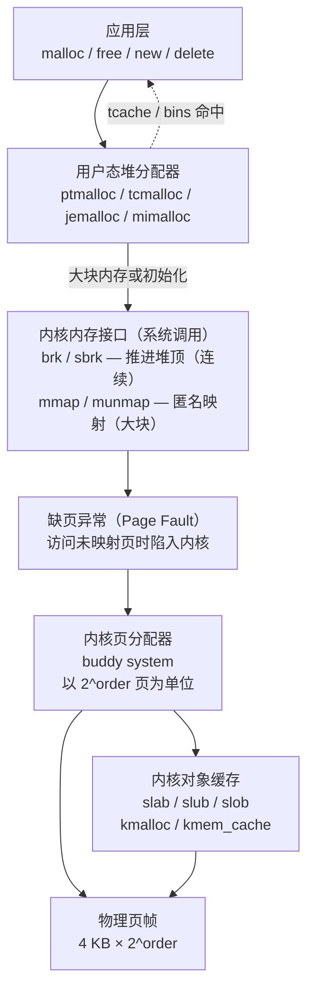

# 内核分配器与其他分配器

## 概述与定位

> [!abstract] TL;DR
> 用户态的 `malloc` 只是"最后一公里"，它底下还有一整栈分配体系：`brk`/`mmap` 系统调用触发**缺页中断**，内核**伙伴系统（buddy system）**以 2^order 页为单位分出物理页，**slab/slub/slob** 再在伙伴系统之上为内核常用对象做对象级缓存。除 ptmalloc/tcmalloc/jemalloc 之外，用户态还有 **mimalloc**（Microsoft，free-list sharding）和 **Hoard**（学术，消除 false sharing）等高性能分配器。本篇通过分层关系图与横向对比表，把所有层次与所有主流分配器放在同一坐标系下理解。

本篇位于系列第 12 章，承接第 10（tcmalloc）、第 11（jemalloc）对现代用户态分配器的讲解，从用户态向内核方向"往下走一层"，同时补充 mimalloc/Hoard 等用户态同类竞品，最终完成"应用 → 用户态分配器 → 内核接口 → 内核分配器 → 物理内存"的完整视图。与 [[15.操作系统加载与启动/00.操作系统加载与启动总览.md]] 中的虚拟内存与分页内容深度互补。

---

## 原理与机制

### 用户态与内核态的分配分层

从一次 `malloc(n)` 到物理内存真正到位，跨越了多个层次：



**关键分层说明：**

- **用户态分配器**（ptmalloc/tcmalloc/jemalloc/mimalloc）：向用户提供 `malloc`/`free` 接口，内部维护 bins/tcache/span 等空闲对象缓存，尽量不下沉到系统调用。
- **内核内存接口**（brk/mmap）：用户态分配器"批发"内存的通道；`brk` 推进 program break（连续堆段），`mmap(MAP_ANONYMOUS)` 映射离散大块。详见系列第 03 篇 [[03.mmap与brk内核内存接口]]。
- **缺页中断**：VMA 建立时仅分配虚拟地址范围，物理页在首次访问时由缺页处理程序"按需分配"（demand paging）。
- **buddy system（伙伴系统）**：内核页分配器，按 2 的幂次分配连续物理页，是所有内核内存分配的基础。
- **slab/slub/slob**：建立在 buddy 之上的对象级缓存，为内核高频对象（`task_struct`、`inode`、`sk_buff` 等）提供快速分配，避免反复向 buddy 申请同尺寸内存。

> [!note] 关键洞察
> 用户态 `malloc` 与内核 `kmalloc` 是**同一层次问题在不同上下文的两种解法**：前者面向用户进程，后者面向内核自身的数据结构。两者都解决"频繁分配小对象时如何减少开销"的问题，但物理连续性要求与执行上下文（睡眠 vs 原子）不同。

---

## 内核分配器详解

### buddy system — 伙伴系统（页级）

伙伴系统是 Linux 内核**物理内存管理的核心**，所有页级内存分配（包括 slab 背后的页、进程栈页、文件缓存页）都经过它。

#### 核心思想

将空闲物理页按 **order（0 ≤ order ≤ MAX_ORDER，通常 MAX_ORDER=10）** 分组管理：

| order | 大小（页数） | 大小（字节，4KB/页） |
|-------|------------|---------------------|
| 0     | 1          | 4 KB                |
| 1     | 2          | 8 KB                |
| 2     | 4          | 16 KB               |
| 3     | 8          | 32 KB               |
| ...   | ...        | ...                 |
| 10    | 1024       | 4 MB                |

每个 order 维护一个空闲块链表（`free_list[order]`）。

#### 分配流程

```
alloc_pages(order=2, gfp_flags):
  1. 找 free_list[2]，若非空 → 直接取出，返回
  2. 若 free_list[2] 空 → 向上找 free_list[3]
  3. 取出 order=3 的块（8 页），拆分为两个 order=2 块（各 4 页）
  4. 一个放入 free_list[2]（称为"伙伴"），一个返回给调用者
  5. 若 free_list[3] 也空，继续向上拆 order=4 ... 直至 MAX_ORDER
  6. 若全部链表为空 → 触发内存回收（kswapd）或返回失败
```

#### 释放与合并（"伙伴"合并）

```
free_pages(page, order=2):
  1. 计算该 page 的"伙伴"地址（通过异或 order 对应位）
  2. 检查伙伴是否也是空闲的且 order 相同
  3. 若是 → 合并为一个 order=3 的块，放入 free_list[3]
  4. 继续尝试向上合并（order=3 找 order=3 的伙伴），直至无法合并或达 MAX_ORDER
```

"伙伴"的计算基于物理页号（PFN）的对齐关系：order=k 时，伙伴的 PFN = `pfn XOR (1 << k)`。

**伙伴系统解决外部碎片**：通过持续合并，保证大块内存的可用性；但无法消除内部碎片（申请 1 页但 buddy 给出 1 页时内部无碎片；若申请 3 页但得到 4 页则有 1 页内部碎片）。

#### 主要接口

```c
/* 分配 2^order 个连续物理页，返回第一个页的 struct page 指针 */
struct page *alloc_pages(gfp_t gfp_mask, unsigned int order);

/* 分配单页，返回 struct page 指针 */
struct page *alloc_page(gfp_t gfp_mask);

/* 分配并返回内核虚拟地址（低端内存，线性映射） */
unsigned long __get_free_pages(gfp_t gfp_mask, unsigned int order);

/* 释放 */
void __free_pages(struct page *page, unsigned int order);
void free_pages(unsigned long addr, unsigned int order);
```

**`gfp_t` 标志**（分配行为控制）：

| 标志 | 含义 |
|------|------|
| `GFP_KERNEL` | 可睡眠，允许内存回收，最常用 |
| `GFP_ATOMIC` | 不可睡眠（中断上下文），失败返回 NULL |
| `GFP_DMA` | 要求 DMA 可用区域（低 16MB，x86） |
| `GFP_HIGHUSER` | 优先高端内存，用于用户页 |
| `__GFP_ZERO` | 分配后清零 |

> [!note] NUMA 感知
> 现代 Linux 以 **zone**（DMA/Normal/HighMem）+ **NUMA node** 为粒度管理物理内存，每个 zone 有独立的 buddy 链表。`alloc_pages_node(nid, ...)` 可指定 NUMA 节点，减少跨节点内存访问延迟。

---

### slab / slub / slob — 对象级缓存

buddy 系统以**页**为最小单位，而内核频繁分配的对象（几十到几百字节）远小于一页。slab 分配器在 buddy 之上构建**对象缓存层**，解决这一矛盾。

#### 三者关系与演化

| 分配器 | 诞生 | 特点 | 当前状态 |
|--------|------|------|----------|
| **slab** | Bonwick 1994 论文提出（SunOS）；Linux 2.1.x 起引入 | Jeff Bonwick（Sun）设计；复杂元数据，支持着色（coloring）、调试 | 可用，非默认 |
| **slub** | Linux 2.6.23，2007 | Christoph Lameter 设计；简化元数据（去掉 slab 头），现代默认 | **默认（mainline）** |
| **slob** | Linux 2.6.16 | 极简 first-fit，适合 `CONFIG_EMBEDDED` 小内存设备（<32MB） | 特定平台 |

> [!note] 查看当前内核使用哪种分配器
> ```bash
> grep -i 'SLUB\|SLAB\|SLOB' /boot/config-$(uname -r) | grep '=y'
> ```

#### slab/slub 核心概念

```
kmem_cache（对象缓存）
  └── 每个 CPU 的 per-cpu cache（cpu_slab，直接命中，无锁）
  └── 部分满 slab 链表（partial，跨 CPU 共享）
  └── 满 slab 链表（full，无空闲对象）
        └── slab = 从 buddy 申请的一块连续页（通常 1~32 页）
              └── 切分为 N 个等大小的 object（目标大小 + 对齐填充）
```

**SLUB 简化**：slub 把元数据（已用/空闲计数、空闲链指针）嵌入空闲对象本身（object 的头几个字节复用为 `freelist` 指针），而不像 slab 那样单独维护 slab 头，大幅减少缓存行占用。

#### SLUB 三级分配/释放协议

SLUB 是 Linux 主线内核的默认对象缓存分配器（自 Linux 2.6.23 起）。它的分配和释放均按"快→中→慢"三条路径依次尝试，核心目标是让热路径（快路径）完全无锁。

##### 数据结构速览

```c
/* 每个 size class 对应一个 kmem_cache */
struct kmem_cache {
    struct kmem_cache_cpu __percpu *cpu_slab;  /* per-CPU 指针（快路径） */
    /* ... size、object_size、offset、flags ... */
    struct kmem_cache_node *node[MAX_NUMNODES]; /* 每 NUMA 节点一个（中路径） */
};

/* per-CPU 结构（每 CPU 核一份，无锁访问） */
struct kmem_cache_cpu {
    void      **freelist;   /* 当前 active slab 的空闲对象链表头（单链） */
    unsigned long tid;      /* 事务 ID，用于无锁 cmpxchg 检测竞争 */
    struct slab *slab;      /* 当前 active slab */
    struct slab *partial;   /* per-CPU partial slab 链（Linux 5.x 新增） */
};

/* 每 NUMA 节点结构（中路径，需加 node 锁） */
struct kmem_cache_node {
    spinlock_t  list_lock;
    struct list_head partial;  /* 部分空闲 slab 链表 */
    unsigned long   nr_partial;
};
```

##### 三级分配协议（kmem_cache_alloc 决策链）

```
kmem_cache_alloc(cachep, gfp_flags)
│
├─ 【快路径：per-CPU freelist，lockless】─────────────────────────────
│    cpu_slab = this_cpu_ptr(s->cpu_slab)
│    object   = cpu_slab->freelist
│    if object != NULL:
│        cpu_slab->freelist = get_freepointer(s, object)  # 摘链头
│        return object                                      # ← 返回，全程无锁
│
├─ 【中路径：node partial list，需 node spinlock】───────────────────
│    /* 快路径未命中：当前 active slab 已满或 CPU 无 slab */
│    node = get_node(s, numa_node_id())
│    spin_lock(&node->list_lock)
│    slab = list_first_entry(&node->partial, ...)          # 取 partial 链首
│    if slab 存在:
│        cpu_slab->slab    = slab                          # 提升为 active slab
│        cpu_slab->freelist = slab->freelist
│        list_del(&slab->slab_list)                        # 从 partial 移除
│        node->nr_partial--
│        spin_unlock(&node->list_lock)
│        goto 快路径                                        # 再走一次快路径
│
└─ 【慢路径：向 buddy 申请新 slab，可能睡眠】────────────────────────
     /* node partial 也为空 */
     slab = allocate_slab(s, gfp_flags, numa_node_id())
       ├─ alloc_pages(gfp, s->oo.order)    # 从 buddy 申请 2^order 页
       ├─ 初始化 freelist：将 slab 内所有 object 串成单链
       │    for each object in slab:
       │        set_freepointer(s, obj, next_obj)
       └─ 返回新 slab
     cpu_slab->slab    = slab
     cpu_slab->freelist = slab->freelist
     goto 快路径
```

伪码汇总（可运行级别精度）：

```c
/* SLUB kmem_cache_alloc 三级决策（伪码，简化自 mm/slub.c） */
void *__slab_alloc(struct kmem_cache *s, gfp_t gfpflags, int node)
{
    struct kmem_cache_cpu *c = this_cpu_ptr(s->cpu_slab);

    /* ① 快路径：per-CPU freelist */
    void *object = c->freelist;
    if (likely(object)) {
        c->freelist = get_freepointer(s, object);   /* freelist 指针前进 */
        return object;
    }

    /* ② 中路径：node partial list */
    struct kmem_cache_node *n = get_node(s, node);
    spin_lock(&n->list_lock);
    struct slab *slab = list_first_entry_or_null(&n->partial, struct slab, slab_list);
    if (slab) {
        c->slab    = slab;
        c->freelist = slab->freelist;
        list_del(&slab->slab_list);
        n->nr_partial--;
        spin_unlock(&n->list_lock);
        goto fast;   /* 借用 partial slab 后重走快路径 */
    }
    spin_unlock(&n->list_lock);

    /* ③ 慢路径：allocate_slab → buddy */
    slab = allocate_slab(s, gfpflags, node);   /* alloc_pages() 内部 */
    if (!slab)
        return NULL;                             /* OOM */
    c->slab    = slab;
    c->freelist = slab->freelist;

fast:
    object = c->freelist;
    c->freelist = get_freepointer(s, object);
    return object;
}
```

##### 三级释放协议（kmem_cache_free 对称路径）

```
kmem_cache_free(cachep, object)
│
├─ 【快路径：归还到 per-CPU active slab freelist】────────────────
│    set_freepointer(s, object, c->freelist)   # object->next = freelist
│    c->freelist = object                       # 链表头前移（LIFO）
│    if slab 未全满（仍有引用计数）:
│        return                                  # ← 返回，全程无锁
│
├─ 【中路径：slab 变为部分空闲，加入 node partial】──────────────
│    /* 释放后 slab 从全满变为有空闲 */
│    spin_lock(&node->list_lock)
│    list_add(&slab->slab_list, &node->partial)
│    node->nr_partial++
│    spin_unlock(&node->list_lock)
│
└─ 【慢路径：slab 变为全空，归还 buddy】────────────────────────
     /* 释放后 slab 内所有对象均空闲 */
     if node->nr_partial > s->min_partial:
         /* partial 链已足够，全空 slab 直接还给 buddy */
         discard_slab(s, slab)
           └─ __free_pages(slab_page(slab), s->oo.order)   # 归还 2^order 页
     else:
         /* partial 链不足，保留全空 slab 在 partial 中备用 */
         list_add(&slab->slab_list, &node->partial)
```

**慢路径归还 buddy 的条件**：node partial 的 slab 数超过 `s->min_partial`（可通过 `/sys/kernel/slab/<cache>/min_partial` 查看）时，全空 slab 才真正归还，否则保留以备快速复用。这是 SLUB 控制内存归还激进程度的旋钮。

##### SLUB vs SLAB vs SLOB 对比

| 维度 | SLAB（1994）| SLUB（2007，默认）| SLOB（2006）|
|---|---|---|---|
| 元数据位置 | 独立 slab 描述符头部（off-slab 或 on-slab）| 嵌入空闲对象本身（freelist 指针复用 object 头）| 极简，嵌入对象 |
| per-CPU 缓存 | `array_cache`，手动管理 | `kmem_cache_cpu.freelist`，lockless cmpxchg | 无 per-CPU |
| partial 管理 | per-CPU + per-node 两级 partial | per-CPU partial（Linux 5.x）+ per-node partial | 无 partial，first-fit |
| 着色（coloring）| 有（分散对象起点降低缓存冲突）| 无（认为现代 CPU 缓存足够） | 无 |
| 调试能力 | `SLAB_POISON`、`SLAB_RED_ZONE` 等丰富 | 支持但简化 | 极少 |
| 适用场景 | 历史遗留，特殊调试需求 | 所有现代 Linux 内核 | `CONFIG_EMBEDDED`，<32MB RAM |
| 内存开销 | 较高（描述符开销）| 低（元数据内嵌）| 极低（无 size class） |
| 代码复杂度 | 高 | 中 | 极低 |

```bash
# 查看当前内核使用哪种分配器
grep -E 'CONFIG_SLAB[^_]|CONFIG_SLUB|CONFIG_SLOB' /boot/config-$(uname -r) | grep '=y'
# 典型输出：CONFIG_SLUB=y

# 查看某 kmem_cache 的 SLUB 统计（需 CONFIG_SLUB_DEBUG）
cat /sys/kernel/slab/kmalloc-64/alloc_fastpath    # 快路径命中次数
cat /sys/kernel/slab/kmalloc-64/alloc_slowpath    # 慢路径（buddy 申请）次数
cat /sys/kernel/slab/kmalloc-64/free_fastpath     # 释放快路径次数
```

> [!note] freelist 指针加固（安全角度）
> SLUB 的 freelist 指针嵌入空闲对象内部这一设计，使得攻击者覆写空闲对象即可控制下一次分配地址（类比用户态 tcache/fastbin poison）。`CONFIG_SLAB_FREELIST_HARDENED` 通过 `ptr XOR random_canary XOR (addr >> PAGE_SHIFT)` 混淆指针，`CONFIG_SLAB_FREELIST_RANDOM` 随机化分配顺序，两者共同缓解此威胁（详见本篇安全性小节）。

#### 关键接口

```c
/* 创建对象缓存（通常在模块 init 时） */
struct kmem_cache *kmem_cache_create(
    const char *name,    /* 缓存名（/proc/slabinfo 中显示） */
    size_t size,         /* 对象大小（字节） */
    size_t align,        /* 对齐要求，0 = 默认 */
    slab_flags_t flags,  /* SLAB_HWCACHE_ALIGN / SLAB_POISON 等 */
    void (*ctor)(void *) /* 可选：对象构造函数 */
);

/* 分配/释放单个对象 */
void *kmem_cache_alloc(struct kmem_cache *cachep, gfp_t flags);
void  kmem_cache_free(struct kmem_cache *cachep, void *objp);

/* 销毁缓存（确保无对象在用时） */
void kmem_cache_destroy(struct kmem_cache *cachep);
```

**内核内置常用对象缓存**：`task_struct`、`mm_struct`、`vm_area_struct`、`inode`、`dentry`、`sk_buff` 等都有专属 `kmem_cache`，可通过 `/proc/slabinfo` 查看。

```bash
# 查看 slab 使用情况
cat /proc/slabinfo | head -20
# 或更友好的
slabtop
```

---

### kmalloc vs vmalloc

内核还提供两个通用分配接口，两者在**物理连续性**上有根本差异：

| 接口 | 物理内存 | 虚拟内存 | 实现 | 典型用途 |
|------|----------|----------|------|----------|
| `kmalloc(size, gfp)` | **物理连续** | 线性映射，虚拟连续 | 走 slab/slub（小对象），大对象走 buddy | DMA 缓冲区、硬件寄存器映射、小内核对象 |
| `vmalloc(size)` | 物理**可不连续** | 虚拟连续（通过 vmalloc 区域映射） | 逐页向 buddy 申请，用内核页表拼接 | 大块内存（模块代码、大型缓冲区）、不需要 DMA |
| `vzalloc(size)` | 物理可不连续 | 虚拟连续，**清零** | 同 vmalloc | 需要清零的大块 |

```c
/* kmalloc：最常用，size 通常 ≤ 几百 KB */
void *ptr = kmalloc(sizeof(struct my_obj), GFP_KERNEL);
kfree(ptr);

/* vmalloc：大块，可睡眠，不保证物理连续 */
void *buf = vmalloc(1024 * 1024);  /* 1 MB */
vfree(buf);
```

> [!warning] DMA 必须用 kmalloc（或专用 DMA API）
> DMA 控制器直接访问物理地址，需要物理连续内存。`vmalloc` 分配的内存物理不连续，**不可直接用于 DMA**；应使用 `kmalloc` 或 `dma_alloc_coherent()`。

**`ksize(ptr)`**：类似用户态的 `malloc_usable_size`，返回 `kmalloc` 实际分配的字节数（因对齐向上取整后的大小）。

---

## 其他分配器与横向对比

### mimalloc（Microsoft，2019）

mimalloc 由微软研究院发布（[mimalloc: Free List Sharding in Action](https://www.microsoft.com/en-us/research/publication/mimalloc-free-list-sharding-in-action/)），以**高吞吐、低延迟、低内存开销**著称，是目前综合性能最优的用户态分配器之一。

**核心设计**：

- **Free-list sharding（空闲链表分片）**：每个内存页（segment 内的 page）维护**独立的局部空闲链表**，避免全局 bin 竞争；分配只需操作当前 thread-local page 的 local free-list，无锁路径极短。
- **Thread-free list（延迟归还）**：其他线程释放对象时写入 thread-free list，原线程在合适时机统一合并，避免跨线程锁。
- **Segment → page 两级结构**：segment（大块，默认 4MB）向 OS 申请，内部切割为若干 page（64KB），page 内按 size class 切分对象。
- **size class 覆盖**：从 8 字节到 512KB（大对象直接 mmap），覆盖全范围。

**适用场景**：云服务、高并发 C++ 应用、需要替换默认 `malloc` 提升吞吐量时；已在 VS Code、Microsoft Edge、Azure 等产品中使用。

```c
/* 通过 LD_PRELOAD 替换，或直接 #include <mimalloc.h> */
void *p = mi_malloc(n);
mi_free(p);
```

---

### Hoard（2000，Emery Berger）

Hoard 是一篇学术成果（[Hoard: A Scalable Memory Allocator for Multithreaded Applications](https://people.cs.umass.edu/~emery/pubs/berger-asplos2000.pdf)，ASPLOS 2000），聚焦于多线程分配器的两个核心问题：

- **False sharing（伪共享）**：若两个线程分别持有同一缓存行内的不同对象，写操作导致缓存行反复失效，性能骤降。Hoard 通过让每个线程只从自己的 heap 分配，尽量避免不同线程的对象共享缓存行。
- **Blowup（内存膨胀）**：朴素的 per-thread heap 设计中，线程 A 分配后线程 B 释放，空闲块积压在 B 的 heap 无法复用，导致总内存用量远超实际需要。Hoard 引入**全局 heap + 本地 heap 的两级结构**，当本地 heap 空闲率超过阈值时将超量空闲块归还全局 heap，从而将内存膨胀控制在可证明的界内（blowup ≤ O(P+1)，P = 线程数）。

**历史意义**：Hoard 奠定了现代多线程分配器"per-thread 本地缓存 + 全局归还"的架构模式，tcmalloc/jemalloc 的设计都受其影响。

---

### 横向对比表

| 分配器 | 层级 | 分配单位/粒度 | 并发模型 | 主要设计亮点 | 典型适用 |
|--------|------|--------------|---------|-------------|---------|
| **ptmalloc2**（glibc） | 用户态 | chunk（≥32B，16B 对齐） | arena 锁（≤8×CPU 个） | bins/tcache 分级缓存 | Linux 默认，通用 |
| **tcmalloc**（Google） | 用户态 | size class，span（页组） | per-thread cache + 中央 free-list | span 管理，后端 page heap | 多线程 C++ 服务 |
| **jemalloc**（Facebook） | 用户态 | size class，extent/run | 多 arena（独立锁） | 按大小精细分级，抗碎片强 | 高并发，内存碎片敏感 |
| **mimalloc**（Microsoft） | 用户态 | free-list per page，size class | per-thread，thread-free 延迟归还 | free-list sharding，无全局锁 | 高吞吐云服务 |
| **Hoard** | 用户态 | per-thread heap，size class | 本地 heap + 全局归还 | 防 false sharing + 防 blowup | 学术基准，多线程正确性 |
| **buddy system** | 内核态 | 2^order 页（4KB–4MB） | zone 锁 + per-CPU 缓存（PCP） | 合并消除外部碎片 | 内核页分配，DMA，slab 背后 |
| **slab/slub** | 内核态 | 固定大小对象（bytes~KB） | per-CPU slab，partial 共享 | 对象缓存，复用初始化状态 | 内核 kmalloc，内置对象缓存 |

> [!note] per-CPU cache（PCP）
> buddy 系统也有一层 per-CPU page cache（`struct per_cpu_pages`），缓存 order=0 的单页，分配/释放单页时无需获取 zone 锁，性能与 slab 的 per-CPU slab 相似。

---

## 安全性与正确使用

### 内核分配器的安全加固

内核分配器运行在特权上下文，其安全性直接影响整个系统，近年来积累了多层加固：

#### SLUB freelist 指针加固（SLUB 随机化）

Linux 5.x 起，SLUB 支持对 freelist 指针进行**随机化与混淆**（`CONFIG_SLAB_FREELIST_RANDOM`、`CONFIG_SLAB_FREELIST_HARDENED`）：

- **随机化**：slab 创建时将 freelist 顺序随机打乱，使攻击者无法预测下一个分配对象的地址。
- **指针加固（hardening）**：freelist 指针以 `ptr XOR random_canary XOR (addr >> PAGE_SHIFT)` 的形式存储，类似用户态 safe-linking（glibc ≥2.32 的 `ptr ^ (addr>>12)` 混淆），使基于 freelist 覆写的提权攻击更难利用。

#### 内核堆隔离（Kernel Heap Isolation）

- `CONFIG_KMALLOC_SPLIT_VARSIZE`：将可变大小的 kmalloc 分配与固定大小的对象缓存隔离，降低跨对象溢出的危险性。
- GFP 标志 `__GFP_NOFAIL`：分配失败时无限重试而非返回 NULL，避免调用者忘记检查 NULL 导致空指针解引用。

#### 内核 UAF 缓解

- `CONFIG_KFENCE`（Kernel Electric Fence，Linux 5.12+）：周期性将 kmalloc 分配路由到带保护页的隔离区，以低采样率检测 UAF/越界，生产环境可开启。
- `KASAN`（Kernel Address SANitizer）：类似用户态 ASan，通过 shadow memory 检测所有越界/UAF，开销较高，主要用于开发/测试内核。

#### 正确使用原则

```c
/* 1. 总是检查 kmalloc 返回值 */
void *p = kmalloc(size, GFP_KERNEL);
if (!p)
    return -ENOMEM;

/* 2. 释放后立即置 NULL，防止 UAF */
kfree(p);
p = NULL;

/* 3. 中断上下文（softirq/tasklet/硬中断）必须用 GFP_ATOMIC */
void *p = kmalloc(size, GFP_ATOMIC);  /* 不可睡眠 */

/* 4. 大对象（> 几百KB）用 vmalloc，但记得不能用于 DMA */
void *buf = vmalloc(2 << 20);  /* 2 MB */
```

---

### 用户态分配器选型建议

| 场景 | 推荐 | 理由 |
|------|------|------|
| 通用 Linux 应用 | ptmalloc（默认） | 无需配置，足够好 |
| 高并发多线程服务（吞吐优先） | tcmalloc 或 mimalloc | per-thread 缓存，极少全局锁 |
| 内存碎片敏感（长期运行服务） | jemalloc | 精细 size class，抗碎片最强 |
| 需要安全加固（防堆攻击） | hardened_malloc / scudo | 随机化、隔离、检测能力 |
| 性能基准 / 学术研究 | Hoard | 理论可证明的 blowup 界 |

**LD_PRELOAD 替换**：大多数分配器可通过 `LD_PRELOAD` 无需重编译替换：

```bash
# 替换为 jemalloc
LD_PRELOAD=/usr/lib/x86_64-linux-gnu/libjemalloc.so.2 ./my_server

# 替换为 mimalloc
LD_PRELOAD=/usr/lib/x86_64-linux-gnu/libmimalloc.so ./my_server
```

**safe-linking（glibc ≥2.32）** 也适用于用户态防御：tcache/fastbin 的 `next` 指针以 `ptr ^ (addr >> 12)` 方式混淆，防止攻击者通过覆写空闲链表指针控制下一次分配地址。详见系列第 13 篇 [[13.内存安全与调试]]。

---

## 小结

| 层次 | 分配器 | 管理粒度 | 核心机制 |
|------|--------|----------|---------|
| 用户态 | ptmalloc/tcmalloc/jemalloc/mimalloc | chunk / size class | bins/tcache/per-thread cache/free-list sharding |
| 内核接口 | brk/mmap | 连续堆段 / VMA | 系统调用 → 缺页 → 物理页 |
| 内核页级 | buddy system | 2^order 页（4KB 起） | 合并/拆分，消除外部碎片 |
| 内核对象级 | slab / slub / slob | 固定大小对象 | per-CPU 对象缓存，快速复用 |

理解这张**四层分配体系**，你能回答：
- 为什么 `malloc` 不直接每次调用 `brk`？（用户态缓存层存在）
- 为什么内核不用 `malloc`？（内核需要物理连续内存、GFP 标志控制、不能用用户态 libc）
- 为什么 slab 建在 buddy 之上而不是直接管理物理页？（buddy 已解决外部碎片和大块分配；slab 专注对象复用和构造开销）
- mimalloc 为何性能好？（free-list per page + thread-free 异步归还，热路径全无锁）

---

## 相关阅读

- [[15.操作系统加载与启动/00.操作系统加载与启动总览.md]] — 虚拟内存与分页基础
- [[11.jemalloc原理]] — jemalloc 多 arena 与 extent 详解
- [[10.tcmalloc原理]] — tcmalloc thread cache 与 page heap
- [[03.mmap与brk内核内存接口]] — 用户态→内核接口层
- [[13.内存安全与调试]] — UAF / safe-linking / ASan / 加固分配器（下一篇）
- [[33.二进制漏洞与利用基础/00.二进制漏洞与利用基础总览.md]] — 堆漏洞互补视角

---

⬅️ 上一篇 [[11.jemalloc原理]] ｜ 🏠 [[00.内存管理与堆分配器总览]] ｜ 下一篇 [[13.内存安全与调试]] ➡️
