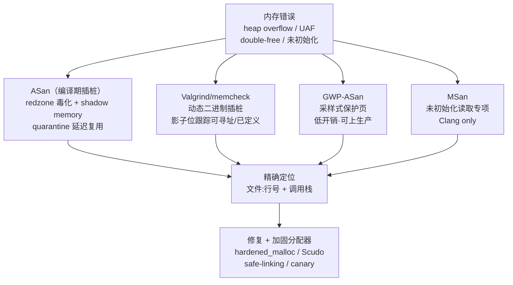

# 内存与堆（13）· 内存安全与调试

## 概述与定位

> [!abstract] TL;DR
> 本篇是《内存管理与堆分配器》系列的**收官章**。前 12 篇系统拆解了堆分配器的内部结构——从虚拟内存/`brk`/`mmap` 到 `malloc_chunk` 字节布局、bins/tcache 组织、`malloc`/`free` 决策链，再到 tcmalloc/jemalloc/内核 buddy-slab 的对比——本篇将这些知识"反向"运用：**理解内存错误为何会破坏分配器元数据，以及如何用工具检测、用加固分配器防御**。核心结论：读懂分配器内部结构，你就能理解 heap overflow/UAF/double-free 为何危险、ASan redzone 拦截在哪一层、safe-linking 怎样让 tcache 毒化变难。

本篇定位**安全研究/防御与分析视角**：讲清各类内存错误的成因与检测原理，面向自有程序内存安全评估与 CTF；**不提供针对真实第三方系统的武器化利用链**。与 [[33.二进制漏洞与利用基础/14.安全开发与防御.md|33 系列 14 篇"安全开发与防御"]] 互补——那边是利用基础与 SDLC 视角，这边是分配器内部原理与防御机制原理。

---

## 原理与机制

### 内存错误如何破坏元数据与对象

堆分配器的"阿喀琉斯之踵"在于：**元数据（`malloc_chunk` header、bins 链表指针、tcache key）与用户数据紧邻存放**。一旦用户数据越界或生命周期出错，分配器自身的内部状态就可能被悄悄污染，轻则崩溃，重则被利用。

下面逐一梳理六类常见内存错误的**成因与危害**（防御视角，关注元数据破坏路径，不展开利用步骤）：

#### 1. Heap Overflow（堆溢出）

**成因**：向堆上的缓冲区写入超过其分配大小的数据，例如 `memcpy(dst, src, n)` 中 `n` 大于 `dst` 的实际分配长度。

**对分配器元数据的破坏**：

```
+------------------+      chunk A（已分配，大小 0x40）
| prev_size (8B)   |
| size | flags(8B) |  ← PREV_INUSE 等标志位
| user data...     |
| ...              |  ← 越界写在此处开始
+------------------+      chunk B header
| prev_size (8B)   |  ← 被覆盖：溢出数据写入此字段
| size | flags(8B) |  ← PREV_INUSE 被篡改 → free 时合并判断出错
| (user data B...) |
+------------------+
```

chunk A 的用户数据区溢出，会直接覆盖紧邻的 chunk B 的 `prev_size` 和 `size` 字段（含 `PREV_INUSE=0x1`、`IS_MMAPPED=0x2`、`NON_MAIN_ARENA=0x4` 标志）。后续 `free(B)` 时，glibc 根据被篡改的 `size` 和 `PREV_INUSE` 决定是否向前/向后合并，可能触发非法内存访问或错误地将仍在使用的内存"放回"分配池。

**典型场景**：`off-by-one`（见下文）、`strcpy` 无长度限制、整数溢出导致 `malloc(n*size)` 分配不足。

#### 2. Use-After-Free（UAF，释放后使用）

**成因**：指针在 `free()` 后未置 NULL，后续代码仍通过该"悬空指针（dangling pointer）"读写已释放的内存区域。

**对分配器元数据的破坏**：

```
malloc_chunk（已释放，进入 tcache）:
  user data 区域 = tcache_entry { next; key }
  ← 用户通过悬空指针写入此区 → next/key 被污染
```

释放后，ptmalloc 将 chunk 放入 tcache（glibc ≥ 2.26）或 fastbin，此时 user data 区域被**复用为链表指针**（`tcache_entry.next` 和 `tcache_entry.key`，或 fastbin 的 `fd`）。通过悬空指针写入，实质上是在修改分配器的内部链表——后续 `malloc` 从该链表取 chunk 时，会把污染的地址当成合法的 chunk 指针使用。

UAF 危害的关键：**用户态"看起来是数据区"的字节，在已释放状态下是分配器的控制数据**。

#### 3. Double-Free（重复释放）

**成因**：同一个指针被 `free()` 两次，或两个指针指向同一块内存且均被 `free()`。

**对分配器元数据的破坏**：将同一个 chunk 插入空闲链表两次，形成**循环链**：

```
tcache bin: head → chunk_X → chunk_X → （循环）
```

glibc ≥ 2.29 的 tcache 引入 `key` 字段（`tcache_entry.key = tcache_perthread_struct` 地址）来检测 double-free：`free()` 时若发现 chunk 的 `key` 字段等于当前 `tcache` 结构地址，则判定为 double-free 并 `abort()`。但 key 检测仅是运行期守卫，不能阻止 key 本身被 UAF 篡改后绕过——因此根本解决在于工具检测与 RAII 实践（见后文）。

详见 [[08.tcache机制]] 中对 `tcache_entry.key` 的分析。

#### 4. Off-by-One（差一错误）

**成因**：循环上界差一（`i <= n` 而非 `i < n`）、字符串缺少 NUL 终止符空间（`char buf[n]` 存 n 个字符忘记 `\0`）等，导致恰好多写一个字节。

**对分配器元数据的破坏**：

chunk 大小按 **16 字节对齐**，header 紧邻 user data。off-by-one 写入的"多出的一个字节"，精确地落在下一个 chunk header 的 **`size` 字段低字节**：

```
chunk A user data: [0x00 ... 0x3f]  （0x40 字节）
chunk B header:    [0x00 ... 0x40][0x71 ...]
                      ↑ 最低字节可被 off-by-one 覆盖
```

修改 `size` 低字节可以改变 chunk B 的大小（含 `PREV_INUSE` 标志位），从而影响 glibc 的合并逻辑与 bin 归属判断。这是著名的 **off-by-one null byte** 场景，在实际代码中最常见于 NUL 终止符写越界（`buf[n] = '\0'`，`buf` 分配了 n 字节）。

#### 5. 未初始化读取（Uninitialized Read）

**成因**：使用 `malloc`（非 `calloc`）分配内存后，未初始化就读取其内容。ptmalloc 分配的内存**不清零**（`calloc` 是特例，会调用 `memset` 或 `mmap` 零页），可能包含上次分配时留下的残余数据（含旧的指针值、密钥、cookie 等）。

**危害**：
- **信息泄露**：残余内容可能是旧 chunk 的 `fd`/`bk` 指针（堆地址），通过读取泄露堆布局。
- **逻辑错误**：程序根据垃圾值做分支判断，行为不可预测，且难以复现（依赖分配器内部状态）。

未初始化读取不直接破坏分配器元数据，但常与 UAF 配合形成信息泄露链。

#### 6. 内存泄漏（Memory Leak）

**成因**：分配的内存在不再需要时未被释放，或指向分配内存的最后一个指针被覆盖/超出作用域，导致该内存既不能被程序使用，也不会被分配器回收。

**危害**：
- 程序持续运行时堆空间耗尽，最终 OOM（`malloc` 返回 NULL 或触发 OOM killer）。
- 对分配器内部状态的直接破坏较小，但大量泄漏会导致 `top chunk` 耗尽后频繁向内核申请新内存（`mmap`/`brk`），增大内存压力，在容器/嵌入式场景下尤为致命。

---

### 检测原理总览



---

## 检测工具详解

### ASan（AddressSanitizer）

ASan 是 LLVM/GCC 内置的编译期插桩工具，用于精确捕获堆/栈/全局对象的内存越界、UAF、double-free 等错误。

#### Shadow Memory（影子内存，1/8 比例映射）

ASan 在程序启动时分配一块**影子内存**，大小为应用内存的 **1/8**（一个字节的影子对应应用的 8 个字节）：

```
应用地址空间（64 字节示例）:
  [0x00 .. 0x07]  [0x08 .. 0x0f]  [0x10 .. 0x17] ...
       ↓                ↓                ↓
  shadow[0x00]    shadow[0x01]    shadow[0x02]   ...（1/8 压缩）
```

影子字节的含义：
- `0x00`：对应的 8 字节**全部可访问**（正常堆对象内部）。
- `0x01～0x07`：前 k 字节可访问，后 `8-k` 字节是 redzone（不可访问）。
- 负值（`0x80`、`0xf1` 等）：特殊毒化标记，如堆 redzone、freed memory、stack redzone 等。

每次内存访问前，ASan 插桩的代码检查对应影子字节；若为毒化状态，立即报告错误并打印调用栈。

#### Redzone（红区，毒区）

ASan 在每个堆对象**前后**插入 redzone（通常 8～32 字节），并将其影子字节设为毒化值：

```
+-------------------+      ← malloc 实际起点
|  left redzone     |  ← 影子 = 0xfa（heap left redzone）
+-------------------+      ← 返回给用户的指针
|  user object      |  ← 影子 = 0x00（可访问）
+-------------------+
|  right redzone    |  ← 影子 = 0xfb（heap right redzone）
+-------------------+
```

heap overflow（哪怕只越界 1 字节）进入 right redzone，立即触发报告：

```
==PID==ERROR: AddressSanitizer: heap-buffer-overflow
WRITE of size 1 at 0x... thread T0
    #0 0x... in vuln_write /path/vuln.c:12
    #1 0x... in main /path/vuln.c:30
```

> [!warning] 示例输出为示意
> 实际地址与偏移因平台/版本而异。

#### Quarantine（隔离区，延迟复用）

ASan 不立即将 `free()` 的内存还给分配器，而是先放入**隔离队列（quarantine）**，并将对应影子字节设为毒化（`0xfd`，freed heap region）。在隔离期内，若悬空指针访问该内存，ASan 立即报告 UAF：

```
==PID==ERROR: AddressSanitizer: heap-use-after-free
READ of size 8 at 0x602000000010 thread T0
    #0 in dangling_read vuln.c:20
  previously freed by thread T0:
    #0 in main vuln.c:15
  originally allocated by thread T0:
    #0 in main vuln.c:10
```

隔离队列的容量有限（默认 256MB），当队列满后最旧的 chunk 才真正归还——这就是"延迟复用"的含义。

#### 编译与开销

```bash
# 开启 ASan（+ UBSan 联用效果更佳）
gcc -fsanitize=address -g -O1 -o target target.c
# 或
clang -fsanitize=address,undefined -g -O1 -o target target.c
```

ASan 的运行期开销约为**原始速度的 2 倍**，内存开销约 2 倍（shadow + redzone + quarantine）。**不适合生产构建**，用于 CI/开发阶段。

---

### Valgrind / memcheck

Valgrind 通过**动态二进制插桩（Dynamic Binary Instrumentation）**，在运行时把所有机器指令翻译成带影子检查的等价代码，无需重新编译（仅建议加 `-g` 以获得符号信息）。

memcheck 工具维护两种影子位：
- **V 位（Valid/Defined）**：记录每字节是否已被初始化（可读取有效值）。
- **A 位（Addressable）**：记录每字节是否在合法的可寻址内存范围内。

对比 ASan 的核心差异：

| 维度 | ASan | Valgrind/memcheck |
|---|---|---|
| 插桩时机 | **编译期** | **运行期（JIT 翻译）** |
| 需要重编译 | 是 | 否（仅加 `-g`） |
| 运行开销 | 约 **2×** | 约 **10～50×** |
| 未初始化检测 | 需配合 MSan | 内建（V 位） |
| 精确度 | 高（redzone + shadow） | 高（位级跟踪） |
| 适用场景 | CI / 日常测试 | 专项深度调试 |

```bash
# 典型用法（检测 UAF + 内存泄漏 + 未初始化读）
valgrind --tool=memcheck \
         --leak-check=full \
         --track-origins=yes \
         --show-leak-kinds=all \
         ./target args
```

> [!warning] 示例输出为示意
> ```
> ==PID== Invalid read of size 8
> ==PID==    at 0x....: dangling_read (vuln.c:20)
> ==PID==  Address 0x... is 0 bytes inside a block of size 64 free'd
> ==PID==    at 0x....: free (vg_replace_malloc.c:538)
> ==PID==    by 0x....: main (vuln.c:15)
> ```

---

### MSan（MemorySanitizer）

MSan 专注于**未初始化内存读取**，是 Clang 专属工具（GCC 支持有限）：

```bash
clang -fsanitize=memory -g -O1 -o target target.c
```

MSan 对每个字节维护影子位，跟踪内存是否已被写入有效值。`malloc` 分配的内存默认为"未定义"；`calloc`、`memset`、文件读取等操作标记为"已定义"。若读取未定义字节（哪怕该字节数值上"看起来合法"），MSan 立即报告。

开销约 **3×**，与 ASan 互斥（不能同时启用）。

---

### GWP-ASan（低开销采样式保护）

GWP-ASan（Guard With Poison ASan）的设计目标是**可在生产环境运行**：

- 以**概率采样**方式（默认约 1/5000 的分配概率）为少数 chunk 启用保护页（guard page）机制。
- 被选中的 chunk 放置于两个不可访问的保护页（`PROT_NONE`）之间，一旦越界访问触发 `SIGSEGV`，记录现场。
- 开销极低（CPU 开销 < 0.1%，内存开销 < 1%），适合长期线上运行。

GWP-ASan 不能保证捕获所有错误（采样式），但在生产环境中能持续积累罕见路径的崩溃样本。Android 和 ChromeOS 已默认启用。

---

### 工具对比速查表

| 工具 | 检测范围 | 开销 | 生产可用 | 需重编译 |
|---|---|---|---|---|
| **ASan** | heap/stack/global overflow、UAF、double-free、内存泄漏（含 LSan） | ~2× | 否 | 是 |
| **MSan** | 未初始化读取 | ~3× | 否 | 是（Clang） |
| **UBSan** | 整数溢出、非法移位、空指针解引用等 UB | ~1.2× | 慎用 | 是 |
| **Valgrind/memcheck** | heap 错误、未初始化读、内存泄漏（覆盖最全） | ~10～50× | 否 | 否 |
| **GWP-ASan** | heap overflow、UAF（采样式） | < 0.1% | **是** | 否（运行时集成） |
| **Electric Fence** | 越界（精确到页边界） | 极高（每个 chunk 占一页） | 否 | 否 |

---

## 加固分配器与安全编码

### 加固分配器

#### glibc 的 tcache key 与 safe-linking

glibc 在默认分配器上逐版本叠加防御：

**tcache key（glibc ≥ 2.29）**：`tcache_entry.key` 存储当前线程 `tcache_perthread_struct` 的地址。`free()` 时检查待释放 chunk 的 `key` 字段：若等于当前 tcache 地址，判定为 double-free 并 `abort()`。这是第 [[08.tcache机制]] 章中详述的防 double-free 机制。

**safe-linking（glibc ≥ 2.32）**：tcache/fastbin 的 `fd` 指针存储前先做异或混淆：

```c
/* 写入链表时 */
e->next = PROTECT_PTR(&e->next, next);
/* 即 */
e->next = ((uintptr_t)(&e->next) >> 12) ^ (uintptr_t)next;

/* 读取时还原 */
next = REVEAL_PTR(e->next);
/* 即 */
next = ((uintptr_t)(e->next)) ^ ((uintptr_t)(&e->next) >> 12);
```

`PROTECT_PTR` 将存储位置的地址右移 12 位（去掉页内偏移，保留页帧号）后与 `fd` 异或存储。攻击者若想伪造 `fd` 指向任意地址，必须先知道 chunk 自身的地址（需地址泄漏），大幅提高了 tcache poisoning 的门槛。详见 [[08.tcache机制]]。

---

#### hardened_malloc（GrapheneOS）

hardened_malloc 是 GrapheneOS 为 Android 开发的高安全性用户态分配器，设计目标是**把利用内存错误的难度提升到接近不可行**。核心安全机制：

**强随机化**：
- Chunk 在 size class 内的偏移以密码学随机数决定，无法预测相邻布局。
- 每次分配的地址引入随机偏移，降低堆喷射（heap spray）精准度。

**元数据与数据分离**：
- chunk header 和用户数据**不在同一内存区域**，heap overflow 无法直接覆盖分配器的内部元数据——这是与 glibc"header 紧邻 user data"设计的根本区别。

**Slab 内置 canary**：
- 每个 slab（size class 的分配单元）内，chunk 尾部插入 canary 字节；`free()` 时检验 canary，检测溢出。

**隔离与零化**：
- 释放的 chunk 先清零再放回 slab，防止残余数据泄漏。
- 不同 size class 的 slab 物理隔离，跨 size class 的越界更难触达有效对象。

---

#### Scudo（LLVM / Android 默认分配器）

Scudo 是 LLVM compiler-rt 的一部分，Android NDK 和 Fuchsia 的默认分配器：

**Chunk header checksum**：每个 chunk 的 header 存储一个**校验和**（包含分配类、大小和一个随机 cookie），`free()` 时验证 checksum：

```c
/* 示意（非精确源码） */
struct ScudoChunk {
    uint64_t header;  /* checksum | size_class | state | random_cookie */
};
/* free() 时：recompute_checksum(chunk) != chunk->header.checksum → abort() */
```

overflow 覆盖 chunk header 后，checksum 校验失败，立即终止进程。

**Quarantine**：Scudo 默认启用释放后隔离（quarantine），减少 UAF 窗口。

**线程本地缓存**：类似 tcache 的 per-thread cache，含 chunk 随机化与校验，比 glibc 更激进的防御设计。

---

#### 分配器安全特性对比

| 分配器 | 元数据/数据分离 | Canary/Checksum | 随机化 | 默认场景 |
|---|---|---|---|---|
| **glibc ptmalloc2** | 否（header 紧邻 user data） | 否（tcache key 防 double-free） | safe-linking（≥2.32） | Linux 通用 |
| **Scudo** | 部分（chunk header checksum） | checksum | 随机 cookie | Android NDK / Fuchsia |
| **hardened_malloc** | 是（slab 元数据独立）| canary | 强随机（密码学 RNG） | GrapheneOS Android |
| **tcmalloc** | 部分（span metadata 独立） | 否 | 否 | Google 服务端 |
| **jemalloc** | 是（run/extent metadata） | 否（需 `--enable-opt.redzone`）| 随机偏移 | FreeBSD / Firefox |

---

### 安全编码实践

#### RAII 与智能指针（根治 UAF / double-free）

RAII（Resource Acquisition Is Initialization）是 C++ 最重要的内存安全范式：对象的生命周期与作用域绑定，离开作用域时析构函数自动释放资源，从根本上消除"忘记 free"和"double-free"的可能：

```cpp
/* ❌ C 风格：容易 UAF / double-free / 泄漏 */
void bad() {
    char *buf = (char*)malloc(64);
    // ... 若中途 return 或 throw → 泄漏
    // 若 free 两次 → double-free
    free(buf);
}

/* ✅ RAII：unique_ptr 自动管理，离开作用域唯一释放 */
#include <memory>
void good() {
    auto buf = std::make_unique<char[]>(64);
    // 自动释放，不可能 double-free，也不可能泄漏
}
```

更高层：`std::vector`、`std::string`、`std::array` 等容器自带边界检查（`at()` 方法），彻底替代手动管理的 C 数组，是消除 off-by-one 和 heap overflow 的最直接方式。

---

#### Sanitizer 进 CI

```bash
# CMake 示例：Debug 构建默认开 ASan + UBSan
cmake -DCMAKE_BUILD_TYPE=Debug \
      -DCMAKE_C_FLAGS="-fsanitize=address,undefined -g" \
      -DCMAKE_CXX_FLAGS="-fsanitize=address,undefined -g" \
      ..

# 或 Makefile 构建
CFLAGS = -fsanitize=address,undefined -g -O1
```

CI 中 ASan 发现的任何报告应视为**阻塞性错误**（block-on-error），不能合并到主分支。

---

#### `_FORTIFY_SOURCE`

`_FORTIFY_SOURCE=2`（或 `=3`）让编译器为 `memcpy`、`strcpy`、`sprintf` 等函数插入运行期长度检查——若目标缓冲区大小在编译期可知且源长度超过目标，立即 `abort()`：

```bash
gcc -D_FORTIFY_SOURCE=2 -O1 -o target target.c
# 注意：FORTIFY 需要 -O1 及以上才能分析缓冲区大小
```

FORTIFY 是零成本（< 0.1% 开销）的安全层，但仅覆盖"目标大小编译期可知"的场景。

---

#### 完整编译加固模板

```bash
# C/C++ 生产构建（Linux GCC/Clang）
CFLAGS="-O2 \
        -D_FORTIFY_SOURCE=2 \
        -fstack-protector-strong \
        -fstack-clash-protection \
        -fPIE \
        -Wformat-security \
        -Werror=format-security"

LDFLAGS="-pie \
         -Wl,-z,relro,-z,now \
         -Wl,-z,noexecstack"

# 可选：Intel CET（需硬件 + 内核支持）
CFLAGS+=" -fcf-protection=full"

# 可选：ASan（仅 CI/测试构建，不用于生产）
CFLAGS+=" -fsanitize=address,undefined -g"
```

---

## 安全性与正确使用

### 防御建议清单

| 层次 | 操作 | 目的 |
|---|---|---|
| **源码** | 使用 `std::vector`/`std::string`/RAII，不裸 `malloc`/`free` | 根治 UAF / double-free / 泄漏 |
| **源码** | `malloc` 后检查返回值是否为 NULL | 避免空指针解引用 |
| **源码** | `free(ptr); ptr = NULL;` | 减少 UAF 窗口（C 代码兜底措施） |
| **源码** | 使用 `calloc` 或 `memset` 初始化堆内存 | 消除未初始化读取 |
| **源码** | 对所有缓冲区操作严格校验长度 | 防止 heap overflow / off-by-one |
| **编译** | `-D_FORTIFY_SOURCE=2 -fstack-protector-strong -fPIE -Wl,-z,relro,-z,now` | 系统性编译加固 |
| **编译** | `-Wformat-security -Werror=format-security` | 防格式化字符串漏洞 |
| **CI** | `-fsanitize=address,undefined` 进每次 CI 构建 | 自动捕获内存/UB 错误 |
| **CI** | Valgrind 专项运行（`--track-origins=yes`） | 深度检测未初始化读 |
| **CI** | Fuzzing（AFL++ / libFuzzer + ASan）| 发现深层边界条件 |
| **部署** | 使用 Scudo 或 hardened_malloc 替换系统分配器 | 加固分配器元数据完整性 |
| **部署** | GWP-ASan 上线（Android/ChromeOS 默认） | 生产环境低开销持续检测 |
| **验收** | `checksec --file=./binary` 确认加固项全绿 | 快速审计二进制安全属性 |

---

### 合规边界

> [!warning] 合规边界声明
> 本章所有内容（内存错误成因分析、检测工具用法、分配器内部原理）仅适用于：
> - **自有程序**的内存安全评估与调试
> - **授权的安全研究**（渗透测试合同、漏洞赏金范围内）
> - **CTF 竞赛**题目练习
>
> **禁止**将上述知识组合成针对他人系统的武器化利用链，**禁止**在未授权的目标上实施任何内存漏洞探测或利用。违反上述边界可能触犯《网络安全法》、《计算机信息网络国际联网安全保护管理办法》等法规。

---

## 小结

本篇是《内存管理与堆分配器》系列的收官章，将前 12 篇的知识从"分配器如何工作"延伸到"出错时发生了什么、如何检测和加固"。

核心脉络：

**理解分配器内部结构（前 12 章）→ 为何会出内存错误 → 如何检测与加固**

具体来说：
- 读懂 `malloc_chunk` 的 `prev_size`/`size`/`fd`/`bk` 布局（第 06 章），就能理解 heap overflow 为何能篡改合并逻辑；
- 理解 tcache 将 user data 区复用为 `tcache_entry.next`/`key`（第 08 章），就能理解 UAF 为何可以污染分配器链表；
- 掌握 glibc 分配器的单片式布局（header 紧邻数据），才能理解 hardened_malloc 元数据分离和 Scudo checksum 的设计动机；
- 知道 tcache key 和 safe-linking 的实现（第 08 章），才能准确评估"这些防御把利用难度提高了多少"。

检测工具的选型原则：**开发/CI 用 ASan（精确、快速）；深度调试用 Valgrind（无需重编）；生产用 GWP-ASan（低开销）；未初始化专项用 MSan**。

加固的层次：从安全编码（RAII/`_FORTIFY_SOURCE`）、编译选项（`-fsanitize`/PIE/RELRO）到分配器替换（Scudo/hardened_malloc），每一层都是独立的防御纵深——没有任何单点能挡住所有错误，纵深叠加才是正确答案。

系列至此完结。如需深入每类防护机制的实现原理，请接续 [[34.现代二进制防护机制/00.现代二进制防护机制总览.md|系列 34：现代二进制防护机制]]；如需对照堆漏洞的利用视角，请参考 [[33.二进制漏洞与利用基础/09.堆管理基础.md|33 系列 09 堆管理基础]] 与 [[33.二进制漏洞与利用基础/10.堆漏洞入门.md|33 系列 10 堆漏洞入门]]。

---

## 相关阅读

- [[33.二进制漏洞与利用基础/14.安全开发与防御.md]] — 安全编码规则、编译加固与 SDLC 安全流程（互补）
- [[34.现代二进制防护机制/00.现代二进制防护机制总览.md]] — 栈 canary/PIE/RELRO/CET 等防护机制系统讲解
- [[08.tcache机制]] — tcache_entry.key（防 double-free）与 safe-linking（防 tcache poisoning）详解
- [[06.ptmalloc2的chunk结构]] — `malloc_chunk` 字节布局，理解内存错误如何破坏元数据的前提
- [[09.malloc与free分配释放流程]] — 分配/释放决策链，理解合并错误（off-by-one/overflow）的上下文
- [[33.二进制漏洞与利用基础/09.堆管理基础.md]] — 堆管理利用视角（与本篇防御视角互为表里）
- [[33.二进制漏洞与利用基础/10.堆漏洞入门.md]] — UAF/double-free/堆溢出利用视角

---

⬅️ 上一篇 [[12.内核分配器与其他分配器]] ｜ 🏠 [[00.内存管理与堆分配器总览]]
